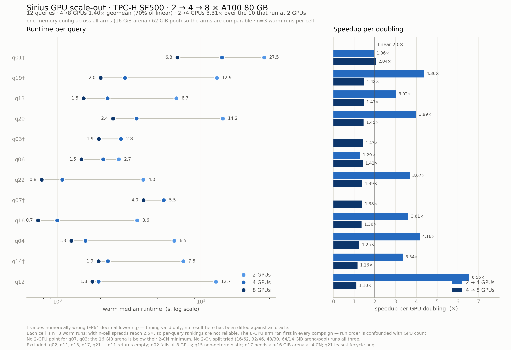

# Study 1 — GPU scale-out, TPC-H SF500 on 8× A100-SXM4-80GB

**Engine A** = Sirius as a StarRocks compute node, one CN per GPU.
**Data** = `/home/ubuntu/tpch_parquet_sf500` — 132 GB compressed parquet, ~3.0 B lineitem rows,
read through `FILES()` with no load step.
**Box** = 8× A100-SXM4-80GB, NV12 all-to-all, 240 cores / 2 NUMA nodes, 1771 GB RAM,
driver 570.148.08 + CUDA-13 forward-compat.

Run 2026-08-12. Config search: [`CONFIGURATIONS.md`](CONFIGURATIONS.md) · raw data:
[`results/`](results/) · figure: `python3 plot_study1.py`.

> Every number here was re-derived from the CSVs by an independent adversarial verification
> pass. Claims that pass did not survive are marked and corrected in place; see
> [What this does not establish](#what-this-study-does-not-establish), which is the most
> important section of this document.

---

## Headline



Over the **10 queries that pass every run in all three arms**:

| Step | Geomean | Ideal | Efficiency |
|---|---|---|---|
| 2 → 4 GPUs | **3.31×** | 2.00× | 166% — superlinear |
| 4 → 8 GPUs | **1.39×** | 2.00× | 70% |
| 2 → 8 GPUs | **4.62×** | 4.00× | 116% |

Wall time over that set: **98.2 s → 32.6 s → 20.7 s**.

Scaling is **not linear and not one regime**: a large superlinear gain from 2→4, then a
sublinear one from 4→8. Quoting "4.6× on 8 GPUs" without that split misrepresents the curve.

**Read the caveats before quoting any of this.** Three are load-bearing: every failure below
is a single non-replicated trial; the 8-GPU arm ran first in every campaign, which flatters
scaling; and a repeat campaign measured the *identical* cells **2.0–2.2× slower**, which is
larger than most effects reported here.

---

## Which figure to quote for 4 → 8

Two campaigns measured it and they disagree:

| Campaign | Config | Queries | 4→8 geomean |
|---|---|---|---|
| Uniform | 16 GiB arena / 62 GiB pool, all arms | 12 | **1.40×** |
| Per-arm validated | 8 GPU 12/66 · 4 GPU 24/54 | 13 | **1.52×** |

On the **12 queries measured in both**, the same shift appears (1.396 → 1.519), so it is not
a composition artifact. But it is **not attributable to the better sizing either**, because the
two campaigns are not comparable: all 12 common cells at both arm sizes are slower in the later
campaign (geomean **2.04× at 8 CN**, **2.22× at 4 CN**, every single cell). At 8 CN the later
campaign had the *larger* pool (66 vs 62 GiB), so configuration cannot explain a slowdown.

**Quote 4→8 as a range — 1.40× to 1.52× — and treat the difference as unattributed.**

Re-sizing did improve coverage, but by less than first claimed: under the uniform config **12**
queries already passed at both 4 and 8 CN. Re-sizing added exactly **one** (q17).

---

## Per-query scaling

Warm medians (ms), uniform campaign, n=3 per cell:

| Query | 2 GPU | 4 GPU | 8 GPU | 2→4 | 4→8 | 2→8 |
|---|---:|---:|---:|---:|---:|---:|
| q01 ⚠ | 27,457 | 13,989 | 6,848 | 1.96 | **2.04** | 4.01 |
| q04 | 6,524 | 1,567 | 1,253 | 4.16 | 1.25 | 5.21 |
| q06 ⚠ | 2,681 | 2,082 | 1,471 | 1.29 | 1.42 | **1.82** |
| q12 | 12,692 | 1,938 | 1,754 | **6.55** | **1.10** | **7.24** |
| q13 | 6,737 | 2,234 | 1,522 | 3.02 | 1.47 | 4.43 |
| q14 ⚠ | 7,523 | 2,250 | 1,935 | 3.34 | 1.16 | 3.89 |
| q16 | 3,591 | 995 | 732 | 3.61 | 1.36 | 4.91 |
| q19 ⚠ | 12,883 | 2,956 | 2,001 | 4.36 | 1.48 | 6.44 |
| q20 | 14,185 | 3,553 | 2,442 | 3.99 | 1.45 | 5.81 |
| q22 ⚠ | 3,966 | 1,080 | 776 | 3.67 | 1.39 | 5.11 |
| **geomean** | | | | **3.31** | **1.39** | **4.62** |
| **totals** | 98,239 | 32,644 | 20,734 | 3.01 | 1.57 | 4.74 |

q03 (2.8 s → 1.9 s) and q07 (5.5 s → 4.0 s) appear in the figure with **no 2-GPU point**: the
uniform 16 GiB arena is below their 2-CN minimum.

**Outliers.** **q12** holds both the best 2→8 (7.24×) and the worst 4→8 (1.10×) — all its gain
is in the first step, and its 2-GPU cell is bimodal ({12693, 7709, 12692} ms); taking the min
instead of the median moves its 2→4 from 6.55× to 3.98×, so that headline turns on one run.
**q06** is the worst 2→8 at 1.82×, and its 2→4 (1.29×) is *smaller* than its 4→8 (1.42×) —
no single-serial-fraction Amdahl model can produce that, so do not fit one.

**The 2→4 superlinearity is real but unexplained.** Not outlier-driven: removing q12 *and* q19
still leaves **2.94×**, and 8 of 10 queries exceed 2.0×. The obvious hypothesis — that the
2-GPU arm spills or downgrades — **could not be tested**: the driver log records only wall
time, and the CN engine logs that carry `downgrade`/OOM lines are truncated on every cluster
restart, with the earliest surviving line (17:30:54) postdating the 2-CN arm. Downgrade is also
invisible to the harness — a query stuck in the engine's 100-retry OOM loop still records
`pass`, just with a larger `ms`. What *is* visible cuts against the story: the two
full-lineitem-scan queries show the *smallest* 2→4 gains (q01 1.96×, q06 1.29×). Open question;
re-run with CN logs preserved to settle it.

---

## Coverage

| Query | 8 GPU | 4 GPU | 2 GPU |
|---|---|---|---|
| q01 ⚠ q04 q06 ⚠ q12 q13 q14 ⚠ q16 q19 ⚠ q20 q22 ⚠ | pass | pass | pass |
| q03 ⚠ · q07 ⚠ | pass | pass | ❌ arena |
| q17 | pass | ❌ arena | ❌ arena |
| q02 | ❌ timeout | pass | pass |
| q15 | pass | ❌ empty r2 | ❌ empty r1 |
| q21 | ❌ arena | ❌ arena | ❌ arena |
| q11 | ❌ empty | ❌ empty | ❌ empty |

The pass **count** is monotone (14/17 → 13/17 → 11/17) and the four queries that drop out as
GPUs are removed (q03, q07, q17, q15) are exchange-heavy. But **the sets are not nested** —
q02 moves the other way, passing at 2 and 4 GPUs and failing at 8. And **every ❌ is a single
trial**: `bench.sh` restarts the cluster and abandons a query after its first failed run, so
these rates rest on non-replicated observations, one of which (q15) the study itself calls
non-deterministic.

`q05 q08 q09 q10 q18` were **never attempted** — excluded by design. They are absent, not
passing, and must not enter any denominator.

---

## The staging arena

Full derivation in [`CONFIGURATIONS.md`](CONFIGURATIONS.md). The arena is a bare `cudaMalloc`
region **outside** the RMM pool, so `GPU_MEM = 80 GiB − arena − ~2 GiB`.

Measured minima: **12 GiB at 8 CN** (fails at 8, passes at 12) and **24 GiB at 4 CN** (fails at
16, passes at 24). Failing-lease sizes are consistent with per-lease doubling as the node count
halves — q17 4→2 = **2.00**, q21 4→2 = **2.00**, q17 8→4 = **1.94** — with one exception,
**q21 8→4 = 1.25**.

**Do not read this as a law.** Each ratio is a single failed allocation. The bracket is
circular: the two search grids were `8,12,16` and `16,24,32`, the second built as 2× the first,
so a 2× answer was baked in. And the stated mechanism does not imply the rule — the arena must
hold the **sum of concurrent leases**, so per-lease 1/N growth only gives 1/N total demand if
the lease count is N-independent, and it is not: q21 held **82 / 50 / 15** leases at 8 / 4 / 2
CN. Treat `staging(N) ≈ 96 GiB / N` as a rule of thumb fitted to two points, not a law.

At refusal the arena is 97.7–99.4% full with 9–82 concurrent leases, so the requirement is
**tens of times** any single lease, not hundreds. The untruncated diagnostic (from
`/tmp/bench/sf500-8cn/q21.r0.out`; `bench.sh` truncates at 160 characters, exactly where the
deciding numbers begin):

```
exchange staging arena exhausted: requested 260369088 bytes (260369152 aligned),
242867200 free of 17179869184 capacity with 82 leases outstanding
(raise SIRIUS_EXCHANGE_STAGING_BYTES)
```

**q17 sets the arena minimum at every CN count, and it is arena-limited, not pool-limited.**
Within a fixed CN count it is monotone in arena: at 8 CN it fails at 8 GiB — *with the largest
pool, 70 GiB* — and passes at 12 and 16 GiB; at 4 CN it fails at 16 and passes at 24 and 32.

**2 GPUs did not work at any split tried.** Four were tested — 16/62, 32/46, 48/30, 64/14 GiB
arena/pool — and none runs q03, q07 and q17 together. q03 alone traces the squeeze: refused at
16 GiB (arena starved), passes at 48 GiB (37.8 s), backend dies at 64 GiB (pool starved). At
32/46 the pool starves differently — q04 took **211 s cold** against 6.5 s under the uniform
config, and q01 refused. Splits between 16 and 48 GiB were not tried, so "no split works" is
**inference, not measurement**. The CN logs show the mechanism for the 48/30 failures: a
continuous OOM-retry stream (`reschedule (retry 1/100) … OOM at operator GPU_SCAN`) — q17 was
**livelocked, not hung**, and the 64/14 q07 refusal terminates explicitly with
`task 814 … exceeded 100 retries … terminating query`.

---

## Defects

| Query | Behaviour | Category |
|---|---|---|
| **q21** | refused at 8/4/2 GPU | **lease lifecycle** — fails where its lease is *smallest*; 82 leases outstanding at refusal with the arena 98.6% full. Its 8→4 ratio (1.25) is the one that breaks the doubling pattern. No arena size clears it. |
| **q02** | ~4 s at 4 GPU, **>420 s at 8** | **negative scaling.** First seen as `ERROR 5024: Query reached its timeout of 300 seconds` — which looks like configuration. Raising the FE `query_timeout` to 900 s did **not** fix it: the query then ran past a 420 s client budget and was killed with `rc=124`, a real kill. Adding GPUs makes it **>100× slower**. Open. |
| **q11** | returns **empty in 0.9–14.9 s** at every arm | **query definition** — `FRACTION` is the SF1 literal `0.0001`; SF500 needs `0.0000002`. The threshold is 500× too high, so nothing qualifies. One-line fix. |
| **q15** | non-deterministic **empty** (4.3 s / 20.9 s) | FP64 decimal lowering destabilises a float-equality predicate |
| q01 q03 q07 q14 q19 | complete, **values wrong** | FP64 decimal lowering — `translate_arithmetic` |

### The harness mislabels fast empty results as timeouts

`bench.sh:188` prints `WEDGE/TIMEOUT (rc=$rc, cut at ${tmo}s)`, where `${tmo}` is the
**configured budget, not elapsed time**, and it reaches that branch for any zero-byte output
with **exit code 0**. q11 and q15 never hung:

| | 8 GPU | 4 GPU | 2 GPU |
|---|---|---|---|
| q11 | 1,013 ms | 940 ms | 14,874 ms |
| q15 (failing run) | — | 4,269 ms | 20,941 ms |

`rc` is the discriminator: **`rc=124` is a real kill, `rc=0` is a fast empty.** Anyone reading
"cut at 420s" as a 420-second hang will chase the wrong bug — I did, twice.

---

## What this study does *not* establish

- **Correctness — nothing here is value-checked.** `bench.sh` defines `pass` as exit code 0 and
  ≥ 1 row; it never compares values. Five queries are known wrong. Worse, byte-comparing the
  `.out` files shows the same FP64 lowering perturbs **q06 and q22** at the last ULP — both
  presented as clean above — and **q01 returns a different value on every run**. ⚠ marks
  queries flagged by an earlier oracle diff, not a determinism test.
- **Reproducibility at the precision quoted.** A repeat campaign measured all 12 common cells
  **2.0–2.2× slower** with equal-or-better configuration. Within a single process, `study1-8cn`
  q16 ran **772 ms cold** and 2394/2197/2152 ms warm thirty seconds later — 3× apart. Treat
  one-significant-figure differences as noise.
- **Independence of run order.** The 8-GPU arm ran first in both campaigns, and the confound
  points in the direction that flatters every scaling number. A reversed or interleaved re-run
  is needed.
- **That `ms` measures the engine.** It is a `mysql` CLI process's wall time — spawn, connect,
  auth, FE planning, and serializing the result to TSV (**3.26 MB / 72,343 rows for q20**;
  1.07 MB for q16) against 8-GPU medians of 726–776 ms. No `SELECT 1` floor was measured, so
  the small-query numbers include an unquantified constant.
- **The cause of the 2→4 superlinearity** — real, broad, and untested (see above).
- **A 1-GPU baseline.** Partial and unhealthy: q03 16.5 s and q07 21.3 s (single run), but
  **q01 refused** with an rpc backend death, and the arm was stopped mid-q07 to free the box.
- **SF1000, and Studies 2 and 3.** Not attempted. The plan requires a green SF500 oracle diff
  first, which has not been run.

### Reproducing the coverage claims from the published CSVs is not possible

`bench.sh:177` writes run 0 to the CSV **only on failure**, so cold *passes* exist only in
`results/*-raw.log`. Cold and warm are also judged under different budgets (`COLD_TIMEOUT=420`
vs `QUERY_TIMEOUT=300`), so `pass` does not mean the same thing in both phases. The two primary
arms additionally differed in FE `query_timeout` (900 s at 4 GPU, default 300 s at 8 GPU — the
`SET GLOBAL` was added between arms) and in `HOST_MEM` (100 GiB/CN at 8 GPU vs 200 at 4), so
"per-arm validated config" varies in more than arena and pool. No published cell exceeds 25 s,
so only q02's label is affected — but the asymmetry is real. Finally, the uniform campaign's
configuration is recorded in no artifact; the 16 GiB arena is corroborated only indirectly by
`17179869184 capacity` in its diagnostics.
