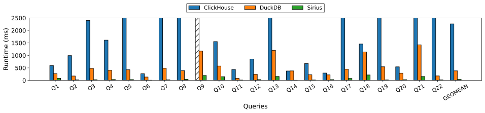

<!--  -->
<p align="center">
  
</p>

# Sirius
Sirius is a GPU acceleration layer for SQL analytics. It plugs into existing engines such as DuckDB via the standard Substrait query format, requiring no query rewrites or major system changes. Currently supports DuckDB and Doris (coming soon), other systems marked with * are on our roadmap.

<!--  -->
<p align="center">
  
</p>

## Installing dependencies

### Install duckdb dependencies
```
sudo apt-get update && sudo apt-get install -y git g++ cmake ninja-build libssl-dev
```

### Install CUDA
If CUDA is not installed, download it [here](https://developer.nvidia.com/cuda-downloads). Follow the instructions for the deb(local) installer and complete the [post-installation steps](https://docs.nvidia.com/cuda/cuda-installation-guide-linux/#mandatory-actions).

Verify installation:
```
nvcc --version
nvidia-smi
```

### Install libcudf dependencies
libcudf will be installed via conda/miniconda. Miniconda can be downloaded [here](https://www.anaconda.com/docs/getting-started/miniconda/install). After downloading miniconda, install libcudf by running these commands:
```
conda create --name libcudf-env
conda activate libcudf-env
conda install -c rapidsai -c conda-forge -c nvidia rapidsai::libcudf
```
Set the environment variables `USE_CUDF` to 1 and `LIBCUDF_ENV_PREFIX` to the conda environment's path. For example, if we installed miniconda in `~/miniconda3` and installed libcudf in the conda environment `libcudf-env`, then we would set the `LIBCUDF_ENV_PREFIX` to `~/miniconda3/envs/libcudf-env`.
```
export USE_CUDF=1
export LIBCUDF_ENV_PREFIX = {PATH to libcudf-env}
```

### Clone the Sirius repository
```
git clone --recurse-submodules https://github.com/bwyogatama/sirius.git
cd sirius
export SIRIUS_HOME_PATH=`pwd`
cd duckdb
mkdir -p extension_external && cd extension_external
git clone https://github.com/duckdb/substrait.git
cd substrait
git reset --hard ec9f8725df7aa22bae7217ece2f221ac37563da4 #go to the right commit hash for duckdb substrait extension
cd $SIRIUS_HOME_PATH
```
The `--recurse-submodules` will ensure DuckDB is pulled which is required to build the extension.

## Building
To build Sirius:
```
make -j {nproc}
```

## Generating TPC-H dataset
Unzip `dbgen.zip` and run `./dbgen -s {SF}`.
To load the TPC-H dataset to duckdb:
```
./build/release/duckdb {DATABASE_NAME}.duckdb
.read tpch_load_duckdb.sql
```

## Running Sirius
To run Sirius, simply start the shell with `./build/release/duckdb {DATABASE_NAME}.duckdb`. 
From the duckdb shell, initialize the Sirius buffer manager with `call gpu_buffer_init`. This API accepts 2 parameters, the GPU caching region size and the GPU processing region size. The GPU caching region is a memory region where the raw data is stored in GPUs, whereas the GPU processing region is where intermediate results are stored in GPUs (hash tables, join results .etc).
For example, to set the caching region as 1 GB and the processing region as 2 GB, we can run the following command:
```
call gpu_buffer_init("1 GB", "2 GB")
```

After setting up Sirius, we can execute SQL queries using the `call gpu_processing`:
```
call gpu_processing("select
  l_orderkey,
  sum(l_extendedprice) as revenue,
  o_orderdate,
  o_shippriority
from
  customer,
  orders,
  lineitem
where
  c_mktsegment = 1
  and c_custkey = o_custkey
  and l_orderkey = o_orderkey
  and o_orderdate < 19950315
  and l_shipdate > 19950315
group by
  l_orderkey,
  o_orderdate,
  o_shippriority;")
```
The cold run in Sirius would be significantly slower due to data loading from storage and format converstion from the DuckDB format to Sirius native format. Subsequent runs would be faster since it benefits from caching on GPU memory.

All 22 TPC-H queries are saved in tpch-queries.sql. To run all queries:
```
.read tpch-queries.sql
```

## Testing
Sirius provides a unit test that compares Sirius against DuckDB for correctness across all 22 TPC-H queries. To run the unittest, generate SF=1 TPC-H dataset using method described [here](https://github.com/sirius-db/sirius?tab=readme-ov-file#generating-tpc-h-dataset) and run the unittest using the following command:
```
make test
```

## Performance
Running TPC-H on SF=100, Sirius achieves ~10x speedup over existing CPU query engines at the same hardware rental cost, making it well-suited for interactive analytics, financial workloads, and ETL jobs.



## Future Roadmap
Sirius is still under major development and we are working on adding more features to Sirius, such as [storage/disk support](https://github.com/sirius-db/sirius/issues/19), [multi-GPUs](https://github.com/sirius-db/sirius/issues/18), [multi-node](https://github.com/sirius-db/sirius/issues/18), more [operators](https://github.com/sirius-db/sirius/issues/21), [data types](https://github.com/sirius-db/sirius/issues/20), accelerating more engines, and many more.

Sirius always welcomes new contributors! If you are interested, check our [website](https://www.sirius-db.com/), subscribe to our [mailing list](siriusdb@cs.wisc.edu) and join our [slack channel](https://join.slack.com/t/sirius-db/shared_invite/zt-33tuwt1sk-aa2dk0EU_dNjklSjIGW3vg).

**Let's kickstart the GPU eras for Data Analytics!**