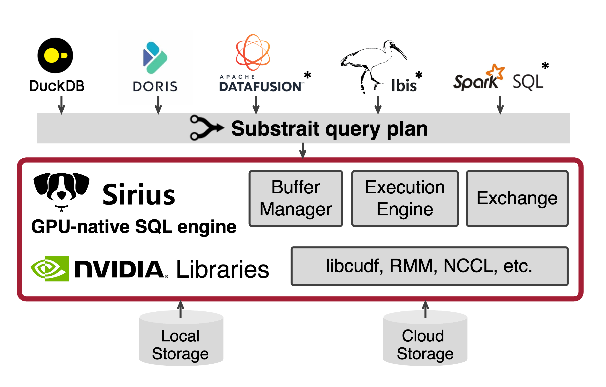
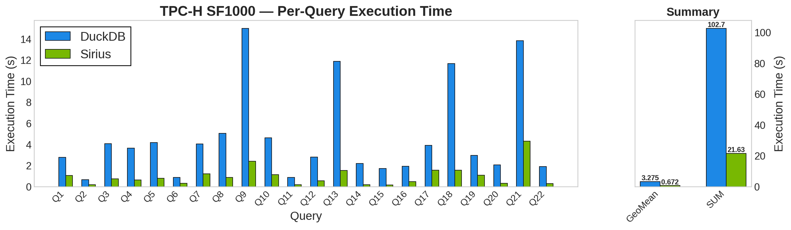

<!--  -->
<p align="center">
  
</p>

Sirius is a GPU-native SQL engine. It plugs into existing databases such as DuckDB via the standard Substrait query format, requiring no query rewrites or major system changes. Sirius currently supports DuckDB and Doris (coming soon), other systems marked with * are on our roadmap. Built on NVIDIA CUDA-X libraries including cuDF and RAPIDS Memory Manager (RMM), Sirius delivers high-performance GPU-accelerated analytics.

<!--  -->
<p align="center">
  
</p>

## Performance
Running TPC-H on SF=100, Sirius achieves ~8x speedup over existing CPU query engines at the same hardware rental cost, making it well-suited for interactive analytics, financial workloads, and ETL jobs.

Experiment Setup:
- GPU instance: GH200@LambdaLabs ($1.5/hour)
- CPU instance: c8i.8xlarge@AWS ($1.5/hour)



## Supported OS/GPU/CUDA/CMake
- Ubuntu >= 22.04
- NVIDIA Volta™ or higher with compute capability 7.0+
- CUDA >= 13.0 (requires NVIDIA driver >= 570)
- CMake >= 3.30.4 (follow this [instruction](https://medium.com/@yulin_li/how-to-update-cmake-on-ubuntu-9602521deecb) to upgrade CMake)
- libcudf (stable)
- We recommend building Sirius with at least **16 vCPUs** to ensure faster compilation.

### Requirements

- Git (to clone the repo)
- Pixi (install instructions [here](https://pixi.sh/latest/installation/))

## Building Sirius

To clone the Sirius repository:
```
git clone --recurse-submodules https://github.com/sirius-db/sirius.git
cd sirius
```
The `--recurse-submodules` will ensure DuckDB is pulled which is required to build the extension.

There is a [Pixi](https://pixi.sh/) manifest available to set up an environment with all required dependencies installed. Start a shell in the environment with:
```
pixi shell
```
The environment activation handles setting up everything needed to build and test.

To build Sirius:
```
CMAKE_BUILD_PARALLEL_LEVEL=$(nproc) make
```

Note that if building the extension consumes too much memory, try reducing the `CMAKE_BUILD_PARALLEL_LEVEL` value used when invoking `make`.

By default, only the `gpu_execution` code path is compiled. To also build the `gpu_processing` (in-memory) code path, enable the `ENABLE_LEGACY_SIRIUS` CMake option:
```
cd duckdb && cmake --preset release -DENABLE_LEGACY_SIRIUS=ON && cmake --build --preset release && cd ..
```

## Running Sirius

Sirius provides two execution paths:

- **`gpu_execution` (Recommended)** — Out-of-core execution with tiered memory management (GPU/host/disk), automatic data partitioning, and spilling. Works with **Parquet** data format.
- **`gpu_processing`** — In-memory execution where the dataset must fit in GPU memory. Works with DuckDB's native storage format.

### `gpu_execution` (Recommended)

#### Configuration

`gpu_execution` requires a config file in [libconfig++](https://hyperreckoning.com/libconfig/) format. Point to it via the `SIRIUS_CONFIG_FILE` environment variable, or place it at the default path `~/.sirius/sirius.cfg`.

Here is a minimal config file to get started:

```cfg
sirius = {
    topology = {
        num_gpus = 1;
    };
    memory = {
        gpu = {
            usage_limit_fraction = 0.5;
            reservation_limit_fraction = 1.0;
        }
        host = {
            capacity_bytes = 32000000000;
            initial_number_pools = 10;
            pool_size = 512;
            block_size = 1048576;
        };
    };
    executor = {
        pipeline = {
            num_threads = 4;
        };
        duckdb_scan = {
            num_threads = 2;
        };
        task_creator = {
            num_threads = 2;
        };
        downgrade = {
            num_threads = 1;
        };
    };
    operator_params = {
        scan_task_batch_size = 100000000;
        default_scan_task_varchar_size = 256;
        max_sort_partition_bytes = 0;
        hash_partition_bytes = 100000000;
        concat_batch_bytes = 100000000;
        max_build_hash_table_bytes = 90000000;
    };
};
```

Key configuration sections:
- **memory.gpu**: `usage_limit_fraction` controls what fraction of GPU memory Sirius may use.
- **memory.host**: Configures the host-memory spilling tier (capacity, pool layout).
- **executor**: Thread counts for pipeline execution, data scanning, task creation, and memory downgrade.
- **operator_params**: Batch sizes and memory limits for individual operators.

See the [Configuration documentation](super-sirius/configuration.md) for a full reference.

#### CLI Usage

```bash
export SIRIUS_CONFIG_FILE=/path/to/sirius.cfg
./build/release/duckdb
```

From the DuckDB shell, create views pointing to your Parquet files and run queries with `gpu_execution`:

```sql
-- Create views for parquet data
CREATE VIEW lineitem AS SELECT * FROM read_parquet('/data/lineitem/*.parquet');
CREATE VIEW orders AS SELECT * FROM read_parquet('/data/orders/*.parquet');
CREATE VIEW customer AS SELECT * FROM read_parquet('/data/customer/*.parquet');

-- Run a query on GPU
CALL gpu_execution('SELECT
    l_returnflag,
    l_linestatus,
    sum(l_quantity) as sum_qty,
    sum(l_extendedprice) as sum_base_price,
    sum(l_extendedprice * (1 - l_discount)) as sum_disc_price
FROM lineitem
WHERE l_shipdate <= date ''1998-09-02''
GROUP BY l_returnflag, l_linestatus
ORDER BY l_returnflag, l_linestatus');
```

### `gpu_processing`

`gpu_processing` is the in-memory execution path. It works with DuckDB's native storage format and requires the dataset to fit in GPU memory.

#### CLI Usage

Start the shell with `./build/release/duckdb {DATABASE_NAME}.duckdb`.
From the DuckDB shell, initialize the Sirius buffer manager with `call gpu_buffer_init`. This API accepts 2 parameters, the GPU caching region size and the GPU processing region size. The GPU caching region is a memory region where the raw data is stored in GPUs, whereas the GPU processing region is where intermediate results are stored in GPUs (hash tables, join results .etc).
For example, to set the caching region as 1 GB and the processing region as 2 GB, we can run the following command:
```
call gpu_buffer_init("1 GB", "2 GB");
```

By default, Sirius also allocates pinned memory based on the above two arguments. To explicility specify the amount of pinned memory to allocate during initialization run:
```
call gpu_buffer_init("1 GB", "2 GB", pinned_memory_size = "4 GB");
```

After setting up Sirius, we can execute SQL queries using the `call gpu_processing`:
```
call gpu_processing("select
  l.l_orderkey,
  sum(l.l_extendedprice * (1 - l.l_discount)) as revenue,
  o.o_orderdate,
  o.o_shippriority
from
  customer c,
  orders o,
  lineitem l
where
  c.c_mktsegment = 'HOUSEHOLD'
  and c.c_custkey = o.o_custkey
  and l.l_orderkey = o.o_orderkey
  and o.o_orderdate < date '1995-03-25'
  and l.l_shipdate > date '1995-03-25'
group by
  l.l_orderkey,
  o.o_orderdate,
  o.o_shippriority
order by
  revenue desc,
  o.o_orderdate
limit 10;");
```
**The cold run in Sirius would be significantly slower due to data loading from storage and conversion from DuckDB format to Sirius native format. Subsequent runs would be faster since it benefits from caching on GPU memory.**

All 22 TPC-H queries are saved in tpch-queries.sql. To run all queries:
```
.read tpch-queries.sql
```

## Generating and Loading Test Datasets

### Parquet (for `gpu_execution`)

For TPC-H benchmarking, use the provided data generation script:

```bash
cd test/tpch_performance
pixi run bash generate_tpch_data.sh 100   # generates SF100 parquet data
```

This produces partitioned Parquet files under `test_datasets/tpch_parquet_sf100/`. Then create views from the DuckDB shell:

```sql
CREATE VIEW lineitem AS SELECT * FROM read_parquet('test_datasets/tpch_parquet_sf100/lineitem/*.parquet');
-- repeat for other tables...
```

For your own data, point `read_parquet()` at any Parquet file or glob:

```sql
CREATE VIEW my_table AS SELECT * FROM read_parquet('/path/to/my_data/*.parquet');
```

### DuckDB Native Format (for `gpu_processing`)

To generate the TPC-H dataset
```
cd test_datasets
unzip tpch-dbgen.zip
cd tpch-dbgen
./dbgen -s 1 && mkdir -p s1 && mv *.tbl s1  # this generates dataset of SF1
cd ../../
```

To load the TPC-H dataset to duckdb:
```
./build/release/duckdb {DATABASE_NAME}.duckdb
.read scripts/tpch_load.sql
```

### ClickBench Dataset

To download the dataset run:
```
cd test_datasets
wget https://pages.cs.wisc.edu/~yxy/sirius-datasets/test_hits.tsv.gz
gzip -d test_hits.tsv.gz
cd ..
```

To load the dataset to duckdb:
```
./build/release/duckdb {DATABASE_NAME}.duckdb
.read scripts/clickbench_load_duckdb.sql
```

## Correctness Testing

### SQLLogic Tests

Sirius provides a unit test that compares Sirius against DuckDB for correctness across many test queries. Note that these tests are meant to be end to end tests as they run SQL queries using Sirius and compare that against the expected result. To run the unittest, generate the datasets using the method described [here](#generating-and-loading-test-datasets) and run the unittest using the following command:
```
make test
```

To run a specific test run the command from the root directory:
```
CMAKE_BUILD_PARALLEL_LEVEL=$(nproc) make
build/release/test/unittest --test-dir . test/sql/tpch-sirius.test
```

### C++ Tests

Sirius also implements C++ tests for all of the APIs it implements. These tests are meant to be individual unit tests for each of the classes/functions used to run Sirius. You can find examples on how to implement these unit tests in `test/cpp`. You can run all of the unit tests using:
```
CMAKE_BUILD_PARALLEL_LEVEL=$(nproc) make
build/release/extension/sirius/test/cpp/sirius_unittest
```

To run tests associated with specific tag or to run a specific test you can execute the the test script like this:
```
CMAKE_BUILD_PARALLEL_LEVEL=$(nproc) make
build/release/extension/sirius/test/cpp/sirius_unittest "[cpu_cache]"
build/release/extension/sirius/test/cpp/sirius_unittest "test_cpu_cache_basic_string_single_col"
```

Any logs produced during test execution are saved in:
```
build/release/extension/sirius/test/cpp/log
```

Just like duckdb, we are using [Catch2](https://github.com/catchorg/Catch2) as our testing framework so more details about writing and running tests can be found there.

## Logging
Sirius uses [spdlog](https://github.com/gabime/spdlog) for logging messages during query execution. Default log directory is `log` (relative to the current working directory) and default log level is `info`.

Log directory and level can be initialized via environment variables before loading the extension:
```bash
export SIRIUS_LOG_DIR=/path/to/logs
export SIRIUS_LOG_LEVEL=debug
```

Both can also be configured at runtime via DuckDB's `SET` command:
```sql
SET sirius_log_dir = '/path/to/logs';
SET sirius_log_level = 'debug';
SET sirius_log_flush_seconds = 1;
```

## Limitations

Sirius is under active development. Notable current limitations include:

- **Data Type Coverage:** Sirius currently supports commonly used data types including `INTEGER`, `BIGINT`, `FLOAT`, `DOUBLE`, `VARCHAR`, `DATE`, `TIMESTAMP`, and `DECIMAL`. We are actively working on supporting additional data types—such as nested types. See issue [#20](https://github.com/sirius-db/sirius/issues/20) for more details.
- **Operator Coverage:** At present, Sirius supports `FILTER`, `PROJECTION`, `JOIN` (Hash/Nested Loop/Delim), `GROUP-BY`, `ORDER-BY`, `AGGREGATION`, `TOP-N`, `LIMIT`, and `CTE`. We are working on adding more advanced operators such as `WINDOW` functions and `ASOF JOIN`, etc. See issue [#21](https://github.com/sirius-db/sirius/issues/21) for more details.

For a full list of current limitations and ongoing work, please refer to our [GitHub issues page](https://github.com/sirius-db/sirius/issues). **If these issues are encountered when running Sirius, Sirius will gracefully fallback to DuckDB query execution on CPUs.**

## Developer Documentation

For in-depth documentation on the `gpu_execution` engine, see the [Super Sirius Documentation](super-sirius/README.md).

## Contributors and Partners

<p align="center">
  <a href="https://www.nvidia.com/"></a>
  &nbsp;&nbsp;&nbsp;&nbsp;
  <a href="https://www.wisc.edu/"></a>
  &nbsp;&nbsp;&nbsp;&nbsp;
  <a href="https://duckdblabs.com/"></a>
  &nbsp;&nbsp;&nbsp;&nbsp;
  <a href="https://www.vastdata.com/"></a>
</p>

## Future Roadmap
Sirius is still under major development and we are working on adding more features to Sirius, such as [storage/disk support](https://github.com/sirius-db/sirius/issues/19), [multi-GPUs](https://github.com/sirius-db/sirius/issues/18), [multi-node](https://github.com/sirius-db/sirius/issues/18), more [operators](https://github.com/sirius-db/sirius/issues/21), [data types](https://github.com/sirius-db/sirius/issues/20), accelerating more engines, and many more.

Sirius always welcomes new contributors! If you are interested, check our [website](https://www.sirius-db.com/), reach out to our [email](siriusdb@cs.wisc.edu), or join our [slack channel](https://join.slack.com/t/sirius-db/shared_invite/zt-33tuwt1sk-aa2dk0EU_dNjklSjIGW3vg).

**Let's kickstart the GPU eras for Data Analytics!**
