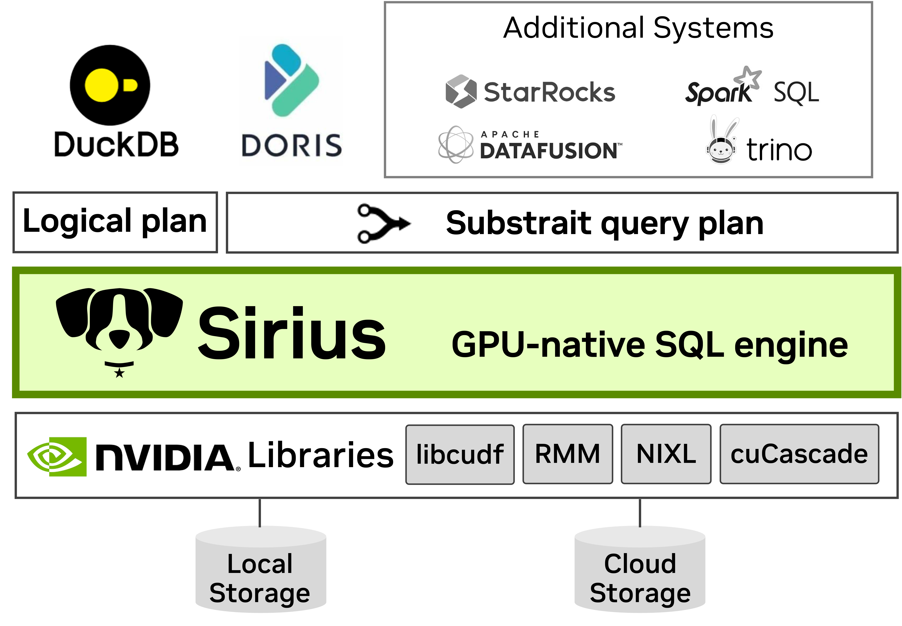
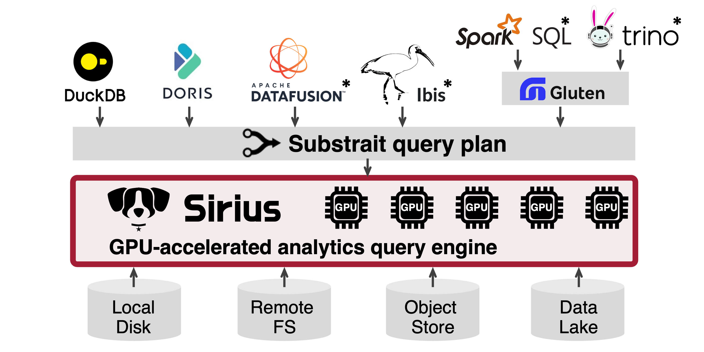
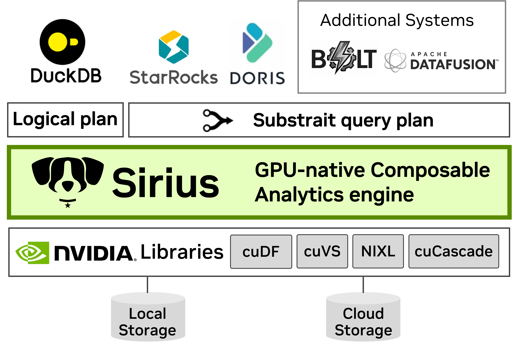
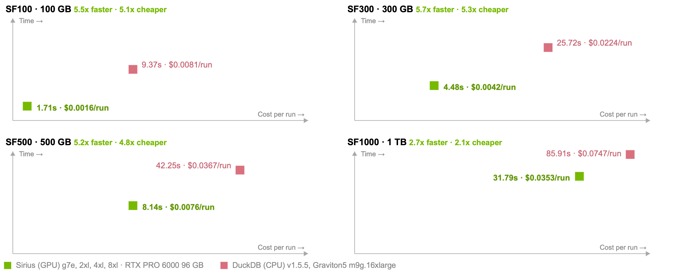

<!--  -->
<p align="center">
  
  <br/>
  <a href="https://join.slack.com/t/sirius-db/shared_invite/zt-33tuwt1sk-aa2dk0EU_dNjklSjIGW3vg">
    
  </a>
</p>

Sirius is a GPU-native SQL engine. It plugs into existing databases such as DuckDB via the standard Substrait query format, requiring no query rewrites or major system changes. Sirius currently supports DuckDB and Doris (coming soon), other systems marked with * are on our roadmap. Built on NVIDIA CUDA-X libraries including cuDF and RAPIDS Memory Manager (RMM), Sirius delivers high-performance GPU-accelerated analytics.

<!--  -->
<p align="center">
  
</p>

## Performance
Running TPC-H on 1TB data, Sirius accelerates DuckDB by 5x on DGX Station (GB300).



## Requirements
- Linux on amd64/x86_64 or arm64/aarch64 with `glibc >= 2.28`.
- NVIDIA Turing or newer, with compute capability 7.5+.
- CUDA 13.x (driver 580.65.06 or newer) or CUDA 12.x (driver 525.60.13 or newer).
- `io_uring` enabled at runtime (`CONFIG_IO_URING`, `kernel.io_uring_disabled=0` recommended). Containers must allow `io_uring_setup`, `io_uring_enter`, and `io_uring_register`.
- Local Parquet files should be on a filesystem/block device that supports direct I/O (`O_DIRECT`).

### Build Requirements

- Git (to clone the repo)
- Pixi (install instructions [here](https://pixi.sh/latest/installation/))

## Building and Running Sirius

For full build instructions, alternate build types, pre-commit setup, and testing, see [DEVELOPMENT.md](DEVELOPMENT.md).

Quick start:

```bash
git clone --recurse-submodules https://github.com/sirius-db/sirius.git
cd sirius
pixi run make
./build/release/duckdb
```

Alternatively, load the extension into an existing DuckDB shell:

```sql
LOAD 'build/release/extension/sirius/sirius.duckdb_extension';
```

Either way, all DuckDB queries are automatically intercepted by the optimizer hook and run on GPU — no query rewrites required. Queries with unsupported operators fall back silently to CPU.

```sql
-- Plain SQL runs on GPU automatically
SELECT l_returnflag, sum(l_quantity)
FROM lineitem
GROUP BY l_returnflag
ORDER BY l_returnflag;

-- Disable transparent GPU execution for this connection
SET gpu_execution = false;
```

Two execution paths are available. See each page for build, configuration, and testing details:

- **[`gpu_execution`](gpu_execution.md) (Recommended)** — Out-of-core execution with tiered memory management (GPU/host/disk), automatic data partitioning, and spilling. Works with **Parquet** data format.
- **[`gpu_processing`](gpu_processing.md)** — In-memory execution where the dataset must fit in GPU memory. Works with DuckDB's native storage format.

## Configuration

Sirius loads its settings from a YAML config file, searched in this order:

1. Path in the `SIRIUS_CONFIG_FILE` environment variable
2. `./sirius.yaml` (current working directory)
3. `~/.sirius/sirius.yaml`

If no config file is found, built-in defaults apply (95% GPU memory, 8 GiB pinned host memory per NUMA node). See the [Configuration reference](super-sirius/configuration.md) for all options: memory tiers, thread pools, operator parameters, and runtime `SET` variables. An example config is provided at [`test/cpp/integration/integration.yaml`](../test/cpp/integration/integration.yaml).

## Logging
Sirius uses [spdlog](https://github.com/gabime/spdlog) for logging messages during query execution. Default log directory is `log` (relative to the current working directory) and default log level is `info`.

Log directory and level can be initialized via environment variables before loading the extension:
```bash
export SIRIUS_LOG_DIR=/path/to/logs
export SIRIUS_LOG_LEVEL=trace
```

Both can also be configured at runtime via DuckDB's `SET` command:
```sql
SET sirius_log_dir = '/path/to/logs';
SET sirius_log_level = 'trace';
SET sirius_log_flush_seconds = 1;
```

## Limitations

Sirius is under active development. Notable current limitations include:

- **Data Type Coverage:** Sirius currently supports commonly used data types including `INTEGER`, `BIGINT`, `FLOAT`, `DOUBLE`, `VARCHAR`, `DATE`, `TIMESTAMP`, and `DECIMAL`. We are actively working on supporting additional data types—such as nested types.
- **Operator Coverage:** At present, Sirius supports `FILTER`, `PROJECTION`, `JOIN` (Hash/Nested Loop/Delim), `GROUP-BY`, `ORDER-BY`, `AGGREGATION`, `TOP-N`, `LIMIT`, and `CTE`. We are working on adding more advanced operators such as `WINDOW` functions and `ASOF JOIN`, etc.

For a full list of current limitations and ongoing work, please refer to our [GitHub issues page](https://github.com/sirius-db/sirius/issues). **If these issues are encountered when running Sirius, Sirius will gracefully fallback to DuckDB query execution on CPUs.**

## Contributors and Partners

<p align="center">
  <a href="https://www.nvidia.com/"></a>
  &nbsp;&nbsp;&nbsp;&nbsp;&nbsp;&nbsp;&nbsp;&nbsp;
  <a href="https://www.wisc.edu/"></a>
</p>
<p align="center">
  <a href="https://duckdblabs.com/"></a>
  &nbsp;&nbsp;&nbsp;&nbsp;&nbsp;&nbsp;&nbsp;&nbsp;
  <a href="https://www.vastdata.com/"></a>
</p>

## Future Roadmap
Sirius is still under major development and we are working on adding more features to Sirius, such as disk spilling, multi-GPUs, multi-node, more operators, data types, accelerating more engines, and many more.

Sirius always welcomes new contributors! If you are interested, check our [website](https://www.sirius-db.com/), reach out to our [email](siriusdb@cs.wisc.edu), or join our [slack channel](https://join.slack.com/t/sirius-db/shared_invite/zt-33tuwt1sk-aa2dk0EU_dNjklSjIGW3vg).

**Let's kickstart the GPU eras for Data Analytics!**
