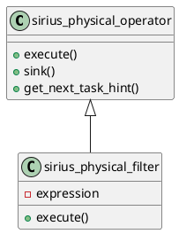
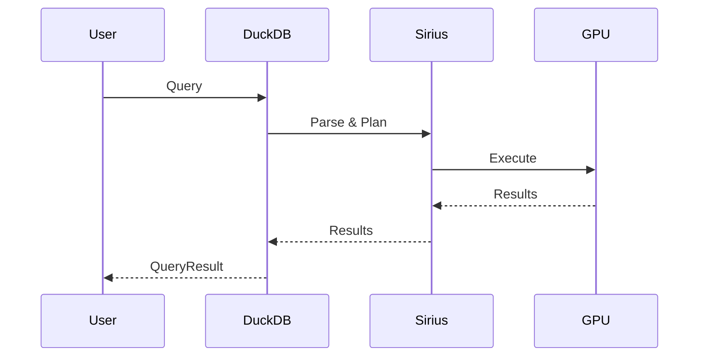

# Architecture Diagrams

This directory contains visual architecture diagrams for Sirius in various formats.

## Contents

This directory is intended to store:

- **System architecture diagrams** (PNG, SVG, draw.io)
- **Data flow diagrams**
- **Component interaction diagrams**
- **UML class diagrams**
- **Sequence diagrams**

## Current Diagrams

**Note**: Diagrams are currently embedded as Mermaid markdown in the documentation files. This directory can be used to store exported images or more complex diagrams created with external tools.

### Embedded Diagrams

The following documentation files contain Mermaid diagrams:

- **[System Overview](../system-overview.md)**: High-level system architecture
- **[Execution Modes](../execution-modes.md)**: Comparison diagrams
- **[Legacy Mode Architecture Diagram](../../03-legacy-mode/architecture-diagram.md)**: Complete Legacy Mode flow
- **[New Mode Architecture Diagram](../../04-new-mode/architecture-diagram.md)**: Complete New Mode flow
- **[Query Lifecycle](../../06-data-flow/query-lifecycle.md)**: End-to-end query flow

## Creating Diagrams

### Mermaid Diagrams

Mermaid diagrams can be embedded directly in markdown:

\`\`\`mermaid
graph TD
    A[User Query] --> B[Parser]
    B --> C[Planner]
    C --> D[Executor]
    D --> E[Results]
\`\`\`

### External Tools

For more complex diagrams, consider:

1. **Draw.io** (diagrams.net): Free, web-based diagramming tool
   - Export as PNG, SVG, or PDF
   - Store both the source (.drawio) and exported image

2. **PlantUML**: Text-based UML diagrams
   - Good for class diagrams and sequence diagrams
   - Can be version-controlled

3. **Lucidchart**: Professional diagramming tool
   - Export as PNG, PDF
   - Good for complex system diagrams

4. **Graphviz**: DOT language for graphs
   - Automatic layout
   - Good for dependency graphs

## Export Guidelines

When adding diagrams to this directory:

1. **Use descriptive names**: `system-overview.png`, `new-mode-pipeline-flow.svg`

2. **Store multiple formats**:
   - Source file (`.drawio`, `.puml`, `.dot`)
   - High-res PNG for documentation
   - SVG for scalability

3. **Add to documentation**: Reference the diagram in the appropriate markdown file:

   ```markdown
   
   ```

4. **Maintain aspect ratio**: Aim for 16:9 or 4:3 for consistency

5. **Use consistent styling**:
   - Colors: Match Sirius branding
   - Fonts: Sans-serif, readable at small sizes
   - Arrows: Consistent style (solid, dashed, labeled)

## Diagram Types

### System Architecture Diagrams

**Purpose**: Show high-level system components and interactions.

**Recommended format**: Draw.io or Mermaid

**Example structure**:
```
┌─────────────────────────────────────────┐
│           DuckDB Layer                  │
└─────────────────────────────────────────┘
              ↓
┌─────────────────────────────────────────┐
│         Sirius Extension                │
├─────────────────────────────────────────┤
│  Planning  │  Execution  │  Memory      │
└─────────────────────────────────────────┘
              ↓
┌─────────────────────────────────────────┐
│            GPU Layer                    │
│  cuDF  │  RMM  │  CUDA  │  cucascade   │
└─────────────────────────────────────────┘
```

### Data Flow Diagrams

**Purpose**: Show data transformation through operators.

**Recommended format**: Mermaid or PlantUML

**Example**:


### Class Diagrams

**Purpose**: Show class hierarchies and relationships.

**Recommended format**: PlantUML

**Example**:


### Sequence Diagrams

**Purpose**: Show interaction timing between components.

**Recommended format**: Mermaid or PlantUML

**Example**:


## Contributing

When adding diagrams:

1. Create a feature branch: `git checkout -b add-<diagram-name>-diagram`
2. Add diagram source and exported images to this directory
3. Reference diagram in relevant documentation file
4. Update this README with the new diagram
5. Submit PR with clear description

## Tools and Resources

- **Mermaid Live Editor**: https://mermaid.live/
- **Draw.io**: https://app.diagrams.net/
- **PlantUML**: https://plantuml.com/
- **Graphviz**: https://graphviz.org/

## Future Work

Potential diagrams to add:

- [ ] Detailed memory hierarchy diagram
- [ ] Thread pool and executor interaction diagram
- [ ] Expression evaluation pipeline diagram
- [ ] cucascade data repository architecture
- [ ] Complete operator dependency graph
- [ ] Performance profiling flamegraph
- [ ] GPU kernel execution timeline

---

*Last updated: 2026-02-10*
