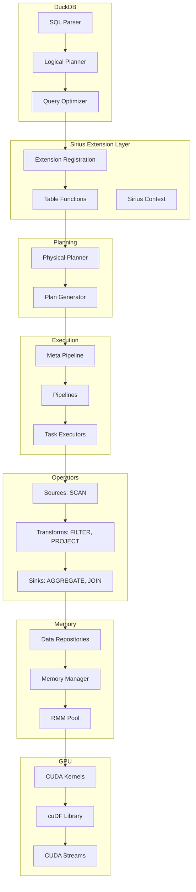

# System Overview

This document provides a comprehensive overview of Sirius's architecture, covering all major components and their interactions.

## Table of Contents
- [High-Level Architecture](#high-level-architecture)
- [Component Diagram](#component-diagram)
- [Execution Flow](#execution-flow)
- [Key Subsystems](#key-subsystems)
- [Directory Structure](#directory-structure)

---

## High-Level Architecture

Sirius operates as a **DuckDB extension**, intercepting SQL queries and executing them on the GPU. The architecture follows a layered design:

```
┌───────────────────────────────────────────────────────────┐
│                     User Application                       │
└───────────────────────────────────────────────────────────┘
                            ↓
┌───────────────────────────────────────────────────────────┐
│                        DuckDB                              │
│  • SQL Parser                                              │
│  • Query Optimizer                                         │
│  • Logical Planner                                         │
└───────────────────────────────────────────────────────────┘
                            ↓
┌───────────────────────────────────────────────────────────┐
│                   Sirius Extension                         │
│  • Extension Registration (sirius_extension.cpp)           │
│  • Table Functions: gpu_processing(), gpu_execution()      │
└───────────────────────────────────────────────────────────┘
                            ↓
         ┌──────────────────┴──────────────────┐
         ↓                                      ↓
┌──────────────────────┐          ┌──────────────────────┐
│   Legacy Mode        │          │    New Mode          │
│  (gpu_processing)    │          │  (gpu_execution)     │
└──────────────────────┘          └──────────────────────┘
         ↓                                      ↓
┌──────────────────────┐          ┌──────────────────────┐
│  Physical Planner    │          │  Physical Planner    │
│  GPUPhysicalPlan     │          │  SiriusPhysicalPlan  │
└──────────────────────┘          └──────────────────────┘
         ↓                                      ↓
┌──────────────────────┐          ┌──────────────────────┐
│  Pipeline Builder    │          │  Pipeline Builder    │
│  GPUMetaPipeline     │          │  sirius_meta_pipeline│
└──────────────────────┘          └──────────────────────┘
         ↓                                      ↓
┌──────────────────────┐          ┌──────────────────────┐
│  GPU Executor        │          │  Sirius Engine       │
│  GPUExecutor         │          │  sirius_engine       │
└──────────────────────┘          └──────────────────────┘
         ↓                                      ↓
┌───────────────────────────────────────────────────────────┐
│                    GPU Execution Layer                     │
│  • CUDA Kernels (via cuDF)                                │
│  • Memory Management (RMM)                                 │
│  • Data Repositories (Cucascade)                           │
└───────────────────────────────────────────────────────────┘
                            ↓
┌───────────────────────────────────────────────────────────┐
│                    Hardware Layer                          │
│  • NVIDIA GPU (CUDA Compute)                              │
│  • GPU Memory (GDDR6/HBM)                                 │
│  • Host Memory (Pinned)                                    │
│  • Disk Storage (Spilling)                                │
└───────────────────────────────────────────────────────────┘
```

---

## Component Diagram

### Core Components and Their Relationships



---

## Execution Flow

### End-to-End Query Execution

Let's trace a query through the entire system:

```sql
SELECT category, SUM(price) as total
FROM orders
WHERE date >= '2024-01-01'
GROUP BY category
ORDER BY total DESC
```

#### Phase 1: DuckDB Processing

```
1. SQL Parser (DuckDB)
   Input: Raw SQL string
   Output: Abstract Syntax Tree (AST)

2. Binder (DuckDB)
   Input: AST
   Output: Bound query with type information

3. Logical Planner (DuckDB)
   Input: Bound query
   Output: Logical operator tree

   LogicalOrder [total DESC]
        ↓
   LogicalProjection [category, SUM(price) AS total]
        ↓
   LogicalAggregate [GROUP BY category]
        ↓
   LogicalFilter [date >= '2024-01-01']
        ↓
   LogicalGet [orders]
```

#### Phase 2: Sirius Extension Intercepts

```
4. Extension Table Function
   File: src/sirius_extension.cpp:353-409 (GPUExecutionBind)

   • Extracts logical plan from DuckDB
   • Invokes Sirius physical planner
   • Returns prepared statement
```

#### Phase 3: Physical Planning

```
5. Physical Planner
   File: src/planner/sirius_physical_plan_generator.cpp
   Input: Logical operator tree
   Output: Physical operator tree

   RESULT_COLLECTOR
        ↓
   ORDER_BY [total DESC]
        ↓
   HASH_GROUP_BY [category]
        ↓
   FILTER [date >= '2024-01-01']
        ↓
   TABLE_SCAN [orders]
```

#### Phase 4: Pipeline Construction

```
6. Pipeline Builder
   File: src/include/pipeline/sirius_meta_pipeline.hpp
   Input: Physical operator tree
   Output: Pipeline DAG

   Pipeline 1: TABLE_SCAN → FILTER → HASH_GROUP_BY (sink)
   Pipeline 2: HASH_GROUP_BY (source) → ORDER_BY → RESULT_COLLECTOR

   Dependency: Pipeline 2 waits for Pipeline 1 to complete
```

#### Phase 5: Task Creation and Execution

```
7. Task Executor
   File: src/include/parallel/task_executor.hpp

   • task_creator generates tasks from pipelines
   • pipeline_executor schedules tasks on GPU
   • Tasks execute on CUDA streams

   Task 1: Scan batch 1 → Filter → Aggregate (partial)
   Task 2: Scan batch 2 → Filter → Aggregate (partial)
   ...
   Task N: Scan batch N → Filter → Aggregate (partial)
   Task N+1: Finalize aggregate → Sort → Collect results
```

#### Phase 6: GPU Execution

```
8. Operator Execution
   Files: src/op/sirius_physical_*.cpp

   For each task:
   a. Allocate GPU memory (via RMM)
   b. Execute operator kernels (via cuDF)
   c. Store intermediate results in data repositories
   d. Free temporary memory
```

#### Phase 7: Result Collection

```
9. Result Collector
   File: src/op/sirius_physical_result_collector.cpp

   • Pull final data from last pipeline
   • Convert from cuDF to DuckDB format
   • Transfer from GPU to CPU memory
   • Return to DuckDB as QueryResult
```

---

## Key Subsystems

### 1. Extension Layer

**Purpose**: Integrate Sirius with DuckDB

**Key Files**:
- `src/sirius_extension.cpp` - Extension registration and table functions
- `src/sirius_interface.hpp` - Main interface for query execution

**Responsibilities**:
- Register `gpu_processing()` and `gpu_execution()` table functions
- Extract logical plans from DuckDB
- Handle configuration and context management
- Return results to DuckDB

**Entry Points**:
- `GPUProcessingBind()` / `GPUProcessingFunction()` (legacy)
- `GPUExecutionBind()` / `GPUExecutionFunction()` (new)

### 2. Physical Planner

**Purpose**: Convert logical plans to GPU-executable physical plans

**Key Files**:
- `src/planner/sirius_physical_plan_generator.cpp` - Main planner
- `src/planner/sirius_plan_*.cpp` - Operator-specific planning

**Responsibilities**:
- Traverse logical operator tree
- Map logical operators to physical operators
- Apply GPU-specific optimizations
- Resolve data types and expressions

**Example Mapping**:
| Logical Operator | Physical Operator |
|-----------------|-------------------|
| LogicalGet | TABLE_SCAN / DUCKDB_SCAN |
| LogicalFilter | FILTER |
| LogicalProjection | PROJECTION |
| LogicalAggregate | HASH_GROUP_BY / UNGROUPED_AGGREGATE |
| LogicalJoin | HASH_JOIN / NESTED_LOOP_JOIN |
| LogicalOrder | ORDER_BY / TOP_N |

### 3. Pipeline Infrastructure

**Purpose**: Organize operators into executable pipelines

**Key Files**:
- `src/include/pipeline/sirius_pipeline.hpp` - Pipeline definition
- `src/include/pipeline/sirius_meta_pipeline.hpp` - Pipeline DAG
- `src/include/pipeline/sirius_pipeline_itask.hpp` - Task interface

**Responsibilities**:
- Build pipeline DAG from physical plan
- Identify pipeline breakers (sinks that materialize)
- Establish inter-pipeline dependencies
- Create data repositories for communication

**Pipeline Types**:
1. **Source-to-Sink**: Complete pipeline (SCAN → ... → RESULT_COLLECTOR)
2. **Build Pipelines**: Feed data to operators like hash joins
3. **Probe Pipelines**: Consume pre-built state

### 4. Task Execution System

**Purpose**: Parallel execution of pipeline tasks

**Key Files**:
- `src/include/parallel/task_executor.hpp` - Task executor base
- `src/parallel/pipeline_executor.cpp` - GPU task execution
- `src/parallel/task_creator.cpp` - Task generation

**Executors**:
1. **pipeline_executor**: Executes GPU operators
   - Thread pool: 4-8 threads (configurable)
   - CUDA stream pool: 1 stream per thread

2. **task_creator**: Converts plans to tasks
   - Thread pool: 2-4 threads
   - Checks task readiness hints

3. **downgrade_executor**: Memory management
   - Thread pool: 2-4 threads
   - Spills data to host/disk

4. **duckdb_scan_executor**: CPU scans
   - Thread pool: 4-8 threads
   - Offloads DuckDB table scans

### 5. Operator Library

**Purpose**: Implement relational operators on GPU

**Key Files**:
- `src/include/op/sirius_physical_operator.hpp` - Base class
- `src/op/sirius_physical_*.cpp` - Operator implementations

**Operator Categories**:

**Sources** (produce data):
- TABLE_SCAN: Read from legacy tables
- DUCKDB_SCAN: Read from DuckDB tables
- DUMMY_SCAN: Testing placeholder

**Transforms** (process data):
- FILTER: Apply predicates
- PROJECTION: Select/compute columns
- LIMIT: Restrict row count

**Aggregates** (accumulate data):
- UNGROUPED_AGGREGATE: SUM/COUNT without grouping
- HASH_GROUP_BY: Grouped aggregation

**Joins** (combine datasets):
- HASH_JOIN: Equi-join via hash table
- NESTED_LOOP_JOIN: Cartesian/non-equi joins

**Sorts** (ordering):
- ORDER_BY: Full sort
- TOP_N: Partial sort with limit
- MERGE_SORT: Multi-way merge

**Output**:
- RESULT_COLLECTOR: Materialize to DuckDB

### 6. Memory Management

**Purpose**: Manage data across GPU/HOST/DISK tiers

**Key Files**:
- `src/include/memory/sirius_memory_reservation_manager.hpp` - Reservation system
- `cucascade/include/cucascade/data/data_repository.hpp` - Data storage

**Memory Tiers**:
```
┌─────────────────────────┐
│      GPU Memory         │  Fastest, smallest (8-80 GB)
│  (Device Memory)        │  Active processing
└─────────────────────────┘
           ↕ (downgrade/upgrade)
┌─────────────────────────┐
│     Host Memory         │  Medium speed, larger (32-512 GB)
│  (Pinned Memory)        │  Staging area
└─────────────────────────┘
           ↕ (spill/read)
┌─────────────────────────┐
│    Disk Storage         │  Slowest, largest (unlimited)
│  (File System)          │  Overflow storage
└─────────────────────────┘
```

**Key Mechanisms**:
- **Reservation**: Pre-allocate memory before use
- **Downgrade**: Spill to lower tier when full
- **Upgrade**: Promote to higher tier when needed
- **Reference Counting**: Automatic memory reclamation

### 7. Data Flow Layer (Cucascade)

**Purpose**: Efficient inter-pipeline data exchange

**Key Files**:
- `cucascade/include/cucascade/data/data_batch.hpp` - Data unit
- `cucascade/include/cucascade/data/data_repository.hpp` - Storage
- `cucascade/include/cucascade/data/data_repository_manager.hpp` - Management

**Data Structures**:
- **data_batch**: Column-oriented batch (cuDF-backed)
- **data_repository**: Multi-producer, multi-consumer queue with multi-tier storage
- **data_repository_manager**: Global registry of repositories

**Communication Pattern**:
```
Producer Pipeline 1 ──push──> Data Repository ──pull──> Consumer Pipeline 2
Producer Pipeline 2 ──push──>      ↕                    Consumer Pipeline 3
                             (GPU/HOST/DISK)
```

### 8. Configuration System

**Purpose**: System-wide and per-connection settings

**Key Files**:
- `src/sirius_config.cpp` - Global configuration
- `src/sirius_context.cpp` - Per-connection context

**Configuration Sources**:
1. Config file (YAML/INI format)
2. Environment variables
3. SQL SET commands
4. Programmatic API

**Key Settings**:
- Thread pool sizes
- Memory limits (GPU/HOST/DISK)
- Logging level and output
- Hardware topology (GPU count, NUMA)
- Fallback behavior

---

## Directory Structure

```
sirius/
├── src/
│   ├── include/               # Public headers
│   │   ├── op/               # New mode operators
│   │   ├── pipeline/         # Pipeline infrastructure
│   │   ├── memory/           # Memory management
│   │   ├── parallel/         # Task execution
│   │   ├── data/             # Data structures
│   │   └── expression/       # Expression evaluation
│   ├── op/                   # New mode operator implementations
│   ├── operator/             # Legacy mode operators
│   ├── planner/              # Physical planning
│   ├── parallel/             # Task executor implementations
│   ├── memory/               # Memory manager implementations
│   ├── sirius_extension.cpp  # Extension entry point
│   ├── sirius_engine.cpp     # New mode engine
│   ├── sirius_interface.cpp  # Query interface
│   ├── gpu_executor.cpp      # Legacy executor
│   ├── sirius_config.cpp     # Configuration
│   └── sirius_context.cpp    # Context management
├── cucascade/                # Data management submodule
│   └── include/
│       └── cucascade/
│           ├── data/         # Data batches and repositories
│           └── memory/       # Memory resources
├── test/
│   ├── cpp/                  # C++ unit tests
│   │   ├── operator/         # Operator tests
│   │   ├── pipeline/         # Pipeline tests
│   │   └── memory/           # Memory tests
│   └── sql/                  # SQL integration tests
├── benchmarks/               # Performance benchmarks
└── CMakeLists.txt           # Build configuration
```

---

## Design Principles

### 1. Modularity
- Each operator is self-contained
- Operators communicate via well-defined interfaces
- Easy to add new operators without modifying existing code

### 2. Pipeline-Based Execution
- Minimize intermediate materialization
- Enable operator fusion
- Maximize parallelism

### 3. Multi-Tier Memory
- Support datasets larger than GPU memory
- Transparent spilling to host/disk
- Automatic memory management

### 4. Asynchronous Execution
- Non-blocking task submission
- Overlapping data transfer and computation
- Concurrent pipeline execution

### 5. Extensibility
- Clean separation between legacy and new modes
- Plugin-based operator registration
- Configuration-driven behavior

---

## Performance Characteristics

### Strengths
- **High Throughput**: Thousands of GPU cores processing in parallel
- **Memory Bandwidth**: 10-20x higher than CPU
- **Vectorization**: Native columnar processing via cuDF
- **Scalability**: Handles multi-GB to multi-TB datasets

### Trade-offs
- **Kernel Launch Overhead**: ~5-10μs per kernel (favors large batches)
- **Data Transfer**: PCIe bandwidth limits (16 GB/s on PCIe 4.0 x16)
- **Memory Pressure**: GPU memory smaller than CPU (requires spilling)
- **CPU-GPU Coordination**: Synchronization overhead

---

## Comparison: Legacy vs New Mode

| Aspect | Legacy Mode | New Mode |
|--------|-------------|----------|
| **Operator Base** | GPUPhysicalOperator | sirius_physical_operator |
| **Data Structure** | GPUIntermediateRelation | cucascade::data_batch |
| **Pipeline** | GPUPipeline | sirius_pipeline |
| **Task Model** | Static tasks | Dynamic tasks with hints |
| **Memory** | GPUBufferManager | cucascade + RMM |
| **Inter-Pipeline** | Direct pass | Data repositories |
| **Status** | Maintenance | Active development |

**Recommendation**: New mode for all new features.

---

## Next Steps

Now that you understand the overall architecture:

1. **DuckDB Integration**: [DuckDB Integration](duckdb-integration.md)
2. **Execution Modes**: [Execution Modes Comparison](execution-modes.md)
3. **New Mode Deep Dive**: [New Mode Overview](../04-new-mode/overview.md)
4. **Query Lifecycle**: [Query Lifecycle](../06-data-flow/query-lifecycle.md)

For implementation details, explore the operator guides and development documentation.
