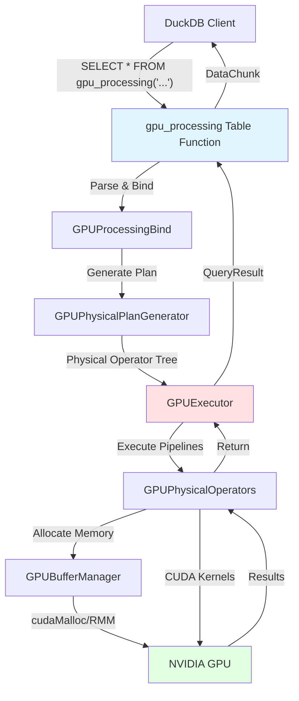
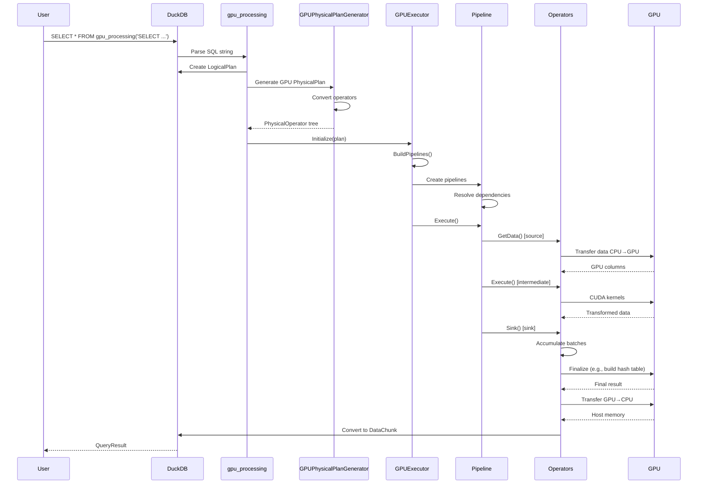
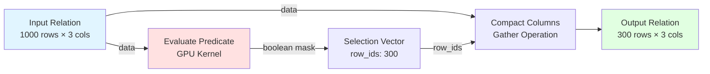
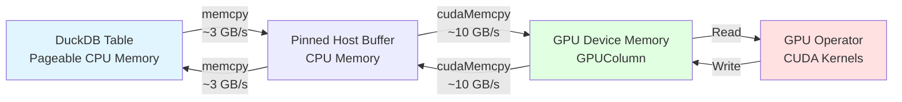

# Legacy Mode Architecture Diagram

This document provides visual representations of the Sirius Legacy Mode architecture, showing how components interact to execute SQL queries on the GPU.

## Table of Contents

1. [High-Level Architecture](#high-level-architecture)
2. [Query Execution Flow](#query-execution-flow)
3. [Pipeline Structure](#pipeline-structure)
4. [Operator Execution](#operator-execution)
5. [Memory Flow](#memory-flow)
6. [Join Execution](#join-execution)
7. [Data Structures](#data-structures)
8. [Next Steps](#next-steps)

---

## High-Level Architecture

### System Overview



### Component Layers

```
┌─────────────────────────────────────────────────────────────┐
│                     DuckDB Layer                            │
│  • SQL Parser   • Logical Planner   • Result Consumer      │
└─────────────────────────────────────────────────────────────┘
                            ↓
┌─────────────────────────────────────────────────────────────┐
│                  Sirius Extension Layer                     │
│  • gpu_processing()   • GPUProcessingBind()                 │
│  • GPUProcessingFunction()   • Query preparation            │
└─────────────────────────────────────────────────────────────┘
                            ↓
┌─────────────────────────────────────────────────────────────┐
│                   Planning Layer                            │
│  • GPUPhysicalPlanGenerator                                 │
│  • Logical → Physical conversion                            │
│  • Operator-specific planning                               │
└─────────────────────────────────────────────────────────────┘
                            ↓
┌─────────────────────────────────────────────────────────────┐
│                   Execution Layer                           │
│  • GPUExecutor   • GPUMetaPipeline   • GPUPipeline          │
│  • Pipeline building   • Scheduling   • Dependency tracking │
└─────────────────────────────────────────────────────────────┘
                            ↓
┌─────────────────────────────────────────────────────────────┐
│                   Operator Layer                            │
│  • GPUPhysicalOperator (base)                               │
│  • Source operators (TABLE_SCAN, COLUMN_DATA_SCAN)          │
│  • Intermediate operators (FILTER, PROJECTION, ORDER_BY)    │
│  • Sink operators (HASH_JOIN, RESULT_COLLECTOR)             │
└─────────────────────────────────────────────────────────────┘
                            ↓
┌─────────────────────────────────────────────────────────────┐
│                   Memory Layer                              │
│  • GPUBufferManager (singleton)                             │
│  • GPU Processing Pool (RMM)   • GPU Cache                  │
│  • CPU Pinned Memory   • Allocation tracking                │
└─────────────────────────────────────────────────────────────┘
                            ↓
┌─────────────────────────────────────────────────────────────┐
│                    GPU Layer                                │
│  • CUDA Kernels   • cuDF Operations   • RMM                 │
│  • cudaMemcpy   • cuBLAS   • Thrust                         │
└─────────────────────────────────────────────────────────────┘
```

---

## Query Execution Flow

### End-to-End Query Processing



### Detailed Execution Steps

```
┌────────────────────────────────────────────────────────────────┐
│  Step 1: Query Submission                                      │
│  • User submits: SELECT * FROM gpu_processing('SELECT ...')    │
│  • DuckDB parser creates LogicalPlan                           │
└────────────────────────────────────────────────────────────────┘
                            ↓
┌────────────────────────────────────────────────────────────────┐
│  Step 2: Bind Phase (GPUProcessingBind)                        │
│  • Parse inner SQL string                                      │
│  • Create DuckDB LogicalPlan for inner query                   │
│  • Store in bind data                                          │
└────────────────────────────────────────────────────────────────┘
                            ↓
┌────────────────────────────────────────────────────────────────┐
│  Step 3: Physical Planning (GPUPhysicalPlanGenerator)          │
│  • Convert LogicalPlan → GPUPhysicalOperator tree              │
│  • Type resolution                                             │
│  • Operator-specific planning                                  │
└────────────────────────────────────────────────────────────────┘
                            ↓
┌────────────────────────────────────────────────────────────────┐
│  Step 4: Pipeline Building (GPUExecutor::InitializeInternal)   │
│  • Walk operator tree                                          │
│  • Create GPUPipeline objects                                  │
│  • Break pipelines at sink operators                           │
│  • Establish dependencies                                      │
└────────────────────────────────────────────────────────────────┘
                            ↓
┌────────────────────────────────────────────────────────────────┐
│  Step 5: Pipeline Execution (GPUExecutor::Execute)             │
│  • Execute pipelines in topological order                      │
│  • For each pipeline:                                          │
│    - GetData() from source                                     │
│    - Execute() intermediate operators                          │
│    - Sink() to accumulate data                                 │
│  • Finalize sinks (build hash tables, etc.)                    │
└────────────────────────────────────────────────────────────────┘
                            ↓
┌────────────────────────────────────────────────────────────────┐
│  Step 6: Result Collection                                     │
│  • FinalMaterialize() in ResultCollector                       │
│  • Transfer GPU → CPU                                          │
│  • Convert GPUColumn → DuckDB DataChunk                        │
│  • Return MaterializedQueryResult                              │
└────────────────────────────────────────────────────────────────┘
```

---

## Pipeline Structure

### Simple Filter Query

**SQL:**

```sql
SELECT * FROM gpu_processing('SELECT name, age FROM users WHERE age > 25');
```

**Pipeline Diagram:**

```
┌─────────────────────────────────────────────────────────────┐
│                       Pipeline #1                           │
│                                                             │
│  ┌─────────────────┐                                        │
│  │  TABLE_SCAN     │  [Source]                              │
│  │  (users table)  │  • Reads DuckDB table                  │
│  │                 │  • Transfers CPU → GPU                 │
│  └────────┬────────┘                                        │
│           │ GPUIntermediateRelation (1000 rows)             │
│           ↓                                                 │
│  ┌─────────────────┐                                        │
│  │  FILTER         │  [Intermediate]                        │
│  │  (age > 25)     │  • Evaluates predicate on GPU          │
│  │                 │  • Produces row_ids                    │
│  └────────┬────────┘                                        │
│           │ GPUIntermediateRelation (300 rows)              │
│           ↓                                                 │
│  ┌─────────────────┐                                        │
│  │ RESULT_COLLECTOR│  [Sink]                                │
│  │                 │  • Materializes row_ids                │
│  │                 │  • Transfers GPU → CPU                 │
│  │                 │  • Converts to DuckDB format           │
│  └─────────────────┘                                        │
└─────────────────────────────────────────────────────────────┘
```

### Join Query with Multiple Pipelines

**SQL:**

```sql
SELECT o.order_id, c.name
FROM orders o
JOIN customers c ON o.customer_id = c.id
WHERE o.total > 100;
```

**Pipeline Diagram:**

```
┌─────────────────────────────────────────────────────────────┐
│                    Pipeline #1 (Build)                      │
│  ┌─────────────────┐                                        │
│  │  TABLE_SCAN     │  [Source]                              │
│  │  (customers)    │  • Scan dimension table                │
│  └────────┬────────┘                                        │
│           │ GPUIntermediateRelation                         │
│           ↓                                                 │
│  ┌─────────────────┐                                        │
│  │  HASH_JOIN      │  [Sink]                                │
│  │  (build side)   │  • Accumulate build batches            │
│  │                 │  • Build hash table                    │
│  └────────┬────────┘                                        │
│           │ Hash Table (GPU memory)                         │
└───────────┼─────────────────────────────────────────────────┘
            │
            │ Dependency: Pipeline #2 depends on Pipeline #1
            ↓
┌─────────────────────────────────────────────────────────────┐
│                    Pipeline #2 (Probe)                      │
│  ┌─────────────────┐                                        │
│  │  TABLE_SCAN     │  [Source]                              │
│  │  (orders)       │  • Scan fact table                     │
│  └────────┬────────┘                                        │
│           │ GPUIntermediateRelation                         │
│           ↓                                                 │
│  ┌─────────────────┐                                        │
│  │  FILTER         │  [Intermediate]                        │
│  │  (total > 100)  │  • Filter rows                         │
│  └────────┬────────┘                                        │
│           │ GPUIntermediateRelation (filtered)              │
│           ↓                                                 │
│  ┌─────────────────┐                                        │
│  │  HASH_JOIN      │  [Intermediate]                        │
│  │  (probe side)   │  • Probe hash table                    │
│  │                 │  • Gather matched rows                 │
│  └────────┬────────┘                                        │
│           │ GPUIntermediateRelation (joined)                │
│           ↓                                                 │
│  ┌─────────────────┐                                        │
│  │ RESULT_COLLECTOR│  [Sink]                                │
│  │                 │  • Collect results                     │
│  └─────────────────┘                                        │
└─────────────────────────────────────────────────────────────┘
```

---

## Operator Execution

### Operator Interfaces

```
GPUPhysicalOperator (Base Class)
├── IsSource() → bool
│   └── GetData(output: GPUIntermediateRelation) → SourceResultType
│
├── Execute(input, output: GPUIntermediateRelation) → OperatorResultType
│
└── IsSink() → bool
    ├── Sink(input: GPUIntermediateRelation) → SinkResultType
    └── CombineFinalize(inputs, output) → SinkFinalizeType
```

### Filter Operator Execution



### Join Operator Execution

**Build Phase:**

```
┌────────────────────────────────────────────────────────────┐
│  Build Side (customers: 1M rows)                           │
│                                                            │
│  Batch 1 (1K rows)   ──┐                                   │
│  Batch 2 (1K rows)   ──┤                                   │
│  Batch 3 (1K rows)   ──┤  Accumulate in                    │
│  ...                  ─┤  GlobalSinkState                  │
│  Batch 1000 (1K rows)──┘                                   │
│                         ↓                                  │
│  ┌──────────────────────────────────────────────────┐     │
│  │  CombineFinalize()                               │     │
│  │  • Concatenate all batches                       │     │
│  │  • Extract build keys                            │     │
│  │  • Build cuckoo hash table                       │     │
│  │  • Store in GlobalSinkState                      │     │
│  └──────────────────────────────────────────────────┘     │
│                         ↓                                  │
│  ┌──────────────────────────────────────────────────┐     │
│  │  Hash Table (GPU memory)                         │     │
│  │  Size: ~1.5M entries (load factor 0.67)          │     │
│  │  Format: [key, value_idx] pairs                  │     │
│  └──────────────────────────────────────────────────┘     │
└────────────────────────────────────────────────────────────┘
```

**Probe Phase:**

```
┌────────────────────────────────────────────────────────────┐
│  Probe Side (orders: 100M rows)                            │
│                                                            │
│  For each batch (100K rows):                               │
│                                                            │
│  ┌──────────────────────────────────────────────────┐     │
│  │  1. Extract probe keys (customer_id)             │     │
│  └────────────────┬─────────────────────────────────┘     │
│                   ↓                                        │
│  ┌──────────────────────────────────────────────────┐     │
│  │  2. Probe hash table (GPU kernel)                │     │
│  │     • Hash each probe key                        │     │
│  │     • Lookup in hash table                       │     │
│  │     • Store matching indices                     │     │
│  └────────────────┬─────────────────────────────────┘     │
│                   ↓                                        │
│  ┌──────────────────────────────────────────────────┐     │
│  │  3. Gather matched rows                          │     │
│  │     • Gather probe columns (orders)              │     │
│  │     • Gather build columns (customers)           │     │
│  │     • Concatenate horizontally                   │     │
│  └────────────────┬─────────────────────────────────┘     │
│                   ↓                                        │
│  ┌──────────────────────────────────────────────────┐     │
│  │  Output: Joined batch                            │     │
│  │  Rows: ~50K (assuming 50% join selectivity)      │     │
│  │  Columns: orders + customers                     │     │
│  └──────────────────────────────────────────────────┘     │
└────────────────────────────────────────────────────────────┘
```

---

## Memory Flow

### GPU Memory Layout

```
┌───────────────────────────────────────────────────────────────┐
│                         GPU Memory                            │
│                         (32 GB total)                         │
│                                                               │
│  ┌────────────────────────────────────────────────────┐      │
│  │  GPU Cache (4 GB)                                  │      │
│  │  • Dimension tables                                │      │
│  │  • Frequently accessed data                        │      │
│  │  • Persistent across queries                       │      │
│  └────────────────────────────────────────────────────┘      │
│                                                               │
│  ┌────────────────────────────────────────────────────┐      │
│  │  GPU Processing Pool (20 GB) - RMM Managed         │      │
│  │                                                     │      │
│  │  ┌──────────────────────────────────────────┐      │      │
│  │  │  Active Batch Data                       │      │      │
│  │  │  • Current pipeline input/output         │      │      │
│  │  │  • Intermediate operator results         │      │      │
│  │  └──────────────────────────────────────────┘      │      │
│  │                                                     │      │
│  │  ┌──────────────────────────────────────────┐      │      │
│  │  │  Hash Tables / Aggregates                │      │      │
│  │  │  • Join build hash tables                │      │      │
│  │  │  • Groupby hash tables                   │      │      │
│  │  └──────────────────────────────────────────┘      │      │
│  │                                                     │      │
│  │  ┌──────────────────────────────────────────┐      │      │
│  │  │  Free Pool                               │      │      │
│  │  │  • Available for allocation              │      │      │
│  │  └──────────────────────────────────────────┘      │      │
│  └────────────────────────────────────────────────────┘      │
│                                                               │
│  ┌────────────────────────────────────────────────────┐      │
│  │  Reserved by CUDA/Driver (~8 GB)                   │      │
│  │  • CUDA context                                    │      │
│  │  • Driver overhead                                 │      │
│  │  • Kernel code                                     │      │
│  └────────────────────────────────────────────────────┘      │
└───────────────────────────────────────────────────────────────┘

┌───────────────────────────────────────────────────────────────┐
│                    CPU Pinned Memory                          │
│                    (16 GB allocated)                          │
│                                                               │
│  ┌────────────────────────────────────────────────────┐      │
│  │  CPU Cache Overflow (4 GB)                         │      │
│  │  • Dimension tables that don't fit in GPU          │      │
│  └────────────────────────────────────────────────────┘      │
│                                                               │
│  ┌────────────────────────────────────────────────────┐      │
│  │  CPU Processing (12 GB)                            │      │
│  │  • Data transfer staging                           │      │
│  │  • DuckDB → GPU transfer buffer                    │      │
│  │  • GPU → DuckDB result buffer                      │      │
│  └────────────────────────────────────────────────────┘      │
└───────────────────────────────────────────────────────────────┘
```

### Data Transfer Flow



---

## Join Execution

### Hash Join Architecture

```
┌─────────────────────────────────────────────────────────────────┐
│                     Hash Join Execution                         │
│                                                                 │
│  Phase 1: Build Hash Table                                     │
│  ┌───────────────────────────────────────────────────────┐     │
│  │  Build Side (customers: 1M rows)                      │     │
│  │                                                        │     │
│  │  ┌──────────────┐    ┌──────────────┐                │     │
│  │  │ TABLE_SCAN   │ →  │ Accumulate   │                │     │
│  │  │ (customers)  │    │ in Sink      │                │     │
│  │  └──────────────┘    └──────┬───────┘                │     │
│  │                             ↓                         │     │
│  │  ┌────────────────────────────────────────────┐      │     │
│  │  │  CombineFinalize()                         │      │     │
│  │  │  • Extract join keys (customer.id)         │      │     │
│  │  │  • Build cuckoo hash table                 │      │     │
│  │  │    ┌─────────────────────────────┐         │      │     │
│  │  │    │ Hash Table (GPU)            │         │      │     │
│  │  │    │ Size: 1.5M entries          │         │      │     │
│  │  │    │ Format:                     │         │      │     │
│  │  │    │   key → build_row_idx       │         │      │     │
│  │  │    │   123 → 0                   │         │      │     │
│  │  │    │   456 → 1                   │         │      │     │
│  │  │    │   789 → 2                   │         │      │     │
│  │  │    │   ...                       │         │      │     │
│  │  │    └─────────────────────────────┘         │      │     │
│  │  └────────────────────────────────────────────┘      │     │
│  └───────────────────────────────────────────────────────┘     │
│                                                                 │
│  Phase 2: Probe Hash Table                                     │
│  ┌───────────────────────────────────────────────────────┐     │
│  │  Probe Side (orders: 100M rows)                       │     │
│  │                                                        │     │
│  │  ┌──────────────┐    ┌──────────────┐                │     │
│  │  │ TABLE_SCAN   │ →  │ FILTER       │                │     │
│  │  │ (orders)     │    │ (total>100)  │                │     │
│  │  └──────────────┘    └──────┬───────┘                │     │
│  │                             ↓                         │     │
│  │  ┌────────────────────────────────────────────┐      │     │
│  │  │  Probe Hash Table (GPU Kernel)             │      │     │
│  │  │  For each probe key (order.customer_id):   │      │     │
│  │  │    1. Hash key                             │      │     │
│  │  │    2. Lookup in hash table                 │      │     │
│  │  │    3. If found:                            │      │     │
│  │  │         • Store probe_idx                  │      │     │
│  │  │         • Store build_idx                  │      │     │
│  │  │                                             │      │     │
│  │  │  Output:                                   │      │     │
│  │  │    probe_indices: [0, 2, 5, 7, ...]        │      │     │
│  │  │    build_indices: [123, 456, 789, ...]     │      │     │
│  │  │    match_count: 50K                        │      │     │
│  │  └────────────────────────────────────────────┘      │     │
│  │                             ↓                         │     │
│  │  ┌────────────────────────────────────────────┐      │     │
│  │  │  Gather Matched Rows                       │      │     │
│  │  │  • Gather probe columns using probe_indices │      │     │
│  │  │  • Gather build columns using build_indices │      │     │
│  │  │  • Concatenate horizontally                │      │     │
│  │  │                                             │      │     │
│  │  │  Result: 50K rows × (probe_cols + build_cols)│    │     │
│  │  └────────────────────────────────────────────┘      │     │
│  │                             ↓                         │     │
│  │  ┌──────────────┐                                     │     │
│  │  │RESULT_COLLECT│                                     │     │
│  │  └──────────────┘                                     │     │
│  └───────────────────────────────────────────────────────┘     │
└─────────────────────────────────────────────────────────────────┘
```

---

## Data Structures

### GPUColumn Memory Layout

```
┌───────────────────────────────────────────────────────────────┐
│                     GPUColumn (INT32)                         │
│                                                               │
│  ┌─────────────────────────────────────────────────────┐     │
│  │  Metadata (CPU)                                     │     │
│  │  • column_length: 1000                              │     │
│  │  • type: INT32                                      │     │
│  │  • row_ids: nullptr                                 │     │
│  │  • row_id_count: 0                                  │     │
│  └─────────────────────────────────────────────────────┘     │
│                          ↓ Points to                         │
│  ┌─────────────────────────────────────────────────────┐     │
│  │  GPU Memory                                         │     │
│  │                                                      │     │
│  │  data (4000 bytes):                                 │     │
│  │  ┌────────────────────────────────────────────┐     │     │
│  │  │ [42, 17, 99, 123, 5, 78, 234, 11, ...]     │     │     │
│  │  └────────────────────────────────────────────┘     │     │
│  │                                                      │     │
│  │  validity_mask (128 bytes, 1 bit per row):         │     │
│  │  ┌────────────────────────────────────────────┐     │     │
│  │  │ [0xFFFFFFFF, 0xFFFFFFFF, 0xFFFFFFFE, ...]  │     │     │
│  │  └────────────────────────────────────────────┘     │     │
│  │    (last bit 0 = row 31 is NULL)                   │     │
│  └─────────────────────────────────────────────────────┘     │
└───────────────────────────────────────────────────────────────┘

┌───────────────────────────────────────────────────────────────┐
│              GPUColumn (VARCHAR)                              │
│                                                               │
│  ┌─────────────────────────────────────────────────────┐     │
│  │  Metadata (CPU)                                     │     │
│  │  • column_length: 3                                 │     │
│  │  • type: VARCHAR                                    │     │
│  │  • is_string_data: true                             │     │
│  │  • num_bytes: 13                                    │     │
│  └─────────────────────────────────────────────────────┘     │
│                          ↓ Points to                         │
│  ┌─────────────────────────────────────────────────────┐     │
│  │  GPU Memory                                         │     │
│  │                                                      │     │
│  │  data (13 bytes):                                   │     │
│  │  ┌────────────────────────────────────────────┐     │     │
│  │  │ ['H','e','l','l','o','W','o','r','l','d',│     │     │
│  │  │  'G','P','U']                              │     │     │
│  │  └────────────────────────────────────────────┘     │     │
│  │                                                      │     │
│  │  offset (32 bytes, 4 uint64s):                     │     │
│  │  ┌────────────────────────────────────────────┐     │     │
│  │  │ [0, 5, 10, 13]                             │     │     │
│  │  └────────────────────────────────────────────┘     │     │
│  │                                                      │     │
│  │  validity_mask (4 bytes):                          │     │
│  │  ┌────────────────────────────────────────────┐     │     │
│  │  │ [0xFFFFFFFF]                               │     │     │
│  │  └────────────────────────────────────────────┘     │     │
│  └─────────────────────────────────────────────────────┘     │
└───────────────────────────────────────────────────────────────┘
```

### GPUIntermediateRelation

```
┌───────────────────────────────────────────────────────────────┐
│                GPUIntermediateRelation                        │
│                                                               │
│  ┌─────────────────────────────────────────────────────┐     │
│  │  Metadata                                           │     │
│  │  • column_count: 3                                  │     │
│  │  • column_names: ["id", "name", "age"]              │     │
│  └─────────────────────────────────────────────────────┘     │
│                          ↓                                   │
│  ┌─────────────────────────────────────────────────────┐     │
│  │  columns: vector<shared_ptr<GPUColumn>>             │     │
│  │                                                      │     │
│  │  [0] ──→ GPUColumn (INT32, 1000 rows, "id")         │     │
│  │  [1] ──→ GPUColumn (VARCHAR, 1000 rows, "name")     │     │
│  │  [2] ──→ GPUColumn (INT32, 1000 rows, "age")        │     │
│  └─────────────────────────────────────────────────────┘     │
│                                                               │
│  Represents a "table" or "batch" of columnar data            │
│  Flows through pipeline: source → operators → sink           │
└───────────────────────────────────────────────────────────────┘
```

---

## Next Steps

**Related Documentation:**

- **[Overview](overview.md)**: High-level introduction to Legacy Mode
- **[Entry Points](entry-points.md)**: How queries enter Legacy Mode
- **[Operators](operators.md)**: Detailed operator implementations
- **[Pipeline Execution](pipeline-execution.md)**: Pipeline structure and scheduling
- **[Memory Management](memory-management.md)**: GPU memory allocation
- **[Data Structures](data-structures.md)**: GPUColumn and GPUIntermediateRelation details

**Comparison:**

- **[New Mode Architecture](../04-new-mode/architecture-diagram.md)**: Compare with task-based architecture
- **[Execution Modes](../02-architecture/execution-modes.md)**: Understand trade-offs

**For Developers:**

- **[Building and Testing](../07-development/building-and-testing.md)**: Setup development environment
- **[Adding Operators](../07-development/adding-operators.md)**: Implement custom operators
- **[Debugging](../07-development/debugging.md)**: Debug query execution
