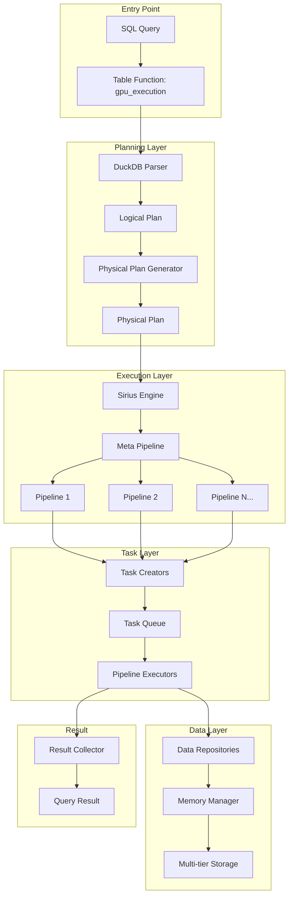
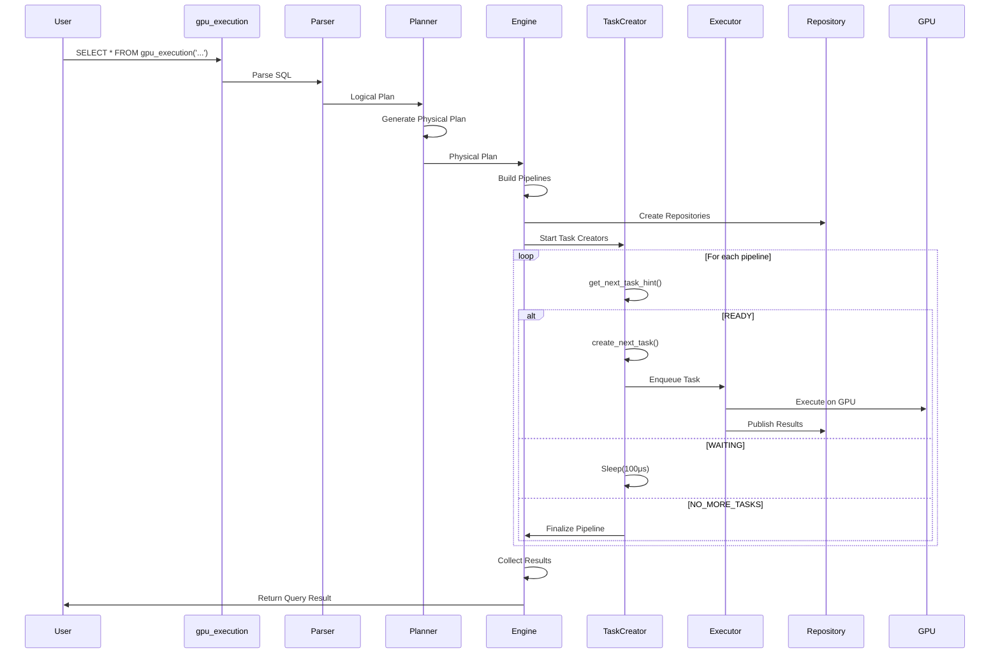
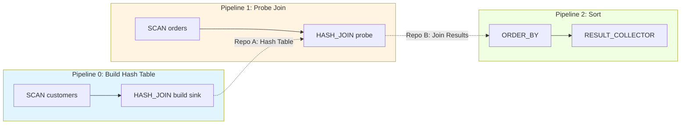
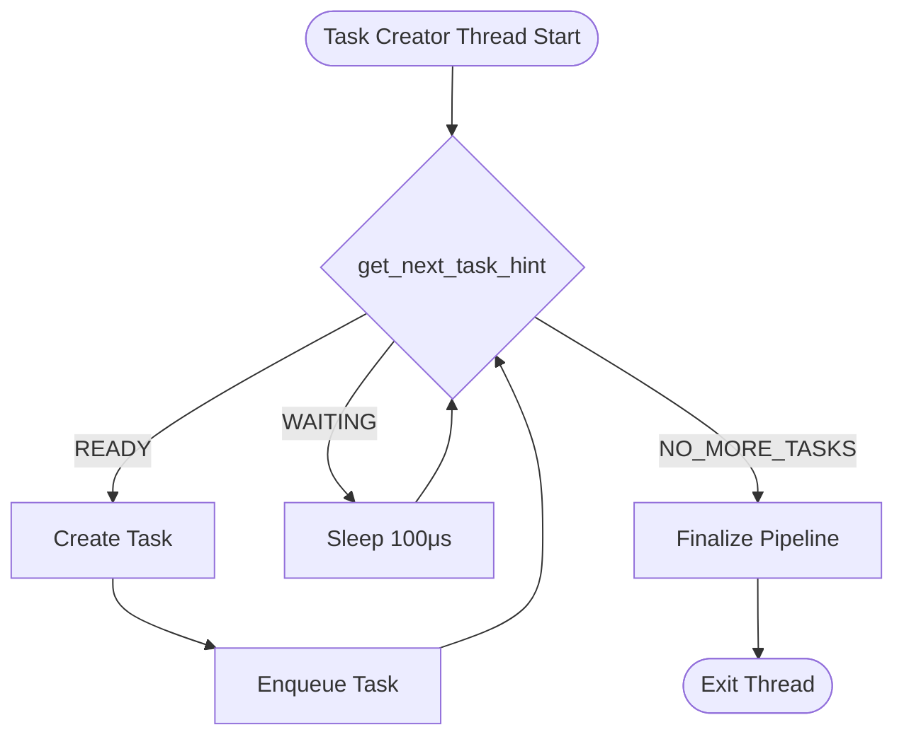
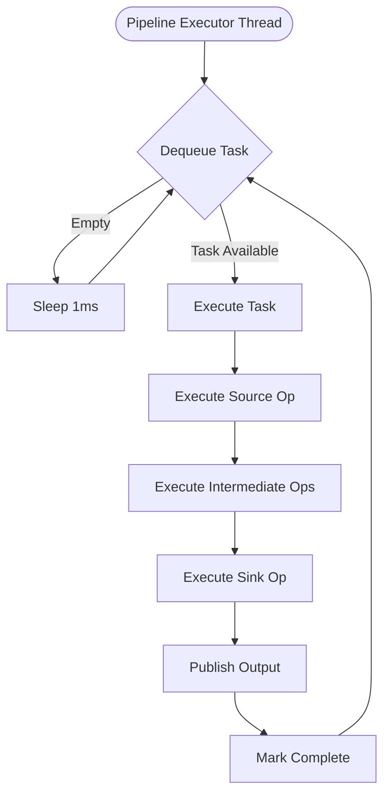
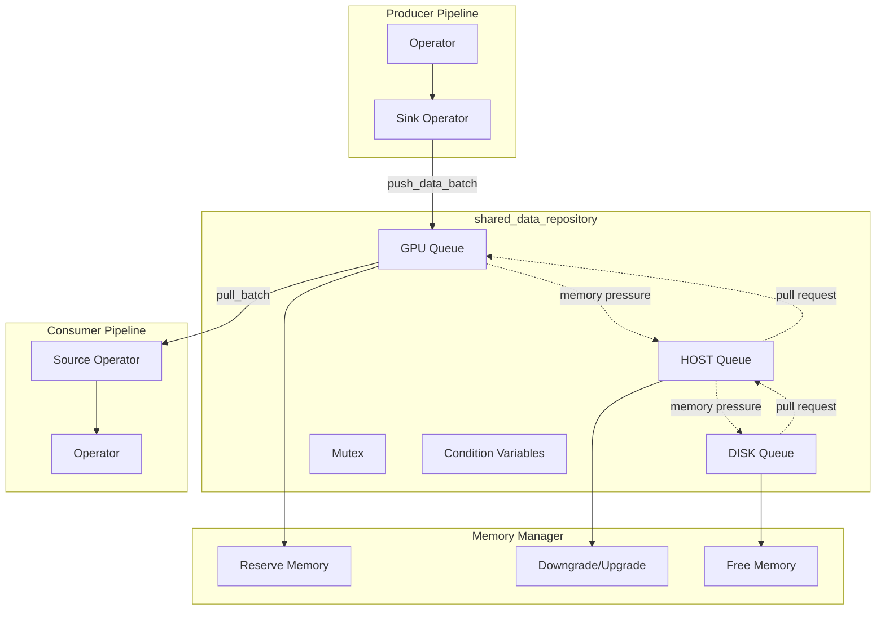
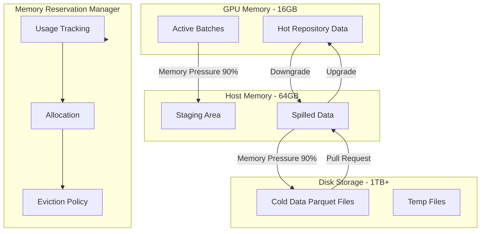

# New Mode Architecture Diagrams

Visual representation of Sirius New Mode architecture using Mermaid diagrams and ASCII art. This document provides multiple views of the system at different levels of abstraction.

---

## Table of Contents

1. [High-Level Architecture](#high-level-architecture)
2. [Query Execution Flow](#query-execution-flow)
3. [Pipeline Structure](#pipeline-structure)
4. [Task Creation and Execution](#task-creation-and-execution)
5. [Data Repository System](#data-repository-system)
6. [Memory Management](#memory-management)
7. [Component Interactions](#component-interactions)

---

## High-Level Architecture

### System Overview



### Layer Breakdown

```
┌─────────────────────────────────────────────────────────────────┐
│                         USER LAYER                               │
│  SQL Query → gpu_execution('SELECT ...') → Query Result         │
└─────────────────────────────────────────────────────────────────┘
                              ↓
┌─────────────────────────────────────────────────────────────────┐
│                      PLANNING LAYER                              │
│  DuckDB Parser → Logical Plan → Physical Plan Generator         │
│  Files: src/planner/sirius_physical_plan_generator.cpp          │
└─────────────────────────────────────────────────────────────────┘
                              ↓
┌─────────────────────────────────────────────────────────────────┐
│                     EXECUTION LAYER                              │
│  sirius_engine → Meta Pipeline → Pipelines → Operators          │
│  Files: src/sirius_engine.cpp, src/pipeline/*                   │
└─────────────────────────────────────────────────────────────────┘
                              ↓
┌─────────────────────────────────────────────────────────────────┐
│                        TASK LAYER                                │
│  Task Creators → Task Queue → Pipeline Executors                │
│  Files: src/parallel/task_creator.cpp, task_executor.cpp        │
└─────────────────────────────────────────────────────────────────┘
                              ↓
┌─────────────────────────────────────────────────────────────────┐
│                        DATA LAYER                                │
│  Data Batches → Repositories → Memory Manager → GPU/HOST/DISK   │
│  Files: cucascade/*, src/memory/*                               │
└─────────────────────────────────────────────────────────────────┘
```

---

## Query Execution Flow

### Complete Flow Diagram



### Execution Timeline

```
Time: 0ms - Query Submitted
├─ Parse SQL (2ms)
├─ Generate Logical Plan (10ms)
└─ Generate Physical Plan (20ms)

Time: 32ms - Execution Start
├─ Build Pipelines (5ms)
├─ Create Repositories (3ms)
└─ Start Task Creators (2ms)

Time: 42ms - Task Execution
├─ Pipeline 1 Task Creation begins
├─ Pipeline 2 Task Creation begins (waits for repo data)
├─ Pipeline 3 Task Creation begins (waits for repo data)
│
├─ T=50ms: Pipeline 1 Task 0 executes (SCAN → FILTER)
├─ T=55ms: Pipeline 1 Task 1 executes
├─ T=60ms: Repository A has data
├─ T=62ms: Pipeline 2 Task 0 executes (pulls from Repo A)
├─ T=100ms: Pipeline 1 complete (finalize)
├─ T=120ms: Pipeline 2 complete
└─ T=140ms: Pipeline 3 complete

Time: 140ms - Result Collection
├─ Collect final results (5ms)
├─ Transfer GPU → HOST (10ms)
└─ Convert to DuckDB format (5ms)

Time: 160ms - Query Complete
```

---

## Pipeline Structure

### Multi-Pipeline Query

**Example**: Join with Order By

```
Query:
  SELECT o.order_id, c.name, o.amount
  FROM orders o
  JOIN customers c ON o.customer_id = c.id
  ORDER BY o.amount DESC
```

**Pipeline Graph**:



### ASCII Pipeline Structure

```
Pipeline 0 (Build):
┌─────────────────────┐
│  SCAN customers     │ ← Source
├─────────────────────┤
│  (no intermediate)  │
├─────────────────────┤
│  HASH_JOIN (build)  │ ← Sink
└──────────┬──────────┘
           │ push_data_batch()
           ↓
    ┌──────────────┐
    │ Repository A │ (Hash Table)
    │  GPU Queue   │
    └──────────────┘

Pipeline 1 (Probe):
    ┌──────────────┐
    │ Repository A │
    └──────┬───────┘
           │ pull_batch()
           ↓
┌─────────────────────┐
│  HASH_JOIN (probe)  │ ← Source
├─────────────────────┤
│  SCAN orders        │ ← Probe data source
├─────────────────────┤
│  (no sink)          │
└──────────┬──────────┘
           │ push_data_batch()
           ↓
    ┌──────────────┐
    │ Repository B │ (Join Results)
    │  GPU Queue   │
    │  HOST Queue  │ (spilled)
    └──────────────┘

Pipeline 2 (Sort):
    ┌──────────────┐
    │ Repository B │
    └──────┬───────┘
           │ pull_batch()
           ↓
┌─────────────────────┐
│  ORDER_BY           │ ← Source
├─────────────────────┤
│  (no intermediate)  │
├─────────────────────┤
│  RESULT_COLLECTOR   │ ← Sink
└─────────────────────┘
           ↓
      Query Result
```

---

## Task Creation and Execution

### Task Creator Flow



### Task Execution Flow



### Task Execution Detail

```
Task Execution (sirius_pipeline_itask::compute_task):

1. Execute Source Operator
   ┌────────────────────────────────┐
   │ if (DUMMY_SCAN)                │
   │   current_batch = input_batch  │ ← From repository
   │ else                            │
   │   current_batch = source->     │
   │     execute(input_batch)       │ ← Generate data
   └────────────────────────────────┘
                ↓
2. Execute Intermediate Operators (loop)
   ┌────────────────────────────────┐
   │ for (op : intermediate_ops)    │
   │   current_batch = op->         │
   │     execute(current_batch)     │ ← Transform data
   │   if (current_batch.empty())   │
   │     return (filtered out)      │
   └────────────────────────────────┘
                ↓
3. Execute Sink Operator (if any)
   ┌────────────────────────────────┐
   │ if (sink)                      │
   │   sink->sink(current_batch)    │ ← Consume data
   │ else                            │
   │   output_batch = current_batch │ ← Save for publish
   └────────────────────────────────┘
                ↓
4. Publish Output (if any)
   ┌────────────────────────────────┐
   │ for (port : output_ports)      │
   │   port->push_data_batch(       │
   │     output_batch.clone())      │ ← To repository
   └────────────────────────────────┘
```

---

## Data Repository System

### Repository Architecture



### Multi-Tier Storage

```
Data Batch Lifecycle:

1. Creation (Producer)
   ┌──────────────────┐
   │  Create Batch    │ ← Operator output
   │  (GPU memory)    │
   └────────┬─────────┘
            ↓
2. Push to Repository
   ┌──────────────────────────────────────────┐
   │  Determine Target Tier:                  │
   │  • GPU available?  → GPU Queue           │
   │  • HOST available? → Downgrade to HOST   │
   │  • DISK needed?    → Downgrade to DISK   │
   └────────┬─────────────────────────────────┘
            ↓
3. Multi-Tier Storage
   ╔════════════════════════════════════════╗
   ║           Data Repository               ║
   ╠════════════════════════════════════════╣
   ║  GPU Tier (Fastest)                    ║
   ║  ┌────┬────┬────┬────┐                 ║
   ║  │ B0 │ B1 │ B2 │ B3 │  ← Active       ║
   ║  └────┴────┴────┴────┘                 ║
   ║  ────────────────────────────────────  ║
   ║  HOST Tier (Fast)                      ║
   ║  ┌────┬────┬────┬────┬────┐           ║
   ║  │ B4 │ B5 │ B6 │ B7 │ B8 │ ← Spilled ║
   ║  └────┴────┴────┴────┴────┘           ║
   ║  ────────────────────────────────────  ║
   ║  DISK Tier (Slow)                      ║
   ║  ┌────┬────┬────┐                      ║
   ║  │ B9 │B10 │B11 │  ← Cold             ║
   ║  └────┴────┴────┘                      ║
   ╚════════════════════════════════════════╝
            ↓
4. Pull from Repository (Consumer)
   ┌──────────────────────────────────────────┐
   │  Try GPU Queue:                          │
   │  • Available? → Return immediately       │
   │                                           │
   │  Try HOST Queue:                         │
   │  • Available? → Upgrade to GPU, return   │
   │                                           │
   │  Try DISK Queue:                         │
   │  • Available? → Upgrade to HOST → GPU    │
   │                                           │
   │  All Empty:                              │
   │  • Wait for producer (cv.wait)           │
   └────────┬─────────────────────────────────┘
            ↓
5. Consumption
   ┌──────────────────┐
   │  Process Batch   │ ← Consumer operator
   │  (GPU memory)    │
   └──────────────────┘
```

---

## Memory Management

### Memory Hierarchy



### Memory Pressure Response

```
Normal Operation (< 80% usage):
┌────────────────────────────────────┐
│ GPU:  ▓▓▓▓▓▓▓▓░░░░  75% (12GB)    │
│ HOST: ▓▓▓▓░░░░░░░░  40% (25GB)    │
│ DISK: ▓░░░░░░░░░░░  10% (100GB)   │
└────────────────────────────────────┘
        ↓
    No action


Memory Pressure (> 90% usage):
┌────────────────────────────────────┐
│ GPU:  ▓▓▓▓▓▓▓▓▓▓▓▓  92% (14.7GB)  │ ← Pressure!
│ HOST: ▓▓▓▓░░░░░░░░  40% (25GB)    │
│ DISK: ▓░░░░░░░░░░░  10% (100GB)   │
└────────────────────────────────────┘
        ↓
Downgrade Executor Triggered
        ↓
┌────────────────────────────────────┐
│ 1. Find LRU batches in GPU         │
│ 2. Transfer to HOST (cudaMemcpy)   │
│ 3. Free GPU memory                 │
└────────────────────────────────────┘
        ↓
After Spilling:
┌────────────────────────────────────┐
│ GPU:  ▓▓▓▓▓▓▓▓░░░░  78% (12.5GB)  │ ← Restored
│ HOST: ▓▓▓▓▓░░░░░░░  48% (31GB)    │ ← Increased
│ DISK: ▓░░░░░░░░░░░  10% (100GB)   │
└────────────────────────────────────┘


Critical Pressure (> 90% HOST):
┌────────────────────────────────────┐
│ GPU:  ▓▓▓▓▓▓▓▓░░░░  78% (12.5GB)  │
│ HOST: ▓▓▓▓▓▓▓▓▓▓▓░  93% (60GB)    │ ← Pressure!
│ DISK: ▓░░░░░░░░░░░  10% (100GB)   │
└────────────────────────────────────┘
        ↓
Second-Level Spilling
        ↓
┌────────────────────────────────────┐
│ 1. Find LRU batches in HOST        │
│ 2. Write to Parquet files (DISK)   │
│ 3. Free HOST memory                │
└────────────────────────────────────┘
        ↓
After Second Spilling:
┌────────────────────────────────────┐
│ GPU:  ▓▓▓▓▓▓▓▓░░░░  78% (12.5GB)  │
│ HOST: ▓▓▓▓▓▓░░░░░░  65% (42GB)    │ ← Restored
│ DISK: ▓▓▓░░░░░░░░░  28% (280GB)   │ ← Increased
└────────────────────────────────────┘
```

---

## Component Interactions

### Query Initialization

```
User submits query:
  SELECT * FROM gpu_execution('SELECT category, SUM(price) FROM sales GROUP BY category')

Step 1: Table Function Entry
┌─────────────────────────────────────────────────────────┐
│ gpu_execution() (sirius_extension.cpp:353-409)         │
│ • Parse query string                                     │
│ • Create SiriusInterface                                │
│ • Call sirius_interface::execute_query()                │
└─────────────────────────────────────────────────────────┘
                        ↓
Step 2: Query Planning
┌─────────────────────────────────────────────────────────┐
│ sirius_interface (sirius_interface.cpp)                 │
│ • DuckDB Parser: SQL → Logical Plan                    │
│ • Physical Plan Generator: Logical → Physical Plan     │
│   - Identify pipeline breaks (GROUP BY → ORDER BY)     │
│   - Create operators (SCAN, FILTER, HASH_GROUP_BY)     │
│   - Build pipeline graph                                │
└─────────────────────────────────────────────────────────┘
                        ↓
Step 3: Engine Initialization
┌─────────────────────────────────────────────────────────┐
│ sirius_engine (sirius_engine.cpp)                       │
│ • Create Meta Pipeline                                  │
│ • Build Pipelines:                                      │
│   - Pipeline 0: SCAN → FILTER → HASH_GROUP_BY (sink)   │
│   - Pipeline 1: ORDER_BY → RESULT_COLLECTOR            │
│ • Create Repositories:                                  │
│   - Repository A: Pipeline 0 output → Pipeline 1 input │
│ • Initialize CUDA streams (4 per pipeline)             │
└─────────────────────────────────────────────────────────┘
                        ↓
Step 4: Task Creation
┌─────────────────────────────────────────────────────────┐
│ Task Creators (task_creator.cpp)                        │
│ • Spawn 2 task creator threads                          │
│ • Thread 1: Pipeline 0                                  │
│   - Loop: get_next_task_hint() → create_next_task()    │
│ • Thread 2: Pipeline 1                                  │
│   - Loop: get_next_task_hint() (waits for Repo A)      │
└─────────────────────────────────────────────────────────┘
                        ↓
Step 5: Task Execution
┌─────────────────────────────────────────────────────────┐
│ Pipeline Executors (task_executor.cpp)                  │
│ • 4 executor threads pull from task queue               │
│ • Execute tasks on GPU using CUDA streams               │
│ • Publish results to repositories                       │
└─────────────────────────────────────────────────────────┘
                        ↓
Step 6: Result Collection
┌─────────────────────────────────────────────────────────┐
│ Result Collector (sirius_physical_result_collector.cpp) │
│ • Collect all output batches                            │
│ • Transfer GPU → HOST                                   │
│ • Convert to DuckDB QueryResult                         │
└─────────────────────────────────────────────────────────┘
                        ↓
                  Query Result
```

### Concurrent Execution Timeline

```
Timeline showing concurrent pipeline execution:

Time →
0ms                50ms               100ms              150ms

Pipeline 0 (No dependencies):
├─────────────────────────────────────┤ Tasks 0-9
│ SCAN → FILTER → HASH_GROUP_BY      │
└─────────────────────────────────────┘
                    ↓
              Repository A
              Push batches
                    ↓
Pipeline 1 (Depends on Pipeline 0):
              ├───────────────────────────────────┤ Tasks 0-9
              │ Pull from Repo A                  │
              │ ORDER_BY → RESULT_COLLECTOR       │
              └───────────────────────────────────┘

Key observations:
• Pipeline 1 starts at ~30ms (doesn't wait for Pipeline 0 to complete)
• Overlap period: 30ms-100ms (both pipelines running)
• Total time: 150ms (vs 200ms sequential)
• Speedup: 1.33x due to overlap
```

---

## Complete System Diagram

```
┌─────────────────────────────────────────────────────────────────────────────────┐
│                                  SIRIUS NEW MODE                                 │
├─────────────────────────────────────────────────────────────────────────────────┤
│                                                                                  │
│  ┌────────────────────────────────────────────────────────────────────────────┐ │
│  │                           QUERY ENTRY POINT                                 │ │
│  │  gpu_execution('SELECT ...') → sirius_interface::execute_query()          │ │
│  │  Location: src/sirius_extension.cpp, src/sirius_interface.cpp            │ │
│  └────────────────────────────────────────────────────────────────────────────┘ │
│                                       ↓                                          │
│  ┌────────────────────────────────────────────────────────────────────────────┐ │
│  │                           PLANNING LAYER                                    │ │
│  │  DuckDB Parser → Logical Plan → Physical Plan Generator                   │ │
│  │  • Identify operators (SCAN, FILTER, JOIN, AGG, SORT)                     │ │
│  │  • Determine pipeline breaks (ORDER BY, GROUP BY finalize)                │ │
│  │  • Build operator tree with dependencies                                  │ │
│  │  Location: src/planner/sirius_physical_plan_generator.cpp                │ │
│  └────────────────────────────────────────────────────────────────────────────┘ │
│                                       ↓                                          │
│  ┌────────────────────────────────────────────────────────────────────────────┐ │
│  │                           EXECUTION ENGINE                                  │ │
│  │  sirius_engine → sirius_meta_pipeline → sirius_pipeline[]                 │ │
│  │  • Create pipelines from physical plan                                    │ │
│  │  • Allocate CUDA streams (4 per pipeline)                                 │ │
│  │  • Create data repositories for pipeline breaks                           │ │
│  │  • Connect pipelines via ports (input/output)                             │ │
│  │  Location: src/sirius_engine.cpp, src/pipeline/sirius_meta_pipeline.cpp  │ │
│  └────────────────────────────────────────────────────────────────────────────┘ │
│                                       ↓                                          │
│  ┌─────────────────────────────┬──────────────────────────────────────────────┐ │
│  │     TASK CREATION           │         TASK EXECUTION                       │ │
│  │  ┌─────────────────────┐    │    ┌────────────────────────────────────┐  │ │
│  │  │ Task Creator Thread │    │    │  Pipeline Executor Thread Pool    │  │ │
│  │  │  • get_next_task_   │    │    │  • Dequeue tasks from queue        │  │ │
│  │  │    hint()           │───────→  │  • compute_task() on GPU           │  │ │
│  │  │  • create_next_    │    │    │  • Use CUDA streams                │  │ │
│  │  │    task()           │    │    │  • Publish to repositories         │  │ │
│  │  │  • Enqueue to      │    │    │  Location: src/parallel/           │  │ │
│  │  │    task queue       │    │    │    pipeline_executor.cpp           │  │ │
│  │  │  Location: src/    │    │    └────────────────────────────────────┘  │ │
│  │  │    parallel/task_  │    │                                              │ │
│  │  │    creator.cpp     │    │                                              │ │
│  │  └─────────────────────┘    │                                              │ │
│  └─────────────────────────────┴──────────────────────────────────────────────┘ │
│                                       ↓                                          │
│  ┌────────────────────────────────────────────────────────────────────────────┐ │
│  │                           DATA REPOSITORIES                                 │ │
│  │  shared_data_repository: Multi-tier buffering for inter-pipeline data     │ │
│  │  ┌──────────────┐  ┌──────────────┐  ┌──────────────┐                   │ │
│  │  │  GPU Queue   │  │  HOST Queue  │  │  DISK Queue  │                   │ │
│  │  │ [batch0-3]   │←→│ [batch4-8]   │←→│ [batch9-11]  │                   │ │
│  │  └──────────────┘  └──────────────┘  └──────────────┘                   │ │
│  │  • push_data_batch() / pull_batch()                                       │ │
│  │  • Automatic tier management (GPU → HOST → DISK)                          │ │
│  │  Location: cucascade/src/data_repository.cpp                             │ │
│  └────────────────────────────────────────────────────────────────────────────┘ │
│                                       ↓                                          │
│  ┌────────────────────────────────────────────────────────────────────────────┐ │
│  │                           MEMORY MANAGEMENT                                 │ │
│  │  memory_reservation_manager: Track and manage multi-tier memory           │ │
│  │  ┌──────────────────┐  ┌──────────────────┐  ┌──────────────────┐       │ │
│  │  │  GPU Memory      │  │  HOST Memory     │  │  DISK Storage    │       │ │
│  │  │  Limit: 16GB     │  │  Limit: 64GB     │  │  Limit: 1TB      │       │ │
│  │  │  Usage: 12GB     │  │  Usage: 30GB     │  │  Usage: 200GB    │       │ │
│  │  └──────────────────┘  └──────────────────┘  └──────────────────┘       │ │
│  │  • reserve() / release() / move_reservation()                             │ │
│  │  • Automatic spilling when thresholds exceeded                            │ │
│  │  Location: cucascade/src/memory_reservation_manager.cpp                  │ │
│  └────────────────────────────────────────────────────────────────────────────┘ │
│                                       ↓                                          │
│  ┌────────────────────────────────────────────────────────────────────────────┐ │
│  │                           RESULT COLLECTION                                 │ │
│  │  sirius_physical_result_collector                                          │ │
│  │  • Collect final batches from last pipeline                                │ │
│  │  • Transfer GPU → HOST (cudaMemcpy)                                        │ │
│  │  • Convert cuDF table → DuckDB DataChunk → QueryResult                     │ │
│  │  Location: src/op/sirius_physical_result_collector.cpp                    │ │
│  └────────────────────────────────────────────────────────────────────────────┘ │
│                                       ↓                                          │
│                                  Query Result                                    │
└─────────────────────────────────────────────────────────────────────────────────┘
```

---

## See Also

- [New Mode Overview](overview.md) - Introduction to New Mode
- [Entry Points](entry-points.md) - How to invoke New Mode
- [Operators](operators.md) - Operator implementations
- [Pipeline Execution](pipeline-execution.md) - Pipeline structure
- [Task Creation](task-creation.md) - Dynamic task creation
- [Cucascade Integration](cucascade-integration.md) - Data management
- [New Data Flow](../06-data-flow/new-data-flow.md) - Complete data flow
