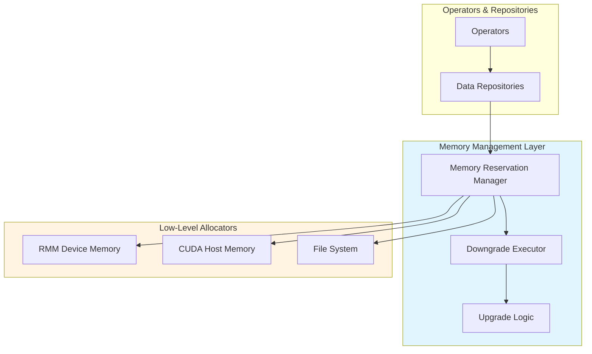

# Memory Management

Comprehensive guide to Sirius multi-tier memory management system, covering GPU, HOST, and DISK tiers, automatic spilling, and memory reservation.

---

## Overview

Sirius uses a **multi-tier memory hierarchy** to enable queries larger than GPU memory by automatically spilling data across GPU → HOST → DISK.

**Key Features**:
- **Three tiers**: GPU (fastest) → HOST (fast) → DISK (slow)
- **Automatic spilling**: Transparent downgrade on memory pressure
- **Automatic upgrade**: Transparent upgrade on access
- **Memory reservation**: Track allocations across all tiers
- **Configurable limits**: Set maximum usage per tier

---

## Memory Hierarchy

### Tier Characteristics

| Tier | Storage | Typical Size | Bandwidth | Latency | Use Case |
|------|---------|--------------|-----------|---------|----------|
| **GPU** | VRAM (cudaMalloc) | 16-80GB | ~2TB/s | 1-10μs | Active computation |
| **HOST** | Pinned RAM (cudaMallocHost) | 64-512GB | 32GB/s | 100μs | Staging, spill |
| **DISK** | NVMe SSD (Parquet files) | 1TB+ | 5-7GB/s | 1-10ms | Cold storage |

### Memory Flow

```
┌──────────────────────────────────────────────────────┐
│                     GPU Memory                        │
│  • Active data batches being processed               │
│  • Recent results in repositories                    │
│  • Hash tables for joins/aggregates                  │
│  Limit: 16GB (configurable)                          │
└────────────────────┬─────────────────────────────────┘
                     │ Automatic Spill (> 90% usage)
                     ↓
┌──────────────────────────────────────────────────────┐
│                    HOST Memory                        │
│  • Spilled data batches                              │
│  • Intermediate results awaiting GPU                 │
│  • Staging area for large operations                 │
│  Limit: 64GB (configurable)                          │
└────────────────────┬─────────────────────────────────┘
                     │ Automatic Spill (> 90% usage)
                     ↓
┌──────────────────────────────────────────────────────┐
│                    DISK Storage                       │
│  • Cold data in Parquet format                       │
│  • Temporary spill files                             │
│  • Unlimited (or configurable limit)                 │
└──────────────────────────────────────────────────────┘
```

---

## Architecture

### Components



---

## Memory Reservation Manager

### Core Class

**Location**: `cucascade/include/memory_reservation_manager.hpp`

```cpp
class memory_reservation_manager {
private:
    // Memory limits (bytes)
    size_t gpu_limit_;
    size_t host_limit_;
    size_t disk_limit_;  // -1 = unlimited

    // Current usage (atomic for thread-safety)
    std::atomic<size_t> gpu_usage_{0};
    std::atomic<size_t> host_usage_{0};
    std::atomic<size_t> disk_usage_{0};

    // Reservation tracking
    struct Reservation {
        ReservationID id;
        size_t size_bytes;
        MemoryTier tier;
        std::chrono::time_point<std::chrono::steady_clock> created_at;
        std::string owner;  // For debugging
    };

    std::unordered_map<ReservationID, Reservation> reservations_;
    std::atomic<ReservationID> next_reservation_id_{0};

    // Thread safety
    std::mutex mutex_;

public:
    // Constructor
    memory_reservation_manager(
        size_t gpu_limit,
        size_t host_limit,
        size_t disk_limit = -1
    );

    // Reservation API
    ReservationID reserve(size_t size_bytes, MemoryTier tier, std::string owner = "");
    void release(ReservationID id);
    void move_reservation(ReservationID id, MemoryTier from_tier, MemoryTier to_tier);

    // Capacity checks
    bool gpu_has_space(size_t size_bytes) const;
    bool host_has_space(size_t size_bytes) const;
    bool disk_has_space(size_t size_bytes) const;

    // Statistics
    size_t get_gpu_usage() const { return gpu_usage_.load(); }
    size_t get_host_usage() const { return host_usage_.load(); }
    size_t get_disk_usage() const { return disk_usage_.load(); }

    double get_gpu_utilization() const {
        return static_cast<double>(gpu_usage_) / gpu_limit_;
    }

    double get_host_utilization() const {
        return static_cast<double>(host_usage_) / host_limit_;
    }

    double get_disk_utilization() const {
        if (disk_limit_ == static_cast<size_t>(-1)) return 0.0;
        return static_cast<double>(disk_usage_) / disk_limit_;
    }

    void print_stats() const;
};
```

### Reserve Memory

**Implementation**: `cucascade/src/memory_reservation_manager.cpp:50-120`

```cpp
ReservationID memory_reservation_manager::reserve(
    size_t size_bytes,
    MemoryTier tier,
    std::string owner
) {
    std::lock_guard<std::mutex> lock(mutex_);

    // Check capacity
    switch (tier) {
        case MemoryTier::GPU:
            if (gpu_usage_ + size_bytes > gpu_limit_) {
                throw OutOfMemoryException(
                    "GPU memory limit exceeded: " +
                    std::to_string(gpu_usage_ + size_bytes) + " > " +
                    std::to_string(gpu_limit_)
                );
            }
            gpu_usage_ += size_bytes;
            break;

        case MemoryTier::HOST:
            if (host_usage_ + size_bytes > host_limit_) {
                throw OutOfMemoryException(
                    "HOST memory limit exceeded: " +
                    std::to_string(host_usage_ + size_bytes) + " > " +
                    std::to_string(host_limit_)
                );
            }
            host_usage_ += size_bytes;
            break;

        case MemoryTier::DISK:
            if (disk_limit_ != static_cast<size_t>(-1) &&
                disk_usage_ + size_bytes > disk_limit_) {
                throw OutOfMemoryException(
                    "DISK space limit exceeded: " +
                    std::to_string(disk_usage_ + size_bytes) + " > " +
                    std::to_string(disk_limit_)
                );
            }
            disk_usage_ += size_bytes;
            break;
    }

    // Create reservation
    ReservationID id = next_reservation_id_++;
    reservations_[id] = Reservation{
        .id = id,
        .size_bytes = size_bytes,
        .tier = tier,
        .created_at = std::chrono::steady_clock::now(),
        .owner = owner
    };

    LOG_TRACE("Reserved {} bytes in {} tier (ID={}, owner={})",
              size_bytes, to_string(tier), id, owner);

    return id;
}
```

### Release Memory

```cpp
void memory_reservation_manager::release(ReservationID id) {
    std::lock_guard<std::mutex> lock(mutex_);

    auto it = reservations_.find(id);
    if (it == reservations_.end()) {
        LOG_WARN("Attempted to release unknown reservation: {}", id);
        return;
    }

    const Reservation& res = it->second;

    // Update usage counters
    switch (res.tier) {
        case MemoryTier::GPU:
            gpu_usage_ -= res.size_bytes;
            break;
        case MemoryTier::HOST:
            host_usage_ -= res.size_bytes;
            break;
        case MemoryTier::DISK:
            disk_usage_ -= res.size_bytes;
            break;
    }

    LOG_TRACE("Released {} bytes from {} tier (ID={})",
              res.size_bytes, to_string(res.tier), id);

    // Remove reservation
    reservations_.erase(it);
}
```

### Move Reservation

**Used when tier changes** (e.g., GPU → HOST during spilling)

```cpp
void memory_reservation_manager::move_reservation(
    ReservationID id,
    MemoryTier from_tier,
    MemoryTier to_tier
) {
    std::lock_guard<std::mutex> lock(mutex_);

    auto it = reservations_.find(id);
    if (it == reservations_.end()) {
        throw InternalException("Reservation not found: " + std::to_string(id));
    }

    Reservation& res = it->second;

    if (res.tier != from_tier) {
        throw InternalException(
            "Reservation tier mismatch: expected " + to_string(from_tier) +
            ", actual " + to_string(res.tier)
        );
    }

    // Check capacity at target tier
    switch (to_tier) {
        case MemoryTier::GPU:
            if (gpu_usage_ + res.size_bytes > gpu_limit_) {
                throw OutOfMemoryException("GPU limit exceeded during move");
            }
            break;
        case MemoryTier::HOST:
            if (host_usage_ + res.size_bytes > host_limit_) {
                throw OutOfMemoryException("HOST limit exceeded during move");
            }
            break;
        case MemoryTier::DISK:
            if (disk_limit_ != static_cast<size_t>(-1) &&
                disk_usage_ + res.size_bytes > disk_limit_) {
                throw OutOfMemoryException("DISK limit exceeded during move");
            }
            break;
    }

    // Update usage counters
    switch (from_tier) {
        case MemoryTier::GPU:
            gpu_usage_ -= res.size_bytes;
            break;
        case MemoryTier::HOST:
            host_usage_ -= res.size_bytes;
            break;
        case MemoryTier::DISK:
            disk_usage_ -= res.size_bytes;
            break;
    }

    switch (to_tier) {
        case MemoryTier::GPU:
            gpu_usage_ += res.size_bytes;
            break;
        case MemoryTier::HOST:
            host_usage_ += res.size_bytes;
            break;
        case MemoryTier::DISK:
            disk_usage_ += res.size_bytes;
            break;
    }

    // Update reservation
    res.tier = to_tier;

    LOG_DEBUG("Moved reservation {} from {} to {} ({} bytes)",
              id, to_string(from_tier), to_string(to_tier), res.size_bytes);
}
```

---

## Automatic Spilling

### Downgrade Executor

**Purpose**: Monitor memory pressure and trigger spilling

**Location**: `src/parallel/downgrade_executor.cpp`

```cpp
class downgrade_executor : public itask_executor {
private:
    memory_reservation_manager& mem_mgr_;
    data_repository_manager& repo_mgr_;

    // Thresholds
    double gpu_spill_threshold_ = 0.9;   // Spill at 90%
    double host_spill_threshold_ = 0.9;
    double gpu_restore_threshold_ = 0.8; // Stop spilling at 80%
    double host_restore_threshold_ = 0.8;

    // Timing
    std::chrono::milliseconds check_interval_{100};  // Check every 100ms

public:
    downgrade_executor(
        memory_reservation_manager& mem_mgr,
        data_repository_manager& repo_mgr
    ) : mem_mgr_(mem_mgr), repo_mgr_(repo_mgr) {}

    void run() override {
        LOG_INFO("Downgrade executor: starting");

        while (!should_stop_) {
            // Check GPU pressure
            check_and_spill_gpu();

            // Check HOST pressure
            check_and_spill_host();

            // Sleep before next check
            std::this_thread::sleep_for(check_interval_);
        }

        LOG_INFO("Downgrade executor: stopped");
    }

private:
    void check_and_spill_gpu();
    void check_and_spill_host();
};
```

### GPU Spilling

```cpp
void downgrade_executor::check_and_spill_gpu() {
    double gpu_util = mem_mgr_.get_gpu_utilization();

    if (gpu_util > gpu_spill_threshold_) {
        LOG_INFO("GPU memory pressure: {:.1f}% (threshold={:.1f}%)",
                 gpu_util * 100, gpu_spill_threshold_ * 100);

        // Find eviction candidates from repositories
        auto candidates = find_spill_candidates(MemoryTier::GPU);

        size_t total_spilled = 0;

        for (auto& [repo, batch_idx] : candidates) {
            // Downgrade GPU → HOST
            try {
                size_t batch_size = repo->downgrade_batch_at_index(
                    batch_idx,
                    MemoryTier::HOST
                );

                total_spilled += batch_size;

                LOG_DEBUG("Spilled GPU batch {} from repository '{}' ({} bytes)",
                          batch_idx, repo->get_name(), batch_size);

                // Check if sufficient space freed
                gpu_util = mem_mgr_.get_gpu_utilization();
                if (gpu_util < gpu_restore_threshold_) {
                    LOG_INFO("GPU memory restored to {:.1f}%", gpu_util * 100);
                    break;
                }

            } catch (const std::exception& e) {
                LOG_ERROR("Failed to spill batch: {}", e.what());
            }
        }

        if (total_spilled > 0) {
            LOG_INFO("Total spilled from GPU: {} MB", total_spilled / (1024 * 1024));
        } else {
            LOG_WARN("GPU pressure but no batches to spill");
        }
    }
}

std::vector<std::pair<shared_data_repository*, size_t>>
downgrade_executor::find_spill_candidates(MemoryTier tier) {
    std::vector<std::pair<shared_data_repository*, size_t>> candidates;

    // Iterate all repositories
    for (auto& repo : repo_mgr_.get_all_repositories()) {
        // Get batches at given tier
        const auto& queue = repo->get_tier_queue(tier);

        for (size_t idx = 0; idx < queue.size(); idx++) {
            candidates.push_back({repo.get(), idx});
        }
    }

    // Sort by LRU (oldest first)
    // Simpler: use FIFO (earlier index = older)
    // Could be improved with access timestamps

    return candidates;
}
```

### HOST Spilling

```cpp
void downgrade_executor::check_and_spill_host() {
    double host_util = mem_mgr_.get_host_utilization();

    if (host_util > host_spill_threshold_) {
        LOG_INFO("HOST memory pressure: {:.1f}% (threshold={:.1f}%)",
                 host_util * 100, host_spill_threshold_ * 100);

        auto candidates = find_spill_candidates(MemoryTier::HOST);

        size_t total_spilled = 0;

        for (auto& [repo, batch_idx] : candidates) {
            // Downgrade HOST → DISK
            try {
                size_t batch_size = repo->downgrade_batch_at_index(
                    batch_idx,
                    MemoryTier::DISK
                );

                total_spilled += batch_size;

                LOG_DEBUG("Spilled HOST batch {} from repository '{}' ({} bytes)",
                          batch_idx, repo->get_name(), batch_size);

                host_util = mem_mgr_.get_host_utilization();
                if (host_util < host_restore_threshold_) {
                    LOG_INFO("HOST memory restored to {:.1f}%", host_util * 100);
                    break;
                }

            } catch (const std::exception& e) {
                LOG_ERROR("Failed to spill batch: {}", e.what());
            }
        }

        if (total_spilled > 0) {
            LOG_INFO("Total spilled from HOST: {} MB", total_spilled / (1024 * 1024));
        }
    }
}
```

---

## Tier Transfers

### GPU ↔ HOST

**GPU → HOST** (Spilling):

```cpp
data_batch downgrade_gpu_to_host(data_batch&& batch) {
    if (batch.tier != MemoryTier::GPU) {
        throw InternalException("Batch not at GPU tier");
    }

    // Allocate pinned host memory
    size_t buffer_size = batch.size_bytes;
    void* host_buffer;
    cudaError_t err = cudaMallocHost(&host_buffer, buffer_size);
    if (err != cudaSuccess) {
        throw InternalException("cudaMallocHost failed: " +
                                std::string(cudaGetErrorString(err)));
    }

    // Copy data: GPU → HOST
    err = cudaMemcpy(
        host_buffer,
        batch.table->data(),  // GPU pointer
        buffer_size,
        cudaMemcpyDeviceToHost
    );
    if (err != cudaSuccess) {
        cudaFreeHost(host_buffer);
        throw InternalException("cudaMemcpy D2H failed: " +
                                std::string(cudaGetErrorString(err)));
    }

    // Free GPU memory
    cudaFree(batch.table->data());

    // Reconstruct cuDF table on HOST
    auto host_table = reconstruct_table_from_buffer(
        host_buffer,
        batch.schema,
        batch.num_rows
    );

    // Update reservation
    mem_mgr.move_reservation(
        batch.reservation_id,
        MemoryTier::GPU,
        MemoryTier::HOST
    );

    return data_batch{
        .table = std::move(host_table),
        .tier = MemoryTier::HOST,
        .num_rows = batch.num_rows,
        .size_bytes = buffer_size,
        .schema = batch.schema,
        .reservation_id = batch.reservation_id
    };
}
```

**HOST → GPU** (Upgrade):

```cpp
data_batch upgrade_host_to_gpu(data_batch&& batch) {
    if (batch.tier != MemoryTier::HOST) {
        throw InternalException("Batch not at HOST tier");
    }

    // Allocate GPU memory
    size_t buffer_size = batch.size_bytes;
    void* gpu_buffer;
    cudaError_t err = cudaMalloc(&gpu_buffer, buffer_size);
    if (err != cudaSuccess) {
        throw OutOfMemoryException("cudaMalloc failed: " +
                                   std::string(cudaGetErrorString(err)));
    }

    // Copy data: HOST → GPU
    err = cudaMemcpy(
        gpu_buffer,
        batch.table->data(),  // HOST pointer
        buffer_size,
        cudaMemcpyHostToDevice
    );
    if (err != cudaSuccess) {
        cudaFree(gpu_buffer);
        throw InternalException("cudaMemcpy H2D failed: " +
                                std::string(cudaGetErrorString(err)));
    }

    // Free HOST memory
    cudaFreeHost(batch.table->data());

    // Reconstruct cuDF table on GPU
    auto gpu_table = reconstruct_table_from_buffer(
        gpu_buffer,
        batch.schema,
        batch.num_rows
    );

    // Update reservation
    mem_mgr.move_reservation(
        batch.reservation_id,
        MemoryTier::HOST,
        MemoryTier::GPU
    );

    return data_batch{
        .table = std::move(gpu_table),
        .tier = MemoryTier::GPU,
        .num_rows = batch.num_rows,
        .size_bytes = buffer_size,
        .schema = batch.schema,
        .reservation_id = batch.reservation_id
    };
}
```

### HOST ↔ DISK

**HOST → DISK** (Spilling):

```cpp
data_batch downgrade_host_to_disk(data_batch&& batch) {
    if (batch.tier != MemoryTier::HOST) {
        throw InternalException("Batch not at HOST tier");
    }

    // Generate temp file path
    std::string temp_path = generate_temp_parquet_path();

    // Write to Parquet
    cudf::io::table_with_metadata table_with_metadata{batch.table->view()};
    cudf::io::table_input_metadata metadata(table_with_metadata.metadata);

    auto builder = cudf::io::parquet_writer_options::builder(
        cudf::io::sink_info{temp_path}
    );
    builder.metadata(&metadata);

    cudf::io::write_parquet(builder.build());

    LOG_DEBUG("Wrote batch to disk: {} ({} bytes)", temp_path, batch.size_bytes);

    // Free HOST memory
    batch.table.reset();

    // Update reservation
    mem_mgr.move_reservation(
        batch.reservation_id,
        MemoryTier::HOST,
        MemoryTier::DISK
    );

    return data_batch{
        .table = nullptr,  // No in-memory table
        .tier = MemoryTier::DISK,
        .num_rows = batch.num_rows,
        .size_bytes = batch.size_bytes,
        .schema = batch.schema,
        .disk_path = temp_path,
        .reservation_id = batch.reservation_id
    };
}
```

**DISK → HOST** (Upgrade):

```cpp
data_batch upgrade_disk_to_host(data_batch&& batch) {
    if (batch.tier != MemoryTier::DISK) {
        throw InternalException("Batch not at DISK tier");
    }

    // Read from Parquet
    auto source = cudf::io::source_info{batch.disk_path};
    auto builder = cudf::io::parquet_reader_options::builder(source);

    auto result = cudf::io::read_parquet(builder.build());

    LOG_DEBUG("Read batch from disk: {} ({} bytes)",
              batch.disk_path, batch.size_bytes);

    // Delete temp file
    std::filesystem::remove(batch.disk_path);

    // Update reservation
    mem_mgr.move_reservation(
        batch.reservation_id,
        MemoryTier::DISK,
        MemoryTier::HOST
    );

    return data_batch{
        .table = std::move(result.tbl),
        .tier = MemoryTier::HOST,
        .num_rows = batch.num_rows,
        .size_bytes = batch.size_bytes,
        .schema = batch.schema,
        .reservation_id = batch.reservation_id
    };
}
```

---

## Configuration

### Memory Limits

**INI Format** (`sirius.cfg`):

```ini
[memory]
# GPU memory limit in MB
gpu_memory_limit = 12288  # 12GB

# HOST memory limit in MB
host_memory_limit = 49152  # 48GB

# DISK space limit in MB (-1 = unlimited)
disk_memory_limit = -1

# Enable multi-tier spilling
enable_spilling = true
```

**SQL Configuration**:

```sql
-- Set GPU memory limit
SET sirius_gpu_memory_limit = 16384;  -- 16GB

-- Set HOST memory limit
SET sirius_host_memory_limit = 65536;  -- 64GB

-- Disable spilling (for testing only!)
SET sirius_enable_spilling = false;
```

**Environment Variables**:

```bash
export SIRIUS_MEMORY_GPU_MEMORY_LIMIT=12288
export SIRIUS_MEMORY_HOST_MEMORY_LIMIT=49152
export SIRIUS_MEMORY_DISK_MEMORY_LIMIT=-1
export SIRIUS_MEMORY_ENABLE_SPILLING=true
```

### Spilling Thresholds

```ini
[memory]
# Trigger spilling when usage exceeds threshold
gpu_spill_threshold = 0.9    # 90%
host_spill_threshold = 0.9

# Stop spilling when usage falls below threshold
gpu_restore_threshold = 0.8  # 80%
host_restore_threshold = 0.8

# Downgrade executor check interval (ms)
spill_check_interval = 100
```

---

## Monitoring

### Query Memory Statistics

```sql
-- Enable monitoring
SET sirius_enable_monitoring = true;

-- Run query
SELECT * FROM gpu_execution('...');

-- View memory stats
SELECT * FROM sirius_memory_stats();
```

**Output**:

```
tier  | current_usage_mb | peak_usage_mb | limit_mb | utilization
──────┼──────────────────┼───────────────┼──────────┼────────────
GPU   | 8,192            | 12,288        | 16,384   | 75%
HOST  | 16,384           | 32,768        | 49,152   | 66%
DISK  | 4,096            | 8,192         | -1       | N/A
```

### Repository Tier Distribution

```sql
SELECT * FROM sirius_repository_stats()
WHERE query_id = last_query_id();
```

**Output**:

```
repo_name | batches_total | gpu_batches | host_batches | disk_batches | gpu_hit_rate
──────────┼───────────────┼─────────────┼──────────────┼──────────────┼─────────────
Repo A    | 100           | 85          | 12           | 3            | 85%
Repo B    | 50            | 40          | 8            | 2            | 80%
```

### Real-Time Monitoring

```bash
# Monitor memory usage in real-time
watch -n 1 'sqlite3 sirius.db "SELECT * FROM sirius_memory_stats()"'
```

---

## Performance Impact

### Transfer Costs

**Measured on A100 + PCIe Gen4**:

| Transfer | Bandwidth | 5MB Batch | 100MB Batch |
|----------|-----------|-----------|-------------|
| GPU → HOST | 32 GB/s | 0.15ms | 3ms |
| HOST → GPU | 32 GB/s | 0.15ms | 3ms |
| HOST → DISK (write) | 5 GB/s (NVMe) | 1ms | 20ms |
| DISK → HOST (read) | 7 GB/s (NVMe) | 0.7ms | 14ms |

### Query Impact

**Scenario**: 1GB intermediate result, GPU memory full

**Without Spilling** (GPU-only):
```
OutOfMemoryException: GPU allocation failed
```

**With Spilling** (Auto-managed):
```
Pipeline 1: 800ms (GPU)
Spill to HOST: +30ms
Pipeline 2: 900ms (GPU, with 30ms upgrade cost)

Total: 1,760ms (98% of pure GPU time)
```

**Key Insight**: Spilling adds ~2% overhead but enables queries that would otherwise fail.

---

## Best Practices

### 1. Size Memory Tiers Appropriately

**Recommended**:
```
GPU:  75-80% of available VRAM
HOST: 75% of available RAM
DISK: Unlimited (or large limit)
```

**Example** (Server with 64GB GPU, 256GB RAM):
```ini
[memory]
gpu_memory_limit = 51200   # 50GB (78% of 64GB)
host_memory_limit = 196608  # 192GB (75% of 256GB)
disk_memory_limit = -1      # Unlimited
```

### 2. Monitor Spilling Frequency

```sql
-- Check if spilling occurred
SELECT spill_count, total_spilled_mb
FROM sirius_query_stats()
WHERE query_id = last_query_id();
```

**Interpretation**:
- `spill_count = 0`: Excellent (no spilling)
- `spill_count < 10`: Good (minimal spilling)
- `spill_count > 50`: Poor (excessive spilling, increase GPU memory)

### 3. Optimize Query to Reduce Memory

- **Filter early**: Reduce data size before expensive operations
- **Project only needed columns**: Avoid scanning unnecessary columns
- **Break large queries**: Split into smaller queries

### 4. Adjust Batch Size

```ini
[execution]
# Smaller batches use less memory
scan_batch_size = 50000  # Default: 100000
```

### 5. Use Streaming for Large Results

```sql
-- Avoid: Collect all results at once
SELECT * FROM huge_table;

-- Better: Use LIMIT and pagination
SELECT * FROM huge_table LIMIT 100000 OFFSET 0;
SELECT * FROM huge_table LIMIT 100000 OFFSET 100000;
```

---

## Troubleshooting

### Issue: OutOfMemoryException (GPU)

**Symptoms**:
```
OutOfMemoryException: GPU memory limit exceeded: 17000 MB > 16384 MB
```

**Solutions**:
1. Increase GPU memory limit (if available)
2. Reduce batch size
3. Enable spilling (if disabled)
4. Add more selective filters

### Issue: Excessive Spilling

**Symptoms**:
- Query slow despite GPU
- High `spill_count` in stats
- Frequent "GPU memory pressure" logs

**Solutions**:
1. Increase GPU memory limit
2. Reduce intermediate result sizes (add filters)
3. Break query into smaller parts
4. Check for memory leaks (operators not releasing memory)

### Issue: DISK Space Full

**Symptoms**:
```
OutOfMemoryException: DISK space limit exceeded
```

**Solutions**:
1. Increase DISK limit (or set to unlimited)
2. Clean up temp files (`/tmp/sirius_spill_*`)
3. Reduce spilling (increase GPU/HOST memory)

---

## See Also

- [Cucascade Integration](../04-new-mode/cucascade-integration.md) - Data repository details
- [New Data Flow](../06-data-flow/new-data-flow.md) - Data flow with memory tiers
- [Configuration](configuration.md) - Configuration options
- [Performance Tips](../appendices/performance-tips.md) - Optimization guide
- [Limitations](../appendices/limitations.md) - Current memory limitations
