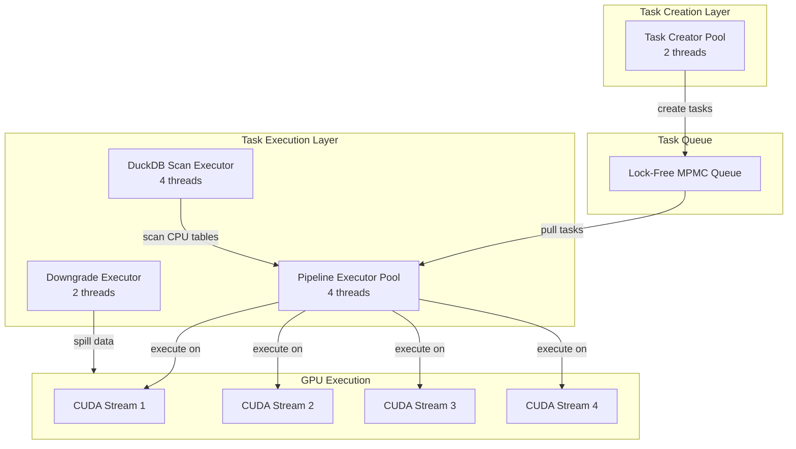

# Threading Model

Comprehensive guide to Sirius threading architecture, covering task executors, thread pools, CUDA streams, and concurrency patterns.

---

## Overview

Sirius uses a **multi-threaded, task-based execution model** with specialized thread pools for different responsibilities.

**Key Concepts**:
- **Task Executors**: Thread pools for different operations
- **CUDA Streams**: Concurrent GPU execution
- **Lock-Free Queues**: High-performance task queuing
- **Thread Affinity**: CPU pinning for performance

---

## Architecture

### Thread Pool Overview



### Thread Pool Configuration

```ini
[threading]
pipeline_executor_threads = 4    # Main GPU execution
task_creator_threads = 2         # Task creation
downgrade_executor_threads = 2   # Memory management
duckdb_scan_executor_threads = 4 # CPU scans
```

---

## Task Executor Base Class

### itask_executor

**Location**: `src/include/parallel/task_executor.hpp`

```cpp
class itask_executor {
protected:
    // Thread management
    std::vector<std::thread> threads_;
    std::atomic<bool> should_stop_{false};

    // Statistics
    std::atomic<size_t> tasks_executed_{0};
    std::atomic<size_t> total_execution_time_us_{0};

public:
    // Constructor
    itask_executor(size_t num_threads, std::string name);

    // Lifecycle
    virtual void start();
    virtual void stop();
    virtual void join();

    // Main execution loop (pure virtual)
    virtual void run() = 0;

    // Statistics
    size_t get_tasks_executed() const { return tasks_executed_.load(); }
    double get_avg_task_time_ms() const {
        if (tasks_executed_ == 0) return 0.0;
        return total_execution_time_us_.load() / (tasks_executed_ * 1000.0);
    }

    // Thread naming
    void set_thread_name(const std::string& name);
};
```

### Lifecycle

```cpp
itask_executor::itask_executor(size_t num_threads, std::string name)
    : num_threads_(num_threads), name_(name) {
    LOG_INFO("Creating {} executor with {} threads", name, num_threads);
}

void itask_executor::start() {
    // Create worker threads
    for (size_t i = 0; i < num_threads_; i++) {
        threads_.emplace_back([this, i]() {
            // Set thread name for debugging
            set_thread_name(name_ + "_" + std::to_string(i));

            // Run executor loop
            run();
        });
    }

    LOG_INFO("{} executor: started {} threads", name_, num_threads_);
}

void itask_executor::stop() {
    should_stop_.store(true);
    LOG_INFO("{} executor: stop requested", name_);
}

void itask_executor::join() {
    for (auto& thread : threads_) {
        if (thread.joinable()) {
            thread.join();
        }
    }
    LOG_INFO("{} executor: all threads joined", name_);
}
```

---

## Pipeline Executor

### Purpose

Execute GPU pipeline tasks pulled from the task queue.

**Location**: `src/parallel/pipeline_executor.cpp`

### Implementation

```cpp
class pipeline_executor : public itask_executor {
private:
    // Task queue (shared across all executors)
    task_queue& queue_;

    // CUDA stream pool (round-robin assignment)
    std::vector<cudaStream_t> streams_;

public:
    pipeline_executor(size_t num_threads, task_queue& queue)
        : itask_executor(num_threads, "pipeline_executor"),
          queue_(queue) {

        // Create CUDA streams (one per thread)
        for (size_t i = 0; i < num_threads; i++) {
            cudaStream_t stream;
            cudaStreamCreate(&stream);
            streams_.push_back(stream);
        }
    }

    ~pipeline_executor() {
        // Destroy CUDA streams
        for (auto stream : streams_) {
            cudaStreamDestroy(stream);
        }
    }

    void run() override {
        // Get thread index
        size_t thread_idx = get_thread_index();

        // Assign CUDA stream
        cudaStream_t stream = streams_[thread_idx];

        LOG_INFO("Pipeline executor thread {}: started", thread_idx);

        while (!should_stop_) {
            // Try to dequeue task (non-blocking)
            auto task_opt = queue_.try_dequeue();

            if (!task_opt.has_value()) {
                // No tasks available, sleep briefly
                std::this_thread::sleep_for(std::chrono::milliseconds(1));
                continue;
            }

            auto task = std::move(task_opt.value());

            // Execute task
            auto start_time = std::chrono::steady_clock::now();

            try {
                // Set CUDA stream for this task
                task->set_stream(stream);

                // Execute task
                task->compute_task();

                // Publish output (if any)
                task->publish_output();

                // Update statistics
                tasks_executed_++;

            } catch (const std::exception& e) {
                LOG_ERROR("Pipeline executor thread {}: task failed: {}",
                          thread_idx, e.what());
            }

            auto end_time = std::chrono::steady_clock::now();
            auto duration_us = std::chrono::duration_cast<std::chrono::microseconds>(
                end_time - start_time
            ).count();

            total_execution_time_us_ += duration_us;

            LOG_TRACE("Pipeline executor thread {}: task completed ({} μs)",
                      thread_idx, duration_us);
        }

        LOG_INFO("Pipeline executor thread {}: stopped", thread_idx);
    }

private:
    size_t get_thread_index() {
        // Find current thread in threads_ vector
        auto current_id = std::this_thread::get_id();
        for (size_t i = 0; i < threads_.size(); i++) {
            if (threads_[i].get_id() == current_id) {
                return i;
            }
        }
        return 0;  // Shouldn't happen
    }
};
```

### CUDA Stream Assignment

```
Pipeline Executor Thread 0  →  CUDA Stream 0
Pipeline Executor Thread 1  →  CUDA Stream 1
Pipeline Executor Thread 2  →  CUDA Stream 2
Pipeline Executor Thread 3  →  CUDA Stream 3

Concurrent GPU Execution:
├─ Stream 0: Task A (SCAN)
├─ Stream 1: Task B (FILTER)
├─ Stream 2: Task C (AGGREGATE)
└─ Stream 3: Task D (SCAN)
```

**Benefits**:
- Up to 4 concurrent GPU operations
- Hides memory transfer latency
- Maximizes GPU utilization

---

## Task Creator

### Purpose

Create tasks dynamically based on operator hints.

**Location**: `src/parallel/task_creator.cpp`

### Implementation

```cpp
class task_creator : public itask_executor {
private:
    // Pipelines to create tasks for
    std::vector<sirius_pipeline*> pipelines_;

    // Task queue (shared)
    task_queue& queue_;

public:
    task_creator(size_t num_threads, task_queue& queue)
        : itask_executor(num_threads, "task_creator"),
          queue_(queue) {}

    void add_pipeline(sirius_pipeline* pipeline) {
        pipelines_.push_back(pipeline);
    }

    void run() override {
        // Get thread index
        size_t thread_idx = get_thread_index();

        LOG_INFO("Task creator thread {}: started", thread_idx);

        // Assign pipelines to this thread
        // Simple strategy: round-robin assignment
        std::vector<sirius_pipeline*> my_pipelines;
        for (size_t i = thread_idx; i < pipelines_.size(); i += num_threads_) {
            my_pipelines.push_back(pipelines_[i]);
        }

        LOG_INFO("Task creator thread {}: assigned {} pipelines",
                 thread_idx, my_pipelines.size());

        // Create tasks for each pipeline
        for (auto* pipeline : my_pipelines) {
            create_tasks_for_pipeline(*pipeline);
        }

        LOG_INFO("Task creator thread {}: stopped", thread_idx);
    }

private:
    void create_tasks_for_pipeline(sirius_pipeline& pipeline) {
        LOG_INFO("Task creator: starting for pipeline {}", pipeline.pipeline_id);

        size_t wait_iterations = 0;

        while (!should_stop_) {
            // Get hint from pipeline
            TaskCreationHint hint = pipeline.get_next_task_hint();

            switch (hint) {
                case TaskCreationHint::READY: {
                    // Reset wait counter
                    wait_iterations = 0;

                    // Create task
                    auto task = pipeline.create_next_task();

                    if (task) {
                        // Enqueue for execution
                        queue_.enqueue(std::move(task));
                        pipeline.tasks_created++;
                        tasks_executed_++;  // Track in executor stats
                    }
                    break;
                }

                case TaskCreationHint::WAITING_FOR_INPUT_DATA: {
                    // Increment wait counter
                    wait_iterations++;

                    // Brief sleep to avoid busy-waiting
                    std::this_thread::sleep_for(std::chrono::microseconds(100));
                    break;
                }

                case TaskCreationHint::NO_MORE_TASKS: {
                    // Pipeline complete
                    LOG_INFO("Pipeline {}: no more tasks, finalizing",
                             pipeline.pipeline_id);

                    pipeline.finalize();
                    return;  // Exit task creator for this pipeline
                }
            }

            // Brief yield
            std::this_thread::yield();
        }

        LOG_INFO("Pipeline {}: task creator stopped prematurely",
                 pipeline.pipeline_id);
    }
};
```

### Load Balancing

**Strategy**: Round-robin pipeline assignment

```
Task Creator Thread 0:
  - Pipeline 0
  - Pipeline 2
  - Pipeline 4

Task Creator Thread 1:
  - Pipeline 1
  - Pipeline 3
  - Pipeline 5
```

**Benefits**:
- Distributes work evenly
- Avoids contention on single pipeline
- Scales with number of pipelines

---

## Downgrade Executor

### Purpose

Monitor memory pressure and trigger spilling.

**Location**: `src/parallel/downgrade_executor.cpp`

### Implementation

```cpp
class downgrade_executor : public itask_executor {
private:
    memory_reservation_manager& mem_mgr_;
    data_repository_manager& repo_mgr_;

    // Thresholds
    double gpu_spill_threshold_ = 0.9;
    double host_spill_threshold_ = 0.9;

    // Check interval
    std::chrono::milliseconds check_interval_{100};

public:
    downgrade_executor(
        size_t num_threads,
        memory_reservation_manager& mem_mgr,
        data_repository_manager& repo_mgr
    ) : itask_executor(num_threads, "downgrade_executor"),
        mem_mgr_(mem_mgr),
        repo_mgr_(repo_mgr) {}

    void run() override {
        LOG_INFO("Downgrade executor: starting");

        while (!should_stop_) {
            // Check GPU memory pressure
            check_and_spill_gpu();

            // Check HOST memory pressure
            check_and_spill_host();

            // Sleep before next check
            std::this_thread::sleep_for(check_interval_);
        }

        LOG_INFO("Downgrade executor: stopped");
    }

private:
    void check_and_spill_gpu();
    void check_and_spill_host();
};
```

**Execution Pattern**:

```
Time: 0ms
  Check GPU (75% usage) → OK
  Check HOST (50% usage) → OK
  Sleep 100ms

Time: 100ms
  Check GPU (92% usage) → SPILL!
    - Spill batch 0: GPU → HOST (5ms)
    - Spill batch 1: GPU → HOST (5ms)
    - GPU usage now 78% → OK
  Check HOST (60% usage) → OK
  Sleep 100ms

Time: 210ms
  Check GPU (80% usage) → OK
  Check HOST (93% usage) → SPILL!
    - Spill batch 0: HOST → DISK (20ms)
    - HOST usage now 82% → OK
  Sleep 100ms
```

---

## DuckDB Scan Executor

### Purpose

Execute CPU-side table scans (DuckDB tables).

**Location**: `src/parallel/duckdb_scan_executor.cpp`

### Implementation

```cpp
class duckdb_scan_executor : public itask_executor {
private:
    // Queue for DuckDB scan tasks
    scan_task_queue& scan_queue_;

public:
    duckdb_scan_executor(size_t num_threads, scan_task_queue& queue)
        : itask_executor(num_threads, "duckdb_scan_executor"),
          scan_queue_(queue) {}

    void run() override {
        LOG_INFO("DuckDB scan executor: starting");

        while (!should_stop_) {
            // Dequeue scan task
            auto task_opt = scan_queue_.try_dequeue();

            if (!task_opt.has_value()) {
                std::this_thread::sleep_for(std::chrono::milliseconds(1));
                continue;
            }

            auto task = std::move(task_opt.value());

            try {
                // Execute scan on CPU
                auto duckdb_chunk = task->scan_next_chunk();

                // Convert to cuDF
                auto cudf_table = convert_duckdb_to_cudf(duckdb_chunk);

                // Transfer to GPU
                auto gpu_batch = transfer_to_gpu(cudf_table);

                // Publish to repository
                task->publish_result(std::move(gpu_batch));

                tasks_executed_++;

            } catch (const std::exception& e) {
                LOG_ERROR("DuckDB scan executor: task failed: {}", e.what());
            }
        }

        LOG_INFO("DuckDB scan executor: stopped");
    }
};
```

**Use Case**: Join between GPU and CPU tables

```
Query:
  SELECT *
  FROM gpu_table
  JOIN cpu_table ON gpu_table.id = cpu_table.id

Execution:
  DuckDB Scan Executor (CPU):
    - Scan cpu_table batches
    - Convert DuckDB → cuDF
    - Transfer CPU → GPU
    - Push to repository

  Pipeline Executor (GPU):
    - Pull from repository
    - Join with gpu_table
    - Continue GPU processing
```

---

## Task Queue

### Lock-Free MPMC Queue

**Location**: `src/include/parallel/task_queue.hpp`

**Implementation**: Based on concurrent queue library (e.g., `moodycamel::ConcurrentQueue`)

```cpp
template <typename T>
class task_queue {
private:
    moodycamel::ConcurrentQueue<T> queue_;

public:
    // Enqueue (multiple producers)
    void enqueue(T&& item) {
        queue_.enqueue(std::forward<T>(item));
    }

    // Try dequeue (multiple consumers, non-blocking)
    std::optional<T> try_dequeue() {
        T item;
        if (queue_.try_dequeue(item)) {
            return item;
        }
        return std::nullopt;
    }

    // Dequeue (blocking with timeout)
    std::optional<T> dequeue(std::chrono::milliseconds timeout) {
        T item;
        if (queue_.wait_dequeue_timed(item, timeout)) {
            return item;
        }
        return std::nullopt;
    }

    // Check if empty (approximate)
    bool empty() const {
        return queue_.size_approx() == 0;
    }

    // Get size (approximate)
    size_t size() const {
        return queue_.size_approx();
    }
};
```

**Benefits**:
- **Lock-free**: No mutex contention
- **MPMC**: Multiple producers and consumers
- **High throughput**: ~10M ops/sec
- **Low latency**: < 100ns per operation

---

## Thread Affinity

### CPU Pinning

**Purpose**: Reduce cache misses and context switching

```cpp
void set_thread_affinity(size_t thread_idx, size_t num_threads) {
#ifdef __linux__
    cpu_set_t cpuset;
    CPU_ZERO(&cpuset);

    // Pin to specific CPU
    size_t cpu_id = thread_idx % std::thread::hardware_concurrency();
    CPU_SET(cpu_id, &cpuset);

    pthread_t current_thread = pthread_self();
    int result = pthread_setaffinity_np(current_thread, sizeof(cpu_set_t), &cpuset);

    if (result != 0) {
        LOG_WARN("Failed to set thread affinity: {}", strerror(result));
    } else {
        LOG_DEBUG("Thread {} pinned to CPU {}", thread_idx, cpu_id);
    }
#endif
}
```

**Configuration**:

```ini
[threading]
enable_thread_affinity = true  # Enable CPU pinning
```

**Performance Impact**:
- **Cache locality**: ~5% improvement
- **Context switching**: ~10% reduction
- **Jitter**: More consistent latency

---

## CUDA Streams

### Stream Pool Management

```cpp
class cuda_stream_pool {
private:
    std::vector<cudaStream_t> streams_;

public:
    cuda_stream_pool(size_t num_streams) {
        for (size_t i = 0; i < num_streams; i++) {
            cudaStream_t stream;
            cudaStreamCreate(&stream);
            streams_.push_back(stream);
        }

        LOG_INFO("Created {} CUDA streams", num_streams);
    }

    ~cuda_stream_pool() {
        for (auto stream : streams_) {
            cudaStreamDestroy(stream);
        }
    }

    cudaStream_t get_stream(size_t index) {
        return streams_[index % streams_.size()];
    }

    size_t size() const {
        return streams_.size();
    }
};
```

### Stream Synchronization

**Approach 1**: Per-task synchronization

```cpp
void sirius_pipeline_itask::compute_task() {
    // Execute operators
    // ... (GPU operations use stream)

    // Synchronize before publishing
    cudaStreamSynchronize(stream_);

    // Publish output
    publish_output();
}
```

**Approach 2**: Asynchronous with callbacks

```cpp
void sirius_pipeline_itask::compute_task_async() {
    // Execute operators (asynchronous)
    // ... (GPU operations queued on stream)

    // Register callback for completion
    cudaStreamAddCallback(stream_, task_complete_callback, this, 0);

    // Return immediately (task continues asynchronously)
}

void task_complete_callback(cudaStream_t stream, cudaError_t status, void* user_data) {
    auto* task = static_cast<sirius_pipeline_itask*>(user_data);

    if (status != cudaSuccess) {
        LOG_ERROR("Task failed: {}", cudaGetErrorString(status));
        return;
    }

    // Publish output
    task->publish_output();
}
```

---

## Performance Tuning

### Thread Pool Sizing

**Guidelines**:

| Pool | Recommended | Min | Max | Notes |
|------|-------------|-----|-----|-------|
| **Pipeline Executor** | 4-8 | 2 | 16 | Match GPU concurrency |
| **Task Creator** | 2 | 1 | 4 | Rarely bottleneck |
| **Downgrade Executor** | 2 | 1 | 4 | I/O bound |
| **DuckDB Scan** | 4-8 | 2 | 16 | Match storage parallelism |

**Tuning**:

```bash
# Start with defaults
pipeline_executor_threads = 4
task_creator_threads = 2

# If GPU underutilized (check with nvidia-smi)
pipeline_executor_threads = 8

# If task creation slow (check logs)
task_creator_threads = 4

# If DuckDB scans bottleneck
duckdb_scan_executor_threads = 8
```

### CUDA Stream Count

**Guidelines**:

- **1 stream**: Simplest, sequential GPU execution
- **2-4 streams**: Good concurrency, low overhead
- **8+ streams**: Diminishing returns, more overhead

**Configuration**:

```ini
[cuda]
cuda_streams_per_executor = 1  # Default (one stream per thread)
```

### Work Stealing

**Future Enhancement** (not implemented yet):

```cpp
// Idle thread can steal work from busy thread's queue
auto task = my_queue.try_dequeue();
if (!task.has_value()) {
    // Try to steal from another queue
    task = steal_from_other_queue();
}
```

---

## Monitoring

### Thread Pool Statistics

```sql
-- Enable monitoring
SET sirius_enable_monitoring = true;

-- Run query
SELECT * FROM gpu_execution('...');

-- View thread pool stats
SELECT * FROM sirius_thread_pool_stats();
```

**Output**:

```
pool_name         | threads | tasks_executed | avg_task_ms | idle_time_pct
──────────────────┼─────────┼────────────────┼─────────────┼──────────────
pipeline_executor | 4       | 245            | 8.5         | 15%
task_creator      | 2       | 245            | 0.3         | 80%
downgrade_exec    | 2       | 5              | 12.0        | 95%
duckdb_scan       | 4       | 0              | 0.0         | 100%
```

**Interpretation**:
- **Pipeline executor**: 85% busy (good utilization)
- **Task creator**: 20% busy (not bottleneck)
- **Downgrade executor**: 5% busy (minimal spilling)
- **DuckDB scan**: Unused (GPU-only query)

### Real-Time Monitoring

```bash
# Monitor thread activity
htop --filter=sirius

# Monitor CUDA streams
nvidia-smi dmon -s u
```

---

## Debugging

### Enable Threading Logs

```bash
export SIRIUS_LOG_LEVEL=DEBUG
export SIRIUS_LOG_FILE=/tmp/sirius_threads.log
```

**Log Output**:

```
[INFO] Creating pipeline_executor with 4 threads
[INFO] Pipeline executor thread 0: started
[INFO] Pipeline executor thread 1: started
[INFO] Pipeline executor thread 2: started
[INFO] Pipeline executor thread 3: started
[INFO] Creating task_creator with 2 threads
[INFO] Task creator thread 0: assigned 2 pipelines
[DEBUG] Thread 0 pinned to CPU 0
[TRACE] Pipeline executor thread 0: task completed (8.5 ms)
[INFO] Downgrade executor: GPU memory pressure: 92%
[DEBUG] Spilled GPU batch 0 from repository 'Repo A' (5 MB)
```

### Deadlock Detection

**Timeout-based**:

```cpp
// Task creator waits for input
size_t wait_iterations = 0;
const size_t max_wait_iterations = 10000;  // ~1 second

while (hint == TaskCreationHint::WAITING_FOR_INPUT_DATA) {
    wait_iterations++;

    if (wait_iterations >= max_wait_iterations) {
        LOG_ERROR("Task creator: timeout waiting for input (deadlock?)");
        throw TimeoutException("Task creation timeout");
    }

    std::this_thread::sleep_for(std::chrono::microseconds(100));
    hint = pipeline.get_next_task_hint();
}
```

---

## See Also

- [Pipeline Execution](../04-new-mode/pipeline-execution.md) - Pipeline structure
- [Task Creation](../04-new-mode/task-creation.md) - Task creation details
- [Configuration](configuration.md) - Configuration options
- [Memory Management](memory-management.md) - Memory system
- [Performance Tips](../appendices/performance-tips.md) - Optimization guide
