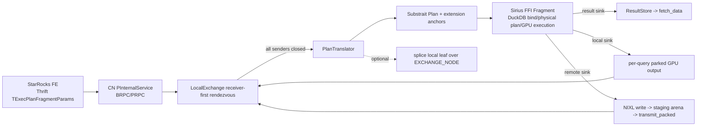

# StarRocks translator and compute-node stack

Reviewed branch: `bench/sf500-2-mig-gpus` (`7610840c`) against `upstream/dev`
(`ea1c2783`).  This note covers the Rust translator and compute node, plus the
newer integration commits that are not represented by the original draft-PR
list. Paths and line numbers are from the reviewed branch.

## The route a distributed query takes



The FE sends a flat preorder plan and descriptor table for each fragment. The
translator consumes that tree completely, turns supported nodes into Substrait,
and declares the exchange streams before the C++ `Fragment` binds the plan.
The CN does not execute a receiver when it arrives: it registers the expected
senders, accumulates local parked output or remote batches, then dispatches the
receiver only after every source has completed. This preserves fragment
boundaries while keeping batch data in GPU memory.

## Draft PR map and landing order

| Area | Draft PR | branch commit | What it establishes | Must precede |
|---|---:|---|---|---|
| Translator expressions | #1704 | `27528385` | `CLONE_EXPR` unwrap; builtin result is narrowed to FE-declared type | all query-plan work |
| CN scan schema | #1705 | `3056cda5` | `FILES()` checks every assigned parquet range, fail-closed | scan/query runs |
| CN configuration | #1706 | `e2d6058d` | startup-resolved, validated transport knob registry | transport bring-up |
| CN protocol | #1707 | `a04bf5bc` | checked-in StarRocks proto patch, build guard/script | remote exchange |
| Translator exchange | #1708 | `4389e3f9` | `EXCHANGE_NODE` -> named `ReadRel` stream | two-phase agg, CN exchange |
| Translator aggregation | #1709 | `ce41439d` | phase classifier and partial-state wire model | wire order, avg |
| Translator row layout | #1710 | `50f6636a` | aggregation/sort emit descriptor materialized-slot order | every exchange consumer |
| Translator avg | #1711 | `5f9349d5` | avg partial state becomes FP64 sum + BIGINT count | two-phase avg |
| Translator common slots | #1713 | `268b7592` | carry consumed hidden project slots and narrow at root | q14-like shapes |
| CN deployment | #1714 | `9738b256` | one CN/GPU, memory carve-outs, readiness gate | cluster launch |
| CN failure semantics | #1715 | `a1ac4c58` | intermediate failure reaches all FE-polled result instances | production execution |

The safe conceptual ordering is #1704, #1705/#1706/#1707, #1708, #1709,
#1710, #1711, #1713, #1714, #1715. `#1708` must land before any receiver can
execute across a fragment boundary. `#1709` must land before #1711; wire-order
must land before a sender is allowed to interchange tuple slots. The compute
node transport additionally depends on the C++ FFI/arena PRs #1693/#1694 and
the Rust Fragment bindings #1702.

## Translator internals

### From Thrift to a bindable Substrait plan

`PlanTranslator::translate_fragment_with_exchange_inputs` validates the
fragment, descriptor table, scan paths, and bound exchanges; translates the
tree; confines hidden common slots; checks root names against emitted width;
and derives hash-partition column positions before emitting a Substrait root
([lib.rs:266](https://github.com/aocsa/sirius/blob/7610840c03f9086edfa072be72a0eb4c96e03d60/experimental/starrocks/crates/starrocks-plan-translator/src/lib.rs#L266),
[lib.rs:356](https://github.com/aocsa/sirius/blob/7610840c03f9086edfa072be72a0eb4c96e03d60/experimental/starrocks/crates/starrocks-plan-translator/src/lib.rs#L356)).
That final width guard is important: an exchange is positional, and a name or
width mismatch otherwise becomes a wrong-column read.

An exchange is translated as a `ReadRel` over `sirius_stream_<node_id>`. Its
schema is built from the receiver descriptor tuple, names come from the sender,
and the same `StreamInputSchema` drives the C++ declaration. Merge aggregation
state overrides rewrite the schema before both consumers see it
([node_translator.rs:650](https://github.com/aocsa/sirius/blob/7610840c03f9086edfa072be72a0eb4c96e03d60/experimental/starrocks/crates/starrocks-plan-translator/src/node_translator.rs#L650),
[node_translator.rs:698](https://github.com/aocsa/sirius/blob/7610840c03f9086edfa072be72a0eb4c96e03d60/experimental/starrocks/crates/starrocks-plan-translator/src/node_translator.rs#L698)).

### Two-phase aggregation, state widths, and avg

The phase classifier uses both FE fields: `need_finalize` and every measure's
`is_merge_agg`. It supports one-shot, update/serialize, and merge/finalize, and
rejects merge-serialize or mixed phases rather than silently double-aggregating
([agg_phase.rs:39](https://github.com/aocsa/sirius/blob/7610840c03f9086edfa072be72a0eb4c96e03d60/experimental/starrocks/crates/starrocks-plan-translator/src/agg_phase.rs#L39)).

`partial_state` is the cross-fragment contract. Decimal sums use FP64 on the
wire, integer sums use the engine's expected representation, distinct counts
ship their distinct argument, and avg is deliberately two columns: FP64 sum and
BIGINT count ([partial_state.rs:1](https://github.com/aocsa/sirius/blob/7610840c03f9086edfa072be72a0eb4c96e03d60/experimental/starrocks/crates/starrocks-plan-translator/src/partial_state.rs#L1)).
The partial producer expands avg; the merge side aggregates the two columns,
returns NULL for count zero, rounds lowered decimals, then casts to the FE
measure type ([node_translator.rs:1180](https://github.com/aocsa/sirius/blob/7610840c03f9086edfa072be72a0eb4c96e03d60/experimental/starrocks/crates/starrocks-plan-translator/src/node_translator.rs#L1180),
[node_translator.rs:1380](https://github.com/aocsa/sirius/blob/7610840c03f9086edfa072be72a0eb4c96e03d60/experimental/starrocks/crates/starrocks-plan-translator/src/node_translator.rs#L1380),
[node_translator.rs:1456](https://github.com/aocsa/sirius/blob/7610840c03f9086edfa072be72a0eb4c96e03d60/experimental/starrocks/crates/starrocks-plan-translator/src/node_translator.rs#L1456)).

The translator intentionally refuses a partial avg below another operator or
an output reprojection because the FE assigns one slot where Sirius emits two;
continuing would make later field references point to the wrong column
([node_translator.rs:420](https://github.com/aocsa/sirius/blob/7610840c03f9086edfa072be72a0eb4c96e03d60/experimental/starrocks/crates/starrocks-plan-translator/src/node_translator.rs#L420)).

### Descriptor order and carried common slots

Physical row order is descriptor materialized-slot order, rather than source
expression order. This rule is applied to aggregate grouping keys and sort
tuples because upstream slot references and exchange schemas resolve by that
order ([node_translator.rs:861](https://github.com/aocsa/sirius/blob/7610840c03f9086edfa072be72a0eb4c96e03d60/experimental/starrocks/crates/starrocks-plan-translator/src/node_translator.rs#L861)).

For a project common expression consumed above its project, the translator
appends it as a hidden trailing field and records that field in `CarriedSlot`.
It then emits a root projection that removes all carried fields before they can
cross a fragment boundary ([node_translator.rs:2310](https://github.com/aocsa/sirius/blob/7610840c03f9086edfa072be72a0eb4c96e03d60/experimental/starrocks/crates/starrocks-plan-translator/src/node_translator.rs#L2310),
[node_translator.rs:2531](https://github.com/aocsa/sirius/blob/7610840c03f9086edfa072be72a0eb4c96e03d60/experimental/starrocks/crates/starrocks-plan-translator/src/node_translator.rs#L2531)).

## Compute-node and exchange internals

### Lifecycle

The CN takes an FE RPC attachment, resolves cached descriptors, registers a
receiver or runs/defer-runs a sender, and hands complete receivers to a worker.
It reserves result instances before waiting for exchange sources, so
`fetch_data` has an object to poll. A failed fragment marks the query, fails
all reserved result instances, retires engine-owned output, and reports status
to the FE ([compute_node_service.rs:1135](https://github.com/aocsa/sirius/blob/7610840c03f9086edfa072be72a0eb4c96e03d60/experimental/starrocks/src/compute_node_service.rs#L1135),
[compute_node_service.rs:1083](https://github.com/aocsa/sirius/blob/7610840c03f9086edfa072be72a0eb4c96e03d60/experimental/starrocks/src/compute_node_service.rs#L1083)).

`LocalExchange` is a receiver-first rendezvous keyed by `(fragment instance,
exchange node)`. It orders sources deterministically, waits for EOS from every
remote sender, removes sequence tracking when ready, and retains cancelled
receiver ids in a bounded set to refuse late frames
([local_exchange.rs:241](https://github.com/aocsa/sirius/blob/7610840c03f9086edfa072be72a0eb4c96e03d60/experimental/starrocks/src/local_exchange.rs#L241),
[local_exchange.rs:500](https://github.com/aocsa/sirius/blob/7610840c03f9086edfa072be72a0eb4c96e03d60/experimental/starrocks/src/local_exchange.rs#L500),
[local_exchange.rs:572](https://github.com/aocsa/sirius/blob/7610840c03f9086edfa072be72a0eb4c96e03d60/experimental/starrocks/src/local_exchange.rs#L572)).

### Focus: staging-area ownership and remote receive

The staging arena is a transfer boundary, not a receiver queue. A remote NIXL
sender obtains a receiver-owned lease, writes packed data, and calls
`transmit_packed`. The CN claims the frame sequence *before touching the lease*
to make reconnect replay idempotent. With the inbound store enabled, it copies
the batch into RMM-pool memory immediately, returns the arena lease, and stores
a ticket; without it, the lease stays attached to the staged batch. The ticket
or lease is released on every refusal, cancellation, translation error, and
post-dispatch cleanup path
([compute_node_service.rs:746](https://github.com/aocsa/sirius/blob/7610840c03f9086edfa072be72a0eb4c96e03d60/experimental/starrocks/src/compute_node_service.rs#L746),
[compute_node_service.rs:841](https://github.com/aocsa/sirius/blob/7610840c03f9086edfa072be72a0eb4c96e03d60/experimental/starrocks/src/compute_node_service.rs#L841),
[local_exchange.rs:397](https://github.com/aocsa/sirius/blob/7610840c03f9086edfa072be72a0eb4c96e03d60/experimental/starrocks/src/local_exchange.rs#L397),
[compute_node_service.rs:935](https://github.com/aocsa/sirius/blob/7610840c03f9086edfa072be72a0eb4c96e03d60/experimental/starrocks/src/compute_node_service.rs#L935)).

This is the core scaling change after the initial staging-arena PR: frames no
longer occupy scarce stable-registration memory until all senders close. They
occupy regular pool memory while a receiver waits. Cancellation removes pending
sources and returns tickets/leases; engine retirement cleans query-scoped parked
outputs. The failure domain is query scoped, avoiding the former global wipe.

### Sender output, local and remote

The executor runs a sender once, parks GPU output into one stream per
destination, records local sources immediately, then drains remote destinations
sequentially through NIXL/PRPC. It validates routes before GPU work, requires
hash keys for multi-destination hash sinks, and deliberately sends the complete
row for multicast CTE sinks because consumer exchanges bind by position
([compute_node_service.rs:1392](https://github.com/aocsa/sirius/blob/7610840c03f9086edfa072be72a0eb4c96e03d60/experimental/starrocks/src/compute_node_service.rs#L1392),
[compute_node_service.rs:1490](https://github.com/aocsa/sirius/blob/7610840c03f9086edfa072be72a0eb4c96e03d60/experimental/starrocks/src/compute_node_service.rs#L1490),
[compute_node_service.rs:1592](https://github.com/aocsa/sirius/blob/7610840c03f9086edfa072be72a0eb4c96e03d60/experimental/starrocks/src/compute_node_service.rs#L1592)).

`MULTI_CAST_DATA_STREAM_SINK` computes a reused CTE once and selects exactly
one local destination per consumer exchange; anything else fails instead of
starving or double-feeding a consumer
([compute_node_service.rs:1648](https://github.com/aocsa/sirius/blob/7610840c03f9086edfa072be72a0eb4c96e03d60/experimental/starrocks/src/compute_node_service.rs#L1648)).

### Fusion, cancellation, and performance

The later integration stack can defer a single-destination same-CN leaf sender
and splice its preorder tree over the receiver's plain exchange. It refuses
remote, multi-sender, sorted, limited, filtered, aggregation-parent, common-slot
and partial-aggregate cases. That conservatism is correct: it lets DuckDB plan
the scan inside its join without silently changing exchange semantics
([fusion.rs:1](https://github.com/aocsa/sirius/blob/7610840c03f9086edfa072be72a0eb4c96e03d60/experimental/starrocks/crates/starrocks-plan-translator/src/fusion.rs#L1),
[compute_node_service.rs:1203](https://github.com/aocsa/sirius/blob/7610840c03f9086edfa072be72a0eb4c96e03d60/experimental/starrocks/src/compute_node_service.rs#L1203),
[compute_node_service.rs:1860](https://github.com/aocsa/sirius/blob/7610840c03f9086edfa072be72a0eb4c96e03d60/experimental/starrocks/src/compute_node_service.rs#L1860)).

Async sender dispatch is opt-in. Cancellation purges the rendezvous, releases
remote staged data, records failure only for failure reasons, and retires
query-owned parked output. BRPC now handles requests on one socket
concurrently, so a `fetch_data` long-poll cannot block cancellation behind it.

## New commits that should become follow-up PRs

| Proposed PR | Commits | Scope and dependencies |
|---|---|---|
| CN exchange lifecycle | `85da8f6f`, `37b48a46`, `86b3f9a6`, `36072ef8`, `9e547c89`, `49d23e8a` | parked streams, rendezvous, PRPC/NIXL, warmup; follows #1693/#1702/#1707 |
| Query cleanup and CN-to-FE failure | `5b4ee255`, `37360a1b`, `a0df9f43`, `c91d0a84`, `5e71059c` | failure propagation, cancellation, query-scoped retirement, concurrent BRPC; follows lifecycle PR |
| Local fragment fusion | `1289a33c`, `6f87c304`, `1661eb5e`, `f29f96d4`, `73ce2805`, `281b13bc` | translator splice + CN deferred-plan policy; follows #1708 and lifecycle PR |
| Inbound pool staging and replay safety | `698312a1`, `b00334cb` | immediate copy from arena to pool, ticket lifecycle, duplicate sequencing; follows arena/FFI/lifecycle |
| Planner coverage and numeric correctness | `441a03cf`, `72fd14af`, `1e7d6020`, `98b49df9`, `4496bfe9` | right semi, distinct state, decimal rounding, multicast row order, dense count; follows translator stack |
| CTE reuse and sender concurrency | `50f2691d`, `29df50ef`, `9ec9df31` | multicast execution and optional async leaf sender worker; follows lifecycle and planner coverage |
| MIG/SF500 operations | `92b7eed4`, `59ab07c3`, `7c18ce8b`, `7092f445`, `7610840c` | launcher/config/reproduction material; follows #1714 |

## Review result and remaining acceptance work

No new source-level correctness defect was confirmed in this pass. The
important reviewed safeguards are: sequence claim before staging, explicit
ticket-or-lease ownership, root width/name checks, phase classification using
both FE fields, schema agreement across sources, and query-scoped cleanup.

There is one explicit product boundary to preserve in onboarding and release
planning: the current result store is intentionally a single-batch,
single-poller model ([result_store.rs:281](https://github.com/aocsa/sirius/blob/7610840c03f9086edfa072be72a0eb4c96e03d60/experimental/starrocks/src/result_store.rs#L281)).
It is sufficient for the present MySQL-text result path, but it is not a
general streaming result implementation; do not treat it as one when adding
large result sets, retries, or a second consumer.

The focused translator test command was attempted:

```text
pixi run cargo test -p starrocks-plan-translator
```

It could not compile because this worktree lacks
`experimental/starrocks/starrocks/gensrc/thrift`; the `starrocks-thrift` build
script failed while listing that directory. This is a worktree/submodule setup
block, not a test failure. Initialize the submodule and apply the checked-in
proto patch before claiming Rust test coverage. `git diff --check
upstream/dev...HEAD -- experimental/starrocks/...` completed cleanly.

Before merge, run the translator and CN suites in a fully initialized submodule,
then execute at least q01/q06 (two-phase aggregate/exchange), q14 (carried
common slots), a forced CTE-reuse query, a remote-exchange replay/cancel test,
and the SF500 2-MIG reproduction plan. The most material operational risk is
capacity rather than an uncovered semantic defect: inbound frames now shift
pressure from the staging arena to the RMM pool, so per-CN GPU carve-out and
staging size must be jointly sized.
