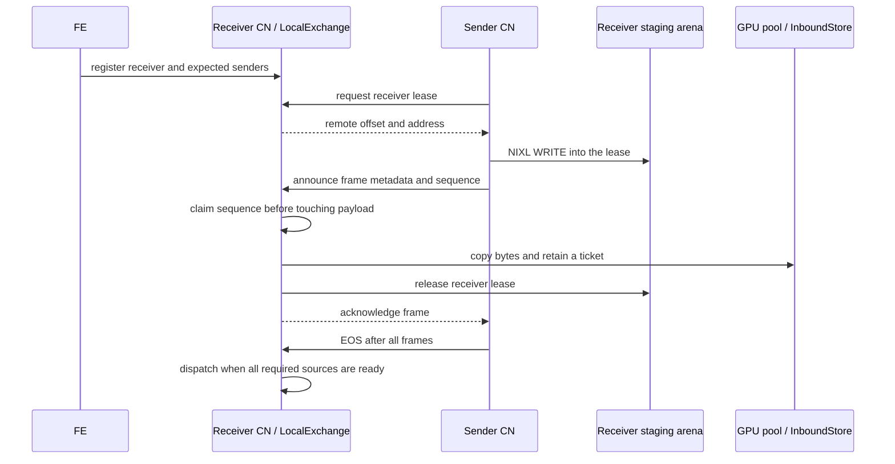

# Compute node: executing and moving fragment results

[Back to the guide](../README.md)

**Scope:** the reviewed source is `7610840c`. Later branch work and proposed
packages are identified separately; no new GPU test result is implied.

**Module and language:** `experimental/starrocks/src` (Rust compute node), with the `src/sirius_ffi.cpp` and `src/include/sirius_ffi.hpp` C++ FFI layer underneath it.

A StarRocks **FE** (frontend) schedules query fragments. A **CN** (compute node) is the Rust service that accepts those fragment RPCs, translates the plan, runs the GPU engine, and relays output to another fragment or back to the FE. A descriptor is the FE's row metadata table; a slot is one numbered column in that row. A *wire state* is the ordered row shipped between fragments. The CN must preserve that order because the exchange consumer reads columns by position.

## The receiver-first exchange model

`LocalExchange` is a receiver-first rendezvous keyed by fragment instance and exchange node. It records the number of expected senders and returns a receiver for execution only after every expected source is complete. For remote sources, a source becomes complete only when its end-of-stream (EOS) arrives; therefore EOS is the barrier that protects fragment boundaries ([registration](https://github.com/aocsa/sirius/blob/7610840c03f9086edfa072be72a0eb4c96e03d60/experimental/starrocks/src/local_exchange.rs#L241), [completion barrier](https://github.com/aocsa/sirius/blob/7610840c03f9086edfa072be72a0eb4c96e03d60/experimental/starrocks/src/local_exchange.rs#L500)).

For a same-CN connection, a sender parks GPU output and immediately offers that local source. For a remote connection, the sender uses NIXL and a receiver-owned staging-arena lease. The receiver claims the `(exchange, sender, sequence)` number *before* touching the lease. A replayed frame is then ignored safely, while a gap is an error; this avoids reading or releasing a lease that has already been returned and reused ([sequence claim](https://github.com/aocsa/sirius/blob/7610840c03f9086edfa072be72a0eb4c96e03d60/experimental/starrocks/src/local_exchange.rs#L397), [receive handler](https://github.com/aocsa/sirius/blob/7610840c03f9086edfa072be72a0eb4c96e03d60/experimental/starrocks/src/compute_node_service.rs#L797)).

The staging arena is a transfer boundary, not the receiver's long-lived queue. With `InboundStore`, the receiver unpacks and copies an arriving batch to normal GPU pool memory, stores it under a ticket, and returns the arena lease. The later fragment consumes the ticket without a second copy. This prevents completed frames from consuming stable, transport-registered arena space while the EOS barrier is still open ([FFI contract](https://github.com/aocsa/sirius/blob/7610840c03f9086edfa072be72a0eb4c96e03d60/src/include/sirius_ffi.hpp#L170)). It moves capacity pressure into the ordinary GPU pool, though: there is no shown credit, reservation, or spill admission policy for frames waiting at the barrier.

Two current-head staging risks remain merge gates. After a receiver lease is granted, a NIXL write can fail before `transmit_packed`; the cleanup shown returns the sender's local lease but does not tell the receiver to return its granted lease ([send path](https://github.com/aocsa/sirius/blob/7610840c03f9086edfa072be72a0eb4c96e03d60/experimental/starrocks/src/nixl_transport.rs#L672)). Also, `InboundStore::stage` takes the raw GPU-memory-space pointer under a lock and uses it after releasing that lock, while context teardown can close the store ([stage implementation](https://github.com/aocsa/sirius/blob/7610840c03f9086edfa072be72a0eb4c96e03d60/src/sirius_ffi.cpp#L435)). The intended late-call error is therefore not yet a complete teardown-safety guarantee.

## Sending, multicast, and lifecycle

The CN validates routes before running GPU work. A normal sender executes once, parks its output, then routes it locally or drains it remotely. A `MULTI_CAST_DATA_STREAM_SINK` executes a reused CTE once and makes the full output row available to each consumer sink. Each sink must have **exactly one local consumer destination** on this CN; zero or multiple local destinations are refused. The full row is sent because a consumer exchange binds positionally and can project its needed slots itself ([multicast handling](https://github.com/aocsa/sirius/blob/7610840c03f9086edfa072be72a0eb4c96e03d60/experimental/starrocks/src/compute_node_service.rs#L1648)). This is local multicast, not a general distributed broadcast.

The supplied draft-PR snapshot (not live-status information) includes #1705 / `3056cda5` for `FILES()` schema validation across all ranges, #1706 / `e2d6058d` for startup-validated transport tunables, #1707 / `a04bf5bc` for the exchange RPC proto patch, #1714 / `9738b256` for per-GPU CN bring-up and readiness, and #1715 / `a1ac4c58` for failure propagation to FE-polled results.

The extracted branch-only packages have narrower boundaries. [P03](../pr-packages/p03.md) is `85da8f6f`, `37b48a46` (parked output and receiver-first rendezvous); [P04](../pr-packages/p04.md) is `86b3f9a6` (peer PRPC client); [P05](../pr-packages/p05.md) is `36072ef8` (NIXL registration and canary); [P06](../pr-packages/p06.md) is `9e547c89`, `49d23e8a` (remote transfer and warm-up); [P08](../pr-packages/p08.md) is `5b4ee255`, `37360a1b`, `a0df9f43` (query cleanup and cancellation); [P11](../pr-packages/p11.md) is `9ec9df31` (opt-in async sender dispatch); [P16](../pr-packages/p16.md) is `698312a1`, `b00334cb` (pool staging and replay safety); [P17](../pr-packages/p17.md) is `50f2691d`, `b00334cb`, `98b49df9` (reused-CTE multicast); [P19](../pr-packages/p19.md) is `c91d0a84` (FE failure report); and [P20](../pr-packages/p20.md) is `5e71059c` (concurrent PRPC service, opened as draft #1739). These are primarily Rust CN changes; P16 also changes the C++ FFI.

Async sender dispatch is an opt-in setting, `SIRIUS_CN_ASYNC_SENDER_DISPATCH`; it queues only sender-only, non-result fragments and is off by default ([setting and gate](https://github.com/aocsa/sirius/blob/7610840c03f9086edfa072be72a0eb4c96e03d60/experimental/starrocks/src/compute_node_service.rs#L277)). The source explains why: a queued sender can report a failure only through result instances on the same CN in the older path. Cancellation releases waiting rendezvous sources, rejects late frames, and retires query-owned parked output. It does **not** preempt a fragment already inside `run()`; that fragment finishes and its output is dropped ([cancellation boundary](https://github.com/aocsa/sirius/blob/7610840c03f9086edfa072be72a0eb4c96e03d60/experimental/starrocks/src/compute_node_service.rs#L439)). Do not rely on a CPU fallback for this distributed fragment path: the reviewed CN path has no claimed fallback when translation, transport, or GPU execution fails.

The result store is intentionally a [single-batch, single-poller bridge](https://github.com/aocsa/sirius/blob/7610840c03f9086edfa072be72a0eb4c96e03d60/experimental/starrocks/src/result_store.rs#L281) for the current client path, rather than a general streaming result system. That is a product limit to preserve when adding large results, retry, or multiple consumers.

Related: [Plan translation](plan-translation.md) · [Staging area](staging-area.md) · [Back to the guide](../README.md)
