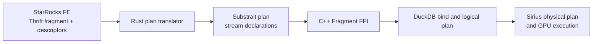

# Plan translation: from a StarRocks fragment to a Sirius plan

[Back to the guide](../README.md)

**Scope:** the reviewed source is `7610840c`. Later branch work and proposed
packages are identified separately; no new GPU test result is implied.

**Module and language:** `experimental/starrocks/crates/starrocks-plan-translator` (Rust). It produces Substrait, which crosses the Sirius C++ FFI into DuckDB's binding and logical-planning path before Sirius builds GPU physical operators.

The StarRocks **FE** (frontend) decides how a SQL query is split into fragments and sends each fragment as a Thrift request. A **CN** (compute node) receives that request and calls this translator. The translator's job is deliberately narrow: turn the FE's physical-plan description into a valid Substrait plan, while preserving the row layout that the next fragment expects.

A **descriptor** is the FE's table of tuple and column metadata. A **slot** is one numbered column entry in a tuple. The *wire state* is the concrete ordered set of columns sent across an exchange, including any aggregate state columns that differ from the final SQL result. These definitions matter because an exchange binds columns by position: a correct type in the wrong position is still a wrong query result.

## What the translator does

It validates the fragment, builds the descriptor table, finds scan files, walks the ordered plan operations, keeps internal temporary columns within their intended boundaries, and checks that the final row width equals the number of output names. That last check prevents a sender from publishing a row that a receiver would read with shifted columns ([translator entry point](https://github.com/aocsa/sirius/blob/7610840c03f9086edfa072be72a0eb4c96e03d60/experimental/starrocks/crates/starrocks-plan-translator/src/lib.rs#L266), [root width guard](https://github.com/aocsa/sirius/blob/7610840c03f9086edfa072be72a0eb4c96e03d60/experimental/starrocks/crates/starrocks-plan-translator/src/lib.rs#L356)).

For example, imagine a partial aggregation that groups sales by `region` and computes `avg(price)`. The sender cannot send one final `avg` number: its peer needs enough information to combine partial answers. It sends the region, a running sum, and a count of non-null prices. The sum uses
a 64-bit floating-point number (FP64); the count uses a 64-bit integer (BIGINT). The receiver reads that ordered wire state, adds sums and counts, and only then computes `sum / count`. The phase classifier uses the FE's `need_finalize` and `is_merge_agg` fields, and rejects mixed or unsupported phase combinations ([phase classifier](https://github.com/aocsa/sirius/blob/7610840c03f9086edfa072be72a0eb4c96e03d60/experimental/starrocks/crates/starrocks-plan-translator/src/agg_phase.rs#L39)).

An `EXCHANGE_NODE` becomes a Substrait `ReadRel` over a named view such as `sirius_stream_42`. The receiver tuple supplies the schema, sender names are bound positionally, and the same schema becomes the engine's stream declaration ([exchange translation](https://github.com/aocsa/sirius/blob/7610840c03f9086edfa072be72a0eb4c96e03d60/experimental/starrocks/crates/starrocks-plan-translator/src/node_translator.rs#L650)). Grouping and sort output use descriptor materialized-slot order, rather than expression order, for the same reason ([aggregation layout](https://github.com/aocsa/sirius/blob/7610840c03f9086edfa072be72a0eb4c96e03d60/experimental/starrocks/crates/starrocks-plan-translator/src/node_translator.rs#L806)). A common expression needed above its project is carried as a temporary trailing column and removed before the fragment boundary.

## Original draft-PR snapshot

This is the supplied review snapshot, not a claim about each PR's live GitHub status. The translation stack is: #1704 / `27528385` (unwrap `CLONE_EXPR` and narrow FE-declared builtin results); #1708 / `4389e3f9` (exchange stream read); #1709 / `ce41439d` (two-phase aggregate phases and wire types); #1710 / `50f6636a` (materialized-slot wire order); #1711 / `5f9349d5` (sum/count expansion for `avg`); and #1713 / `268b7592` (carried common slots). They are Rust changes in the translator package, except that their output depends on the C++ Fragment FFI stack to bind the finished Substrait plan.

## Branch-only follow-up features

The current extraction splits later coverage into reviewable packages. [P12](../pr-packages/p12.md) is `441a03cf`, which adds `RIGHT_SEMI_JOIN` with the right-side row layout. [P13](../pr-packages/p13.md) is `72fd14af`, which models two-phase `COUNT(DISTINCT x)` by carrying `x` itself. [P14](../pr-packages/p14.md) is `c39da5eb`, which rounds FP64-to-decimal casts in the C++ expression layer. [P15](../pr-packages/p15.md) is `1e7d6020`, which rounds finalized decimal aggregates and spans the Rust translator plus C++/CUDA expression work. [P17](../pr-packages/p17.md) is `50f2691d`, `b00334cb`, and `98b49df9`, which implements reused-CTE multicast and preserves descriptor order. [P18](../pr-packages/p18.md) is `4496bfe9` plus the C++ planner portion of `98b49df9`, which recognizes dense count joins through column-only projections. The right-semi mapping is visible in the translator ([join mapping](https://github.com/aocsa/sirius/blob/7610840c03f9086edfa072be72a0eb4c96e03d60/experimental/starrocks/crates/starrocks-plan-translator/src/node_translator.rs#L1906)); decimal aggregate inputs are explicitly lowered only for supported paths ([aggregate lowering](https://github.com/aocsa/sirius/blob/7610840c03f9086edfa072be72a0eb4c96e03d60/experimental/starrocks/crates/starrocks-plan-translator/src/expr_translator.rs#L815)).

The q15 result is a historical observation in the [immutable rounding commit](https://github.com/aocsa/sirius/commit/1e7d6020): it records that rounding made two independently evaluated revenue totals compare consistently. This review did not rerun it, and the observation does not prove q09 correct. Similarly, two-phase distinct counts remain limited: ungrouped distinct aggregates, multi-column distinct keys, and `multi_distinct_sum` are refused rather than guessed ([explicit refusals](https://github.com/aocsa/sirius/blob/7610840c03f9086edfa072be72a0eb4c96e03d60/experimental/starrocks/crates/starrocks-plan-translator/src/expr_translator.rs#L797)).

Local fragment fusion is split into [P09](../pr-packages/p09.md) (`1289a33c`, `f29f96d4`) and [P10](../pr-packages/p10.md) (`6f87c304`, `1661eb5e`, `73ce2805`, `281b13bc`). The CN may defer an eligible same-CN leaf and splice it at the receiver exchange. It refuses a non-single destination, sink/root reprojections, sender common slots or partial state, and an exchange with a limit, offset, conjunct, sort, or aggregation parent. It changes scheduling, not the translator's positional exchange contract.

Related: [Compute node and exchange](compute-node.md) · [Staging area](staging-area.md) · [Back to the guide](../README.md)
