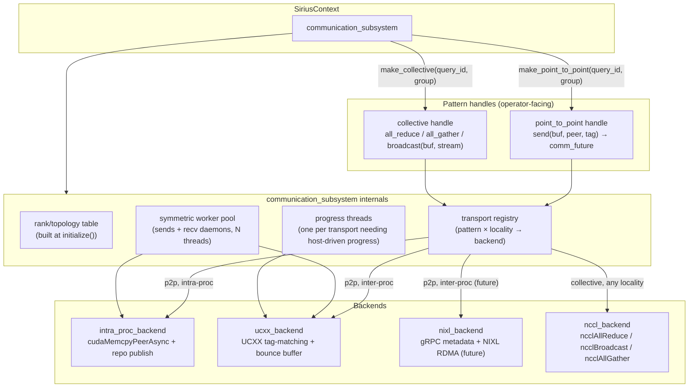
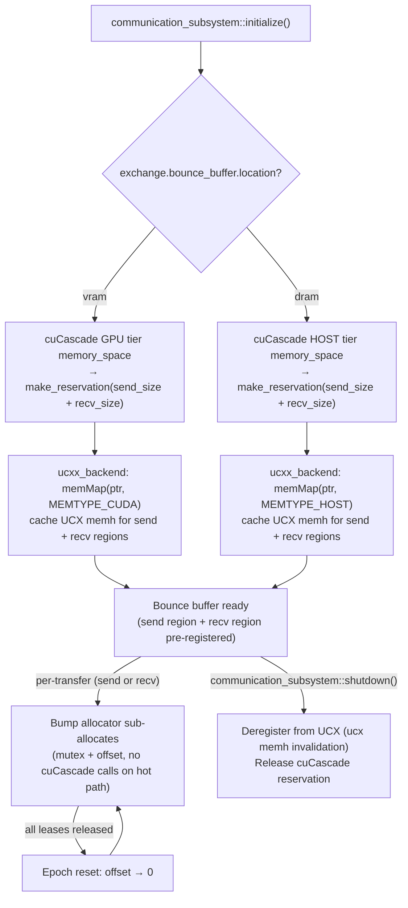
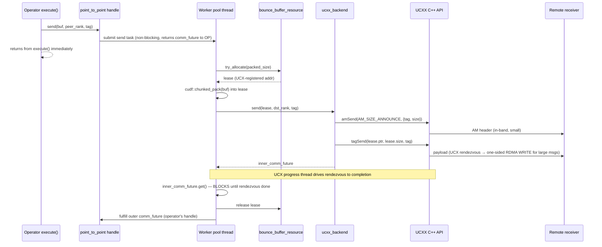
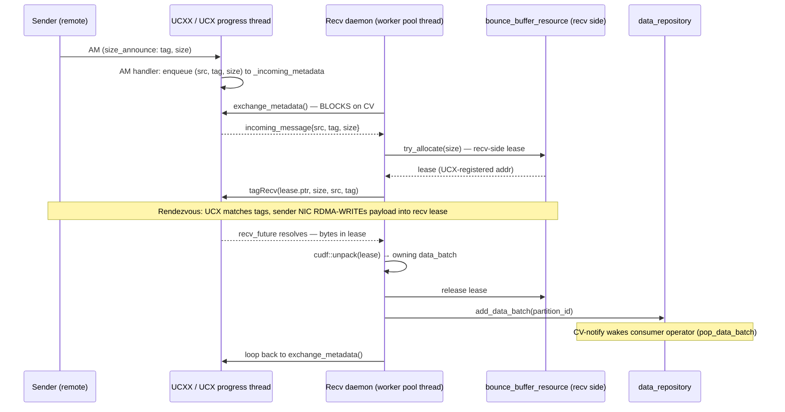
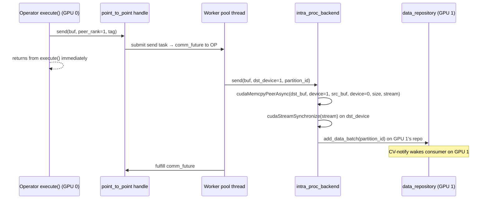
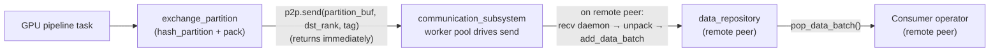

# Communication Subsystem

This document proposes a unified communication subsystem for Sirius that handles distributed exchange as a first-class concern across all operator types — hash-partition sink, distributed aggregate, broadcast join, and future distributed operators. The design targets **multi-GPU within a single process** as the primary case; single-GPU-per-process deployments (e.g., Doris/StarRocks worker nodes) are a degenerate subset.

> **Status:** Design proposal — not yet implemented.

## Goals

- **Multi-GPU-within-process is primary.** A single `SiriusContext` may own multiple GPU devices. Communication between two GPUs in the same process (e.g., partition routing from GPU 0 to GPU 1) must be a fast intra-process path, not a network path. Single-GPU-per-process (Doris/StarRocks) is a degenerate case covered by the same API.

- **Operators own concrete pattern handles.** A distributed hash-partition sink, a distributed aggregate, and a broadcast-join build each hold a pattern handle obtained from the subsystem and call it directly — `p2p.send(...)`, `collective.all_reduce(...)`. No operator creates comm tasks or interacts with a parallel executor. Transport selection and peer-locality routing are invisible to operators.

- **Compute and transfer overlap.** Hash partitioning + packing of batch N overlaps with GPU compute of batch N+1. Overlap comes from the comm subsystem driving sends asynchronously after the operator submits and returns from `execute()`.

- **Bounce-buffer registration cost is a first-class design concern.** The subsystem's inter-process backends must not pay per-transfer UCX registration cost. Pre-registered bounce buffers are not an optimization — they are a correctness decision given cuCascade's allocator classification.

---

## Architecture Overview

`SiriusContext` owns exactly one `communication_subsystem`, alive for the process lifetime. Operators obtain pattern handles at query setup time and call them inline during `execute()`.



Operators never import backend headers. They depend only on the pattern handle interface (`point_to_point.hpp`, `collective.hpp`), which lives in `src/include/transport/`.

---

## Pattern Handles (Operator-Facing)

Pattern handles are the **only** communication API operators interact with. There are two: one for point-to-point shuffle and one for collectives.

### `point_to_point` handle

```cpp
namespace sirius::transport {

// Operator holds this handle for the lifetime of a query.
// Obtained via communication_subsystem::make_point_to_point(query_id, group).
class point_to_point {
 public:
  virtual ~point_to_point() = default;

  // Submit a send to `peer`. Returns immediately; the comm subsystem's worker
  // pool drives completion (lease release, error packaging, comm_future resolution).
  // Routing — intra-proc vs inter-proc — is determined by the subsystem from
  // peer rank; the caller never sees the difference.
  virtual comm_future<void> send(
    comm_buffer buf,       // ptr + size + memory_kind
    rank_t peer,
    tag_t  tag) = 0;      // encodes (query_id, partition_id, sender_rank)

  // No recv API. The receive side is handled by comm subsystem recv daemons,
  // which publish arriving data_batches into data_repository.
  // Consumer operators pop via repo.pop_data_batch() exactly as for local batches.

  virtual void shutdown() = 0;
};

}  // namespace sirius::transport
```

**Key design choices:**

- **No recv API on the handle.** Receive is implicit — comm subsystem daemons drain inbound traffic, unpack, and publish into `data_repository` keyed by `(query_id, partition_id)`. The consuming operator pops as if the batch were locally produced. This is uniform with the local-pipeline pattern.
- **`send()` returns immediately.** The operator calls `send(...)`, gets a `comm_future`, and returns from `execute()`. The future is managed by the comm subsystem's worker pool; the operator does not await it inline.
- **`comm_future` is coroutine-awaitable.** The shape is forward-compatible with C++20 awaiters — a future `co_await p2p.send(...)` migration is possible without API breakage once distributed iterative operators warrant it.

### `collective` handle

```cpp
namespace sirius::transport {

// Operator holds this handle for a query's collective communication group.
// Obtained via communication_subsystem::make_collective(query_id, group).
class collective {
 public:
  virtual ~collective() = default;

  // All methods enqueue work onto `stream` and return to the host immediately.
  // Downstream GPU kernels on the same stream serialize after the collective.
  // No application thread blocks; no comm subsystem worker pool involvement.

  virtual void all_reduce(
    comm_buffer sendbuf,
    comm_buffer recvbuf,
    int32_t     count,
    ncclDataType_t  dtype,
    ncclRedOp_t     op,
    rmm::cuda_stream_view stream) = 0;

  virtual void all_gather(
    comm_buffer sendbuf,
    comm_buffer recvbuf,
    int32_t     sendcount,
    ncclDataType_t  dtype,
    rmm::cuda_stream_view stream) = 0;

  virtual void broadcast(
    comm_buffer buf,
    int32_t     count,
    ncclDataType_t  dtype,
    rank_t      root,
    rmm::cuda_stream_view stream) = 0;

  virtual void shutdown() = 0;
};

}  // namespace sirius::transport
```

**Key design choices:**

- **Stream-ordered, host-non-blocking.** NCCL enqueues collective work onto the provided CUDA stream. The host-side call returns in microseconds; the collective executes asynchronously. GPU work posted after on the same stream serializes naturally.
- **No bounce buffer.** NCCL manages its own communication buffers internally. Sirius does not register application buffers with NCCL.
- **Handles intra- and inter-process uniformly.** NCCL supports both multi-GPU within a process and multi-process multi-node using the same API. The `ncclComm_t` group is initialized with all participating ranks at `communication_subsystem::initialize()`.

### `comm_future`

```cpp
namespace sirius::transport {

template <typename T>
class comm_future {
 public:
  // Non-blocking poll. Returns true when the underlying transfer is complete.
  bool is_ready() const noexcept;

  // Blocking wait. Not called by operators (they return from execute() immediately);
  // called internally by comm subsystem worker pool threads.
  T get();

  // Coroutine support — forward-compatible with C++20 co_await.
  // Operators do not use this today; enables future migration without API breakage.
  auto operator co_await() noexcept;
};

}  // namespace sirius::transport
```

---

## Communication Subsystem Internals

### Rank / Topology Table

Built once at `SiriusContext::initialize()`, before any query runs. Populated from:
- CUDA device enumeration (local GPU devices → intra-process ranks).
- Peer discovery (OOB bootstrap at startup for inter-process ranks — same UCX worker-address exchange as described in PR #674).

```cpp
struct rank_info {
  rank_t          rank;
  bool            is_local;       // same process
  int             cuda_device_id; // -1 for remote ranks
  std::string     host;
  uint16_t        port;
};
```

The topology table answers: "Is peer X intra-process?" Routing inside the transport registry is driven by this answer.

### Transport Registry

Maps `(pattern_kind, peer_locality)` → backend:

| Pattern | Peer locality | Backend |
|---|---|---|
| `point_to_point` | intra-process | `intra_proc_backend` |
| `point_to_point` | inter-process | `ucxx_backend` (day-1); `nixl_backend` (future) |
| `collective` | any | `nccl_backend` |

Multiple backends are live simultaneously in one process — NCCL for collectives, UCXX for inter-process p2p, `intra_proc_backend` for multi-GPU within-process p2p.

### Progress Threads

One progress thread per transport needing host-driven progress:
- **UCXX / UCX:** UCX requires periodic `ucp_worker_progress()` calls. One dedicated progress thread per UCP worker runs `ucp_worker_progress` in a tight loop. This thread also dispatches inbound Active Message handlers (which enqueue incoming message headers for the recv daemons).
- **NIXL (future):** Similar host-driven progress requirement.
- **NCCL:** No progress thread needed — NCCL is stream-ordered and GPU-driven.
- **Intra-proc:** No progress thread needed — `cudaMemcpyPeerAsync` is a CUDA-runtime operation with its own stream progress.

### Worker Pool

A single symmetric thread pool drives both **sender completions** and **recv daemon loops**:

- **Sender completion workers:** After `ucxx_backend::send()` posts the UCX request, a worker thread awaits the `comm_future` (backed by the UCX request's completion). On completion, it releases the bounce-buffer lease and fulfills the outer `comm_future` for the operator.
- **Recv daemon workers:** Long-lived loop per thread — drains inbound traffic (`exchange_metadata()` → allocate recv buffer → `recv()` → unpack → `repo.add_data_batch()`). These are the "subscriber daemons" of PR #674, unified into the same pool.

Pool sizing: default `exchange.subsystem.worker_pool_size: 4`, configurable. Workers are multipurpose — the pool does not distinguish sender-workers from daemon-workers by thread identity.

---

## Backends

### Intra-Process P2P (`intra_proc_backend`)

For communication between two GPU devices within the same `SiriusContext`.

**Send path:**
1. Caller provides a `comm_buffer` (packed `data_batch`) on the source GPU device.
2. Backend looks up the destination rank in the topology table → destination CUDA device.
3. Issues `cudaMemcpyPeerAsync(dst_buf, dst_device, src_buf, src_device, size, stream)`.
4. On completion (stream sync on destination): calls `repo_manager.repository_for(partition_id).add_data_batch(batch)` on the destination GPU's `data_repository`.
5. CV-notifies the consumer operator on the destination device.

**No bounce buffer, no registration.** `cudaMemcpyPeer` addresses both GPUs' BAR space directly via NVLink or PCIe. No UCX involved.

### UCXX Backend (`ucxx_backend`, inter-process p2p, day-1)

UCX tag-matching over RDMA (InfiniBand / RoCE) or TCP fallback. Uses bounce buffers.

**Key behaviors:**
- **AM size-announce:** Sender prepends a small UCX Active Message `(tag, size)` before the payload `tagSend`. The receiver's pre-posted AM handler enqueues this header into `_incoming_metadata`.
- **Bounce buffer:** Required. See [Bounce Buffer](#bounce-buffer) section.
- **No Rust FFI on the hot path.** UCX Active Messages carry size metadata in-band; no gRPC, no Rust.

### NIXL Backend (`nixl_backend`, inter-process p2p, future)

RDMA via NIXL. Uses bounce buffers. Requires a thin Rust gRPC shim for `ExchangeMetadata` / `TransferComplete` RPCs (gRPC control plane; RDMA data plane).

Slots in as a new `nixl_backend` deriving from `point_to_point_backend`. No orchestrator code changes.

> **STRING column wire format risk:** NIXL's wire format RDMA-writes cudf offsets and can corrupt them under certain access patterns (see `.planning/codebase/CONCERNS.md`). The `nixl_backend`'s packing path must use `cudf::pack` (not `cudf::chunked_pack`) for STRING columns.

### NCCL Backend (`nccl_backend`, collectives)

Wraps an `ncclComm_t` group initialized at `communication_subsystem::initialize()` across all participating ranks.

- `all_reduce` → `ncclAllReduce(...)` on the provided stream.
- `all_gather` → `ncclAllGather(...)`.
- `broadcast` → `ncclBroadcast(...)`.

All calls enqueue work onto the stream and return to the host in microseconds. No worker pool threads are involved on the collective surface.

---

## Bounce Buffer

The bounce buffer is required for any inter-process UCX-family backend (`ucxx_backend`, future `nixl_backend`). It is not required for the intra-process backend or NCCL.

### Why it exists

UCX has two registration-amortization mechanisms:

- **rcache:** Caches `(addr, size)` registrations. On cache hit, no kernel call. On miss, calls `ucp_mem_map` — kernel-level page pinning + RDMA key creation — serialized, easily >100 µs per call.
- **`UCX_MEMTYPE_REG_WHOLE_ALLOC_TYPES`:** Registers an entire pool extent on first touch, making sub-allocations inherit registration.

**Both mechanisms fail for cuCascade allocations.** cuCascade uses RMM's `cuda_async_memory_resource` (`cudaMallocAsync` underneath). UCX classifies these allocations as `UCS_MEMORY_TYPE_CUDA_MANAGED` instead of `UCS_MEMORY_TYPE_CUDA` (`cuda_copy_md.c` lines 658–668):

```c
} else if ((cuda_mem_ctx == NULL) && md->config.cuda_async_managed) {
    /* Currently virtual/stream-ordered CUDA allocations are typed as
     * UCS_MEMORY_TYPE_CUDA_MANAGED. ... */
    mem_info->type = UCS_MEMORY_TYPE_CUDA_MANAGED;
} else {
    mem_info->type = UCS_MEMORY_TYPE_CUDA;
}
```

The `UCX_MEMTYPE_REG_WHOLE_ALLOC_TYPES=cuda` bitmap tests only `UCS_MEMORY_TYPE_CUDA` — the classification mismatch causes the whole-allocation optimization to silently skip cuCascade memory. The rcache uses the same classification and is equally blind.

**Net effect:** Every inter-process transfer pays full `ucp_mem_map` cost. The bounce buffer is the fix: pre-allocate one large region, register it once, bump-allocate per-transfer leases.

### Design

```cpp
namespace sirius::transport {

class bounce_buffer_resource {
 public:
  // Allocated from cuCascade `memory_space` (GPU tier → vram, HOST tier → dram).
  // Registered with UCX once at ucxx_backend construction via memMap.
  bounce_buffer_resource(cucascade::memory::memory_space* space,
                         size_t size_bytes);

  // Sub-allocate a lease from the pre-registered region.
  // Thread-safe bump allocator (mutex + offset increment, no cuCascade calls).
  std::optional<buffer_lease> try_allocate(size_t size);
};

}  // namespace sirius::transport
```

- **One send buffer, one recv buffer** per `ucxx_backend` instance: pre-allocated from cuCascade at `communication_subsystem::initialize()`, `memMap`'d once.
- **Bump allocator** with epoch-based reset: offset increments per lease; when all active leases are released, offset resets to 0.
- **Overflow path:** fall back to per-transfer cuCascade reservation + `memMap` (slow path, logs a warning).
- **Held for process lifetime.** Not reclaimable by the downgrade executor.

### GPU vs Host Placement

Configured via `exchange.bounce_buffer.location`:

| System | Recommended | Rationale |
|---|---|---|
| NVL72 / GB200 | `vram` | NVSwitch 1.8 TB/s GPU-to-GPU; GPUDirect RDMA from GPU memory via per-GPU NIC |
| A100 / H100 | `vram` | Large BAR1 (16+ GB); GPUDirect RDMA bypasses CPU |
| T4 | `dram` | BAR1 is 256 MB — too small for large GPU RDMA registrations; host-pinned avoids BAR1 |
| L4 | `dram` | PCIe-only, constrained BAR1 |
| No RDMA NIC | `dram` | Must stage through host for TCP/socket transport |

### Bounce Buffer Lifecycle



---

## Sender Flow (Inter-Process, UCXX)



**Overlap:** While the worker pool thread is blocked awaiting the rendezvous, the GPU pipeline executor dispatches the next batch through the operator pipeline — GPU compute of batch N+1 overlaps with RDMA transfer of batch N.

---

## Receiver Flow (Inter-Process, UCXX)



**Backpressure:** If `try_allocate(size)` fails (recv bounce buffer exhausted), the daemon retries in a loop. This stalls the `tagRecv` post, which stalls the UCX rendezvous, which stalls the sender's `tagSend` request — backpressure propagates naturally without an explicit ACK.

---

## Intra-Process P2P Flow (Multi-GPU)

For point-to-point between two GPU devices in the same `SiriusContext`, no network transport is involved.



No bounce buffer. No UCX. `cudaMemcpyPeer` uses NVLink or PCIe peer access — enabled at `communication_subsystem::initialize()` via `cudaDeviceEnablePeerAccess`.

---

## Pipeline Integration

### `sirius_physical_exchange_partition`

A pipeline sink operator that runs hash-partitioning and packing inside the GPU pipeline:

- Extends `sirius_physical_operator`. Registered in `sirius_physical_plan_generator` for exchange sink plans.
- During `execute()`: runs `cudf::hash_partition(input_batch)` → per-partition column tables.
- During `sink()`: packs each partition via `cudf::chunked_pack` → calls `_p2p.send(partition_buf, dst_rank, tag)` through its `point_to_point` handle → returns from `execute()` immediately.

This is the **crucial difference from PR #674**: there is no `communication_task` class and no `communication_executor`. The operator directly holds and drives a `point_to_point` handle. The comm subsystem's worker pool drives the transfer to completion asynchronously.

### Other Distributed Operators

The same pattern applies to all future distributed operators:

```cpp
// Distributed aggregate operator — holds a collective handle.
class sirius_physical_distributed_aggregate : public sirius_physical_operator {
  void execute(sirius_exec_state& state) override {
    auto local_result = run_local_aggregate(state.input);

    // Enqueues onto CUDA stream. Returns to CPU in microseconds.
    // GPU compute of the next batch can proceed while NCCL runs.
    _collective.all_reduce(local_result, global_result, count, dtype, op, state.stream);

    // Stream-ordered: subsequent GPU kernels see globally reduced result.
    apply_final_aggregate_step(global_result, state.output, state.stream);
  }

  collective _collective;  // obtained from communication_subsystem at query setup
};

// Broadcast-join build operator — holds a collective handle.
class sirius_physical_distributed_broadcast_join : public sirius_physical_operator {
  void execute(sirius_exec_state& state) override {
    auto build_table = build_local(state.input);
    _collective.broadcast(build_table, root_rank, state.stream);
    // Stream-ordered: build_table on every rank after this point.
    build_hash_table(build_table, _hash_table_buf, state.stream);
  }

  collective _collective;
};
```

### `task_creator` integration

`task_creator` no longer creates `communication_task` objects. Exchange sink repos feed into the operator's `execute()` directly. The comm subsystem's recv daemons are the only entity publishing into downstream `data_repository` slots for remote partitions.



---

## Configuration

```yaml
exchange:
  # Point-to-point inter-process transport.
  # ucxx  — UCX tag-matching via UCXX C++ API (day-1, real)
  # single — in-process loopback for testing
  # nixl  — RDMA via NIXL (future)
  p2p:
    inter_proc_transport: ucxx

  # Collective backend.
  collective:
    backend: nccl

  # Unified symmetric worker pool (drives sender completions + recv daemons).
  subsystem:
    worker_pool_size: 4
    max_send_retries: 10
    send_retry_backoff_ms: 5

  # Bounce buffer — required for UCX-family inter-process backends.
  # vram — GPU memory (NVL72, A100, H100 with GPUDirect RDMA + large BAR1).
  # dram — host-pinned memory (T4, L4 with small BAR1; no RDMA NIC).
  bounce_buffer:
    location: vram
    send_size: 4294967296   # 4 GB
    recv_size: 4294967296   # 4 GB

ucxx:
  # UCX OOB listener port for peer worker-address exchange at startup.
  listener_port: 9098
  # Optional UCX env overrides (uncomment to set).
  # tls: "cuda_copy,cuda_ipc,rc,tcp"

nccl:
  # NCCL communicator group built at SiriusContext::initialize().
  # Uses ncclUniqueId exchange via the same OOB bootstrap as UCX.
  comm_group: default
```

---

## Day-1 Implementation Plan

Seven phases. Each phase ships as an independently reviewable PR.

### Phase 1 — Comm subsystem skeleton

- `communication_subsystem` class: owns rank/topology table, transport registry, worker pool, progress threads.
- `SiriusContext::initialize()` calls `comm_subsystem_.initialize(local_gpus, remote_peers)`.
- Rank/topology table populated via CUDA device enumeration + OOB peer discovery.
- No backends yet; skeleton is wired but all calls no-op.

### Phase 2 — Pattern handle interfaces + `comm_future`

- `point_to_point` (abstract) + `collective` (abstract) in `src/include/transport/`.
- `comm_future<T>` with `is_ready()`, `get()`, coroutine-awaitable shape.
- `communication_subsystem::make_point_to_point(query_id, group)` factory.
- `communication_subsystem::make_collective(query_id, group)` factory.

### Phase 3 — Intra-process p2p backend + multi-GPU smoke test

- `intra_proc_backend` implementing `point_to_point_backend`.
- `cudaDeviceEnablePeerAccess` setup at subsystem initialization.
- `cudaMemcpyPeerAsync` + `add_data_batch` on destination repo.
- **Smoke test:** single-process, 2-GPU fixture — hash-partition on GPU 0, consumer on GPU 1. Validates peer routing before any network code exists.

### Phase 4 — NCCL collective backend

- `nccl_backend` implementing `collective` abstract class.
- `ncclUniqueId` exchange via same OOB bootstrap as UCX.
- `ncclCommInitAll` (intra-process, all local GPUs) + `ncclCommInitRank` (inter-process).
- **Test:** distributed sum fixture — all_reduce across 2 GPUs in one process.

### Phase 5 — Bounce buffer + UCXX inter-process p2p backend

- `bounce_buffer_resource` (bump allocator, cuCascade-backed, `memMap` once).
- `ucxx_backend` implementing `point_to_point_backend`.
- AM size-announce handler (enqueues headers for recv daemons).
- `send`: bounce-buffer lease + `amSend` + `tagSend`. Returns `comm_future`.
- `recv` daemons: `exchange_metadata` loop → `try_allocate` → `tagRecv` → unpack → `add_data_batch`.
- **Abstraction-boundary test:** swap `intra_proc_backend` for `ucxx_backend` at construction; orchestrator code should require zero changes.

### Phase 6 — `sirius_physical_exchange_partition` integration

- Rewrite `sirius_physical_exchange_partition` to use `point_to_point` handle directly. Remove `communication_task` / `communication_executor` from design scope (they are part of PR #674's separate design).
- Register operator in `sirius_physical_plan_generator`.

### Phase 7 — Integration tests

- TPC-H Q1 / Q3 / Q18 over distributed hash-partition exchange.
- Distributed sum aggregate via `collective.all_reduce`.
- Broadcast-join build via `collective.broadcast`.

---

## Future Work

- **NIXL backend (day-2):** `nixl_backend` as an alternative inter-process p2p backend. Derives from `point_to_point_backend`. Adds a thin Rust gRPC shim for `ExchangeMetadata` / `TransferComplete`. Composes with the same `bounce_buffer_resource` from Phase 5. Validates the abstraction's compatibility with the explicit-metadata-RPC pattern.
- **C++20 coroutine retrofit:** If a distributed iterative operator (multi-step comm + compute in one logical task) warrants it, `comm_future` can be retrofitted with coroutine awaiter support and `sirius_pipeline_itask` can grow a suspension model. The pattern-handle API does not change.
- **Adaptive bounce-buffer placement:** `communication_subsystem::initialize()` could probe BAR1 size (`nvmlDeviceGetBAR1Info`) and NIC topology (`ibstat`) to auto-select `vram` vs `dram`, eliminating the static config requirement.
- **bRPC fallback as a backend:** Existing bRPC CPU fallback (currently in Rust) could become a `brpc_backend` deriving from `point_to_point_backend`. This would unify fallback handling under the same retry logic as the main path. Orthogonal to this PR.

---

## Open Questions

1. **Avoiding dedicated bounce-buffer memory.** Pre-allocated 4 GB send + 4 GB recv are carved out at startup and not reclaimable by the downgrade executor. Two long-term paths: (a) migrate cuCascade to `pool_memory_resource{cuda_memory_resource}` (synchronous `cudaMalloc`-backed) so UCX classifies correctly as `UCS_MEMORY_TYPE_CUDA` and rcache amortizes registrations; (b) investigate `UCX_CUDA_COPY_ASYNC_MEM_TYPE=cuda` override (UCX upstream cautions it is suboptimal — untested in our workload). Both are orthogonal to the transport abstraction.

2. **Inter-process bootstrap.** UCX worker-address exchange and NCCL `ncclUniqueId` exchange both need a reliable OOB channel at startup. Options: (a) reuse the existing Rust-side bootstrap RPC; (b) a small TCP rendezvous server inside `communication_subsystem::initialize()`. The right approach depends on how Doris/StarRocks orchestrates process startup. Needs team discussion.

3. **Multi-tenant tag space.** One `communication_subsystem` serves many concurrent queries. Tags encode `(query_id, partition_id, sender_rank)` in a 64-bit field. The partitioning scheme, maximum concurrent queries, and tag recycling policy need to be specified before UCXX backend implementation begins.

4. **STRING column wire format for NIXL.** NIXL's wire format can corrupt cudf STRING offsets under RDMA-WRITE patterns (documented in `.planning/codebase/CONCERNS.md`). UCXX day-1 uses a different format and is unaffected. When `nixl_backend` lands (day-2), the packing path must use `cudf::pack` instead of `cudf::chunked_pack` for STRING columns.

5. **Multi-GPU NCCL initialization timing.** `ncclCommInitAll` requires all participating GPU threads to call it concurrently. The synchronization point — who waits for all GPUs, and how — inside `communication_subsystem::initialize()` needs to be specified before Phase 4 begins.

---

## What This Design Does Not Do

- Does not implement the existing `communication_executor` / `communication_task` / `batch_publisher` / `batch_subscriber` design from PR #674. Those are a parallel design exploration on a separate branch and remain untouched.
- Does not modify or delete existing `result_collector` or exchange-related code. This is a documentation proposal.
- Does not commit to C++20 coroutine support — the API is shaped to allow it, but the migration requires a separate refactor of `sirius_pipeline_itask`.
- Does not cover collective transports for non-NCCL use cases (e.g., barrier-aligned protocols, one-sided RMA). The `collective` handle is shaped for NCCL's reduction/gather/scatter/broadcast surface; other patterns would be new handle types, not extensions of this one.
