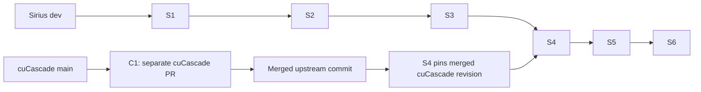

# Dynamic-filter implementation stack

Status: implementation plan; no implementation layer has been delivered by this document.

This plan delivers the complete-build dynamic-filter redesign and all six Sirius
optimizations in the campaign manifest. The architecture and invariants are defined
in [One lifecycle for complete-build dynamic filters](dynamic-filters-unified-design.md).
The original implementation remains available in
[Sirius PR #1451](https://github.com/sirius-db/sirius/pull/1451) as source material
and test evidence. The new PRs implement the architect's revised design; merging
#1451 is not a prerequisite. This plan does not close, rewrite, or merge that PR.

## Baselines and scope

The inspected Sirius base is `origin/dev` at
`f35092ffd10aeeea82fb793996f1b54ce477aa15` (2026-09-17). The local origin is
`kevkrist/sirius`; upstream `sirius-db/sirius/dev` was verified at the same commit.
The original multi-partition PR head is `7a5d6068`; the measured integration is
`c560b286`. These are implementation references, not branches to replay wholesale:
the earlier SIP work already exists in current `dev`.

Sirius currently pins cuCascade at `e9929fff5847f34d2eed91e29847181d638dc258`.
The inspected cuCascade `main` is `edd15e0b390ea9baa17ede51669af4d3402c240a`.
Neither revision supplies the per-pair grant/result API and public adaptor pool
accessor required by the manifest's H02 integration.

The source manifests are `MANIFEST-sirius.md` and `MANIFEST-cucascade.md`, assembled
2026-09-17 in the campaign's `iter3/50-manifest` directory. The scope and acceptance
criteria below are self-contained; reviewing the plan does not require access to
the campaign host.

Include the Sirius H02 integration. Keep its cuCascade implementation in a separate
`NVIDIA/cuCascade` PR. Exclude the campaign driver shim, unrelated optimization
branches, and placeholder campaign commit authorship. Preserve the existing
non-broadcast, more-than-one-hash-partition eligibility for accumulation.

## GitHub records

Published planning records:

- Umbrella: [sirius-db/sirius#1818](https://github.com/sirius-db/sirius/issues/1818).
- Design PR: [sirius-db/sirius#1819](https://github.com/sirius-db/sirius/pull/1819),
  from `kevkrist/sirius:docs/dynamic-filter-stack-20260917` to upstream `dev`.
- C1 prerequisite: [NVIDIA/cuCascade#199](https://github.com/NVIDIA/cuCascade/issues/199).

| Layer | Implementation task |
| --- | --- |
| S1 | [Publication and channel lifecycle — #1820](https://github.com/sirius-db/sirius/issues/1820) |
| S2 | [Complete-inventory Bloom publication — #1821](https://github.com/sirius-db/sirius/issues/1821) |
| S3 | [Scan consumer and fused masks — #1822](https://github.com/sirius-db/sirius/issues/1822) |
| S4 | [H02 and pipelined publication — #1823](https://github.com/sirius-db/sirius/issues/1823) |
| S5 | [Pinned-domain usefulness — #1824](https://github.com/sirius-db/sirius/issues/1824) |
| S6 | [Early probe activation — #1825](https://github.com/sirius-db/sirius/issues/1825) |

S1-S6 are native sub-issues of the umbrella, with native blocked-by relationships
for the linear predecessors and S4's C1 prerequisite. These relationships track
dependencies; they do not enforce PR merge restrictions or replace S4's merged-API,
gitlink, and validation gate.

Use one umbrella issue in `sirius-db/sirius` as the progress index, one task issue
per implementation layer, one cuCascade prerequisite issue, and this
documentation-only design PR. All PR head branches live in the user's forks:
`kevkrist/sirius` for Sirius and `kevkrist/cuCascade` for C1.
Create implementation PRs when their code is ready for review; an empty placeholder
PR is not an implementation milestone. Each implementation PR links its task issue,
the umbrella, the design, and the preceding PR.

GitHub tracking URLs are added to the umbrella as records are created. The design
PR can merge independently of the code stack. Tests, documentation, observability,
and configuration changes belong to the layer that owns their behavior; there is
no final cleanup PR that makes otherwise incomplete layers safe.

The six Sirius branches form a linear local stack in `kevkrist/sirius`. Their
upstream PRs all target `sirius-db/sirius:dev`. GitHub's native stacked-PR feature
requires branches in one repository and does not support this cross-fork arrangement;
use an explicitly linked series instead. The existing cross-fork PR #1451 remains
reference material. The cuCascade PR is a cross-repository prerequisite, not a
seventh branch in the Sirius stack.

| ID | Proposed fork branch | Branch parent | Deliverable |
| --- | --- | --- | --- |
| S1 | `df/01-publication-lifecycle` | Sirius `origin/dev` | Owned one-shot session and coherent channel lifecycle |
| S2 | `df/02-multibatch-bloom` | `df/01-publication-lifecycle` | Complete-inventory multi-partition Bloom with serial publication |
| S3 | `df/03-scan-consumer` | `df/02-multibatch-bloom` | Shared scan application, one gather, and fused membership masks |
| S4 | `df/04-peer-pipelined-publication` | `df/03-scan-consumer` | Merged cuCascade dependency, Sirius H02, and pipelined publication |
| S5 | `df/05-domain-evidence` | `df/04-peer-pipelined-publication` | Pinned-domain usefulness evidence and measured coverage profile |
| S6 | `df/06-early-probe` | `df/05-domain-evidence` | Optional early probe activation with preserved progress |
| C1 | `memory/pool-peer-access` | cuCascade `main` | Safe per-pair pool grant and borrowed pool accessor |

The branches above are reserved names in the plan, not claims that branches or PRs
already exist. "Branch parent" is a local Git ancestry relationship, not the base
field of the upstream PR. An upstream PR cannot target a base branch that exists
only in the fork.

Open S1 against upstream `dev`. Later PRs may be opened as drafts against the same
`dev`, with a "Depends on" link and a fork-to-fork compare link showing only that
layer, such as `kevkrist/sirius/compare/df/01-publication-lifecycle...df/02-multibatch-bloom`.
Until predecessors land, the upstream Files changed view is cumulative. Do not
claim those drafts have isolated diffs or native automatic stack management.
Alternatively open each upstream PR when its predecessor has landed; the fork
branches and task issues still preserve the full planned stack.

After a predecessor lands, fetch `sirius-db/sirius/dev` and rebase only the next
layer's own commits onto that upstream revision, then propagate that update to
descendants. `origin/dev` denotes the fork here and is sufficient only after the
fork's `dev` has explicitly been synchronized with upstream. Record old parent tips
before restacking, especially after squash merges; avoid replaying already-landed
ancestor commits. Update fork branches with lease protection and rerun affected
checks. Rebase fixes from their owning layer through all descendants. Review each
layer against its immediate parent and test the resulting complete checkout.
Merge in dependency order. In the chosen linear stack S5 and S6 also
wait for S4, although their mechanisms do not inherently require the new cuCascade
API; reordering them is possible only with an explicit update to this plan.

## Optimization coverage

| Manifest item | Owner | Required outcome |
| --- | --- | --- |
| H02: Sirius pool peer access | C1 + S4 | Initialize and verify access for actual allocation pools and configured GPU pairs |
| Scan-filter-on-view | S3 | Apply residual and membership filters to the cached view before one survivor gather |
| Fused membership-mask kernel | S3 | Preserve the selected program's mask and marginal-count semantics with fewer launches |
| Pipelined-publish-g | S4 | Overlap chunk reduction and replication when pool capability and memory admission permit |
| Selectivity-aware Bloom skip | S5 | Use copied pinned-domain evidence to avoid unproductive optional filters |
| Subtrees-b | S6 | Start eligible probe production after stable partition layout and terminal producers |

Keep useful NVTX/telemetry ranges with the owning changes. Preserve the measured
coverage threshold `0.45` in an explicit benchmark profile, while keeping the
production default `0.9` unless broader evidence justifies a separate decision.
Algorithm selectors and ablation switches remain internal/test-oriented rather
than becoming supported user configuration without a concrete operational need.

## C1: the separate cuCascade prerequisite

Proposed title: **Expose safe per-pool peer access for configured GPU pairs**.

Reauthor the real API delta represented by campaign commits `2d484a0` and
`31155d6` on current cuCascade `main`. Adapt to its newer APIs. Do not bring over
the campaign branch ancestry: it contains driver shim `8bf19f1`. The API proposal is:

- A borrowed `reservation_aware_resource_adaptor::pool_handle()` accessor, including
  its implementation wrapper; null when the upstream has no known CUDA pool.
- A per-owner/accessor `grant_pool_peer_access` operation with explicit granted,
  unsupported, empirically broken, and runtime-failure outcomes. Final spelling is
  subject to the cuCascade review; the contract is the dependency.
- One implementation shared with the existing all-visible helper. Direct-access
  eligibility requires the relevant empirical peer-DMA evidence in both directions.
- No pool ownership transfer, allocator-policy redesign, or driver compatibility
  shim. Document initialization-time probing, its synchronization/peer-state side
  effects, caller-device restoration, and the borrowed handle's lifetime.

Do not hide invalid CUDA execution state as benign lack of capability. A failed
grant does not prove that access is disabled, and does not prove which route a later
copy will take. Return enough information for the caller to verify actual access.

Acceptance includes library-owned tests for pool accessor variants; self/idempotent
grants; permission queries and byte-verified transfers in both directions; no-peer,
asymmetric-probe, and CUDA failure paths; device restoration; and borrowed-pool
lifetime. Deterministic error cases may use a narrow test seam. Required hardware
coverage and any skipped cases must be explicit in the PR evidence.

## S1: publication ownership and channel lifecycle

Introduce the session around existing one-shot publication without changing its
eligibility. The session owns claim, source readiness/pinning, completion, and
rollback. Whole-build observation occurs before downstream routing can finalize
the join. Input closure is remembered while an attempt is active; an unusable final
broadcast delivery cannot reopen a closed session.

Identified producer rights, registration freeze, coherent owning snapshots,
plan-narrowing completion, cancellation, and snapshot consumers ship together.
Completion follows the last possible push. No exposed anonymous terminal increment,
new scan wait, or independently authoritative second terminal state machine.

Acceptance: one-shot result parity, unusable/usable broadcast races, closure and
cancellation, zero-filter outcomes, exactly-once completion, snapshot ownership,
and all current planner/consumer semantics. This layer must be useful and complete
without S2.

## S2: complete-inventory multi-partition Bloom

Port the feature into S1's ownership model: freeze the exact original input IDs
and checked row geometry before the first destructive pop, preserve logical IDs
across clones/retries, and insert before scatter. Keep private mutable builders
separate from immutable published filters. The serial path already owns correct
reservations, input lifetimes, exceptional retirement, and strict replica readiness;
those responsibilities cannot wait for S4.

Acceptance: exact IDs and rows; duplicate/in-flight/unknown/missing contributions;
empty/all-null inputs; multiple keys and GPUs; retry provenance; finalize/cancel
races; drained targets; no-active-key journal semantics; memory cap; and strict
replication failure before fan-out. No partial input union becomes visible.

## S3: one scan consumer and fused application

Integrate filtering on cached views with the post-scan fallback through one consumer
and shared gate. Receipts identify actual applied entries by endpoint, filter, and
output binding. Pending snapshots may gain late filters. Preserve each checkpoint's
actual conditional ratios and ordering, with no repeated applied-entry sampling and
no zero-denominator samples.

Fuse supported membership masks, then gather survivors once at that checkpoint.
Retain unsupported-carrier fallback and value-preserving widening rules. Record
cached-view reader completion on every post-submission exit, including exceptions.
Size masks, counters, output and normalization independently of decompression
pushdown.

Acceptance: fused/unfused mask and conditional-count parity; residual/no-op/empty
cases; more than one kernel round; multiple bindings of one filter; late arrivals;
gate reopen; no duplicate application; and cached-view unwind after GPU submission.

## S4: H02 and pipelined publication -- blocked on C1

S4 consumes C1 only after its PR is reviewed and merged into cuCascade `main`.
Advance Sirius's gitlink to that merged commit or a reviewed descendant containing
it. Never pin the campaign `31155d66` revision or an unmerged dependency head as the
final merge-ready state. S1-S3 retain the existing dependency and can land first.

Initialize pool access once resources and configured devices are known. Capability
is associated with the actual owner pool/allocation domain, accessor, and context
lifetime. Track cuCascade-pool and device-default-pool outcomes independently;
success for one pool cannot stand in for another. Clear evidence on teardown or
reinitialization. The device-pair copy probe alone is insufficient evidence for
this decision.

The chunk strategy stays behind the same completed-or-safely-retired publication
contract as serial. Reuse the final contributor's existing root reservation; reserve
only incremental headroom, with separate remote reservations and nonblocking
rollback. Budget coexisting partials/replicas and preallocate the maximum scratch
shape. Protect scratch-half reuse and cross-key relayout from outstanding readers.

Unknown/unsupported transport or insufficient workspace may select the serial
runtime path. That fallback does not fulfill H02 acceptance: the dependency and
Sirius grant integration must actually ship and the direct-capable path must be
exercised on suitable hardware. Never restart serial on a partially mutated root
with uncertain GPU work.

Merge gate:

- [ ] C1 PR is merged upstream, with its final API and tests reviewed.
- [ ] The Sirius gitlink contains that merged commit and no campaign shim.
- [ ] Every pool needed by the optimized path has its actual capability verified.
- [ ] Direct-capable, unknown/no-peer, allocation-failure, two-key relayout, and
  submitted-work failure paths are validated with correct result/retirement evidence.
- [ ] No compound claim of a driver-staged route is inferred solely from grant failure.
- [ ] The owning reviewer confirms the dependency and the cumulative Sirius build.

## S5: pinned-domain usefulness evidence

Copy exact source/domain evidence into the immutable plan, matching file set,
column lineage, and supported uniqueness evidence. Caller `unique_cols` declarations
are usefulness assertions only. They must not feed current `dev`'s
`late_mat::unique_verdict`, distinct hash joins, duplicate elimination, or any
correctness-bearing uniqueness decision.

Acceptance: unknown/zero/inconsistent domains, duplicate and row-multiplying
lineage, re-pin/invalidation, mismatched sources, incorrect caller declarations,
and parity with filtering disabled. Validate both production `0.9` and measured
profile `0.45`; publish the chosen regime with performance evidence.

## S6: early probe activation

Offer early production only when build layout is stable, all relevant producer
rights are terminal, and memory admission preserves build progress. Retain the
normal deposited-build condition as an alternative. Actual hash probing still
waits for the appropriate built table.

Wire layout and terminal notifications explicitly; subscribe-and-recheck, coalesce
requests, and notify after releasing caller/operator/session/channel locks. Preserve
the ordinary progress path for unsupported graphs and probe-subtree dependencies.

Acceptance: both notification orders, unrelated and probe-subtree producers,
zero-filter terminals, narrowing, teardown, missed-wakeup prevention, and memory
pressure from buffered early probe output. Terminal does not imply profitable.

## Delivery and evidence

Use developer -> reviewer -> developer fixes for each layer, followed by a cumulative
review of the complete stack. The reviewer records defects, required properties,
and validation gaps in the owning layer; fixes are folded into that layer and its
descendants are rebased. Do not conflate a proposed test with an executed result.
Coordinate GPU test runs with the user before execution to avoid competing sessions.

Each layer includes focused tests, build evidence, and its relevant docs. Before
final acceptance, run repository-required test/lint checks and the agreed multi-GPU
and CPU-oracle validation. Record exact commits, dependency pin, hardware, build
environment, test skips/failures and benchmark settings. Validate the cumulative
stack on useful and ineffective filters, pinned/native/unpinned scans, direct and
fallback transfers, and memory pressure.

The manifest reports `814.2 -> 595.0 ms` across seven hot pinned SF100 queries on four
L40S GPUs, including H02. Preserve that profile as a reproduction target, with
per-optimization ablations. It is prior campaign evidence, not a promised speedup
or a validation result for this redesign/current `dev`.

Issue links and checklists track dependencies; they do not themselves enforce a
GitHub merge restriction. S4 must remain draft/not merge-ready until its dependency
gate is evidenced. Do not mark the umbrella complete until C1 and S1-S6 have landed
and cumulative validation is recorded. PR #1451's eventual replacement/closure is
a separate explicit maintenance action after the new stack is available.
