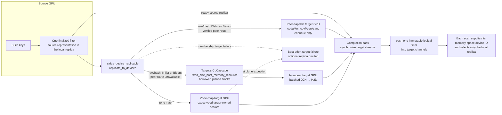

# Dynamic Filters — Multi-GPU Publication

> **Status: implemented.** Dynamic-filter consumers remain nonblocking and safe
> on multiple GPUs. The producer builds each filter once and attempts to
> materialize its compact representation on every active probe GPU (copying raw
> needles, finalized hash-set slots, or Bloom words, or reconstructing exact
> zone scalars), and publishes one immutable logical filter only after every
> successful device-local replica is ready.
> See [dynamic-filters.md](dynamic-filters.md) for the general feature.

## Summary

The crash was a device-ownership bug, not a cuDF filtering bug. The hash-join
build created a `cuco::static_set`, `cuco::bloom_filter`, or zone-map
`cudf::scalar` on its GPU and published a device-agnostic `shared_ptr`. Probe
scans are load-balanced across all active GPUs, so another GPU could dereference
the producer's device pointer. The asynchronous fault surfaced later as:

```text
copy_if failed on 2nd step: cudaErrorIllegalAddress
```

The fix gives every filter explicit device identity and records which
device-local replicas are ready. Consumers select by their memory-space device
ID; they never dereference remote filter storage. When the filter kind's
best-effort policy permits a target omission, that GPU skips the optional
filter; failures outside that policy propagate.

The publication and application contracts are distinct:

- For the producing join's immediate probe input, build-side CONCAT
  synchronously completes the publication attempt before its probe data-scan
  execution begins.
- A base scan reached transitively through an intervening join can execute
  earlier. It snapshots whatever fully ready filters are visible at its
  reader and post-decode checkpoints under normal scheduler order.
- A scan never waits for a dynamic filter and never assumes one was emitted.
- An empty or policy-gated publication and an allocation-unavailable local
  replica are safe pass-through cases; the authoritative join guarantees
  correctness.
- Every concrete filter treats a per-target reservation denial, construction
  exception, transfer failure, or completion failure as optional replica
  unavailability: it catches and logs the failure and omits that target. Source
  construction failures and publisher invariants outside a target replication
  attempt still propagate and fail the producing task/query.

Probe metadata parsing and prefetch preparation are independent of publication.
For an immediate probe, the actual `read_parquet`/decode task starts after the
ordered build-port publication attempt has returned. A transitive target may
start sooner, and where it snapshots the channel depends on the scan format: a
parquet target has two checkpoints — it selects zone maps into the reader AST
immediately before `read_parquet`, then selects membership filters in the
following post-decode operator; a duckdb-native target has one — the post-decode
operator, which has no reader filter to ride and therefore selects zone maps
(evaluated row-wise as AST masks) and membership filters together. See
[Transitive scan targets and publication timing](dynamic-filters.md#transitive-scan-targets-and-publication-timing).

## Failure mode and diagnosis

The ownership bug appears when a probe consumer runs on a different GPU from
the producer and dereferences the producer's device-local storage. A
single-device execution cannot expose that cross-device access.

The unsafe ownership was:

| Filter | Source storage | Pre-fix failure |
|---|---|---|
| IN-list | `cuco::static_set` slots | `contains` on GPU B read GPU A's slots |
| Bloom | `cuco::bloom_filter` words | `contains` on GPU B read GPU A's words |
| Zone map | min/max `cudf::scalar`s | GPU B's AST literal referenced GPU A storage |

The raw-needle IN-list was added after this original failure. Its owned
`rmm::device_buffer` is still device-local and follows the same rule: a GPU may
read only its own needle snapshot.

The error is reported by `cudf::apply_boolean_mask`/`copy_if`, but that is only
the next synchronizing operation. The invalid access originates in the earlier
membership or AST kernel.

### Hash-join broadcast research

Sirius never copies one opaque cuco hash table across GPUs. A cuco hash table
cannot be copied as an opaque object because its wrapper contains device
pointers and allocator/stream state. Instead, the broadcast small-build-table
join (`_broadcast`) replicates the small build *table* — the raw build batch —
to every GPU and lets each GPU build its own hash table from it (see
[operators.md](operators.md); `sirius_physical_partition.{cpp,hpp}`,
`sirius_physical_hash_join.{cpp,hpp}`). Large / hash-partitioned joins still
distribute partitions and migrate/co-locate their data batches, one hash table
per partition pinned to `partition_idx % num_gpus`.

Dynamic filters use the same "copy a flat, finalized representation and
reconstruct the pointer-bearing owner on the destination" pattern, but for the
*filter*, not the hash table. They implement it entirely in Sirius; they do not
copy a cuco wrapper and do not call or modify CuCascade's representation-transfer
code.

## Implemented design

### 1. Freeze routing and placement in an immutable publish plan

The planner creates a `dynamic_filter_publish_plan` before constructing the
physical hash join. It contains:

- every probe channel and its probe-column mapping;
- whether zone maps may be emitted;
- the per-key build-key-domain estimates used by the publication gates; and
- non-owning placement handles for the context's active GPU memory spaces.

Each `dynamic_filter_replica_space` pairs a non-null CuCascade GPU
`memory_space` with the NUMA-selected CuCascade HOST `memory_space` used for
staging when peer DMA is unavailable. The plan validates both tiers and
sorts/deduplicates placements by the GPU's actual device ID. The completed plan
is moved into the hash join's
`const _dynamic_filter_plan`. Runtime publication can observe that a channel has
drained, but it cannot add targets, rediscover devices, or change policy. This
also avoids assuming that active devices are numbered `0..N-1`, which matters
with explicit GPU selections and `CUDA_VISIBLE_DEVICES` remapping.

The handle is deliberately non-owning. The Sirius memory manager owns each
space, its default allocator, and its CUDA stream pool. That manager must outlive
the publish plan and every filter replica materialized from it; all GPU filter
uses must finish before filter destruction. This was already required by the
replicas' non-owning RMM allocator references. Carrying the memory space makes
the allocator-and-stream lifetime contract explicit in the placement type.

The producer first selects the raw-needle IN-list for 1–12 null-free INT32/INT64
build rows, counting duplicates. For remaining supported columns, the
hash-IN-list/Bloom choice uses the minimum L2 size across the planned devices.
The hash IN-list is selected only when it fits the least-capable probe GPU;
otherwise the publisher selects the smaller Bloom, which may itself exceed L2
for a sufficiently large build. The decision never inherits whichever GPU
first queried `cudaDevAttrL2CacheSize`.

### 2. Keep publication local and exactly once

`dynamic_filter_publisher` is declared in
`src/include/op/dynamic_filter/dynamic_filter_publisher.hpp` and implemented in
`src/op/dynamic_filter/dynamic_filter_publisher.cpp`; the physical hash join owns and invokes
it. It consumes the immutable plan, the join's key metadata, and one materialized
build view; it is not a shared scheduler service or a mutable routing registry.

The build-port hook offers that view as soon as a concat-folded `BUILD_PROBE`
build batch arrives, acquiring the batch's read-only accessor before routing it
so the GPU representation stays pinned against downgrade until publication
completes. In a single-partition join exactly one build batch arrives. In a
**broadcast** join every partition holds the *full* replicated build, so each
partition's concat_all-folded batch is a complete build side and races this hook
on its own GPU; the `OPEN -> PUBLISHING` compare-exchange lets exactly one win
(the first to arrive publishes and replicates; the others fall out at the CAS
before doing any filter work). A genuinely hash-partitioned (non-broadcast)
multi-partition build still disables pushdown — each partition holds only a
slice, so no single batch could emit a complete filter. The hook and
finalization arbitrate through a publication state machine independent of the
hash-table build state:

```text
OPEN --claim--> PUBLISHING --success--> FINISHED
                         `--exception--> FAILED
OPEN --finalize without a claim-------> CLOSED
```

Only an `OPEN -> PUBLISHING` compare/exchange may claim the work. Finalization
only closes an unclaimed window; it never manufactures a filter from released
state. `op_state_mutex` protects the short eligibility/finalization checks, but
is never held while reducing keys, building filters, copying replicas, or
synchronizing CUDA work.

At the early build-port site, a stream borrowed from the build memory space
first waits on the build representation's writer event. Persistent
cuDF/cuCO/RMM filter storage may retain that durable pooled stream for eventual
asynchronous deallocation, so it must not retain a worker stream whose executor
can be torn down earlier. Publication remains independent of a probe batch and
preserves the existing join task state machine.

### 3. Expose replication as a producer-only capability

Consumer semantics remain on `sirius_dynamic_filter`: kind, availability, AST
lowering, and/or mask application. Device materialization is a separate
`sirius_device_replicable` capability with
`replicate_to_devices(span<dynamic_filter_replica_space const>)`. The local
publisher passes the immutable plan's placements after construction and before
channel fan-out; concrete filters retain completed replicas, not a second copy
of routing policy. A missing capability is an invariant failure rather than a
silent cross-device publication. Scan consumers never invoke it or know how a
representation is copied.

The publisher synchronizes the construction stream, invokes the capability for
each built filter, and only then calls `push_filter`. Every filter kind treats
a per-target failure — reservation denial, cloning, the copy itself, or the
completion synchronize — as best-effort replica unavailability: it is logged
and that target's replica is omitted. Successful replicas are published without
weakening the authoritative join.

### 4. Build once, copy finalized storage

The producer builds the source filter normally and synchronizes its construction
stream once. It does not retain the build-key column and does not rebuild or
rehash keys on every GPU.

- **Raw-needle IN-list:** allocate an owned target `rmm::device_buffer` and copy
  `num_keys * sizeof(KeyT)` bytes from the source needle snapshot. There is no
  target hash structure to rebuild.
- **Hash IN-list:** create an identical target `cuco::static_set`, verify its
  capacity, then copy `capacity * sizeof(KeyT)` bytes from `static_set::data()`.
- **Bloom:** create the same policy and block extent on the target, verify the
  extent, then copy `block_extent * words_per_block * sizeof(word_type)` bytes.
- **Zone map:** read each bound as its exact host type and construct target-owned
  scalars. This preserves `INT64`, timestamp, decimal, and string semantics; it
  does not round bounds through `double`.

Each byte-backed membership replica first reserves its tracked destination
allocation through the target's reservation-aware GPU allocator. Reservation
denial logs and omits that optional replica. When the scoped reservation
detaches, unused capacity is returned while the completed allocation remains
accounted until replica teardown.

For every target, the planner pairs its GPU memory space with a NUMA-local HOST
memory space (falling back to the first Sirius HOST space when topology is
unknown). Replication selects the GPU and obtains both `acquire_stream()` and
`get_default_allocator()` from that GPU space. The stream is a non-owning view
into the space's managed stream pool; no persistent private stream is created.
The source representation is already the source GPU's ready local replica; no
same-device copy is submitted for it. Peer-DMA copies to remote targets are
submitted before the publisher waits on any target stream, so transfers to
three or more GPUs can overlap. The publisher retains each destination object
through this completion pass and adds it to the ready set only after its stream
completes. Replica destruction selects the owning CUDA device and releases RMM
buffers, cuCO objects, or scalars while both documented memory spaces are still
alive.



Copies to different peer-capable targets are enqueued before the completion
pass, so three-or-more-GPU fan-out can overlap. HOST staging remains synchronous
inside the copy helper because the borrowed blocks must not return to their pool
while DMA is still using them.

### 5. Use the Sirius-owned replica-transfer path

`detail::enqueue_replica_copy` in
`src/cuda/dynamic_filter_replica_transfer.cu` owns the byte-copy policy and
returns the selected route:

1. Sirius calls CuCascade's shared, cached empirical peer-DMA probe for the
   ordered `(source, destination)` pair instead of maintaining a second probe.
2. Matching CuCascade's established GPU-to-GPU converter, a verified pair uses
   `cudaMemcpyPeerAsync` directly on the destination replica stream. Sirius
   enables ordinary peer access once during context initialization; neither
   converter performs a per-allocation memory-pool permission query. An
   unexpected enqueue failure propagates instead of changing routes.
3. Otherwise the adapter borrows the minimum number of pre-pinned fixed blocks
   from the target's planned CuCascade
   `fixed_size_host_memory_resource`. Because the blocks are noncontiguous, it
   emits one copy descriptor per block but submits them as two driver batches:
   D2H on a pooled stream acquired from the source GPU space, one source-stream
   completion barrier, then H2D on the destination replica stream followed by a
   destination-stream completion barrier. The two dependent legs cannot share
   one CUDA batch. On toolkits before CUDA 12.8 the same descriptors fall back
   to individual asynchronous copies. The borrowed blocks return to the pool
   before the helper returns, matching CuCascade's converter lifetime policy.

The dynamic-filter code never calls `cudaHostAlloc`/`cudaFreeHost` and does not
modify CuCascade; it uses CuCascade's public probe and existing Sirius-owned HOST
memory-space resource. Source writes are already complete before the helper is
called. Local and peer-DMA routes return after enqueue; the concrete filter
retains those replicas and synchronizes all target streams only after fan-out
submission is complete. HOST staging completes inside the helper because its
borrowed blocks cannot return to the pool while H2D DMA is in flight. Host-pool
exhaustion is allocation unavailability and may omit that optional replica.
The copy helper propagates enqueue and synchronization errors to its concrete
filter; the filter's per-target replication boundary catches them, logs the
omission, and never exposes uncertain replica state. The helper does not
silently change transfer routes.

### 6. Publish one ready immutable snapshot

The claimed publisher constructs and completes all possible replicas, then fans
the same immutable logical filter into the planned channels. Consumers can
therefore remain lock-light and never observe an in-flight replica as available.

Publishing the source replica before remote replicas was deliberately rejected.
It would not advance an immediate probe—the synchronous build-port hook must
still return first—and, although it could help an already-running transitive
split on the source GPU, it would expose a logical filter whose replica set was
still mutating. A caller on another GPU would safely pass through and would not
train the gate, but it could miss optional pruning. The per-filter ready-snapshot
rule keeps each published object immutable and avoids per-device publication
generations. A transitive target may still race the producer's successive
`push_filter` calls and observe a safe subset of the fully ready filters.

### 7. Select locally at the consumer

The scan paths pass their memory-space device ID into dynamic-filter lowering and
mask computation:

- the parquet reader AST merge selects device-local zone-map scalars;
- the post-decode AST row-mask apply (duckdb-native scans,
  `include_ast_row_masks`) selects device-local zone-map scalars;
- the post-decode membership apply selects the local raw needles, static set, or
  Bloom;
- `is_available_on_device` is checked before every path.

There is no remote kernel dereference and no consumer-side synchronization with
the producer.

The scan-level `applicable()` fast path is lock-free. On an actual membership
apply, per-filter keep-ratio lookups/first-record updates use the ratio-map
mutex, and the post-mask scan-level decision uses a separate small mutex while
re-reading its state. This makes `ACTIVE` terminal: a stale unselective task
from an older filter generation cannot race a selective task on another GPU and
disable a filter already proven useful.

## Cost and scheduling model

Publication adds `O(filter_size * (GPU_count - 1))` transfer work per join, not
one rehash/rebuild per GPU. A verified pair uses one direct peer-DMA leg; only an
unusable pair pays the HOST-staged D2H/H2D fallback. The steady-state probe
remains entirely device-local: the 1–12-row first tier scans raw needles, the
hash IN-list is selected to fit the smallest active L2 where possible, and the
Bloom remains the compact fallback. The raw tier's probe work is
`O(probe_rows * num_keys)`; its row-count gate bounds that work. No key column
is retained, no scan is pinned to the build GPU, and scan parallelism is
unchanged.

The copy happens on the producer's publication path. Direct copies to all
peer-capable targets are enqueued before the completion pass, allowing their DMA
legs to overlap on three or more GPUs. For an immediate probe, publication
completion is upstream of data-scan execution, so replica latency is on the
probe-start critical path. For a transitive target, earlier work may proceed
unfiltered while replication is in progress; replica latency instead delays
filter availability and reduces the number of splits it can prune. The scheduler
does not reorder work to minimize that window. Raw needles are bounded by the
producer policy, while hash-set slots and Bloom words are copied rather than
rebuilt; for a two-GPU query this is one remote replica per emitted filter.

`memory_space::acquire_stream()` may return a pooled stream that already has
work queued, so the publication wait can occasionally include earlier work on
that stream. This is a cold-path head-of-line tradeoff: it can delay publication
and therefore the ordered immediate-probe start or the coverage of a transitive
target, while the managed pool avoids per-filter stream creation/destruction. It
is not a consumer-side wait or a correctness hazard and does not alter the
ownership or readiness contracts.

## Correctness coverage

### Correctness and device ownership

The focused tests cover IN-list, Bloom, and zone-map remote replicas, the
fixed-HOST-pool fallback route, concurrent gate updates, and end-to-end
multi-device consumption.

One focused low-level test verifies that a filter object without a replica for a
requested device returns no mask; this exercises API safety and is not a model
of production scheduling, because production publishes only after replication.
The tests also verify that replicas survive destruction of the borrowed
build-key column, that Bloom replication has no false negatives, and that the
explicit pinned-host fallback transfers the exact bytes. Their source and
destination allocations use streams and allocators from a two-GPU Sirius
memory manager, which is deliberately declared before—and destroyed after—the
filters to exercise the documented pool-lifetime contract.

Raw-needle coverage adds local INT32/INT64 exact-mask and reserved-sentinel
cases, direct publisher-selection tests for the raw and adjacent hash tiers,
and a focused two-GPU case. The latter destroys the original build-key column
before fan-out, verifies remote unavailability before replication and exact
masking afterward, checks reservation/allocation growth, and checks teardown.
The reservation-denial suite also covers the raw small IN-list. These multi-GPU
cases skip automatically when fewer than two devices are visible, so a passing
two-device run is still required before the raw path can be called revalidated.

## Code map

- Filter API and device-aware ownership:
  `src/include/op/dynamic_filter/sirius_dynamic_filter.hpp`
- Membership storage replication:
  `src/cuda/sirius_dynamic_small_in_list_filter.cu`,
  `src/cuda/sirius_dynamic_in_list_filter.cu`,
  `src/cuda/sirius_dynamic_bloom_filter.cu`
- Exact typed zone-map replication:
  `src/op/dynamic_filter/sirius_dynamic_filter.cpp`
- Producer device discovery and publication:
  `src/planner/sirius_plan_comparison_join.cpp`,
  `src/include/op/dynamic_filter/dynamic_filter_publisher.hpp`,
  `src/op/dynamic_filter/dynamic_filter_publisher.cpp`,
  `src/op/sirius_physical_hash_join.cpp`
- Consumer device selection:
  `src/include/op/scan/dynamic_filter_gate.hpp`,
  `src/op/scan/dynamic_filter_merge.cpp`,
  `src/op/scan/parquet_gpu_ingestible.cpp`,
  `src/op/scan/sirius_physical_dynamic_filter.cpp`
- Sirius-owned replica-transfer policy:
  `src/include/op/dynamic_filter/dynamic_filter_replica_reservation.hpp`,
  `src/include/op/dynamic_filter/dynamic_filter_replica_transfer.hpp`,
  `src/cuda/dynamic_filter_replica_transfer.cu`
- Focused regressions:
  `test/cpp/operator/test_dynamic_filter_publisher.cpp`,
  `test/cpp/operator/test_sirius_dynamic_filter_mgpu.cpp`,
  `test/cpp/scan/test_dynamic_filter_merge.cpp`
