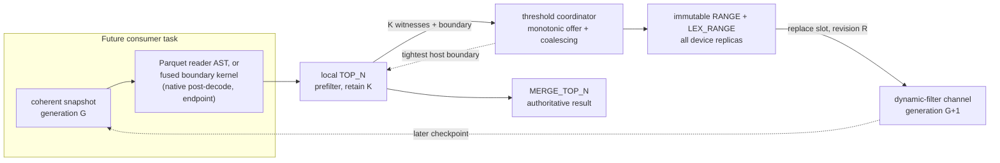
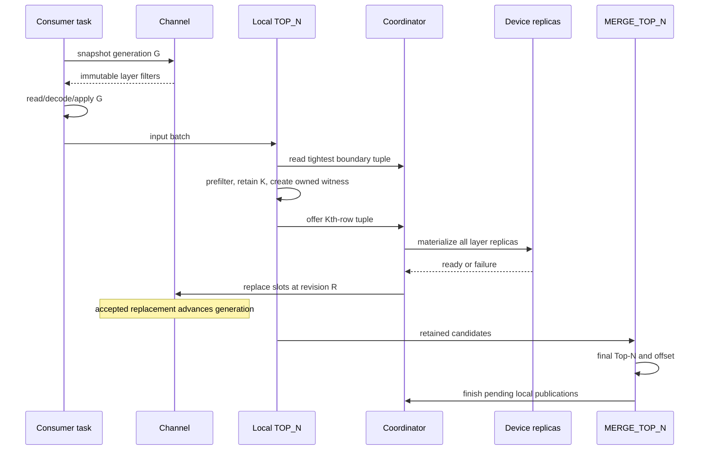

# Dynamic Filters — Top-N Threshold Refinement

> **Status: Stages 1–4 implemented; Stages 5–7 proposed.** Implemented behind
> `enable_top_n_dynamic_filter` (default false): the multi-key threshold coordinator and sink
> self-consumption via the fused boundary kernel (Stage 1); channel refinement slots, coherent
> snapshots, generations, and consumer migration (Stage 2); the `RANGE` and `LEX_RANGE` filter
> classes with reader-AST lowering, the compaction capability, and all-or-nothing replication
> (Stage 3); and publication itself (Stage 4) — the immutable publish plan, both discovery
> traces, planner wiring, the publisher loop allocating real revisions, and the reader-AST and
> sited-endpoint consumers. Producers publish to channels: scan binds and first-key endpoints are
> live, LEX endpoints are deferred to Stage 7, and a set operation is a terminal for the Top-N
> trace. The group-key producer (Stage 5) and everything after it remain proposed. This document
> makes Top-N the first concrete Phase 4 dynamic-refinement producer while preserving the
> implemented, append-only hash-join publication path. See
> [dynamic-filters.md](dynamic-filters.md) for the general framework,
> [dynamic-filters-multi-gpu.md](dynamic-filters-multi-gpu.md) for current device-replica
> ownership, and [dynamic-filters-top-n-api.md](dynamic-filters-top-n-api.md) for the
> header-level API specification and the high-level test plan.

## Summary

Sirius should let a running `TOP_N` publish its current worst retained ordering-key **tuple** as a
progressively tightening dynamic filter. The operator's own sink consumes it first: every
otherwise-eligible Top-N prefilters later input batches against the coordinator's tightest
boundary, with no channel, replica, or scan reachability required.

External publication is **layered**, because lexicographic order permits no per-key fan-out — a
row with an arbitrarily bad later key still wins on a strictly better first key, so no key after
the first is ever filtered alone. From one producer:

- a **strict lexicographic predicate** over the whole tuple applies where every key coexists in
  one schema — the arrive-together site, which may be a scan when all keys come from one table;
- an **inclusive first-key bound** additionally travels as far upstream as key zero traces —
  into key zero's scan even when later keys originate elsewhere.

One coordinator publishes both layers; a site that receives the lexicographic predicate never
also receives the first-key bound it implies.

A second producer kind moves inside the one barrier that caps the first. For `TOP_N` above a hash
`GROUP BY` ordering on grouping keys, the aggregate's sink witnesses the K best **distinct**
grouping-key values and publishes a progressively tightening **inclusive** threshold to the
consumers of its own input pipeline — the scans and operators the aggregate's FULL input port
walls off from the row producer — while dropping strictly-worse input rows before hash insert.
Both producers coexist under one flag: the row producer self-consumes above the barrier, the
group-key producer prunes below it.

This is an informational feedback loop, not a new pipeline dependency:

- `TOP_N` and `MERGE_TOP_N` remain the sole correctness authority.
- A consumer never waits for a threshold and never revisits completed work.
- Missing, stale, unsupported, and failed thresholds are safe pass-through cases.
- Every visible Top-N filter is immutable and ready on every planned consumer GPU.
- A threshold may only become more selective during one execution.

The transport is Sirius's native `sirius_dynamic_filter_set`, not DuckDB's `DynamicFilterData`:
two immutable filter kinds (one-sided `RANGE`, lexicographic `LEX_RANGE`), a stable replaceable
channel slot, a coherent generation-tagged snapshot, and a Top-N-specific coordinator. Existing
hash-join filters continue to use `push_filter()` and remain append-only.

In this document **Top-N** is the Sirius/DuckDB operator name. **K** is the number of candidates the
operator retains:

```text
K = limit + offset
```

## Decision summary

| Area | Decision |
|---|---|
| Runtime transport | Sirius-native dynamic-filter channels |
| Filter representation | Immutable one-sided `RANGE` (first-key and single-key) and lexicographic `LEX_RANGE` |
| Channel update | Stable refinement slot replaced by producer revision |
| Consumer change detection | Monotonic channel generation bound to coherent snapshots |
| Producer kinds | Row producer: `TOP_N` whose ORDER BY keys are all bound references; group-key producer: the aggregate sink below a `TOP_N` whose keys are all grouping keys |
| Group-key predicates | Inclusive-only in both layers; a boundary-tied input row is never dropped |
| Group-key witness | The K best distinct key values, accumulated across offers; boundary = the Kth once the set is full |
| Sink self-consumption | Always on for eligible producers; lexicographic compare against the shared boundary tuple |
| Predicate layers | Strict full-tuple lexicographic where all keys coexist; inclusive first-key bound further upstream |
| Per-key fan-out | Forbidden; no key after the first is ever filtered alone |
| Consumer placement | Scan route when a trace reaches a scan; otherwise a cost-gated endpoint at the stop point |
| Reach ceiling | The nearest upstream FULL-barrier port; PARTIAL and PIPELINE ports do not cap reach |
| Device row filtering | One fused predicate+compaction kernel; cuDF AST only at the parquet reader |
| First legal boundary | Kth row's key tuple of one retained local result containing K rows |
| Admitted types | Per key: DuckDB `TINYINT`, `SMALLINT`, `INTEGER`, `BIGINT`, `DATE`, `DECIMAL(5–18)`; key zero admitted enables the first-key layer, all keys admitted adds the LEX layer |
| Null boundary | Null first component publishes nothing; null tail components use DataFusion's shipped derivations |
| Replica readiness | All planned consumer-device replicas before replacement |
| Scheduling | Nonblocking and opportunistic |
| Failed replacement | Retain the previous revision, or no filter |
| Final authority | Existing local/merge Top-N computation |

## Motivation and current state

DuckDB's optimizer attaches a `DynamicFilterData` pointer to `LogicalTopN`. Sirius moves that
pointer into `sirius_physical_top_n` in
[`sirius_plan_top_n.cpp`](../../src/planner/sirius_plan_top_n.cpp) and shares it with
`sirius_physical_top_n_merge`. The GPU path never updates it:

- [`sirius_physical_top_n::execute`](../../src/op/sirius_physical_top_n.cpp) computes a sorted
  local result containing at most `limit + offset` rows.
- [`sirius_physical_top_n_merge::execute`](../../src/op/sirius_physical_top_n.cpp) combines local
  candidates and applies `offset` only after the inputs arrive.
- Parquet captures the static DuckDB table-filter expression during ingestible construction and
  translates that snapshot per task immediately before `read_parquet`; the conversion skips
  `OPTIONAL_FILTER` nodes outright, so Top-N's `DynamicFilterData` never enters that snapshot.
- DuckDB-native metadata treats DuckDB `DYNAMIC_FILTER` as a routing placeholder in
  [`duckdb_native_metadata.cpp`](../../src/op/scan/duckdb_native_metadata.cpp).

Updating the DuckDB object would create a second runtime-filter path without making the GPU
consumers refresh it.

The Sirius-native path already has the useful seams:

- `sirius_dynamic_filter` objects are immutable and capability-based.
- `sirius_dynamic_filter_set` is thread-safe, nonblocking, and co-owns filter snapshots.
- Parquet reads the channel immediately before `cudf::io::read_parquet` in
  [`parquet_gpu_ingestible.cpp`](../../src/op/scan/parquet_gpu_ingestible.cpp).
- DuckDB-native scans apply AST-capable filters after decode through
  [`sirius_physical_dynamic_filter.cpp`](../../src/op/scan/sirius_physical_dynamic_filter.cpp).

The missing capability is replacement. The current channel only appends filters, and the
post-decode gate detects change through `filter_count()`. Appending every Top-N boundary would be
correct because the predicates AND-conjoin, but it would grow ASTs, retain every superseded scalar,
and make update cost proportional to query progress.

## Goals

1. Publish a sound threshold after local Top-N owns K witnesses.
2. Apply that threshold inside the operator first: an eligible Top-N prefilters its own later
   input from the shared coordinator boundary, independent of any external consumer.
3. Move production inside a FULL barrier where the shape allows: the group-key producer prunes
   the aggregate-input pipeline that the barrier walls off from the row producer.
4. Tighten the threshold monotonically as better candidates arrive.
5. Reuse current scan channels, target ordinals, AST lowering, endpoint splicing, and multi-GPU
   ownership.
6. Preserve append-only hash-join publication without changing its behavior.
7. Support Parquet reader filtering, DuckDB-native post-decode filtering, and sited endpoint
   filtering where a layer's trace reaches no scan.
8. Keep producers and consumers nonblocking with respect to filter readiness.
9. Make plan reuse, cancellation, stale updates, and partial failure explicit.
10. Instrument whether a threshold arrives before useful scan or endpoint work.

## Non-goals for the first release

- `WITH TIES`, `RANK`, or `DENSE_RANK` filtering.
- Floating point and NaN ordering.
- Timestamp/timezone ordering, decimal scale, collated strings, or complex values.
- Ordering expressions other than a reference carried through simple lineage hops.
- Widening the self-filter traces through join probe or build blocks; the first release sites
  endpoints only at the minimal hop set's stop points.
- Hive-partition-column pruning.
- DuckDB-native pre-decode or row-group-statistics pruning.
- Waiting, rescheduling, cancelling, or revisiting scan tasks when a threshold changes, including
  DataFusion-style mid-split early termination; a Sirius split is one `cudf::io::read_parquet` call.
- A shared cross-batch witness heap when every local result contains fewer than K rows.
- Any intervening filter between the aggregate and Top-N for the group-key producer; a
  grouping-key-only `HAVING` is admissible in principle (the sink can witness through the same
  predicate) and staged later.
- Early termination via order-preserving streaming aggregation — `LIMIT` over a sort-based
  group-by stops after K groups, strictly better than filtering where available. Inapplicable:
  neither Sirius (`sirius_physical_grouped_aggregate` and its merge are the only grouped
  operators) nor DuckDB v1.5.4 (hash, perfect-hash, partitioned, ungrouped) has a sort-based or
  streaming group-by operator. Revisit only if Sirius gains one.
- Replacing DuckDB's CPU-path Top-N filtering.

## Lessons from other engines

The design combines DataFusion's versioning model and full-tuple predicate with DuckDB's
first-key scan bound: the two published layers are exactly the two engines' shipped predicates,
unified behind one coordinator.

| Engine | Observed behavior | Sirius lesson |
|---|---|---|
| DuckDB | A thread-local heap that first holds `LIMIT + OFFSET` rows publishes its worst sort key; one mutex-guarded boundary tightens monotonically, silently skips a null boundary, prunes sibling sink threads lexicographically, and reaches scans as an optional statistics-only filter | Publish at K local witnesses; a first-key range is useful without making the scan filter authoritative |
| DataFusion | Partition heaps publish the boundary row's strict lexicographic predicate into one shared lock-guarded expression with a monotonic generation; a byte-comparable shared threshold revalidates tightening under the write lock; consumers re-prune files, row-group boundaries, and opt-in rows on change notification | Validate strengthening at the producer, publish immutable snapshots, and refresh at checkpoints |
| Velox | TopN prunes only its priority queue; runtime filters are one-shot merges from completed hash-join builds, routed along the pipeline to the scan | Generic routing is reusable, but progressive publication needs a new lifecycle |

Three cross-engine facts anchor the decisions here. Every heap rejects boundary ties strictly.
Both publishing engines gate the first publication on a full heap and restart repeated execution
from explicitly reset filter state. Both default to statistics-level scan pruning: DuckDB's
optional filter never row-filters, and DataFusion's row-level pushdown is off by default.

The group-key producer's precedent is DataFusion's TopK aggregation
(`enable_topk_aggregation`, default true): a limit hint on the aggregate plus a bounded priority
map that drops rows of losing groups during accumulation — exactly one group key, zero
aggregates or a single direction-matched MIN/MAX (sound because min/max is monotone under row
discard), and strictly operator-internal: the Kth boundary is never published, and DataFusion's
only aggregate-produced scan filter is ungrouped min/max. Sirius keeps the internal discard and
adds the external publication. Neither DuckDB (no comparable rule or operator) nor Velox
(`TopNRowNumber` is a window operator and produces no runtime filter) has an equivalent.

Primary references:

- DuckDB [Top-N filter construction](https://github.com/duckdb/duckdb/blob/08e34c447bae34eaee3723cac61f2878b6bdf787/src/optimizer/topn_optimizer.cpp#L67-L135),
  [boundary publication](https://github.com/duckdb/duckdb/blob/08e34c447bae34eaee3723cac61f2878b6bdf787/src/execution/operator/order/physical_top_n.cpp#L45-L76)
  with its [full-heap trigger](https://github.com/duckdb/duckdb/blob/08e34c447bae34eaee3723cac61f2878b6bdf787/src/execution/operator/order/physical_top_n.cpp#L349-L380)
  and [sink-side feedback](https://github.com/duckdb/duckdb/blob/08e34c447bae34eaee3723cac61f2878b6bdf787/src/execution/operator/order/physical_top_n.cpp#L269-L347),
  the [null-skip and per-execution reset](https://github.com/duckdb/duckdb/blob/08e34c447bae34eaee3723cac61f2878b6bdf787/src/planner/filter/dynamic_filter.cpp#L54-L66),
  and the [optional scan filter](https://github.com/duckdb/duckdb/blob/08e34c447bae34eaee3723cac61f2878b6bdf787/src/planner/filter/optional_filter.cpp#L11-L27)
  whose row-level `FilterSelection` passes every row.
- DataFusion [Top-K update and predicate shape](https://github.com/apache/datafusion/blob/3e3a92de29ed3d454e72c7bade6328508b6098c6/datafusion/physical-plan/src/topk/mod.rs#L532-L679),
  [shared cross-partition threshold](https://github.com/apache/datafusion/blob/3e3a92de29ed3d454e72c7bade6328508b6098c6/datafusion/physical-plan/src/topk/mod.rs#L146-L219),
  [dynamic-expression generation](https://github.com/apache/datafusion/blob/3e3a92de29ed3d454e72c7bade6328508b6098c6/datafusion/physical-expr/src/expressions/dynamic_filters/mod.rs#L310-L359),
  and [file-pruner refresh](https://github.com/apache/datafusion/blob/3e3a92de29ed3d454e72c7bade6328508b6098c6/datafusion/pruning/src/file_pruner.rs#L127-L170).
- DataFusion [TopK-aggregation rule](https://github.com/apache/datafusion/blob/3e3a92de29ed3d454e72c7bade6328508b6098c6/datafusion/physical-optimizer/src/topk_aggregation.rs#L45-L172),
  its [bounded priority map](https://github.com/apache/datafusion/blob/3e3a92de29ed3d454e72c7bade6328508b6098c6/datafusion/physical-plan/src/aggregates/topk/priority_map.rs#L62-L117),
  and the [config default](https://github.com/apache/datafusion/blob/3e3a92de29ed3d454e72c7bade6328508b6098c6/datafusion/common/src/config.rs#L1376-L1378).
- Velox [TopN](https://github.com/facebookincubator/velox/blob/6dab648023f70009b085b2068fd44f3e9ebbdcde/velox/exec/TopN.cpp)
  and [runtime-filter routing](https://github.com/facebookincubator/velox/blob/6dab648023f70009b085b2068fd44f3e9ebbdcde/velox/exec/Driver.cpp#L1145-L1249);
  a TopN boundary filter exists upstream only as the unimplemented mutable-filter proposal in
  [issue #3719](https://github.com/facebookincubator/velox/issues/3719).

## Semantic contract

### Terms

- **Candidate result:** one sorted local `TOP_N` output containing at most K rows.
- **Witness:** a row durably owned by the result path and no worse than the proposed boundary.
- **Boundary:** the full ordering-key tuple of the worst retained witness among K.
- **Threshold:** the published constraint derived from a boundary — the visible layer filters.
- **Better:** earlier in the complete SQL `ORDER BY` — lexicographic over all keys, including
  each key's direction and null placement.
- **Tighter:** excludes a strict superset of tuples excluded by the previous boundary.
- **Revision:** a monotonic number allocated by one Top-N coordinator for its slots.
- **Generation:** a monotonic number changed by any accepted visible channel update.

### Why K witnesses are sufficient

After an operator owns K rows no worse than boundary `B`, a later row strictly worse than `B`
cannot be required in the first K rows. Removing it before final Top-N is safe. Unseen rows may
tighten `B`, but cannot make an excluded row competitive. The rule licenses every application
site equally — the sink's own prefilter, a sited endpoint, and a scan predicate — provided the
key value at the site can only reach the Top-N input unchanged.

Two decomposition lemmas govern multi-key publication:

- **First-key lemma.** A row whose key zero orders strictly after `B`'s first component is
  lexicographically worse than `B` regardless of every later key, so the inclusive bound
  `k0 <= b0` (ASC; mirrored for DESC) is sound standalone wherever key zero is value-preserved —
  even when later keys originate elsewhere.
- **No-tail lemma.** No later key can be filtered alone: a row with an arbitrarily bad tail still
  wins on a strictly better key zero. Per-key predicates must never fan out to per-key sites;
  later keys prune only inside the full lexicographic predicate, at a site where every component
  coexists.

The lexicographic predicate implies the first-key bound, so the layers are ordered by strength
and a single site needs at most one of them.

The proof requires:

1. K is `limit + offset`, not `limit`.
2. Witnesses are retained before publication becomes visible.
3. The comparison has the same order as SQL and the Top-N implementation.
4. Every later revision is at least as selective.
5. The query uses ordinary exact-count `LIMIT`, not tie-preserving rank semantics.

### Predicate layers and null derivations

For boundary tuple `B = (b0, ..., bn)` the coordinator can publish two predicates:

```text
LEX (strict; where all keys coexist; single-key producers publish only this):
  T0 OR (E0 AND T1) OR (E0 AND E1 AND T2) OR ...

FIRST-KEY (inclusive; key-zero sites upstream; multi-key producers only):
  ASC:  k0 <= b0
  DESC: k0 >= b0
```

Per-component comparison term `T_i` and equality term `E_i` follow DataFusion's shipped
derivations exactly:

| Component case | `T_i` (strict comparison) | `E_i` (sort equality) |
|---|---|---|
| `b_i` non-null, `NULLS FIRST` | `k_i IS NULL OR k_i < b_i` (`>` for DESC) | `k_i = b_i` |
| `b_i` non-null, `NULLS LAST` | `k_i < b_i` (`>` for DESC) | `k_i = b_i` |
| `b_i` null, `NULLS FIRST` | constant false | `k_i IS NULL` |
| `b_i` null, `NULLS LAST` | `k_i IS NOT NULL` | `k_i IS NULL` |

A null **first** component publishes nothing — the same conservative rule DuckDB ships for its
single-key boundary — and suppresses both layers; deriving the head-null cases (`k0 IS NULL`
under `NULLS FIRST`, exclusion under `NULLS LAST`) is a later extension. Null **tail** components
are common in practice and publish through the table above. The first-key layer requires only
`b0`; DuckDB ships exactly this inclusive first-key comparison today for multi-key orders.

A single-key producer publishes only the strict LEX predicate — the inclusive layer would be
strictly weaker at the same sites.

The group-key producer publishes only **inclusive** forms: the first-key bound is inclusive
already, and the inclusive lexicographic predicate is the strict one extended by the all-equal
disjunct — `LEX ∨ (E0 AND … AND En)` — with the per-component terms of the table above
unchanged. Why inclusivity is mandatory there is derived in
[The group-key producer](#the-group-key-producer).

### The group-key producer

For `TOP_N` above a hash `GROUP BY` whose ORDER BY keys are all grouping keys, a second producer
sits in the aggregate's sink, inside the FULL input port that is the row producer's reach
ceiling. Its object is the **Kth-best distinct key value**, not the Kth row: the top K rows may
span fewer than K groups, so a row-level boundary over-tightens unsoundly.

- **Witness.** K distinct ORDER-BY key values, each observed on an owned input row. A hash
  group-by maps every input row to exactly one group and eliminates none, and the merge phase
  only combines same-key partials, so K witnessed distinct values prove at least K final groups
  no worse than the boundary. Witnessing at the partial sink is therefore sound. The witness
  co-owns its input batch until the offer completes, the same durability rule as the row
  producer's.
- **K-witness rule.** An input row whose key tuple orders strictly after the Kth-best witnessed
  distinct value belongs to a group strictly worse than K proven groups; that group cannot reach
  the final K, so the row is droppable — at the sink itself before hash insert, and at every
  upstream consumer of the aggregate-input pipeline.
- **Inclusive ties, mandatory.** A row tied with the boundary belongs to a group that may be in
  the final K — the boundary group itself, or a group tied with it that final Top-N may pick —
  and dropping the row corrupts that group's aggregate values. This is fundamentally unlike the
  row producer, where boundary-tied rows are interchangeable whole results. Both layers are
  therefore inclusive, always.
- **Accumulation.** Each offer carries a batch's best distinct key values (at most K,
  host-extracted). The coordinator maintains a bounded ordered **set** — union by key value,
  truncate to K — so sub-K batches contribute, unlike the row producer's per-batch rule.
  Coordinator-side union-by-value is what the K-distinct proof rests on: it is the only step that
  guarantees K *distinct* values across all offers and tasks. Deduplicating on the GPU before the
  copy is a pruning optimization that shrinks the transfer and the merge; it is not the
  correctness mechanism and may be changed or dropped without touching the proof. The
  boundary exists once the set holds K distinct values and is its Kth element; it only tightens
  as better values arrive.
- **Null-headed boundary.** `NULL` is a group under `GROUP BY`, so a null key is a legitimate
  witnessed value and **counts toward K** like any other. Only publication is suppressed: if the
  Kth-best distinct key's first component is null, the producer publishes nothing for that
  candidate, inheriting the rule from [Predicate layers and null derivations](#predicate-layers-and-null-derivations).
  The witness set is unaffected and keeps tightening. This rule is load-bearing, not
  bookkeeping — a first component that is absent has no value to compare against, so publishing
  anyway reads an empty optional and emits a garbage bound. That failure is silent: no crash, no
  exception, just a wrong threshold pruning rows that belonged in the answer.

Eligibility: the Top-N sits above the aggregate through pass-through hops only; every ORDER BY
key is a bound reference resolving to a grouping-key output — an aggregate-output key can never
cross; no intervening filter (see non-goals for the `HAVING` staging); exact-count `LIMIT`; the
per-key type allowlist unchanged; and **K at most 1024**. The producer's trace roots at the
aggregate's **input** and follows the existing hop rules to that pipeline's scans and endpoint
sites.

The K cap is a structural refusal, not a tuning knob, and it is justified by **collapsing value,
not by rising cost**. A larger K means a looser Kth-best boundary, so fewer rows are prunable, and
as K approaches the distinct-group count the threshold admits nearly everything: measured at 1M
rows with 5000 distinct groups, rows kept rise from 0.2% at K=10 to 2% at K=100 to 20% at K=1000,
and with 1200 groups K=1000 keeps 83% — the point where the keep-ratio gate disables the prefilter
as unselective. Per-batch cost, by contrast, is nearly flat: it rises only about 16–21% from K=10
to K=1000, because `distinct` and `sort` dominate and are K-independent, while only the slice,
the device-to-host copy, and the merge scale with K, and the merge stays under 0.03 ms. The cap
therefore exists because a large-K producer buys almost nothing, not because it costs much.

The bound sits an order of magnitude above the plausibly useful range (TPC-H Q18 asks for 100;
reporting and dashboard shapes are typically tens to a few hundred), so it turns away only shapes
where the threshold would have been too loose to matter. A refusal is counted with the producer's
other eligibility rejections. The row producer needs no cap at all: it extracts one row's key
tuple per batch regardless of K.

This is a separate admission path, not a relaxed row-producer trace. The row producer's trace
refuses aggregates on the hop-set bit itself, independent of producer kind, and that refusal must
stay: it is what keeps a row boundary — which is strict and row-level — from ever crossing an
aggregate. The group-key producer earns its crossing by rooting below the aggregate and
publishing inclusive-only predicates over distinct keys. Loosening the row trace to reach the
same sites would publish a strict row predicate against grouped input and silently corrupt
aggregate values.

TPC-H applicability at the pinned DuckDB: Q18 is the shape — both keys are grouping keys, the
`o_orderdate` tail is admitted, and the `o_totalprice` DECIMAL head means Q18 unlocks when
decimals gain their exactness proof. Q3, Q10, and Q21 order on aggregate outputs (`revenue`,
`numwait`) and can never qualify; Q2 has no aggregate below its Top-N and is the row producer's
shape.

### Ties

For ordinary `LIMIT`, the strict LEX predicate excludes rows tying the full boundary tuple: once
K witnesses exist, full-tuple peers are interchangeable SQL rows. The inclusive first-key layer
keeps key-zero ties, which later keys may still order. This matches DuckDB's shipped pair —
strict single-key, inclusive first-key — and DataFusion's strict full-key policy; all three
engines' heaps also reject boundary-tied rows. The group-key producer is the inclusive
exception, for the reasons above.

Strict filtering is not eligible for `WITH TIES`, `RANK`, or `DENSE_RANK`; at the pinned DuckDB
(v1.5.4, no `WITH TIES` grammar) tie-preserving demand reaches the planner only as rank-shaped
window plans, which never form a `LogicalTopN`. If exact identity of otherwise unordered peers
becomes a requirement, eligibility must become inclusive; that is a Top-N policy change, not a
channel redesign.

### Limit and offset

| Case | Behavior |
|---|---|
| `limit == 0` | Do not create a producer; Top-N returns no rows |
| `offset > 0` | Use the Kth boundary where `K = limit + offset` |
| Offset without finite limit | Not a refinement producer |
| `limit + offset` overflow | Ineligible; never wrap or truncate K |
| K exceeds `cudf::size_type` | Ineligible |
| Local output has fewer than K rows | Do not publish from that output |

Checked K belongs in the immutable plan and is reused by local and merge operators.

## Architecture



This cycle carries information only. There is no graph edge from the channel to scheduling, no
readiness wait, and no guarantee that a consumer observes the newest generation. The inner
coordinator-to-sink edge is the free baseline: it exists for every eligible producer and involves
no channel at all. The group-key producer runs the same loop with its sink inside the aggregate's
input pipeline, offering distinct key values instead of one boundary tuple.

The design has five separable components (1–4 are implemented; 5 is implemented for the
live consumers and extends with each later stage):

1. `sirius_dynamic_range_filter` and `sirius_dynamic_lex_range_filter`: immutable one-sided and
   strict-lexicographic predicates — the two publication layers.
2. Refinement slots and coherent snapshots in `sirius_dynamic_filter_set`.
3. `top_n_dynamic_filter_publish_plan`: immutable routing, eligibility, and per-layer placement
   of scan channels and endpoint sites.
4. `top_n_threshold_coordinator`: execution-owned witness and revision policy, plus the shared
   boundary tuple the sink prefilter reads.
5. Generation-aware consumers and selectivity gates, including sited endpoints.

Only components 3 and 4 know about Top-N. The generic pieces can later serve MIN/MAX and other
order-statistic producers.

## Range and lexicographic filters

Behavioral API (full declarations in the companion spec):

```cpp
enum class sirius_dynamic_filter_kind { ZONE_MAP, IN_LIST, BLOOM, RANGE, LEX_RANGE };
enum class range_bound_side { LOWER, UPPER };
enum class dynamic_filter_null_policy { ADMIT, REJECT };

// First-key layer: one exact one-sided bound on one column.
class sirius_dynamic_range_filter final
  : public sirius_dynamic_filter,
    public sirius_ast_lowerable,
    public sirius_device_replicable {
 public:
  sirius_dynamic_range_filter(exact_host_scalar bound,
                              range_bound_side side,
                              bool inclusive,
                              dynamic_filter_null_policy null_policy);
};

// LEX layer: the strict prefix-disjunction over all key components.
class sirius_dynamic_lex_range_filter final
  : public sirius_dynamic_filter,
    public sirius_multi_column_ast_lowerable,
    public sirius_device_replicable {
 public:
  sirius_dynamic_lex_range_filter(exact_host_key_tuple boundary,
                                  std::vector<lex_component_semantics> components);
};
```

RANGE owns an exact typed host boundary, direction, strictness, null policy, and a ready scalar
replica for each planned consumer device; it carries both the inclusive first-key layer and, as
its strict form, a single-key row producer's whole predicate — `LEX_RANGE` requires at least two
components. `LEX_RANGE` carries a strictness flag: strict for the row producer, inclusive — the
all-equal disjunct added — for the group-key producer. LEX_RANGE owns the boundary tuple, per-component
direction and null order, the component-to-consumer-ordinal mapping, and per device one ready
scalar per non-null component (null components lower to `IS NULL`/`IS NOT NULL` terms and need no
scalar). Application is split by checkpoint kind. AST lowering exists **solely for the Parquet
reader**: `reader_options::set_filter` is cuDF-internal and buys row-group statistics pruning
plus decode-time filtering that no Sirius kernel can reach; LEX_RANGE lowers there through the
new `sirius_multi_column_ast_lowerable` capability, which takes the consumers' existing
column-reference resolver instead of a single column reference. Every **device row-wise**
application — the sink prefilter, the native post-decode checkpoint, and sited endpoints — uses
one dedicated fused CUDA kernel through the `sirius_compaction_applicable` capability: predicate
evaluation and index compaction in a single pass, no intermediate BOOL8 column, no generic
expression interpreter. The predicate shape is fixed and tiny at plan time — a per-row
lexicographic compare against at most a handful of boundary components — so it can be walked
directly instead of interpreted.

Measured against the AST implementation it replaced (paired within-process, 25 samples,
survivor counts identical in every configuration): **1.1–1.4x faster single-key — 1.08x once a
realistic wide payload dominates — and 1.8–3.6x multi-key, growing with key count.** The
advantage comes from the compare-and-compact half, where the AST's prefix-disjunction grows
quadratically in nodes while the kernel walks components in one pass; it does *not* come from the
gather, which is identical work in both. Selectivity did not measurably matter to either. These
are the kernel's worst case: no measured configuration triggered its all-pass fast path, which
the AST arm cannot express at all. The gain is therefore shape-dependent rather than uniformly
large, and the decision rests on the multi-key end plus the removal of an interpreter from the
hot path. Consumers dispatch on the capability and never see the kernel. Neither filter needs
`sirius_mask_applicable`.

**Channel coordinate.** The channel keeps its one-ordinal contract: LEX_RANGE registers and is
stored under a distinguished **primary ordinal** — key zero's exit ordinal at the site — and
carries the remaining component ordinals internally. Because those ordinals are in the target's
own output space, a LEX filter is site-specific: the publisher builds one per accepting LEX
target. Only ordinal-free RANGE fans a single object into every channel. `push_filter` and the
join path are untouched. A slot registration declares every referenced ordinal so
`ignore_columns` (hive partitions) suppresses the filter if any component is ignored.

Do not encode either layer as a synthetic zone map, and do not decompose LEX_RANGE into
AND-conjoined per-column filters — that is the no-tail lemma violated at the representation
level. `sirius_dynamic_zone_map_filter` requires two non-null bounds and represents a union of
observed closed ranges; Top-N has one meaningful side per component.

A key type is admitted only if DuckDB SQL ordering, cuDF sorting/comparison, exact host
extraction, device scalar construction, and Parquet statistics ordering agree. The per-key
allowlist is DuckDB `TINYINT`, `SMALLINT`, `INTEGER`, `BIGINT`, `DATE`, and `DECIMAL` of
precision **5–18**, mapped through exact cuDF physical representations.

**Decimals.** Precision 5–9 maps to cuDF `DECIMAL32`, 10–18 to `DECIMAL64`; the scaled integer
*is* the exact host representation, so the boundary carries the raw `int32_t`/`int64_t` and the
scale rides in the storage type — no rescale anywhere. Two ranges are refused:

- **p ≤ 4** is INT16-backed and has no cuDF counterpart.
- **p ≥ 19** would be `DECIMAL128`, and the fused kernel's `load_widened` handles widths 1/2/4/8
  only: width 16 reaches an `assert(false)` that compiles out in release and returns 0. A
  decimal128 key would therefore have been *silently wrong* rather than rejected — precisely the
  failure the allowlist exists to prevent, and the reason the refusal is stated as a type rule
  rather than left to the kernel.

Comparing decimals as raw integers is only valid at **equal scale**, so scale equality is
established at admission, at all three target sites. This is load-bearing: `exact_host_scalar`'s
comparison widens to `int64` and never consults the storage type, so its "operands share one
storage type" precondition is a real obligation on the caller, not something the type enforces.

The allowlist lives in a pure function with its own unit test rather than only in the planner, so
the rules are falsifiable in isolation. The p ≥ 19 refusal is **live, not theoretical**: the
native scan's precision gate does not cover parquet, so a Top-N over a parquet-backed
`DECIMAL(38,4)` builds a plan, reaches admission, and is refused there with no slot registered —
confirmed by test. An earlier reading of this doc claimed the refusal was unreachable through any
built plan; that was wrong, and the type rule is the only thing standing between a decimal128 key
and a silently-zero comparison.

Defence in depth behind it: `make_boundary_filter_params` throws on any component width outside
{1, 2, 4, 8}, once per publication, rather than relying on `load_widened`'s assert, which
compiles out in release.

Not yet proved for decimals: the equivalence suite's fixture is non-null and non-negative, so
null and negative decimal keys are untested, and the assumption that a decoded GPU column's type
matches the DuckDB catalog type is relied on without a direct check. The DuckDB→cuDF decimal
mapping is also expressed in three places that agree only through shared precision constants;
divergence fails safe — every decimal site is refused — but a single mapping would be better. Admission is asymmetric by layer: key zero admitted enables the
first-key layer and first-key self-consumption; all keys admitted additionally enables LEX_RANGE
and the lexicographic prefilter. An unsupported tail type therefore degrades the producer to the
first-key layer, never disables it. Timestamps, unsigned/huge integers, floats, `DECIMAL128`, and
strings need separate proofs. This is deliberately narrower than both references — DuckDB admits
any physically integral type plus `VARCHAR`, and DataFusion has no producer-side gate at all —
because their boundary stays host values with engine-uniform comparison, while a Sirius filter
must agree across all the listed layers.

## Versioned refinement slots

### Existing behavior

`push_filter(col_idx, filter)` remains append-only. Hash-join filters stay visible and filters on
the same column continue to AND-conjoin. Existing join publication has no revision or slot.

### Proposed channel API

Container and lock choices are implementation details; full header-level declarations live in
[dynamic-filters-top-n-api.md](dynamic-filters-top-n-api.md). The behavioral interface is:

```cpp
struct dynamic_filter_snapshot {
  std::uint64_t generation;
  std::size_t logical_filter_count;
  std::vector<column_filter_snapshot> columns;
};

enum class refinement_publish_result { ACCEPTED, STALE, CLOSED, IGNORED };

class dynamic_filter_refinement_publisher {
 public:
  refinement_publish_result publish(
    std::uint64_t producer_revision,
    std::shared_ptr<sirius_dynamic_filter const> ready_filter) const;
};

class sirius_dynamic_filter_set {
 public:
  bool push_filter(std::size_t consumer_ordinal,
                   std::shared_ptr<sirius_dynamic_filter const> filter);

  // Plan-time only; also registers a producer. referenced_ordinals lists the additional
  // consumer ordinals a multi-column filter in this slot may reference.
  dynamic_filter_refinement_publisher register_refinement_slot(
    std::size_t primary_ordinal, std::vector<std::size_t> referenced_ordinals = {});

  dynamic_filter_snapshot snapshot() const;

  // Advisory lock-free change hint. Predicate construction still requires snapshot().
  std::uint64_t generation() const noexcept;
};
```

A slot has stable identity, one primary consumer ordinal with declared referenced ordinals, an
optional immutable filter, and its latest producer revision. Its publisher cannot retarget it.
Each Top-N refinement slot has exactly one policy-owning coordinator; separate Top-N producers
targeting the same channel receive separate slots.

The coordinator validates semantic strengthening before it allocates a revision. The channel does
not compare range values and a greater revision alone does not prove a tighter predicate: the slot
only supplies sequencing, stale-write rejection, and atomic visibility. The publisher handle is
therefore capability-scoped to its coordinator and must not be shared with a second policy owner.

Under the channel mutex, an accepted append or replacement:

1. Checks that the channel accepts updates and no primary or referenced column is ignored.
2. Requires a replacement revision greater than the slot's revision; this is a sequencing check,
   not a semantic-strengthening check.
3. Installs the immutable filter.
4. Increments `filter_count` only for the slot's first value.
5. Increments `generation` for every accepted append or replacement.

Consequences:

- `filter_count()` remains the number of visible logical filters; replacement is not channel growth.
- `generation()` detects all content changes as an advisory fast path. It may be compared with a
  previously observed generation to decide whether to take another snapshot, but must never be
  paired with separate filter reads to construct a predicate. Only `snapshot()` coherently binds a
  generation to filter pointers.
- `has_filters()` stays false until an append or first slot value exists.
- `snapshot()` binds generation to filter pointers coherently; the logical count may lag an
  in-flight append (the pre-existing outside-mutex count bump stays, for join byte-equivalence).
- Old snapshots remain valid through shared ownership.
- Replacement is atomic within one channel. Cross-channel fan-out need not be atomic.
- `close_for_new_filters()` rejects later appends and replacements.

Current consumers take `filtered_columns()` and `filters_for_column()` under separate locks. They
must migrate to the coherent snapshot before refinement is enabled.

```text
REGISTERED_EMPTY(revision 0)
       |
       | first ready filter
       v
POPULATED(revision 1) -- tighter replacement --> POPULATED(revision N)
       |                                             |
       `---------------- consumer drained -----------'
                              |
                              v
                            CLOSED
```

A stale revision, null filter (reported `IGNORED`), ignored column, or closed channel makes no
visible change.

## Immutable Top-N publication plan

`top_n_dynamic_filter_publish_plan` is created while planning `LogicalTopN` and freezes:

```cpp
enum class top_n_filter_layer { FIRST_KEY, LEX };

class top_n_dynamic_filter_publish_plan final {
 public:
  struct key {
    std::size_t child_ordinal;      // at the Top-N child; traces remap it per site
    top_n_key_semantics semantics;  // storage type, direction, null order
    bool type_admitted;             // per-key allowlist verdict
  };

  struct target {
    dynamic_filter_refinement_publisher publisher;
    top_n_filter_layer layer;
  };

  std::size_t k;
  std::vector<key> keys;         // complete ORDER BY, in order; keys[0] is the first-key layer's key
  std::vector<target> targets;
  std::vector<dynamic_filter_replica_space> replica_spaces;
};
```

The publisher is already bound to its consumer ordinal (the primary ordinal for a LEX target), so
the target does not duplicate that coordinate. Planner ordinals remain `std::size_t`; consumers
perform a checked conversion to `cudf::size_type` only at the cuDF indexing boundary. The plan
owns no boundary or mutable revision. It may reuse `dynamic_filter_replica_space`, but not the
join-specific admitted-key or source-policy plan.

Initial admission requires only producer-side facts:

- `limit > 0` and checked K representable by cuDF.
- Every ORDER BY key a bound reference (the operator's own requirement; it already executes
  multi-key orders via a full `cudf::sort_by_key`).
- Key zero's type admitted. All key types admitted additionally enables the LEX layer.

Scan reachability is a target-selection outcome, not an admission requirement. An eligible
producer with no external target still runs sink self-consumption.

Top-N runs **two traces** from its child, one per layer, sharing the same hop rules: a
plain-reference projection, `FILTER` pass-through/gather, and a
supported table-scan terminal. Every other operator stops descent, including nested `TOP_N`,
`LIMIT`, window, aggregate, join, unnest, and expression-changing projection nodes.

A set operation is a **terminal** for these traces, not a fan-out hop. The generic discovery walk
fans out through positional `UNION`, but Sirius rejects set operations during physical planning,
so no `UNION` node can exist in a plan and a fan-out branch here would be untestable machinery
whose guards — one branch scan-binding while a sibling sites an endpoint, and per-branch
materiality — nothing could exercise. Each Top-N trace therefore yields exactly one terminal.
Restoring the hop is part of supporting set operations, together with those guards and a runnable
test.

- **Key-zero trace (FIRST_KEY layer, multi-key producers).** Follows key zero's single ordinal —
  the existing single-column mechanics. A read-skipping scan terminal binds the inclusive
  first-key bound to that scan, where the reader AST saves I/O and decode; every other terminal —
  including a scan that can only filter post-decode — is cost-gated by the siting rule below.
- **All-keys trace (LEX layer).** Follows the set of all key ordinals; a hop is accepted only if
  every component survives it. Its terminal is the deepest schema where the keys coexist — at
  worst the Top-N child itself, which always exists. A read-skipping scan terminal (all keys from
  one table) puts the full LEX predicate into that scan's reader AST; any other terminal is a
  cost-gated endpoint site.

A first-key target whose site coincides with a LEX target is dropped: the LEX predicate implies
the first-key bound, and at the pinned cuDF the subsumption holds for statistics pruning too (see
the Parquet notes) — one site never carries both layers. Endpoint sites of either layer use the
same splice `place_endpoint` uses for join-edge endpoints; they satisfy the K-witness rule's site
condition because only value-preserving hops lie between a site and the Top-N
input. The planner skips a site whose gap to the sink holds no material operator; the cost model
lives with the sited-endpoint consumer below.

An expression key needs no special rule: the operator itself accepts only bound-reference keys,
so `ORDER BY a + b` reaches the producer as a reference into the child projection that
materializes the expression; the affected trace stops there. An aggregate key (`ORDER BY sum(x)`)
stops at the aggregate slot; after pipeline wrapping that endpoint site sits directly above the
merge read-out, whose per-partition tasks run concurrently with the Top-N sink. When keys
originate on both sides of a join — `ORDER BY l.v, o.w` — the all-keys trace stops at the join
output while the key-zero trace continues to `l`'s scan: the first-key bound prunes the scan,
while the strict predicate falls to the sink prefilter unless material accepted-hop work (an
expensive `FILTER`) separates the stop point from the sink. Because a trace stops at the first
refused operator, only Stage 7 hop widening can move a site below an intervening join and make
that join's probe work the saving.

Existing generic discovery correctly refuses to push external join filters through `TOP_N` and
`LIMIT`. This design does not weaken that rule. Its new trace is owned by Top-N and begins at its
own child, where the K-witness proof applies.

Planning order:

1. Build the physical child.
2. Validate K, key shape, type, and semantics; construct the coordinator seam for the sink
   prefilter regardless of target discovery.
3. Run the all-keys trace, then the key-zero trace; bind scans where reached, otherwise site
   cost-gated endpoints; drop first-key targets subsumed by a LEX target at the same site.
4. Attach/reuse each target's channel and register its slot — at the trace exit ordinal for a
   first-key target, at the primary (key-zero) exit ordinal with all referenced ordinals declared
   for a LEX target.
5. Freeze keys, targets, and replica spaces, covering every endpoint consumer device.
6. Construct local and merge Top-N with shared execution coordination.

Registration must precede scan wrapping's `has_producers()` check; a sited endpoint owns its
channel directly, so no equivalent check applies to it.

## Top-N threshold coordinator

The execution-owned coordinator holds checked K, per-key ordering semantics, the tightest host
boundary tuple, a monotonic revision, at most one active publication, the tightest pending
candidate, and metrics. Tightness is lexicographic over the tuple, honoring each key's direction
and null placement: a tighter boundary orders **earlier** in the sort, and `tightest_seen` never
loosens — the settled boundary is the sort-order minimum of the accepted offers. The coordinator
does not discover targets, inspect DuckDB metadata, schedule scans, or decide final output.

For a group-key producer the coordinator runs in distinct-key mode: offers carry a batch's best
distinct key values (at most K), the coordinator accumulates a bounded ordered set — union by
value, truncated to K — and the boundary is the set's Kth element once the set is full.
Everything else — the mutex discipline, monotone tightening, publisher loop, `finish`, and
`cancel` — is shared with the row mode.

### Sink self-consumption

The coordinator exposes its tightest host boundary tuple, and every local `TOP_N` task reads it
once per batch — a mutex-guarded host copy — before `compute_top_n_table`, dropping
strictly-lexicographically-worse rows with one pass of the fused boundary kernel: the boundary
travels as launch parameters (no device scalars, no allocation), the kernel performs the per-row
lexicographic compare and compacts passing row indices, and an all-pass batch is forwarded
unchanged. When only key zero is admitted, the prefilter degrades to the inclusive first-key
comparison. This is the free baseline: it needs no channel, slot, generation, or replica, and it
runs for every eligible producer even when target discovery found nothing.

The boundary is shared, not operator-local. A task cannot prune its own input with a boundary it
has not computed yet, so all pruning value comes from cross-task sharing; the coordinator is the
only cross-task state the producer owns. DuckDB's global `TopNBoundaryValue` feeding
`CheckBoundaryValues` and DataFusion's Top-K evaluating its own shared filter against input
batches are the precedents.

The device comparison is built task-locally from the host value on the task's own stream and
device. Nothing is published, so the all-or-nothing replica contract does not apply. A stale read
prunes less and is safe. The prefilter records its keep ratio under the same discipline as the
post-decode gate: an unselective prefilter is disabled for the execution, and a tightened boundary
re-arms one measurement.

### Witness handoff

The local producer seam follows these events in `sirius_physical_top_n::execute`:

1. `compute_top_n_table` returns a sorted table with exactly K rows.
2. Before moving the table, exact scalar extraction and device-to-host copies for **every key
   column** of row `K - 1` are enqueued on the same task stream after the sort; a null component
   is recorded as null, not copied.
3. The copies' completion event or equivalent future is awaited before any host value is read or
   compared. Recording the result batch's writer event alone is not host-readiness proof.
4. A `cucascade::data_batch` owns the result and records its writer event.
5. The witness contains the completed exact host key tuple and keeps the result batch alive until
   the offer completes or an asynchronous publication attempt owns it.

Only that path can create `top_n_threshold_witness`:

```cpp
enum class threshold_offer_result {
  ACCEPTED_FOR_PUBLICATION,
  COALESCED,
  NOT_TIGHTER,
  NO_ACCEPTING_TARGET,
  UNSUPPORTED_BOUNDARY,
  REJECTED_STATE
};

threshold_offer_result offer(top_n_threshold_witness witness);
void finish();  // synchronously drain producer publication; consumers never call or wait on this
```

The first release does not combine sub-K local results. DuckDB and DataFusion accumulate one heap
per thread or partition across batches, so they reach K quickly; a Sirius local result is
per-task-batch, which is what the Stage 6 witness-heap contingency addresses. `MERGE_TOP_N` shares
the coordinator only to call `finish()` on successful completion. It does not offer a new boundary:
its FULL barrier means the child pipelines have already drained — the reach ceiling applied to its
own input port — so a merge-time threshold has no pruning value.

### Concurrent offers

Exact host comparison occurs under a short mutex; device allocation and replication happen outside
it. This is DataFusion's shared-threshold discipline — check cheaply, build outside every lock,
revalidate before installing. At most one publisher loop is active:

```text
offer(candidate):
    reject unless candidate owns K witnesses and its boundary's first component is non-null

    lock
      reject unless coordinator state is OPEN
      reject unless candidate is tighter than tightest_seen
      tightest_seen = candidate
      pending = tighter(pending, candidate)
      if publisher_active: return COALESCED
      publisher_active = true
    unlock

    publisher_loop()

publisher_loop():
    loop:
        lock
          if pending is empty:
              publisher_active = false
              notify finish waiters
              unlock
              return
          candidate = take(pending)
          revision = next_revision++
        unlock

        build the immutable layer filters -- one RANGE, one LEX_RANGE per accepting LEX
          target -- and all planned replicas
        on success, publish (revision, that target's filter) to each accepting target slot
        on failure, retain every target's previous value across both layers

finish():
    lock
      transition OPEN to FINISHING; later offers are rejected
      if pending exists and publisher_active is false:
          publisher_active = true
          caller_becomes_publisher = true
    unlock

    if caller_becomes_publisher: publisher_loop()
    wait until publisher_active is false and pending is empty
    transition FINISHING to FINISHED
```

The pending-empty check and the `publisher_active = false` handoff occur in the same critical
section. An offer arriving after that transition sees no active publisher and must take ownership,
so no pending candidate can be left without a publisher. With no accepting target, an offer still
tightens `tightest_seen` for the sink prefilter and returns `NO_ACCEPTING_TARGET` without starting
a publisher loop.

`finish()` is a synchronous producer-side drain called by merge/finalization; scan consumers never
call or wait on it. Execution state remains alive until the publisher is quiescent. The
implementation may use an execution service, but cannot create a global mutable registry. The slot
revision independently prevents a delayed old publication from overwriting a new one.

## Multi-GPU publication

Range filters follow [dynamic-filters-multi-gpu.md](dynamic-filters-multi-gpu.md): every AST literal
references a scalar owned on the consumer's device. Sited endpoints execute on whichever devices
run their pipeline tasks, so the planned replica set includes every endpoint consumer device and
all-or-nothing replacement covers them unchanged. Sink self-consumption sits outside this
contract: nothing is published, and its comparison scalar is task-local.

Refinement replacement is all-or-nothing across planned consumer devices and across both layers:

1. Complete the stream-ordered device-to-host copies of every key component of row K-1 and obtain
   an exact host boundary tuple whose readiness has been observed.
2. Construct the immutable logical filters for the planned layers: one ordinal-free RANGE, which
   fans into every accepting first-key channel, and **one LEX_RANGE per accepting LEX target** —
   a LEX filter owns the ordinals it references, and each target's trace remaps them, so it is
   site-specific by construction.
3. Materialize each non-null component's scalar on every planned active consumer GPU — one scalar
   for RANGE, one per non-null component for each LEX filter.
4. Wait for every replica of every filter before replacing any target slot.
5. Publish each target's filter under one revision.

Any required allocation, construction, copy, or completion failure installs nothing — no layer,
no target — and retains the previous revision. Atomicity therefore spans devices, layers, and
targets together. This is stricter than best-effort omission for single-shot join filters:
replacing a universally available old threshold with a new filter missing on one device would
regress availability there.

A **closed** target is not a failure: a consumer that drained cannot use any revision, so its
slot is skipped and the revision still installs everywhere else. Closure and replica failure are
distinct conditions and must not be collapsed — one narrows the fan-out, the other aborts the
revision.

Only one replication attempt is active. Concurrent offers retain the tightest pending boundary.
Rate limiting may later use time, batch count, or estimated improvement, but must preserve
monotonicity and flush the best pending candidate at completion.

## Consumer behavior

### Coherent snapshots

Every checkpoint takes one `dynamic_filter_snapshot` and uses only it for AST or mask construction.
A consumer may observe an old generation; that is a weaker or equal threshold and is safe.

### Parquet

`parquet_gpu_ingestible::materialize_metadata_to_table` snapshots immediately before its task-local
reader AST and `cudf::io::read_parquet`.

- RANGE and LEX_RANGE AND-merge with the static predicate and other AST filters.
- `reader_options::set_filter` enables row-group and decode-time row filtering.
- A split already past AST construction is not revisited.
- If `disable_filter_pushdown` is set, the first release skips both layers for that split.

**Resolved — the FLBA arm of the pushdown-safety probe is gone.** A split containing an
FLBA-encoded decimal used to set `disable_filter_pushdown`, dropping every reader-side filter for
that split, boundary layers included. The guard was justified when written: cuDF's stats filter
threw `"Invalid type and stats combination"` on FLBA decimals. At the pinned cuDF it no longer
does — verified by reproducing the case rather than reading source, across FLBA widths 4/8/16
(decimal32/64/128) over row groups in disjoint bands, where pruning is exact and matches DuckDB's
CPU results, including on all-negative groups. That last part is the discriminator: broken sign
extension would have kept or dropped whole groups rather than pruning them correctly. Mismatched
literals do still throw, but they throw identically for an INT32-backed column, so that behavior
is encoding-agnostic and never justified an FLBA-specific rule.

Consequence for this design: decimal boundary filters now reach the reader on the layouts DuckDB
and Spark actually write — DuckDB emits `DECIMAL(38,4)` as FLBA, Spark emits all decimals that
way — which is what makes decimal support materially useful rather than merely admitted.
Measured over the real scan path, removing the arm took 17 queries from 2 pruning events and 15
post-decode fallbacks to 17 pruning events and no fallbacks.

The `BYTE_ARRAY` arm is retained, deliberately untested: neither DuckDB nor pyarrow can emit that
encoding, so the case could not be constructed. It is kept as an untested conservatism, not as a
claim that cuDF is broken there.

**Statistics pruning of LEX.** At the pinned cuDF (pixi pins libcudf 26.06.*; verified at
v26.06.01 in `stats_filter_helpers.cpp` and `predicate_pushdown.cpp`), the statistics converter
translates every operator LEX_RANGE emits — comparisons and equality to per-row-group min/max
tests, `IS_NULL` to a dedicated null-count column, NOT/AND/OR structurally — and degrades an
unsupported subexpression per-node to an always-true placeholder rather than abandoning the tree.
The translated LEX predicate therefore prunes at least as many row groups as the inclusive
first-key bound: identical whenever a row group's `min(k0) != b0`, strictly stronger when
`min(k0) == b0`, where tail statistics can additionally eliminate the group. Carrying the
first-key bound alongside LEX in one reader AST adds nothing. This guarantee rests on the
per-subexpression fallback and must be re-checked on cuDF upgrades. Both reference engines
default to statistics-only pruning here; Stage 6 must confirm the decode-time row evaluation
pays, or add the row-group-only path tracked for zone maps in
[dynamic-filters.md](dynamic-filters.md).

The following `sirius_physical_dynamic_filter` stays in `membership_masks_only` mode and does not
reapply either layer.

### DuckDB-native

Native decode has no reader hook. Its existing post-decode dynamic-filter operator snapshots and
applies RANGE and LEX_RANGE through the fused-kernel capability (join-path zone maps keep their
AST row-mask mode unchanged). This reduces rows reaching partitioning, local Top-N, and merge,
but initially saves no I/O or decode.

Native metadata stays static-only; DuckDB's `DYNAMIC_FILTER` node remains ignored there.

### Sited endpoint

A sited endpoint is the existing post-decode operator spliced at a trace's stop point — the same
operator and splice mechanics as a Phase 2 join-edge endpoint. It snapshots per task and applies
its channel's predicate through the fused-kernel capability — one predicate+compaction pass, no
mask column — training its own generation-aware gate. A LEX filter carries its component
ordinals, so the endpoint needs no per-column resolver at apply time.

**First-key endpoints only, for now.** The splice addresses one traced ordinal, which is
sufficient for the first-key layer but not for an all-keys stop point whose components sit at
different ordinals. Until the splice takes an ordinal set, a non-scan LEX terminal is recorded as
a deferred site and nothing is spliced; the sink prefilter applies the identical predicate, so
only pruning is lost. The deferral is counted separately from cost-gate skips so a staged gap
never reads as a tuning decision.

Its cost model is the streaming work between the site and the sink on rejected rows. The sink's
prefilter already covers the local sort, so an endpoint separated from the sink only by
pass-through hops is not created; with the initial minimal hop set, the planner is expected to
skip most sites, and endpoints become material as later stages widen the trace below expensive
operators.

### Siting rule: a target must save work it would not otherwise save

The materiality test above is not an endpoint concern — it is the general condition, and scan
binds were wrongly exempted from it. A target is worth siting only if it satisfies at least one
of:

1. **It can skip reads.** The consumer converts the predicate into data never read: Parquet's
   `reader_options::set_filter` prunes row groups by statistics, so the saving is I/O and decode
   that never happens. Nothing downstream is required to justify it.
2. **Material work lies between it and the sink.** The predicate costs one O(rows) compaction
   pass at the site and saves that per-row work on every rejected row.

A target meeting neither is not sited. This is what the earlier rule got wrong: it used *"is it a
scan?"* as a proxy for *"can it skip reads?"*, which holds for Parquet and fails for the
DuckDB-native scan, whose only filter path is post-decode. A native scan-sited target meets
neither condition — it cannot skip reads, and the pass-through hops that made it a scan bind
guarantee nothing material sits between it and a sink that already applies the same predicate by
self-consumption. It buys an O(rows) compaction pass at the scan to save the sink a pass over the
same rows: a wash in work, with publication and replication overhead on top.

Measured, this is not marginal. Against an A/A control resolving ±2.3%: native adversary
**+6.8%**, native `S-scan` **+11.5%** *while keeping only 0.52% of rows* — maximal selectivity and
still a regression, which is the clearest evidence that selectivity is the wrong criterion — and
Parquet-clustered **−57.4%**. Enable-by-default criterion C2 (≤+2% on the adversary) fails on
native for exactly this reason.

The asymmetry to preserve: this is about **read-unskippable scan-sited targets**, not about native
consumers. A native *endpoint* sited deep in a probe pipeline can pay for itself under condition 2,
because joins, unnests, and expensive projections between it and the sink do real per-row work on
rows it rejects. The rule refuses sites that duplicate the sink's own pass; it does not refuse a
backend.

### The siting rule is necessary but not sufficient: the reader path needs a runtime gate

Condition 1 asks whether the consumer *can* convert the predicate into avoided reads. That is a
property of the **mechanism**, and it is decidable at plan time. Whether the mechanism actually
avoids reads is a property of the **data**, and it is not.

Parquet always satisfies condition 1, and a shape exists where satisfying it costs 8.4%: the same
file as the −57% winner, ordered so the boundary starts at the low end and no row group can ever
be excluded. Measured, 2006 filters pushed, **82.5% of rows kept**. Merging the boundary into the
reader AST buys two things — row groups never read (statistics pruning, the real win) and
decode-time row filtering (which only duplicates the sink's own pass, per the argument above).
When the data cannot be pruned, the first is zero and only the cost remains, paid on every split.

So enable-by-default criterion C2 fails on **both** backends, for two different reasons, and the
plan-time rule fixes only one of them. The reader path therefore gains a runtime gate:

- **Signal — row groups pruned over row groups considered, per split**, taken from the reader's
  own accounting rather than a measurement pass. Deliberately *not* the post-decode gate's mask
  keep-ratio: that measures rows the predicate rejects, which the sink would reject anyway; only
  unread row groups are work uniquely saved here. This is a distinct gate instance with a distinct
  signal domain, consistent with the one-domain-per-instance rule.
- **Decision** — after a small fixed number of splits, if the median pruned fraction is
  negligible, stop merging the boundary into that scan's reader AST.
- **Terminal on success** — a gate that has observed real pruning stays on. Boundaries only
  tighten, and a tighter boundary prunes at least as many row groups, so usefulness cannot
  regress.
- **Re-arm on exponential backoff in revisions, not per generation.** Tightening genuinely can
  flip a boundary from useless to useful — one at the 90th percentile prunes nothing where one at
  the 1st prunes almost everything — so permanent disable is wrong. But re-arming per generation
  would re-measure thousands of times on the adversarial shape. Doubling the revision gap between
  measurements bounds this to O(log R) re-measurements while still catching a boundary that
  eventually pays.

The residual is bounded, not zero: the first few splits are paid before the gate can learn
anything, and that is the honest floor for any runtime-adaptive scheme.

### Generation-aware gate

The current gate remeasures after an append only when `filter_count()` grows. Replacement does not
grow it, so decisions must record snapshot generation.

- A disabled scan-level gate permits one measurement after generation increases.
- An active gate remains active; a tighter threshold cannot become less useful.
- Native RANGE/LEX_RANGE effectiveness uses the scan-level gate, not membership pointer
  identity.
- An older completing measurement cannot overwrite a newer-generation decision.
- A device with no applicable filter does not train the gate.

Layers published to a Parquet scan execute inside the reader and remain outside this post-decode
gate. They are not meant to stay ungated: the reader-side gate specified above (WI-0b — not yet
implemented) will govern them on a different signal (row groups pruned, not mask keep-ratio).
Until it lands, reader-path publications are the one ungated consumption path.

## Scheduling and lifecycle



Metadata parsing, prefetch, queued tasks, and running decodes do not wait. A boundary affects only
checkpoints that have not taken their snapshot.

### Reach ceiling

A threshold's useful domain is the pipelines whose tasks overlap the tasks of the pipeline
containing the **producer's sink**; the ceiling is stated per producer, at that producer's own
position. A FULL-barrier port forces its source pipeline to accumulate and complete every batch
before the consumer's first task runs (the base task hint), and no threshold exists before the
producer's sink has seen data — so by the time a threshold could exist, everything upstream of a
FULL port that is upstream of the producer has already fully executed and there is no work left
to prune. Nothing upstream of such a port can ever observe the threshold: the nearest FULL
barrier upstream of the producer is its hard reach ceiling. This scheduling argument is
independent of the semantic one — the canonical FULL carriers (aggregates, sorts, windows) also
destroy key lineage, so both ceilings coincide there.

A producer inside a barrier is not crossing it. The group-key producer's sink lives in the
aggregate's input pipeline, so the aggregate's FULL input port — the row producer's ceiling in
that shape — is downstream of it and caps nothing; the group-key producer's own ceiling is the
next FULL port further upstream.

Hash-join build pipelines are the named example: the build side accumulates behind FULL ports
(the build-side `PARTITION` port; a `concat_all` build fold waits for its whole source), so the
build pipeline has drained before the probe-side pipeline containing the Top-N sink runs — a
Top-N threshold can never prune build-side work. The build subtree normally also lies outside
the key's trace, so the scheduling and lineage reasons apply independently.

Port barrier type is **necessary but not sufficient**. A PARTIAL or PIPELINE port permits overlap
— with data available its consumer is READY while the source pipeline still runs, the property
that lets transitive scans observe join filters — but permission to overlap is not evidence that
overlap happens. The binding constraint is **channel lifetime**: a consumer closes its channel
when its own pipeline finalizes, so a target is useful only if its pipeline is still running when
the first threshold exists.

An endpoint sited below a hash join demonstrates the difference. Its ports are PARTIAL exactly as
documented, yet the probe subtree finalizes — and closes the channel — before the Top-N sink has
made its first offer, so every publication to it returns `CLOSED`. Measured, not inferred: with
publication instrumented, `failed`, `stale`, and `ignored` were all zero, leaving `CLOSED` as the
only observed result, holding across batch sizes 65536/4096 and probe sizes 10k/200k, while the
same data published normally to an endpoint sited *above* the join. An earlier version of this
section claimed a pass-through PARTIAL break "does not cap reach"; that was verified per-port and
falsified by execution. It is a ceiling in effect, reached through pipeline lifetime rather than
barrier type.

So the ceiling has two independent sources, and either one binds: a FULL port upstream of the
producer (accumulation, above), and a consumer whose pipeline finalizes before the producer's
first offer (closure). Neither is a property of an operator class.

### Execution-scoped state

These must start empty for every execution:

- Slot contents and producer revisions.
- Channel generation and populated-slot count.
- Coordinator boundary, pending candidate, revision, and metrics.
- Generation-based gate decisions.

The implementation must create per-execution state behind an immutable route plan or prove Sirius
creates fresh plans and channels for every execution. Both engines make this explicit: DuckDB
resets the shared filter data in `PhysicalTopN::GetGlobalSinkState`, and DataFusion's
`SortExec::reset_state` builds a fresh dynamic-filter expression. Prepared-plan reuse cannot be
enabled until repeated execution starts from an empty threshold and open channel. Resetting state
while old tasks hold snapshots is forbidden; execution identity and shared ownership must separate
lifetimes.

### Completion and cancellation

Scan consumers do not require producer completion. After its child barrier, `MERGE_TOP_N` calls
`finish()` as a synchronous producer-side drain. The coordinator transitions `OPEN -> FINISHING`,
rejects new offers, starts a publisher if pending work lacks one, joins the active publisher loop,
and waits until both `pending` is empty and `publisher_active` is false before entering
`FINISHED`. This can block the merge/finalization task; it never blocks a scan consumer. Under
pipeline fusion, `MERGE_TOP_N` finalizes when its parent pipeline finishes — after the last merge
execute, potentially later — so the Stage 4 drain runs inside the parent pipeline's finish path;
that remains producer-side blocking only.

When a consumer drains, `close_for_new_filters()` rejects its target updates. If all targets are
closed, filter construction is skipped while the coordinator keeps tightening its boundary for the
sink prefilter. Cancellation transitions the coordinator to `CANCELLED`, rejects
new offers and commits, and keeps execution state plus any witness alive until active GPU work has
quiesced through normal task teardown. No scan waits for cleanup.

## Correctness invariants

1. No threshold is visible before K retained witnesses exist.
2. K is checked `limit + offset`.
3. Publication follows durable witness ownership and completed stream-ordered host extraction.
4. Comparison exactly matches admitted SQL order, lexicographically over the full key tuple.
5. The slot's sole coordinator validates strengthening before allocating every revision.
6. Replacement and generation advancement are atomic within one channel.
7. Revisions and generations never decrease in an execution.
8. Every visible RANGE and LEX_RANGE is immutable and ready on all planned devices.
9. No key after the first is ever filtered outside the full lexicographic predicate.
10. Old snapshots remain valid until consumers release them.
11. Targets and consumer ordinals are fixed by the immutable plan.
12. Consumers never wait or revisit completed input.
13. Missing, stale, unsupported, and optional failures pass through.
14. External filters still do not cross `TOP_N` or `LIMIT`.
15. Cancellation cannot release state while producer GPU work still references it.
16. The sink prefilter and every endpoint drop only rows the strict or inclusive layer predicate
    excludes, backed by K witnesses.
17. An endpoint site has only value-preserving hops between it and the Top-N input. Duplication
    is permitted: n copies of a key strictly worse than the boundary all still lose to the same
    K witnesses, so a duplicating hop cannot turn a droppable row into a required one. What a
    hop may not do is *change* a traced key's value.
18. Final `MERGE_TOP_N` remains authoritative.

## Failure handling

| Condition | Required behavior |
|---|---|
| Non-bound-reference key, unsupported key-zero type, or rank/ties semantics | Create no producer at all; keep the otherwise-supported GPU Top-N |
| ORDER BY key is an aggregate output | No group-key producer; the row producer still self-consumes above the barrier |
| Any filter between the aggregate and Top-N | No group-key producer |
| LEX terminal that is not a scan | Record a deferred site; publish no LEX there — the sink prefilter covers it |
| Boundary-tied input row at a group-key consumer | Always kept; group-key predicates are inclusive-only |
| Unsupported tail key type | Degrade to the first-key layer; plan no LEX targets |
| No scan target and no material endpoint site | Sink self-consumption only; create no channel or filter |
| Unselective sink prefilter | Disable the prefilter for the execution; offers continue |
| No local result with K rows | Publish nothing |
| Null first boundary component | Publish nothing for that candidate |
| Null tail boundary component | Publish through the per-component derivation table |
| Candidate is not tighter | Ignore without allocation or generation change |
| Stale revision | Reject and retain current slot |
| Closed channel | Skip target; do not reopen |
| All channels closed | Skip filter construction; the boundary still tightens for the sink prefilter |
| Replica failure | Install nothing; retain previous revision |
| AST/type mismatch | Skip at that checkpoint |
| Consumer observes old generation | Apply it; only pruning is lost |
| Parquet pushdown disabled | Pass through without either layer |
| Authoritative Top-N/pipeline error | Fail through normal handling |
| Cancellation | Abandon pending publication |

No optimization failure may replace a usable revision with an unusable one.

## Observability

Recommended metrics:

- Eligible/ineligible producers and rejection reason.
- Rows and time to first K-witness boundary.
- Sink-prefilter rows before/after, keep ratio, and disable decisions.
- Per-layer targets bound, revisions published, and tail-type degradations.
- Group-key producer: distinct-key offers, witness-set fill, aggregate-input prefilter rows
  before/after, and its eligibility rejections by reason.
- Endpoint sites considered, sited, skipped as immaterial, and rows before/after.
- Offers, not-tighter offers, coalesced offers, and final flushes.
- Revisions attempted, accepted, stale, closed, and failed.
- Generation at each scan checkpoint.
- Splits queued, started, and completed before first publication and per generation.
- Replica bytes, latency, route, and failure per device.
- Parquet files/row groups/rows pruned where cuDF exposes them.
- Native rows before and after the fused-kernel application.
- Fused-kernel time per batch versus the AST mask-then-apply path it replaces, until the
  expected win is validated by measurement rather than assumed.
- Gate decisions and generation-triggered remeasurements.
- Publication overhead versus scan/decode work avoided.

Telemetry must not extend filter or witness lifetime beyond query execution.

## Rollout plan

### Stage 1 — Coordinator and sink self-consumption *(implemented)*

- Top-N eligibility (K, bound-reference keys, per-key type verdicts) and the execution
  coordinator with its tuple boundary and lexicographic tightness.
- Sink prefilter evaluating the strict LEX predicate through the fused boundary kernel,
  degrading to the inclusive first-key comparison when only key zero is admitted; keep-ratio
  disable.
- No channel, filter, replica, or discovery work; experimental flag, disabled by default.
- This stage alone covers producers whose keys reach no scan, e.g. top-k by an aggregate.

### Stage 2 — Channel foundation *(implemented)*

- Stable slots, producer revisions, channel generation, and coherent snapshots.
- Migrate consumers to snapshots and make the gate generation-aware.
- Preserve append-only join behavior.
- Define per-execution channel state before plan reuse.

### Stage 3 — Range and lexicographic filters *(implemented)*

- Exact one-sided RANGE and strict LEX_RANGE with reader-only AST lowering plus the fused-kernel
  apply capability; the multi-column resolver capability and its dispatch in the consumer merge
  helper.
- Per-component null derivations for LEX tails; head component must be non-null.
- All-device replication of every component scalar; all-or-nothing replacement across both
  layers.
- Per-key allowlist: DuckDB `TINYINT`, `SMALLINT`, `INTEGER`, `BIGINT`, and `DATE` only.

### Stage 4 — External consumers *(implemented)*

- Key-zero and all-keys traces with cost-gated endpoint siting and LEX-subsumption dedup.
- Immutable plan (keys, layered targets), slots, and local witness offers feeding publication.
- Parquet reader, native post-decode, and first-key endpoint consumers; LEX reaches scan binds,
  and a non-scan LEX terminal is a recorded deferred site (multi-ordinal siting is Stage 7).
  Split-keys shape: first-key bound at key zero's scan, strict predicate at the sink prefilter.
- The experimental flag continues to cover the whole feature.

### Stage 5 — Aggregate group-key producer

- Eligibility (keys all grouping keys, no intervening filter, exact-count `LIMIT`) and the
  aggregate-input trace with the existing hop rules.
- Distinct-key witness seam in the partial aggregate sink: per-batch bounded distinct-key
  extraction (sort/unique, truncate to K, host copies) and the coordinator's distinct-key mode.
- Inclusive RANGE/LEX_RANGE publication into the input pipeline's scans and endpoint sites;
  gated sink self-consumption before hash insert.
- Coexists with the row producer above the aggregate; same experimental flag.

### Stage 6 — Performance validation

- Measure time-to-first-boundary and splits per generation.
- Measure sink-prefilter keep ratios and endpoint skip decisions, for both producer kinds.
- Tune coalescing/rate limiting from measured cost.
- Compare decode-time row filtering with row-group-only pruning for parquet RANGE.
- Consider primary MIN/MAX row-group prioritization to learn a threshold sooner.
- Add a shared key-only witness heap only if sub-K batches delay row-producer publication.
- Enable by default only after equivalence and overhead criteria are met.

### Stage 7 — Expanded semantics

- Widen the traces through proven hops — join probe blocks first — so endpoint sites land below
  material operators and the first-key bound reaches more scans.
- Multi-ordinal endpoint siting, unlocking LEX endpoints at arrive-together points: the splice
  must accept an ordinal set, admit a hop only when every component survives it into the same
  child, remap each independently, and address them all in the sited operator's input schema.
- Head-component null derivations (`k0 IS NULL` under `NULLS FIRST`, exclusion under
  `NULLS LAST`).
- More exact types per key — `DECIMAL(5–18)` landed, unlocking TPC-H Q18's head; `DECIMAL128`
  awaits kernel width support — plus hive partitions, and native
  metadata pruning.
- Grouping-key-only `HAVING` admission by witnessing through the predicate.
- MIN/MAX producers reusing RANGE and refinement slots.

Rollback disables Top-N producer planning. Generic support stays dormant and join filters continue
unchanged.

## Verification strategy

The concrete scenario matrix, layer assignments, and the observability hooks the assertions rely
on are specified in [dynamic-filters-top-n-api.md](dynamic-filters-top-n-api.md). Implementation
should cover:

- Model/property tests for monotonic strengthening, stale races, and snapshot lifetime.
- Per-key ASC/DESC × NULLS FIRST/LAST combinations, offset, overflow, empty, sub-K, exact-K,
  duplicate boundaries, and null tail components.
- Layer decomposition: LEX-implies-first-key subsumption, tail-type degradation, and that no
  later key is ever filtered alone.
- Group-key producer: distinct-key witness accumulation across sub-K batches, boundary-tie rows
  provably kept under row-loss-sensitive aggregates (`sum`, `count`), aggregate-output-key and
  intervening-filter negatives, and coexistence with the row producer above the barrier.
- Sink-prefilter equivalence (lexicographic and degraded first-key), boundary-staleness safety,
  and keep-ratio disable.
- Endpoint siting above an aggregate read-out and an expression projection; the split-keys join
  shape (first-key bound at key zero's scan, strict predicate at the sink prefilter); planner
  skip when only pass-through hops separate site and sink; results bit-identical with the
  feature off.
- Concurrent producers, snapshot/close races, cancellation, and repeated execution.
- Multi-GPU readiness, endpoint-device replica coverage, and retain-old-on-failure.
- End-to-end equivalence with filtering disabled for Parquet and native scans.
- Unchanged existing join dynamic-filter behavior and feature-disabled plan shape.

## Open questions

1. How many Parquet splits pass the reader checkpoint before the first K-row result?
2. How much data has cuDF prefetched or committed by that point?
3. Are physical plans always fresh, or must state be split before initial implementation?
4. Will strict peer pruning conflict with clients expecting the same arbitrary peer identities?
   All three engines already make peer survival arrival-order dependent.
5. Which timestamp/timezone and decimal representations have identical ordering?
6. Should Parquet apply AST filters post-decode when reader pushdown is disabled?
7. Can native metadata refresh generations before decode without new coupling?
8. What update cadence best amortizes multi-GPU scalar construction? Neither reference engine
   throttles beyond monotonic checks, but their update cost is one host value, not replicas.
9. ~~Which widened trace hops are provable under the K-witness rule, and what does each
   contribute to endpoint materiality?~~ **Answered, and the second half negatively.** The join
   probe hop is provable — value-preserving, and duplication is harmless (invariant 17) — but it
   contributes nothing: a site below the join is closed before the first offer, so widening the
   trace relocates endpoints to pipelines that have already drained. Provability and materiality
   are independent, and materiality is the binding one.
10. Should the sink prefilter cache per-device comparison scalars instead of constructing them
    per task?
11. Should grouping-key-only `HAVING` be admitted by witnessing through the same predicate in
    the aggregate sink?

These affect eligibility and performance policy, not the replacement protocol.

## Code map

| Area | File(s) | Proposed responsibility |
|---|---|---|
| Filter/channel | `src/include/op/dynamic_filter/sirius_dynamic_filter.hpp`, `src/op/dynamic_filter/sirius_dynamic_filter.cpp` | RANGE, LEX_RANGE, slots, generation, snapshots |
| Boundary types | `src/include/op/dynamic_filter/exact_host_scalar.hpp` (new) | Exact host scalar, key tuple, per-key semantics |
| Coordinator | `src/include/op/dynamic_filter/top_n_threshold_coordinator.hpp` (new) | Witness offers, tuple boundary, publisher loop |
| Publish plan | `src/include/op/dynamic_filter/top_n_dynamic_filter_publish_plan.hpp` (new) | Frozen keys, layered targets, replica spaces |
| Device placement | `src/include/op/dynamic_filter/dynamic_filter_replica_space.hpp` | Reuse immutable placements |
| Top-N planning | `src/planner/sirius_plan_top_n.cpp` | Eligibility, traces, plan |
| Target discovery | `src/planner/dynamic_filter/dynamic_filter_target_discovery.cpp` | Preserve external refusal; add separate Top-N trace; site endpoints via `place_endpoint` |
| Local/merge producer | `src/op/sirius_physical_top_n.cpp` | Sink prefilter, witness offers, and finish |
| Group-key producer | `src/op/sirius_physical_grouped_aggregate.cpp`, `src/include/op/sirius_physical_grouped_aggregate.hpp` | Distinct-key witness offers, input prefilter |
| Top-N API | `src/include/op/sirius_physical_top_n.hpp` | Hold plan/coordinator |
| Parquet checkpoint | `src/op/scan/parquet_gpu_ingestible.cpp` | Snapshot before reader AST |
| Native consumer | `src/op/scan/sirius_physical_dynamic_filter.cpp` | Apply AST snapshot post-decode and at sited endpoints |
| Merge helpers | `src/op/scan/dynamic_filter_merge.cpp` | Consume coherent snapshot |
| Gate | `src/include/op/scan/dynamic_filter_gate.hpp` | Invalidate by generation |
| Scan wrapping | `src/planner/sirius_physical_plan_generator.cpp` | Reuse existing consumers |

DuckDB `DynamicFilterData` may remain for CPU fallback compatibility, but is not the GPU transport
or synchronization primitive.
