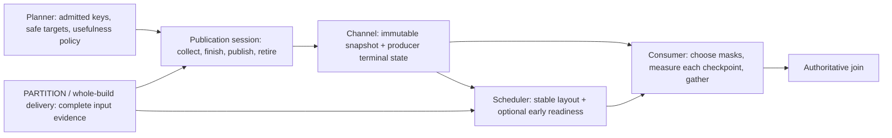

# One lifecycle for complete-build dynamic filters

Status: architecture proposal, not implemented. Design evidence comes from PR head
`codex/pr1277-multi-partition-dynamic-filter` (`7a5d6068`), campaign base `3c55c0bb`,
and optimized integration `opt/integration-df` (`c560b286`). The implementation stack
targets Sirius `origin/dev`, verified at `f35092ff` with cuCascade `e9929fff` on
2026-09-17; the older campaign revisions are reference implementations, not today's
merge base. Recheck these bases when opening each implementation PR.

The evidence inputs are `MANIFEST-sirius.md` and `MANIFEST-cucascade.md` from the
2026-09-15 optimization campaign's `iter3/50-manifest/` artifacts, assembled on
2026-09-17. The [implementation plan](dynamic-filters-implementation-plan.md)
records the PR stack and cross-repository dependency contract.
All six Sirius optimizations are included. cuCascade source changes belong in a
separate `NVIDIA/cuCascade` PR; Sirius's H02 initialization, capability verification,
and dependency revision update belong in Sirius PR 4 and require that library PR
to have landed. Runtime fallback does not replace delivering H02.

## Decision

Keep the implementation's semantic foundation and redesign its ownership and
interfaces. The complete pre-scatter inventory, exact contribution identities,
global Bloom geometry, device-local immutable filters, and conservative planner
admission are sound foundations. Replacing them with a general runtime-predicate
framework would add complexity without improving this feature.

The present organization is not satisfactory as the permanent combined design:
publication authority is a caller-maintained protocol; mutable Bloom construction
and immutable consumption share an interface; the optimization branches add
separate selectors and bookkeeping around the same lifecycle. The coherent design
has three existing responsibilities made deeper: a **publication session** owns
one complete-build attempt; a **channel** owns visible filters and producer
completion; a **consumer** owns snapshot selection, masking, selectivity accounting,
and one survivor gather. Planner policy remains separate from these mechanisms.

| Existing property or proposed optimization | Decision |
| --- | --- |
| Exact pre-scatter build IDs; task provenance survives clones/retries | Retain |
| Planner key admission, safe lineage, scan and join-edge endpoints | Retain |
| One-shot exact list/hash list/Bloom; accumulated Bloom only | Retain |
| Complete replicas before visibility; safe independently complete subsets | Retain |
| Public claim/reopen/fail/publish protocol | Encapsulate within the session |
| Public accumulator and mutable published Bloom | Make builder/accumulation private to publication |
| Anonymous producer counters; several independently acquired snapshots | Identified completion rights and one coherent channel snapshot |
| Filtering a cached view, followed by one gather | Adopt through the shared consumer |
| Fused membership-mask kernel | Adopt as the consumer's internal execution strategy |
| Chunk-major reduction and replication | Adopt as an internal publication strategy with serial fallback |
| Pinned-domain evidence | Adopt as copied usefulness evidence, never join-correctness evidence |
| Earlier probe activation | Adopt as an optional scheduling opportunity with existing progress path |
| H02 pool grants and cuCascade APIs | Deliver Sirius initialization and verified capability in PR 4, consuming a separately merged cuCascade PR |

This is deliberately not a rewrite of the join, scheduler, memory manager, or scan
connector interfaces. There is no background publication service, per-filter
future on the scan path, general version registry, or atomic fan-out across every
channel.

## What the PR actually extends

The PR supports non-broadcast HASH builds with **more than one physical partition**.
PARTITION freezes the complete original input set after its FULL barrier and before
its first repository pop. Each original batch contributes before scatter. It does
not support every possible multi-batch build: for example, a single-partition build
that cannot be delivered whole still has no accumulation path. A spilled input
whose exact rows cannot be summarized at the freeze point safely loses filtering.

The new vocabulary should distinguish the logical complete-build inventory from
physical partition count. The inventory stores original IDs and exact row geometry;
partition count remains an adapter eligibility condition. Initially the same
non-broadcast, greater-than-one HASH gate constructs it. Supporting arbitrary
single-partition multi-batch builds, a different sealing point, or tier-independent
inventory metadata is a separately validated extension, not implicit scope here.

Evidence: `sirius_physical_partition.cpp::try_freeze_complete_build`,
`get_next_task_input_data`, and `execute`; `complete_build_snapshot::try_create`;
`pipelineable_operator_data::task_input_batch_id`. The existing snapshot constructor
checks structural validity; the FULL barrier and destructive-pop exclusion supply
the actual completeness proof.

## Boundaries and ownership



| Owner | Owns | Must not own |
| --- | --- | --- |
| Planner and existing publish plan | Key semantics, ordinal remapping, target registration, admitted GPUs, copied domain evidence, usefulness policy | CUDA event graphs, chunk sizes, membership device references |
| Hash join's publication session | Publication authority, exact inventory ledger, private builders, terminal outcome, producer completion rights | Probe operator internals, scheduling policy |
| Channel for one endpoint | Immutable filter references, fixed producer registrations, terminal flags, coherent snapshots | Build completion proof, GPU construction, task scheduling |
| Existing scan/endpoint consumer | One shared gate, snapshot selection, applied-entry receipts, local mask execution, materialization | Construction state, blocking for publication |
| PARTITION and scheduler | Stable build layout and task provenance; progress and memory admission | Bloom representation or filter selectivity decisions |

Use value-owned immutable plan metadata. The session may share its private operation
state with already-running contributions so cancellation cannot destroy their
storage. Share immutable filter storage because channels and concurrent GPU reads
have real shared ownership. Do not introduce shared ownership merely to avoid
deciding who owns an ordinary configuration value.

## Semantic envelope

Preserve the existing admission and lineage tests as the executable specification.
Do not reinterpret physical condition-array indexes as planner condition indexes.
Build-column ordinal, probe-entry ordinal, target-output ordinal, and base scan
ordinal are separate coordinates; translation happens once at their existing
planner boundary.

For membership, retain supported INT32/INT64 equality keys. Direct endpoints retain
the existing INNER/SEMI, direct-reference, exact-storage-type restrictions. Scan
placement retains its existing join-type and lineage allowlists; no additional
outer, anti, mark, null-safe, cast, or computed-key cases become eligible because a
new kernel can load their storage. Unsupported shapes pass through to the join.

For admitted ordinary equality, null build keys contribute no members and null
probe keys cannot match. A nullable Bloom build must insert every non-null key.
Raw and hash lists retain their existing eligibility; reserved hash-set sentinels
conservatively pass. Independently filtering several equality keys is a necessary
condition, not a claim that their Cartesian product describes valid build tuples.
The exact join evaluates all predicates and remains authoritative.

One-shot zone maps retain their current supported non-floating-point semantics and
scan-only delivery. NaN-sensitive range filtering stays excluded. Accumulation
remains Bloom-only; multi-batch exact-set construction and min/max aggregation are
not added to make the lifecycle look uniform.

Narrow probe carriers may be read in place only when the scan's existing compression
contract proves value-preserving signed widening to the admitted logical INT32 or
INT64 type, with no offset or scale transformation. Matching physical widths alone
is insufficient. An unsupported carrier takes the normalized fallback path.

## Complete-build publication

### An owned input contract

Keep a move-only inventory, obtained only from the build-input adapter while the
FULL source barrier is complete and the repository's first-pop lock is held. Store
the unique original batch IDs and their exact row counts, plus their checked sum.
Per-ID counts make a replay with changed contents easier to reject; global count
must not be inferred from partition slices or from the number of contributions.
The adapter cannot assert completeness merely by constructing a vector of IDs.

Preserve original contribution identity across cross-GPU materialization and OOM
retry. A clone's storage ID is not a new build contribution. The session validates
the original ID, expected rows, admitted device, schema, and all active key types
before inserting into any partial.

Use one private ledger keyed by expected ID, with pending/in-flight/complete states.
A completed replay is a no-op; an in-flight replay does not count and must not
compete with its owner's completion. An unknown ID or invalid contribution disables
this optional publication. The insert-owning attempt either completes after GPU
completion or terminates the session; its failure cannot leave an unowned in-flight
entry. Bloom insertion's mathematical idempotence is not a substitute for identity
accounting.

An empty original batch can contribute zero rows. An empty inventory is distinct:
when the adapter cannot supply an inventory, finish without a filter. A proven
empty build may also finish without a filter; this scope does not require a new
reject-all representation. Missing input at join finalization terminates the
optional publication, never publishes the union of only the observed inputs.

### One session, private construction strategies

Expose a small session contract. The declarations below describe responsibilities;
they are not an implementation patch or a second proposed framework:

```cpp
class dynamic_filter_publication_session final {
 public:
  void begin(complete_build_snapshot inventory);
  void contribute(build_batch_input const& input, task_execution_context& task);
  void observe_whole_build(complete_build_delivery const& delivery,
                           task_execution_context& task);
  void finish_input() noexcept;
};
```

`build_batch_input` supplies original identity and a pinned, ready table for the
duration of the call. `complete_build_delivery` is an adapter-provided description
of a logically whole delivery, not an arbitrary `table_view` with a boolean. The
whole-build method owns claim acquisition, source pin/readiness validation, and
claim release. An unusable broadcast delivery reopens eligibility for a sibling
inside the method; callers cannot consume another delivery's claim. An internal
move-only attempt guard provides rollback before any GPU submission.
Call this whole-build operation before depositing/routing the delivery downstream:
that routing can synchronously finalize the join. Moving the claim or source pin
after the deposit is not equivalent. Keeping the entire operation before deposit
also avoids exposing a claim token merely to bridge the routing callback.

The session owns exactly one outer lifecycle:

| State | Accepted work | Exit |
| --- | --- | --- |
| Open | Eligible whole delivery, or one complete inventory | Collecting, publishing, or terminal |
| Collecting | Exact original contributions | Publishing when every contribution completed; otherwise terminal skip/failure |
| Publishing | One elected finisher; no new construction authority | Terminal after visibility is fixed and submitted work is safely retired |
| Terminal | Observation/replays only | None |

Terminal outcome distinguishes published, skipped with reason, and optional failure;
it does not mean that a filter necessarily exists. Statistics fold once from this
transition. Preserve counting of whole-delivery attempts, including an unusable
delivery that returns its claim. With no active keys after policy, resolve without
GPU work, but preserve the current inert accumulator's exact-ID completion and
completion-journal behavior: it still validates and counts the expected inputs
before terminal no-filter. It performs no CUDA synchronization. Drained targets
can terminate collection early without claiming that all original IDs contributed.
Report actual completed count separately from successful
complete-build publication.

The existing accumulator becomes private implementation of Collecting; do not keep
two independently authoritative terminal state machines. Concurrent calls retain
the operation state until return. `finish_input()` seals unresolved input and
prevents new publication attempts, but does not free memory still used by an in-flight
insertion. Closing during Publishing arbitrates under the same session state: the
winning owner fixes visibility, and cleanup/completion happens exactly once.
In particular, `finish_input()` records input closure under the session lock even
while a whole-build owner is active. If that owner's delivery proves unusable, it
may reopen Open only when input remains open; after closure it must terminate with
no filter. Otherwise the last unusable broadcast delivery could reopen a session
after its sole finalization notification and strand the producer forever.

`finish_input()` is a nonthrowing host-side close request, not a synchronous CUDA
teardown routine. An active Publishing owner retains terminal responsibility and
its resources; closure cannot announce terminal while that owner can still push.
For already-accepted complete input it either finishes publication or safely fails
it. Query cancellation prevents an owner that has not begun fan-out from beginning
it; any complete subset already exposed stays valid. The owner reports execution
errors through the existing task/query error path before retiring resources. The
`noexcept` close API does not swallow CUDA failures or declare their work complete.

### Immutable output, bounded memory

Separate mutable `bloom_builder` storage from the immutable filter interface.
Consumers must not see `add`, `merge`, scratch management, or replication mutators.
All per-device partials for a key use the same hash semantics, seed, block count,
and geometry derived from the sealed **global** row count. Reduction computes the
bitwise OR of these partials. Only a builder whose contributions and transport have
completed can produce a published immutable filter.

Keep the final contributing task's device as root: it already owns the relevant
task reservation and stream/device pairing. Selecting a different root for topology
reasons would require a separate reservation/scheduling change and is not part of
this design.

Preserve the public Bloom cap's existing meaning: sum of aligned Bloom bit arrays
for all accumulated keys on each GPU, not multiplied by replica count and not a
bound on total transient memory. Separately estimate actual publication peak and
obtain incremental workspace headroom before choosing the transport strategy. This
estimate includes source
partials, destination replicas that coexist with them, root scratch, null
compaction, transfer staging, and control allocations. In the pipelined strategy a
non-root device can temporarily hold both partial and replica; root scratch is
`2 * source_count * chunk_bytes`. The cap must not be presented as covering these
extra bytes.

Charge partial allocation and null-compaction workspace when each contribution
allocates them, through its existing task/device reservation contract. Persistent
partials remain allocator-accounted after the contributing task returns. At final
publication, include their live bytes in the peak calculation but do not reserve
them a second time. The final contributor's root already has an attached task
reservation: its estimator must admit the incremental root scratch/output headroom
before allocation, or use the memory manager's supported reservation growth. Never
attach a second nested root reservation to that host thread. Remote destination
workspace uses explicit device-scoped reservations/leases; retain allocations and
their accounting until the last GPU use. If root growth is unavailable or denied,
choose a fitting serial path or skip filtering, without inventing a new reservation
API or moving the reduction to an unreserved root.

If temporary reservations do not fit, select the serial strategy before it starts;
if that also cannot fit, skip this optional publication. Multi-device reservation
acquisition must be nonblocking with rollback of newly obtained reservations on
failure; do not hold GPU A's optional capacity while waiting indefinitely for GPU B.
The existing query/task memory manager remains the authority for admission.

### Serial and chunk-major publication share one contract

Retain serial reduction/replication as the baseline. For accumulated filters, every
required replica of every active key must be ready before fan-out begins, matching
the PR's strict behavior. One-shot publication keeps its existing best-effort
target-local replica behavior. This difference is a delivery requirement chosen by
the existing source path; it must not create another lifecycle or a user knob.

For an eligible multi-device publication, the private chunk strategy performs:

1. Copy each source partial's chunk into one root scratch half.
2. OR that chunk into the root filter after all its source copies complete.
3. Copy the completed root chunk to destination replicas while the next chunk is
   being prepared.
4. Complete every replica's final write, then seal and expose immutable filters.

Preallocate one maximum-size pair of scratch halves for all keys in the operation;
this makes `2 * max(source_count * chunk_bytes)` its bounded live scratch footprint.
Do not retain successively larger scratch allocations while budgeting only the
latest one. Two scratch halves allow overlap. Reusing a half waits for its previous OR reader.
Changing the layout between keys (source count, chunk stride, or capacity) waits
for readers of **both** previous halves before reuse. The root's next write must
also respect every outstanding reader of that root region. No source partial,
scratch buffer, destination allocation, stream lease, or event can retire while a
submitted reader/writer still needs it. Allocate required destinations before the
first DMA for that key and preflight the full operation's peak reservation.

An internal host-side strategy can be expressed with a small C++20 concept for
the operations actually required by the reduction driver; use concrete strategy
objects and composition, not a new virtual class hierarchy. CUDA device references
and their binary layout remain in CUDA implementation headers. Expose owned
immutable filter handles to the rest of Sirius, not an `alignas` byte buffer whose
meaning callers must reproduce.

For example, constrain the internal driver by its actual operations, with owning
arguments for asynchronous work and a bounded const-element range for planning:

```cpp
template<class T>
concept publication_transport = requires(T& t, publication_work& work) {
  { t.run(work) } -> std::same_as<publication_result>;
};

template<publication_transport Transport>
publication_result complete_publication(Transport& transport, publication_work& work);

template<std::ranges::input_range Entries>
  requires std::same_as<std::ranges::range_value_t<Entries>, filter_entry>
filter_program plan_application(Entries&& entries, owned_filter_snapshot snapshot);
```

These are internal interface sketches. `publication_work` owns every submitted
resource through completion; `run` has the same completed-or-safely-retired
postcondition for either strategy. `plan_application` consumes the range
immediately and retains only handles backed by its snapshot. A concept checks the
call shape, not GPU ordering or input completeness; those remain documented and
tested semantic requirements. Do not template the whole session or public scan API
just to accommodate these two implementation choices.

Strategy selection is made before mutating the root. On a failure after submission,
retire/drain all involved streams while their owners remain alive, discard the
attempt, and terminate filtering. Do not restart the serial algorithm on a root
whose contents or concurrent readers are uncertain. A future retry would need a
freshly reconstructed valid starting state; no such retry is required here.

### Failure is optional only when execution remains valid

Allocation failure, unsupported representation, missing replica, unavailable
transport, and unusable complete-input evidence can produce terminal no-filter
after safe cleanup. Filter publication is optional; memory ownership and CUDA
execution validity are not. An illegal access, failed completion proof, or uncertain
stream execution state uses the engine's query-failure path. Do not swallow such an
error and continue reusing possibly live buffers.

Use durable device-affine streams for persistent allocation/deallocation ownership.
Task insertion may execute on the task stream, but completion must be established
before marking its ID complete. A task stream must not become the lifetime anchor
of a published filter. No session/coordinator/operator lock is held during a CUDA
wait; a private operation owner and state transition preserve exclusivity instead.
Teardown closes new work, retires accepted work, then releases device resources.

The safety proof is short: every matching non-null key belongs to an expected
original batch; that batch's completed insertion sets the same Bloom bits the
probe will test; OR never clears them; each exposed local replica contains the
finished OR. Failure or unsupported cases yield pass-through. Any independently
complete subset of the filters is therefore safe.

## Channel completion and scheduling

### One coherent observation

Extend the existing channel with plan-time producer registration identified by
join/producer identity. Registration returns a move-only completion right owned by
the session. Freeze registrations before any task can observe completion. Dropping
a target during plan narrowing resolves its registration; construction failure and
query cancellation do likewise. There is no public anonymous terminal increment.

Each registration has one terminal bit. Its owner may push complete filters until
terminal, then close exactly once with published/skip/failure reason. Allocate the
registration and terminal bookkeeping before execution, so closing is allocation
free and `noexcept`. Mark terminal only after the final possible push has finished.
Ordinary push allocation failure may leave an already-visible complete subset;
terminal still resolves, and that subset remains valid.

`snapshot()` acquires the channel's synchronization once and returns owned immutable
entry handles plus the coherent terminal state. It must distinguish:

| Snapshot | Meaning |
| --- | --- |
| Pending, empty | No filter available yet; later filters remain possible |
| Pending, nonempty | Safe completed subset; more may arrive |
| Terminal, empty | No producer can add a filter for this endpoint |
| Terminal, nonempty | Complete final set of independently valid filters |

Do not assemble a logical snapshot from separate `filter_count()`,
`filtered_columns()`, and `filters_for_column()` observations. A monotonically
growing sequence local to this endpoint may accelerate comparisons, but neither a
filter count nor another channel's same-sized snapshot is identity. Returned spans
are `std::span<const entry>` into an owned snapshot and never outlive that owner.
Use C++20 ranges for local selection over those entries; do not retain lazy views
of mutable channel storage across unlocking or asynchronous GPU submission.

### Early activation is an OR, not a new wait edge

Retain the normal deposited-build scheduling condition. The new condition offers
an additional opportunity for BUILD_PROBE probe production:

`normal_build_deposit_ready || (layout_stable && target_producers_terminal && memory_admitted)`

`layout_stable` comes from an explicitly wired build-PARTITION completion source,
not `get_operators()[0]` adjacency. `target_producers_terminal` covers the registered
producers of the endpoint channels relevant to this opportunity, not only the
current join's producer and not merely channels with at least one filter. Empty,
skipped, failed, plan-dropped, and successful producers all resolve completion.
Actual hash probes still wait for their partition's built hash table; early scan
output may buffer while CONCAT/hash-table construction proceeds.

Reevaluate this OR condition on **both** layout completion and last-producer
terminal notification, as well as normal build deposits. Install subscriptions
before execution; registration performs subscribe-and-recheck or equivalent
level-triggered scheduling so the second condition cannot become true between a
check and subscription. Coalesce requests and invoke scheduler notifications only
after releasing channel, session, and operator locks. Notification holds a weak
query/task target; query teardown invalidates it before destroying operators.
Reuse the existing task-request mechanism; do not add a general event bus.
For `begin()` reached while PARTITION's first-pop lock is held, defer any resulting
notification to the adapter's existing post-lock scheduling point. Merely releasing
the session's own mutex is insufficient when the caller still owns an operator lock.

Liveness follows from keeping the normal branch active. If another producer depends
on the not-yet-started probe subtree, the optional early branch stays false; the
ordinary build path still deposits and activates that subtree, which can complete
the producer. An absent completion source or unsupported graph shape simply omits
the early opportunity. No GPU consumer blocks waiting for a channel. Cancellation
resolves registered producers and stops the query through its existing mechanism.

Earlier scan output consumes real memory, particularly when all filters were
skipped. Existing reservation/backpressure checks must include those buffered
probe batches and preserve progress capacity for build deposits. If that admission
cannot be demonstrated, retain the deposited-build schedule for the affected join.
Terminal no-filter is a liveness state, not proof that early work is profitable.

## One consumer program, one gather

Reuse and deepen `dynamic_filter_merge` as the endpoint's consumer. A scan and its
post-scan fallback share the same gate and accounting. The consumer captures a
channel snapshot, maps its entries to the scan's columns, selects only ready local
replicas and supported carriers, and constructs one application program. This
program owns its snapshot/filter references and records the exact selected order.

For a cached parquet split, apply the residual predicate and dynamic membership
masks against the pinned read view before copying full columns. Gather projected
survivors once, then normalize their physical types as required. Reader AST/zone-map
pushdown remains on its established path; membership filtering does not claim to
avoid parquet I/O or decode. Other ingestibles and unsupported carrier shapes use
the same consumer after ordinary materialization. Keep the join-edge endpoint for
plans where no scan can safely consume the key.

The fused strategy compiles supported membership operations into CUDA-local tagged
descriptors that reuse the existing cuco reference types and semantics. It computes
the conjunction with early row exit, writes one final mask, and, when gate sampling
requires it, collects survivor counts after each selected stage. Preserve conditional
marginal keep ratios and order; independently measured whole-column selectivities
are not equivalent. More than the fixed kernel capacity (currently four filters)
uses successive mask rounds and still gathers only once.

Descriptor construction validates type, local replica, alignment, and representation
before any kernel launches or gate updates. Unsupported descriptors use the
existing unfused mask strategy. Do not serialize arbitrary cuco objects through a
public untyped byte array. A fallback chosen before submission has no partial gate
training to undo. Residual-only input gathers directly through the residual mask;
empty and all-keep cases preserve the existing output semantics. One membership
filter with no residual uses its ordinary mask and gather; the gather's survivor
count supplies the ratio even when sampling, so this shape needs no count readback.

### A receipt covers precisely one batch and endpoint

The scan output carries a compact receipt of actual applied entries. An entry's
identity is `(endpoint, immutable filter object, target output ordinal/binding)`:
one filter can bind several columns, so its pointer alone is insufficient. The gate
uses this same entry identity for marginal measurements. Retain the snapshot owners
that keep those identities valid. A filter skipped by the gate or unsupported on
this device is not marked applied. The receipt does not promise that the channel
can never gain another filter.

At the fallback checkpoint, obtain a fresh snapshot and remove only entries already
applied for this batch at this endpoint. Apply newly available eligible entries.
If both receipt and snapshot prove terminal and all entries are applied, the
checkpoint is an immediate bypass.
Pending-empty cannot take that permanent bypass. Receipts must survive the existing
scan-output handoff but are invalid across a different endpoint or a transformation
that changes the represented rows/columns; no global filter version system is needed.

Preserve the current checkpoint-based gate semantics explicitly. If the residual
leaves `N` rows and scan membership leaves `N1`, record each executed entry's
conditional marginal ratio and the checkpoint's combined `N1 / N`. If newly
available entries at the fallback leave `N2`, measure their actual ordered steps on
that checkpoint's `N1` input and record `N2 / N1`. Do not synthesize `N2 / N`, reorder
late arrivals ahead of predicates already executed, or sample the same applied
entry again on that batch. A checkpoint that executes no membership mask records
no membership observation. Record a marginal or combined ratio only when its
entering row count is nonzero; residual or earlier-mask rejection must never create
a `0 / 0` sample. Fused and cascade strategies must agree for the same
checkpoint input, snapshot, and selected order; different publication timing need
not produce the same measurements.

The shared gate retains its existing policy: ACTIVE is terminal; a channel-wide
DISABLED decision applies only to its observed endpoint snapshot and can reopen
when new entries arrive. An established permanently ineffective entry may remain
skipped according to the existing per-entry rule. Those decisions belong to the
gate, not to a receipt that labels an unexecuted predicate as applied. The coherent
snapshot's endpoint-local growth marker replaces separately observed filter counts
for invalidation, without introducing a cross-query generation registry.

The application owns all filter, table-view, and descriptor lifetimes until the
last GPU use. For cached input, an RAII read-use guard records the reader event
before releasing the batch read lock on success **and every exception path after
submission**. If event recording fails, establish safe completion through the
engine's existing synchronization/error path before releasing ownership. A host
`shared_ptr` alone is not a GPU completion proof. Allocation failure may occur
after a mask kernel has already read the view; unwinding must still record/retire
that read.

Reservation estimation derives from the effective program: masks, descriptor and
counter scratch, projection, survivor output upper bound, and any normalization.
It applies whenever in-scan filters are enabled, independently of decompression
pushdown. The integration currently conditions this estimate on the latter setting
in `sirius_gpu_scan_operator_data.cpp`, which is not a sufficient condition.

## Usefulness policy and configuration

Keep source usefulness as a pure host policy evaluated before allocating partials:
supported key, exact build rows, optional copied base-domain evidence, representation
eligibility, and the configured bit-array cap produce an explicit decision/reason.
GPU builders implement the chosen mechanism and do not rediscover planner policy.

For domain coverage, `B / D` represents build-key coverage only when `D` is the
exact domain cardinality of the same source and the build key is known unique
through the preserved lineage. Catalog and pinned evidence are different provenances.
Pinned evidence requires matching the exact file set and source-column mapping;
copy it into the plan while the registry is stable. Unknown/zero domains, duplicate
keys, row-multiplying lineage, mismatched files, and inconsistent `B > D` evidence
disable the gate. Do not substitute `max - min + 1` or a cardinality estimate for an
exact base domain. A bounded source can legitimately contain holes in its key range.

`unique_cols` is a caller-supplied usefulness assertion, not a uniqueness proof for
join execution. An incorrect assertion may cause a filter to be skipped and lose
performance; it must never enable `distinct_hash_join`, remove duplicate handling,
or drop rows. The safety proof of skipping is always pass-through, independent of
the selectivity prediction's quality.

Retain public controls that express user intent: master dynamic-filter enablement,
the multi-partition rollout flag, optional zone-map enablement, existing memory cap,
coverage and keep thresholds, and the existing L2 fraction. No default change is
required for this redesign. Keep coverage's `0.9` default; validate `0.45` explicitly
as the measured four-GPU pinned benchmark profile in PR 5, including off/on oracle
checks and comparison with `0.9`. It is not a new global default without broader
evidence outside that regime.
Preserve existing disable conventions and configuration compatibility.

Do not ship new implementation-choice knobs for scan placement, cascade versus
fused kernel, serial versus pipelined publication, chunk bytes, evidence source,
or probe activation. Make these automatic eligibility/capability decisions and
retain test/benchmark-only ablation controls in one diagnostics structure. Derive
chunk size internally under the reservation bound. Keep `pin_table(unique_cols)`
because it supplies information the engine cannot otherwise infer. If branch-only
selectors have already become supported configuration, deprecate centrally rather
than silently changing their meaning. One defaults/parser/reset source should cover
all retained controls; avoid a new scheduler configuration subsystem for one enum.

## cuCascade dependency and Sirius H02 integration

The separate `NVIDIA/cuCascade` PR provides the reviewed pool-access contract:
discover the allocator's actual pool through a non-owning handle; grant access for
an owner/accessor pair only when the empirical peer-DMA safety checks pass in both
directions; return an explicit result that distinguishes granted, unsupported,
probe-rejected, and CUDA failure. The manifest's `pool_handle()` and
`grant_pool_peer_access(...)` are the reference API, subject to that PR's review.
Keep probing, pool-permission mutation, and library unit tests in cuCascade. Do not
copy those mechanisms into Sirius or import campaign driver-compatibility shims.
The dependency review must preserve actual CUDA error information and distinguish
recoverable capability failures from fatal execution errors. Its first-use empirical
probe can synchronize and affect legacy peer state; run it during initialization
and document current-device restoration. Library tests must own this contract,
including asymmetric probe results and two distinct pools on one device.

Sirius PRs 1–3 compile against current `origin/dev` and its existing cuCascade
revision. **PR 4 is blocked until the cuCascade PR is merged.** It advances the
Sirius submodule to a reviewed merged revision containing the dependency, then
uses the API directly. There is no compile-time feature detection, duplicate grant
implementation, or compatibility branch solely to support a pre-dependency build.
Review the actual dependency diff from `e9929fff`; neither the campaign's `31155d6`
nor its older `1b0e7b6` baseline is an approved target revision.
The dependency review observed cuCascade `origin/main` at `edd15e0b`; its RAPIDS
26.12 stream APIs differ from the campaign sources. Port to the current library
interfaces and review conflicts; the old manifest's conflict-free-rebase expectation
does not apply to that newer base.

In PR 4, `SiriusContext::initialize` requests grants after the memory manager and
GPU pools exist and before queries can submit work. Cover the allocator-owned pools
used for partials, scratch, and replicas, and any device-default pools actually used
by the copy path. Limit requests to the configured active GPU set. A successful
grant on one pool is not proof of access to another pool on the same GPU. Record
results against the allocation domain and owner/accessor direction; make those
results immutable during execution, and clear them before their memory spaces are
destroyed. Pool handles are borrowed and may be null for an unknown upstream;
never carry their identity across context recreation. Preserve the caller's CUDA
device context and handle repeated initialization/termination without stale
capabilities. A typed grant result alone is not an allocator-provenance proof.

Choose the chunk schedule only when the relevant **actual source/destination
allocation domains** have affirmative pool-access evidence and the required
bidirectional peer-DMA safety checks. A bare device-pair probe, a successful copy
call, or a grant on an unrelated default pool is insufficient. Verify grants against
the allocator pools in integration tests, including readable bytes and access flags;
use profiler evidence to confirm the intended direct-copy mechanism on supported
hardware. The capability describes eligibility for this schedule, not a universal
bandwidth guarantee.

At runtime, unsupported topology, probe rejection, unknown allocation domain,
recoverable grant failure, or insufficient workspace select the safe serial
publication path when its transfer contract is established; otherwise optional
filtering is skipped. A failed grant does not prove that an existing permission
is `ProtNone` or that the driver will stage a later copy. Fatal CUDA errors retain
the query-failure behavior already specified above.
These are hardware/resource fallbacks after the dependency is delivered. PR 4 is
not complete merely because every configuration executes the serial fallback: it
must exercise and validate H02 plus chunk publication on supported hardware.

The manifest's prose that disabling H02 automatically selects `root_serial` is not
established by the integration: `sirius_dynamic_bloom_publication_pipeline::supports`
checks `probe_peer_dma_works` in both directions, and the transfer helper labels the
selected `cudaMemcpyPeerAsync` API route as peer DMA without checking actual pool
access. A successful API route can still stage internally. This is a capability
and performance-assumption gap, not evidence of corrupted results; the campaign
reported correct H02-disabled runs.

CUDA documents pool accessibility separately from ordinary peer access, and peer
copies can use host staging. The conservative strategy choice above is an inference
from those contracts, not a claim that every such copy fails. See [CUDA stream-ordered
allocation, memory accessibility](https://docs.nvidia.com/cuda/cuda-programming-guide/04-special-topics/stream-ordered-memory-allocation.html)
and [CUDA multi-GPU peer copies](https://docs.nvidia.com/cuda/cuda-programming-guide/03-advanced/multi-gpu-systems.html).

## Migration and acceptance

Implement these six reviewed Sirius PR cuts, retaining tests throughout. Each PR
includes its own tests, documentation, configuration simplification, and observability
updates; there is no final cleanup-only PR. The files below identify responsibilities,
not a demand for one new class per row.

| PR | Files/responsibility | Completion criterion |
| --- | --- | --- |
| 1. One-shot session and channel contract | `dynamic_filter_publisher.{hpp,cpp}`, hash join, `sirius_dynamic_filter.{hpp,cpp}`, publish plan, planner and existing consumer wiring | Owned whole-delivery protocol; one terminal authority; identified producer completion, frozen registration and coherent snapshots wired end to end; narrowing/cancellation cannot strand producers |
| 2. Multi-partition serial publication | Publisher/private Bloom builder, Bloom CUDA storage, PARTITION, hash join, task-input provenance | Complete pre-scatter inventory and exact retries; immutable published storage; serial strict replication, contribution/workspace reservations and safe GPU retirement; no dependency on PR 4 APIs |
| 3. Shared scan consumer and fused masks | `dynamic_filter_merge.{hpp,cpp}`, parquet ingestible, scan and dynamic-filter operators, `scan_output_operator_data.hpp`, `dynamic_filter_mask_ops.cu` | One gather on cached views, shared receipts/gate accounting, fused and cascade parity, exceptional read retirement and effective-program memory estimates |
| 4. H02 integration and chunk publication | `sirius_context.{hpp,cpp}`, submodule revision, private transport/capability code, Bloom CUDA implementation and publisher | Separate cuCascade PR merged first; actual-pool grants verified; H02 and chunk path exercised; identical serial/pipelined sealing and cleanup contracts, plus runtime fallback coverage |
| 5. Pinned-domain usefulness evidence | `build_key_domain`, key admission, pin/scan registry and pin-table interface | Copied exact source evidence used only for filter usefulness; `unique_cols` cannot become execution uniqueness; global `0.9` retained and measured-profile `0.45` explicitly validated |
| 6. Earlier probe activation | PARTITION completion, hash-join hints, existing task-request/memory-admission wiring | Stable-layout and producer-terminal notifications both wired; normal deposited-build progress retained; cancellation, transitive producers and buffered-probe pressure validated |

PRs 1–3 form a mergeable prefix on today's `origin/dev`. PR 4 follows PR 3 and the
separate cuCascade merge; PRs 5 and 6 complete the planned Sirius sequence. The
separate library PR can proceed in parallel with PRs 1–3. Record its merged revision
and cross-repository dependency in PR 4 before merging, rather than targeting an
unmerged campaign branch.

In PR 1 retain small adapters where they establish complete delivery or hold the
required lock, and remove wrappers that merely forward claim/reopen/fail calls.
PR 2 owns private builder extraction and preserves global Bloom geometry/hashing;
PR 4 changes transport, not that membership contract. Each owning PR removes its
branch-only mechanism selectors and duplicated bookkeeping. Exclude environment
driver shims, unrelated general optimization branches, and the parked background
publisher. The reviewed cuCascade revision update in PR 4 is required.

| Required validation | Evidence to establish |
| --- | --- |
| Inventory/contributions | Every batch order; one/many devices; zero-row batches; exact IDs/counts; unknown IDs; in-flight duplicate; clone and OOM replay; missing input; spilled-at-freeze skip |
| Publication races | Last contribution versus finalize/cancel/drain; unusable broadcast source versus usable sibling; failed construction; zero active keys; exactly one outcome and producer terminal |
| Membership semantics | Existing admission/lineage suites; nullable and all-null builds/probes; empty build; reserved sentinels; extrema; multiple keys; unsupported/null-safe joins; narrow-carrier widening |
| H02/capability | Library API/unit tests in the separate cuCascade PR; actual allocator/default-pool distinction, bidirectional probe rejection, grant failure, active GPU subsets, readable copied bytes, access flags, repeated init/terminate; profiler confirmation of the direct path |
| GPU publication | Serial versus chunk result-bit equivalence; uneven chunks; two keys with changing scratch layouts; one GPU/no-peer path; reservation failure before/after enqueue; strict replica failure; stream destruction and resource release order |
| Scan execution | Residual only, no filter, all keep, all reject; more than four filters; unsupported descriptor; exact marginal counts; pending-empty then late filter; different equal-sized snapshots; no repeated training; cached-view unwind after submitted work |
| Scheduler | Real wired build/CONCAT/probe graph; both notification orders; last producer unrelated to current join; producer in probe subtree; all producers skip; narrowing; teardown; buffered-probe pressure cannot prevent build progress |
| Memory/configuration | Actual peak bounded by reservations, including non-root overlap and masks without decompression pushdown; PRs 1–3 on current cuCascade, PR 4 on the merged dependency; centralized defaults/reset and disable behavior |

Run the focused existing Catch2 suites, result-oracle integration for forced
multi-partition and dynamic filters off/on, then repository-required build/test and
format checks for the eventual implementation. Fault injection must cover submitted
GPU work, not only failures before allocation. No production implementation or tests
were run as part of this architecture-only change.

Measure the completed six-PR Sirius stack with its merged cuCascade dependency:
one/multiple GPUs,
pinned/native/unpinned scans, useful/unhelpful filters, direct-capable/unknown
transport, and pressure that forces the serial or no-filter path. Record scan bytes
copied, gather/kernel counts, publication critical path, allocation peak, and
end-to-end latency. The manifest's `814.2 -> 595.0 ms` aggregate (seven selected
SF100 queries, four L40S GPUs, hot pinned runs) includes H02/cuCascade effects.
It motivates these mechanisms; it is not a prediction for the redesigned stack.
Revalidate all six optimizations and their interactions on the new bases, including
H02 rather than substituting a serial-only result. The manifest reports focused tests
and oracle certification, not a completed full repository test/lint run.

## Design sources and reading receipt

The architect personally read its configured `architect.toml` role definition,
the repository instructions, relevant Super Sirius architecture/dynamic-filter,
pipeline/data/multi-GPU documentation, selected current/integration implementation,
and the design portions of the manifest. A parallel manifest review covered all
2,618 lines; a separate architecture trace checked current producer, consumer,
provenance, and test contracts. These inputs informed, rather than dictated, the
boundaries above.

The following are **substantial selected excerpts, not claims to have read each
entire book**. Page numbers are one-based PDF pages to make the receipt reproducible:

| Book read from local PDF | Sections consulted | Concrete influence |
| --- | --- | --- |
| *A Philosophy of Software Design*, John Ousterhout, first edition (2018) | Chapters 4–5, PDF pp. 31–49; chapters 7–8, pp. 56–68; chapter 20 excerpts, pp. 166–173 | Deepen the session instead of layering claim wrappers; group build/reduce/retirement knowledge together; eliminate mechanism knobs; organize scan work around one gather |
| *C++ Software Design*, Klaus Iglberger, first edition (2022), December 2023 release | Guideline 2 excerpts, PDF pp. 31–44; Guideline 7, pp. 72–76; Guideline 9, pp. 82–94; policy-based design/Guideline 20, pp. 179–185; value-semantics excerpts, pp. 202–206 | Owner-defined boundaries, composition over new inheritance, value-owned evidence, move-only publication authority, private strategy substitution |
| *C++20 — The Complete Guide*, Nicolai Josuttis, December 2021 version | Concepts/semantic constraints, PDF pp. 97–112; borrowed ranges, constness and range adapters, pp. 174–197; span design/lifetimes, pp. 261–266 | Concepts cannot prove semantic completeness; explicit runtime invariants remain necessary; use ranges locally and const-element spans tied to owned snapshots |

Reference implementation lessons are deliberately narrower than their architectures:

- **DuckDB:** the local `duckdb/src/execution/operator/join/physical_hash_join.cpp`
  accumulates local min/max state, combines globally, and defers Bloom visibility
  until finalization; `join_filter_pushdown_optimizer.cpp` controls safe targets.
  Preserve that separation and complete-before-visible rule. Sirius's pre-scatter
  exact identities and GPU retirement cannot be replaced by DuckDB's CPU sink model.
- **DataFusion:** its [SharedBuildAccumulator](https://github.com/apache/datafusion/blob/main/datafusion/physical-plan/src/joins/hash_join/shared_bounds.rs)
  coordinates partition reports and a single finalizer, distinguishing pending,
  reported, and canceled-unknown input. This reinforces explicit completeness and
  terminal outcomes. Its waiting and partition-routed hash-map predicates do not
  justify a blocking Sirius scan or exposing a device-bound join hash table.
- **Velox:** [HashProbe](https://github.com/facebookincubator/velox/blob/main/velox/exec/HashProbe.cpp)
  excludes dynamic filtering when remaining spilled build data makes the current
  table incomplete; its [join documentation](https://facebookincubator.github.io/velox/develop/joins.html)
  explains accepted-column lineage. Adopt conservative admission and completeness.
  Do not adopt join elimination or CPU shared-table access: Sirius retains an
  authoritative join and device-local filter replicas.

The resulting design retains the algorithms that the PR already proves, places
their sequencing and lifetime obligations with one owner, and incorporates the
manifest's useful mechanisms without turning experimental switches into architecture.
