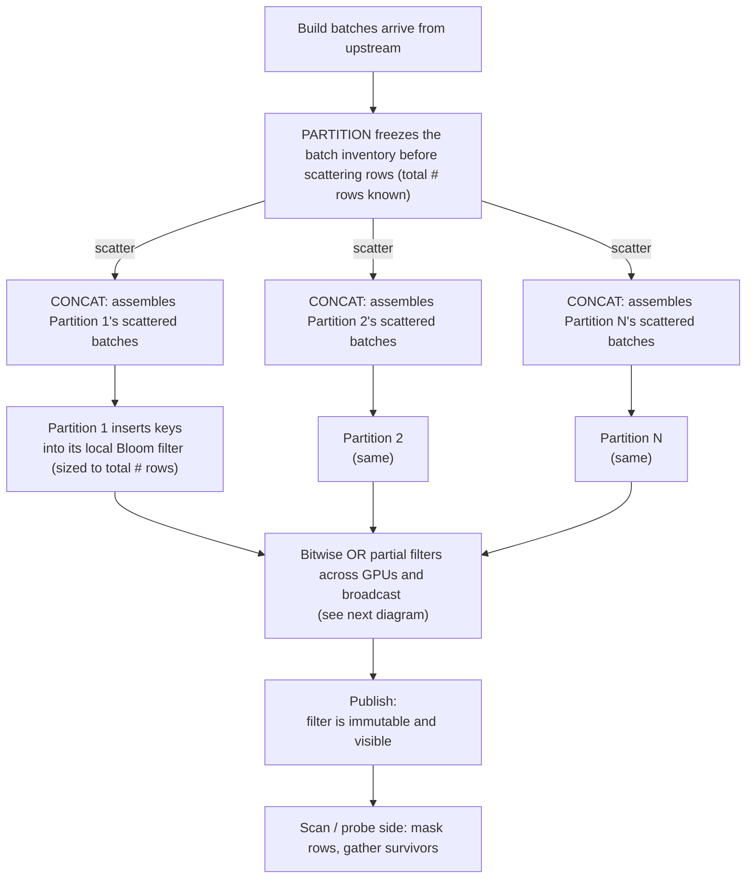
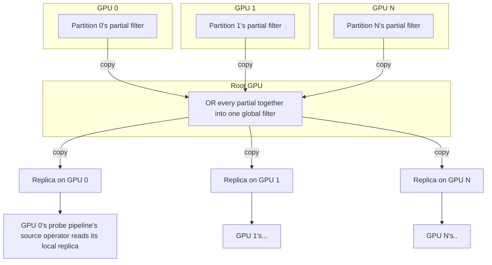
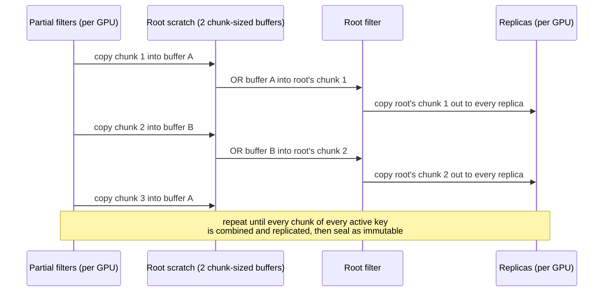
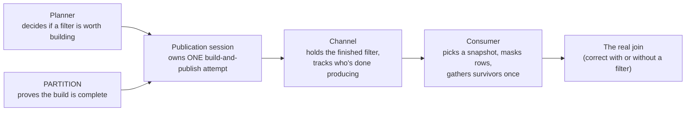

# Dynamic Filters for Multi-partition Hash Joins

This document describes the design for dynamic filters for multi-partition hash joins. It will be implemented in 6 PRs (see "Landing this" at the bottom). Detailed evidence, exact commit hashes, and the PR-by-PR contract live in the [implementation plan](dynamic-filters-implementation-plan.md). The final PR will harden this document into a finalized design reflecting the delivered implementation (which may evolve over review, perf adjustments, etc.).

## The Core Mechanism

PARTITION counts the total number of rows flowing into the hash table build. This allows us to size the filter so that partial filters can be bitwise ORed together to produce a coherent single, global filter. As partitioned batches become available through CONCAT, those batches insert their keys into a local, partial filter. The per-GPU partial filters are combined into a global filter and broadcast out to every GPU that needs it (see "Combining Filters" below).

## Combining Filters Across GPUs and Broadcasting the Result

There are up to N different partial filters sitting on N different GPUs. They must be **combined** into one filter that reflects the whole build side, and that one global filter needs to be **copied back out** to every GPU whose probe pipeline source will apply it. Below, the **Root GPU** is the GPU whose PARTITION operator completed last.

As an empricially verified optimizaiton, the actual copy-in/OR/copy-out work is pipelined in fixed-size chunks over two reusable scratch buffers, so peak transient memory stays bounded no matter how many GPUs or how big the filter is:

Buffer A and B alternate so that a chunk's copy-in can be issued concurrently with the previous chunk's copy-out. This pipelined strategy is chosen over a simpler serial baseline (copy one partial in, OR it, copy the result out, repeat — no overlap) that's used as a fallback when double-buffered scratch can't be reserved or fast GPU-to-GPU copies aren't available. Whether that fast copy path exists at all is itself gated by the cuCascade dependency (see below).

## Redesign: 3 Owners Instead of 1 Tangled Object

Currently, one object plays both "mutable thing being built" and "immutable thing being read," and "who's allowed to finish this filter" is a convention callers have to follow by hand. Later optimizations discovered in the optimization campaign (chunked GPU copies, a fused masking kernel, early scheduling, extra usefulness stats) had to bolt its own flag and bookkeeping onto that same semanticlaly confused core.

| Today (tangled) | Redesign (three pieces) |
| --- | --- |
| One filter object is both the mutable builder *and* the immutable published result | Builder is private inside the session; only a finished immutable filter is ever exposed |
| "Who may finish / fail / retry this filter" is an unenforced convention | The session is an explicit state machine: Open → Collecting → Publishing → Terminal |
| Producer completion tracked by anonymous counters — different readers can see different, disagreeing states | The channel tracks named producers; one `snapshot()` call always returns a single coherent view |
| Each optimization bolts its own selector flag/bookkeeping onto the shared core | Each optimization becomes a private implementation detail of the session or consumer — no new public surface |

**Publication session** — owns exactly one build-and-publish attempt for one join. Runs the mechanism above internally (freeze → contribute → combine → publish or skip). Everything mutable — the Bloom builder, the ledger, the combine strategy — lives privately inside it.

**Channel** — holds the finished, immutable filter for one join endpoint, plus whether every producer that could still add to it is done. Registrations are identified, not anonymous, so a snapshot can never be an inconsistent mix of half-updated state.

**Consumer** — lives on the scan/probe side. Takes one channel snapshot, builds a single mask-and-gather plan from it, applies it (fused kernel where supported, a fallback path otherwise), and gathers surviving rows exactly once. Records a receipt of what it applied so a later checkpoint doesn't reapply or re-measure the same filter.

## Other

### Getting the scan side started early (optional)

Normally the probe side waits until the build side finishes before doing any work. This design adds an *optional* extra condition: if the build's partition layout is locked in, every filter producer for that scan has finished, and there's spare memory to buffer the output, the scan can start reading and filtering early — buffering its output until the real hash table is ready. The actual join probe still waits for the real hash table; this only gives the scan a head start. It's purely additive: if the extra condition never fires, scheduling behaves exactly as it does today.

### The cuCascade dependency (H02)

CUDA peer access (the device-level "can GPU A see GPU B's memory", via `cudaDeviceEnablePeerAccess()`) is not the same as pool access (can GPU A DMA directly into the *specific RMM pool* GPU B allocated from — Sirius allocates from pools, not raw CUDA memory). Even a successful `cudaMemcpyPeerAsync` call doesn't prove real pool-to-pool DMA happened; the driver can silently stage it through host memory instead (and not the pool you want!). So the fast path needs an empirical, bidirectional probe of the actual pools involved, not just an API call that didn't error. This capability must land in cuCascade. Once merged, Sirius requests and caches grants once at startup (`SiriusContext::initialize`) for the pools filters actually use, on the active GPU set; only a pool pair that comes back "granted" uses the fast chunked-copy path. Until that PR merges, Sirius always uses the safe (slower) serial copy path. Wiring up the fast path is its own PR (#4 below), blocked on that dependency merging.

## The PARTITION Total Row Count

To reduce the block between PARTITION's capture of the total row count and Bloom filter construction, something like PR 1765, which uses runtime estimation to size GROUP BY partitions, should be evaluated. Deferring to PR 6, as it is perf-exploratory by nature anyway.

### Landing this: six PRs

1. Session + channel core (single build, no multi-partition support yet)
2. Multi-partition build → serial publication
3. Shared scan consumer + fused masking kernel
4. Fast GPU-to-GPU copy path (needs cuCascade merged first)
5. Smarter "is this filter worth it" heuristics
6. Optional early probe-side start, and runtime row count estimation.

PRs 1–3 can merge against `dev` today. PR 4 is blocked on the separate cuCascade PR merging. PRs 5 and 6 follow. Each PR ships its own tests, docs, and config cleanup — there's no separate cleanup-only PR at the end.
