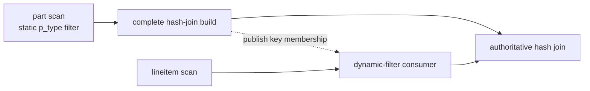
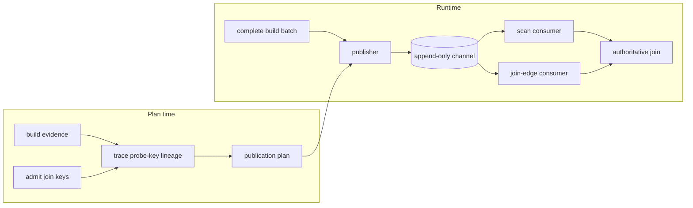

# Dynamic Filters

A **dynamic filter** is a runtime predicate built by one operator and applied by another to avoid work. Sirius currently builds filters from an eligible hash join's complete build side and applies them to:

- a GPU scan reached through the join's probe subtree; or
- a join-edge endpoint placed inside that subtree when no scan can consume the key safely.

The implemented filter kinds are a raw IN-list, a hash IN-list (both exact for integer, temporal, and decimal keys, no false negatives for string keys), a Bloom filter, and an optional global min/max zone map. Membership filtering is enabled by `enable_dynamic_filter`; zone maps are separately opt-in.

Dynamic filters are optional for result correctness. They keep every row that could match the producing join, and the exact join remains authoritative. A missing, late, policy-gated, or device-unavailable filter therefore passes rows through safely.

## Example

Consider a plan that builds a hash join from the filtered `part` relation:

```sql
SELECT l.l_orderkey
FROM lineitem AS l
JOIN part AS p ON l.l_partkey = p.p_partkey
WHERE p.p_type = 'PROMO BRUSHED COPPER';
```

Once the complete `part` build is available, Sirius can publish its `p_partkey` values as a membership filter on `l_partkey`. Rows rejected at the scan or join-edge endpoint would have been rejected by the hash join anyway.



## Architecture



The main components are:

- **Evidence and key admission.** `build_subtree_is_filtering` and `build_relation_is_opaque` decide whether discovery should run. `admit_dynamic_filter_keys` accepts supported equality keys and records the build/probe metadata needed at runtime.
- **Target discovery.** `trace_probe_key` follows a key through physical operators only while its value and row semantics remain safe. A reachable GPU scan wins; otherwise `place_endpoint` may insert a membership-only `sirius_physical_dynamic_filter` at the deepest safe point. Unknown or unsafe transformations stop descent.
- **Publication plan.** `dynamic_filter_publish_plan` binds admitted build keys to target channels and target output ordinals, carries filter policy, and identifies the admitted GPU/HOST replica spaces.
- **Channel.** `sirius_dynamic_filter_set` is a thread-safe, append-only channel shared by producers and one logical consumer endpoint. It is not a readiness barrier.

The probe key's entry ordinal and a target's output ordinal are different coordinate spaces. The discovery walk performs that translation; channel push, storage, and lookup all use the target output ordinal.

## Publication and consumption

1. Only a delivery containing the complete build can claim publication. At most one usable delivery constructs and publishes filters; an unusable broadcast delivery can release its claim so a sibling can try. Single-partition and broadcast builds can satisfy the complete-build requirement, but a slice of a hash-partitioned build cannot.
2. The winning build delivery pins the build representation, constructs the selected filters, and creates device-local replicas on admitted probe GPUs.
3. A filter becomes visible only after all of its usable replicas are ready. The publisher then appends it to each accepting target channel. Multi-filter fan-out is not atomic, so a racing consumer may observe any independently complete subset.
4. Consumers take fresh per-column snapshots at their application checkpoint. They never wait for publication.

An `rmm::out_of_memory` during source-filter construction is logged and ends the optional publication attempt without failing the query. A reservation, construction, or transfer failure for one target GPU omits that replica, and consumers on that GPU skip that filter. Unexpected failures outside target-local replication still propagate.

DuckDB static filters remain on their existing, authoritative path. Dynamic filters add redundant conjuncts through these consumer paths:

| Consumer | Zone map | Membership filter |
|---|---|---|
| Parquet scan | Reader AST via `reader_options::set_filter`; may prune row groups and rows during decode | Post-decode mask |
| DuckDB-native scan | Post-decode AST row mask | Post-decode mask |
| Join-edge endpoint | Not used | Post-decode mask |

Membership filtering reduces downstream work but does not avoid scan I/O or decoding. The post-decode `dynamic_filter_gate` measures combined usefulness and can disable ineffective filtering; it also stops individual membership filters whose marginal keep ratio is weak.

## Filter selection

The publisher emits at most one membership representation per admitted key and may additionally emit a zone map:

| Representation | Selection | Behavior |
|---|---|---|
| Raw IN-list | 1–12 valid (non-null) build rows of a supported key type (see "Key types") | Linear membership probe: exact for integer, temporal, and decimal keys, no false negatives for string keys (64-bit fingerprints are compared, not bytes) |
| Hash IN-list | Keys of a supported type whose estimated set fits the configured fraction of the smallest probe-GPU L2 | Exact for represented integer, temporal, and decimal keys, no false negatives for string keys; the reserved sentinel value (`min` for signed, `max` for unsigned reps and string fingerprints) conservatively passes |
| Bloom | Keys of a supported type when the hash IN-list is not selected | Approximate membership with no false negatives |
| Zone map | `enable_dynamic_zone_map_filter=true` and a supported non-floating-point key type | One global build-key `[min,max]` range |

All three membership representations compact null build keys out before building and size the representation on the valid rows (see "Nulls" below).

If no probe-GPU L2 size is available, the hash IN-list is not selected; the publisher uses Bloom when supported. Two additional gates avoid unproductive work:

- The domain-coverage gate skips the key before either filter is built when a proven-unique native build key covers at least `dynamic_filter_domain_coverage_threshold` of its known base-table domain.
- The consumer keep-ratio gate disables ineffective post-decode filtering when a measured batch retains more than `dynamic_filter_keep_threshold` of its rows.

### Key types

Membership filters accept the integer, temporal, fixed-point, and string key types below; every other build type (floating-point, duration, nested) is declined by all three and the key publishes nothing. The type gate is one predicate, `membership_key_supported` (`src/op/dynamic_filter/dynamic_filter_key_domain.hpp`), shared by the three filters' `supports()`, the publisher, the publish-plan validator, and the planner's join-edge gate.

Each supported type is classified into a *key domain*: a **rep** (the device element type the set, Bloom, or needle buffer is instantiated over) and a **family** (which probe carriers are comparable to the stored keys):

| Build key type | Rep | Family | Accepted probe carriers |
|---|---|---|---|
| `INT8`, `INT16`, `INT32` | `int32` | signed | `INT8`..`INT64` |
| `INT64` | `int64` | signed | `INT8`..`INT64` |
| `UINT8`, `UINT16`, `UINT32` | `uint32` | unsigned | `UINT8`..`UINT64` |
| `UINT64` | `uint64` | unsigned | `UINT8`..`UINT64` |
| `TIMESTAMP_DAYS` (`DATE`) | `int32` | date_days | `TIMESTAMP_DAYS`, `INT8`, `INT16`, `INT32` |
| `TIMESTAMP_SECONDS` .. `TIMESTAMP_NANOSECONDS` | `int64` | timestamp | the same unit only |
| `DECIMAL32(s)` | `int32` | decimal | `DECIMAL32`/`64`/`128` at scale `s` |
| `DECIMAL64(s)` | `int64` | decimal | `DECIMAL32`/`64`/`128` at scale `s` |
| `DECIMAL128(s)`, unscaled values within int64 | `int64` | decimal | `DECIMAL32`/`64`/`128` at scale `s` |
| `STRING` | `uint64` (XXHash_64 fingerprint) | string_hash | `STRING` |

The rep is the narrowest listed type that holds the *build column as it arrives*. A build column that compressed materialization narrowed (an `INTEGER` key stored as `INT16`, or a `DECIMAL(15,2)` key stored as `DECIMAL32` at the same scale, say) therefore builds a 32-bit set at the carrier — the publisher accepts any build carrier that restores losslessly to the plan's recorded storage type instead of counting it as `keys_skipped_type_mismatch` — and each build value widens per element on insert, so no widened build copy is made either. `estimated_set_bytes` sizes slots at the rep, not the carrier.

Temporal keys are integers on the device: cudf stores `TIMESTAMP_DAYS` as int32 epoch days and the other timestamp units as int64 ticks (`membership_storage_type`), so the temporal families reuse the signed integral adapters and add no kernel instantiations; the family only decides which probe types are comparable. A `DATE` probe may arrive native (post-decode cascade) or at the `INT8`/`INT16` carrier a pinned chunk stored it in (fused decode re-tags the decoded column with the stored type; see [compressed-materialization.md](compressed-materialization.md)), and both are the same epoch-day integers. Mixed timestamp units are a planner cast, which blocks the key upstream, so the `timestamp` family declines any other unit rather than converting. The one asymmetry is on the build side: a `DATE` build column arriving at an `INT8`/`INT16` carrier is restored to `TIMESTAMP_DAYS` by the publisher before the filters are built, because the filters classify on the column alone and a carrier-typed set would land in the signed-integer family and decline the native `TIMESTAMP_DAYS` probe. The restore costs one small cast and no set width (`DATE`'s rep is int32 either way), and it keeps the zone map's build type equal to the native probe type.

Decimal keys are compared by their unscaled integer storage, so a probe is comparable only at the key's cudf scale; a different scale declines (`membership_probe_compatible` is false), which is unreachable in practice because DuckDB inserts a cast for any scale disagreement and a cast blocks the scan route. `DECIMAL128` has no 16-byte rep (cuco's `static_set` caps keys at 8 bytes), so it is classified onto `int64` *provisionally*: the publisher runs one min/max reduction over the build column (`membership_build_fits_rep`) and, when any unscaled value lies outside int64, declines all three membership filters for that key while the zone map, which is exact at `DECIMAL128`, still publishes. The filters' constructors re-check and throw rather than truncate. This is the route TPC-H q15 takes (`total_revenue = max(total_revenue)`, a `DECIMAL128` join-edge key); q2's `ps_supplycost = min(ps_supplycost)` is a `DECIMAL64` scan-route key.

Integer, temporal, and decimal reps hold the key values themselves. The string family holds a 64-bit `XXHash_64` fingerprint per key instead: no cuco set can hold a variable-length, non-bitwise-comparable key, so the build column is hashed once with `cudf::hashing::xxhash_64` (seed `cudf::DEFAULT_HASH_SEED`, the string's UTF-8 bytes as the hashed view) and each probe string is fingerprinted in-kernel with the same `XXHash_64<cudf::string_view>` over a `column_device_view` — no hashed copy of the probe column. The consequence is a semantic relabel, not a correctness change: for strings every membership filter, including both IN-lists, is *no false negatives* rather than exact (two distinct strings sharing a fingerprint pass a row the authoritative join drops; the expected excess is about n·2^-64 rows per probe). Nothing downstream treats a membership mask as exact — masks are only ever ANDed into a keep mask and the join stays authoritative — so no consumer changes. A string whose fingerprint equals the `UINT64_MAX` sentinel cannot be stored in the hash set (cuco's insert of its empty key is a no-op) and every probe hashing to it is kept conservatively; null build strings are compacted out like null integers (see "Nulls"), and a null probe string is a definite non-member. The accepted probe carrier is a materialized `STRING` column only: the fused decode reconstructs dictionary and `str_split` carriers into `STRING` before probing, so a `DICTIONARY32` probe never reaches a filter and declines if one ever did.

Adding a key family means one new value of `membership_key_family`, one arm in `classify_membership_key` / `membership_probe_compatible`, and one probe adapter plus its arm in `dispatch_probe_adapter` (`src/cuda/dynamic_filter_probe.cuh`); a family whose build side is not read through an integer carrier also adds an arm to `with_build_key_iterator` (the string family materializes its fingerprints there). The three filters do not change.

### Nulls

Nullable keys are handled exactly on both sides, not approximately. Admission never routes a null-safe (`IS NOT DISTINCT FROM`) comparison to a dynamic filter (`src/planner/dynamic_filter/dynamic_filter_key_admission.cpp`), and the authoritative hash join runs its admitted keys with `null_equality::UNEQUAL` (`src/op/sirius_physical_hash_join.hpp`), so a NULL build key never matches any probe and a NULL probe key never matches any build key.

- **Build side.** All three representations accept a nullable build column and `cudf::drop_nulls` it before building; `supports()` no longer requires `null_count() == 0`, so a fact-table foreign key with nulls (a TPC-DS `EXISTS`/`IN` semi-join whose build side is a fact table) gets an exact IN-list where it previously fell through to Bloom. The raw IN-list's 1–12 gate and the hash IN-list's size estimate count the valid rows; the publisher passes the valid row count to the selection policy.
- **Probe side.** `compute_mask` reads the probe's validity bitmask in-kernel (`probe_validity` in `dynamic_filter_probe.cuh`) and writes `false` for a null row, so the returned BOOL8 mask is **never nullable**. Previously the probe's null mask was copied onto the output; `apply_boolean_mask` dropped those rows either way, so the post-decode consumer's behavior is unchanged, but the filtered (fused) decode requires a non-nullable mask (`simpatico_codegen.cpp` treats a null-masked probe result as a broken probe contract), and a nullable probe column no longer aborts it.

### Probe-side evaluation

`compute_mask` accepts any integer probe carrier of the key's signedness (`INT8`..`INT64` for signed keys, `UINT8`..`UINT64` for unsigned), or any fixed-point width at the key's scale for decimal keys, regardless of the build-key width, converting each value in-kernel through a per-carrier *probe adapter*; a value the key domain cannot represent is a definite non-member. This matters where the probe column is decoded rather than stored natively: compressed materialization stores a bounded `BIGINT` join key in the narrowest fitting carrier, and probing that carrier directly avoids materializing a widened copy per chunk. Measured against materializing one (pooled allocator, 1M-key set, INT32 carrier vs INT64 keys): 0.74–0.81× the probe time for the hash IN-list and 0.66–0.82× for Bloom, the margin widening with the number of filters cascaded over one column. Carriers outside the key's family (a decimal against an integer set or vice versa, a decimal at another scale, a date against an integer set, a timestamp of another unit, floats, the other signedness, a string against a non-string set) decline with `nullptr` — a semantic mismatch, not a width one; `membership_probe_compatible` is the host-side mirror of that decision. The (rep, carrier) pairs are an explicit list, so each filter kind compiles 19 probe kernels (2 signed reps × 4 signed carriers + 2 unsigned reps × 4 unsigned carriers = 16, plus 2 signed reps × the `__int128` carrier of `DECIMAL128` probes, plus 1 string fingerprint adapter) rather than a `cudf::type_dispatcher` cross product; temporal and `DECIMAL32`/`64` probes are read through their integer storage type and share the 16 integral kernels.

`compute_mask` also has an overload taking an optional packed prior keep-mask (1 bit per row): rows the prior already killed skip the lookup. The filtered decode uses it — when a chunk has other mask sources, the membership probes run sequentially after those are AND-combined, each taking the combined mask as its prior and folding its result back in, so a second probe sees the first probe's survivors. Membership-only chunks keep the concurrent, prior-free submission. The prior is a hint only: ignoring it is sound because the caller ANDs the result with that same mask.

Zone maps are off by default because DuckDB static pushdown already handles many known ranges, while scattered runtime keys often span most of the domain. Floating-point keys never receive a zone map: the lowered bounds compare with IEEE semantics under which NaN fails both, while the authoritative join matches NaN keys to each other (DuckDB total order), so a range filter could drop matching rows.

## Ordering and correctness

The safety model has four invariants:

- **Complete build only.** A filter built from a partial key set could create false negatives, so partial builds never publish.
- **No false negatives.** Exact filters and zone maps contain every matching key; Bloom false positives and string-fingerprint collisions only let extra rows reach the join.
- **Ready before visible.** Published filter objects and their exposed device replicas are immutable.
- **Join remains authoritative.** Observing no filters or only a completed subset changes pruning, not results.

### Immediate-probe ordering

Under demand-driven scheduling, build-side `CONCAT` synchronously completes publication before an immediate `BUILD_PROBE` consumer is activated. The immediate probe therefore normally sees the completed fan-out.

This ordering is specific to `BUILD_PROBE`. Eligible single-partition `STANDARD` or `MIXED_JOIN` builds can also publish, but their probe work is not held behind the same build-before-probe edge.

### Transitive scan targets and publication timing

A scan reached through an intervening join, a non-`BUILD_PROBE` consumer, or work started by lookahead scheduling may race publication. Such a consumer can observe no filters, any independently complete subset, or the complete set:

| Target relationship | Visibility |
|---|---|
| Immediate demand-driven `BUILD_PROBE` probe | Publication normally completes before probe activation |
| Transitive, cross-scheduled, or lookahead target | Opportunistic per-column snapshots at each consumer checkpoint |

Already-processed batches are not revisited. The channel never creates a scheduling dependency, and late filters improve only later work.

On multiple GPUs, consumers select only a replica owned by their current device. Membership replicas prefer peer DMA and otherwise use fixed pinned HOST staging; zone-map bounds are cloned per device. A GPU with no ready local replica skips that filter rather than dereferencing remote storage.

## Configuration

The settings live under `sirius.operator_params`:

| Setting | Default | Meaning |
|---|---:|---|
| `enable_dynamic_filter` | `true` | Enable key discovery, membership publication, scan targets, and join-edge endpoints |
| `enable_dynamic_zone_map_filter` | `false` | Also emit a global min/max filter; requires dynamic filters |
| `dynamic_filter_domain_coverage_threshold` | `0.9` | Skip a proven-unique key at or above this known-domain coverage; values above `1.0` disable the gate |
| `dynamic_filter_inlist_max_l2_fraction` | `0.125` | Maximum fraction of the smallest probe-GPU L2 used by the hash IN-list estimate |
| `dynamic_filter_keep_threshold` | `0.9` | Disable post-decode filtering when the measured keep ratio is higher |

`SiriusContext::get_dynamic_filter_stats_snapshot()` exposes cumulative planning, policy, and publication counters for diagnostics and tests.

## Limitations and future work

- Hash-join builds are the only producers, and publication is a single immutable snapshot.
- Routing is deliberately allowlisted by join type, key shape, and lineage; unsupported shapes lose optimization rather than results.
- Membership filters currently support integer keys (`INT8`..`INT64`, `UINT8`..`UINT64`), `DATE` and same-unit `TIMESTAMP` keys, fixed-point keys (`DECIMAL32`/`64`, and `DECIMAL128` whose unscaled build values fit int64), and `STRING` keys (as 64-bit fingerprints, no false negatives), nullable or not; floating-point, duration, and nested keys are declined (see "Key types" for where a family plugs in).
- A `DECIMAL128` key whose build values exceed int64 receives no membership filter (only the zone map); a 16-byte Bloom rep would lift this and is not implemented.
- The fused (filtered) decode cannot yet carry a nullable *key chunk* to a membership probe: the compression planner fails closed on nullable input to the integer codecs and the filtered-decode assembly refuses null-masked columns, so nullable probe columns reach the membership filters only through the post-decode cascade today. The probe side is null-ready for when that lifts.
- The join-edge (direct) route additionally requires identical build and probe storage types (including decimal scale).
- The publisher emits one global zone map per key; multi-zone publication is not implemented.
- A genuinely hash-partitioned multi-batch build cannot publish because no delivery contains the complete key set.
- Other producers and incremental refinement would require explicit producer identity, versioning, and completion semantics; they are not implemented.

## Implementation map

- Planning and routing: `src/planner/sirius_plan_comparison_join.cpp` and `src/planner/dynamic_filter/`
- Publication metadata and policy: `src/op/dynamic_filter/dynamic_filter_publish_plan.hpp` and `src/op/dynamic_filter/dynamic_filter_source_policy.hpp`
- Runtime publication: `src/op/dynamic_filter/dynamic_filter_publisher.cpp` and `src/op/sirius_physical_hash_join.cpp`
- Filter capabilities and channel: `src/op/dynamic_filter/sirius_dynamic_filter.hpp`
- Consumer application: `src/op/scan/dynamic_filter_merge.cpp`, `src/op/scan/sirius_physical_dynamic_filter.cpp`, and `src/op/scan/parquet_gpu_ingestible.cpp`
- GPU membership implementations: `src/cuda/sirius_dynamic_small_in_list_filter.cu`, `src/cuda/sirius_dynamic_in_list_filter.cu`, and `src/cuda/sirius_dynamic_bloom_filter.cu`
- Focused validation: dynamic-filter tests under `test/cpp/planner/`, `test/cpp/operator/`, `test/cpp/scan/`, `test/cpp/pipeline/`, and `test/cpp/integration/`

Related details are covered in [Pipeline Execution](pipeline-execution.md), [Scan](scan.md), and [Multi-GPU Architecture](multi-gpu-architecture.md).
