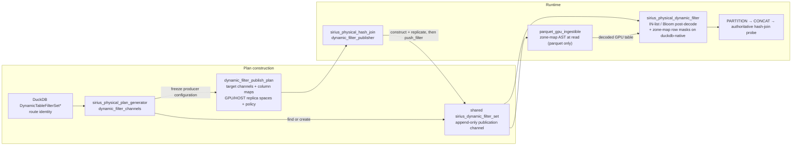
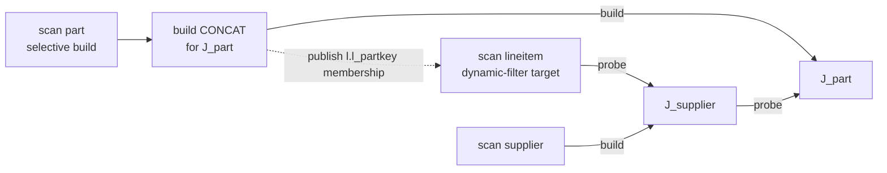
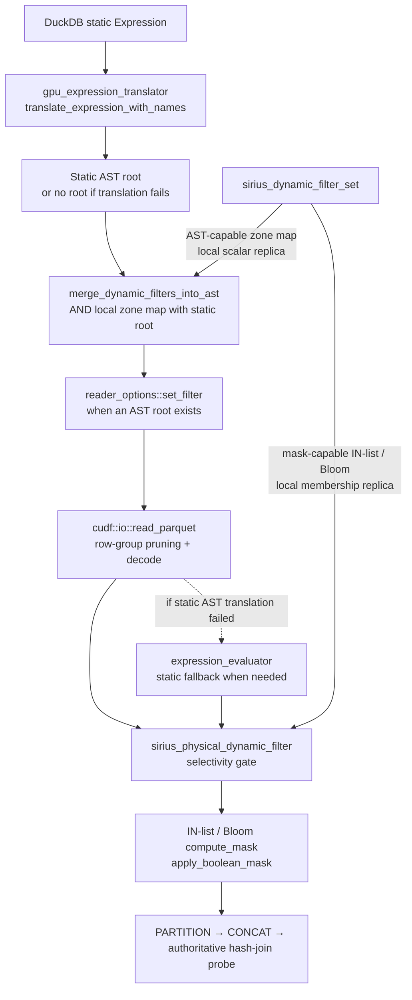

# Dynamic Filters

A **dynamic filter** is a predicate that is computed at query runtime by one operator (the *producer*) and consumed by another (the *consumer*) to prune data. The producer sees data, learns something about it, emits a filter; the consumer uses that filter to do less work — ideally before paying the cost of materialization.

This is a category, not a single feature. It spans:

- **Dynamic table-filter pushdown** — an eligible `BUILD_PROBE` hash-join build pushes runtime membership filters into a downstream GPU scan (parquet or duckdb-native); an optional zone-map can additionally prune parquet row groups against the actual build-side key range. It is a pure optimization — redundant with the join, so it never changes results. Membership pushdown is **on by default**; zone maps are off by default.
- **Sideways information passing (SIP)** — a hash-join build pushes a filter into another join's probe input, so the second join can reject probe-side rows that can't possibly match.
- **Aggregation-driven pushdown** — a `GROUP BY` or `DISTINCT` exposes its distinct-value set to downstream consumers.
- **Sort- or top-N-driven pruning** — a post-sort min/max is exact and free; a top-N's current threshold tightens upstream filters.
- **Adaptive runtime predicates** — operators that observe data and refine filters over the lifetime of a pipeline.

This document describes the implemented Phase 1 framework and the design-only directions that could generalize it. Phase 1 has a `BUILD_PROBE` hash-join-build producer, a GPU-scan consumer (parquet and duckdb-native), and three filter kinds (zone map, IN-list, and Bloom). Membership pushdown is enabled by default; the workload-specific zone-map path remains opt-in. Phases 2–4 below are not implemented.

## How the phases generalize

The framework has four axes of generality. Each phase opens one axis:

| Axis | Phase 1 | Phase 2 | Phase 3 | Phase 4 |
|------|---------|---------|---------|---------|
| Filter kind | zone map + Bloom + IN-list | (reuses Phase 1's filter zoo) | (reuses) | (reuses) |
| Consumer kind | parquet reader + post-decode scan operator (parquet + duckdb-native) | + hash-join probe | + any operator with a column input | (unchanged) |
| Producer kind | `BUILD_PROBE` hash-join build only | (unchanged) | + agg, sort, filter | (unchanged) |
| Coordination | single-shot build-port publication; direct probes ordered, transitive scan targets opportunistic | topology-aware coordination for join-probe consumers | (unchanged) | streaming / incremental refinement |

Anything implemented in Phase 1 is reused unchanged by later phases. We do not replace DuckDB's static table-filter pushdown — static filters continue to flow through the existing translator path and are AND-merged with dynamic filters at the consumer.

## Generalized architecture

The framework has four pieces, all designed to be filter-kind, producer-kind, and consumer-kind agnostic:

1. **`sirius_dynamic_filter`** — polymorphic base class for runtime-computed filters. Each subclass knows how to lower itself to a cuDF AST fragment, to a runtime apply pass, or both.
2. **`sirius_dynamic_filter_set`** — thread-safe append-only channel that connects producers and consumers. Keyed by the consumer's column index in its output schema.
3. **Filter router** — keeps a map of channels keyed by a *route key*, so multiple operators can attach to the same channel during plan construction.
4. **Producer / consumer roles** — concrete operators that push filters into channels (producers) or read them out (consumers). An operator can be both for different channels.



### Filter polymorphism (filter kind axis)

`sirius_dynamic_filter` is the base for every dynamic filter kind. The base carries the kind tag and the cheap device-availability query common to device-backed filters. Concrete consumer-side capabilities (AST lowering and runtime mask application) live on separate **capability mixin** interfaces that filters inherit alongside the base. Producer-side replica construction is likewise isolated in `sirius_device_replicable`. This avoids forcing a filter to implement a path it cannot satisfy: a bloom filter, which has no meaningful AST representation, simply does not inherit from `sirius_ast_lowerable`.

```cpp
class sirius_dynamic_filter {                  // base — kind + device availability
 public:
  virtual ~sirius_dynamic_filter() = default;
  [[nodiscard]] virtual sirius_dynamic_filter_kind kind() const = 0;
  [[nodiscard]] virtual bool is_available_on_device(int device_id) const noexcept;
};

class sirius_ast_lowerable {                   // capability: AST lowering
 public:
  virtual ~sirius_ast_lowerable() = default;
  [[nodiscard]] virtual cudf::ast::expression const& to_ast(
    cudf::ast::tree& tree,
    cudf::ast::expression const& column_ref,
    int device_id = -1) const = 0;
};

class sirius_dynamic_zone_map_filter
  : public sirius_dynamic_filter,
    public sirius_ast_lowerable,
    public sirius_device_replicable { /* AST consumer + producer replication */ };
```

**Consumer-side dispatch** is by `dynamic_cast` from a `sirius_dynamic_filter` pointer to the capability the consumer needs. The `merge_ast_dynamic_filters_into_tree` helper performs the AST-capability cast internally and silently skips filters that lack it, so consumers building an AST tree don't need any per-call-site logic. `sirius_dynamic_filter::kind()` remains for cases where the consumer needs filter-kind-specific behavior beyond what a capability mixin describes (e.g., a parquet reader that natively understands bloom filters via a path other than `apply`).

**AST lowering** — for consumers that build a `cudf::ast::tree` (parquet reader `set_filter`, expression evaluator). Tree nodes are owned by `tree`; device scalars referenced by literals are owned by the filter instance.

**Runtime apply lowering** — `sirius_mask_applicable` is the sibling capability for consumers that evaluate a filter against a materialized `cudf::column_view`. IN-list and Bloom implement it; zone maps use the AST path.

### Channel — `sirius_dynamic_filter_set` (decoupling axis)

A `sirius_dynamic_filter_set` is the append-only publication channel between producers and a consumer. It owns the filters and is co-owned via `shared_ptr` by every operator that holds either end; it is not a readiness barrier.

Properties:

- **Append-only.** `push_filter(col_idx, f)` adds; nothing removes.
- **Thread-safe.** A mutex guards the underlying map.
- **Keyed by consumer column index.** Producers push for a column index in the *consumer's* output schema. Multiple producers targeting the same column AND-conjoin at the consumer.
- **N producers, one logical consumer endpoint per channel.** Multiple joins may publish into the
  same channel. Multiple consumers use separate channels; the producer can fan the same immutable
  filter object into each one.
- **Filters are co-owned via `shared_ptr<filter const>`.** Producers may push the same filter object into multiple channels. Phase 1 uses this for scan-target fan-out; a future SIP consumer could reuse the same Bloom in a downstream join probe without cloning device storage.

Consumer access is via `filters_for_column(col_idx)` and `filtered_columns()`. The free helper `merge_ast_dynamic_filters_into_tree(tree, existing_root, set, resolver)` walks the channel, lowers every AST-capable filter, AND-conjoins the per-column and cross-column fragments, and returns `AND(existing_root, dynamic_root)` — or `existing_root` unchanged if no filter contributed.

### Filter router — plan-gen channel map (routing axis)

*Introduced in Phase 1.1.* During plan construction, multiple operators must find each other and agree on a shared channel. The router lives on `sirius_physical_plan_generator` and maps a *route key* to a channel:

```cpp
// Phase 1.1
std::unordered_map<
  const duckdb::DynamicTableFilterSet*,
  std::shared_ptr<sirius::op::sirius_dynamic_filter_set>
> dynamic_filter_channels;
```

The route key in Phase 1.1 is `const duckdb::DynamicTableFilterSet*` — DuckDB's optimizer creates a `DynamicTableFilterSet` and references it from both the join's `JoinFilterPushdownInfo::probe_info` and the target `LogicalGet`'s `dynamic_filters`. The pointer is the identity that pairs them.

For Phase 2 (SIP) and Phase 3 (other producers), there is no DuckDB-supplied pointer — Sirius creates the pairing itself, and the route key generalizes to a variant covering Sirius-owned producer/consumer ID pairs. The router's logic is unchanged: find or create a channel for a route key, attach to producer, attach to consumer. Only the key set grows.

### Producer / consumer wiring

*Introduced in Phase 1.1.* A **producer** receives an immutable publication plan. Its per-target entries hold the channel and the column-index translation from the build keys to the consumer:

```cpp
class dynamic_filter_publish_plan {
 public:
  struct probe_target {
    std::shared_ptr<sirius_dynamic_filter_set> filter_set;
    std::vector<std::size_t> probe_col_idx;       // build-key idx -> consumer col idx
    std::vector<cudf::data_type> probe_col_type;  // consumer storage type per key
  };

 private:
  std::vector<probe_target> _probe_targets;
  std::vector<std::size_t> _build_key_domain_cardinalities;  // per key; 0 = gates off
  std::vector<dynamic_filter_replica_space> _replica_spaces;
};
```

The planner freezes routing, placement, and policy into the hash join's `const dynamic_filter_publish_plan`. Each `dynamic_filter_replica_space` pairs one target GPU space with its selected HOST staging space. The build-port hook claims publication as soon as the complete build batch arrives, holding the batch's read-only accessor from before it is routed so the GPU representation cannot be downgraded underneath publication. The producer builds and replicates each filter, then fans it into the accepting channels. Finalization only closes an unclaimed publication window.

A **consumer** holds the channel directly via `std::shared_ptr<sirius_dynamic_filter_set> sirius_dynamic_filters` and reads from it during execution.

## Lifetimes and ordering

**Channel lifetime.** The `sirius_dynamic_filter_set` is co-owned via `shared_ptr` by every operator that references it.

**Scalar lifetime.** Scalars referenced by AST literals or apply kernels are owned by the filter instance, which is owned by the set. The set must outlive any AST tree or apply invocation built from filters it contains.

### Immediate-probe ordering

For a scan that directly supplies a `BUILD_PROBE` join's probe input, the primary publication attempt completes before the scan is activated. Build-side `CONCAT` waits for the build partition pipeline, folds the complete build side into one GPU batch, and synchronously calls `sirius_physical_hash_join::push_data_batch_partitioned("build", ...)`. That call waits for the batch writer event, constructs the filters, completes device replication, fans the ready filters into the channels, and reaches `FINISHED` before returning. Only after the CONCAT task returns does downstream task creation ask that same join for another hint; with build data present and probe data absent, the hint follows the immediate probe producer.

This is an ordering property of the producing join's **immediate** probe edge, not a universal barrier in front of every scan to which DuckDB routes the filter. The following sequence is deliberately scoped to that direct shape:

```mermaid
sequenceDiagram
    participant B as Build GPU_SCAN / PARTITION
    participant C as Build CONCAT (concat_all)
    participant J as BUILD_PROBE hash join
    participant R as Device replica spaces
    participant F as Dynamic-filter channel(s)
    participant T as task_creator
    participant P as Immediate probe GPU_SCAN

    B->>C: Complete all build partitions
    C->>C: Fold the complete build side to one GPU batch
    C->>J: push_data_batch_partitioned("build", batch)
    activate J
    J->>J: Wait for the batch writer event
    J->>J: OPEN → PUBLISHING; construct filters
    J->>R: Materialize device-local replicas
    R-->>J: Replica completion
    J->>F: push_filter(...) fan-out (possibly none by policy)
    J->>J: PUBLISHING → FINISHED
    J-->>C: Publication attempt finished
    deactivate J
    C-->>T: CONCAT task completes; schedule downstream join
    T->>J: get_next_task_hint()
    J-->>T: WAITING_FOR_INPUT_DATA(probe producer)
    T->>P: Create and enqueue probe data-scan tasks
    P->>F: has_filters() and device-local snapshot (never waits)
    P->>P: read_parquet, then membership post-filter
```

### Transitive scan targets and publication timing

DuckDB may route the same join filter through operators on the probe side, including intervening comparison joins, until it reaches a base scan. Such a scan is a **transitive probe target**: it contributes to the producing join's probe subtree, but it does not directly feed that join's probe port. The producing join's build hint therefore does not gate the scan.

For example, consider this simplified Q8-shaped join:

```sql
FROM lineitem AS l
JOIN supplier AS s ON l.l_suppkey = s.s_suppkey
JOIN part AS p ON l.l_partkey = p.p_partkey
WHERE p.p_type = 'PROMO BRUSHED COPPER'
```

One valid physical shape makes the `supplier` join part of the `part` join's probe subtree:



The filter is still redundant and safe: every `lineitem` row that survives `J_part` must have a key in the filtered `part` build. This is still Phase 1 scan pushdown, not Phase 2 SIP: DuckDB traverses `J_supplier` while finding a target, but `J_supplier` neither consumes nor applies the filter; the `lineitem` parquet scan remains the consumer. Scheduling is different from the direct case, however:

1. `J_supplier` finishes its own build and activates the `lineitem` scan.
2. The task creator can enqueue many `lineitem` GPU scan tasks. Enqueuing does not snapshot the dynamic-filter channel.
3. Probe `PARTITION` and non-`concat_all` `CONCAT` may stream enough `J_supplier` output toward `J_part` while more `lineitem` tasks remain queued or in flight.
4. Once task creation reaches `J_part`, its missing build causes the `part` build subtree to be created.
5. The scheduler dispatches the resulting tasks through its normal device-affinity and queue-order policy. There is no filter-specific preference or readiness barrier.

The transitive consumer remains deliberately opportunistic. It does not create a missing build
task, preempt a running scan, or wait for filter readiness. Splits already past a consumer
checkpoint are not revisited. DuckDB's consumer-routing walk still follows the producing join's
probe subtree through intervening operators to attach the channel to a base scan; the scheduler
does not perform a second filter-specific topology walk.

Issue [#1124](https://github.com/sirius-db/sirius/issues/1124) compared filters disabled, the former
build-subtree preference, and normal scheduling at SF300. Every measured scan consumed zero rows
before publication in both filter-enabled configurations, while normal scheduling improved wall
time by 9–25% and substantially reduced variance with bit-identical results and unchanged peak
memory. The preference was therefore deleted. This result motivates the policy but does not create
an ordering guarantee for other workloads; any future consumer that requires ordering must express
that dependency explicitly outside the global scheduler.

Metadata preparation is independent of consumer routing and task scheduling. Footer parsing, split coalescing, and background prefetch preparation may happen before publication; those activities do not decode or materialize table rows and do not snapshot the channel. A queued GPU scan task also has not necessarily consumed the filter yet. A parquet task selects zone maps immediately before `read_parquet` and membership filters in the following fused post-decode operator; publication during decode may therefore still be observed by the later membership stage. A duckdb-native task instead has one post-decode checkpoint that selects both AST-lowerable zone maps and membership filters. Publication after a format's relevant checkpoint cannot make that checkpoint run again.

The channel therefore remains opportunistic and never waits on readiness. A direct target normally observes the completed fan-out. A transitive target racing publication may observe no filter, a subset while `push_filter` appends the individually complete filters, or the full set after publication reaches `FINISHED`; every filter becomes visible only after its own device replicas are ready. An intentionally empty publication, an unsupported or policy-gated key, an unavailable local replica, or a filter disabled by the selectivity gate is always a safe pass-through because the join remains authoritative.

## Static + dynamic filter at the consumer

The static and dynamic filters live on **separate, non-interfering paths**, which is what lets the dynamic side be a pure optimization. `parquet_gpu_ingestible` owns the coalesced DuckDB static expression and translates it for reader pushdown; device-local dynamic AST fragments are conditionally merged during per-split materialization:

- **Static filter** — a `shared_ptr<duckdb::Expression>` (`parquet_gpu_ingestible::_duckdb_filter_expression`), lowered by `gpu_expression_translator::translate_expression_with_names` to a cuDF AST and installed via `reader_options::set_filter` (or, if translation fails, evaluated post-decode by `expression_evaluator`). It is authoritative for correctness and is never touched by the dynamic side.
- **Dynamic filter** — the zone-map is AST-lowerable, so `merge_dynamic_filters_into_ast` (column-name references) AND-merges it onto the reader's filter root, installed via `reader_options::set_filter` (in `parquet_gpu_ingestible::materialize_metadata_to_table`). cuDF's parquet reader uses a `set_filter` predicate both to prune row groups by their statistics *and* to evaluate it row-wise during decode. Membership filters (IN-list / bloom) are not AST-lowerable, so the merge skips them and they are applied **post-decode** by the `sirius_physical_dynamic_filter` operator. Either way the dynamic predicate is a conjunctive *superset* of the join condition, so it never changes which rows survive — the join is authoritative.

The dynamic zone-map AST is merged onto the static filter root when the static filter translated, or built standalone when it did not, so the earlier "translation failed ⇒ dynamic pushdown skipped" restriction no longer applies: the dynamic side contributes regardless of the static filter's translation outcome, and the static filter keeps its own path unchanged.

The duckdb-native GPU scan is post-decode only. It has no reader-side filter hook — decode is Sirius's own native path and static filters are evaluated in `post_filter_and_project` — so its `sirius_physical_dynamic_filter` runs in `include_ast_row_masks` mode: an opted-in zone map is evaluated row-wise via `cudf::compute_column` alongside the membership masks, behind the same gate. Row-group stat pruning in the native metadata walk remains static-only. The native ingestible's wiring role is installing the channel's column_ids → output-position remap at construction, before any producer publishes.

This mixing rule is a property of the consumer scan format, not the framework. Other consumers (hash-join probe in Phase 2) have their own merge rules.



---

## Phase 1 — Dynamic table-filter pushdown

**Goal:** establish the framework end-to-end against a single (producer, consumer) pair — `BUILD_PROBE` hash-join build → GPU scan (parquet and duckdb-native) — and exercise filter-kind polymorphism via progressively richer filters.

**Producer:** `BUILD_PROBE` hash-join build side.
**Consumer:** GPU scan — parquet (`parquet_gpu_ingestible`: reader zone-map + post-decode operator) and duckdb-native (post-decode operator only).
**Routing:** DuckDB-paired (`DynamicTableFilterSet*` route key).
**Coordination:** synchronous build-side CONCAT publication strictly precedes the producing join's immediate probe data scan; transitive scan targets remain nonblocking and race publication under normal scheduler order.

### 1.1 Foundational wiring

Wires the scaffolding into operators end-to-end against a degenerate single-zone (N=1) zone-map filter — equivalent to a global min/max bound. Validates the channel + router + consumer-merge plumbing in a real query.

Plan-gen / type plumbing:

- `sirius_physical_plan_generator::dynamic_filter_channels` map (the router), gated by `enable_dynamic_filter_pushdown`
- `sirius_physical_table_scan`'s `sirius_dynamic_filters` field (consumer endpoint, propagated through `parquet_ingestible_table_info` to `parquet_gpu_ingestible` and through `duckdb_native_ingestible_table_info` to the native ingestible, which installs the channel's output-position remap)
- `dynamic_filter_publish_plan::probe_target` entries plus non-owning paired GPU/HOST replica spaces (producer endpoint, held privately by the hash join)
- Plan-gen wiring in `sirius_plan_get.cpp` and `sirius_plan_comparison_join.cpp`; the join attaches a channel per target

#### Ordered build-port publication

Publishing from `finalize_operator()` or from the hash-table build would be too late because the `BUILD_PROBE` hash table is constructed only after the first probe batch arrives. The implemented producer instead uses the complete build batch delivered by build-side `CONCAT`; it requires no probe batch and does not depend on the hash-table state machine.

The normal path is deliberately ordered:

1. Pipeline construction places the build child before the probe child. The remainder of this sequence applies when partitioning selects `BUILD_PROBE`.
2. Build `PARTITION` selects `BUILD_PROBE` only when a build-side CONCAT can fold the input, then sets that CONCAT to `concat_all`.
3. Build CONCAT waits for its source pipeline, folds the complete build side to one GPU batch, and synchronously calls `push_data_batch_partitioned("build", batch)`.
4. The hook acquires the batch's read-only accessor before routing it — once deposited into a repository the batch becomes a downgrade candidate, and the shared lock pins its GPU representation until publication completes. It then waits for the representation's writer event, claims `OPEN -> PUBLISHING`, constructs the selected filters, completes device replication, pushes the immutable filters into every accepting channel, and stores `FINISHED` before returning.
5. Only after the CONCAT task returns does downstream task creation ask the join for its next hint and follow `WAITING_FOR_INPUT_DATA` into the immediate probe producer. A scan on that edge therefore cannot run while normal build-port publication is in progress.

The publish gate admits two `BUILD_PROBE` shapes where one partition's build batch is the complete build side: a **single partition** (`_partition_build_states.size() == 1`), and a **broadcast** join (`_broadcast`), where the small build table is replicated to every GPU so each partition's `concat_all`-folded batch is the full build. Under broadcast there is one build CONCAT per GPU, each racing the build-port hook; the `OPEN -> PUBLISHING` compare-exchange in `publish_dynamic_filters` selects exactly one publisher (the first to arrive), while the rest return at the CAS before constructing anything. A genuinely hash-partitioned (non-broadcast) multi-partition build keeps pushdown disabled, because each partition holds only a slice of the build keys and no single batch could emit a complete filter (cross-partition aggregation is a future extension). The gate is `(_partition_build_states.size() == 1 || _broadcast)` in `sirius_physical_hash_join::push_data_batch_partitioned`.

That sequence does not gate a scan reached transitively through an intervening join. Those targets
run under normal locality-aware dispatch and may observe no filter, a partial fan-out, or the
complete publication at their checkpoints. See
[Transitive scan targets and publication timing](#transitive-scan-targets-and-publication-timing).

The publication attempt may intentionally emit no filter—for example, for an empty build, a cast or unsupported key, a domain-covering key, or a non-selective zone range. That successful no-op is still `FINISHED`. Allocation pressure may also leave an optional replica unavailable. Consumers need no readiness protocol: they test the channel and local device availability and pass the batch through when nothing useful can apply. Replica materialization for every filter kind treats a per-target failure (reservation denial, cloning, copy, or completion synchronize) as best-effort: it is logged and that target's replica is omitted.

A batch that arrives already non-GPU-resident (possible only when it was shared with an earlier consumer, e.g. CTE fan-out, and downgraded before delivery) skips publication — filters are optional. `on_finalize_operator` never publishes; it only changes an unclaimed `OPEN` state to `CLOSED`. GPU construction and replication run without holding `op_state_mutex`.

Replica bytes use direct peer DMA where empirically verified, otherwise they borrow chunked pre-pinned storage from the planned Sirius/CuCascade HOST memory space. The dynamic-filter code performs no direct pinned allocation and does not modify CuCascade. See [dynamic-filters-multi-gpu.md](dynamic-filters-multi-gpu.md) for the replica design and validation.

**Application in the target scan.** A dynamic join filter is *redundant with the join that produced it*: the join discards every non-matching probe row, so the filter is a conjunctive superset and never has to be exact. The zone map rides the parquet reader's filter: `merge_dynamic_filters_into_ast` AND-merges it onto the reader root and `materialize_metadata_to_table` installs it via `reader_options::set_filter`, so cuDF can prune row groups by statistics and evaluates the predicate during decode. Membership filters (IN-list / Bloom) are not AST-lowerable and ride the **post-decode** path (`sirius_physical_dynamic_filter` → `apply_dynamic_filters_to_view`, `membership_masks_only` mode). On the duckdb-native scan, which has no reader filter, the operator instead runs in `include_ast_row_masks` mode so zone maps apply row-wise there too. The shared `dynamic_filter_gate` measures scan-level and per-filter usefulness before allowing that post-decode cost to repeat. The static filter is untouched and remains authoritative.
>
> **Follow-up — zone-map row-GROUP-only.** Merging the zone-map into `set_filter` keeps cuDF's row-group stats-pruning win but also pays a row-level evaluation cost during decode. A row-group-*only* path — evaluate the zone-map against `filter_row_groups_with_stats` and feed only `reader_options::set_row_groups`, never `set_filter` — would drop that row-level cost but is **not yet implemented**. The cost is bounded today: the zone-map is off by default (`enable_dynamic_zone_map_filter`) and TPC-H's scattered keys prune nothing.

> **Redesign note (nsys-driven, SF50).** An earlier implementation applied dynamic predicates redundantly through both `reader_options::set_filter` and an unconditional post-decode `compute_column` + `apply_boolean_mask`. Profiling showed that row-level work regressed scattered-key workloads where it dropped almost no rows. The current design gives each filter kind one path per consumer format: on a parquet scan, zone maps use the reader's `set_filter` and membership filters use the gated post-decode operator; a duckdb-native scan has no read-time filter hook, so its zone maps ride that same post-decode operator as an AST row mask (`include_ast_row_masks`), under the same scan-level gate. Each filter is evaluated exactly once, never redundantly through both paths. Membership filters and duckdb-native zone maps run only while the gate keeps the post-decode operator active; parquet zone maps remain on the reader path outside that gate. The filter never affects results because the join is authoritative.

#### Measured

- **SF50, full TPC-H (22 queries), regression guard — OFF vs ON:** aggregate **+0.2 %** (136.17 s → 136.39 s), i.e. net-zero within the per-query noise floor (~±9 % on the small queries; the large queries are all ≤ ±3 %). **All 22 results bit-identical** OFF vs ON. `pruned=0` on every query because TPC-H's scattered keys span the key domain; the gated/default-off paths bound that cost. Full unit suite passes.
- **SF30, `lineitem ⋈ keyset` on clustered `l_orderkey`** (the case the zone-map is *for*): the zone-map excludes the non-overlapping row groups, ≈1.6× — preserved by the row-group path. This requires the keyset's narrow range be *runtime*-determined: for a literal/range-derivable build, DuckDB's static transitive pushdown already prunes (measured feature-OFF == ON on SF50), so the dynamic zone-map adds nothing — hence it is gated off by default (`enable_dynamic_zone_map_filter`).

Zone-map pruning only pays off when the build-side join key is range-restricted on a *clustered* fact (e.g. `l_orderkey`). An immediate probe read is ordered after publication. A transitive target may materialize early splits first and observes filters opportunistically; for every split that does observe the zone map, key distribution determines whether row groups can be rejected. TPC-H joins on scattered keys (`l_partkey` in Q14/Q17/Q19) prune nothing — those are handled by the membership filters below.

### 1.3–1.4 Membership filters (raw/hash IN-list + Bloom)

The zone-map captures only the build keys' `[min,max]` range, which is useless for *scattered* keys — even a 0.24%-selective `part` build spans the whole partkey domain (measured). Set **membership** is what distinguishes those keys. Membership filters use the `sirius_mask_applicable` capability (a `compute_mask(probe) → BOOL` mask, distinct from `sirius_ast_lowerable`) and have three concrete representations:

- **`sirius_dynamic_small_in_list_filter`** — exact membership for 1–12 null-free INT32/INT64 build rows, counting duplicates. Each successfully materialized device-local replica owns a raw snapshot of the build values (the *needles*), and one CUB bulk kernel compares every probe value with every needle. It has no hash build, slot array, or reserved empty-key sentinel.
- **`sirius_dynamic_in_list_filter`** — hash-based membership via a persistent `cuco::static_set`, with a device kernel probing its read-only set reference. It is exact for representable set keys and conservatively passes cuCO's reserved empty-key value, so it remains a safe join-filter superset.
- **`sirius_dynamic_bloom_filter`** — a `cuco::bloom_filter` (PIMPL'd in a `.cu`; INT32/INT64 keys) at 16 bits/key under Sirius's own fingerprint policy (see [Fingerprint policy](#fingerprint-policy--why-neither-cuco-stock-policy-is-used)), for large builds where the hash IN-list is too big. False positives only let extra rows through — harmless, because the join is authoritative; no false negatives means a true match is never dropped.

**Producer policy** (`dynamic_filter_publisher::publish`). The master switch `enable_dynamic_filter_pushdown` emits at most one **membership filter** per key, in this order:

1. Use the raw-needle exact IN-list when `sirius_dynamic_small_in_list_filter::supports(col)` sees 1–12 null-free INT32/INT64 build rows. The gate uses the view's row count, including duplicates; it does not compute distinct cardinality.
2. Otherwise use the hash IN-list when the column is supported and its estimated `cuco::static_set` footprint fits the minimum L2 size across the active probe GPUs — and stays within `dynamic_filter_inlist_max_l2_fraction` of that L2 (default 0.125; 0 always demotes to the Bloom when supported, 1.0 restores the plain fit rule). A GB300 residency sweep showed the set's probe cost is flat below ~0.28 of L2 and degrades beyond, while the smaller (inexact) Bloom probes ≥ 2.2× faster at every hash-set size; the fraction bounds the IN-list to the region where exactness costs the least. When no device L2 size is available the fit rule itself fails closed and publishes a Bloom.
3. Otherwise use the Bloom filter whenever its key type is supported; its bitset may itself exceed L2 for a sufficiently large build.

After the earlier empty-build, cast, and domain-coverage gates, **none** is selected only when the key type has no supported membership representation. The hash-set and Bloom estimates use the build row count (an upper bound on distinct keys) and the planned devices' minimum `cudaDevAttrL2CacheSize`. The small-list decision precedes that L2 comparison and stores exactly the raw INT32/INT64 input bytes; duplicates are harmless because membership is existential.

A second switch, `enable_dynamic_zone_map_filter` (default **off**, requires the master), *additionally* emits a **zone map** (build-key min/max) per key — a complementary consumer path. Parquet scans use it for read-time row-group pruning; duckdb-native scans evaluate it row-wise post-decode. It is off by default because on TPC-H-shaped joins DuckDB's static transitive-predicate pushdown already prunes range-derivable builds, while scattered keys span the domain and prune nothing. At publication, a numeric zone range covering at least `dynamic_filter_domain_coverage_threshold` (default 90%) of the key-domain estimate is skipped before it reaches the reader. On a parquet scan the zone map rides the reader's `set_filter` and is therefore outside the post-decode `dynamic_filter_gate`; on a duckdb-native scan it is evaluated row-wise inside the gated post-decode operator, so it does sit behind that scan-level gate. It is never *per-filter* skipped either way — only membership filters record a marginal keep ratio.

**Consumer**: membership rides the post-decode `apply_dynamic_filters_to_view` path on both scan formats, but in different modes — parquet scans wrap it in `membership_masks_only` (the reader already evaluated the AST-lowerable filters), duckdb-native scans in `include_ast_row_masks`. The zone-map rides the parquet reader's `set_filter` (cuDF prunes row groups by stats and evaluates it during decode); a duckdb-native scan has no reader hook, so that same post-decode pass evaluates the (opted-in) zone map row-wise as an AST row mask alongside the membership masks. Because membership is applied *post-decode*, it never saves the scan I/O/decode — only the *downstream* work on dropped rows; so it wins on selective builds feeding expensive downstream and is neutral on scan-dominated single joins.

The **hash-IN-list-to-Bloom** cutover is hardware-adaptive — it replaced an earlier fixed `2M`-row-count threshold — landing at ≈1.5M INT64 keys on a 24 MB L2, ~2.5M at 40 MB, ~6M at 96 MB. A historical TPC-H SF50 sweep showed that cutover to be **wall-clock-neutral** (every query whose kind flipped was flat across `[500K, 8M]`; forcing the affected builds all the way to *none* moved them ≤1.5%, within run-to-run noise). The L2 policy keeps the hash IN-list while it fits L2 and otherwise uses the smaller Bloom; those historical cutover points describe the `dynamic_filter_inlist_max_l2_fraction = 1.0` position — under today's default (0.125) the cutover sits at an eighth of those key counts. All result sets stayed bit-identical across hash IN-list / Bloom / none.

That sweep and the SF50/SF300 measurements below predate the raw-needle representation. They characterize the surrounding membership system, not the new small-list cutoff or a raw-scan-versus-hash performance comparison; no such benchmark is recorded here.

**Adaptive selectivity gate** (`sirius_physical_dynamic_filter::_gate`): the first applicable non-empty batch records the combined keep ratio of everything the operator applied in its cascade — the membership masks, plus (in `include_ast_row_masks` mode, i.e. duckdb-native scans) the zone map's row mask; if it keeps more than `dynamic_filter_keep_threshold` (default 90%) of its rows, the scan-level gate becomes `DISABLED`, otherwise it becomes permanently `ACTIVE`. Within an active cascade, each *membership* filter also records its marginal keep ratio; a membership filter keeping more than 50% of the rows reaching it is skipped on later splits. The AST/zone-map step is cross-column, so it has no per-column ratio to gate on and its drop is deliberately not recorded per-filter — only the scan-level gate can turn a native scan's zone map off. A GPU without a local replica does not train the shared gate. Applicability is lock-free, while rare decision updates are serialized. The gate is filter-count-aware because a direct target normally starts after the complete fan-out, while a transitive target may observe additional filters on later splits.

**Measured (SF50, full TPC-H, ON vs OFF, robust medians):** real wins appeared where a selective build feeds expensive downstream — **Q21 −10.6%** and **Q2 −7.9%** in that historical sweep. Net suite ≈ **−1.5%**. All 22 results were bit-identical OFF vs ON; membership pushdown is enabled by default. The Q21 attribution was later found not to represent the Phase 1 scan path (see the caveat below), so it must not be read as evidence for a publication-timing effect.

> **Cold vs warm.** The numbers above are **warm** (page-cache-resident) medians. A cold/deployment-representative sweep (drop OS cache before each run) shows the wins **largely evaporate** — membership applies *post-decode*, so it cannot cut scan I/O, and the big nominal wins are on I/O-bound queries: full-suite net ≈ **−0.5 % cold** vs ≈ −1.5 / −2.2 % warm. The durable benefit is on small-selective-build, *compute-bound* queries (Q2-shaped); benefit ∝ 1/(how I/O-bound the query is). *Q21 caveat:* a per-query SF50 diagnostic found Q21 wires only a ~20K-key IN-list on the Phase-1 scan-pushdown path (not the ~37M-key `orders` bloom the −10.6 % was attributed to), and its measured swing is within run-to-run noise — a bloom over the F-status `orders` self-join would be a Phase-2 SIP consumer, which does not exist yet.

**Measured (SF300, two GPUs, pinned-host compute regime):** with physical GPUs 1 and 2, grouped execution, five iterations per query, and iteration 0 discarded, the sum of Q1-Q22 warm medians improves from **13.7013505 s to 8.2939465 s: 39.466212% (1.651970x)**. All 22 ON/OFF result files are byte-identical. This is a fixed-two-GPU feature A/B, not a one-to-two-GPU scaling or cold-I/O claim; the exact protocol and per-query table are in [dynamic-filters-multi-gpu.md](dynamic-filters-multi-gpu.md#performance).

*Follow-ups:* wider and variable-width membership keys. INT32 and INT64 are implemented.

#### Configuration

- Dynamic membership-filter pushdown is automatic and enabled by default. When disabled through the advanced YAML benchmark/diagnosis envelope, the router hands out no channels so neither side wires anything and there is zero overhead.
- The clustered-keyset dynamic zone-map path is automatic-off by default and requires membership pushdown. Parquet scans use it for read-time row-group pruning; duckdb-native scans apply it row-wise post-decode. Static pushdown already handles range-derivable builds and scattered keys prune nothing, so the YAML expert envelope should enable it only for clustered-keyset workloads whose narrow range is runtime-determined. The publication range-coverage gate skips obviously non-pruning numeric ranges.
- `dynamic_filter_domain_coverage_threshold` (positive finite double, default **0.9**) — skip publishing a key's filters when the build covers at least this fraction of the key's domain (rows gate and zone-map range gate); ≥ 1.0 effectively disables the gate.
- `dynamic_filter_keep_threshold` (finite double in [0, 1], default **0.9**) — consumer-side scan gate: disable a scan's post-decode filtering once a measured split keeps more than this fraction of its rows; 1.0 keeps filtering always on.

The two mode toggles remain accepted in YAML under `sirius.operator_params`.
Their direct DuckDB session overrides are test-only.

#### Ready replicas and per-split snapshots

The publisher constructs every selected zone-map and membership structure and completes all usable device replicas before fan-out begins. It then appends filters to target channels one `push_filter` call at a time. Each filter is therefore immutable and fully ready on every successful replica as soon as it becomes visible, but the complete multi-filter, multi-target fan-out is not an atomic channel operation.

An immediate probe target is activated only after publication reaches `FINISHED`, so it normally sees the complete fan-out. A transitive scan can race fan-out and see none, a safe subset, or the full set. The consumer takes a fresh channel snapshot at each application checkpoint for that reason. An intentionally empty publication, a missing local replica, or applying only a visible subset is always correct because the authoritative join performs the exact match.

### 1.2 Multi-zone zone maps (design only)

The `sirius_dynamic_zone_map_filter` representation supports N zones and lowers them as an OR of bounded ranges, but the current publisher emits one global `(min,max)` zone per key. A future producer could retain per-build-partition bounds; its AST would grow as `O(partitions)` and would need a fallback-to-global budget.

Zone maps currently implement `sirius_ast_lowerable` only. They do not implement the post-decode membership-mask path.

### 1.3 Bloom filter

`sirius_dynamic_bloom_filter` builds a GPU Bloom filter over INT32/INT64 build keys. The consumer applies it post-decode through `sirius_mask_applicable::compute_mask`.

Bloom filters are runtime-only — there is no AST node that evaluates "is this hash in this bitset" without a custom kernel.

A channel may carry both a zone map for the reader and a Bloom for the post-decode operator. Each becomes visible only after its device replicas are ready. A direct target normally sees both; a transitive target can safely observe either one or both at its per-split checkpoints because the filters are optional conjuncts and the join remains authoritative.

**Build heuristic: raw exact list, then L2-sized hash set, then Bloom (implemented).** The producer first handles 1–12 null-free INT32/INT64 build rows with a linear scan over raw needles. For larger supported columns, it queries the active GPUs' L2 sizes (`cudaDeviceGetAttribute(cudaDevAttrL2CacheSize)`) and selects the hash IN-list only if its set fits the smallest L2; otherwise it uses the smaller Bloom, even if that bitset also spills L2. This L2 decision subsumed the original fixed row-count hash/Bloom cutover.

#### Fingerprint policy — why neither cuco stock policy is used

The filter is a `cuco::bloom_filter` at a fixed 16 bits/key over 256-bit (32-byte, i.e. one memory
sector) blocks. cuCollections ships two policies and Sirius uses neither:

- `cuco::arrow_filter_policy` maps the hash to a block with a cheap multiply-shift but hard-caps
  the filter at Arrow's 128 MiB (2²² blocks ⇒ 67.1M keys at 16 bits/key). Every Bloom the publisher
  emits at SF1000 is larger than that, so it was never selected.
- `cuco::default_filter_policy` has no cap but computes `hash % num_blocks`. GPUs have no integer
  divide, so a 64-bit modulo by a runtime value is a long emulated instruction sequence. It — not
  the random gather — dominates the probe kernel.

`sirius_bloom_policy` (in `src/cuda/sirius_dynamic_bloom_filter.cu`) keeps the uncapped sizing and
`default_filter_policy`'s exact hash and fingerprint layout, and replaces only the block index with
Lemire fast-range, `(hash * num_blocks) >> 64`, one `mul.hi.u64`. One policy now covers every size,
so the replica variant carries two alternatives (one per key width) instead of four.

Measured on GB300 (152 SM, 115.5 MiB L2, 7.16 TB/s) at TPC-H SF1000 q21's real probe shape —
389M clustered `l_orderkey` probes per split, `contains_async` only:

| build keys | filter | `hash % n` | fast-range | |
|---|---|---|---|---|
| 73.2M (q21 `l1` key set) | 139.7 MB | 5.06 ms | 2.34 ms | 2.16× |
| 730.8M (q21 `orders` F key set) | 1393.9 MB | 5.21 ms | 2.73 ms | 1.91× |

Filter *size* is not the lever, which is directly falsifiable and was falsified: a 69.8 MB filter
small enough to live entirely in L2 still took 4.93 ms with the modulo against 2.18 ms with
fast-range. Cutting bits/key is likewise not worth it — 8 bits/key bought 1.07× on the probe while
raising the false-positive rate from 0.11% to 2.86%, which on a 6-billion-row scan means ~170M
extra rows handed to the downstream join. Note the asymmetry that hid this: `cuco::static_set`,
backing the hash IN-list, already avoids the divide via `cuco::utility::fast_int` magic-number
reciprocals, so the IN-list never showed the symptom.

Fast-range preserves the no-false-negative contract: it is a deterministic uniform map of a 64-bit
hash onto `[0, num_blocks)` applied identically on `add` and `contains`, so an inserted key always
tests positive. Only the false-positive *set* can move, which is harmless because the join stays
authoritative — and it moved in the right direction, because fast-range consumes the high hash bits
while the fingerprint consumes the low 40, whereas the modulo drew both from the low bits. At the
73.2M-key shape the measured keep ratio fell from 5.002% to 4.878% against a 4.77% true-match rate,
roughly halving the false-positive rate at identical footprint.

### 1.4 IN-list representations (raw needles + hash set)

Both IN-list representations require INT32/INT64 keys **with no nulls** — each `supports()` takes the build `column_view` and rejects `null_count() > 0` — and expose the post-decode `sirius_mask_applicable` runtime path; neither expands keys into an AST. The Bloom's `supports()` tests the key type alone, so a *nullable* INT32/INT64 build key skips both IN-lists and is published as a Bloom. `sirius_dynamic_small_in_list_filter` eagerly copies its input view into an owned raw source-device needle buffer. Its mask kernel performs a linear equality scan for every probe value, so every bit pattern—including the value reserved as the hash set's empty-slot sentinel—is representable. `sirius_dynamic_in_list_filter` instead builds and owns a persistent `cuco::static_set`; its reserved sentinel is conservatively treated as a match to preserve the no-false-negative contract.

For both representations, the constructor enqueues creation of an owned source representation on the source GPU. The caller must keep the build-key backing storage valid until that construction stream completes; the publisher satisfies this precondition by pinning the build representation and synchronizing the stream before replication. After completion, the filter retains no build-key column. Before publication, raw needle bytes or finalized hash-set slots are copied to each additional probe GPU whose target reservation and transfer complete. A replica enters the ready set only after its target stream synchronizes. Every consumer probes only its local read-only representation and passes through if that optional replica is unavailable; teardown selects each replica's owning CUDA device before releasing its storage.

---

## Phase 2 — Sideways information passing

**Goal:** generalize the *consumer* axis. The hash-join probe becomes a consumer, allowing a build-side filter to prune the probe input of a *different* join before that join performs its hash-probe work, including inputs that cannot be filtered at a parquet scan.

**Producer:** `BUILD_PROBE` hash-join build (same as Phase 1).
**Consumer (new):** hash-join probe input.
**Routing (new):** Sirius-owned `sirius_sip_route` route key.
**Coordination:** implicit, where the producer's meta-pipeline is upstream of the consumer's; explicit readiness (Phase 4) otherwise.

This differs from Phase 1 transitive scan pushdown. Today DuckDB may traverse an intervening join
while locating a base-scan target, but that join does not consume the filter. Phase 2 would apply
the filter at another join's probe input before its hash-probe work, including shapes where no
parquet scan can consume the filter directly.

What changes:

- **Route key variant.** `dynamic_filter_channels` becomes keyed by a variant including a Sirius-owned `sirius_sip_route`. Plan-gen in `sirius_plan_comparison_join.cpp` extends: a join can register itself as a *consumer* of filters from upstream join builds in addition to its existing producer role. Producer/consumer pairing is Sirius's responsibility — no DuckDB pointer to lean on.
- **New consumer code path in hash-join probe.** Before hashing, the probe would apply mask-capable filters through `sirius_mask_applicable::compute_mask` and the existing scan helpers. No new filter kinds are required; the parquet-specific AST path is not reused.

The filter zoo, the channel type, and the producer side are unchanged.

## Phase 3 — Beyond hash-join producers

**Goal:** generalize the *producer* axis. Operators other than hash-join build can produce dynamic filters when they expose useful properties of their output.

**Candidate producer kinds:**

- **Aggregation / DISTINCT.** A `GROUP BY` exposes its distinct-key set; this is an exact IN-list (or large hash-set) for downstream consumers.
- **Sort.** Post-sort, the min/max of the sort key is exact and available for free — strictly cheaper than the `cudf::reduce` path used by hash-join build.
- **Filter (narrowed).** A filter operator that has been further narrowed at runtime (e.g., by an upstream agg pushing an exact set) can republish the narrowed predicate downstream.

Each new producer type carries its own `probe_target`-shaped struct, registers via plan-gen, and adds a new route-key variant. The filter zoo, the channel, and the consumer side are unchanged.

This phase is opportunistic — its value depends on where bottlenecks land after Phases 1 and 2. It is in the design so the producer side is not silently locked to "hash-join only" by Phase 1's choices.

## Phase 4 — Dynamic refinement (speculative)

**Goal:** generalize the *coordination* axis — producers update filters incrementally as they observe more data; consumers wait for finalization or apply progressively-tightening filters as they arrive. Use cases: streaming refinement, cross-pipeline channels with no implicit edge, adaptive runtime predicates.

An incrementally refined producer/consumer pair, or a consumer that requires a filter for correctness, would need an explicit lifecycle protocol (for example, versioned snapshots plus readiness/finalization). Phase 1 does not need or implement such a protocol: publication is single-shot, immediate probes are externally ordered after it, and transitive scan targets treat whatever immutable filters are visible as optional pruning. No Phase 4 work is planned until a concrete use case justifies it.

---

## Open questions

1. ~~**Build/probe publication ordering.**~~ **Resolved with two cases.** For the normal GPU-resident `BUILD_PROBE` path, build-side CONCAT calls the publication hook synchronously and the attempt reaches `FINISHED` before downstream scheduling follows that join into its immediate probe producer. A scan reached transitively through an intervening join is not covered by that edge ordering and observes publication opportunistically under normal scheduler order. Metadata preparation may occur before either case and does not snapshot the channel.
2. **AST-size threshold for multi-zone maps.** Phase 1.2's fallback-to-global threshold should be tuned with a microbenchmark on TPC-H Q14 / Q19 once 1.2 lands.
3. **Bloom build-cost gate.** Phase 1.3 uses Bloom when the hash IN-list estimate exceeds the minimum probe-GPU L2, but a separate lower bound on build cardinality (below which Bloom is dominated by zone-map / IN-list) is unspecified. Candidate: skip Bloom when build cardinality < 10k.

## References

- `src/include/op/sirius_dynamic_filter.hpp`, `src/op/sirius_dynamic_filter.cpp`, `test/cpp/operator/test_sirius_dynamic_filter.cpp` — framework API, zone-map implementation, channel, and focused tests
- `src/cuda/sirius_dynamic_small_in_list_filter.cu`, `src/cuda/sirius_dynamic_in_list_filter.cu`, `src/cuda/sirius_dynamic_bloom_filter.cu` — raw-needle, hash-set, and Bloom membership filters plus replica construction
- `src/include/op/scan/dynamic_filter_merge.hpp`, `src/op/scan/dynamic_filter_merge.cpp`, `test/cpp/scan/test_dynamic_filter_merge.cpp` — consumer-side merge/apply helpers (`merge_dynamic_filters_into_ast`, `apply_dynamic_filters_to_view`, `apply_dynamic_filters_gated_view`)
- `src/planner/sirius_plan_comparison_join.cpp`, `src/planner/sirius_plan_get.cpp`, `test/cpp/planner/test_dynamic_filter_router.cpp` — producer/consumer plan-gen wiring and router
- `src/op/sirius_physical_concat.cpp`, `src/op/dynamic_filter_publisher.cpp`, `src/op/sirius_physical_hash_join.cpp` — synchronous build-port publication, filter selection/replication, and fan-out
- `src/include/expression_evaluator/gpu_expression_translator_internal.hpp` — existing AST construction patterns (`cudf::ast::tree::emplace`, scalar lifetime)
- `duckdb/src/include/duckdb/execution/operator/join/join_filter_pushdown.hpp` — `JoinFilterPushdownInfo`, `JoinFilterPushdownFilter` (consumed by Phase 1.1)
