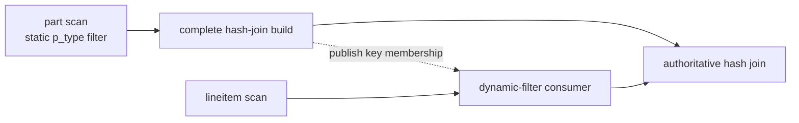
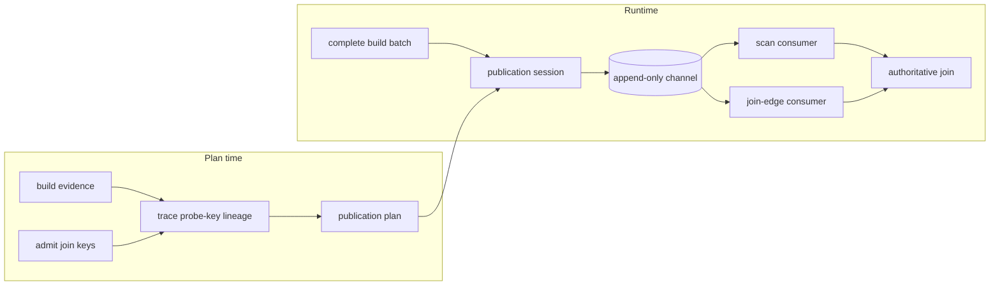

# Dynamic Filters

A **dynamic filter** is a runtime predicate built by one operator and applied by another to avoid work. Sirius currently builds filters from an eligible hash join's complete build side and applies them to:

- a GPU scan reached through the join's probe subtree; or
- a join-edge endpoint placed inside that subtree when no scan can consume the key safely.

The implemented filter kinds are an exact raw IN-list, an exact hash IN-list, a Bloom filter, and an optional global min/max zone map. Membership filtering is enabled by `enable_dynamic_filter`; zone maps are separately opt-in.

Dynamic filters are optional for result correctness. They keep every row that could match the producing join, and the exact join remains authoritative. A missing, late, policy-gated, or device-unavailable filter therefore passes rows through safely.

## Example

Consider a plan that builds a hash join from the filtered `part` relation:

```sql
SELECT l.l_orderkey
FROM lineitem AS l
JOIN part AS p ON l.l_partkey = p.p_partkey
WHERE p.p_type = 'PROMO BRUSHED COPPER';
```

Once the complete `part` build is available, Sirius can publish its `p_partkey` values as a membership filter on `l_partkey`. Rows rejected at the scan or join-edge endpoint would have been rejected by the hash join anyway.



## Architecture



The main components are:

- **Evidence and key admission.** `build_subtree_is_filtering` and `build_relation_is_opaque` decide whether discovery should run. `admit_dynamic_filter_keys` accepts supported equality keys and records the build/probe metadata needed at runtime.
- **Target discovery.** `trace_probe_key` follows a key through physical operators only while its value and row semantics remain safe. A reachable GPU scan wins; otherwise `place_endpoint` may insert a membership-only `sirius_physical_dynamic_filter` at the deepest safe point. Unknown or unsafe transformations stop descent.
- **Publication plan.** `dynamic_filter_publish_plan` binds admitted build keys to target channels and target output ordinals, carries filter policy, and identifies the admitted GPU/HOST replica spaces.
- **Publication session.** `dynamic_filter_publication_session` owns the whole-build claim, source pin/readiness, one-shot construction, terminal outcome, and producer completion rights. The session claims and pins a whole-build delivery, invokes the join's existing repository deposit synchronously, then validates readiness and publishes inline.
- **Channel.** `sirius_dynamic_filter_set` is a thread-safe, append-only channel shared by identified producers and one logical consumer endpoint. It returns coherent owning snapshots and is not a readiness barrier.

The probe key's entry ordinal and a target's output ordinal are different coordinate spaces. The discovery walk performs that translation; channel push, storage, and lookup all use the target output ordinal.

## Publication and consumption

1. Only a delivery containing the complete build can claim publication. At most one usable delivery constructs and publishes filters; an unusable broadcast delivery can release its claim so a sibling can try. Single-partition and broadcast builds can satisfy the complete-build requirement, but a slice of a hash-partitioned build cannot.
2. The winning build delivery pins the build representation and deposits the batch in the join's repository before checking source usability/readiness, constructing the selected filters, and creating device-local replicas on admitted probe GPUs. A delivery that does not claim publication still deposits once. Deposit failures propagate rather than being treated as optional publication failures.
3. A filter becomes visible only after all of its usable replicas are ready. The publisher then appends it to each accepting target channel. Multi-filter fan-out is not atomic, so a racing consumer may observe any independently complete subset.
4. Consumers take one coherent `dynamic_filter_snapshot` at their application checkpoint and retain its immutable filter owners through GPU consumption. They never wait for publication.

An `rmm::out_of_memory` during source-filter construction is logged and ends the optional publication attempt without failing the query. A reservation, construction, or transfer failure for one target GPU omits that replica, and consumers on that GPU skip that filter. Unexpected failures outside target-local replication still propagate.

### Publication ownership and completion

The session registers one move-only publication right for every target during plan construction. Pipeline conversion narrows all replica placements and then freezes endpoint registrations before execution. Manual plans seal through `seal_plan()` or their first whole-build observation. A channel whose registrations are not yet frozen reports pending, never a premature terminal result. Plan narrowing, construction rollback, and abandoned sessions resolve their existing rights without inventing another producer.

The session has one lifecycle: open, publishing, terminal. `finish_input()` remembers input closure even while a delivery owns publication; it performs no CUDA wait and does not retire the active owner's storage. An unusable broadcast delivery reopens only while input remains open. After closure it resolves without a filter. A usable active owner can complete publication after ordinary input closure, and terminal completion follows its final possible push.

Query-error cancellation reaches sessions before the scheduler drains tasks. Cancellation prevents a publication that has not begun fan-out from starting it; an already-visible complete subset remains safe. The active owner retains its source pin and retires submitted GPU reads before releasing it, including on failure. Unexpected CUDA errors still follow the task/query error path. No operator or session lock is held across a CUDA wait.

Each right has a preallocated terminal slot; finishing it is allocation-free, nonthrowing, and exactly once. Only live rights can push. `snapshot()` observes immutable entries, endpoint-local generation, and producer completion under one channel lock:

| Snapshot | Meaning |
|---|---|
| Pending, empty | No filter is available yet; later publication remains possible |
| Pending, nonempty | An independently complete subset is available; more may arrive |
| Terminal, empty | No producer can add a filter |
| Terminal, nonempty | The final set of independently valid filters is available |

Filter presence is separate from attempt completion. A successfully examined empty or policy-skipped build increments `publications_finished` but resolves its right without a filter. A cancelled active attempt increments `publications_failed`; cancellation before any claim creates no attempt. An unusable source is counted only in `publications_skipped_source_not_resident`, including when input closure prevents retry.

DuckDB static filters remain on their existing, authoritative path. Dynamic filters add redundant conjuncts through these consumer paths:

| Consumer | Zone map | Membership filter |
|---|---|---|
| Parquet scan | Reader AST via `reader_options::set_filter`; may prune row groups and rows during decode | Post-decode mask |
| DuckDB-native scan | Post-decode AST row mask | Post-decode mask |
| Join-edge endpoint | Not used | Post-decode mask |

Membership filtering reduces downstream work but does not avoid scan I/O or decoding. The post-decode `dynamic_filter_gate` measures combined usefulness and can disable ineffective filtering; it also stops individual membership filters whose marginal keep ratio is weak.

Post-decode application uses three internal compaction strategies. Cascade applies each mask to the surviving full table. Deferred keys carries stable original-row IDs and one aligned probe key through same-column or cross-column filter sequences, then gathers the remaining columns once. Gather once computes every mask against the original input, folds the masks with logical AND, and materializes the full table once. Every strategy preserves row and column order, nullable and nested values, sliced inputs, and the null pass-through signal when no mask contributes.

The production policy requires at least two candidate mask steps and valid exact input-byte accounting. Rows at least 64 bytes wide use deferred keys while any membership marginal is unknown or stale, or while any current marginal keeps at most 35% of its input; otherwise they use gather once. Narrower rows use gather once only when every current membership marginal keeps at least 40%; they use cascade for unknown, stale, or more selective marginals. One-step, zero-row, and invalid-width cases use cascade. Gather once never fabricates or refreshes per-filter marginals: it becomes eligible only after cascade or deferred keys has trained every applicable membership filter for the current channel generation. The scan-level gate still records the original-to-final keep ratio for every materialized result.

## Filter selection

The publisher emits at most one membership representation per admitted key and may additionally emit a zone map:

| Representation | Selection | Behavior |
|---|---|---|
| Raw IN-list | 1–12 null-free `INT32`/`INT64` build rows | Exact linear membership probe |
| Hash IN-list | Null-free `INT32`/`INT64` keys whose estimated set fits the configured fraction of the smallest probe-GPU L2 | Exact for represented keys; reserved sentinel values conservatively pass |
| Bloom | Supported `INT32`/`INT64` keys when the hash IN-list is not selected | Approximate membership with no false negatives; nullable builds are compacted first |
| Zone map | `enable_dynamic_zone_map_filter=true` and a supported non-floating-point key type | One global build-key `[min,max]` range |

If no probe-GPU L2 size is available, the hash IN-list is not selected; the publisher uses Bloom when supported. Two additional gates avoid unproductive work:

- The domain-coverage gate skips the key before either filter is built when a proven-unique native build key covers at least `dynamic_filter_domain_coverage_threshold` of its known base-table domain.
- The consumer keep-ratio gate disables ineffective post-decode filtering when a measured batch retains more than `dynamic_filter_keep_threshold` of its rows.

Zone maps are off by default because DuckDB static pushdown already handles many known ranges, while scattered runtime keys often span most of the domain. Floating-point keys never receive a zone map: the lowered bounds compare with IEEE semantics under which NaN fails both, while the authoritative join matches NaN keys to each other (DuckDB total order), so a range filter could drop matching rows.

## Ordering and correctness

The safety model has four invariants:

- **Complete build only.** A filter built from a partial key set could create false negatives, so partial builds never publish.
- **No false negatives.** Exact filters and zone maps contain every matching key; Bloom false positives only let extra rows reach the join.
- **Ready before visible.** Published filter objects and their exposed device replicas are immutable.
- **Join remains authoritative.** Observing no filters or only a completed subset changes pruning, not results.

### Immediate-probe ordering

Under demand-driven scheduling, build-side `CONCAT` synchronously completes publication before an immediate `BUILD_PROBE` consumer is activated. The immediate probe therefore normally sees the completed fan-out.

This ordering is specific to `BUILD_PROBE`. Eligible single-partition `STANDARD` or `MIXED_JOIN` builds can also publish, but their probe work is not held behind the same build-before-probe edge.

### Transitive scan targets and publication timing

A scan reached through an intervening join, a non-`BUILD_PROBE` consumer, or work started by lookahead scheduling may race publication. Such a consumer can observe no filters, any independently complete subset, or the complete set:

| Target relationship | Visibility |
|---|---|
| Immediate demand-driven `BUILD_PROBE` probe | Publication normally completes before probe activation |
| Transitive, cross-scheduled, or lookahead target | Opportunistic owning snapshots at each consumer checkpoint |

Already-processed batches are not revisited. The channel never creates a scheduling dependency, and late filters improve only later work.

On multiple GPUs, consumers select only a replica owned by their current device. Membership replicas prefer peer DMA and otherwise use fixed pinned HOST staging; zone-map bounds are cloned per device. A GPU with no ready local replica skips that filter rather than dereferencing remote storage.

## Configuration

The settings live under `sirius.operator_params`:

| Setting | Default | Meaning |
|---|---:|---|
| `enable_dynamic_filter` | `true` | Enable key discovery, membership publication, scan targets, and join-edge endpoints |
| `enable_dynamic_zone_map_filter` | `false` | Also emit a global min/max filter; requires dynamic filters |
| `dynamic_filter_domain_coverage_threshold` | `0.9` | Skip a proven-unique key at or above this known-domain coverage; values above `1.0` disable the gate |
| `dynamic_filter_inlist_max_l2_fraction` | `0.125` | Maximum fraction of the smallest probe-GPU L2 used by the hash IN-list estimate |
| `dynamic_filter_keep_threshold` | `0.9` | Disable post-decode filtering when the measured keep ratio is higher |

`SiriusContext::get_dynamic_filter_stats_snapshot()` exposes cumulative planning, policy, and publication counters for diagnostics and tests.

## Limitations and future work

- Hash-join builds are the only producers, and publication is a single immutable snapshot.
- Routing is deliberately allowlisted by join type, key shape, and lineage; unsupported shapes lose optimization rather than results.
- Membership filters currently support `INT32` and `INT64` keys.
- The publisher emits one global zone map per key; multi-zone publication is not implemented.
- A genuinely hash-partitioned multi-batch build cannot publish because no delivery contains the complete key set.
- Identified producer completion is implemented, but other producer kinds, multi-batch construction, incremental refinement, and completion-driven early scheduling are not.

## Implementation map

- Planning and routing: `src/planner/sirius_plan_comparison_join.cpp` and `src/planner/dynamic_filter/`
- Publication metadata and policy: `src/op/dynamic_filter/dynamic_filter_publish_plan.hpp` and `src/op/dynamic_filter/dynamic_filter_source_policy.hpp`
- Runtime publication: `src/op/dynamic_filter/dynamic_filter_publisher.cpp` and `src/op/sirius_physical_hash_join.cpp`
- Filter capabilities and channel: `src/op/dynamic_filter/sirius_dynamic_filter.hpp`
- Consumer application: `src/op/scan/dynamic_filter_merge.cpp`, `src/op/scan/sirius_physical_dynamic_filter.cpp`, and `src/op/scan/parquet_gpu_ingestible.cpp`
- GPU membership implementations: `src/cuda/sirius_dynamic_small_in_list_filter.cu`, `src/cuda/sirius_dynamic_in_list_filter.cu`, and `src/cuda/sirius_dynamic_bloom_filter.cu`
- Focused validation: dynamic-filter tests under `test/cpp/planner/`, `test/cpp/operator/`, `test/cpp/scan/`, `test/cpp/pipeline/`, and `test/cpp/integration/`

The lifecycle selector is `[dynamic_filter][publication_lifecycle]`; existing one-shot publication tests remain under `[dynamic_filter][publication_claim]` and `[dynamic_filter][publisher]`. These tests share the GPU-initializing test harness. Coordinate GPU availability before running `pixi run --as-is -e cuda12 build/release/extension/sirius/test/cpp/sirius_unittest '[dynamic_filter]'`.

Related details are covered in [Pipeline Execution](pipeline-execution.md), [Scan](scan.md), and [Multi-GPU Architecture](multi-gpu-architecture.md).
