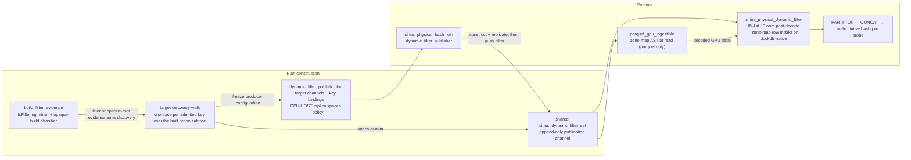
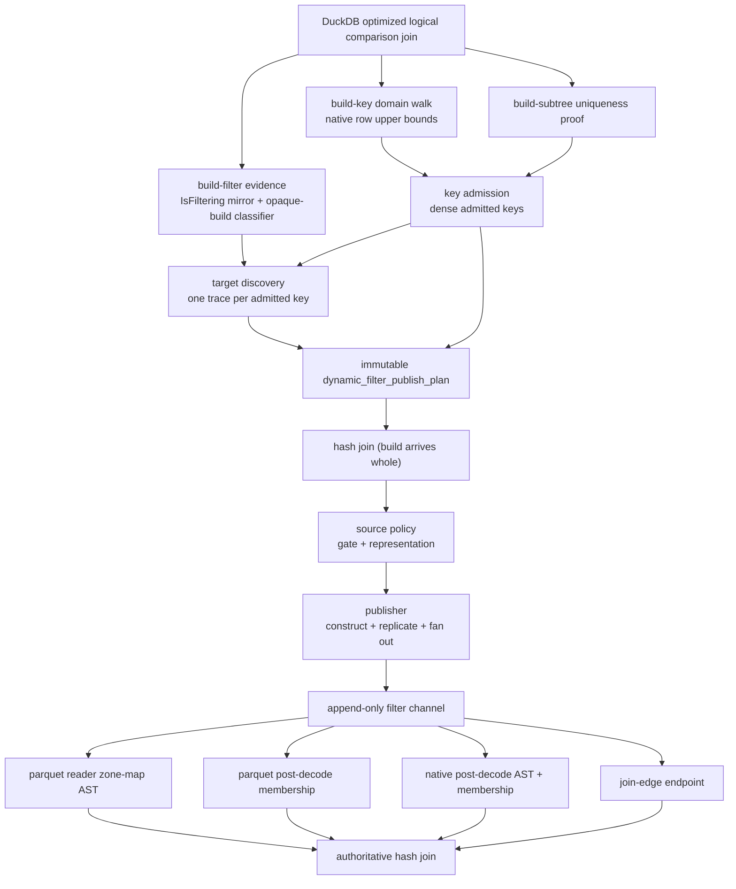
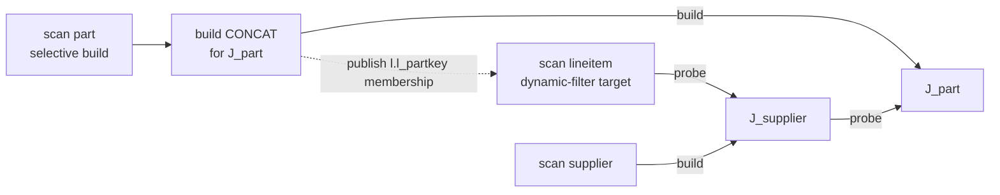
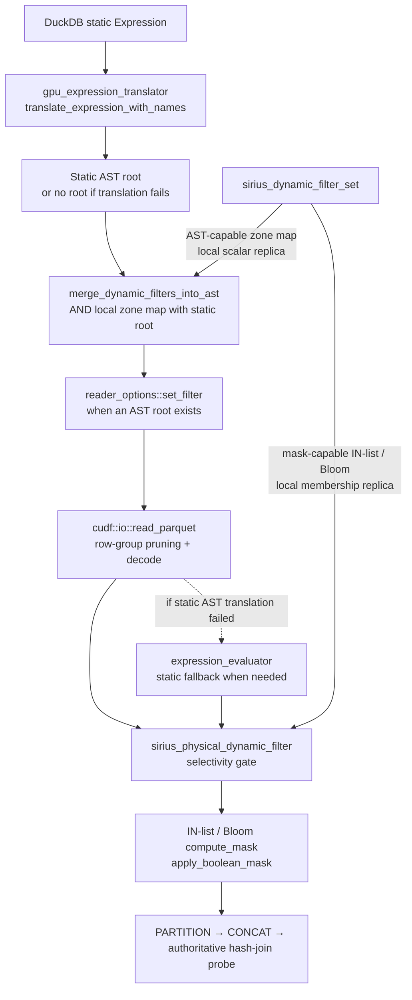

# Dynamic Filters

A **dynamic filter** is a predicate that is computed at query runtime by one operator (the *producer*) and consumed by another (the *consumer*) to prune data. The producer sees data, learns something about it, emits a filter; the consumer uses that filter to do less work — ideally before paying the cost of materialization.

This is a category, not a single feature. It spans:

- **Dynamic table-filter pushdown** — an eligible hash-join build pushes runtime membership filters into a downstream GPU scan (parquet or duckdb-native); an optional zone-map can additionally prune parquet row groups against the actual build-side key range. It is a pure optimization — redundant with the join, so it never changes results. Membership pushdown is **on by default**; zone maps are off by default.
- **Sideways information passing (SIP)** — a hash-join build applies its membership filter inside its own probe subtree, as deep as the key stays a faithful pass-through, so intervening operators also skip rows the join would discard. Controlled by `enable_dynamic_filter`.
- **Aggregation-driven pushdown** — a `GROUP BY` or `DISTINCT` exposes its distinct-value set to downstream consumers.
- **Sort- or top-N-driven pruning** — a post-sort min/max is exact and free; a top-N's current threshold tightens upstream filters.
- **Adaptive runtime predicates** — operators that observe data and refine filters over the lifetime of a pipeline.

Phases 1 and 2 are implemented under `enable_dynamic_filter`; zone maps remain opt-in. Phases 3 and 4 are design only.

## How the phases generalize

The framework has four axes of generality. Each phase opens one axis:

| Axis | Phase 1 | Phase 2 | Phase 3 | Phase 4 |
|------|---------|---------|---------|---------|
| Filter kind | zone map + Bloom + IN-list | (reuses Phase 1's filter zoo) | (reuses) | (reuses) |
| Consumer kind | parquet reader + post-decode scan operator (parquet + duckdb-native) | + membership endpoint spliced into the producer's own probe subtree | + any operator with a column input | (unchanged) |
| Producer kind | hash-join build (any join mode) whose build arrives whole | (unchanged) | + agg, sort, filter | (unchanged) |
| Coordination | single-shot build-port publication; direct probes ordered, transitive scan targets opportunistic | deterministic under the active task strategy; opportunistic under lookahead | (unchanged) | streaming / incremental refinement |

Anything implemented in Phase 1 is reused unchanged by later phases. We do not replace DuckDB's static table-filter pushdown — static filters continue to flow through the existing translator path and are AND-merged with dynamic filters at the consumer.

## Generalized architecture

The framework has four pieces, all designed to be filter-kind, producer-kind, and consumer-kind agnostic:

1. **`sirius_dynamic_filter`** — polymorphic base class for runtime-computed filters. Each subclass knows how to lower itself to a cuDF AST fragment, to a runtime apply pass, or both.
2. **`sirius_dynamic_filter_set`** — thread-safe append-only channel that connects producers and consumers. Push, storage, and lookup share one coordinate: the consumer operator's output ordinal, supplied by the discovery walk.
3. **Target discovery** — `trace_probe_key` walks each admitted key through the producing join's probe subtree. A scan terminal binds to that scan; another terminal may become a join-edge endpoint after direct-route admission.
4. **Producer / consumer roles** — concrete operators that push filters into channels (producers) or read them out (consumers). An operator can be both for different channels.



### Filter polymorphism (filter kind axis)

`sirius_dynamic_filter` is the base for every dynamic filter kind. The base carries the kind tag and the cheap device-availability query common to device-backed filters. Concrete consumer-side capabilities (AST lowering and runtime mask application) live on separate **capability mixin** interfaces that filters inherit alongside the base. Producer-side replica construction is likewise isolated in `sirius_device_replicable`. This avoids forcing a filter to implement a path it cannot satisfy: a bloom filter, which has no meaningful AST representation, simply does not inherit from `sirius_ast_lowerable`.

```cpp
class sirius_dynamic_filter {                  // base — kind + device availability
 public:
  virtual ~sirius_dynamic_filter() = default;
  [[nodiscard]] virtual sirius_dynamic_filter_kind kind() const = 0;
  [[nodiscard]] virtual bool is_available_on_device(int device_id) const noexcept;
};

class sirius_ast_lowerable {                   // capability: AST lowering
 public:
  virtual ~sirius_ast_lowerable() = default;
  [[nodiscard]] virtual cudf::ast::expression const& to_ast(
    cudf::ast::tree& tree,
    cudf::ast::expression const& column_ref,
    int device_id = -1) const = 0;
};

class sirius_dynamic_zone_map_filter
  : public sirius_dynamic_filter,
    public sirius_ast_lowerable,
    public sirius_device_replicable { /* AST consumer + producer replication */ };
```

**Consumer-side dispatch** is by `dynamic_cast` from a `sirius_dynamic_filter` pointer to the capability the consumer needs. The `merge_ast_dynamic_filters_into_tree` helper performs the AST-capability cast internally and silently skips filters that lack it, so consumers building an AST tree don't need any per-call-site logic. `sirius_dynamic_filter::kind()` remains for cases where the consumer needs filter-kind-specific behavior beyond what a capability mixin describes (e.g., a parquet reader that natively understands bloom filters via a path other than `apply`).

**AST lowering** — for consumers that build a `cudf::ast::tree` (parquet reader `set_filter`, expression evaluator). Tree nodes are owned by `tree`; device scalars referenced by literals are owned by the filter instance.

**Runtime apply lowering** — `sirius_mask_applicable` is the sibling capability for consumers that evaluate a filter against a materialized `cudf::column_view`. IN-list and Bloom implement it; zone maps use the AST path.

### Channel — `sirius_dynamic_filter_set` (decoupling axis)

A `sirius_dynamic_filter_set` is the append-only publication channel between producers and a consumer. It owns the filters and is co-owned via `shared_ptr` by every operator that holds either end; it is not a readiness barrier.

Properties:

- **Append-only.** `push_filter(col_idx, f)` adds; nothing removes.
- **Thread-safe.** A mutex guards the underlying map.
- **Push, storage, and lookup share one coordinate** — the consumer operator's output ordinal. The discovery walk supplies it as the trace's exit ordinal: the bound scan's output position for a scan route, the sited operator's output position for a join-edge endpoint. No translation happens inside the channel. Multiple producers targeting the same output column AND-conjoin at the consumer.
- **N producers, one logical consumer endpoint per channel.** Multiple joins may publish into the
  same channel. Multiple consumers use separate channels; the producer can fan the same immutable
  filter object into each one.
- **Filters are co-owned via `shared_ptr<filter const>`.** Producers may push the same filter object into multiple channels. Phase 1 uses this for scan-target fan-out, and a Phase 2 producer with both a scan-routed and a join-edge key fans distinct filters into distinct channels the same way.

Consumer access is via `filters_for_column(col_idx)` and `filtered_columns()`. The free helper `merge_ast_dynamic_filters_into_tree(tree, existing_root, set, resolver)` walks the channel, lowers every AST-capable filter, AND-conjoins the per-column and cross-column fragments, and returns `AND(existing_root, dynamic_root)` — or `existing_root` unchanged if no filter contributed.

### Target discovery — the producing join's own walk (routing axis)

Before constructing the hash join, `sirius_physical_plan_generator::plan_comparison_join` owns the built probe subtree and discovers targets. For each admitted key, `trace_probe_key` follows the shared descent rules from the probe-child ordinal. A GPU table-scan terminal binds the key to that scan. Another terminal is a candidate join-edge site; `place_endpoint` handles it only after `direct_route_admissible` accepts the key. Scan nodes store their channels, allowing multiple producers that reach the same scan to share one. The walk also fans out through physical set operations, though no planner constructs one yet.

Sirius does not consume DuckDB dynamic-filter metadata in production. DuckDB retains that metadata for CPU fallback; the test-only `duckdb_join_filter_candidate_adapter` compares the shared scan-walk cases with `GetPushdownFilterTargets`. Sirius runs discovery only when `build_subtree_is_filtering` or `build_relation_is_opaque` supplies build evidence. The first predicate recursively mirrors DuckDB's `JoinFilterPushdownOptimizer::IsFiltering`. The second is a narrow fallback for a `LOGICAL_DELIM_GET` or `LOGICAL_CTE_REF` build root whose defining subtree is unavailable at this join; it unwraps only valid single-child `LOGICAL_PROJECTION` roots. A visible aggregate, join, distinct, set operation, limit, order, or other non-projection root is never opaque merely because an opaque leaf exists below it. Scan binding also requires `scan_route_join_type_admissible`; join-edge placement requires `direct_route_admissible`. A future Phase 3 producer that must pair with an operator it does not own would need new pairing machinery; nothing does today.

| Build evidence at the producing join | Discovery |
|---|---|
| Any visible build subtree containing a GET table filter, FILTER, or TOP_N | Armed by `build_subtree_is_filtering` |
| DELIM_GET or CTE_REF root, optionally through projections | Armed by `build_relation_is_opaque` |
| Unfiltered visible aggregate or join output | Not armed |
| Opaque leaf below any non-projection wrapper | Not armed |

### Producer / consumer wiring

*Introduced in Phase 1.1.* The **producer-key admission boundary** (called the producer-key
admission *seam* in some issue-planning terminology) is the plan-time boundary where DuckDB join
conditions become Sirius-owned publication metadata. The runtime publisher receives only the
immutable result; it does not reinterpret DuckDB metadata.

Admission is Sirius-owned and reads the conditions alone: it admits every condition that passes its
legality rules (equality, no cast on either carried shape, bound references on both sides, a
cuDF-representable build type). No DuckDB hints exist anywhere in production -- where each admitted
key lands is decided afterwards by the discovery walk, which supplies the scan or endpoint push
ordinal. Publication then constructs a filter only for a key some target binds, so an unbound key
is a recorded legality fact that costs no GPU work.

Three inputs are gathered before physical planning recurses into the join's children:
per-condition domain evidence, the build subtree's uniqueness proof, and either build-evidence
predicate. All three read the logical children, and `create_plan` moves data out of them, so
computing any afterwards would read emptied nodes. If discovery binds no target, the plan is
disabled even if admission found legal keys -- `enabled()` is target-based, not key-based.

The planner-side components and the order they run in:



A **producer** receives an immutable publication plan. It uses a dense admitted-key array for
filter construction and sparse per-target bindings for fan-out:

```cpp
class dynamic_filter_publish_plan {
 public:
  struct admitted_key {
    std::size_t planner_condition_index;       // provenance, in original planner order
    cudf::size_type build_key_ordinal;         // runtime build-table column
    cudf::size_type probe_key_ordinal;         // probe-child output column; a direct route's
                                               // descent entry ordinal
    cudf::data_type storage_type;              // build side
    cudf::data_type probe_storage_type;        // probe side; EMPTY when untranslatable
    dynamic_filter_condition_shape key_shape;  // carried pre-materialization classification
    std::size_t build_key_domain_cardinality;  // 0 = unknown, coverage gates off for this key
    bool build_key_proven_unique;              // arms the membership coverage gate
  };

  struct key_binding {
    std::size_t admitted_key_index;    // dense admitted-key array
    std::size_t channel_push_ordinal;  // this target channel's push space
    cudf::data_type probe_storage_type;
  };

  struct probe_target {
    std::shared_ptr<sirius_dynamic_filter_set> filter_set;
    dynamic_filter_route_class route_class;
    bool accepts_zone_map_filters;
    std::vector<key_binding> key_bindings;
  };

 private:
  std::vector<admitted_key> _admitted_keys;
  std::vector<probe_target> _probe_targets;
  dynamic_filter_publication_policy _policy;  // config-transported, ingress-validated
  std::vector<dynamic_filter_replica_space> _replica_spaces;
};
```

Admission keeps five persisted coordinates distinct:

| Coordinate | Meaning |
|---|---|
| Original condition index | Provenance in the pre-wrap, pre-reorder join-condition vector; also indexes carried pre-materialization shapes and per-condition domain evidence |
| Admitted-key index | Dense position after statically illegal keys are removed |
| Build-key ordinal | Column in the materialized runtime build table |
| Probe-key ordinal | Column in the producing join's probe-child output; the discovery walk's ENTRY ordinal |
| Channel push ordinal | The discovery walk's EXIT ordinal, in the bound consumer's output space: the bound scan's output position for a scan route, or the output space of the operator `place_endpoint` sited the endpoint on for a direct route. Push, store, and lookup are this one coordinate; it equals the probe-key ordinal only when the walk accepted no hop |

The entry and exit ordinals relate only through the walk. Every other index (a target index
selecting matching target entries) aligns plan-construction vectors only and persists nowhere.

The planner freezes routing, placement, and policy into the hash join's `const dynamic_filter_publish_plan`. Each `dynamic_filter_replica_space` pairs one target GPU space with its selected HOST staging space. The build-port hook claims publication as soon as the complete build batch arrives, holding the batch's read-only accessor from before it is routed so the GPU representation cannot be downgraded underneath publication. The producer builds and replicates each filter, then fans it into the accepting channels. Finalization only closes an unclaimed publication window.

A **consumer** holds the channel directly via `std::shared_ptr<sirius_dynamic_filter_set> sirius_dynamic_filters` and reads from it during execution.

## Lifetimes and ordering

**Channel lifetime.** The `sirius_dynamic_filter_set` is co-owned via `shared_ptr` by every operator that references it.

**Scalar lifetime.** Scalars referenced by AST literals or apply kernels are owned by the filter instance, which is owned by the set. The set must outlive any AST tree or apply invocation built from filters it contains.

### Immediate-probe ordering

For a scan that directly supplies a `BUILD_PROBE` join's probe input, the primary publication attempt completes before the scan is activated. Build-side `CONCAT` waits for the build partition pipeline, folds the complete build side into one GPU batch, and synchronously calls `sirius_physical_hash_join::push_data_batch_partitioned("build", ...)`. That call waits for the batch writer event, constructs the filters, completes device replication, fans the ready filters into the channels, and reaches `FINISHED` before returning. Only after the CONCAT task returns does downstream task creation ask that same join for another hint; with build data present and probe data absent, the hint follows the immediate probe producer.

This is an ordering property of the producing join's **immediate** probe edge, not a universal barrier in front of every scan to which DuckDB routes the filter. The following sequence is deliberately scoped to that direct shape:

```mermaid
sequenceDiagram
    participant B as Build GPU_SCAN / PARTITION
    participant C as Build CONCAT (concat_all)
    participant J as Hash join (build arrives whole)
    participant R as Device replica spaces
    participant F as Dynamic-filter channel(s)
    participant T as task_creator
    participant P as Immediate probe GPU_SCAN

    B->>C: Complete all build partitions
    C->>C: Fold the complete build side to one GPU batch
    C->>J: push_data_batch_partitioned("build", batch)
    activate J
    J->>J: Wait for the batch writer event
    J->>J: OPEN → PUBLISHING; construct filters
    J->>R: Materialize device-local replicas
    R-->>J: Replica completion
    J->>F: push_filter(...) fan-out (possibly none by policy)
    J->>J: PUBLISHING → FINISHED
    J-->>C: Publication attempt finished
    deactivate J
    C-->>T: CONCAT task completes; schedule downstream join
    T->>J: get_next_task_hint()
    J-->>T: WAITING_FOR_INPUT_DATA(probe producer)
    T->>P: Create and enqueue probe data-scan tasks
    P->>F: has_filters() and device-local snapshot (never waits)
    P->>P: read_parquet, then membership post-filter
```

### Transitive scan targets and publication timing

The discovery walk traces a key through operators on the probe side, including intervening comparison joins, until it reaches a base scan. Such a scan is a **transitive probe target**: it contributes to the producing join's probe subtree, but it does not directly feed that join's probe port. The producing join's build-port ordering therefore does not gate the scan.

For example, consider this simplified Q8-shaped join:

```sql
FROM lineitem AS l
JOIN supplier AS s ON l.l_suppkey = s.s_suppkey
JOIN part AS p ON l.l_partkey = p.p_partkey
WHERE p.p_type = 'PROMO BRUSHED COPPER'
```

One valid physical shape makes the `supplier` join part of the `part` join's probe subtree:



The filter is still redundant and safe: every `lineitem` row that survives `J_part` must have a key in the filtered `part` build. This is still Phase 1 scan pushdown, not Phase 2 SIP: the discovery walk traverses `J_supplier`'s probe block while finding the target, but `J_supplier` neither consumes nor applies the filter; the `lineitem` parquet scan remains the consumer. Scheduling is different from the direct case, however:

1. `J_supplier` finishes its own build and activates the `lineitem` scan.
2. The task creator can enqueue many `lineitem` GPU scan tasks. Enqueuing does not snapshot the dynamic-filter channel.
3. Probe `PARTITION` and non-`concat_all` `CONCAT` may stream enough `J_supplier` output toward `J_part` while more `lineitem` tasks remain queued or in flight.
4. Once task creation reaches `J_part`, its missing build causes the `part` build subtree to be created.
5. The scheduler dispatches the resulting tasks through its normal device-affinity and queue-order policy. There is no filter-specific preference or readiness barrier.

The transitive consumer remains deliberately opportunistic. It does not create a missing build
task, preempt a running scan, or wait for filter readiness. Splits already past a consumer
checkpoint are not revisited. The discovery walk follows the producing join's probe subtree
through intervening operators to attach the channel to a base scan; the scheduler does not
perform a second filter-specific topology walk.

Issue [#1124](https://github.com/sirius-db/sirius/issues/1124) compared filters disabled, the former
build-subtree preference, and normal scheduling. Every measured scan consumed zero rows before
publication in both filter-enabled configurations, while normal scheduling improved wall time and
reduced variance with bit-identical results and unchanged peak memory. The preference was therefore
deleted. This result motivates the policy but does not create an ordering guarantee for other
workloads; any future consumer that requires ordering must express that dependency explicitly
outside the global scheduler.

Metadata preparation is independent of consumer routing and task scheduling. Footer parsing, split coalescing, and background prefetch preparation may happen before publication; those activities do not decode or materialize table rows and do not snapshot the channel. A queued GPU scan task also has not necessarily consumed the filter yet. A parquet task selects zone maps immediately before `read_parquet` and membership filters in the following fused post-decode operator; publication during decode may therefore still be observed by the later membership stage. A duckdb-native task instead has one post-decode checkpoint that selects both AST-lowerable zone maps and membership filters. Publication after a format's relevant checkpoint cannot make that checkpoint run again.

The channel therefore remains opportunistic and never waits on readiness. A direct target normally observes the completed fan-out. A transitive target racing publication may observe no filter, a subset while `push_filter` appends the individually complete filters, or the full set after publication reaches `FINISHED`; every filter becomes visible only after its own device replicas are ready. An intentionally empty publication, an unsupported or policy-gated key, an unavailable local replica, or a filter disabled by the selectivity gate is always a safe pass-through because the join remains authoritative.

## Static + dynamic filter at the consumer

The static and dynamic filters live on **separate, non-interfering paths**, which is what lets the dynamic side be a pure optimization. `parquet_gpu_ingestible` owns the coalesced DuckDB static expression and translates it for reader pushdown; device-local dynamic AST fragments are conditionally merged during per-split materialization:

- **Static filter** — a `shared_ptr<duckdb::Expression>` (`parquet_gpu_ingestible::_duckdb_filter_expression`), lowered by `gpu_expression_translator::translate_expression_with_names` to a cuDF AST and installed via `reader_options::set_filter` (or, if translation fails, evaluated post-decode by `expression_evaluator`). It is authoritative for correctness and is never touched by the dynamic side.
- **Dynamic filter** — the zone-map is AST-lowerable, so `merge_dynamic_filters_into_ast` (column-name references) AND-merges it onto the reader's filter root, installed via `reader_options::set_filter` (in `parquet_gpu_ingestible::materialize_metadata_to_table`). cuDF's parquet reader uses a `set_filter` predicate both to prune row groups by their statistics *and* to evaluate it row-wise during decode. Membership filters (IN-list / bloom) are not AST-lowerable, so the merge skips them and they are applied **post-decode** by the `sirius_physical_dynamic_filter` operator. Either way the dynamic predicate is a conjunctive *superset* of the join condition, so it never changes which rows survive — the join is authoritative.

The dynamic zone-map AST is merged onto the static filter root when the static filter translated, or built standalone when it did not, so the earlier "translation failed ⇒ dynamic pushdown skipped" restriction no longer applies: the dynamic side contributes regardless of the static filter's translation outcome, and the static filter keeps its own path unchanged.

The duckdb-native GPU scan is post-decode only. It has no reader-side filter hook — decode is Sirius's own native path and static filters are evaluated in `post_filter_and_project` — so its `sirius_physical_dynamic_filter` runs in `include_ast_row_masks` mode: an opted-in zone map is evaluated row-wise via `cudf::compute_column` alongside the membership masks, behind the same gate. Row-group stat pruning in the native metadata walk remains static-only.

This mixing rule is a property of the consumer scan format, not the framework. A Phase 2 join-edge endpoint has no scan format and no reader hook, so it applies membership masks only and merges nothing.



---

## Phase 1 — Dynamic table-filter pushdown

**Goal:** establish the framework end-to-end against a single (producer, consumer) pair — hash-join build → GPU scan (parquet and duckdb-native) — and exercise filter-kind polymorphism via progressively richer filters.

**Producer:** hash-join build side, in any join mode, whose build port delivers the whole build side as one batch.
**Consumer:** GPU scan — parquet (`parquet_gpu_ingestible`: reader zone-map + post-decode operator) and duckdb-native (post-decode operator only).
**Routing:** Sirius-owned discovery (a walk over the built probe subtree binds each admitted key into the scan its trace bottoms out at).
**Coordination:** synchronous build-side CONCAT publication strictly precedes the producing join's immediate probe data scan; transitive scan targets remain nonblocking and race publication under normal scheduler order.

### 1.1 Foundational wiring

Wires the scaffolding into operators end-to-end against a degenerate single-zone (N=1) zone-map filter — equivalent to a global min/max bound. Validates the channel + discovery + consumer-merge plumbing in a real query.

Plan-gen / type plumbing:

- `sirius_physical_table_scan`'s `sirius_dynamic_filters` field (consumer endpoint, attached by the producing join's discovery walk and propagated through `parquet_ingestible_table_info` to `parquet_gpu_ingestible` and through `duckdb_native_ingestible_table_info` to the native ingestible)
- `dynamic_filter_publish_plan::probe_target` entries plus non-owning paired GPU/HOST replica spaces (producer endpoint, held privately by the hash join)
- Plan-gen wiring in `sirius_plan_comparison_join.cpp`, gated by `enable_dynamic_filter`; the join attaches or reuses one channel per bound scan and merges its keys into one target per scan

#### Ordered build-port publication

Publishing from `finalize_operator()` or from the hash-table build would be too late because the `BUILD_PROBE` hash table is constructed only after the first probe batch arrives. The implemented producer instead uses the complete build batch delivered by build-side `CONCAT`; it requires no probe batch and does not depend on the hash-table state machine.

The normal path is deliberately ordered:

1. Pipeline construction places the build child before the probe child. The remainder of this sequence applies when partitioning selects `BUILD_PROBE`.
2. Build `PARTITION` selects `BUILD_PROBE` only when a build-side CONCAT can fold the input, then sets that CONCAT to `concat_all`.
3. Build CONCAT waits for its source pipeline, folds the complete build side to one GPU batch, and synchronously calls `push_data_batch_partitioned("build", batch)`.
4. The hook acquires the batch's read-only accessor before routing it — once deposited into a repository the batch becomes a downgrade candidate, and the shared lock pins its GPU representation until publication completes. It then waits for the representation's writer event, claims `OPEN -> PUBLISHING`, constructs the selected filters, completes device replication, pushes the immutable filters into every accepting channel, and stores `FINISHED` before returning.
5. Only after the CONCAT task returns does downstream task creation ask the join for its next hint and follow `WAITING_FOR_INPUT_DATA` into the immediate probe producer. A scan on that edge therefore cannot run while normal build-port publication is in progress.

The publish gate is `OPEN && _dynamic_filter_plan.enabled() && _build_arrives_whole` in `sirius_physical_hash_join::push_data_batch_partitioned`. Because the publisher is one-shot, the batch it claims must carry the whole build side: a filter built from a slice of the key set would drop probe rows that do in fact join. The join mode is deliberately not part of the condition — a single-partition STANDARD or MIXED_JOIN build publishes on the same terms as a `BUILD_PROBE` one.

That equivalence is about the *gate*, not the *ordering*. The sequence above holds only for `BUILD_PROBE`, whose probe edge cannot be scheduled until the build CONCAT task returns. A non-BUILD_PROBE join instead cross-schedules build and probe pairs as batches arrive on either side (`refresh_cross_schedule` / `peek_cross_schedule_kind`), so nothing holds its probe edge back while publication runs. The newly admitted publishers therefore get opportunistic delivery even on their own probe edge, exactly as [transitive scan targets](#transitive-scan-targets-and-publication-timing) always have: correctness never depends on the filter arriving, only the amount of pruning does.

`sirius_physical_partition` owns that judgement and reports it at sizing time through `set_build_arrives_whole`, in two cases:

- **`BUILD_PROBE`** — whole iff `num_partitions == 1 || broadcast`. Under broadcast the small build table is replicated to every GPU, so each partition's `concat_all`-folded batch is the full build.
- **Any other mode** — a build-side sizing decision that lands in one partition, for a join whose `publishes_dynamic_filters()` is true. The PARTITION then enables build-side `concat_all` on itself or its sibling; the build arrives whole only if such a CONCAT was found, so this is best effort. The canonical client is the **`MIXED_JOIN`** (equality plus inequality conditions), which `compute_hash_join_partition_strategy` excludes from `BUILD_PROBE` and which therefore could not publish at all before. Full-outer joins and builds too large for the hash-table budget reach it the same way. Build-side sizing is a real precondition, not a formality: right-family joins are sized by their probe partition, where one partition says nothing about the build's size, so they remain non-publishers.

Under broadcast there is one build CONCAT per GPU, each racing the build-port hook; the `OPEN -> PUBLISHING` compare-exchange in `publish_dynamic_filters` selects exactly one publisher (the first to arrive), while the rest return at the CAS before constructing anything. A genuinely hash-partitioned (non-broadcast) multi-partition build keeps pushdown disabled, because each partition holds only a slice of the build keys and no single batch could emit a complete filter (cross-partition aggregation is a future extension).

A wired join whose build cannot arrive whole would otherwise publish nothing silently, so the first build delivery that observes the condition logs a `dynamic filter NOT published` diagnostic naming the join mode, and increments `publications_skipped_build_not_whole`. Both fire **once per join**: `_build_arrives_whole` is fixed before the first delivery, so every later build batch of the same join would repeat the same fact.

That sequence does not gate a scan reached transitively through an intervening join. Those targets
run under normal locality-aware dispatch and may observe no filter, a partial fan-out, or the
complete publication at their checkpoints. See
[Transitive scan targets and publication timing](#transitive-scan-targets-and-publication-timing).

The publication attempt may intentionally emit no filter—for example, for an empty build, a cast or unsupported key, a domain-covering key, or a non-selective zone range. That successful no-op is still `FINISHED`. Allocation pressure may also leave an optional replica unavailable. Consumers need no readiness protocol: they test the channel and local device availability and pass the batch through when nothing useful can apply. Replica materialization for every filter kind treats a per-target failure (reservation denial, cloning, copy, or completion synchronize) as best-effort: it is logged and that target's replica is omitted. Source-side construction is fail-open the same way: device memory exhaustion during filter construction ends the window in FAILED, counts publications_failed, and the query continues without filters; nothing is retried under the same pressure.

A batch that arrives non-GPU-resident, or GPU-resident on a device outside the plan's replica set (possible only when the batch was shared with an earlier consumer, e.g. CTE fan-out), skips publication — filters are optional. `on_finalize_operator` never publishes; it only changes an unclaimed `OPEN` state to `CLOSED`. GPU construction and replication run without holding `op_state_mutex`.

Replica bytes use direct peer DMA where empirically verified, otherwise they borrow chunked pre-pinned storage from the planned Sirius/CuCascade HOST memory space. The dynamic-filter code performs no direct pinned allocation and does not modify CuCascade. See [dynamic-filters-multi-gpu.md](dynamic-filters-multi-gpu.md) for the replica design and validation.

**Application in the target scan.** A dynamic join filter is *redundant with the join that produced it*: the join discards every non-matching probe row, so the filter is a conjunctive superset and never has to be exact. The zone map rides the parquet reader's filter: `merge_dynamic_filters_into_ast` AND-merges it onto the reader root and `materialize_metadata_to_table` installs it via `reader_options::set_filter`, so cuDF can prune row groups by statistics and evaluates the predicate during decode. Membership filters (IN-list / Bloom) are not AST-lowerable and ride the **post-decode** path (`sirius_physical_dynamic_filter` → `apply_dynamic_filters_to_view`, `membership_masks_only` mode). On the duckdb-native scan, which has no reader filter, the operator instead runs in `include_ast_row_masks` mode so zone maps apply row-wise there too. The shared `dynamic_filter_gate` measures scan-level and per-filter usefulness before allowing that post-decode cost to repeat. The static filter is untouched and remains authoritative.
>
> **Follow-up — zone-map row-GROUP-only.** Merging the zone-map into `set_filter` enables row-group statistics pruning but also evaluates the predicate row-wise during decode. A row-group-*only* path — evaluate the zone-map against `filter_row_groups_with_stats` and feed only `reader_options::set_row_groups`, never `set_filter` — is **not yet implemented**. The zone-map therefore remains off by default (`enable_dynamic_zone_map_filter`).

> **Redesign note (nsys-driven, SF50).** An earlier implementation applied dynamic predicates redundantly through both `reader_options::set_filter` and an unconditional post-decode `compute_column` + `apply_boolean_mask`. Profiling showed that row-level work regressed scattered-key workloads where it dropped almost no rows. The current design gives each filter kind one path per consumer format: on a parquet scan, zone maps use the reader's `set_filter` and membership filters use the gated post-decode operator; a duckdb-native scan has no read-time filter hook, so its zone maps ride that same post-decode operator as an AST row mask (`include_ast_row_masks`), under the same scan-level gate. Each filter is evaluated exactly once, never redundantly through both paths. Membership filters and duckdb-native zone maps run only while the gate keeps the post-decode operator active; parquet zone maps remain on the reader path outside that gate. The filter never affects results because the join is authoritative.

Zone-map pruning applies when the runtime build-key range excludes row-group ranges in clustered
data. This requires the keyset's narrow range be *runtime*-determined: for a literal/range-derivable
build, DuckDB's static transitive pushdown already prunes, so the dynamic zone-map adds nothing —
hence it is gated off by default (`enable_dynamic_zone_map_filter`). An immediate probe read is
ordered after publication. A transitive target may materialize
early splits first and observes filters opportunistically; for every split that does observe the
zone map, key distribution determines whether row groups can be rejected. Scattered key sets whose
minimum and maximum span the domain are handled by the membership filters below.

### 1.3–1.4 Membership filters (raw/hash IN-list + Bloom)

The zone-map captures only the build keys' `[min,max]` range, so it cannot distinguish a scattered
key set whose bounds span the whole domain — even a highly selective build can span it. Set
**membership** is what distinguishes those keys. Membership filters use the
`sirius_mask_applicable` capability (a `compute_mask(probe) → BOOL` mask, distinct from
`sirius_ast_lowerable`) and have three concrete representations:

- **`sirius_dynamic_small_in_list_filter`** — exact membership for 1–12 null-free INT32/INT64 build rows, counting duplicates. Each successfully materialized device-local replica owns a raw snapshot of the build values (the *needles*), and one CUB bulk kernel compares every probe value with every needle. It has no hash build, slot array, or reserved empty-key sentinel.
- **`sirius_dynamic_in_list_filter`** — hash-based membership via a persistent `cuco::static_set`, with a device kernel probing its read-only set reference. It is exact for representable set keys and conservatively passes cuCO's reserved empty-key value, so it remains a safe join-filter superset.
- **`sirius_dynamic_bloom_filter`** — a `cuco::bloom_filter` (PIMPL'd in a `.cu`; INT32/INT64 keys) at 16 bits/key under Sirius's own fingerprint policy (see [Fingerprint policy](#fingerprint-policy--why-neither-cuco-stock-policy-is-used)), for large builds where the hash IN-list is too big. False positives only let extra rows through — harmless, because the join is authoritative; no false negatives means a true match is never dropped.

**Producer policy** (`choose_membership_filter`). The feature switch `enable_dynamic_filter` emits at most one **membership filter** per key, in this order:

1. Use the raw-needle exact IN-list when `sirius_dynamic_small_in_list_filter::supports(col)` sees 1–12 null-free INT32/INT64 build rows. The gate uses the view's row count, including duplicates; it does not compute distinct cardinality.
2. Otherwise use the hash IN-list when the column is supported and its estimated `cuco::static_set` footprint fits the minimum L2 size across the active probe GPUs — and stays within `dynamic_filter_inlist_max_l2_fraction` of that L2 (default 0.125; 0 always demotes to the Bloom when supported, 1.0 restores the plain fit rule). A GB300 residency sweep showed the set's probe cost is flat below ~0.28 of L2 and degrades beyond, while the smaller (inexact) Bloom probes ≥ 2.2× faster at every hash-set size; the fraction bounds the IN-list to the region where exactness costs the least. When no device L2 size is available the fit rule itself fails closed and publishes a Bloom.
3. Otherwise use the Bloom filter whenever its key type is supported; its bitset may itself exceed L2 for a sufficiently large build.

After the earlier empty-build, cast, and domain-coverage gates, **none** is selected only when the key type has no supported membership representation. The hash-set and Bloom estimates use the build row count (an upper bound on distinct keys) and the planned devices' minimum `cudaDevAttrL2CacheSize`. The small-list decision precedes that L2 comparison and stores exactly the raw INT32/INT64 input bytes; duplicates are harmless because membership is existential.

**Domain-coverage gate.** Before paying to build a membership structure, publication skips a key whose build covers at least `dynamic_filter_domain_coverage_threshold` (default 0.9) of its key domain -- such a filter keeps nearly every probe row, and the consumer-side keep-ratio gate remains the runtime backstop for everything this gate does not catch. The domain (`admitted_key::build_key_domain_cardinality`) is derived at plan time by a positional lineage walk (`planner/dynamic_filter/build_key_domain.hpp`): the build key's output ordinal is followed down through operators whose rows are an injective image of the traced child's rows -- projection/filter/order pass-throughs, LIMIT/TOP_N/DISTINCT, single-grouping-set aggregate groups, SEMI/ANTI/RIGHT_SEMI/RIGHT_ANTI joins on their only emitted block, and MARK/SINGLE joins on their left block -- to a base scan. Every other shape (INNER joins above all: they multiply the traced side's rows) refuses and records 0, which disables the gate for that key. Evidence comes solely from DuckDB-native table scans, whose `NodeStatistics::max_cardinality` (committed rows plus transaction-local inserts) is a true upper bound; Parquet and every other table function are refused as declared scope. Uniqueness matters because only for a unique key is `build_rows / domain` the coverage fraction it claims to be; for duplicate keys the same ratio measures row retention, which can be near 1.0 while the filter is highly selective. Before this mechanism landed the recorded domain was always 0 and both coverage gates were inert; the membership gate alone is live now, and deterministic gate decisions are observable through `SiriusContext::get_dynamic_filter_stats_snapshot()`.

| Condition | Coverage-gate result |
|---|---|
| `threshold > 1.0` | Disabled unconditionally; this is the rollback lever |
| Domain is `0` (evidence refused or absent) | Disabled for that key |
| Key is not proven unique in its base relation | Disabled for that key |
| `build_rows / domain >= threshold` | Fires -- the key is skipped before either filter is built |
| Otherwise | Does not fire |

Exactly `1.0` is an active threshold and fires only at full coverage. The check precedes both constructions, so a firing gate suppresses an opted-in zone map along with the membership filter.

A second switch, `enable_dynamic_zone_map_filter` (default **off**, requires `enable_dynamic_filter`), *additionally* emits a **zone map** (build-key min/max) per key — a complementary consumer path. Parquet scans use it for read-time row-group pruning; duckdb-native scans evaluate it row-wise post-decode. It is off by default because static transitive-predicate pushdown already handles range-derivable builds, while scattered keys may span the domain and provide no useful range restriction. Its publication range-coverage gate is inactive: the only domain evidence is a row count, and a value span divided by a row count over-fires on sparse integer keys, so the gate receives a domain of 0 until base-column value-range evidence exists. On a parquet scan the zone map rides the reader's `set_filter` and is therefore outside the post-decode `dynamic_filter_gate`; on a duckdb-native scan it is evaluated row-wise inside the gated post-decode operator, so it does sit behind that scan-level gate. It is never *per-filter* skipped either way — only membership filters record a marginal keep ratio.

**Consumer**: membership rides the post-decode `apply_dynamic_filters_to_view` path on both scan formats, but in different modes — parquet scans wrap it in `membership_masks_only` (the reader already evaluated the AST-lowerable filters), duckdb-native scans in `include_ast_row_masks`. The zone-map rides the parquet reader's `set_filter` (cuDF prunes row groups by stats and evaluates it during decode); a duckdb-native scan has no reader hook, so that same post-decode pass evaluates the (opted-in) zone map row-wise as an AST row mask alongside the membership masks. Because membership is applied *post-decode*, it can reduce downstream work on dropped rows but cannot avoid scan I/O or decoding.

The **hash-IN-list-to-Bloom** cutover is hardware-adaptive — it replaced an earlier fixed `2M`-row-count threshold — landing at ≈1.5M INT64 keys on a 24 MB L2, ~2.5M at 40 MB, ~6M at 96 MB. A historical TPC-H SF50 sweep showed that cutover to be **wall-clock-neutral** (every query whose kind flipped was flat across `[500K, 8M]`; forcing the affected builds all the way to *none* moved them ≤1.5%, within run-to-run noise). The L2 policy keeps the hash IN-list while it fits L2 and otherwise uses the smaller Bloom; those historical cutover points describe the `dynamic_filter_inlist_max_l2_fraction = 1.0` position — under today's default (0.125) the cutover sits at an eighth of those key counts. All result sets stayed bit-identical across hash IN-list / Bloom / none.

**Adaptive selectivity gate** (`sirius_physical_dynamic_filter::_gate`): the first applicable non-empty batch records the combined keep ratio of everything the operator applied in its cascade — the membership masks, plus (in `include_ast_row_masks` mode, i.e. duckdb-native scans) the zone map's row mask; if it keeps more than `dynamic_filter_keep_threshold` (default 90%) of its rows, the scan-level gate becomes `DISABLED`, otherwise it becomes permanently `ACTIVE`. Within an active cascade, each *membership* filter also records its marginal keep ratio; a membership filter keeping more than 50% of the rows reaching it is skipped on every later split, permanently — rechecking it would cost the very kernel the skip avoids, and a wrong skip only forfeits pruning, never correctness. A selective per-filter reading instead goes stale when the channel grows and is remeasured, since new arrivals change the rows reaching the filter and its cascade position. The AST/zone-map step is cross-column, so it has no per-column ratio to gate on and its drop is deliberately not recorded per-filter — only the scan-level gate can turn a native scan's zone map off. A GPU without a local replica does not train the shared gate. Applicability is lock-free, while rare decision updates are serialized. The gate is filter-count-aware because a direct target normally starts after the complete fan-out, while a transitive target may observe additional filters on later splits; growth re-arms a disabled scan-level gate for one measurement of the larger set and stales selective per-filter readings, but never revives a per-filter skip.

*Follow-ups:* wider and variable-width membership keys. INT32 and INT64 are implemented.

#### Configuration

- `enable_dynamic_filter` (bool, default **true**) — enable target discovery for probe scans and join-edge endpoints. When off, no dynamic-filter channels are created, so neither side wires anything and there is zero overhead.
- `enable_dynamic_zone_map_filter` (bool, default **false**, requires `enable_dynamic_filter`) — additionally emit build-key min/max filters. Parquet scans use them for row-group pruning; duckdb-native scans apply them post-decode. Static pushdown already handles range-derivable builds and scattered keys prune nothing, so enable it only for clustered-keyset workloads whose narrow range is runtime-determined.
- `dynamic_filter_domain_coverage_threshold` (positive finite double, default **0.9**) — skip publishing a key's membership filter when the build covers at least this fraction of the key's domain; fires only for proven-unique build keys with DuckDB-native scan evidence, and the zone-map range gate stays inactive. Above 1.0 the gate is disabled outright (the rollback lever); exactly 1.0 fires only at full coverage.
- `dynamic_filter_inlist_max_l2_fraction` (finite double in [0, 1], default **0.125**) — cap the exact hash IN-list's estimated cuco-set footprint at this fraction of the smallest probe-GPU L2 cache; larger sets publish the Bloom filter instead. `0` always prefers the Bloom when supported; `1.0` reproduces the legacy fit-whole-L2 rule.
- `dynamic_filter_keep_threshold` (finite double in [0, 1], default **0.9**) — consumer-side scan gate: disable a scan's post-decode filtering once a measured split keeps more than this fraction of its rows; 1.0 keeps filtering always on.

The two mode toggles remain accepted in YAML under `sirius.operator_params`.
Their direct DuckDB session overrides are test-only.

Set `dynamic_filter_domain_coverage_threshold` above 1.0 to disable the coverage gate. Set `enable_dynamic_filter` to false to disable discovery and publication.

#### Observability

`SiriusContext` owns connection-lifetime cumulative counters, read through `get_dynamic_filter_stats_snapshot()`; tests take before/after snapshots around a query. The counters split into three families and the split is a contract. `producers_enabled` stands alone as a **plan-time fact**: the hash-join constructor increments it on receiving an enabled plan, before execution begins, so nothing races it. It counts plan constructions rather than executed producers -- the transparent path builds the Sirius plan twice per query, once as a discarded validation plan at prepare and once at execution -- so read it as a direction or compare it across runs, and never anchor an accounting identity on it. It is an honest capability signal: discovery creates a target only when a key actually binds, so an enabled producer always has at least one bound key and a publication attempt that can push — unless the pipeline converter's per-query GPU restriction later disables the plan, which the already-incremented counter does not observe; this is one more reason the counter is a direction, never an identity anchor. The **policy-decision** family (`keys_considered`, `keys_with_known_domain`, `keys_skipped_domain_gate`, `keys_skipped_type_mismatch`, `keys_build_exceeded_domain`, filters built) is deterministic for attempts that reach per-key processing, and is the anchor for gate regressions. The **delivery** family (attempts, finished/failed, source-not-usable (not-resident / non-plan GPU), build-not-whole, targets-drained, `filters_pushed`) races probe-side draining and target liveness: assert it as deltas or directions, never as an equality anchor. `keys_with_known_domain` means only that nonzero row evidence exists -- uniqueness is separate, so the counter alone does not mean the gate was armed.

`publications_skipped_build_not_whole` is the delivery family's one per-join counter: a wired join whose build never arrives as one whole batch can never claim its publication window, and it is counted once, at the first build delivery that observes the condition. It closes the visibility hole that a wired join publishing nothing used to be silent. Read it against the other delivery counters per *delivery*, not per join, and treat those outcomes as disjoint but not exhaustive: a delivery that claims goes on to either attempt publication or report the source not resident, but because this counter is latched, the same join's later non-claiming deliveries are counted nowhere, and neither is a delivery arriving after the window has closed. No sum over the delivery family reaches `producers_enabled`.

#### Ready replicas and per-split snapshots

The publisher constructs every selected zone-map and membership structure and completes all usable device replicas before fan-out begins. It then appends filters to target channels one `push_filter` call at a time. Each filter is therefore immutable and fully ready on every successful replica as soon as it becomes visible, but the complete multi-filter, multi-target fan-out is not an atomic channel operation.

An immediate probe target is activated only after publication reaches `FINISHED`, so it normally sees the complete fan-out. A transitive scan can race fan-out and see none, a safe subset, or the full set. The consumer takes a fresh channel snapshot at each application checkpoint for that reason. An intentionally empty publication, a missing local replica, or applying only a visible subset is always correct because the authoritative join performs the exact match.

### 1.2 Multi-zone zone maps (design only)

The `sirius_dynamic_zone_map_filter` representation supports N zones and lowers them as an OR of bounded ranges, but the current publisher emits one global `(min,max)` zone per key. A future producer could retain per-build-partition bounds; its AST would grow as `O(partitions)` and would need a fallback-to-global budget.

Zone maps currently implement `sirius_ast_lowerable` only. They do not implement the post-decode membership-mask path.

### 1.3 Bloom filter

`sirius_dynamic_bloom_filter` builds a GPU Bloom filter over INT32/INT64 build keys. The consumer applies it post-decode through `sirius_mask_applicable::compute_mask`.

Bloom filters are runtime-only — there is no AST node that evaluates "is this hash in this bitset" without a custom kernel.

A channel may carry both a zone map for the reader and a Bloom for the post-decode operator. Each becomes visible only after its device replicas are ready. A direct target normally sees both; a transitive target can safely observe either one or both at its per-split checkpoints because the filters are optional conjuncts and the join remains authoritative.

**Build heuristic: raw exact list, then fraction-bounded hash set, then Bloom (implemented).** The producer first handles 1–12 null-free INT32/INT64 build rows with a linear scan over raw needles. For larger supported columns, it queries the active GPUs' L2 sizes (`cudaDeviceGetAttribute(cudaDevAttrL2CacheSize)`) and selects the hash IN-list only if its set fits the smallest L2 *and* stays within `dynamic_filter_inlist_max_l2_fraction` of it (default 0.125 — the fraction bounds cache residency under streaming probe traffic, not capacity); otherwise it uses the smaller Bloom, even if that bitset also spills L2. A key type with no Bloom fallback keeps any L2-fitting IN-list. This L2 decision subsumed the original fixed row-count hash/Bloom cutover.

#### Fingerprint policy — why neither cuco stock policy is used

The filter is a `cuco::bloom_filter` at a fixed 16 bits/key over 256-bit (32-byte, i.e. one memory
sector) blocks. cuCollections ships two policies and Sirius uses neither:

- `cuco::arrow_filter_policy` maps the hash to a block with a cheap multiply-shift but hard-caps
  the filter at Arrow's 128 MiB (2²² blocks ⇒ 67.1M keys at 16 bits/key). Every Bloom the publisher
  emits at SF1000 is larger than that, so it was never selected.
- `cuco::default_filter_policy` has no cap but computes `hash % num_blocks`. GPUs have no integer
  divide, so a 64-bit modulo by a runtime value is a long emulated instruction sequence. It — not
  the random gather — dominates the probe kernel.

`sirius_bloom_policy` (in `src/cuda/sirius_dynamic_bloom_filter.cu`) keeps the uncapped sizing and
`default_filter_policy`'s exact hash and fingerprint layout, and replaces only the block index with
Lemire fast-range, `(hash * num_blocks) >> 64`, one `mul.hi.u64`. One policy now covers every size,
so the replica variant carries two alternatives (one per key width) instead of four.

Measured on GB300 (152 SM, 115.5 MiB L2, 7.16 TB/s) at TPC-H SF1000 q21's real probe shape —
389M clustered `l_orderkey` probes per split, `contains_async` only:

| build keys | filter | `hash % n` | fast-range | |
|---|---|---|---|---|
| 73.2M (q21 `l1` key set) | 139.7 MB | 5.06 ms | 2.34 ms | 2.16× |
| 730.8M (q21 `orders` F key set) | 1393.9 MB | 5.21 ms | 2.73 ms | 1.91× |

Filter *size* is not the lever, which is directly falsifiable and was falsified: a 69.8 MB filter
small enough to live entirely in L2 still took 4.93 ms with the modulo against 2.18 ms with
fast-range. Cutting bits/key is likewise not worth it — 8 bits/key bought 1.07× on the probe while
raising the false-positive rate from 0.11% to 2.86%, which on a 6-billion-row scan means ~170M
extra rows handed to the downstream join. Note the asymmetry that hid this: `cuco::static_set`,
backing the hash IN-list, already avoids the divide via `cuco::utility::fast_int` magic-number
reciprocals, so the IN-list never showed the symptom.

Fast-range preserves the no-false-negative contract: it is a deterministic uniform map of a 64-bit
hash onto `[0, num_blocks)` applied identically on `add` and `contains`, so an inserted key always
tests positive. Only the false-positive *set* can move, which is harmless because the join stays
authoritative — and it moved in the right direction, because fast-range consumes the high hash bits
while the fingerprint consumes the low 40, whereas the modulo drew both from the low bits. At the
73.2M-key shape the measured keep ratio fell from 5.002% to 4.878% against a 4.77% true-match rate,
roughly halving the false-positive rate at identical footprint.

### 1.4 IN-list representations (raw needles + hash set)

Both IN-list representations require INT32/INT64 keys **with no nulls** — each `supports()` takes the build `column_view` and rejects `null_count() > 0` — and expose the post-decode `sirius_mask_applicable` runtime path; neither expands keys into an AST. The Bloom's `supports()` tests the key type alone, so a *nullable* INT32/INT64 build key skips both IN-lists and is published as a Bloom. `sirius_dynamic_small_in_list_filter` eagerly copies its input view into an owned raw source-device needle buffer. Its mask kernel performs a linear equality scan for every probe value, so every bit pattern—including the value reserved as the hash set's empty-slot sentinel—is representable. `sirius_dynamic_in_list_filter` instead builds and owns a persistent `cuco::static_set`; its reserved sentinel is conservatively treated as a match to preserve the no-false-negative contract.

For both representations, the constructor enqueues creation of an owned source representation on the source GPU. The caller must keep the build-key backing storage valid until that construction stream completes; the publisher satisfies this precondition by pinning the build representation and synchronizing the stream before replication. After completion, the filter retains no build-key column. Before publication, raw needle bytes or finalized hash-set slots are copied to each additional probe GPU whose target reservation and transfer complete. A replica enters the ready set only after its target stream synchronizes. Every consumer probes only its local read-only representation and passes through if that optional replica is unavailable; teardown selects each replica's owning CUDA device before releasing its storage.

---

## Phase 2 — Sideways information passing (join-edge endpoints)

**Goal:** generalize the *consumer* axis to reach keys no scan can filter. Phase 1 can only prune at a GPU scan the probe-spine trace bottoms out at. Phase 2 places a membership endpoint **inside the producing join's own probe subtree**, at the deepest operator where the probe key is still the same value-preserving column.

**Producer:** hash-join build (unchanged).
**Consumer (new placement):** `sirius_physical_dynamic_filter` in `membership_masks_only` mode, spliced into the producer's probe subtree — the same operator Phase 1 puts above a scan, in a new position. No new operator, no new filter kind, no new code path inside the hash-join probe.
**Routing:** one trace serves both routes, and a scan bind wins. Discovery is armed by visible filter evidence or the narrow opaque-build fallback. A GPU-scan terminal binds to the scan. Any other terminal may receive a join-edge endpoint after direct-route admission.

`build_relation_is_opaque` returns true only when the build root is `LOGICAL_DELIM_GET` or `LOGICAL_CTE_REF`, optionally below a chain of valid single-child `LOGICAL_PROJECTION` roots. These childless roots hide the relation definition from `build_subtree_is_filtering`, so an "unfiltered" result means that the planner cannot inspect the definition rather than that the build covers its whole key domain. Projection is the only transparent wrapper because it does not establish a new relational boundary. A malformed projection returns false, and every other root is a hard false with no arbitrary descendant recursion.

Visible joins, aggregates, distincts, set operations, limits, and orders therefore need actual evidence from `build_subtree_is_filtering`; their structure alone does not establish selectivity. This prevents an unfiltered cardinality-preserving enrichment join from publishing a large no-op membership filter merely because it is a join output. A filtered join or aggregate remains eligible, as does a materialized CTE or DELIM_GET build whose definition is opaque at the producing join. The plan log reports the evidence as `filtered`, `opaque`, or `filtered+opaque`.

The publication-time domain-coverage gate and consumer keep-ratio gate still suppress ineffective filters after discovery, but they are runtime defenses rather than substitutes for plan-time build evidence. The authoritative join preserves results in every case.

**Flag:** the join-edge route uses `enable_dynamic_filter`; it has no separate switch.

### What it reaches that Phase 1 cannot

The canonical shape is `(A join B) join C` where the outer join's key comes from **B**, the inner join's *build* side. At a comparison join, DuckDB's `GetPushdownFilterTargets` descends `children[0]` only -- the probe spine -- so it abandons the push the moment the tracked column comes from a build side, and attaches nothing at all. (Set operations are the one place it fans out into every child, remapping bindings per child; no build side is involved there, so the conclusion is unaffected.) Pushing C's value set onto B wins twice: the inner join builds a smaller hash table, and the key set B later hands to A is drawn from an already-pruned B, hence tighter. Neither win requires new machinery — both fall out of the build-before-probe read order.

### Placement

`planner::place_endpoint` descends from the producing join's probe child, remapping the traced ordinal at each hop, and splices the endpoint above the deepest operator that accepts. The hop rules are a closed, default-free set shared with the scan route's trace: a projection whose output is a plain reference to its input; a `FILTER` (a row predicate over unchanged columns, through its passthrough or gather output); a single-grouping-set `GROUP BY` on a grouping key; a hash join's probe block for `INNER`/`LEFT`/`SEMI`/`ANTI`/`MARK`; a hash join's **build** block for `INNER`/`LEFT`; and another endpoint, which is a pure row mask and therefore transparent. Everything else refuses, and the endpoint lands at the floor — the producing join's immediate probe child — which is always available.

Refusals are correctness rules, not conservatism. Value preservation alone is insufficient: a cardinality-selecting operator (`LIMIT`, `TOP_N`) preserves values yet can *add* a result row if rows are removed beneath it, so it refuses. `RIGHT`/`FULL OUTER` refuse because they null-pad the traced block; `MARK`'s build-block ordinal is a synthetic boolean; `SEMI`/`ANTI` emit no build block; `SINGLE` is unimplemented by the GPU join.

Descending into a join's **build** input is sound only because the producing join compares this key with `equal` and never null-equal. Under `LEFT`, pruning a build row can turn a matched row into a NULL-padded one; that row is dropped at the producing join precisely because a NULL key matches nothing under `equal`. Admission enforces the equality rule as the sole guard, and build-side placement depends on it.

### Coordinates and route exclusivity

The endpoint's push ordinal is the descent's **exit** ordinal, in the sited operator's output space — not the probe-key ordinal it started from, which the two share only when no hop was accepted. Push space, store space, and lookup space are all that one ordinal, on both routes.

One route per key, structurally: both routes are terminal actions of the same per-key trace, so a key's terminal is either a scan bind or an endpoint site and no second walk can disagree. A scan bind wins (it applies earlier and can prune row groups); the join-edge route takes only the keys no scan bound. No key is filtered twice — a known optimization gap: when any branch of a key's trace binds a scan, no endpoint is placed for that key on the other branches, so a mixed UNION-like fan-out filters only through the scan route.

### Ordering

Under the default `active` task strategy, publication completes on build-batch arrival before any operator in the probe subtree is activated, so an endpoint observes the filter. Under the opt-in `lookahead` strategy that ordering does not hold and an endpoint may run first, observe an empty channel, and pass rows through. The loss is pruning, never correctness: the channel never waits and the producing join stays authoritative.

## Phase 3 — Beyond hash-join producers

**Goal:** generalize the *producer* axis. Operators other than hash-join build can produce dynamic filters when they expose useful properties of their output.

**Candidate producer kinds:**

- **Aggregation / DISTINCT.** A `GROUP BY` exposes its distinct-key set; this is an exact IN-list (or large hash-set) for downstream consumers.
- **Sort.** Post-sort, the min/max of the sort key is exact and available for free — strictly cheaper than the `cudf::reduce` path used by hash-join build.
- **Filter (narrowed).** A filter operator that has been further narrowed at runtime (e.g., by an upstream agg pushing an exact set) can republish the narrowed predicate downstream.

Each new producer type carries its own `probe_target`-shaped struct and its own way of pairing with consumers it does not own. The filter zoo, the channel, and the consumer side are unchanged.

This phase is opportunistic — its value depends on where bottlenecks land after Phases 1 and 2. It is in the design so the producer side is not silently locked to "hash-join only" by Phase 1's choices.

## Phase 4 — Dynamic refinement (speculative)

**Goal:** generalize the *coordination* axis — producers update filters incrementally as they observe more data; consumers wait for finalization or apply progressively-tightening filters as they arrive. Use cases: streaming refinement, cross-pipeline channels with no implicit edge, adaptive runtime predicates.

An incrementally refined producer/consumer pair, or a consumer that requires a filter for correctness, would need an explicit lifecycle protocol (for example, versioned snapshots plus readiness/finalization). Nothing implemented needs one: publication is single-shot, immediate probes and join-edge endpoints under the default task strategy are externally ordered after it, and transitive scan targets treat whatever immutable filters are visible as optional pruning. No Phase 4 work is planned until a concrete use case justifies it.

---

## Open questions

1. ~~**Build/probe publication ordering.**~~ **Resolved with two cases.** For the normal GPU-resident `BUILD_PROBE` path, build-side CONCAT calls the publication hook synchronously and the attempt reaches `FINISHED` before downstream scheduling follows that join into its immediate probe producer. A scan reached transitively through an intervening join is not covered by that edge ordering and observes publication opportunistically under normal scheduler order. Metadata preparation may occur before either case and does not snapshot the channel.
2. **AST-size threshold for multi-zone maps.** Phase 1.2's fallback-to-global threshold should be tuned with a microbenchmark on TPC-H Q14 / Q19 once 1.2 lands.
3. **Bloom build-cost gate.** Phase 1.3 uses Bloom when the hash IN-list estimate exceeds the minimum probe-GPU L2, but a separate lower bound on build cardinality (below which Bloom is dominated by zone-map / IN-list) is unspecified. Candidate: skip Bloom when build cardinality < 10k.

## References

- `src/include/op/dynamic_filter/sirius_dynamic_filter.hpp`, `src/op/dynamic_filter/sirius_dynamic_filter.cpp`, `test/cpp/operator/test_sirius_dynamic_filter.cpp` — framework API, zone-map implementation, channel, and focused tests
- `src/cuda/sirius_dynamic_small_in_list_filter.cu`, `src/cuda/sirius_dynamic_in_list_filter.cu`, `src/cuda/sirius_dynamic_bloom_filter.cu` — raw-needle, hash-set, and Bloom membership filters plus replica construction
- `src/include/op/scan/dynamic_filter_merge.hpp`, `src/op/scan/dynamic_filter_merge.cpp`, `test/cpp/scan/test_dynamic_filter_merge.cpp` — consumer-side merge/apply helpers (`merge_dynamic_filters_into_ast`, `apply_dynamic_filters_to_view`, `apply_dynamic_filters_gated_view`)
- `src/planner/sirius_plan_comparison_join.cpp`, `src/planner/dynamic_filter/dynamic_filter_target_discovery.cpp`, `src/include/planner/dynamic_filter/build_filter_evidence.hpp`, `src/planner/dynamic_filter/build_filter_evidence.cpp` — producer plan-gen wiring, the discovery walk, and the build-route evidence predicates (the `IsFiltering` mirror and the opaque-build classifier)
- `src/planner/dynamic_filter/duckdb_join_filter_candidate_adapter.cpp` — TEST-ONLY parity oracle over DuckDB's join-filter metadata (linked into the test target, not production)
- `src/op/sirius_physical_concat.cpp`, `src/op/dynamic_filter/dynamic_filter_publisher.cpp`, `src/op/sirius_physical_hash_join.cpp` — synchronous build-port publication, filter selection/replication, and fan-out
- `src/include/expression_evaluator/gpu_expression_translator_internal.hpp` — existing AST construction patterns (`cudf::ast::tree::emplace`, scalar lifetime)
- `duckdb/src/optimizer/join_filter_pushdown_optimizer.cpp` — `GetPushdownFilterTargets` / `IsFiltering`, the walks Sirius discovery mirrors and the parity oracle compares against

### Validation map

Which test pins which contract, so a change to one knows where its guard lives:

| Test | Contract it pins |
|---|---|
| `test/cpp/planner/test_build_key_domain.cpp` | The lineage walk admits only shapes whose rows are an injective image of the traced child's, and refuses everything else with domain 0 |
| `test/cpp/planner/test_build_filter_evidence.cpp` | The filter-evidence predicate mirrors DuckDB's `IsFiltering` (GET-with-filters, FILTER, TOP_N, any-subtree); the opaque-build fallback accepts bare, projected, and stacked-projection DELIM_GET and CTE_REF roots, and rejects malformed projections, old reducing markers, base scans, and opaque leaves below non-projection wrappers |
| `test/cpp/planner/test_dynamic_filter_key_admission.cpp` | Admission is Sirius-owned and reads the conditions alone; the coordinate spaces stay distinct; only `equal` with a probe-side reference is admitted |
| `test/cpp/planner/test_dynamic_filter_target_discovery.cpp` | The discovery rules: which hop each operator kind accepts (FILTER and UNION fan-out included), how the traced ordinal is remapped, the SIP policy bit, the producer join-type gate, and that trace and splice agree |
| `test/cpp/planner/test_dynamic_filter_discovery_parity.cpp` | Per-key parity with DuckDB's own `GetPushdownFilterTargets`, with every conservative divergence (LIMIT, TOP_N, cast crossing, joint-bail) asserted on BOTH sides |
| `test/cpp/operator/test_dynamic_filter_source_policy.cpp` | Membership-representation selection and both publication gates, as pure functions with no device |
| `test/cpp/operator/test_dynamic_filter_publisher.cpp` | Publication builds filters only for bound keys, fans out sparsely along bindings, and keeps zone maps out of membership-only targets |
| `test/cpp/operator/test_dynamic_filter_publication_claim.cpp` | The build-port claim reads only `_build_arrives_whole`, not the join mode, and a wired join that can never claim is counted and logged once |
| `test/cpp/planner/test_plan_tree_shape.cpp` | Where the endpoint sits in the finished plan tree, including on a join's build input; unfiltered visible aggregate and join-output builds do not wire, filtered equivalents still wire, and opaque CTE/DELIM roots retain their routes |
| `test/cpp/pipeline/test_pipeline_dynamic_filter_native_shape.cpp` | Every endpoint is fed pipelineable data, never a PARTITION's output, on both routes |
| `test/cpp/integration/test_gpu_execution_dynamic_filter_native.cpp` | Scan-route results match CPU exactly, and the coverage gate fires and stays quiet where it should |
| `test/cpp/integration/test_gpu_execution_dynamic_filter_sip.cpp` | Opaque-build and join-edge placements change no result row; a single-partition `MIXED_JOIN` publishes through the partition fold, a multi-partition build publishes nothing and is counted as such, an unfiltered aggregate build arms no producer, and the q17 DELIM_GET route remains active |
