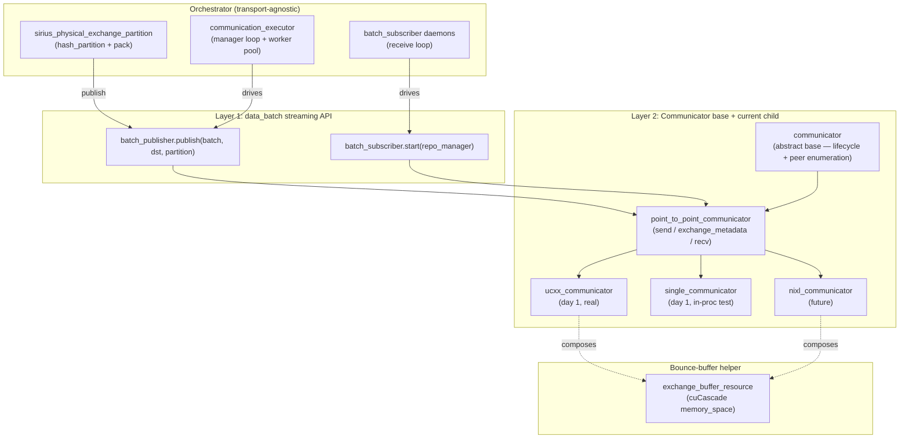
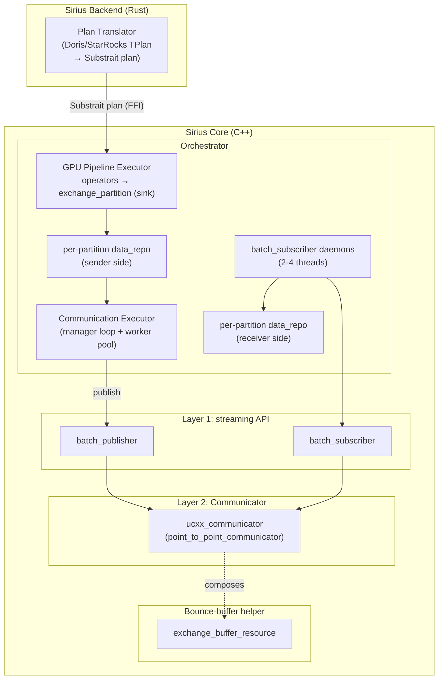
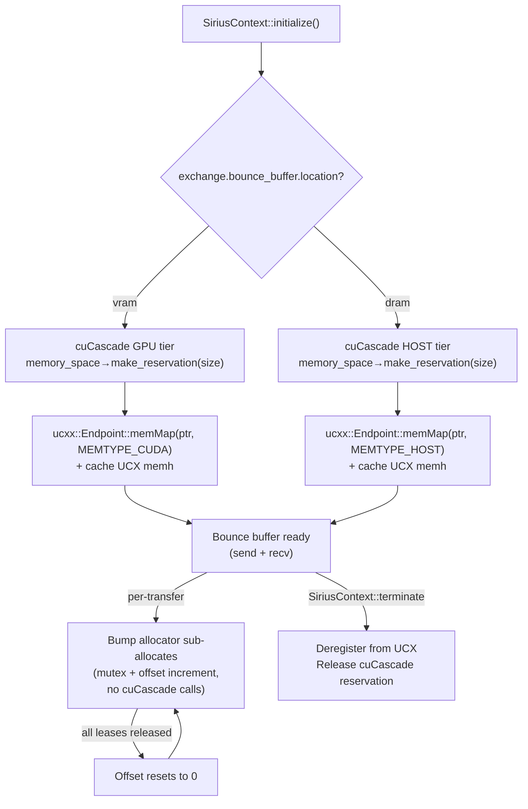
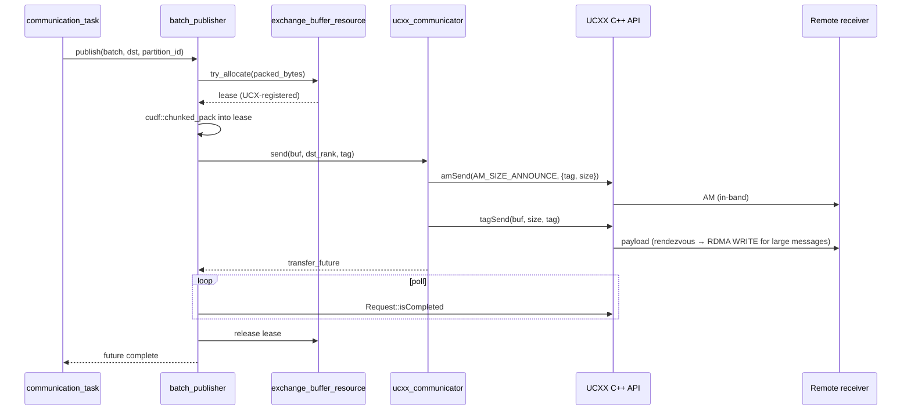
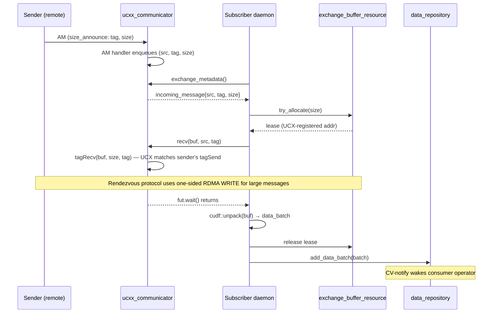

# Exchange Integration

This document specifies the distributed exchange path as a first-class executor in Sirius Core, with overlap between GPU compute and network communication. The design introduces **two composable abstraction layers** plus a thin abstract `communicator` base with `point_to_point_communicator` derived from it, so that the transport library (UCXX day-1, NIXL day-2) can be swapped without touching orchestrator code.

> **Status:** Design proposal — not yet implemented.

## Goals

- Hash partitioning (`cudf::hash_partition`) and packing (`cudf::pack`) execute as a streaming pipeline sink that consumes batches as upstream produces them, so partitioning + packing + network transfer of batch N overlap with GPU compute of batch N+1.
- The transport library is swappable without orchestrator changes: orchestrator code never imports transport-specific headers, and transports are added as additional `point_to_point_communicator` implementations.

```
TIME ═══> [ GPU compute+partition batch 1 ][ GPU compute+partition batch 2 ][ ... ]
                  [ staging + RDMA batch 1 ][ staging + RDMA batch 2 ]
                          ^^^ OVERLAPPED: compute, partition, transfer ^^^
```

## Architecture

### Two layers + an abstract Communicator base

The design has three orthogonal seams. **Layer 1** is what the orchestrator (communication_executor, pipeline operators) sees. **Layer 2** is a thin abstract `communicator` base for what's universal across transports (lifecycle, peer enumeration, diagnostics), with `point_to_point_communicator` derived from it. The base exists so future communicator categories — if and when a use case requires them — can slot in as siblings without restructuring orchestrator code; none ship day-1. The bounce buffer is a separate, optional helper composed only with point-to-point communicators that need explicit per-buffer registration.



The base is intentionally thin: lifecycle, peer enumeration, diagnostic identity. Operational shape (`send` / `exchange_metadata` / `recv`) lives on `point_to_point_communicator`. Keeping the base separate from its current sole child costs almost nothing today and makes any future extension purely additive — a new sibling class plus its impls, no orchestrator changes.

Layer 2 classes are agnostic to the data_batch streaming API. They deal in raw `comm_buffer` (ptr + size + memory kind); the streaming-API layer above is what packs `data_batch` into `comm_buffer` and routes via the communicator.

### Reference patterns

The design mirrors two existing Sirius patterns:

- **PR #675 (sirius IO subsystem)** — `templated_ioctx<Reactor>` parameterized over a backend reactor; cache lives in the base, backends never see cache.
- **PR #731 (Sirius Scan Manager)** — `split_provider` virtual base with a documented lifecycle contract; `parquet_split_provider` is one of N possible implementations.

The two-layer streaming-API + Communicator structure also matches the canonical RAPIDS shuffle library (`rapidsmpf`): a high-level `Shuffler.insert/extract` API on top of a low-level `Communicator.send/recv` virtual base, swapped via `shared_ptr<Communicator>` at construction.

### Why UCXX day-1 (not NIXL)

| Property | NIXL | UCXX tag-matching |
|---|---|---|
| Adapter LOC | ~600 | ~250-400 (with bounce buffer) |
| Bounce buffer needed | Yes | Yes — same rationale (cuCascade allocator, see [Bounce Buffer](#bounce-buffer-orthogonal-helper-driven-by-cucascades-allocator)) |
| Rust FFI on hot path | Yes (gRPC client + server callbacks) | **No** (UCX active messages are in-band, all C++) |
| Memory registration burden | Explicit `registerMem` | Explicit `memMap` |
| Control plane for size discovery | gRPC `ExchangeMetadata` over Rust FFI | UCX active messages, in-band |
| STRING column wire format | At-risk (NIXL RDMA-writes cudf offsets, known to corrupt) | Safe (different wire format) |
| Industry validation | Limited | Strong (rapidsmpf, dask-cuda, all surveyed GPU shuffle systems) |

UCXX day-1 wins on adapter simplicity and eliminates the Rust-FFI hot path. NIXL day-2 then validates the abstraction's compatibility with the explicit-metadata-RPC pattern.

### End-to-end layout



The Rust backend handles plan translation only; the data path stays in Sirius Core with no Rust FFI on the hot path. UCX active messages handle size discovery in-band.

The orchestrator (everything in `core` except `ucxx_communicator` and `exchange_buffer_resource`) **never imports `ucxx.h` or any transport-specific header**. Adding NIXL day-2 is a new `nixl_communicator` deriving from `point_to_point_communicator`; no other code changes.

### Component ownership

| Component | Layer | Location | Notes |
|---|---|---|---|
| `batch_publisher` / `batch_subscriber` (interfaces) | 1 | `src/include/pipeline/` | |
| `communicator_batch_publisher` (impl) | 1 | `src/pipeline/` | wraps any `point_to_point_communicator` |
| `communicator_batch_subscriber` (impl) | 1 | `src/pipeline/` | wraps any `point_to_point_communicator` |
| `communicator` (abstract base) | 2 | `src/include/transport/communicator.hpp` | lifecycle + peer enumeration only |
| `point_to_point_communicator` (abstract child) | 2 | `src/include/transport/point_to_point_communicator.hpp` | operational interface for shuffle |
| `ucxx_communicator` (impl) | 2 | `src/transport/ucxx/` | **Day-1 real backend**; derives from `point_to_point_communicator`; uses UCXX C++ API directly; no Rust FFI |
| `single_communicator` (impl) | 2 | `src/transport/single/` | Day-1 testing seam; derives from `point_to_point_communicator` |
| `nixl_communicator` (impl) | 2 | `src/transport/nixl/` | Future — derives from `point_to_point_communicator` |
| `exchange_buffer_resource` | helper | `src/include/transport/exchange_buffer_resource.hpp` | composed with point-to-point communicators that register explicitly |
| `communication_executor` | exec | `src/include/pipeline/communication_executor.hpp` | uses `batch_publisher`, never imports `ucxx.h` |
| `communication_task` | exec | `src/include/pipeline/communication_task.hpp` | |
| `sirius_physical_exchange_partition` | op | `src/include/op/sirius_physical_exchange_partition.hpp` | |
| UCXX | — | pixi/conda environment | build dependency |

## Layer 1: data_batch Streaming API (orchestrator-facing)

The orchestrator publishes packed `data_batch` instances to remote peers and consumes incoming batches as if they were locally produced. It does not see registration, transports, peers, or tags — those are entirely Layer 2 concerns.

```cpp
namespace sirius::pipeline {

// Sender side — communication_task calls publish() per partition per batch.
class batch_publisher {
 public:
  virtual ~batch_publisher() = default;

  // Publish a data_batch to a destination peer for a partition.
  // Implementation owns: packing, staging, control plane, transport call,
  // and lifetime of the batch until the receiver acknowledges.
  // Future completes when the remote receiver has the data in its
  // data_repository (i.e., downstream is unblocked).
  virtual std::future<void> publish(
    std::shared_ptr<cucascade::data_batch> batch,
    peer_id dst_peer,
    int32_t partition_id) = 0;

  virtual void shutdown() = 0;
};

// Receiver side — runs subscriber daemons. Each incoming batch lands in the
// existing data_repository for the partition; the consumer operator
// pops it via pop_data_batch() exactly like a local batch.
class batch_subscriber {
 public:
  virtual ~batch_subscriber() = default;

  virtual void start(cucascade::data_repository_manager& repo_manager) = 0;
  virtual void shutdown() = 0;
};

}  // namespace sirius::pipeline
```

Day-1 implementations (`communicator_batch_publisher`, `communicator_batch_subscriber`) delegate to a `point_to_point_communicator`. The streaming API is shaped for point-to-point shuffle; orchestrator shapes for other patterns (if and when a use case requires them) would be added as separate Layer-1 surfaces, not by extending `batch_publisher`.

The two sides have asymmetric ownership of their threading. The receiver-side worker pool — the **subscriber daemons** — is owned by `batch_subscriber` and described in the following subsection. The sender-side worker pool is owned by `communication_executor`, which sits in the Sirius task-executor framework rather than in Layer 1; see [Pipeline integration → communication_executor](#communication_executor) for that side, and [Composition flows → Sender path](#sender-path-ucxx-day-1) for the runtime loop.

**Why this is the right level**: the local pipeline pattern is `producer → push_data_batch(port, batch) → repo.add_data_batch(batch) → CV notify → consumer pop_data_batch`. The remote case looks identical end-to-end: a remote partition arrives, the subscriber calls `repo.add_data_batch(batch)`, CV notifies the local consumer.

### Subscriber daemons

`batch_subscriber::start()` spawns a small pool of long-running threads — the **subscriber daemons** — that pull inbound transfers off the wire and land them as `data_batch` instances in the `data_repository`. They are the receiver-side analog of the sender's [`communication_executor`](#communication_executor) workers.

The receive loop:

```cpp
while (running) {
  auto msg = pp_communicator.exchange_metadata();   // blocks for next header
  if (!msg) break;                                   // shutdown
  comm_buffer buf = exchange_buffer_resource.try_allocate(msg->size);
  auto fut = pp_communicator.recv(buf, msg->src, msg->tag);
  fut.wait();
  auto batch = unpack(buf);                          // cudf::unpack
  repo_manager.repository_for(partition_id).add_data_batch(batch);
}
```

#### Why pull-style with daemons

`exchange_metadata()` and `recv()` are orchestrator-facing pull operations on the `point_to_point_communicator`; **someone has to call them**. The daemons are that someone.

A push-style alternative (Communicator invokes a registered callback on data arrival, no daemon) was considered and rejected:

- The callback would run on the transport's internal thread — UCX progress thread (single-threaded, shared across all transfers).
- Doing `cudf::unpack` and `data_repository.add_data_batch` inline on those threads stalls transport progress.
- Backpressure under memory pressure becomes awkward — the transport thread blocks until the repo accepts the batch.

The pull pattern matches the local pipeline pattern (consumer operators pop from `data_repository` on their own threads). The daemon is the remote analog of any other consumer thread. `rapidsmpf` uses the same pull pattern.

#### Lifecycle and pool sizing

- **Spawned** by `batch_subscriber::start()` during `SiriusContext::initialize()`, after the communicator is constructed.
- **Runs** for the lifetime of `SiriusContext`. Multiplexed across all queries; demuxed by `tag` (which encodes `query_id`).
- **Shut down** via `batch_subscriber::shutdown()`. The communicator's `shutdown()` causes `exchange_metadata()` to return `nullopt`; daemon loops exit; threads join.
- **Pool size** default 2-4 threads, configurable. A pool runs `(exchange_metadata → recv → unpack → push)` pipelines in parallel sharing one Communicator. Demultiplexing by `(src, tag)` is what makes parallel daemons safe.

#### Daemon overhead

- **Threads**: 2–4 daemon threads.
- **Per-transfer latency**: ~2 µs thread-handoff. Sub-1% on a 1 ms partition transfer.
- **Memory**: one in-process queue holding incoming-message headers (~32 bytes per entry).

## Layer 2: Communicator base + current child (transport-facing)

An abstract base plus its current child. The base is thin and captures what's universal across transports; the child captures the operational interface for streaming shuffle.

### Abstract base — `communicator`

```cpp
namespace sirius::transport {

using rank_t = int32_t;
using tag_t  = uint64_t;  // encodes (query_id, partition_id, sender_rank)

enum class memory_kind { device, host_pinned };

struct comm_buffer {
  void* ptr;
  size_t size;
  memory_kind kind;
  int device_id;  // -1 for host
};

struct endpoint {
  std::string host;
  uint16_t    port;
  rank_t      rank;
};

class transfer_future {
 public:
  virtual ~transfer_future() = default;
  virtual bool poll() = 0;            // non-blocking; true = done
  virtual void wait() = 0;            // blocks until done
  virtual std::error_code error() const = 0;
};

// Generic and minimal: lifecycle + peer enumeration. No transfer methods.
class communicator {
 public:
  virtual ~communicator() = default;

  virtual void startup(rank_t local_rank,
                       std::vector<endpoint> peers) = 0;
  virtual void shutdown() = 0;

  virtual rank_t local_rank() const = 0;
  virtual size_t world_size() const = 0;

  // Diagnostic: e.g., "ucxx", "single", "nixl".
  virtual std::string_view name() const = 0;
};

}  // namespace sirius::transport
```

The base is intentionally **thin**. It captures only what every transport has in common: lifecycle, peer enumeration, diagnostic identity.

#### Why the abstract base earns its keep

1. **Documents conceptual unity.** Every transport has lifecycle and a notion of "world." Encoding that in the type system is honest.
2. **Uniform shutdown.** `SiriusContext` can hold a `vector<unique_ptr<communicator>>` for clean teardown via one shutdown loop.
3. **Diagnostics / introspection.** Logging, metrics, and runtime configuration display can iterate over all active communicators uniformly.
4. **Future-proofing.** If a future transport category requires an operational shape that doesn't fit `point_to_point_communicator` (e.g., barrier-aligned, stream-coupled, or one-sided primitives), it can slot in as a sibling without restructuring orchestrator code.

What the base does **not** do:

- Define a `transfer()` method or any operational primitive — that would over-unify.
- Assume memory registration semantics. Each child decides — `point_to_point_communicator` impls register per buffer (e.g., UCXX `memMap`); future siblings may register at communicator scope.
- Carry transfer futures or message types in operational signatures — those are operationally-shaped and live on the children.

### Day-1 child — `point_to_point_communicator`

The operational interface for shuffle.

```cpp
namespace sirius::transport {

struct incoming_message {
  rank_t  src;
  tag_t   tag;
  size_t  size;          // declared; receiver allocates accordingly
};

class point_to_point_communicator : public communicator {
 public:
  virtual std::unique_ptr<transfer_future>
  send(comm_buffer src, rank_t dst, tag_t tag) = 0;

  // Receiver-side metadata exchange — block until the next incoming message
  // header arrives. Returns (src, tag, size) so the caller can allocate a
  // correctly-sized buffer. Returns nullopt on shutdown.
  // See "What is a valid point-to-point Communicator?" below for the contract.
  virtual std::optional<incoming_message> exchange_metadata() = 0;

  virtual std::unique_ptr<transfer_future>
  recv(comm_buffer dst, rank_t src, tag_t tag) = 0;
};

}  // namespace sirius::transport
```

**Selection**: factory `make_point_to_point_communicator(config)` returns `unique_ptr<point_to_point_communicator>` based on `exchange.transport: ucxx | single`. The communication_executor receives it at construction; it never imports `ucxx.h` or any transport-specific header.

### What is a valid point-to-point Communicator?

The `point_to_point_communicator` interface is more than a set of method signatures — it is a **contract** about what every point-to-point transport must do. The non-trivial constraint is **per-message size discovery on the receiver side**.

The orchestrator does not know incoming partition sizes ahead of time (partitions are irregular per-peer per-query, depending on upstream pipeline runtime data). The receiver-side flow is therefore split into two steps:

1. `exchange_metadata()` — block until the next message header arrives. Header carries `(src, tag, size)`. **No payload yet.**
2. Subscriber allocates `buf` of `msg.size` bytes from the local `memory_space`.
3. `recv(buf, src, tag)` — land the actual payload into the allocated buffer.

**Every valid `point_to_point_communicator` MUST guarantee:**

- **Size discovery before payload transfer.** `exchange_metadata()` returns the size; `recv()` lands the payload into a caller-provided buffer of that size. The wire-level mechanism is implementation-specific.
- **Tolerance of delay between `exchange_metadata()` and `recv()`.** The orchestrator may take time to allocate. Implementations may need to park senders or pre-stage data in the meantime.
- **Demultiplexing by `(src, tag)`.** Tags are 64-bit and encode `(query_id, partition_id, sender_rank)`. A `recv(buf, src, tag)` call must land the payload of the matching message, not any other.
- **Clean shutdown.** `exchange_metadata()` returns `nullopt`; any pending `recv()` futures resolve with an error.

### Concrete implementations

`point_to_point_communicator` implementations:

| Communicator | Day 1? | How `exchange_metadata` works | How `send`/`recv` works |
|---|---|---|---|
| `ucxx_communicator` (tag-matching) | **Yes (real)** | UCX active messages: receiver pre-posts an AM handler at startup; sender prepends a small AM with `(tag, size)` before `tag_send`. The AM handler enqueues the header. **No gRPC, no Rust FFI.** | `send`: bounce-buffer lease (UCX-registered via `memMap`) + `amSend(size_announce)` + `tagSend(payload)`. `recv`: bounce-buffer lease + `tagRecv(buf, src, tag)`. UCX matches by tag; rendezvous protocol uses one-sided RDMA on the wire for large messages. |
| `single_communicator` | **Yes (test)** | Same-process queue: `send()` pushes `(buf, src, tag, size)`; `exchange_metadata()` peeks the next entry to surface the header. No RPC, no parking. | `send` pushes onto in-process queue keyed by dst rank. `recv` `cudaMemcpyAsync`s the staged buffer into the caller-provided buffer. |
| `nixl_communicator` (future) | Future | Internal gRPC server receives `ExchangeMetadata` RPC carrying `tag` + `size`; pushes header into incoming queue and **parks the gRPC handler on a promise indexed by tag**. Requires Rust FFI for tonic gRPC. | `send`: bounce-buffer lease + gRPC `ExchangeMetadata` (Rust FFI) for dst addr + NIXL `postXferReq` + `getXferStatus` polling + final `TransferComplete` RPC. `recv`: resolves parked handler with buffer addr + recv NIXL metadata. |
| `ucxx_rma_communicator` (future) | Future | gRPC `ExchangeMetadata` RPC mirroring NIXL. Same parking-promise pattern. | `send` issues `memPut` for one-sided RDMA WRITE; `recv` polls completion. Memory registration explicit, with the same bounce buffer. |

### Tag matching at two layers

Even `nixl_communicator` does tag matching, but at a different layer than UCX. The "tag" in the `point_to_point_communicator` interface serves as a **demultiplexing key** for concurrent in-flight transfers:

- Multiple `ExchangeMetadata`-equivalent events can be in flight at once, parked at different promises.
- Multiple subscriber daemons can call `recv(buf, src, tag)` concurrently.
- The communicator looks up the right parked promise / pre-posted recv by tag.

For NIXL this happens in the shim layer (gRPC server's parking-promise map). For UCX tag-matching, UCX library itself does it at the transport. The orchestrator-facing API is the same.

## Bounce Buffer (orthogonal helper, driven by cuCascade's allocator)

A bounce buffer is required when **all three** of the following are true for a transport:

1. The transport's API requires the caller to register memory before each transfer (rather than registering implicitly or once at communicator setup).
2. Each registration is **expensive** — kernel-level page pinning, RDMA key creation, agent locking. Easily >100 µs per call.
3. The transport's internal caches don't catch the memory we actually use (RMM's `cuda_async_memory_resource`, i.e. `cudaMallocAsync`).

For Sirius today, condition (3) holds for any UCX-backed transport because UCX classifies `cudaMallocAsync` pointers as `UCS_MEMORY_TYPE_CUDA_MANAGED` (`cuda_copy_md.c` lines 658-668). This classification feeds **both** UCX rcache and `MEMTYPE_REG_WHOLE_ALLOC_TYPES`. Neither cache kicks in.

**The bounce buffer is therefore needed for any point-to-point transport that registers buffers explicitly — UCXX (tag-matching), NIXL, UCXX one-sided RMA — as long as cuCascade uses `cuda_async_memory_resource`.**

| Communicator | Day 1? | Explicit registration | Pool-level cache catches RMM-async | Needs bounce buffer |
|---|---|---|---|---|
| `ucxx_communicator` (tag-matching) | **Yes (real)** | Yes (`memMap`) | No | **Yes** |
| `single_communicator` | **Yes (test)** | No (in-process `cudaMemcpyAsync`) | N/A | No |
| `nixl_communicator` (future) | Future | Yes (`registerMem`) | No | Yes |
| `ucxx_rma_communicator` (future) | Future | Yes (`memMap`) | No | Yes |

```cpp
namespace sirius::transport {

class exchange_buffer_resource {
 public:
  // memory_space* selects GPU (Tier::GPU) vs HOST (Tier::HOST) — config-driven.
  exchange_buffer_resource(cucascade::memory::memory_space* space,
                           size_t size_bytes);

  // Bump-alloc lease from the pre-registered region.
  std::optional<bounce_buffer_lease> try_allocate(size_t size);
};

}  // namespace sirius::transport
```

`ucxx_communicator` constructor takes `exchange_buffer_resource*` and registers the buffer with UCX once at startup via `memMap`. `single_communicator` takes nothing.

### GPU vs Host placement

The bounce buffer can reside in GPU memory or host-pinned memory. The optimal choice depends on hardware:

| System | Recommended | Why |
|---|---|---|
| **NVL72 / GB200** | GPU (`vram`) | NVSwitch provides 1.8 TB/s GPU-to-GPU. GPUDirect RDMA sends directly from GPU memory via dedicated per-GPU NIC. Copying to host wastes bandwidth. |
| **A100 / H100** | GPU (`vram`) | Large BAR1 (16+ GB) supports GPUDirect RDMA for large registrations. GPU-to-NIC path bypasses CPU entirely. |
| **T4** | Host (`dram`) | BAR1 is only 256 MB — too small for large GPU RDMA registrations. Host-pinned memory avoids the BAR1 constraint. |
| **L4** | Host (`dram`) | PCIe-only, constrained BAR1. Same rationale as T4. |
| **No RDMA NIC** | Host (`dram`) | Must stage through host for TCP/socket transport. |

Placement is config-driven via `memory_space*` (see [Configuration](#configuration)).

### Lifecycle



The cuCascade reservation is held for the process lifetime and is **not reclaimable** by the downgrade executor.

### Sender and receiver bounce buffers

`ucxx_communicator` allocates **two** bounce buffers at startup — one for sending and one for receiving:

| Buffer | Purpose | Used by |
|---|---|---|
| **Send bounce buffer** | Holds packed data before transfer | `communicator_batch_publisher` packing path |
| **Recv bounce buffer** | Destination for incoming transfers | Subscriber daemons via `exchange_buffer_resource.try_allocate` |

Both are pre-registered with UCX at startup. UCX memh handles are cached once and reused for all transfers.

### Bump allocator

A single bounce buffer is shared across all concurrent transfers. To support multiple concurrent leases, sub-allocation uses a bump allocator — independent of cuCascade's reservation system.


- 256-byte aligned sub-allocations, managed by bump pointer (mutex + offset increment).
- Epoch-based reset: when all active leases release → offset resets to 0.
- Overflow: fall back to per-transfer cuCascade reservation + UCX `memMap` (slow path).

### Future: dropping the bounce buffer

If cuCascade is migrated to `pool_memory_resource{cuda_memory_resource}` (synchronous `cudaMalloc`-backed), UCX classifies allocations correctly as `UCS_MEMORY_TYPE_CUDA`, rcache amortizes registrations across same-pool allocations, and the bounce buffer becomes unnecessary. That's a separate cuCascade-level change, not a transport-level decision.

## Composition flows

### Sender path (UCXX day-1)



#### Step-by-step

1. **Task arrival.** `task_creator` detects a partition's data is ready in an exchange data_repository (populated by `sirius_physical_exchange_partition`), creates a `communication_task(batch, dst_peer, partition_id)`, and enqueues it on `communication_executor`.
2. **Worker dispatch.** The manager loop reserves a worker slot, pops the task, dispatches the worker function on a thread.
3. **`publish()` invoked.** The worker calls `_publisher->publish(batch, dst_peer, partition_id)`. The publisher: (a) calls `EBR.try_allocate(packed_bytes)` for a sender-side bounce-buffer lease, (b) runs `cudf::chunked_pack(batch)` into the lease, (c) calls `ucxx_communicator::send(buf, dst_rank, tag)` where `tag = encode(query_id, partition_id, sender_rank)`, (d) returns an outer future to the worker.
4. **`ucxx_communicator::send`** issues two UCX operations: `amSend(AM_SIZE_ANNOUNCE, {tag, size})` — a small active message announcing the upcoming payload (the receiver's pre-posted AM handler enqueues this for `exchange_metadata()` to surface) — followed by `tagSend(buf, size, tag)` for the payload, which returns a `ucxx::Request` wrapped in a `transfer_future`.
5. **Worker blocks.** The worker calls `outer_fut.wait()`.
6. **Rendezvous executes.** UCX progress (driven by the UCXX progress thread) advances the rendezvous protocol once the receiver posts the matching `tagRecv`: memory keys are exchanged, and the receiver-side NIC RDMA-writes the payload directly into the receiver's bounce-buffer lease.
7. **UCX request completes.** Once the rendezvous handshake is done and bytes have landed at the receiver, UCX marks `Request::isCompleted = true`. The publisher releases the sender's bounce-buffer lease and signals the outer future.
8. **Worker unblocks.** `outer_fut.wait()` returns. Worker calls `mark_task_complete()`, slot is freed, manager loop moves on.

#### Pseudocode

Two cooperating threads — a manager thread and a pool of worker threads. Both are permanently in a loop blocked at well-defined points.

```cpp
// Manager thread (one per communication_executor)
void communication_executor::manager_loop() {
  while (_running) {
    auto slot = _bounded_pool->reserve();   // BLOCKS until a worker slot is free
    auto task = _task_queue.pop();          // BLOCKS until task_creator enqueues a task
    if (!task) break;                       // shutdown sentinel

    // Lightweight bookkeeping — no transport touch, no GPU touch.
    estimate_costs(*task);
    attach_local_state(*task);

    _bounded_pool->dispatch(slot, [this, task = std::move(task)]() mutable {
      worker_fn(std::move(task));
    });
  }
}

// Worker thread (one of N in the pool — transport-agnostic)
void communication_executor::worker_fn(std::unique_ptr<communication_task> task) {
  auto fut = _publisher->publish(task->batch, task->dst_peer, task->partition_id);
  try {
    fut.get();                              // BLOCKS until rendezvous done + lease released
    mark_task_complete(*task);
  } catch (const transport_error& e) {
    handle_retry(std::move(task), e);       // re-enqueue with backoff
  }
}
```

Inside `publish()` (Layer 1 impl):

```cpp
std::future<void> communicator_batch_publisher::publish(
    std::shared_ptr<cucascade::data_batch> batch,
    peer_id dst,
    int32_t partition_id) {
  auto promise   = std::make_shared<std::promise<void>>();
  auto outer_fut = promise->get_future();

  auto lease = _ebr->try_allocate(estimated_packed_size(batch));
  cudf::chunked_pack(batch->view(), lease.ptr());

  auto tag       = encode_tag(_query_id, partition_id, _sender_rank);
  auto inner_fut = _pp_comm->send({lease.ptr(), lease.size()}, dst.rank, tag);

  // Hook the inner future's completion to fulfill the outer one. The callback
  // runs on whichever thread fulfills inner_fut — typically the UCX progress thread.
  inner_fut->on_complete(
    [promise, lease = std::move(lease)](std::error_code ec) mutable {
      lease.release();                      // bounce-buffer lease back to pool
      if (ec) promise->set_exception(make_exception(ec));
      else    promise->set_value();
    });

  return outer_fut;
}
```

Inside `send()` (Layer 2 impl, UCXX):

```cpp
std::unique_ptr<transfer_future>
ucxx_communicator::send(comm_buffer src, rank_t dst, tag_t tag) {
  auto& ep = _endpoints[dst];

  size_announce_header hdr{tag, src.size};
  ep.amSend(AM_SIZE_ANNOUNCE, &hdr, sizeof(hdr));     // doorbell — no payload

  auto req = ep.tagSend(src.ptr, src.size, tag);      // posts payload, returns ucxx::Request
  return std::make_unique<ucxx_transfer_future>(std::move(req));
}
```

Threads, blocking points, and how each gets unstuck:

| Thread | Blocked at | Unstuck by |
|---|---|---|
| Manager | `_bounded_pool->reserve()` | A worker finishing and releasing its slot |
| Manager | `_task_queue.pop()` | `task_creator` enqueuing a task (CV-notify on the queue) |
| Worker | `outer_fut.get()` | UCX progress thread firing `inner_fut->on_complete` → `promise.set_value()` → CV-notify |
| UCX progress (per UCP worker) | nothing — runs `ucp_worker_progress` in a tight loop forever | n/a |

#### Futures in flight

Three futures exist per transfer — two on the sender, one on the receiver:

| # | Future | Type | Created by | Waited on by | Resolves when |
|---|---|---|---|---|---|
| 1 | Sender inner | `transfer_future` (Layer 2) | `ucxx_communicator::send()` | Publisher, via UCX progress callback | UCX rendezvous completes — bytes at receiver's bounce buffer |
| 2 | Sender outer | `std::future<void>` (Layer 1) | `batch_publisher::publish()` | `communication_executor` worker thread | Inner future done + sender lease released + error packaged |
| 3 | Receiver | `transfer_future` (Layer 2) | `ucxx_communicator::recv()` | Subscriber daemon thread | UCX matches + payload landed in receiver's lease |

The worker thread sees only the **sender outer** future; it never touches `transfer_future` or `ucxx::Request` directly. That's the seam between Layer 1 and Layer 2 — the worker is transport-agnostic, the inner future is transport-specific. The hop from inner to outer is implemented as a completion callback registered with the UCX progress thread: when progress sees `Request::isCompleted`, it fulfills the outer promise. No spinning thread per transfer.

Futures 1 and 3 are paired by the UCX rendezvous protocol: they resolve at the same wire moment (the handshake doesn't complete until both sides are present).

The receiver has no Layer-1 outer future because the daemon thread does all the post-transfer work — unpack, release, `add_data_batch` — inline in its loop body. There's no async handoff, so wrapping it in an outer future would be redundant.

#### Sender completion semantics

Step 7's "done" means **bytes are in the receiver's bounce buffer** — UCX rendezvous has fully completed at the wire level. It does *not* mean the receiver's daemon has called `cudf::unpack` and `add_data_batch`. Those happen asynchronously on the daemon thread and are not signaled back to the sender. End-to-end "data is in repo" semantics would require an extra ACK message; the design intentionally omits it (extra round-trip + longer bounce-buffer lease hold = worse throughput).

Backpressure works without an explicit ACK because of the receiver-side bounce-buffer pool: if the receiver can't allocate (pool exhausted), the daemon can't post `tagRecv`, the rendezvous stalls, and the sender's UCX request stays pending. The worker thread sits in `outer_fut.wait()` until the receiver's pool frees up.

The publisher implementation is **transport-agnostic** — it composes with any `point_to_point_communicator`. UCXX-specific behavior (active messages, tag matching) lives entirely inside `ucxx_communicator::send()`. **No Rust FFI on the hot path.**

For `single_communicator`, the same `publish()` flow ends in a `send()` call that pushes onto an in-process queue — no UCX, no AM, no bounce-buffer registration.

### Receiver path (UCXX day-1)



#### Step-by-step

Subscriber daemons run a long-lived loop (2–4 threads). Each iteration:

1. **Header arrives.** While the daemon is waiting in step 2, the sender's `amSend(AM_SIZE_ANNOUNCE)` arrives at the receiver's UCX worker. The pre-posted AM handler enqueues `(src, tag, size)`.
2. **`exchange_metadata()` returns.** The daemon calls `pp_communicator.exchange_metadata()`, which blocks until a header is available, then returns `incoming_message{src, tag, size}`. Returns `nullopt` on shutdown.
3. **Allocate recv buffer.** Daemon calls `EBR.try_allocate(msg.size)` for a receive-side bounce-buffer lease. If the pool is full, the daemon retries — this is the implicit backpressure point that throttles senders (see [Sender completion semantics](#sender-completion-semantics)).
4. **Post recv.** Daemon calls `ucxx_communicator::recv(buf=lease, src, tag)`, which posts a `tagRecv` matching the sender's pending `tagSend`. Returns a `transfer_future`.
5. **Rendezvous completes.** UCX matches the tags, exchanges memory keys, and the sender-side NIC RDMA-writes the payload into the lease. Bytes are now in receiver memory.
6. **`recv_fut.wait()` returns.** The daemon thread unblocks.
7. **Unpack.** Daemon calls `cudf::unpack(buf)` to materialize an owning `data_batch` from the packed columns. The unpack must produce an owning copy (deep copy out of the bounce buffer into permanent cuCascade-tier memory) so the bounce-buffer lease can be released next without dangling references.
8. **Release lease.** Daemon returns the bounce-buffer lease to the pool. This frees a slot for the next inbound transfer — and unblocks any sender whose rendezvous was stalled on receiver-pool pressure.
9. **Hand to repo.** Daemon calls `repo_manager.repository_for(partition_id).add_data_batch(batch)`. The CV inside the repository wakes any consumer operator blocked on `pop_data_batch`.
10. **Loop.** Daemon goes back to step 2.

#### Pseudocode

A single thread type — the subscriber daemon — runs an infinite loop. 2-4 daemons share the same `_incoming_metadata` queue and CV; `notify_one` distributes work among them.

```cpp
void subscriber_daemon::run() {
  while (_running) {
    auto msg = _pp_comm->exchange_metadata();    // BLOCKS until a header is queued (or shutdown)
    if (!msg) break;                              // exchange_metadata returned nullopt — shutdown

    auto lease = _ebr->try_allocate(msg->size);   // may block briefly under bounce-buffer pressure
    auto fut   = _pp_comm->recv(lease, msg->src, msg->tag);
    fut->wait();                                  // BLOCKS until rendezvous lands bytes in lease

    auto batch = cudf::unpack(lease);             // owning copy out of lease
    lease.release();                              // lease back to pool — frees a slot for the next inbound transfer
    _repo_manager->repository_for(msg->partition_id).add_data_batch(batch);
  }
}
```

Inside `exchange_metadata()` and the AM handler (Layer 2 impl, UCXX):

```cpp
std::optional<incoming_message> ucxx_communicator::exchange_metadata() {
  std::unique_lock lk(_metadata_mutex);
  _metadata_cv.wait(lk, [this] {
    return !_incoming_metadata.empty() || _shutdown_requested;
  });
  if (_incoming_metadata.empty()) return std::nullopt;
  auto msg = _incoming_metadata.front();
  _incoming_metadata.pop_front();
  return msg;
}

// Registered once at startup; fires on the UCX progress thread when an AM arrives.
void ucxx_communicator::am_handler(const Header& header) {
  auto [src, tag, size] = decode(header);
  {
    std::lock_guard lk(_metadata_mutex);
    _incoming_metadata.push_back({src, tag, size});
  }
  _metadata_cv.notify_one();
}
```

Threads, blocking points, and how each gets unstuck:

| Thread | Blocked at | Unstuck by |
|---|---|---|
| Daemon | `exchange_metadata()` (CV on `_incoming_metadata`) | AM handler push + `cv.notify_one()` (handler runs on UCX progress) |
| Daemon | `_ebr->try_allocate()` | Another daemon completing step "lease release" — frees a slot in the bounce-buffer pool |
| Daemon | `recv_fut->wait()` | UCX progress thread firing the recv's completion callback → `promise.set_value()` → CV-notify |
| UCX progress (per UCP worker) | nothing — runs `ucp_worker_progress` in a tight loop forever | n/a (also dispatches inbound AMs to `am_handler` and runs recv-future callbacks) |

The structural symmetry with the sender: each side has a permanent-loop application thread (worker on sender, daemon on receiver) blocked on a CV, and a UCX progress thread silently driving completions. The asymmetry is just that the sender separates manager and worker (cuCascade reservation logic warrants the split), while the receiver fuses them into one daemon (no reservation step before posting recv — backpressure happens at `try_allocate`).

The subscriber daemon is **transport-agnostic**. Whether bytes arrived via UCX rendezvous-RDMA into a pre-registered bounce buffer or via in-process `cudaMemcpyAsync` from `single_communicator`, the unpack-and-publish step is identical.

## Pipeline integration

### `sirius_physical_exchange_partition`

**Files**: `src/include/op/sirius_physical_exchange_partition.hpp`, `src/op/sirius_physical_exchange_partition.cpp`

A dedicated pipeline operator that runs hash partitioning and packing inside the GPU pipeline:

- Extends `sirius_physical_operator`.
- Registered in `sirius_physical_plan_generator` for exchange sink plans.
- Acts as a pipeline sink (barrier), in the same shape as `sirius_physical_partition`.
- During `execute()`: runs `cudf::hash_partition` on the input data.
- During `sink()`: packs each partition via `cudf::pack` and publishes per-partition packed data to exchange data repositories.
- Each partition's data repository feeds into a `communication_task` routed to `communication_executor`.

Partitioning overlaps with upstream GPU compute — as batch N is being partitioned, batch N+1 can already be computing in the GPU pipeline executor.

### `communication_executor`

**Files**: `src/include/pipeline/communication_executor.hpp`, `src/pipeline/communication_executor.cpp`

Extends `itask_executor`, following the same pattern as `gpu_pipeline_executor`. It does not know about UCX, NIXL, or bounce buffers — it composes with a `batch_publisher`:

```cpp
class communication_executor : public sirius::parallel::itask_executor {
 public:
  explicit communication_executor(
    exec::thread_pool_config config,
    std::unique_ptr<sirius::pipeline::batch_publisher> publisher,
    sirius::parallel::downgrade_executor* downgrade_executor = nullptr);

  void set_task_creator(sirius::creator::task_creator* task_creator);
  void set_completion_handler(completion_handler* handler) noexcept;

 protected:
  void manager_loop() override;
  absl::AnyInvocable<void() noexcept> get_per_thread_init() override;

 private:
  std::unique_ptr<sirius::pipeline::batch_publisher> _publisher;
  sirius::parallel::downgrade_executor* _downgrade_executor{nullptr};
  // … task_creator, completion_handler, queue …
};
```

The manager loop is lightweight (reservation + dispatch only) and the worker function is transport-agnostic — for the runtime loop in detail, including blocking points and how each thread gets unstuck, see [Sender path → Pseudocode](#pseudocode). For the semantic meaning of `fut.wait()` returning, see [Sender completion semantics](#sender-completion-semantics).

Whether `_publisher` was constructed against a `ucxx_communicator` or `single_communicator` is invisible at this layer.

### `communication_task`

**Files**: `src/include/pipeline/communication_task.hpp`, `src/pipeline/communication_task.cpp`

```cpp
class communication_task : public sirius::parallel::sirius_pipeline_itask {
 public:
  void execute(rmm::cuda_stream_view stream) override;

 private:
  std::shared_ptr<cucascade::data_batch> _batch;
  peer_id  _dst_peer;
  int32_t  _partition_id;
  int      _retry_count{0};
  uint64_t _original_task_id;
  // Note: no bounce_buffer_lease, no transport handles — those live inside the publisher.
};
```

### `task_creator` integration

In `task_creator` (`src/creator/task_creator.cpp`):

- Watches exchange data repositories for ready partitions (populated by `sirius_physical_exchange_partition`).
- When a partition's data is available, creates a `communication_task`.
- Routes the task to `communication_executor` instead of `gpu_pipeline_executor`.


### Retry mechanism

Retry triggers follow the OOM reschedule pattern from `gpu_pipeline_task.cpp` (lines 225-312). All retries happen at the `communication_task` level, not inside the publisher or communicator:

| Trigger | Where | Behavior |
|---|---|---|
| **Sender reservation failure** | Manager loop (sender's cuCascade reservation for staging) | Back off 5 ms, trigger downgrade, retry. Max 10 retries per task. |
| **Transport timeout / failure** | `transfer_future.error()` after `wait()` | For UCXX day-1, this covers both genuine network failure and prolonged receiver-side bounce-buffer pressure (rendezvous never completed) — the two are indistinguishable from the sender at this layer. Retry with fresh metadata exchange. After N failures, fall back to bRPC CPU transfer. |
| **Receiver NACK (NIXL day-2 only)** | `transfer_future.error()` after explicit NACK from receiver's `ExchangeMetadata` RPC | Receiver responded with insufficient-memory. Re-enqueue with exponential backoff. Distinguishes backpressure from hard failure (capability not available in UCXX day-1). |

UCXX day-1 has no explicit receiver-NACK channel; receiver OOM presents as transport timeout and is handled identically to a network failure. NIXL day-2 adds the explicit NACK because its `ExchangeMetadata` RPC gives the receiver a synchronous decision point before payload transfer.

Retry tracking uses the same `retry_count` + `original_task_id` pattern as `gpu_pipeline_task_local_state`.

## Configuration

```yaml
exchange:
  # Transport selection — one Communicator implementation runs per process.
  # ucxx   — production UCX-backed RDMA via UCXX (day 1)
  # single — in-process loopback for testing (day 1)
  # nixl   — future
  transport: ucxx

  # Subscriber daemon pool — drives the receiver pull loop.
  subscriber:
    thread_count: 4

  # Communication executor (sender-side worker pool).
  executor:
    thread_count: 4
    max_reservation_retries: 10
    max_receiver_nack_retries: 5
    max_transport_retries: 3
    reservation_retry_backoff_ms: 5
    nack_retry_initial_backoff_ms: 10
    nack_retry_max_backoff_ms: 1000

  # Bounce buffer — used by transports needing explicit per-buffer registration.
  bounce_buffer:
    # vram — GPU memory.  Best for NVL72, A100, H100 (GPUDirect RDMA, large BAR1).
    # dram — Host-pinned memory.  Best for T4, L4 (small BAR1), or systems without RDMA NICs.
    location: vram
    send_size:  4294967296    # 4 GB
    recv_size:  4294967296    # 4 GB

ucxx:
  # UCX listener port for OOB worker-address exchange at startup.
  listener_port: 9098
  # Optional UCX env knobs override.
  # tls: "cuda_copy,cuda_ipc,rc,tcp"
```

The `bounce_buffer.location` setting controls which cuCascade memory tier is used:

- `vram`: allocates from the GPU tier `memory_space`, registers with UCX as device memory. Data is packed directly into GPU bounce buffer via `cudf::chunked_pack`, then transferred via UCX rendezvous (one-sided RDMA on the wire for large messages).
- `dram`: allocates from the HOST tier `memory_space` (pinned memory via `fixed_size_host_memory_resource`). Data is packed on GPU, then `cudaMemcpyDtoH` to the host bounce buffer before UCX send.

## Day-1 Implementation Plan

Six phases:

1. **Phase 1 — Layer 1 interfaces.** `batch_publisher`, `batch_subscriber` headers. `communicator_batch_publisher`/`_subscriber` impls (transport-agnostic, take `point_to_point_communicator&`). Wire into `communication_executor`.

2. **Phase 2 — Layer 2 hierarchy: abstract base + point-to-point base + `single_communicator`.**
   - `communicator` (abstract base — lifecycle + peer enumeration + name).
   - `point_to_point_communicator` (derives from `communicator`; adds `send`/`exchange_metadata`/`recv`).
   - `single_communicator` (in-process loopback; derives from `point_to_point_communicator`).
   - End-to-end smoke test: single-process query with hash-partition + exchange + collect, using `single_communicator`. **Abstraction-boundary test** — if the orchestrator code needs modification to switch from `single` to UCXX later, the seam is wrong.

3. **Phase 3 — `exchange_buffer_resource`.** cuCascade-backed bounce buffer; bump allocator + epoch reset; transport-agnostic (no UCX-specific code).

4. **Phase 4 — `ucxx_communicator` (real day-1 backend).**
   - Add UCXX as a build dependency (pixi/conda + CMake integration).
   - UCXX worker setup, peer endpoint creation via OOB worker-address exchange (small bootstrap RPC at startup; no per-transfer involvement).
   - AM receiver callback for `size_announce` → enqueue header.
   - `send`: bounce-buffer lease + `amSend(size_announce)` + `tagSend(payload)`. Future polls `ucxx::Request::isCompleted`.
   - `recv`: bounce-buffer lease + `tagRecv(buf, src, tag)`. Future polls UCX request.
   - `ucxx_communicator` registers the bounce buffer with UCX via `memMap` once at construction.

5. **Phase 5 — Pre-deployment benchmark.** Measure UCX registration cost on cuCascade-allocated buffers without the bounce buffer (confirms the rcache miss rate matches research). Verification of the bounce-buffer rationale, not a blocker for day-1 ship.

6. **Phase 6 — Integration.** Register `sirius_physical_exchange_partition` in the plan generator. Run integration tests against TPC-H exchange workloads.

`single_communicator` is the second-impl-on-day-one validating the seam. Adding new `point_to_point_communicator` impls later (e.g., `nixl_communicator`, `ucxx_rma_communicator`) is purely additive — no orchestrator code changes.

### Day-2+ future work

- **NIXL day-2 PR**: `nixl_communicator` deriving from `point_to_point_communicator`. Adds a slim Rust gRPC shim for `ExchangeMetadata`/`TransferComplete` RPCs (the shim does only FFI back into `nixl_communicator`). Composes with the same `exchange_buffer_resource` from day-1. Validates the abstraction's compatibility with the explicit-metadata-RPC pattern.
- **UCXX one-sided RMA experiment**: alternative `ucxx_rma_communicator` deriving from `point_to_point_communicator`. Apples-to-apples comparison with NIXL on the same wire operation; isolates "library overhead" from "registration strategy".
- **cuCascade allocator change** (orthogonal): if cuCascade migrates to `pool_memory_resource{cuda_memory_resource}`, UCX classifies correctly, the bounce buffer can be retired. Significant change to cuCascade itself; not in scope here.

## Out of scope

- **Collective transports.** No collective communicator (broadcast / all-reduce / all-to-all) ships in this design. The abstract `communicator` base is structured so that a future collective sibling can slot in additively when a concrete use case triggers it; no interface or implementation is sketched here.
- **bRPC migration.** Existing bRPC fallback stays in Rust as a separate path. Migrating it is orthogonal to this PR.
- **Stream-aware `send` on point-to-point.** The `point_to_point_communicator` API is intentionally not CUDA-stream-coupled — UCXX completes async off-stream. Pack-into-bounce-buffer is the only stream-using step and lives inside the publisher impl.

NIXL and UCXX one-sided RMA are **future work**, not out-of-scope. The hierarchy explicitly accommodates each.

## Open questions

1. **Avoiding dedicated pre-partitioned NIXL/UCX memory.** The design reserves a fixed 4 GB send + 4 GB recv bounce buffer at startup — memory that cannot be used for compute. Two paths to avoid this: (a) migrate cuCascade to a synchronous `cudaMalloc`-backed pool so UCX classifies correctly; (b) try `UCX_CUDA_COPY_ASYNC_MEM_TYPE=cuda` to override the classification (untested in our workload; UCX upstream comments suggest the override is suboptimal). Both are orthogonal to the abstraction.
2. **Adaptive bounce buffer placement.** The optimal bounce buffer location depends on hardware topology and workload — GPU for NVL72/A100, host for T4/L4. The design uses a static config. Could `SiriusContext` query BAR1 size and NIC topology at startup to auto-select, or dynamically switch based on transfer patterns and memory pressure at runtime?
3. **STRING column offset corruption.** NIXL's wire format RDMA-writes cudf offsets and can corrupt them under certain access patterns (see `.planning/codebase/CONCERNS.md`). UCXX day-1 uses a different wire format and is unaffected. When NIXL day-2 lands, `nixl_communicator`'s packing path will need to use `cudf::pack` instead of `cudf::chunked_pack` for STRING columns.
4. **bRPC fallback.** Should the bRPC CPU fallback path eventually move under the Communicator hierarchy (a `brpc_communicator` impl deriving from `point_to_point_communicator`) or remain in Rust as a separate code path?

## Appendix: UCX rcache + cudaMallocAsync — why the bounce buffer exists

The bounce buffer's existence is driven by a UCX memory-type classification that misclassifies `cudaMallocAsync` allocations.

UCX has two registration-amortization mechanisms:

- **rcache**: a registration cache keyed by `(addr, size)` range. When a transfer needs a buffer registered, UCX checks rcache; on hit, no driver call. On miss, calls `ucp_mem_map` (kernel-level page pinning + RDMA key creation, easily >100 µs, serialized).
- **`UCX_MEMTYPE_REG_WHOLE_ALLOC_TYPES`**: registers an entire pool extent on first touch, so all sub-allocations from inside that extent inherit registration.

**Both mechanisms consult the same memory-type classification**, in `cuda_copy_md.c` lines 658-668:

```c
} else if ((cuda_mem_ctx == NULL) && md->config.cuda_async_managed) {
    /* Currently virtual/stream-ordered CUDA allocations are typed as
     * `UCS_MEMORY_TYPE_CUDA_MANAGED`. ... */
    mem_info->type = UCS_MEMORY_TYPE_CUDA_MANAGED;
} else {
    mem_info->type = UCS_MEMORY_TYPE_CUDA;
}
```

cuCascade uses RMM's `cuda_async_memory_resource` (`cudaMallocAsync` underneath). UCX classifies these allocations as `UCS_MEMORY_TYPE_CUDA_MANAGED` because they have no associated CUDA context. The `UCX_MEMTYPE_REG_WHOLE_ALLOC_TYPES=cuda` bitmap matches only `UCS_MEMORY_TYPE_CUDA` — the bitmap test fails, whole-allocation registration is silently skipped, and rcache (which uses the same classification) doesn't help either.

**Net effect**: every transfer pays the full registration cost. The bounce buffer is the standard fix: register one large region once, bump-allocate sub-leases from it. Zero `ucp_mem_map` calls during the transfer hot path.

This is documented behavior — UCX has open issues tracking the misclassification — but no fix has shipped. The dask-cuda docs also acknowledge this: their pool-size knob "has no effect with `rmm_async=True`".

The bounce buffer is therefore not a NIXL artifact; it is a workaround for cuCascade's `cuda_async_memory_resource` choice combined with UCX's classification heuristic. It applies equally to UCXX and NIXL. It does not apply to `single_communicator` (no UCX).
