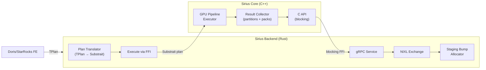
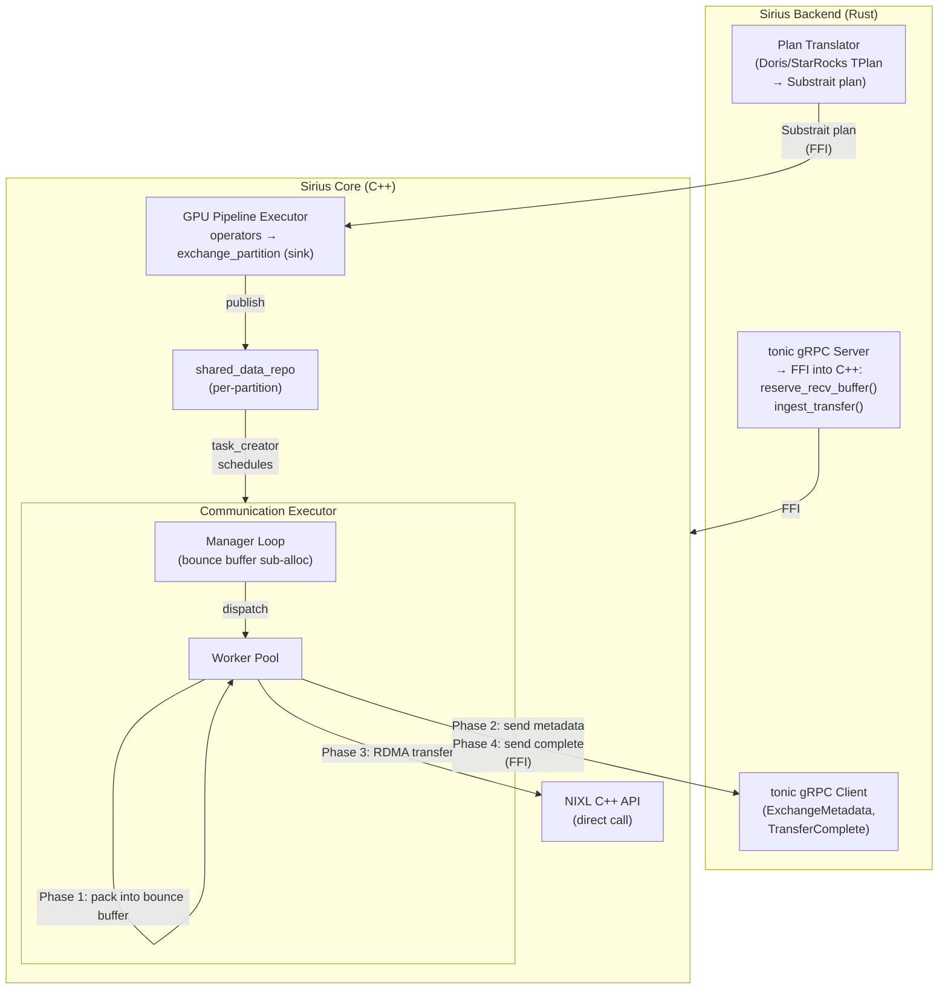
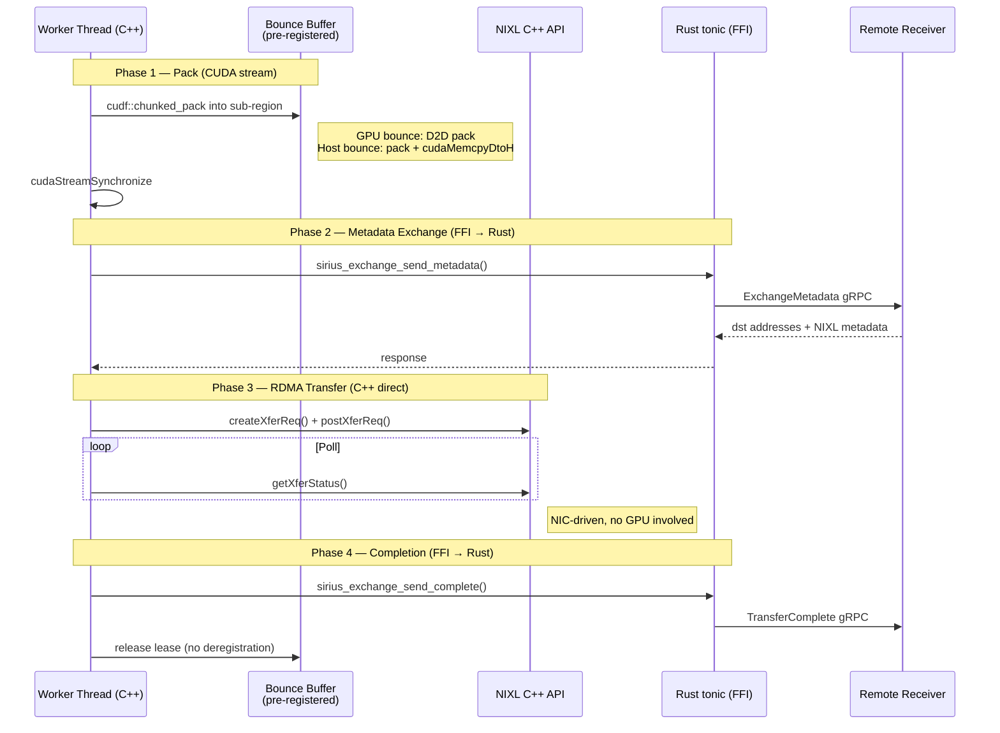
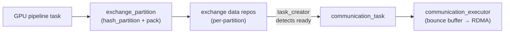
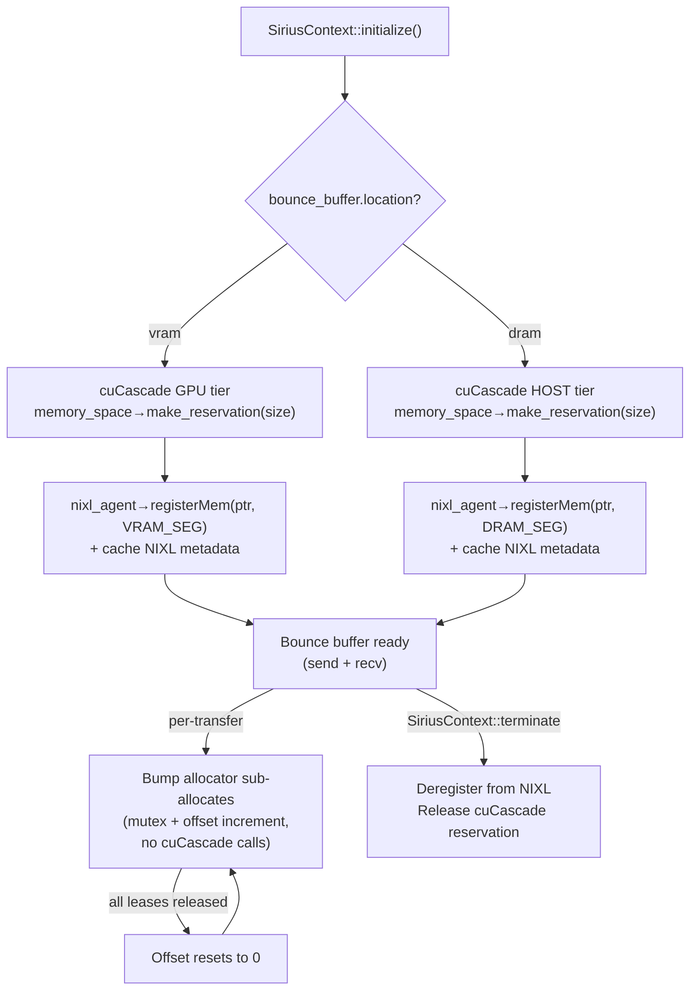
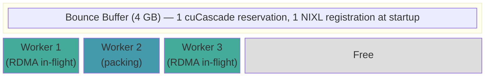
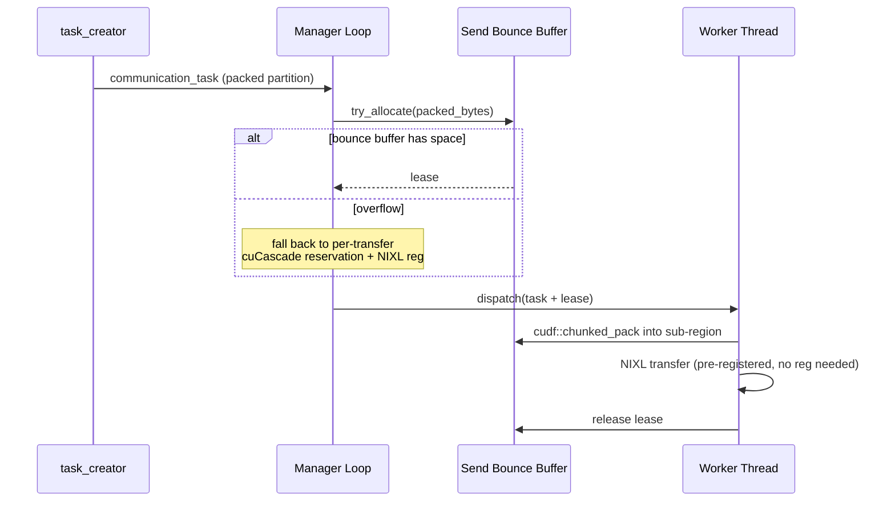
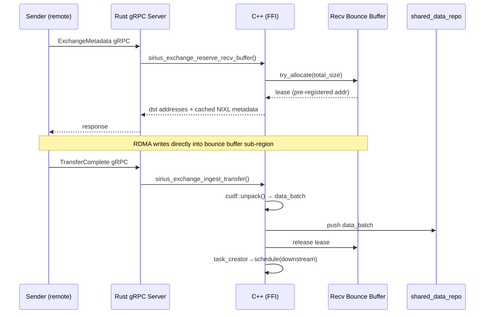

# Exchange Integration

This document proposes moving the distributed exchange path from the Rust backend into Sirius Core as a first-class executor, enabling overlap between GPU compute and network communication.

> **Status:** Design proposal — not yet implemented.

## Motivation

The current exchange architecture has three fundamental problems:

### 1. No Overlap Between Compute and Communication

After each fragment's GPU execution completes, there is a **blocking boundary** before exchange begins. The C++ engine finishes, hands packed data to Rust via C API (`sirius_exchange_c_api.cpp`), and Rust handles the entire NIXL transfer lifecycle. The GPU sits idle during transfers, and transfers wait for compute to finish.

```
TIME ═══> [  GPU compute  ][ BLOCKING ][ NIXL transfer ][ BLOCKING ][ GPU compute ]
```

### 2. Partitioning Happens Outside the Execution Pipeline

Hash partitioning (`cudf::hash_partition`) and packing (`cudf::pack`) currently happen inside `sirius_physical_result_collector.cpp` (lines 282-490) as a post-processing step during result collection. This is not a streaming pipeline operator — it runs after the GPU pipeline completes and cannot overlap with upstream computation. Partitioning is tightly coupled to the result collector rather than being a composable operator in the pipeline graph.

### 3. Boundary Crossing and Duplicated Systems

The data path crosses four boundaries per transfer:

```
C++ engine → C API → Rust staging (bump allocator) → NIXL → Rust gRPC → remote Rust → C API → C++ engine
```

The Rust bump allocator (`gpu_staging_buffer.rs`) manages staging memory independently of cuCascade's reservation system. This means:
- Staging memory is invisible to the GPU memory pressure manager
- The downgrade executor cannot reclaim staging buffers under memory pressure
- The task creator cannot schedule downstream work until Rust completes the transfer

### Goal

Make partitioning and communication first-class pipeline operators that overlap with GPU compute, using cuCascade-managed memory throughout.

```
TIME ═══> [ GPU compute+partition batch 1 ][ GPU compute+partition batch 2 ][ ... ]
                  [ staging + RDMA batch 1 ][ staging + RDMA batch 2 ]
                          ^^^ OVERLAPPED: compute, partition, transfer ^^^
```

## Architecture Overview

### Current Architecture (Blocking)



```
TIME ═══> [  GPU compute  ][  BLOCKING  ][  NIXL transfer  ][  BLOCKING  ]
```

### Proposed Architecture (Overlapped)



```
TIME ═══> [ GPU compute+partition batch1 ][ GPU compute+partition batch2 ]
                  [ staging+RDMA batch1  ][ staging+RDMA batch2  ]
                          ^^^ OVERLAPPED ^^^
```

### Component Ownership

| Component | Location | Notes |
|-----------|----------|-------|
| `sirius_physical_exchange_partition` | Sirius Core (C++) | New pipeline operator for hash partitioning + pack |
| `communication_executor` | Sirius Core (C++) | New sender-side executor (manager loop + worker pool) |
| `communication_task` | Sirius Core (C++) | New per-partition transfer task |
| NIXL agent (direct C++ calls) | Sirius Core (C++) | New C++ wrapper — NIXL is a native C++ library |
| Bounce buffers (send + recv) | Sirius Core (C++) | Pre-allocated from cuCascade (GPU or HOST tier), pre-registered with NIXL at startup, bump-allocated per transfer |
| Receiver C API | Sirius Core (C++) | New `extern "C"` functions for reserve + ingest |
| Hash partitioning | Sirius Core (C++) | Moved from result_collector post-processing to pipeline operator |
| gRPC client (sender) | Sirius Backend (Rust) | Stays — tonic client, called from C++ via FFI |
| gRPC server (receiver) | Sirius Backend (Rust) | Stays — tonic server, handlers FFI into C++ |
| NIXL Rust bindings (`nixl_sys`) | Sirius Backend (Rust) | **Removed** — C++ calls NIXL directly |
| `nixl_exchange.rs` | Sirius Backend (Rust) | **Removed** — NIXL calls move to C++ |
| `nixl_integration.rs` | Sirius Backend (Rust) | **Refactored** — orchestration moves to C++; gRPC wrappers remain |
| `nixl_service.rs` | Sirius Backend (Rust) | **Simplified** — handlers become thin FFI shims into C++ |
| `gpu_staging_buffer.rs` | Sirius Backend (Rust) | **Removed** — cuCascade replaces Rust bump allocator |
| `sirius_exchange_c_api.cpp` | Sirius Core (C++) | **Replaced** — old capture API replaced by new receiver C API |
| Exchange code in `result_collector` | Sirius Core (C++) | **Removed** — partitioning moves to exchange_partition operator |
| Fragment execution + plan translation | Sirius Backend (Rust) | Unchanged — receives Doris/StarRocks TPlan, translates to Substrait plan, dispatches to C++ engine via FFI |
| bRPC exchange | Sirius Backend (Rust) | Unchanged — remains as CPU fallback path |

## Sender Side: `communication_executor`

### Class Design

**Files:** `src/include/pipeline/communication_executor.hpp`, `src/pipeline/communication_executor.cpp`

Extends `itask_executor` following the same pattern as `gpu_pipeline_executor`:

```cpp
class communication_executor : public sirius::parallel::itask_executor {
 public:
  explicit communication_executor(
    exec::thread_pool_config config,
    cucascade::memory::memory_space* staging_mem_space,
    sirius::parallel::downgrade_executor* downgrade_executor = nullptr);

  void set_task_creator(sirius::creator::task_creator* task_creator);
  void set_completion_handler(completion_handler* handler) noexcept;

 protected:
  void manager_loop() override;
  absl::AnyInvocable<void() noexcept> get_per_thread_init() override;

 private:
  cucascade::memory::exclusive_stream_pool _stream_pool;  // For cudf::chunked_pack
  cucascade::memory::memory_space* _staging_mem_space;
  sirius::parallel::downgrade_executor* _downgrade_executor{nullptr};
  sirius::creator::task_creator* _task_creator{nullptr};
  completion_handler* _completion_handler{nullptr};
};
```

Key differences from `gpu_pipeline_executor`:
- Stream pool is used **only for packing** (`cudf::chunked_pack` in Phase 1) — NIXL transfers are stream-agnostic (driven by the RDMA NIC, not GPU kernels)
- No `task_request_publisher` — communication tasks do not compete for GPU compute slots
- Uses a staging-dedicated `memory_space` (or a carved-out region of the GPU memory space)
- `get_per_thread_init()` sets the CUDA device per worker thread (same as GPU executor)

### Manager Loop

The manager loop stays lightweight — it only reserves memory and dispatches work. This follows the same pattern as `gpu_pipeline_executor::manager_loop()` (see [Pipeline Execution](pipeline-execution.md)):

```
while (_running):
  1. slot = _bounded_pool->reserve()          // Block until worker slot available
  2. task = _task_queue.pop()                  // Block until communication task queued
  3. estimate packed_bytes from task input     // Size of cudf::chunked_pack output
  4. lease = _send_bounce_buffer->try_allocate(packed_bytes)
     // Bump allocator within pre-registered bounce buffer
     // NOT a cuCascade reservation — just mutex + offset increment
  5. if lease fails (bounce buffer full):
       option A: block until leases are released, retry
       option B: fall back to per-transfer cuCascade reservation + NIXL registration (slow path)
  6. attach lease to task local state
  7. _bounded_pool->dispatch(slot, worker_fn)  // Hand off to worker thread
```

The manager does **not** pack data — packing happens in the worker thread so the manager stays responsive for the next task. The bounce buffer sub-allocation is lightweight (bump pointer increment under a mutex) — no cuCascade reservation or NIXL registration on the per-transfer path.

### Worker Thread Protocol

Each worker thread executes a 4-phase transfer lifecycle:



**Key points:**
- Only Phase 1 uses a CUDA stream. NIXL is stream-agnostic (RDMA NIC-driven).
- No per-transfer NIXL registration — bounce buffer is pre-registered at startup.
- NIXL (phases 1, 3) called directly from C++. gRPC (phases 2, 4) crosses FFI into Rust.

### FFI Surface (C++ → Rust, sender side)

New `extern "C"` functions exported by the Rust `doris-rpc` crate for the sender:

```c
// Send ExchangeMetadata gRPC and block until response.
// Called by C++ worker thread in Phase 2.
int sirius_exchange_send_metadata(
    const char* dest_addr,              // Receiver gRPC endpoint
    const sirius_exchange_metadata* req, // Buffer descriptors + NIXL metadata
    sirius_exchange_metadata_response* resp); // Out: dst addresses + receiver NIXL meta

// Send TransferComplete gRPC notification.
// Called by C++ worker thread in Phase 4.
int sirius_exchange_send_complete(
    const char* dest_addr,
    const sirius_transfer_complete* req);
```

These functions block the calling C++ thread. Since each worker thread handles one transfer at a time and the worker pool is bounded, this is acceptable — the tonic runtime handles the async gRPC underneath.

### Retry Mechanism

Three retry triggers, following the OOM reschedule pattern from `gpu_pipeline_task.cpp` (lines 225-312):

| Trigger | Where | Behavior |
|---------|-------|----------|
| **Reservation failure** | Manager loop | Back off 5ms, trigger downgrade, retry. Max 10 retries per task. |
| **Receiver NACK** | Phase 2 (metadata) | Receiver returns `status_code != 0` (insufficient memory). Re-enqueue task with exponential backoff. |
| **RDMA failure** | Phase 3 (transfer) | NIXL transfer timeout or error. Retry with fresh metadata exchange (addresses may have changed). After N failures, fall back to bRPC CPU transfer. |

Retry tracking uses the same `retry_count` + `original_task_id` pattern as `gpu_pipeline_task_local_state`.

## Receiver Side

### gRPC Service (Rust)

The gRPC server stays in Rust as `NixlMetadataService` in `nixl_service.rs`. It continues to use tonic and the existing proto interface (`nixl_service.proto`). The handlers become thin FFI shims that delegate memory management and data ingestion to C++.

### ExchangeMetadata Handler

```
1. Rust receives ExchangeMetadata gRPC request
2. Parse buffer descriptors and sender NIXL metadata
3. FFI into C++: sirius_exchange_reserve_recv_buffer()
   ├── lease = _recv_bounce_buffer->try_allocate(total_recv_size)
   ├── If lease fails (bounce buffer full):
   │     fall back to per-transfer reservation + registration (slow path)
   ├── Return pre-registered bounce buffer addresses (no NIXL registration)
   └── Return pre-cached NIXL metadata through FFI
4. Rust loads sender NIXL metadata (cached per peer)
5. Return gRPC response with dst addresses + local NIXL metadata
```

### TransferComplete Handler

```
1. Rust receives TransferComplete gRPC notification
2. FFI into C++: sirius_exchange_ingest_transfer()
   ├── cudf::unpack() from bounce buffer sub-region → cuDF table
   ├── Wrap as cucascade::data_batch (data copied out of bounce buffer)
   ├── Push into shared_data_repository
   ├── Release bounce buffer lease
   └── task_creator->schedule(output_consumer)
3. Return gRPC success response
```

### FFI Surface (Rust → C++, receiver side)

New `extern "C"` functions exposed by Sirius Core:

```c
// Called by Rust on ExchangeMetadata RPC.
// Reserves GPU memory and allocates a receive buffer.
int sirius_exchange_reserve_recv_buffer(
    uint64_t query_id_hi,
    uint64_t query_id_lo,
    int32_t node_id,
    size_t total_size,
    const uint8_t* packed_cudf_metadata,   // For cudf::unpack schema
    size_t packed_cudf_metadata_size,
    sirius_recv_buffer_info* out);         // Out: GPU addr, NIXL agent metadata

// Called by Rust on TransferComplete RPC.
// Unpacks transferred data and pushes to the data repository.
int sirius_exchange_ingest_transfer(
    uint64_t query_id_hi,
    uint64_t query_id_lo,
    int32_t node_id,
    int32_t sender_id,
    uint32_t num_rows,
    const uint8_t* packed_cudf_metadata,
    size_t packed_cudf_metadata_size);
```

## Exchange as Pipeline Operator

### `sirius_physical_exchange_partition`

**Files:** `src/include/op/sirius_physical_exchange_partition.hpp`, `src/op/sirius_physical_exchange_partition.cpp`

Currently, hash partitioning lives in `sirius_physical_result_collector.cpp` as post-processing (lines 282-490). In the new design, this becomes a dedicated pipeline operator:

- Extends `sirius_physical_operator`
- Registered in `sirius_physical_plan_generator` for exchange sink plans
- Acts as a pipeline sink (barrier) — similar to the existing `sirius_physical_partition` operator (`src/op/sirius_physical_partition.cpp`)
- During `execute()`: runs `cudf::hash_partition` on the input data
- During `sink()`: packs each partition via `cudf::pack` and publishes per-partition packed data to exchange data repositories
- Each partition's data repository feeds into a `communication_task`

This design means partitioning overlaps with upstream GPU compute — as batch N is being partitioned, batch N+1 can already be computing in the GPU pipeline executor.

### Communication Task

**Files:** `src/include/pipeline/communication_task.hpp`, `src/pipeline/communication_task.cpp`

```cpp
class communication_task : public sirius::parallel::sirius_pipeline_itask {
 public:
  void execute(rmm::cuda_stream_view stream) override;

 private:
  // Local state
  std::unique_ptr<cucascade::data_batch> _packed_data;  // From exchange_partition
  std::string _dest_addr;                                // Receiver gRPC endpoint
  int _partition_id;
  int _retry_count{0};
  uint64_t _original_task_id;
  bounce_buffer_lease _bounce_lease;                     // Sub-region in pre-registered bounce buffer

  // Global state (shared across tasks for same query)
  nixl_agent* _nixl_agent;    // NIXL C++ agent handle
  // gRPC goes through Rust FFI, no C++ channel needed
};
```

### Task Creation

In `task_creator` (`src/creator/task_creator.cpp`):

- `task_creator` watches exchange data repositories for ready partitions
- When a partition's data is available, creates a `communication_task`
- One task per partition per batch (or per destination node)
- Routes the task to `communication_executor` instead of `gpu_pipeline_executor`

Data flow:



## Integration Points

| Component | File | Change |
|-----------|------|--------|
| `pipeline_executor` | `src/pipeline/pipeline_executor.hpp` | Add `communication_executor` alongside `_gpu_executors` |
| `task_creator` | `src/creator/task_creator.cpp` | New branch: exchange data repo ready → create `communication_task` |
| `completion_handler` | `src/pipeline/completion_handler.hpp` | Track per-partition per-destination completion |
| `SiriusContext` | `src/sirius_context.cpp` | Initialize NIXL agent, allocate + register bounce buffers at startup |
| `sirius_config` | `src/config.cpp` / `src/include/config.hpp` | New config: bounce buffer location/size, comm executor threads, retry policy |
| `sirius_physical_plan_generator` | `src/planner/sirius_physical_plan_generator.cpp` | Register `exchange_partition` for exchange sink plans |

## Memory Architecture

### Bounce Buffer Design

A **bounce buffer** is a memory region **pre-allocated from cuCascade** and **pre-registered with NIXL** at `SiriusContext` startup, eliminating per-transfer NIXL registration overhead. The bounce buffer is allocated from cuCascade's GPU tier (`memory_space` for VRAM) or HOST tier (`memory_space` for pinned DRAM) depending on configuration, ensuring it participates in cuCascade's memory accounting. Once allocated, it is registered with NIXL once and stays registered for the process lifetime. Data is packed (or copied) into the bounce buffer, then RDMA'd from there — matching the pattern established in PR #652 (`ExchangeMemoryManager`) and the current Rust staging buffer (`gpu_staging_buffer.rs`).

#### GPU vs Host Bounce Buffer

The bounce buffer can reside in GPU memory (`VRAM_SEG`) or host-pinned memory (`DRAM_SEG`). The optimal choice depends on the hardware architecture:

| System | Recommended | Why |
|--------|-------------|-----|
| **NVL72 / GB200** | GPU (`vram`) | NVSwitch provides 1.8 TB/s GPU-to-GPU. GPUDirect RDMA sends directly from GPU memory via dedicated per-GPU NIC. Copying to host wastes bandwidth. |
| **A100 / H100** | GPU (`vram`) | Large BAR1 (16+ GB) supports GPUDirect RDMA for large registrations. GPU-to-NIC path bypasses CPU entirely. |
| **T4** | Host (`dram`) | BAR1 is only 256 MB — too small for large GPU RDMA registrations. Host-pinned memory avoids the BAR1 constraint. |
| **L4** | Host (`dram`) | PCIe-only, constrained BAR1. Same rationale as T4. |
| **No RDMA NIC** | Host (`dram`) | Must stage through host for TCP/socket transport. |

This is configurable via `sirius.yaml` so deployments can tune per-cluster.

#### Bounce Buffer Lifecycle



The cuCascade reservation is held for the process lifetime and is **not reclaimable** by the downgrade executor.

#### Sender and Receiver Bounce Buffers

Following PR #652's pattern, the system allocates **two** bounce buffers at startup — one for sending and one for receiving:

| Buffer | Purpose | Used by |
|--------|---------|---------|
| **Send bounce buffer** | Holds packed data before RDMA write to remote | `communication_executor` worker threads (Phase 1: pack into bounce buffer) |
| **Recv bounce buffer** | Destination for incoming RDMA writes | `exchange_receiver_service` (ExchangeMetadata handler allocates sub-region) |

Both are pre-registered with NIXL at startup. NIXL metadata is cached once and reused for all transfers.

#### Bump Allocator (per-transfer sub-allocation within the bounce buffer)

A single bounce buffer is shared across all worker threads in the communication executor. To support multiple concurrent transfers, each transfer sub-allocates a region from the bounce buffer using a **bump allocator** — a separate, lightweight allocation mechanism independent of cuCascade's reservation system.

Per-transfer sub-allocation does **not** go through cuCascade reservations. The bounce buffer is reserved from cuCascade once at startup; after that, the bump allocator manages space within the bounce buffer directly (mutex + offset increment).



- 256-byte aligned sub-allocations, managed by bump pointer (mutex + offset increment)
- Epoch-based reset: when all active leases release → offset resets to 0
- Overflow: fall back to per-transfer cuCascade reservation + NIXL registration (slow path)

### Sender Flow (with bounce buffer)



### Receiver Flow (with bounce buffer)



## Configuration

New entries in `sirius.yaml`:

```yaml
communication:
  # Worker thread count for the communication executor
  thread_count: 4
  # Retry limits
  max_reservation_retries: 10
  max_receiver_nack_retries: 5
  max_rdma_retries: 3
  # Backoff
  reservation_retry_backoff_ms: 5
  nack_retry_initial_backoff_ms: 10
  nack_retry_max_backoff_ms: 1000

bounce_buffer:
  # Where the bounce buffer is allocated.
  #   "vram" — GPU memory, pre-registered as NIXL VRAM_SEG
  #            Best for NVL72, A100, H100 (GPUDirect RDMA, large BAR1)
  #   "dram" — Host-pinned memory, pre-registered as NIXL DRAM_SEG
  #            Best for T4, L4 (small BAR1), or systems without RDMA NICs
  location: vram

  # Size of the send bounce buffer (bytes). Default 1GB.
  send_size: 4294967296

  # Size of the recv bounce buffer (bytes). Default 4GB.
  recv_size: 4294967296

nixl:
  # NIXL transport backend
  transport: ucx
  # gRPC port for the receiver metadata service
  receiver_grpc_port: 9099
```

The `bounce_buffer.location` setting controls which cuCascade memory tier is used:
- `vram`: Allocates from the GPU tier `memory_space`, registers as `VRAM_SEG` with NIXL. Data is packed directly into GPU bounce buffer via `cudf::chunked_pack`, then RDMA'd via GPUDirect RDMA.
- `dram`: Allocates from the HOST tier `memory_space` (pinned memory via `fixed_size_host_memory_resource`), registers as `DRAM_SEG` with NIXL. Data is packed on GPU, then `cudaMemcpyDtoH` to the host bounce buffer before RDMA.

## Migration Path

1. **Phase 1**: Implement `communication_executor`, `communication_task`, and `sirius_physical_exchange_partition` in C++. Implement NIXL C++ agent wrapper. Implement sender-side FFI functions (`sirius_exchange_send_metadata`, `sirius_exchange_send_complete`).

2. **Phase 2**: Implement receiver-side FFI functions (`sirius_exchange_reserve_recv_buffer`, `sirius_exchange_ingest_transfer`). Simplify `nixl_service.rs` handlers to thin FFI shims.

3. **Phase 3**: Wire into `pipeline_executor` and `task_creator`. Remove exchange code from `result_collector`. Register `exchange_partition` in the plan generator.

4. **Phase 4**: Integration testing with existing NIXL proto format (reuse `nixl_service.proto`, `nixl_exchange.proto`).

5. **Phase 5**: Remove deprecated Rust code (`nixl_exchange.rs`, `gpu_staging_buffer.rs`, NIXL Rust bindings). Replace `sirius_exchange_c_api.cpp` with new receiver C API.

## NIXL Registration Overhead Analysis

The bounce buffer design resolves the per-transfer registration overhead. For reference, here is the analysis that motivated this approach:

**Registration cost per call** (all under exclusive agent lock, `nixl_agent.cpp:427`):
- `ucp_mem_map()` — kernel-level page pinning and RDMA memory key creation
- `ucp_mem_query()` — additional syscall to verify GPU VRAM type
- `ucp_rkey_pack()` — serialize the remote access key into a transferable blob
- NIXL bookkeeping — section maps, metadata allocation

The exclusive agent lock serializes all concurrent registrations. UCX's RCACHE (configured with 1024 entries at `ucx_utils.cpp:458`) only hits on exact `(addr, size)` matches — dynamic allocations give different addresses each time.

UCX's pool-level registration cache (`UCX_MEMTYPE_REG_WHOLE_ALLOC_TYPES=cuda`) cannot help either: cuCascade uses RMM's `cuda_async_memory_resource` (`cudaMallocAsync`), which UCX classifies as `UCS_MEMORY_TYPE_CUDA_MANAGED` — the bitmap only matches `UCS_MEMORY_TYPE_CUDA`, so the optimization is silently skipped.

**Solution**: The bounce buffer is pre-registered once at startup. All transfers sub-allocate from the pre-registered region — zero `ucp_mem_map()` calls during the transfer hot path.

## Open Questions

1. **Avoiding dedicated pre-partitioned NIXL memory**: The current design reserves a fixed 4GB send + 4GB recv bounce buffer at startup, which is memory that cannot be used for compute. Is there a way to avoid dedicating memory to NIXL — for example, by leveraging cuCascade's memory pool directly with a registration caching layer, or by using a transport that doesn't require explicit pre-registration?

2. **Is NIXL the right transfer library?**: NIXL provides one-sided RDMA semantics with explicit memory registration. Alternatives worth evaluating:
   - **UCXX**: Tag-based API avoids explicit registration entirely — UCX handles it internally via rcache. Two-sided (requires matching send/recv), but may be simpler. Already used by RAPIDS/Dask-CUDA for GPU shuffle.
   - **NCCL**: Optimized for collective communication. Supports user buffer registration (`ncclCommRegister`) for zero-copy. Well-tuned for NVLink/NVSwitch topologies. But designed for collectives, not point-to-point exchange.
   - Each has different trade-offs around registration overhead, API model (one-sided vs two-sided), and hardware optimization. Experimentation would clarify which fits the exchange pattern best.

3. **Adaptive bounce buffer placement (CPU vs GPU)**: The optimal bounce buffer location depends on hardware topology and workload — GPU for NVL72/A100 (GPUDirect RDMA, large BAR1), host for T4/L4 (small BAR1). Currently this is a static config (`bounce_buffer.location`). Could we make it adaptive — for example, by querying BAR1 size and NIC topology at startup to auto-select, or by dynamically switching based on transfer patterns and memory pressure at runtime?

4. **STRING column offset corruption**: The known NIXL RDMA bug that corrupts STRING column offsets (see `.planning/codebase/CONCERNS.md`) needs to be addressed regardless of C++ vs Rust. The current workaround uses `cudf::pack` instead of `cudf::chunked_pack` for STRING columns — this workaround carries over to the C++ implementation.

5. **bRPC fallback**: Should the bRPC CPU fallback path also move to C++ eventually, or remain in Rust as a separate code path?
