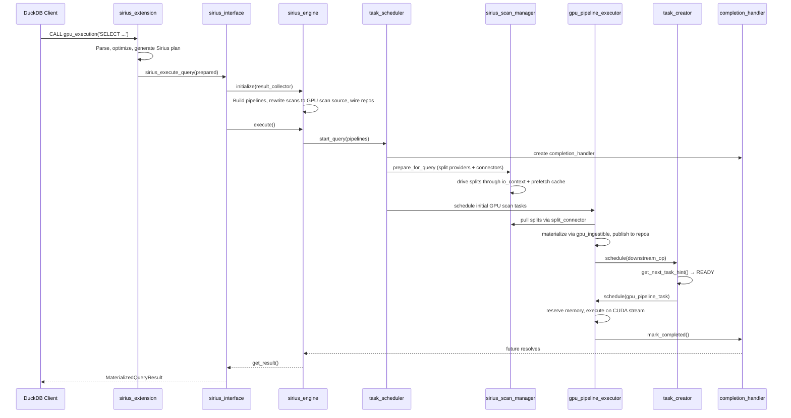

# Execution Flow

This document traces a Super Sirius query end-to-end, from SQL string to `QueryResult`, with file and line references.

## Entry Point

Users write plain SQL — transparent execution intercepts the query and routes it to the GPU:

```sql
SELECT * FROM lineitem WHERE l_quantity > 25;
```

The explicit `CALL gpu_execution('...')` function is also still supported.

## Step 1: Optimizer Extension Hook (Transparent Execution)

**Files:** `src/transparent/sirius_optimizer_extension.cpp`, `src/sirius_context.cpp`

DuckDB's optimizer calls two Sirius hooks registered via `OptimizerExtension`:

1. **Pre-optimization** (`sirius_pre_optimizer_hook`): Snapshots the connection's disabled optimizer set, then disables `IN_CLAUSE` and `COMPRESSED_MATERIALIZATION` because those can produce DuckDB-internal plan shapes the transparent rebind path cannot yet execute. `STATISTICS_PROPAGATION` remains enabled; its folded `EXPRESSION_GET`/`COLUMN_DATA_SCAN` and `DUMMY_SCAN` sources are translated to `GPU_VALUES`.

2. **Post-optimization** (`sirius_optimizer_hook`): Restores the connection's original disabled optimizer set, then copies the optimized logical plan via `LogicalOperator::Copy()` and stores it in `SiriusContext`.

3. **OnFinalizePrepare** (`SiriusContext::OnFinalizePrepare`): After DuckDB generates its CPU physical plan, this hook:
   - Retrieves the stored logical plan copy
   - Calls `sirius_physical_plan_generator::create_plan()` — the single source of truth for GPU support
   - If successful, stashes DuckDB's CPU physical plan (kept for runtime fallback) and replaces `prepared.physical_plan` with a `PhysicalSiriusExecution` operator (a DuckDB `PhysicalOperator` subclass)
   - If `create_plan()` throws (unsupported operator/type), the CPU plan is left in place — plan-time fallback. When `enable_duckdb_fallback` is false the error is surfaced instead of silently running on CPU.

4. DuckDB's executor runs `PhysicalSiriusExecution::GetData()`, which delegates to the Sirius GPU engine (Step 3 below).

## Step 1b: Explicit Table Function Path (Legacy)

**File:** `src/sirius_extension.cpp`

When using `CALL gpu_execution('SELECT ...')`, the flow is different:

1. `GPUExecutionBind()` re-parses the inner SQL, optimizes it, and generates the Sirius physical plan
2. `GPUExecutionFunction()` creates a `sirius_interface` and calls `sirius_execute_query()`
3. On failure (if fallback enabled), gracefully falls back to DuckDB CPU execution

This path is still supported but is no longer the primary way to use Sirius.

## Step 2: GPU Execution via PhysicalSiriusExecution

**File:** `src/transparent/physical_sirius_execution.cpp`

For transparent execution, DuckDB's executor calls `PhysicalSiriusExecution::GetData()` which lazily triggers the Sirius GPU engine on the first call. It creates a `sirius_interface`, wraps the Sirius physical plan in a `sirius_prepared_statement_data`, and calls `sirius_execute_query()`.

If GPU execution fails at runtime (and `enable_duckdb_fallback` is true), the operator runs the stashed DuckDB CPU plan on a private `duckdb::Executor` bound to the same `ClientContext` — so the fallback executes under the same transaction and MVCC snapshot as the failed attempt, including that transaction's own uncommitted writes. The GPU result is fully materialized before any row is emitted, so the fallback cannot duplicate rows. S3-reading queries have no CPU path and surface a clear error instead of falling back. A `runtime_fallbacks` counter and a WARN log record each occurrence.

## Step 3: Query Lifecycle Setup

**File:** `src/sirius_interface.cpp`

`sirius_execute_query()` delegates to:

1. `sirius_pending_statement_or_prepared_statement()`:
   - Calls `begin_query_internal()` to set up the active query context
   - Calls `sirius_pending_statement_internal()` which:
     - Creates a `sirius_engine(context, sirius_iface)`
     - Creates a `sirius_physical_materialized_collector` as the result sink
     - Calls `engine.initialize(collector)` to build pipelines (see Step 4)
     - Returns a `PendingQueryResult`

2. `sirius_execute_pending_query_result(pending)`:
   - Calls `engine.execute()` to run the GPU pipelines (see Step 5)
   - On completion, calls `fetch_result_internal()` which extracts the materialized result

## Step 4: Pipeline Construction

**File:** `src/sirius_engine.cpp` — `initialize_internal()`

This is the core pipeline-building step (single-threaded, runs on the query thread):

### 4a. Build Meta-Pipelines

```
sirius_meta_pipeline root(engine, state, result_collector);
root.build(*sirius_physical_plan);  // Recursively builds pipeline graph
root.ready();                       // Reverses operator lists, marks pipelines ready
```

Each operator's `build_pipelines()` method is called recursively:
- **Streaming operators** (FILTER, PROJECTION): added as intermediate operators to the current pipeline
- **Blocking operators** (HASH_JOIN, ORDER_BY): become sinks, create child meta-pipelines for their build inputs
- **Source operators** (scans): set as pipeline source

### 4b. Operator-Specific Pipeline Splitting

After meta-pipeline construction, `initialize_internal()` applies Sirius-specific transformations:

- **TABLE_SCAN** → rewritten into a unified GPU scan source (`sirius_gpu_scan_operator`, type `GPU_SCAN`) with a per-table `gpu_ingestible`; the parquet table function maps to the parquet ingestible and `seq_scan` over a base table maps to the duckdb-native ingestible
- **HASH_JOIN** → inserts `PARTITION + CONCAT` on both probe and build sides
- **HASH_GROUP_BY** → inserts `PARTITION + MERGE_GROUP_BY`
- **UNGROUPED_AGGREGATE** → inserts `PARTITION + MERGE_AGGREGATE`
- **ORDER_BY** → creates 4-phase sort: `ORDER → SORT_SAMPLE → SORT_PARTITION → MERGE_SORT`
- **TOP_N** → adds `MERGE_TOP_N`
- **DELIM_JOIN** → complex splitting with partition_join and distinct branches

### 4c. Data Repository Wiring

`insert_repository()` creates `shared_data_repository` instances between pipelines and configures ports with barrier types:
- **FULL barrier**: downstream waits for upstream to complete (e.g., hash join build side)
- **PARTIAL barrier**: downstream can consume data incrementally
- **PIPELINE barrier**: streaming, no synchronization needed

### 4d. Pipeline Finalization

- Sinks are pushed into operator arrays
- Source references are set
- Parent-child dependencies are established
- Sibling partition operators are linked for hash joins
- The finalized pipeline list is stored in `new_scheduled`

## Step 5: Execution

**File:** `src/sirius_engine.cpp` — `execute()`

1. Creates a `query` object from `new_scheduled` pipelines with a pipeline hashmap
2. Calls `task_scheduler.start_query(query)` which:
   - Creates a `completion_handler` with promise/future
   - Distributes the handler to all sub-executors
   - Schedules the initial GPU scan tasks
   - Returns the future

3. The main thread blocks on `future.get()` until the query completes

## Step 6: Scan Execution

**Files:** `src/include/scan_manager/sirius_scan_manager.hpp`, `src/op/scan/sirius_gpu_scan_operator.cpp`, `src/io/io_context.cpp`

Scans run as a normal pipeline source on the GPU executor — there is no separate scan executor. Two cooperating pieces drive them:

1. **Scan manager (per-query setup + I/O).** During `prepare_for_query()`, `sirius_scan_manager` walks the query's scan operators in order. For each one it builds a `split_provider` from the operator's table info, installs a fresh `split_connector` on the operator, and matches any pinned-cache entry (cache hit installs a cached ingestible; miss builds a fresh one via `make_gpu_ingestible`). A driver thread then runs the providers sequentially, populating each connector with splits.
2. **I/O layer.** The split providers read bytes through the scan manager's `io_context`: io_uring for local disk, with REST and kvikio backends selected by URI scheme via the datasource factory, fronted by the prefetching cache.
3. **GPU scan source (materialization).** The unified `sirius_gpu_scan_operator` pulls splits from its `split_connector` (`get_next_task_input_data`) and, in `execute()`, delegates each split to the installed `gpu_ingestible`'s `materialize_table` (and conditional `post_filter_and_project`). This runs as a `gpu_pipeline_task` on a GPU executor worker thread and publishes GPU-ready batches to the data repository, scheduling downstream consumers via `task_creator->schedule()`.

## Step 7: GPU Pipeline Execution

**File:** `src/pipeline/gpu_pipeline_executor.cpp`

The GPU executor's manager loop:

1. **Acquire kiosk ticket** — blocks until a GPU worker is free
2. **Send task request** — signals the pipeline executor that it can accept work
3. **Pop task** — blocks until a `gpu_pipeline_task` is available
4. **Reserve memory** — acquires GPU memory reservation from `memory_space`
5. **Dispatch to worker thread** — on the thread pool with a CUDA stream:
   - Lock input batches and convert to GPU if needed (`lock_or_prepare_batch`)
   - `compute_task()`: iterate **all** operators in the pipeline (source through sink), calling `execute()` on each
   - `publish_output()`: call the sink's `sink()` method to push results to downstream ports
   - On OOM: catch `oom_reschedule_exception`, retry up to 10 times with 5ms backoff
   - On success: check if query is complete (RESULT_COLLECTOR sink + pipeline finished)
   - If not complete: schedule downstream consumers via `task_creator->schedule()`
   - If complete: `completion_handler->mark_completed()`

## Step 8: Task Creation Cycle

**File:** `src/creator/task_creator.cpp`

After a GPU task completes and schedules downstream operators:

1. The task creator receives `schedule(operator*)` calls
2. Its manager loop calls `get_operator_for_next_task(operator)` which:
   - Calls `operator->get_next_task_hint()` to check data availability
   - If `READY`: the operator has data — create a task
   - If `WAITING_FOR_INPUT_DATA`: recursively follow the producer chain
3. Creates a `gpu_pipeline_task` (including for the unified GPU scan source)
4. Dispatches it to the GPU executor

## Step 9: Result Extraction

**File:** `src/sirius_interface.cpp`

After the future resolves:

1. `fetch_result_internal()` calls `engine.get_result()`
2. The result collector (`sirius_physical_materialized_collector`) returns its `ColumnDataCollection`
3. The materialized result is wrapped in a `MaterializedQueryResult` and returned to DuckDB
4. `cleanup_internal()` resets the progress bar and calls `end_query_internal()`

## Error Handling

If any task throws an exception during execution:

1. The GPU executor catches it and calls `completion_handler->report_error(exception)`
2. `drain_after_error()` is called on the pipeline executor which:
   - Stops the task creator threads
   - Drains the task queue
   - Calls `drain_and_wait()` on the GPU executors
   - Restarts the task creator for the next query
3. The error propagates through the future to the main thread, surfacing as an error-carrying result at `PhysicalSiriusExecution::GetData()`

On the transparent path, that error triggers the runtime CPU fallback described in Step 2 (unless `enable_duckdb_fallback` is false, the error is a user interrupt, or the query reads S3). The fallback runs the stashed DuckDB CPU plan in the same transaction, so a runtime GPU failure completes on CPU rather than failing the query.

## Sequence Diagram


