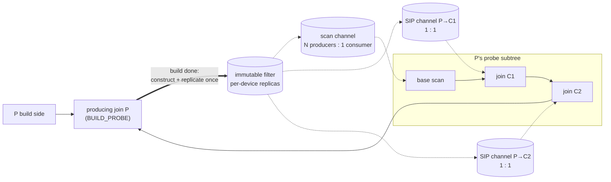
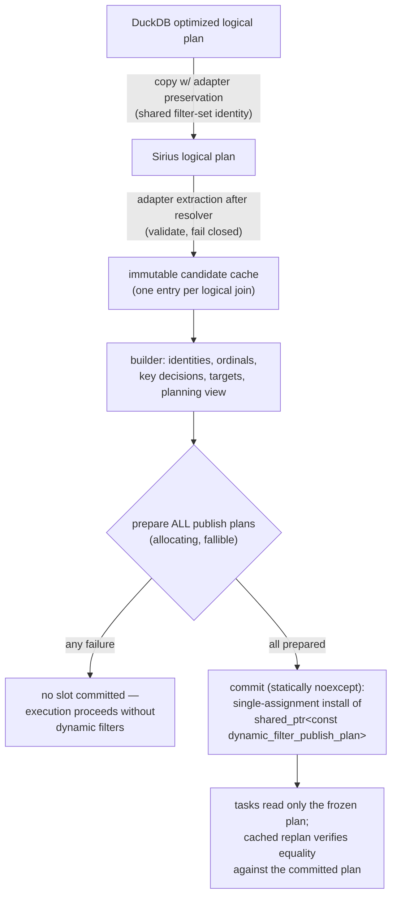
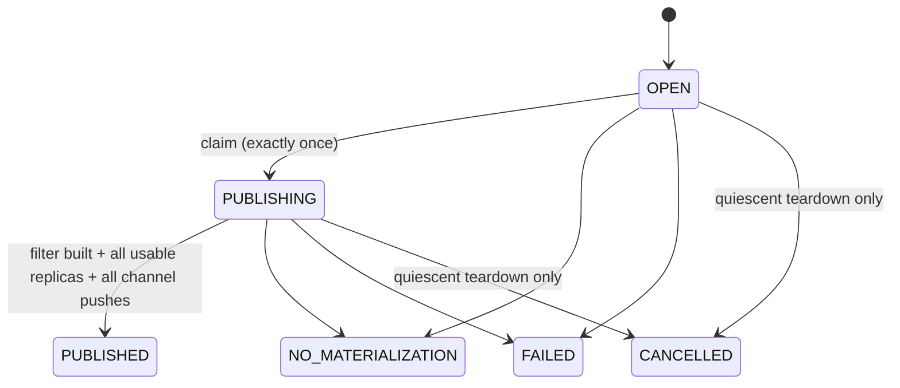
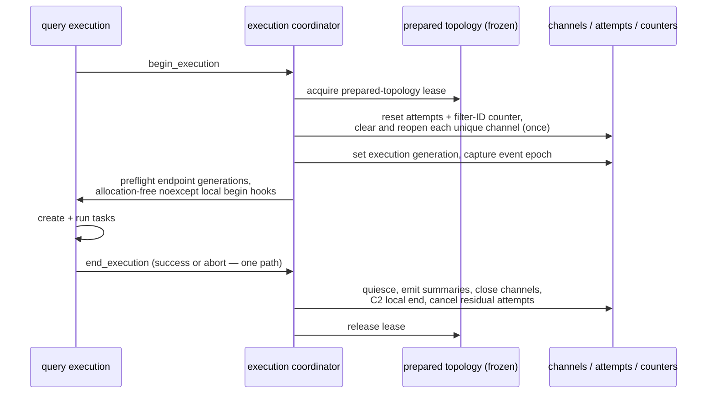

# General Dynamic Filters: Sideways Information Passing at Hash-Join Probe Inputs

**Targets:** [#1010](https://github.com/sirius-db/sirius/issues/1010) (extend dynamic filtering to
non-scan probe inputs) and [#1014](https://github.com/sirius-db/sirius/issues/1014) (remove the
global build-task preference — complete; deleted in merged #1134 after the fork measurement
passed).

**Baseline:** Phase 1 dynamic table-filter pushdown (#794) on the pinned DuckDB v1.5.4.
Delivery boundaries and PR ordering live in the
[GitHub delivery plan](issue-1010-github-delivery-plan.md). Phase 1 background:
[dynamic-filters.md](dynamic-filters.md),
[dynamic-filters-multi-gpu.md](dynamic-filters-multi-gpu.md).

Today a hash join's build-side membership filter prunes only **base table scans**. When the
probe input of a join is itself produced by other joins, those intermediate probe batches are
hashed and probed unfiltered. This design adds **sideways information passing (SIP)**: the same
immutable filters are additionally applied at every eligible intermediate hash-join probe on the
producing join's probe subtree.

## Decisions at a glance

1. **The new consumer is a probe checkpoint inside an existing hash join**, applied after that
   join pops its probe batch and before it prepares/hashes probe keys. It is *not* a new unary
   operator in the pre-partition feeder (batches already queued in partition/concat repositories
   would bypass such an operator).
2. **Scan and join-probe consumption are layered.** Phase 1 scan consumers stay; each eligible
   intermediate join adds a catch-up checkpoint for batches that passed earlier points before
   publication. Filters are built and replicated once; channels fan out immutable objects.
3. **DuckDB is authoritative for candidate admission, not GPU representation.** Sirius only ever
   narrows DuckDB's candidate set, and independently chooses exact-set/Bloom/none membership plus
   an optional zone map.
4. **Planning has an explicit one-shot freeze.** All allocation and validation happen in a
   fallible prepare step; a statically `noexcept` commit installs immutable plans before tasks
   exist. Runtime never observes mutable or partially-built routing state.
5. **v1 is opportunistic.** A probe batch applies whatever complete filters are visible; nothing
   waits. Ordered activation (Track D) is built only if measured coverage misses.
6. **Every publication attempt reaches exactly one reasoned terminal state**, and every execution
   of a cached prepared plan starts from fresh channels, attempts, and identities.
7. **The DuckDB pin has a latent LIMIT/TOP-N candidate-walk bug** (upstream fix duckdb#22963,
   tracked in #1123). It is masked at default settings, predates this work, and is picked up at
   the next pin bump. Until then an unpatched CPU run is never a correctness oracle for
   LIMIT/TOP-N-shaped tests; use explicit expected rows or a filters-disabled reference.

## Topology

For a producing join `P` and intermediate joins on its probe subtree:



- The scan is the earliest, highest-value pruning point; `C1` catches batches that missed the
  scan; `C2` catches batches that missed both. Adaptive gates disable a downstream mask after it
  measurably stops removing rows.
- `P` is never its own consumer (it would duplicate its own exact probe).
- Scan channels keep Phase 1 semantics exactly: keyed by preserved `DynamicTableFilterSet`
  identity, N producers AND-conjoin, one logical scan consumer closes. Each SIP endpoint gets a
  dedicated one-producer/one-consumer channel so close/gate/telemetry state is never shared.
- There is **no happens-before edge** from `P`'s build to an intermediate probe batch.
  Publication may precede a batch, land between batches, or arrive after the consumer drains —
  all are correct; only the benefit changes. C3 telemetry measures whether opportunistic timing
  captures enough value before any ordering work is considered.

### Checkpoint placement

```text
C probe feeder → PARTITION → CONCAT → C's probe repository
    → [SIP checkpoint: snapshot channel, apply visible membership filters]
    → prepare_join_keys → hash probe → join output
```

The checkpoint is a composed part of `C`'s probe execution for both BUILD_PROBE and STANDARD
consumer modes (MIXED consumers are rejected in v1). It produces a `probe_batch_handle` — stable
batch identity, the original or owned filtered table, its view, and its memory space — and
**every later probe-side access goes through the handle** (key prep, `left_full`, payload
gather, semi/mark helpers, output memory-space selection). Mixing filtered indices with the
original input batch would be wrong; tests filter non-prefix rows to make misalignment visible.

Fast paths: no channel, no visible filter, unavailable device replica, or a disabled gate
forwards the original batch zero-copy. Filtering never mutates the input; a zero-row filtered
probe stays a schema-correct input. STANDARD consumers may see one probe batch paired with
several build batches, so the handle's stable batch ID records repeated applications; STANDARD
routes cannot default on until that repeated cost is measured acceptable.

Multi-GPU: device identity comes from the probe batch's memory space, never ambient CUDA
context; a filter applies only where `is_available_on_device()` holds; SIP adds channel fan-out,
never a second replica-construction pass.

## DuckDB candidate contract

```text
Sirius producer/key candidates ⊆ pinned DuckDB optimizer candidates
Sirius runtime filter kinds need not equal DuckDB runtime filter kinds
```

A producing join is a v1 candidate iff DuckDB's `JOIN_FILTER_PUSHDOWN` pass emitted
`JoinFilterPushdownInfo` with non-empty `probe_info` and at least one `join_condition` entry
passes the Sirius gates below. Non-null metadata with empty `probe_info` is `statistics_only`
(no route). `build_side_has_filter` is recorded as a hint, never used as route admission.

One **version-pinned adapter** (`duckdb_join_filter_candidate_adapter`) owns every
version-sensitive read, at two points:

- **Preservation** (during logical-plan copy): retains exact shared `DynamicTableFilterSet`
  pointer identity between each producing join and its target scan; never deep-copies either
  endpoint independently.
- **Extraction** (after `ColumnBindingResolver`, before recursive planning mutates the join):
  validates structure and fails closed — out-of-range/duplicate condition indexes or an
  unrecognized copied shape reject the candidate as `malformed`; a target arity mismatch drops
  that complete target without disturbing valid sibling targets.

Extraction happens **once per logical join** into a generator-local immutable candidate cache;
planner policy, `plan_comparison_join`, and SIP discovery all read that cache non-destructively.
Runtime never dereferences `JoinFilterPushdownInfo`.

Three index spaces are kept distinct and never substituted for one another:

```cpp
struct admitted_dynamic_filter_key {
  duckdb_filter_ordinal duckdb_ordinal;  // j in join_condition[] / probe_info[t].columns[]
  join_condition_index condition_index;  // value at join_condition[j] (reordered conditions)
  sirius_key_ordinal ordinal;             // compact ordinal after Sirius narrowing
};
```

(`join_stats` uses the original condition order and is never correlated with these.)

### Sirius narrowing gates (release-mode, fail-closed)

- producing join type INNER or SEMI (fresh pure predicate on `join_type` — not derived from
  uniqueness-preservation logic);
- producing execution mode `BUILD_PROBE` at the publication claim;
- routed comparison `COMPARE_EQUAL` (`COMPARE_NOT_DISTINCT_FROM` excluded: NULL keys are
  matchable under null equality but membership masks null-propagate);
- both keys direct bound references, no key cast, supported GPU membership type;
- at least one live target.

Rejection is per key where components are independent; a runtime `probe_info`-arity mismatch is
structural corruption and skips the whole target in every flag mode.

## Planning pipeline and freeze



- Planning values are mutable only inside the builder; the sanctioned read-only planning view is
  exposed only after its invariants hold — established by planner construction and the
  configuration boundaries.
- Preparation failure leaves **every** slot unchanged — there is no partially-frozen topology.
- Cached prepared plans re-verify the committed plan instead of re-assigning; a direct second
  assignment or an incompatible descriptor is an internal error.
- SIP route discovery (C3) is a pure lineage pass over the resolved logical plan: recover the
  producer key binding, locate the target scan by preserved filter-set identity (exactly one
  match required), remap the binding down the branch, record each eligible intermediate join as
  a consumer, and group keys by `(producer, consumer)`. Descent stops conservatively at
  aggregates, row selectors, windows, set operations, CTE/materialization fan-out, and computed
  expressions; a right/build-origin binding or non-hash physical join stops that route. A
  dropped route never disturbs valid scan targets.

## Identity

| ID | One per | Notes |
|---|---|---|
| `publication_plan_id` | producing join + admitted key plan | one construction attempt per execution |
| `target_id` | consumer endpoint edge (scan or SIP) | per-target terminal state recorded independently |
| `channel_id` | delivery object / logical consumer | scan N:1, SIP 1:1 |
| `filter_id` | constructed immutable filter | identical in every channel receiving the object |

All are strong types minted by **one executable-plan allocator**; `0` is invalid; values are
query-relative and never cached across replans. Channels store
`published_filter_entry{filter_id, shared_ptr<const filter>}` so telemetry never reconstructs
identity from addresses. `dynamic_filter_execution_generation` is a separate strong type set at
each execution begin, distinct from the monotonic event-timestamp epoch.

## Publication lifecycle

Every enabled publication plan reaches exactly one reasoned terminal outcome through a
waiter-free, exactly-once attempt state machine (single compare/exchange API, no task
scheduling, no waking):



`NO_MATERIALIZATION` carries a reason: `EMPTY_BUILD`, `UNSUPPORTED_MODE`, `POLICY_SKIPPED`, or
`SOURCE_UNAVAILABLE`. Each target edge independently records whether its channel accepted the
filters, was `CONSUMER_CLOSED`, or was `PLANNING_REJECTED`. A normal publisher invocation
returns one ordered row per frozen target; bypass paths synthesize an equally complete aligned
result. Runtime claim checks only the frozen plan and release-mode eligibility — it re-reads no
DuckDB metadata.

### Materialization policy

For an admitted key Sirius chooses `exact_set | bloom | none(reason)` membership and
independently `emitted | none(reason)` zone maps, recorded per decision. Policy changes are
staged separately from the structural work: the repaired selectivity signal runs in **shadow**
first (record-only), then enforcement lands behind an A/B flag, and the blanket
build-side-filter gate is removed behind a separate default-off flag. Unknown selectivity is
`std::nullopt`, never sentinel zero. Durable pooled publication streams and per-stream replica
reservation are kept: build once, replicate per active device, synchronize, then fan out.

## Execution lifecycle (cached prepared plans)

Frozen topology is long-lived and cached with the prepared plan; everything mutable is
execution-scoped and centrally reset:



No operator independently resets or reuses closed channels, trained gates, or terminal attempts.
A second execution cannot begin while the lease is held. Repeated-execution tests publish a real
filter in run 1 and prove run 2 starts fresh (no stale filters, no double reset, changed
parameters honored).

## Memory model

Two non-spillable per-query floors, measured separately: pinned `BUILD_PROBE` build batches plus
persistent hash tables (count of resident joins, not just the per-build cap, drives this), and
per-device filter replicas (channels share filter objects; targets never duplicate replicas). A
per-query aggregate replica budget with downgrade order exact set → Bloom → none is required
before any candidate expansion beyond v1.

Transient reservation replaces the scan's optimistic `stats.bytes` override with a saturating
estimate of **simultaneous new allocations** during a filter cascade (retained previous result,
next output bounded by input footprint, BOOL8 mask, optional gather map, measured scratch),
fed by an optional `input_stats` row count. The hash join gets a mode-aware override that models
overlap inside the composed checkpoint+join path (first BUILD_PROBE task includes hash-table
build; later probe tasks exclude the resident table from *new* demand; STANDARD tasks model
their pair plus repeated probe filtering). The no-history estimate never goes below the generic
fallback, and history tightens estimates only after successful runs.

## Flags and rollout gates

| Flag | Values / default | Owner |
|---|---|---|
| `dynamic_filter_selectivity_gate` | `off / shadow / enforce`, shadow-first | shadow: C1b · enforce: C1d |
| `enable_dynamic_filter_unfiltered_build` | bool, **off** | C1e |
| `enable_dynamic_filter_sip` | bool, **off** until C4 | C3 |

Flags are snapshotted into the plan at prepare time — the A/B unit is the executable plan, so a
cached prepared statement must be re-prepared after `SET`.

Measurement gates run nested/star TPC-H (Q2, Q5, Q8, Q9, Q17, Q18, Q21) plus a synthetic
many-join chain; results compare as bags (order only where SQL guarantees it); timing passes run
at INFO with the log analyzer accepting INFO-only logs; memory gates use query-scoped sampling
or a fresh process per query (process-lifetime `peak=` is never per-query evidence). SIP
default-on (C4) additionally requires per-layer coverage (scan-/C1-/C2-caught), avoided
hash-probe rows/bytes, mask/gather overhead and gate-disable rate, and resident filter bytes
that the telemetry can attribute; route classes with systematic misses go to Track D instead of
default-on.

## Non-goals (v1) and contingent tracks

Out of scope: producing from STANDARD/partitioned joins; candidates DuckDB found no scan target
for; mixed-provenance composite keys; aggregate/window/set-operation/CTE crossing; applying a
producer's filter at its own probe; scheduler-level filtering, blocking, or timeouts; parity
with DuckDB's CPU filter representation.

**Track D (contingent):** exactly-once ordered activation — at most one ordered target per
runtime consumer pipeline, one-producer channels only, acyclicity validated over data +
activation + synthetic-hint edges, armed waiters hold no GPU reservation, and completion reuses
the publication FSM's terminal outcomes. Built only for route classes whose opportunistic
coverage misses the C3 gate. **Track E (vNext):** candidate expansion (no-scan discovery, mixed
provenance, STANDARD producers, broader crossing) — requires the aggregate filter budget first.

## Testing

- **Adapter/planner:** pointer-identity preservation (incl. two producers sharing one scan
  channel); null/statistics-only/admitted/malformed classification; the three index spaces;
  every narrowing gate; lineage remap and every conservative stop; deterministic
  `(producer, consumer)` grouping; freeze-exactly-once; a dropped SIP target never disturbing
  scan targets.
- **Lifecycle:** attempt-FSM transition matrix incl. races (TSan over publish/snapshot/close);
  per-target aligned results on every bypass path; repeated-execution freshness with a real
  filter in run 1; one quiescent teardown path for success and early failure.
- **End-to-end:** ON/OFF bag equivalence across nested INNER/SEMI chains, composite keys, NULL
  keys, empty/downgraded builds, STANDARD consumers, multi-GPU consumers on non-producer
  devices; publication racing each consumption layer; non-prefix filtered payloads proving
  handle discipline; explicit-oracle LIMIT/TOP-N shapes (never an unpatched CPU oracle, #1123).
- **Memory:** narrow/wide/multi-filter reservation, no-history→history transitions, channel
  growth, duplicate-heavy INNER multiplicity, OOM re-entry.
