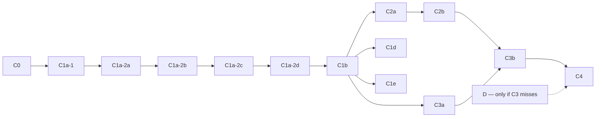

# Issue #1010 GitHub Delivery Plan

**Scope:** sub-issue and pull-request boundaries for
[the dynamic-filter SIP design](issue-1010-dynamic-filter-sip-design.md).
**Parents:** [#1010](https://github.com/sirius-db/sirius/issues/1010) (general dynamic filters)
and [#1014](https://github.com/sirius-db/sirius/issues/1014) (build-priority removal —
**complete**: measured on fork #1124, PASS; pass deleted outright in merged #1134; the staged
A1–A3 scaffolding never merged and no A-track sub-issues are needed).

Track B (adopting the released DuckDB LIMIT/TOP-N candidate-walk fix, duckdb#22963) is deferred
to the next pin bump, tracked in #1123, and blocks nothing below.

This document and the design are the only checked-in planning documents; each sub-issue and PR
carries its own acceptance criteria.

## Decision

Use GitHub parent issues with native sub-issues as the umbrella; **no umbrella pull request**.

- One sub-issue per independently reviewable, mergeable unit below; normally one PR per
  sub-issue, targeting `dev`.
- Express ordering with native `blocked by` / `blocking` relationships, not list order or prose.
- Use a milestone (e.g. `Dynamic Filters SIP v1`) or a Project for visualization only; the
  native sub-issue list is the progress record — don't duplicate it as a hand-edited checklist.

## Delivery units

| ID | Sub-issue title | Boundary | Behavior |
|---|---|---|---|
| C0 | Dynamic filters: SIP design and delivery plan | **This document and the design (docs-only, the first PR).** | docs |
| C1a-1 | Add the version-pinned DuckDB candidate adapter | Move preservation/extraction behind the adapter with CPU parity tests; no runtime consumer. | preserving |
| C1a-2a | Add the canonical planner model | Strong identities/ordinals, shared allocator, immutable two-pass candidate cache, key-decision recording, builder validation, sanctioned read-only planning view. Sidecar only — the legacy metadata/direct-plan path stays the sole production authority; no double-registered producers. | preserving |
| C1a-2b | Add the one-shot topology freeze | Immutable scan-only publish plans, `single_assignment`, fallible all-plan preparation, allocation-free `noexcept` commit, cached-plan equality verification. Cut the hash join/publisher over to committed plans, then remove the legacy path, preserving publication outcomes and log shape. | preserving |
| C1a-2c | Add the reasoned publication model | Structured publisher/target result values and the waiter-free exactly-once attempt FSM, with transition and race tests. **Dormant**: stays off the production path until C1a-2d can reset it (see below). | preserving |
| C1a-2d | Wire publication into the fresh-execution lifecycle | Wire the C1a-2c result/FSM into producer and publisher; execution generation + event epoch, filter-ID state, prepared-topology lease, centralized reset, canonical begin/end/abort, proof that cached prepared execution starts fresh. | correctness-fix |
| C1b | Typed targets, scan coverage, telemetry, shadow policy | Strong compact targets (absorbs former C1c compaction/parity), ID-keyed scan coverage, analyzer support, shadow selectivity without enforcement. First PR to emit new machine-parsed lines: owns the log-analyzer module and shape-version bump. | preserving |
| C1d | Enforce the repaired selectivity decision | Suppression-policy change behind an independently reversible A/B control. | A/B |
| C1e | Remove the blanket build-filter exclusion | Candidate expansion behind a default-off, independently reversible control. | default-off |
| C2a | Add the reusable join-probe consumer | Mask operation, probe handle, immutable capability/proof token with preallocated local state, `noexcept` reset hooks, behavior-parity tests; no routes; preserves C1b scan hooks. | preserving |
| C2b | Safe join/filter reservation accounting | History-aware reservation floor, current `input_stats` semantics, join multiplicity model, OOM/history-transition tests. | preserving |
| C3a | Discover and validate join-probe SIP descriptors | Discovery, endpoint identity resolution, immutable planning-descriptor validation, flag, planning telemetry; **no runtime producer or consumer endpoint**. | default-off |
| C3b | Install and run opportunistic join-probe SIP | Group/validate both route ends, prepare all producer plans and consumer proof tokens, commit `noexcept`-only, then fan-out, C2 consumption, coverage tooling, default-off experiment. | default-off |
| C4 | Make the SIP rollout decision | Default-on only if correctness, coverage, wall-time, and memory gates pass. | default change |
| D | Route-local ordered activation (contingent) | Created only when C3 telemetry names a route class that needs ordering; C4 then blocks on D. | conditional |

## Dependency graph

Represent these edges as native `blocked by` relationships:



C1b must not merge against a partial C1a-2 contract. C3b has two hard edges: C3a (validated
planning descriptor) and C2b (corrected consumer/reservation seam). Do not create D merely to
complete the tree; if C3 passes without ordering, close C4 without D.

## The C1a-2 contract: four PRs, one architecture

`C1a-2` names the aggregate architecture contract, delivered as four separately reviewed PRs.
It is **not** a valid `Closes:`/`Design section:` ID by itself.

```text
C1a-2a            C1a-2b             C1a-2c              C1a-2d
planner model  →  topology freeze →  publication model → production lifecycle
identity          immutable plan     result values       FSM wiring
candidate cache   prepare/commit     attempt FSM         generation + epoch
builder + view    frozen reads       transition tests    reset + teardown
```

Green-on-its-own criteria:

- **C1a-2a:** planning produces stable, validated sidecar values; runtime publication behavior,
  producer registration, and terminal log shape unchanged.
- **C1a-2b:** every producer prepared before any slot commits; preparation failure leaves all
  slots unchanged; commit statically `noexcept`; tasks cannot observe an unfrozen plan.
- **C1a-2c:** result-value invariants and the full attempt transition matrix (including races)
  proved standalone; production path unchanged.
- **C1a-2d:** every enabled attempt reaches exactly one reasoned terminal state; normal
  invocation returns one ordered row per frozen target and bypass paths synthesize equally
  complete aligned results; a reused prepared topology starts with fresh channels, attempts,
  filter IDs, generation, and epoch; success and early failure share one quiescent teardown.

**Why C1a-2c is dormant:** the attempt object persists with the cached hash join, and only
C1a-2d introduces the coordinator that resets it. Wiring C1a-2c into production alone would
leave later executions with terminal attempts and stale/closed channels — not an allowed
intermediate state.

**Rollback:** reverse dependency order. Before a dependent merges, its prerequisite can revert
to green independently; after, revert the dependent suffix first. Reverting only C1a-2d is *not*
a safe release rollback (it removes the cached-execution freshness fix): the supported rollback
is C1a-2d → C1a-2c → C1a-2b → C1a-2a in order, retaining C1a-1, unless dynamic filtering and
affected cached reuse are disabled by another proven control.

Scope fences: C1b's compact targets, scan-coverage telemetry, shadow evidence, and policy
enforcement stay out of the C1a-2 units; conversely C1a-2c's completion model and C1a-2d's
production integration must not slip into C1b.

## Pull-request policy

Each PR: targets `dev`; closes exactly one sub-issue; references (never closes) its parent
issue; names its blockers; states its behavior boundary and rollback condition. Header:

```markdown
Parent: #1010
Closes: #<sub-issue>
Design section: <unit ID above / anchor in the design doc>
Depends on: #<issue-or-PR> | none
Behavior: <docs | preserving | correctness-fix | default-off | A/B | default change | removal>
Rollback: <flag, revert boundary, or n/a>
```

Never put `Closes #1010`/`Closes #1014` on an implementation PR — GitHub would close the
umbrella on merge. Close parents manually after exit criteria pass.

## Branching and stacking

Prefer sibling PRs targeting `dev`, merged in dependency order. C1a-2a…C1a-2d are a permitted
short stack (each unit consumes the contract before it): open four separate PRs, keep each diff
inside its named boundary, merge strictly in order. While a prerequisite is unmerged, its
immediate dependent may temporarily target the prerequisite branch as a draft (`Depends on #N`
stated prominently); after each merge, retarget to `dev` and re-verify the full diff and tests.
Do not open an aggregate C1a-2 PR, and do not extend the stack through C1b/C2/C3/C4 — deep
stacks obscure rollback boundaries and block independent experiments.

Implementation is reconstructed onto independently green branches from current `dev`; the
historical combined development branch is a source of code, not a review unit.

## Labels and completion

Labels: `area: dynamic-filters`; `track: duckdb-contract` (C1a-1), `track: producer`
(C1a-2a–d, C1b, C1d, C1e), `track: consumer` (C2a, C2b), `track: sip` (C3a, C3b, C4, D); plus
`behavior-change` / `default-off` / `conditional` as applicable.

A sub-issue closes when its PR merges into `dev` and its acceptance criteria pass. The aggregate
C1a-2 contract completes only when all four units are merged and C1a-2d's repeated-execution
freshness gate passes. `#1010` closes only after C4 records the default-on or explicit no-ship
decision and the architecture/operator docs are updated.

Parent-issue bodies stay short: design link at a stable revision, one-paragraph scope, the
native sub-issue list, a link here, and exit criteria (sub-issues complete; correctness against
explicit oracles; performance and memory gates; default/rollback decisions recorded; docs
updated).
