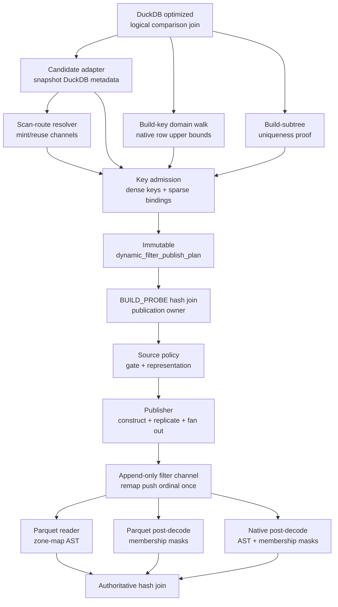
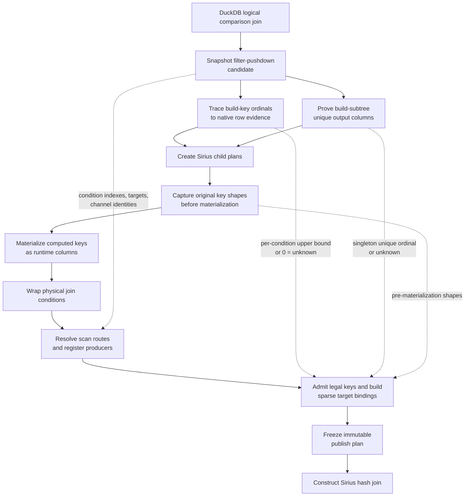
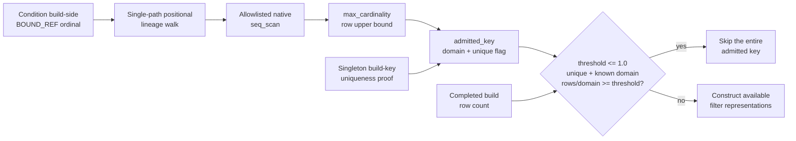
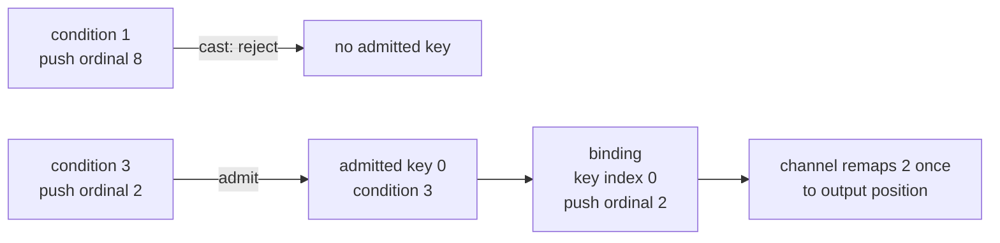
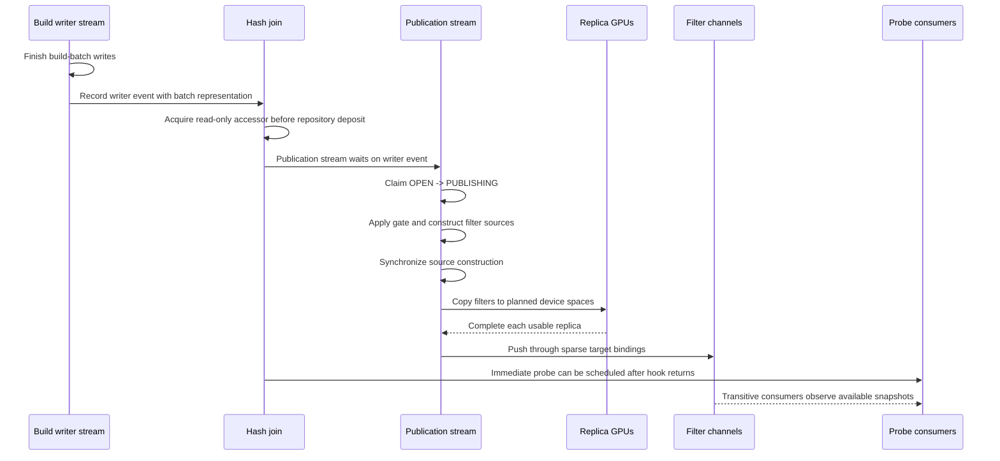
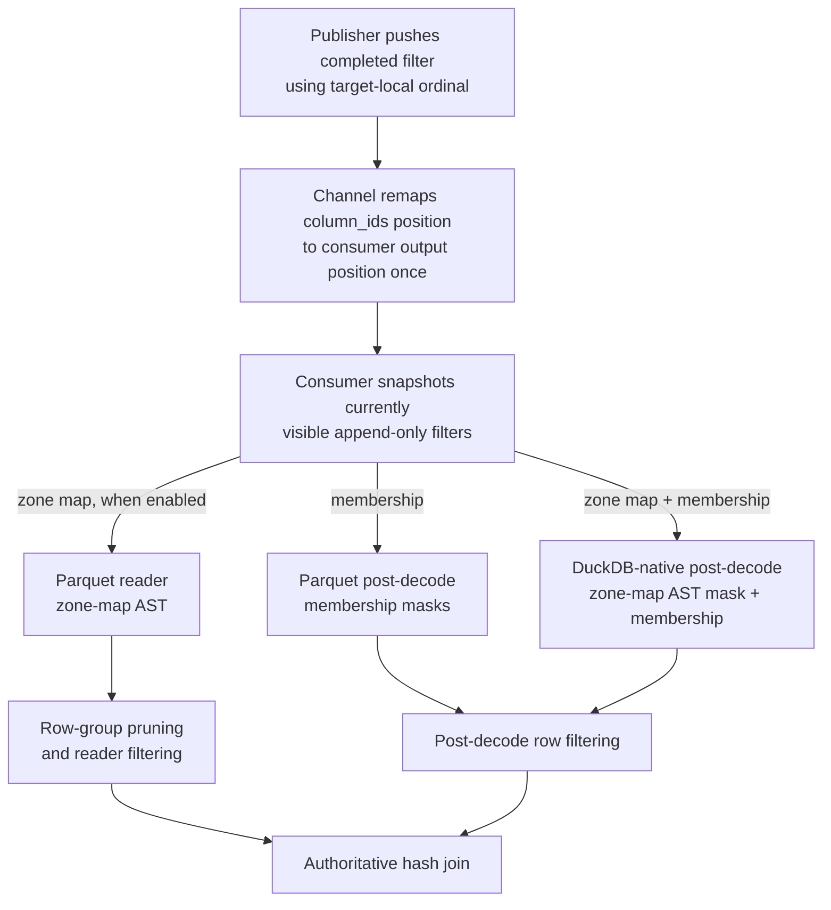

# Issue #1010 R1b code flow

This document describes the implementation as it stands on the R1b branch. It is the high-level map
for a file-by-file walkthrough of the dynamic-filter path, written for reviewers.

## Mental model

The implementation has four layers:

1. DuckDB metadata is snapshotted and translated during Sirius planning.
2. Key eligibility, base-table row evidence, target routing, and coordinate translation are frozen
   in a Sirius-owned immutable publish plan.
3. A completed hash-join build constructs and replicates filters once, then fans them out through
   append-only channels.
4. Probe scans consume whatever completed device-local filters are visible, while the hash join
   remains authoritative for correctness.

Runtime publication never reinterprets DuckDB planner metadata. Missing evidence, an unavailable
replica, a drained channel, or an unsupported representation loses only a pruning opportunity.

## Component map

## 1. Plan-time ownership transfer

Before recursive physical planning moves data out of the logical children, Sirius:

- Snapshots DuckDB's filter-pushdown candidate.
- Traces each build-key output ordinal through value-preserving, non-amplifying operators. Only a
  DuckDB-native `seq_scan` supplies evidence, using `NodeStatistics::max_cardinality`; refusal
  becomes `0` (unknown).
- Separately proves a unique-key column set for the build subtree. Only a singleton set can arm an
  individual key's coverage gate.
- Captures whether each original condition side was direct, cast, or computed before computed
  equality keys are rewritten as materialized columns.
- Resolves DuckDB-named scan targets. Routing requires valid metadata, a filtered-build hint,
  GPU/HOST replica placement, the master switch, and a live shared channel.
- Admits legal keys, compacts them into a dense vector, and gives each target only its applicable
  sparse bindings.
- Freezes keys, bindings, targets, replica placements, and configuration policy in one immutable
  value.

If routing produces no target, the plan is disabled even if admission found legal keys.

## 2. From evidence to the runtime coverage gate

The denominator is a base-table **row upper bound**, not an NDV statistic. The ratio is treated as
key-domain coverage only when the key is proven unique. Unknown evidence and non-unique keys fail
open: the gate stays off and publication proceeds as before.

| Condition | Coverage-gate result |
|---|---|
| `threshold > 1.0` | Disabled unconditionally; this is the rollback setting |
| Domain is `0` | Disabled for that key |
| Key is not proven unique | Disabled for that key |
| `build_rows / domain >= threshold` | Fires |
| Otherwise | Does not fire |

Exactly `1.0` is active and fires at full coverage. The check currently precedes both filter
constructions, so firing skips the entire key: an opted-in zone map is suppressed together with
membership. The separate zone-map **range** gate is inactive because production deliberately
passes it no value-range domain.

## 3. Coordinate spaces

These integers are related but never interchangeable.

| Coordinate | Meaning | Lifetime |
|---|---|---|
| Planner condition index | Original comparison-condition order; indexes captured shapes and domain evidence | Stored per admitted key |
| DuckDB filter ordinal | Temporary position aligning DuckDB's hinted conditions with every target's columns | Planning only |
| Target index | Temporary alignment across resolved targets, admission inputs, and binding lists | Planning only |
| Admitted-key index | Dense position after legality filtering | Stored in each target binding |
| Build-key ordinal | Column in the completed, materialized runtime build table | Stored per admitted key |
| Channel push ordinal | Target-local push coordinate; for scan routes, a position in that scan's `column_ids` vector | Stored per binding |
| Consumer output position | Scan output coordinate after the channel remaps the push ordinal once | Channel and consumers |
| Reordered equality ordinal | Equality-first condition order inside the physical hash join | Physical-join execution only |

Example: DuckDB hints original conditions `[1, 3]` and maps them to one target's `column_ids`
positions `[8, 2]`. If condition `1` contains a cast and is rejected, condition `3` becomes dense
admitted key `0` but keeps channel push ordinal `2`.

Dense compaction changes only the admitted-key coordinate. It does not renumber the original
condition, materialized build column, or target-local channel coordinate.

## 4. Runtime construction, replication, and publication

Publication occurs when the concat-folded build batch reaches an enabled `BUILD_PROBE` hash join
on its `build` port.

Publication is eligible only for a `BUILD_PROBE` join whose complete build is one partition or a
broadcast replica. The hook acquires a read-only batch accessor before depositing the batch in the
join repository, pinning its GPU representation through publication.

An `OPEN -> PUBLISHING` compare-and-swap selects exactly one publisher. Successful publication
ends in `FINISHED`, an exception ends in `FAILED`, and finalization can change an unclaimed `OPEN`
window to `CLOSED`.

The probe batch does **not** wait on the build writer event. The publication stream waits, then the
publisher completes source construction and every usable replica before channel insertion.
Immediate-probe ordering is host/pipeline ordering; a transitive target below another join remains
opportunistic and may observe none, some, or all completed filters.

For each admitted key, the publisher:

1. Records domain evidence and direct non-amplification observations.
2. Applies the coverage gate before paying for either filter kind.
3. Validates the build-table ordinal and runtime storage type.
4. Optionally constructs a zone map.
5. Chooses and constructs one membership representation.
6. Synchronizes construction, replicates to planned GPUs, and fans out shared filter objects only
   through the target's sparse bindings.

### Membership representation selection

| Choice | When selected | Consumer behavior |
|---|---|---|
| Small IN-list | `1..12` supported, non-null `INT32`/`INT64` build rows | Exact post-decode mask |
| Hash IN-list | Exact set's estimated footprint fits the smallest planned probe-GPU L2 | Exact post-decode mask |
| Bloom | Supported key is too large for the L2-fit rule | Probabilistic post-decode mask with no false negatives |
| None | No supported membership representation | Pass through |

Replica placement and logical routing are independent. One filter can have replicas on several
GPUs but be routed to one channel, or several targets can share the same filter object. A failed
optional destination replica makes only that GPU skip the filter.

## 5. Channel and consumer paths

- A channel is append-only and has no readiness wait.
- `register_producer` is plan-lifecycle bookkeeping, not a publication-ready signal.
- Parquet merges AST-capable zone maps into `reader_options::set_filter`; this can prune row groups
  before decode. Its post-decode operator applies membership masks only.
- DuckDB-native scans have no reader-side dynamic phase, so their post-decode operator evaluates
  both AST-capable zone maps and membership masks.
- Only Parquet's reader-side zone-map path can avoid reading and decoding a row group.
- A missing filter, missing local replica, closed channel, or unsupported key passes rows through.

The post-decode operator has a separate observed-selectivity policy. Its scan-level gate disables
filtering when the measured filters keep more than `dynamic_filter_keep_threshold` of a split.
Membership filters also record marginal keep ratios; one keeping more than 50% of the rows reaching
it is skipped on later splits. This is independent of the publisher's predicted coverage gate.

## 6. Observability

`SiriusContext` owns connection-lifetime cumulative counters. Tests and diagnostics normally take
before/after snapshots around a query.

| Counter family | Examples | Interpretation |
|---|---|---|
| Policy-oriented | `keys_considered`, `keys_with_known_domain`, `keys_skipped_domain_gate`, `keys_build_exceeded_domain`, filters built | Deterministic only for attempts reaching per-key processing |
| Delivery-oriented | producers/attempts/finished/failed, source-not-resident, targets-drained, `filters_pushed` | Timing- and target-liveness-dependent |

`keys_with_known_domain` means only that nonzero row evidence exists; uniqueness is separate, so the
counter alone does not mean the gate was armed. `keys_build_exceeded_domain` is the direct runtime
check of the non-amplification/evidence contract.

Source-not-resident is detected before the publication CAS and can leave the window open for a
different broadcast copy. All-targets-drained is detected after the CAS and completes as a
successful attempt with no per-key decisions. If publication throws, `publications_failed` is
retained but the partially accumulated local outcome is not folded into context counters.

## 7. Current scope and boundaries

- Production planning constructs DuckDB-derived scan targets. Direct join-edge routing exists in
  the schema and tests but is not wired in production.
- Sirius does not independently install a scan dynamic filter when DuckDB did not identify one.
  Producer and consumer recover the same Sirius channel from DuckDB's shared
  `DynamicTableFilterSet` identity.
- Domain evidence is live only for allowlisted DuckDB-native `seq_scan` leaves. Parquet and other
  table functions yield unknown evidence, so their publisher coverage gate remains off.
- Coverage is live only for a key with singleton uniqueness proof. Its early key-level skip also
  suppresses an opted-in zone map; the dedicated zone-map range gate remains inactive pending
  value-range evidence.
- Zone maps remain off by default.
- The SIP benchmark-gates document is a preregistration specification. R2 opportunity telemetry,
  R3 memory evidence, and a completed benchmark run record are not part of current R1b.

## 8. File-by-file walkthrough order

We will follow the call graph in this order:

| Step | File | Question it answers |
|---|---|---|
| 1 | [`dynamic_filter_publish_plan.hpp`](../../src/include/op/dynamic_filter/dynamic_filter_publish_plan.hpp) and [`dynamic_filter_publish_plan.cpp`](../../src/op/dynamic_filter/dynamic_filter_publish_plan.cpp) | What immutable data crosses from planning into runtime? |
| 2 | [`sirius_plan_comparison_join.cpp`](../../src/planner/sirius_plan_comparison_join.cpp) | In what order are candidate metadata, domains, uniqueness, shapes, routes, admission, and the physical join assembled? |
| 3 | [`duckdb_join_filter_candidate_adapter.hpp`](../../src/include/planner/duckdb_join_filter_candidate_adapter.hpp) and [`.cpp`](../../src/planner/duckdb_join_filter_candidate_adapter.cpp) | What is copied from DuckDB, and what remains hidden? |
| 4 | [`build_key_domain.hpp`](../../src/include/planner/build_key_domain.hpp) and [`.cpp`](../../src/planner/build_key_domain.cpp) | How does a build-key ordinal resolve to trusted base-table row evidence? |
| 5 | [`dynamic_filter_scan_routes.hpp`](../../src/include/planner/dynamic_filter_scan_routes.hpp) and [`.cpp`](../../src/planner/dynamic_filter_scan_routes.cpp) | When is a scan channel wired and a producer registered? |
| 6 | [`dynamic_filter_key_admission.hpp`](../../src/include/planner/dynamic_filter_key_admission.hpp) and [`.cpp`](../../src/planner/dynamic_filter_key_admission.cpp) | Which keys are legal, and how are coordinates compacted into sparse bindings? |
| 7 | [`sirius_physical_plan_generator.cpp`](../../src/planner/sirius_physical_plan_generator.cpp) and [`sirius_plan_get.cpp`](../../src/planner/sirius_plan_get.cpp) | How do scan and join recover the same channel, and when is the scan wrapper kept? |
| 8 | [`sirius_physical_hash_join.hpp`](../../src/include/op/sirius_physical_hash_join.hpp) and [`.cpp`](../../src/op/sirius_physical_hash_join.cpp) | What build shape may publish, how is the build pinned, and how is exactly-once publication synchronized? |
| 9 | [`dynamic_filter_source_policy.hpp`](../../src/include/op/dynamic_filter/dynamic_filter_source_policy.hpp) | What are the pure coverage and representation decisions? |
| 10 | [`dynamic_filter_publisher.hpp`](../../src/include/op/dynamic_filter/dynamic_filter_publisher.hpp) and [`.cpp`](../../src/op/dynamic_filter/dynamic_filter_publisher.cpp) | How are filters constructed, replicated, counted, and sparsely fanned out? |
| 11 | [`sirius_dynamic_filter.hpp`](../../src/include/op/dynamic_filter/sirius_dynamic_filter.hpp), [`.cpp`](../../src/op/dynamic_filter/sirius_dynamic_filter.cpp), and the three `src/cuda/sirius_dynamic_*filter.cu` files | What capabilities and device representations do filter objects provide? |
| 12 | [`dynamic_filter_replica_transfer.cu`](../../src/cuda/dynamic_filter_replica_transfer.cu) | How does a replica choose peer DMA or pinned-host staging? |
| 13 | [`parquet_gpu_ingestible.cpp`](../../src/op/scan/parquet_gpu_ingestible.cpp) and [`duckdb_native_gpu_ingestible.cpp`](../../src/op/scan/duckdb_native_gpu_ingestible.cpp) | Where is `column_ids -> output position` remapping installed, and what can each scan do before decode? |
| 14 | [`dynamic_filter_merge.cpp`](../../src/op/scan/dynamic_filter_merge.cpp), [`dynamic_filter_gate.hpp`](../../src/include/op/scan/dynamic_filter_gate.hpp), and [`sirius_physical_dynamic_filter.cpp`](../../src/op/scan/sirius_physical_dynamic_filter.cpp) | How are visible filters applied and adaptively disabled after decode? |
| 15 | [`dynamic_filter_stats.hpp`](../../src/include/op/dynamic_filter/dynamic_filter_stats.hpp), [`sirius_context.hpp`](../../src/include/sirius_context.hpp), and [`sirius_config.hpp`](../../src/include/sirius_config.hpp) | Who owns observability and settings? |

## 9. Validation map

| Test file | Main contract |
|---|---|
| [`test_build_key_domain.cpp`](../../test/cpp/planner/test_build_key_domain.cpp) | Positional lineage taxonomy, default refusal, wrong-side protection, and per-scan memoization |
| [`test_dynamic_filter_scan_routes.cpp`](../../test/cpp/planner/test_dynamic_filter_scan_routes.cpp) | Routing decisions, target alignment, and producer registration |
| [`test_dynamic_filter_key_admission.cpp`](../../test/cpp/planner/test_dynamic_filter_key_admission.cpp) | Shape classification, coordinate translation, dense compaction, domain attachment, and singleton uniqueness |
| [`test_dynamic_filter_source_policy.cpp`](../../test/cpp/operator/test_dynamic_filter_source_policy.cpp) | Pure threshold, uniqueness, disabled-state, and representation rules |
| [`test_dynamic_filter_publisher.cpp`](../../test/cpp/operator/test_dynamic_filter_publisher.cpp) | Per-key gating, type/ordinal validation, sparse fan-out, target draining, and plan invariants |
| [`test_gpu_execution_dynamic_filter_native.cpp`](../../test/cpp/integration/test_gpu_execution_dynamic_filter_native.cpp) | Real native plan: evidence live, covering build skipped, selective build published, rollback restored |
| [`test_gpu_execution_tpch.cpp`](../../test/cpp/integration/test_gpu_execution_tpch.cpp) | GPU/CPU equivalence plus the non-amplification counter across exercised shapes |

These tests pin current behavior. None of them turns the protocol in
[the SIP benchmark-gates document](issue-1010-dynamic-filter-sip-benchmark-gates.md) into an
executed rollout result; that record does not exist yet.
