# Track C Throughline: Dynamic Filters Through C3

> **Purpose:** This is the plain-language guide to the target Track C architecture from C1a-1
> through C3b. It explains how the pieces fit together; it is not a statement that every piece is
> already implemented in the current working tree.
>
> **Delivery status:** Track A is complete and its scheduler priority pass is gone. Track B is a
> deferred DuckDB pin-bump playbook and blocks nothing in Track C. The current delivery source of
> truth is the [implementation plan](issue-1010-implementation-plan.md). The older architecture
> document remains useful, but its historical PR names and telemetry terms are superseded where the
> implementation plan says so.

## Current Working-Tree Status (2026-07-10)

This guide describes the intended end state through C3. The current working tree has only part of
that end state.

- **C1a-1 is mostly implemented.** Preservation and extraction work, but the candidate cache still
  reads one DuckDB `filter_pushdown` field directly instead of asking the adapter.
- **C1a-2 is partly implemented.** The candidate cache, strong planning identities, builder, key
  decisions, prepare/commit freeze, frozen scan publication plan, and publisher decoupling exist.
- **C1a-2 is not complete.** The reasoned publication state machine, structured publisher result,
  prepared-topology lease, execution generation, channel reset, attempt reset, filter-ID reset,
  and central begin/end coordinator do not exist yet.
- **C1b, C2, and C3 are not implemented.** There are handoff types and placeholders, but no compact
  ID-carrying entries, shadow telemetry, join-probe consumer, route discovery, or combined runtime
  topology.

The important boundary is:

```text
IMPLEMENTED NOW

DuckDB snapshot -> candidate cache -> builder -> key decisions
                                                   |
                                                   v
                                         prepare / commit freeze
                                                   |
                                  +----------------+----------------+
                                  v                                 v
                         frozen scan plan                 old five-state claim
                                                                  |
                                                                  v
                                                        append-only channel

REQUIRED BEFORE C1a-2 IS COMPLETE

prepared-topology lease
        |
        v
begin generation -> reset channels, attempts, and filter IDs
        |
        v
structured publication result
        |
        v
quiescent success/abort teardown -> summaries, close, cancel, release lease
```

See the dated [current-code audit](issue-1010-plans/C1-current-code-audit-2026-07-10.md) for the
evidence, severity, missing tests, and recommended delivery order.

This guide answers one question:

> How does a dynamic-filter idea discovered in DuckDB's logical plan become a safe, immutable,
> execution-scoped filter that can be applied at scans and at intermediate hash-join probe inputs?

The short answer is:

- **C1 owns the producer side:** candidate metadata, keys, publication plans, channels, filter
  identity, publication, and execution lifecycle.
- **C2 owns the join-probe consumer side:** applying already-published membership filters safely to
  a probe batch and reserving enough memory for that work.
- **C3 owns the connection:** finding valid producer-to-consumer routes and installing both ends as
  one prepared topology.

### Suggested reading paths

| Reader need | Read these sections |
|---|---|
| Ten-minute mental model | 1, 2, 4, and 20 |
| Understand the candidate cache | 3.2, 4, and 6.1-6.5 |
| Understand producer publication | 6 and 7 |
| Understand the probe consumer | 8 and 9 |
| Understand route discovery/freeze | 10 and 11 |
| Debug one query end to end | 13, 14, 16, and 19 |
| Review rollout evidence | 12 and 15 |

### Contents

1. [Scope and reading map](#1-scope-and-reading-map)
2. [The one-page mental model](#2-the-one-page-mental-model)
3. [Vocabulary](#3-vocabulary)
4. [End-to-end lifecycle](#4-end-to-end-lifecycle)
5. [Architectural rules](#5-architectural-rules)
6. [C1: producer foundation](#6-c1-producer-foundation)
7. [Scan and SIP channel shapes](#7-scan-and-sip-channel-shapes)
8. [C2: the join-probe consumer](#8-c2-the-join-probe-consumer)
9. [C2b: safe memory reservation](#9-c2b-safe-memory-reservation)
10. [C3: discovering and binding routes](#10-c3-discovering-and-binding-routes)
11. [C3b: runtime topology transaction](#11-c3b-runtime-topology-transaction)
12. [Opportunistic runtime behavior](#12-opportunistic-runtime-behavior)
13. [Worked example](#13-worked-example-from-start-to-finish)
14. [Failure and rejection model](#14-failure-and-rejection-model)
15. [Telemetry and the C3 experiment](#15-telemetry-and-the-c3-experiment)
16. [Ownership and lifetime reference](#16-ownership-and-lifetime-reference)
17. [Design patterns](#17-design-patterns-and-why-they-are-used)
18. [Component and file map](#18-component-and-file-map)
19. [Reading/debugging checklist](#19-a-checklist-for-reading-or-debugging-the-code)
20. [Final throughline](#20-final-throughline)
21. [Source documents](#21-source-documents)

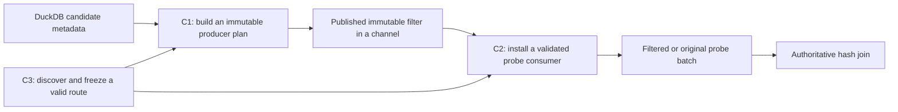

## 1. Scope And Reading Map

### 1.1 What this guide includes

| Unit | Main responsibility | Runtime behavior boundary |
|---|---|---|
| C1a-1 | Version-pinned DuckDB adapter and metadata preservation | Behavior preserving |
| C1a-2 | Sirius values, cache, identities, builder, freeze, publication lifecycle, execution reset | Behavior preserving under fixed configuration |
| C1b | Compact targets, stable channel entries, scan coverage, telemetry, shadow selectivity | Observable, but policy preserving |
| C1d | Enforce membership selectivity | Explicit A/B-controlled behavior change |
| C1e | Admit unfiltered-build candidates | Default-off candidate expansion |
| C2a | Shared mask operation, probe handle, validated join-probe consumer | No production routes; behavior preserving |
| C2b | History-aware, mode-aware memory reservation floor | Reservation behavior changes for safety |
| C3a | Discover routes and freeze a planning-only descriptor | Default-off; no live channel or endpoint |
| C3b | Validate converted topology and install opportunistic runtime routes | Default-off first value experiment |

### 1.2 What this guide does not include

- **C4:** the measured decision to enable C3 by default.
- **Track D:** ordered activation, which is added only if opportunistic coverage is not good enough.
- **Track E:** Sirius-created candidates, mixed provenance, broader operator crossing, aggregate
  producers, and other vNext expansion.
- **Track B implementation:** the deferred DuckDB LIMIT/TOP-N fix. While the current pin remains,
  LIMIT/TOP-N tests must use explicit expected results or a filters-disabled reference.

### 1.3 Dependency map

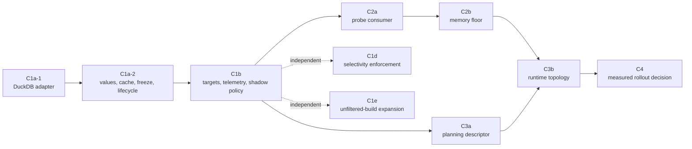

C1d and C1e are sibling policy experiments. C3 records their snapshotted settings, but does not
depend on either one.

## 2. The One-Page Mental Model

### 2.1 The problem

Phase 1 already publishes filters from a hash join's build side to a downstream table scan. That
works well if the filter reaches the scan before the scan reads its batches.

There is no general ordering guarantee, however. A scan batch may already have been decoded,
partitioned, concatenated, or queued by the time the outer join publishes its filter. Applying the
filter only at the scan cannot recover that missed work.

Track C adds **catch-up checkpoints** inside intermediate hash joins. Each checkpoint runs after the
consumer join obtains its branch-specific probe batch and immediately before it prepares probe keys
and performs hash lookup.

```text
Existing Phase 1:

    storage -> scan filter -> partition -> concat -> intermediate hash probe
                 ^
                 filter arriving late cannot revisit batches already past here

Track C through C3:

    storage -> scan filter -> partition -> concat -> [SIP checkpoint] -> hash probe
                 ^                                  ^
                 earliest chance                    catch-up chance
```

### 2.2 A running join chain

This guide uses the following logical shape:

```text
                         P  outer producing join
                       /   \
             probe: C2       build: filtered dimension P
                    / \
           probe: C1   build: dimension B
                  / \
        probe: fact   build: dimension A
```

The key used by `P` comes from `fact` and passes unchanged through the left/probe sides of `C1` and
`C2`. DuckDB has already admitted a dynamic-filter target at the `fact` scan.

Track C preserves that scan target and may add two more targets:

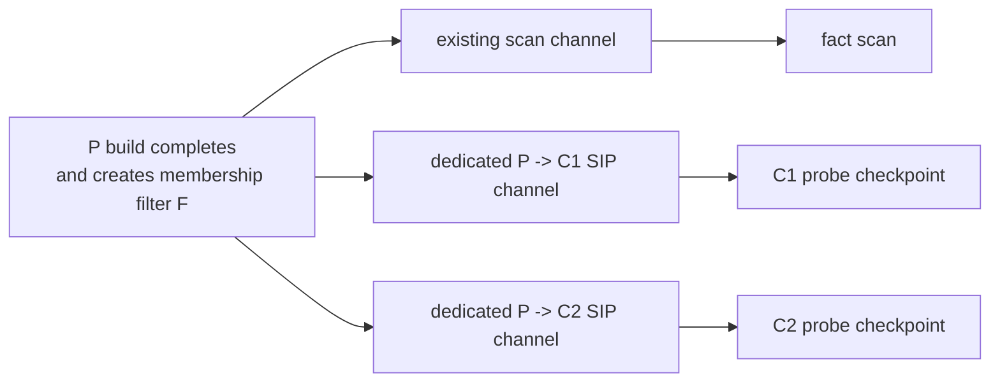

The same immutable filter object and filter ID can fan out to all three targets. The channels are
different because each consumer has its own close state, gate state, coverage, and lifetime.

### 2.3 Why the producing join is not its own consumer

`P` still performs the authoritative join. Applying `P`'s membership filter immediately before
`P`'s own exact hash lookup would duplicate nearly the same membership test merely to avoid failed
lookups. C3 therefore starts below `P` and records only intermediate joins.

### 2.4 The core ownership split

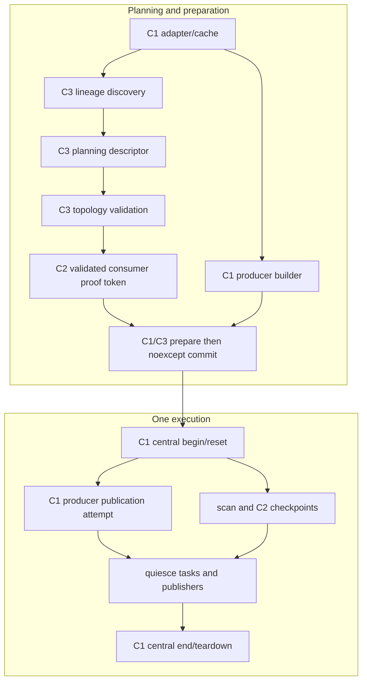

## 3. Vocabulary

| Term | Plain meaning |
|---|---|
| Candidate | DuckDB says a producing join/key/scan path may support dynamic filtering |
| Producer | The outer `BUILD_PROBE` hash join whose build keys create a filter |
| Key | One admitted equality component of the producing join |
| Target | One consumer endpoint receiving a producer's filter |
| Scan target | Existing Phase 1 target at a logical scan |
| Join-probe target | New C3 target at an intermediate hash join's probe checkpoint |
| Channel | Prepared-lifetime delivery object whose contents/open state/statistics reset per execution |
| Publication plan | Frozen description of one producer's admitted keys and targets |
| Route | One producer-to-join-consumer SIP connection |
| Gate | Per-endpoint policy that stops repeatedly applying an unhelpful visible membership filter |
| Planning descriptor | C3a's value-only record of routes; it has no live runtime channel |
| Prepared topology | C3b's fully validated, immutable producer and consumer installation |
| Execution generation | Strong ID naming one reset/open/use/close interval of reused prepared state |

### 3.1 Four entity identities

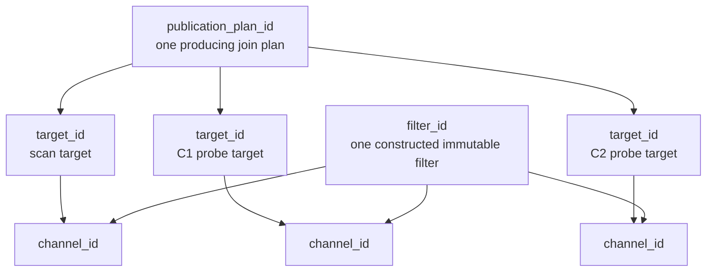

- A producer has one `publication_plan_id` even when it has several targets.
- Every target has its own `target_id`.
- Every logical consumer channel has a `channel_id`.
- One constructed filter gets one `filter_id` before fan-out; that ID is unchanged in every target.
- IDs are values. Object addresses are never event identity.

### 3.2 Five ordinal spaces

The design uses strong types because these integers look interchangeable but are not.

| Ordinal | Indexes |
|---|---|
| `duckdb_filter_ordinal` | Position `j` in `join_condition[j]` and each target's `columns[j]` |
| `join_condition_index` | Index into the reordered logical join-condition vector |
| `sirius_key_ordinal` | Compact index after Sirius rejects unsupported keys |
| `duckdb_column_ids_index` | Scan consumer column in DuckDB `column_ids` space |
| `probe_schema_ordinal` | Join consumer column in its runtime probe schema |

```text
DuckDB ordinal j = 0
        |
        +--> join_condition[0] = condition index 2
        +--> target.columns[0] = scan column 5
        +--> admitted by Sirius = Sirius key ordinal 0
        +--> C3 route at C1 = probe schema ordinal 3
```

An error between these spaces can apply a valid filter to the wrong column, which is a correctness
bug. The design therefore makes conversions explicit and validates them at freeze time.

## 4. End-To-End Lifecycle

The whole system has three distinct time scales:

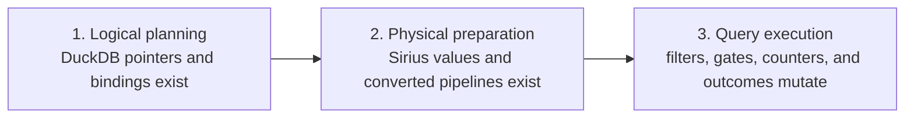

Do not move state casually across these boundaries. Most of the architecture exists to prevent
exactly that.

### 4.1 Full sequence

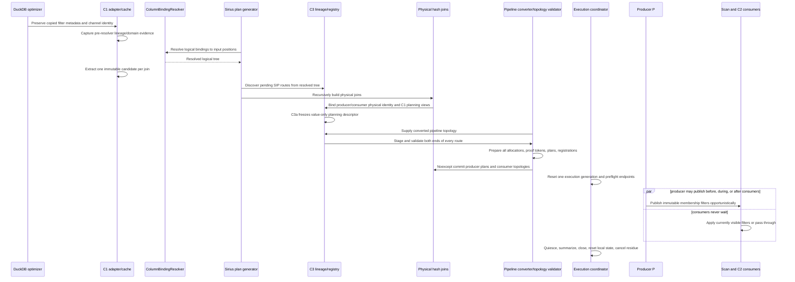

### 4.2 The invariant at each boundary

| Boundary | Required invariant |
|---|---|
| DuckDB copy -> Sirius planning | Shared scan-channel pointer identity is preserved |
| Pre-resolver -> post-resolver | Pre-only provenance is retained; resolver runs exactly once |
| Logical -> physical | No runtime code depends on DuckDB metadata layouts |
| Builder -> frozen plan | Every key/target/ordinal relationship validates |
| C3 descriptor -> runtime topology | Both physical endpoints and branch identity are proved |
| Preparation -> commit | All fallible work is finished; commit operations are `noexcept` |
| Prepared topology -> execution | Shared state is reset once to one exact generation |
| Execution -> teardown | Tasks are quiescent; summaries and closes happen exactly once |

## 5. Architectural Rules

### 5.1 DuckDB admits candidates; Sirius may only narrow

```text
Sirius producer/key candidates subset-of DuckDB optimizer candidates
```

Sirius does not invent a v1 filter candidate when DuckDB emitted no dynamic scan target. It may
reject a DuckDB candidate because the comparison, join type, cast, key shape, GPU type, lineage, or
physical topology is unsupported.

This is **candidate parity**, not **materialization parity**. DuckDB's CPU engine may choose min/max,
IN, or Bloom. Sirius independently chooses an exact set, Bloom, optional scan zone map, or no GPU
filter for an already-admitted key.

### 5.2 Fail closed

If Sirius cannot prove a mapping, it drops that key or route. It never guesses.

Examples:

- A target vector with the wrong arity rejects the whole target.
- An unresolved cast or non-equality condition is rejected per key.
- Zero or multiple GETs with the expected scan-channel identity reject that route.
- An ambiguous physical branch rejects both ends of that SIP route.
- A malformed or generation-invalid memory state returns a maximal reservation request rather than
  under-reserving.

The valid existing scan target remains intact when a new SIP route is rejected.

### 5.3 Build values, then freeze them

Mutable planning builders are not runtime configuration. Runtime sees only immutable Sirius-owned
values installed through a single-assignment boundary.

### 5.4 Prepared state and execution state are different

Prepared topology may persist across executions. Its mutable contents may not.

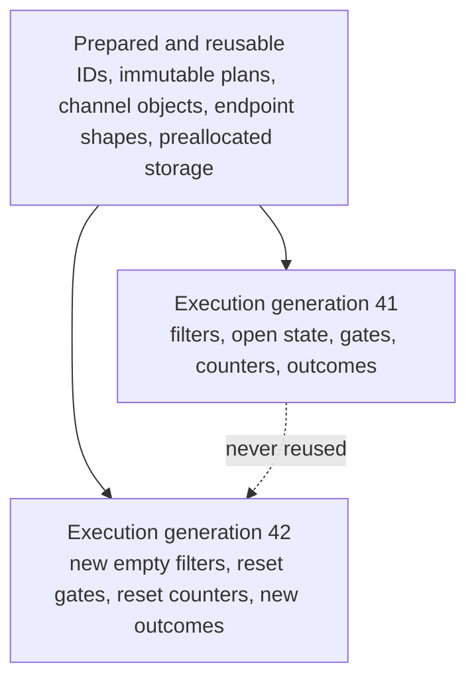

### 5.5 C3 is opportunistic

No probe task waits for a filter. A checkpoint applies the complete filters visible at that moment
or passes the original batch through. Publication timing affects performance, never relational
correctness.

## 6. C1: Producer Foundation

C1 turns version-sensitive DuckDB metadata into a stable, immutable Sirius producer contract.


### 6.1 C1a-1: the version-pinned adapter

DuckDB's `JoinFilterPushdownInfo`, `JoinFilterPushdownFilter`, and `DynamicTableFilterSet` are
internal structures with no stability promise. One adapter owns every version-sensitive read.

The adapter has two conceptual jobs:

1. **Preservation:** copying a logical plan through DuckDB serialization loses dynamic-filter
   fields, so the adapter reattaches them to the copy.
2. **Extraction:** it classifies and copies candidate data into Sirius-owned values.

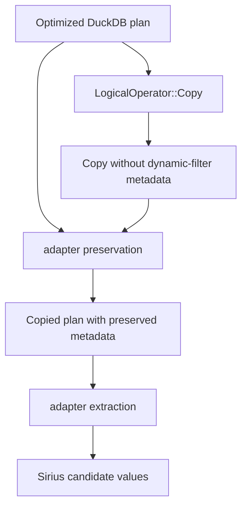

The critical preservation invariant is pointer identity:

```text
copied join target channel pointer == copied target GET channel pointer
```

Several producers may share one scan channel. Deep-copying one endpoint independently would break
the pairing.

The extracted candidate kind is:

| Kind | Meaning |
|---|---|
| `absent` | No `filter_pushdown` metadata |
| `statistics_only` | Non-null metadata deliberately has `probe_info.empty()` |
| `admitted` | At least one structurally valid target exists |
| `malformed` | Local structural invariants are broken |

The adapter validates local structure such as condition-index range, duplicates, target arity, and
channel identity. In a nonempty `probe_info`, one null-channel target is dropped when live siblings
remain; if every recorded target has a null channel, the candidate is `malformed`, not
`statistics_only`. The adapter does not pretend to prove full lineage; C3 does that later.

### 6.2 C1a-2: the two-phase candidate cache

> **Current implementation:** the pre-resolver pass records join-node identity and whether the
> resolver fence applies. It does not yet capture per-ordinal source-domain evidence. The current
> post-resolver API is `extract_post_resolver(root)`, and the hash-join constructor later resolves
> physical key positions. C1b must add the real pre-resolver payload. It must also make extraction
> reject any join node that was not captured and reject any captured node that was not extracted.

There is one DuckDB `ColumnBindingResolver`. The cache observes the tree immediately before and
after that destructive rewrite.

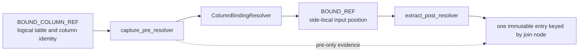

Before resolution, the expression can answer "where did I come from?" After resolution, the
logical join condition can answer "which side-local input slot will physical planning use?" The
cache itself does not store every `BOUND_REF` slot; the hash-join constructor later resolves those
positions from the post-resolver conditions.

The join object's address remains stable during top-level plan creation, so the cache uses that
address only as a short-lived planning key. The source logical tree owns the nodes and outlives the
cache lookup window.

The intended C1b pre-resolver payload is one optional source cardinality per DuckDB filter ordinal.
The post-resolver extraction freezes the candidate's comparisons, condition indexes, target
columns/types, and channel identities before recursive planning moves the logical fields.

Both C3 discovery and `plan_comparison_join` call `find()` and receive the same const candidate.
Neither performs a second extraction.

### 6.3 C1b domain evidence

For each candidate build key, the pre-resolver walk attempts:

```text
DuckDB filter ordinal
    -> producing condition's build-side logical binding
    -> value-preserving projection/group lineage
    -> source LogicalGet
    -> source cardinality callback
```

The result is `std::optional<size_t>`:

- proven nonzero source cardinality -> value;
- zero, missing callback, exception, computed expression, or untraceable source -> `nullopt`.

`nullopt` means "not proved." It does not mean an empty domain and never suppresses publication.

The value is a source row-cardinality proxy, not a proven distinct-key count or numeric value span.
That limitation is why C1b uses it only in shadow mode.

### 6.4 Builder and key decisions

The physical hash-join constructor resolves each DuckDB candidate against the actual post-resolver
hash keys and records one decision:

```text
admitted | non_equality | cast | unresolved
```

Only admitted keys receive a compact `sirius_key_ordinal` and a `dynamic_filter_key_plan` containing
the condition index, build column, build type, and optional domain evidence.

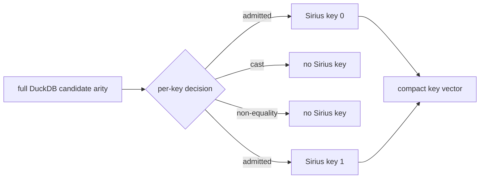

Final construction validates the complete bijection among candidate ordinals, decisions, admitted
keys, build columns, and target columns. The mutable builder remains private.

For join-probe SIP, final producer eligibility remains narrower than "DuckDB emitted metadata":

| Gate | Reason |
|---|---|
| Plain comparison producer shape | DELIM/ASOF machinery is outside C3 v1 |
| Supported producing join semantics | Membership rejection must be safe for the producer |
| Runtime `BUILD_PROBE` publication mode | Current producer materialization exists only on that path |
| Ordinary equality | Range and NOT DISTINCT semantics are not membership-mask equivalents |
| Direct resolved key, no cast | C1 must identify the authoritative build column/type |
| Supported GPU membership type | A candidate need not materialize a membership component |
| At least one live target | Avoid constructing an undeliverable filter |

C1 still preserves existing Phase 1 scan-route behavior while it builds this stronger immutable
contract. C3 adds only routes for producers that survive both the C1 planning decision and its own
plain-producer-shape checks.

### 6.5 The planning view

C3 needs admitted-key information before the runtime plan is frozen. It receives a narrow,
read-only `dynamic_filter_planning_view` rather than the builder or runtime plan.

The view exposes:

- the producer's publication-plan ID;
- whether existing Phase 1 wiring admitted the producer;
- whether the resolved builder can produce an enabled plan;
- one ordered decision per DuckDB filter ordinal;
- the admitted key and build type only when that decision is `admitted`.

This is a **capability view**, not a second source of truth. It must match the values later consumed
by final validation.

### 6.6 The one-shot freeze boundary

The runtime plan lives in a single-assignment slot. Installation uses two phases:

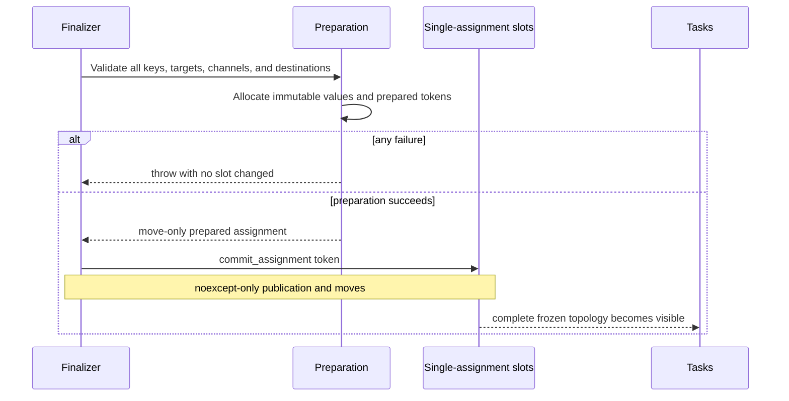

All allocation, hashing, vector growth, and error checking happens in preparation. Commit performs
only operations proven `noexcept`. This gives multi-operator topology installation transaction-like
semantics: tasks cannot observe half the routes installed.

The pattern is not a database transaction with rollback. It is **prepare everything, then publish
everything through non-failing operations**.

### 6.7 Immutable publication plan

In simplified form, the normative `dynamic_filter_publish_plan` contains:

```cpp
struct dynamic_filter_publish_plan {
  dynamic_filter_publication_plan_id id;
  std::vector<dynamic_filter_key_plan> keys;
  std::vector<dynamic_filter_publish_target> targets;
  dynamic_filter_publish_policy policy;
  std::vector<dynamic_filter_replica_space> replica_spaces;
};
```

The mutable construction type is `dynamic_filter_publish_plan_builder`; exact policy fields are
copied into the immutable plan during freeze.

Targets are a closed variant:

```cpp
using dynamic_filter_publish_target =
  std::variant<scan_publish_target, join_probe_publish_target>;
```

The variant keeps scan-column and join-probe-column ordinal spaces separate without a target class
hierarchy. Runtime exhaustively visits the two alternatives.

### 6.8 Publication attempt state machine

> **Target-only section:** this state machine is required by C1a-2 but is not implemented in the
> current working tree. Current code still uses `OPEN`, `PUBLISHING`, `FINISHED`, `FAILED`, and
> `CLOSED`, and `dynamic_filter_publisher::publish` returns `void`.

Every enabled plan reaches exactly one terminal outcome, even though C3 itself has no waiter.

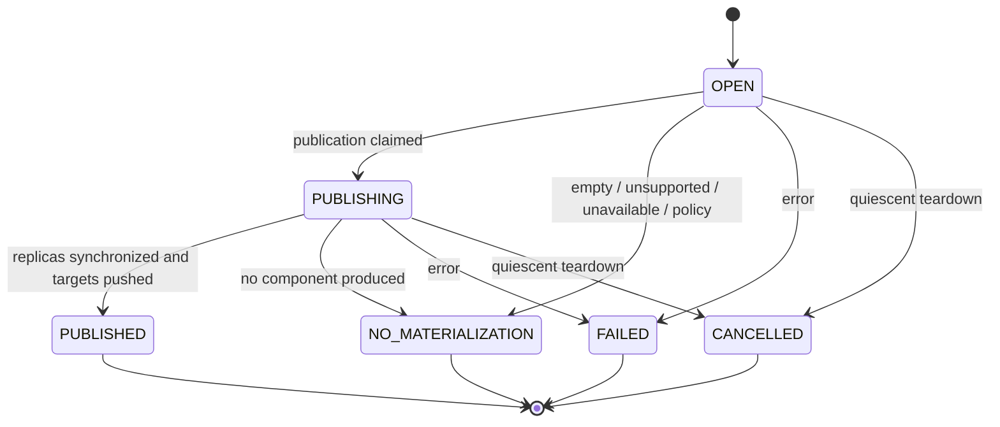

Typical `NO_MATERIALIZATION` reasons are `EMPTY_BUILD`, `UNSUPPORTED_MODE`, `POLICY_SKIPPED`,
`SOURCE_UNAVAILABLE`, and `CONSUMER_CLOSED` when every accepting target is already closed. Target
outcomes are recorded separately as `ACCEPTED`, `CONSUMER_CLOSED`, or `PLANNING_REJECTED`; one
closed target does not change the outcome of a live sibling.

### 6.9 Execution-scoped reset

> **Target-only section:** none of the reset sequence below is implemented in the current working
> tree. Frozen-plan reuse exists, but its channels and publication attempts are not made fresh for
> a second execution. Reuse must not be treated as safe until this section and its repeated-execution
> tests are complete.

Immutable plans and channel objects may belong to cached prepared state. Their mutable contents are
fresh for every query execution.

```mermaid
sequenceDiagram
    participant Q as Execution coordinator
    participant Ch as Unique channels
    participant A as Publication attempts / filter IDs
    participant C2 as C2 consumers
    participant Tasks as Query tasks

    Q->>Ch: clear filters, reopen, set exact generation N
    Q->>A: reset outcomes and filter-ID counter; start event epoch
    Q->>C2: preflight generation N for every endpoint
    Q->>C2: begin_execution N, reset preallocated local state
    Q->>Tasks: allow task creation and execution
    Tasks-->>Q: quiescent success or abort
    Q->>Ch: emit summaries and normal/abort close
    Q->>C2: end_execution, reset local gates/counters
    Q->>A: cancel residual attempts and assert terminal state
```

C1 owns shared reset, channel generation, publication outcomes, filter IDs, and the event epoch.
C2 begin/end owns only its local gate, counter, and batch-tracking reset. No component independently
increments a channel generation.

Prepared topology has a **single-execution lease**. A second execution cannot borrow and reset the
same channel/gate objects until the previous execution is quiescent and has completed teardown. An
overlapping caller must be rejected before reset or use a cloned topology with independent mutable
state.

### 6.10 C1b compact targets and channel entries

DuckDB target vectors retain full DuckDB candidate arity. At freeze, C1b compacts each structurally
valid target to exactly the admitted keys. A rejected cast or range key disappears independently;
a structurally malformed target still fails as a whole.

Every compact `scan_target_key` retains its original `duckdb_filter_ordinal` and validates against
the admitted plan-key vector. Scan keys use `duckdb_column_ids_index`; join-probe keys use the
distinct `probe_schema_ordinal`. Compaction never erases the information needed to prove which
DuckDB key and consumer column were paired.

Each channel stores an immutable provenance-carrying entry:

```cpp
struct dynamic_filter_channel_entry {
  dynamic_filter_publication_plan_id publication_plan_id;
  dynamic_filter_target_id target_id;
  dynamic_filter_channel_id channel_id;
  dynamic_filter_id filter_id;
  std::shared_ptr<const sirius_dynamic_filter> filter;
};
```

This lets telemetry join producer, target, channel, filter, key, and consumer facts without using
addresses.

### 6.11 C1b shadow selectivity

At publication time C1b compares runtime build rows to the optional source-cardinality evidence:

```text
coverage = runtime build rows / source GET cardinality
```

With a threshold of `0.9`:

| Source estimate | Build rows | Shadow decision |
|---:|---:|---|
| 1,000,000 | 50,000 | `would_publish` |
| 1,000,000 | 950,000 | `would_suppress` |
| unknown | any | `unknown` |

C1b still materializes and publishes exactly as it would without this evidence. It records actual
materialization and hypothetical selectivity as different facts:

```text
membership_materialization = exact_set | bloom | none_unsupported_type
zone_map_materialization    = emitted | none_disabled | none_invalid_minmax
shadow_selectivity_decision = unknown | would_publish | would_suppress
```

`would_publish` does not promise a filter will exist. Empty build, unsupported type, failure, or a
closed target may still prevent publication.

### 6.12 C1d and C1e policy branches

These are independent of C3 topology.

| Policy | Off | Shadow | Enforce |
|---|---|---|---|
| Membership coverage | Do not evaluate | Evaluate/log; still build | Suppress membership when known coverage meets threshold |
| Zone-map range | Do not evaluate | Evaluate/log; still build | Remains shadow-only |

C1b records shadow decisions unconditionally and does not add a mode setting. C1d owns the full
`dynamic_filter_selectivity_gate=off|shadow|enforce` configuration and plan-snapshot plumbing,
defaulting to `shadow`; `enforce` changes membership behavior. Unknown domain evidence never
suppresses. Zone-map enforcement is deferred because source row cardinality does not prove numeric
value-domain span.

C1e separately allows producers whose build subtree lacks DuckDB's `build_side_has_filter` hint.
It is default off because it expands cost exposure and candidate count. The hint is a cost signal,
not a correctness proof.

## 7. Scan And SIP Channel Shapes

The two channel kinds intentionally have different producer cardinality.

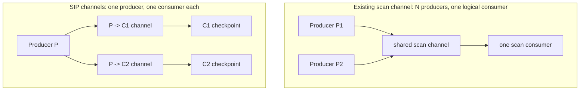

Why not share one SIP channel across consumers?

- One consumer may close before another.
- Each consumer has its own usefulness gate.
- Coverage and first-visible timing differ per consumer.
- Future ordered activation, if needed, is route-local.

Filter replicas are not duplicated per channel. For each materialized key/component, publication
constructs one immutable filter and its device replicas, then places that same object and filter ID
into every matching accepting channel. A multi-key plan may construct several filters.

### 7.1 Executable-plan-only planning events

C1b gives each generator an explicit `validation` or `execution` purpose. Planning events are
buffered and flush only after top-level create/fold/verify succeeds for an executable plan.
Validation, fallback, and failed generators discard them. Freeze and runtime events come only from
the accepted execution path, so telemetry never describes a plan that did not run.

## 8. C2: The Join-Probe Consumer

C2 builds a safe consumer before C3 creates any production route. The route planner connects to a
small, already-tested capability instead of adding filtering logic directly to the large hash-join
execution method.

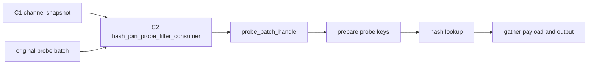

### 8.1 C2a has no production routes

C2a lands and tests the shared mask operation, scope-bound probe handle, composed join consumer,
capability validation, move-only proof token, preallocated persistent consumer bookkeeping, and
allocation-free begin/end hooks. The checkpoint still allocates masks and gathered tables. C3b is
the first component allowed to install a production route.

### 8.2 Shared mask operation

The existing scan mask operation moves to the general operator namespace. Both consumers reuse the
same behavior over `sirius_mask_applicable` filters.

```text
apply_dynamic_filters_gated_view(...)
    |
    +--> scan: membership masks plus scan AST row masks
    |
    +--> join probe: membership masks only
```

Zone maps stay scan-reader capabilities. They never enter join-probe SIP channels. The mechanical
move preserves C1b's filter IDs, channel snapshots, visibility records, measurements, and scan
summaries.

### 8.3 The exact checkpoint

```text
C probe feeder
    -> PARTITION
    -> CONCAT
    -> C.default repository
    -> pop branch-specific probe batch
    -> [C2 SIP checkpoint]
    -> prepare_join_keys
    -> hash lookup
    -> gather output
```

The checkpoint catches batches already queued beyond the scan, but cannot recover decoding,
partitioning, or shuffle work already paid. It supports eligible `BUILD_PROBE` and `STANDARD`
consumer paths. `MIXED` is rejected in v1.

### 8.4 Why `probe_batch_handle` is required

Suppose a filter changes `[A, B, C, D]` into `[A, C]`. Hash indices computed against `[A, C]`
cannot later index payload rows in `[A, B, C, D]`: index `1` means different rows.

Every post-checkpoint probe read therefore goes through one move-only handle:

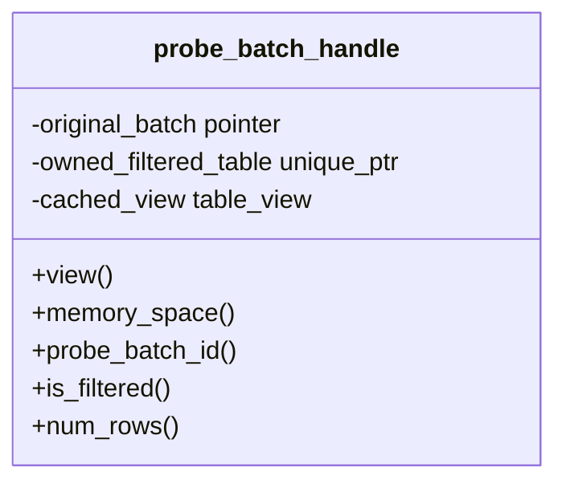

| Mode | View | Ownership |
|---|---|---|
| Passthrough | Aliases original batch | Non-owning, execute-scoped |
| Filtered | Views a gathered table | Owns the table |

Private execution helpers take the handle rather than the input-batch vector. Removing the original
vector from their scope is a compile-time fence against mixed indexing.

### 8.5 Checkpoint algorithm and fast paths

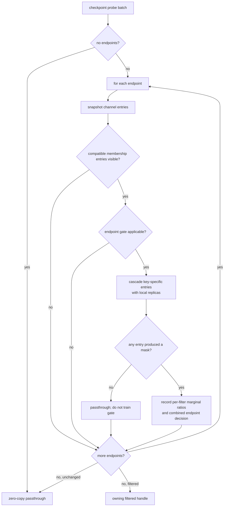

One endpoint channel can hold several key-specific membership entries. Compatible visible entries
are applied most-selective-first, skipping an entry whose replica is unavailable on the probe
device. Filters then cascade across endpoints. A zero-row result remains schema-correct and
completes normally. Device identity comes from the probe batch's memory space, never ambient CUDA
state.

### 8.6 Gates and repeated batches

Every endpoint has independent gate state. If the scan already removed most bad rows, a later join
checkpoint may observe little marginal benefit and disable itself. If the scan missed publication,
the same checkpoint may remain useful.

`membership_measured KEEP|SKIP` is a consumer observation of actual rows. It is different from
C1b's producer-side `would_publish|would_suppress` estimate.

A `STANDARD` join may pair the same probe batch with several build batches. C2 tracks
`(endpoint, probe_batch_id)` applications in a bounded FIFO plus exact aggregate repetition and
eviction counters. An entry is recorded only when the checkpoint actually produced a filtered
table; empty-channel, disabled-gate, and replica-unavailable passthrough do not consume tracker
capacity. It never retains an unbounded map and tracking never affects correctness.

### 8.7 Capability validation and proof token

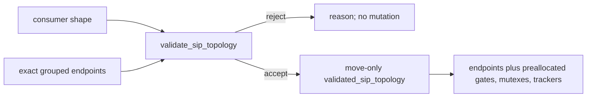

The token is a proof-carrying value: only validation can create it, it owns exactly what was
validated, it preallocates persistent state, and only possession of it satisfies the `noexcept`
install seam called by C3/the physical join. Execution begin does not reconsider eligibility or
remove a producer target.

### 8.8 Shared versus local execution state

| C1 coordinator owns | C2 consumer owns |
|---|---|
| Clear/reopen channel | Reset local gates |
| Exact execution generation | Reset counters and batch tracker |
| Publication outcome and filter IDs | Checkpoint application |
| Event epoch and channel close | Reservation snapshot |

All persistent consumer bookkeeping is allocated during preparation. C2 begin/end reset it in
place and are `noexcept`; checkpoint and join data operations still allocate their task-local GPU
tables, masks, casts, indices, and output.

## 9. C2b: Safe Memory Reservation

C2b adds an always-evaluated memory floor because publication and join-state changes can invalidate
an otherwise successful history sample.

### 9.1 Resident versus transient memory

The query has non-spillable resident floors from pinned `BUILD_PROBE` build/hash state and
device-local filter replicas. C2b primarily fixes **transient task reservation**, which is separate
from observing those resident bytes in query high-water telemetry.

Extra C3 targets share immutable filter objects and do not duplicate device replicas. Replica bytes
scale with materialized key components and devices, not channel count. An aggregate replica budget
is required before broader Track E candidate expansion.

```mermaid
flowchart LR
    H0["Task succeeds before publication\nsmall history peak"] --> Pub["filter becomes visible"]
    Pub --> H1["next task overlaps mask, casts, lookup, indices, output"]
```

### 9.2 Why history alone is unsafe

Two phase changes matter:

1. A channel can gain a filter after a no-filter task trained history.
2. A `BUILD_PROBE` join changes from an initial build-plus-probe task to later probe-only tasks with
   a persistent hash table.

`active_peak_memory_floor` is evaluated for every reservation, including history-backed tasks.

Its C2 snapshot uses C1's strong **execution generation**, a separate saturating
`visible_filter_count`, and `may_apply_or_grow`. The mask term remains charged while a channel has a
visible entry **or can still publish one**, even if no filter is visible at estimate time. Its
worst-case cascade term is independent of the current visible count. Only a terminal, empty channel
that cannot grow may drop the term to zero.

### 9.3 Task-new mask allocation overlap

```mermaid
flowchart TB
    Input["caller-retained input\nresident, not always task-new"] --- Peak["simultaneous residency"]
    Previous["previous cascade result"] --- Peak
    Next["next gathered output"] --- Peak
    Mask["BOOL8 mask"] --- Peak
    Map["gather map"] --- Peak
    Scratch["backend scratch"] --- Peak
```

The shared estimator sizes **new allocations**: the previous and next full-size cascade tables,
BOOL8 mask, gather map, and calibrated backend scratch. A join checkpoint uses
`charge_input=false` because its caller already owns the probe table. The scan dynamic-filter phase
uses `charge_input=true` because decoded projected output was allocated earlier in that same scan
task. Nonresident input materialization is added separately.

The estimator uses saturating arithmetic. When rows are unknown, schema-derived minimum row bytes
must be a proved lower bound so `ceil(bytes / min_row_bytes)` is a conservative row upper bound.

### 9.4 Full join coexistence floor

The floor includes overlapping build/probe key casts, transient hash construction where applicable,
mask and gather scratch, result index vectors, and gathered output. It is not merely a mask-sized
increment.

```mermaid
flowchart LR
    Stats["input stats + join mode/state"] --> Floor["active peak floor"]
    Snapshot["generation-valid consumer snapshot"] --> Floor
    History["history or no-history estimates"] --> Max["mode-specific max"]
    Floor --> Max
    ScanFloor["existing scan working-set floor"] --> Max
    Max --> Reserve["reservation plus input materialization"]
```

The pipeline combines estimates as follows:

```text
history exists:
  peak = max(history_estimate, active_floor, existing GPU-scan working-set floor)

no history:
  peak = max(all operator no-history estimates,
             active_floor,
             saturating 2x generic fallback)

reservation = saturating_add(peak, bytes_to_materialize_input)
```

| Mode/state | Main task-new allocations |
|---|---|
| `STANDARD` | Build casts/hash, optional mask, probe casts, result indices, output |
| Initial `BUILD_PROBE` | Same two-batch coexistence |
| Built probe-only `BUILD_PROBE` | Optional mask, probe casts, result/output using build snapshot |
| `MIXED` | No SIP endpoint; conservative fallback |

The built/probe-only path excludes persistent hash storage from **task-new** reservation, while
query resident high-water still observes it.

Key-cast bytes use target key widths and row counts, including widening. Index vectors are sized by
result rows, and variable-width output includes conservative side-footprint replication.

| Join path | Result-row bound |
|---|---|
| SEMI, ANTI, MARK, distinct-build INNER/LEFT | Probe rows |
| RIGHT_SEMI, RIGHT_ANTI | Build rows |
| General INNER | Probe rows x build rows |
| LEFT/RIGHT | Maximum of product and preserved side |
| FULL | Maximum of product and probe-plus-build rows |

Every add and multiply saturates.

### 9.5 Build snapshot ordering

Probe-only tasks do not carry a build batch, so the join publishes build bytes/rows/validity before
publishing `BUILT` with release ordering. The estimator acquire-loads `BUILT` before reading that
snapshot.

```mermaid
sequenceDiagram
    participant B as Build task
    participant S as Join state
    participant M as Estimator
    B->>S: write build snapshot
    B->>S: release-store BUILT
    M->>S: acquire-load BUILT
    S-->>M: snapshot is visible
    M->>M: size probe-only output
```

A valid empty build is a valid zero-row snapshot. Missing snapshot, malformed batch shape, or
generation disagreement fails closed with `SIZE_MAX` instead of under-reserving.
An impossible `MIXED` mode with an installed SIP endpoint fails closed the same way; the normal
`MIXED` fallback applies only when no endpoint exists.

### 9.6 C2 handoff to C3

At the end of C2, the consumer is correct, topology-validatable, preallocated, generation-aware,
and safely reserved, but unreachable from production planning. C3 can now focus entirely on finding
and committing valid connections.

## 10. C3: Discovering And Binding Routes

C3 connects a C1 producer to one or more C2 consumers. It is split because logical discovery and
runtime installation have very different risk.

| C3a | C3b |
|---|---|
| Walk resolved logical plan | Inspect converted physical pipelines |
| Bind logical nodes to physical joins | Validate branch/runtime identity |
| Resolve DuckDB ordinals through C1 planning view | Allocate dedicated channels and build both value ends |
| Freeze a value-only planning descriptor | Ask C2 to validate exact channel-bearing endpoint groups |
| Emit planning telemetry | Prepare and commit proof tokens plus producer targets |
| **No live channel or endpoint** | **First runtime SIP route** |

```mermaid
flowchart LR
    Resolved["resolved logical tree"] --> Discover["C3a lineage discovery"]
    Discover --> Bind["bind physical joins and C1 key decisions"]
    Bind --> Desc["frozen planning descriptor"]
    Desc --> Convert["pipeline conversion"]
    Convert --> Stage["C3b stage and validate topology"]
    Stage --> Commit["prepare then noexcept commit"]
    Commit --> Runtime["live producer and consumer route"]
```

The [C3 implementation plan](issue-1010-plans/C3-routes-and-freeze.md) supersedes older Phase 2
text in `dynamic-filters.md` where they differ. In particular:

- the existing scan-channel map remains keyed by preserved `DynamicTableFilterSet*` identity;
- SIP does not generalize that map to a variant key;
- every `(producer, consumer)` SIP route gets a dedicated channel; and
- C3 is opportunistic and does not rely on implicit pipeline ordering.

### 10.1 Discovery timing

C3 discovery runs after the sole `ColumnBindingResolver` pass and after C1 has populated the
immutable candidate cache, but before recursive physical planning drains conditions and children.

```text
C1 pre-resolver evidence
    -> ResolveOperatorTypes
    -> ColumnBindingResolver
    -> C1 post-resolver candidate extraction
    -> C3a route discovery
    -> recursive physical create_plan
```

At this point:

- candidate target/channel identity is available from C1;
- producer probe keys are positional `BOUND_REF` expressions;
- logical child bindings can recover the starting `ColumnBinding`;
- no physical join exists yet; and
- no admitted Sirius key exists until the hash-join constructor resolves it.

Discovery must not pretend that the adapter candidate already contains final admitted physical
keys.

### 10.2 Pure lineage pass

For each producer candidate key and each DuckDB scan target, the lineage pass performs these steps:

1. Read the producer's resolved left/probe key position.
2. Recover the starting binding from the producer's left-child output bindings.
3. Find exactly one target `LogicalGet` with the preserved channel identity.
4. Walk from the producer's left child toward that GET.
5. Remap only through proved value-preserving operators.
6. At each eligible intermediate join, record a consumer when the key originates in its left/probe
   child, then continue left.
7. Require the final binding to match DuckDB's target column for that filter ordinal.
8. Group and deduplicate keys by `(producer logical node, consumer logical node)`.

```mermaid
flowchart TD
    P["Producer P left key position"] --> Start["recover starting ColumnBinding"]
    Start --> Get{"exactly one target GET by channel identity?"}
    Get -->|no| RejectGet["reject target"]
    Get -->|yes| Walk["walk branch toward GET"]
    Walk --> Node{"next operator classification"}
    Node -->|cross| Walk
    Node -->|projection remap| Remap["prove direct pass-through ref"] --> Walk
    Node -->|eligible intermediate join| Origin{"binding from left/probe child?"}
    Origin -->|yes| Record["record consumer and probe ordinal"] --> Walk
    Origin -->|no| RejectRight["stop: right-origin binding"]
    Node -->|stop| RejectCross["stop this route"]
    Walk --> Final{"final binding equals DuckDB target column?"}
    Final -->|no| RejectFinal["reject target"]
    Final -->|yes| Pending["pending logical SIP target"]
```

The pass is pure over the resolved logical tree and Sirius candidate values. It emits values and
rejection reasons, not runtime pointers or channels.

### 10.3 Running-example discovery

For the running chain, C3 starts at `P`'s probe key and walks toward the `fact` GET:

```mermaid
flowchart TB
    P["P producer\nstart below this node"]
    C2["C2 eligible INNER/SEMI hash join\nrecord probe consumer"]
    C1["C1 eligible INNER/SEMI hash join\nrecord probe consumer"]
    F["fact GET\nchannel identity and final binding match"]
    P --> C2 --> C1 --> F
```

The result contains two pending targets, `P -> C2` and `P -> C1`. Reaching the scan does not delete
either checkpoint. The scan remains the earliest target, while the intermediate checkpoints catch
batches that passed it too early.

### 10.4 Crossing rules

The v1 walk is intentionally conservative.

| Logical operator | C3 action |
|---|---|
| Filter | Cross; binding unchanged |
| ORDER BY without limit | Cross; binding unchanged |
| DISTINCT | Cross; binding unchanged |
| Projection | Cross only a direct pass-through reference; remap binding |
| Eligible comparison join | Record consumer, then continue left only for a left-origin binding |
| Aggregate | Stop |
| LIMIT / TOP-N | Stop |
| WINDOW / UNNEST | Stop |
| UNION / INTERSECT / EXCEPT | Stop at branching boundary |
| CTE, recursive, materialized, reusable source | Stop |
| Computed expression or cast | Stop |
| DELIM / ASOF join | Stop and reject as a producer/consumer shape |

An eligible intermediate consumer is an equality `INNER` or `SEMI` join whose constructor-fixed
shape will not become `MIXED`. Physical validation later confirms it actually became a Sirius hash
join.

Stopping is route-local. A stop below one checkpoint does not invalidate already-collected higher
checkpoints or a valid existing scan target.

### 10.5 Safety argument

For an ordinary equality key, a membership filter built from `P`'s build keys has no false
negatives. The lineage pass proves that the value at `C`'s probe input is the same value that later
reaches `P`'s probe.

Therefore:

```text
row rejected by P's membership filter at C
    -> cannot later match P's build keys
    -> P would reject that lineage anyway
```

The authoritative join still rechecks every survivor. V1's INNER/SEMI and direct-left-origin limits
make this argument simple; broader predicate commutation requires a separate proof.

### 10.6 Discovery output is deliberately incomplete

A pending key contains only facts discovery can honestly know:

```cpp
struct pending_join_probe_key {
  duckdb_filter_ordinal duckdb_ordinal;
  probe_schema_ordinal consumer_column;
  cudf::data_type consumer_type;
};
```

It does **not** yet contain:

- a compact Sirius key ordinal;
- the producer's authoritative build column/type;
- a live channel object;
- a C2 endpoint; or
- an installable runtime route.

Target and channel IDs may be minted from C1's shared generator allocator, but channel allocation
waits for C3b topology staging.

### 10.7 Physical endpoint binding

Recursive physical planning constructs children before parents, so a consumer often binds before
its producer. The query-local registry supports either order.

```mermaid
sequenceDiagram
    participant G as Physical plan generator
    participant C as Consumer join C
    participant R as C3 registry
    participant P as Producer join P

    G->>C: construct child physical hash join
    C->>R: bind consumer identity and probe schema
    G->>P: construct parent physical hash join
    P->>R: bind producer identity plus C1 planning view
    R->>R: resolve pending DuckDB ordinals to admitted Sirius keys
```

The producer bind maps each pending DuckDB ordinal through C1's `dynamic_filter_planning_view`:

- not wired -> `PRODUCER_NOT_WIRED`;
- rejected key -> `KEY_NOT_ADMITTED`;
- no surviving key -> `NO_ADMITTED_KEYS`;
- admitted key -> copy its compact key identity and authoritative build type.

The bind never calls the runtime publication-plan accessor before freeze and never indexes
protected equality-compacted hash-join members.

### 10.8 Registry lifetime

The plan generator is stack-local, so C3's frozen descriptor must be handed to prepared statement
data and survive until pipeline conversion. Mutable logical-node maps do not survive.

```mermaid
flowchart LR
    Generator["stack-local generator and mutable registry"] --> Freeze["freeze planning descriptor"]
    Freeze --> Prepared["prepared statement data owns value descriptor"]
    Generator --> Gone["generator destroyed"]
    Prepared --> Engine["engine retains descriptor through pipeline conversion"]
    Engine --> Stage["C3b runtime staging"]
    Stage --> Drop["drop working registry references"]
```

Validation-purpose or failed/fallback generators discard their descriptors and buffered planning
events. Only an accepted executable plan exports C3 state.

### 10.9 C3a freeze

C3a freezes the planning descriptor after successful create/fold/verify. It performs no pipeline
branch validation, allocates no channel, installs no C2 endpoint, and changes no C1 runtime target.

```text
enable_dynamic_filter_sip = true with C3a only
    -> lineage work and planning telemetry
    -> frozen value descriptor
    -> zero runtime route effect
```

This boundary makes C3a independently reviewable: flag-on execution must remain equivalent to
flag-off execution.

## 11. C3b: Runtime Topology Transaction

C3b begins only after physical plan conversion has exposed scheduled pipelines, planned repository
wiring, and branch context. Logical proof alone cannot establish these runtime facts.

### 11.1 Staging boundary

The engine stages additions after pipeline conversion and before repository wiring is materialized
and before query tasks can start.

```text
physical plan
    -> pipeline conversion
    -> [C3b stage + prepare + commit]
    -> execution begin
    -> repository wiring materialization
    -> create/start query tasks
```

This ordering follows the planned `initialize_internal` insertion point: topology commit and the
execution-generation preflight occur after conversion but before repository wiring is materialized.
No task can start until all of them finish.

### 11.2 Validation pipeline

For each C3a route, C3b performs all fallible work before mutation:

```mermaid
flowchart TD
    D["C3a planning descriptor"] --> E{"both physical hash joins exist?"}
    E -->|no| Reject["reject both SIP ends"]
    E -->|yes| B{"unique producer and consumer branches?"}
    B -->|no| Reject
    B -->|yes| K{"consumer ordinal and type match producer key?"}
    K -->|no| Reject
    K -->|yes| Ends["build producer target and consumer endpoint values"]
    Ends --> Group["group once per physical producer and consumer"]
    Group --> C2["C2 validates exact endpoint vector and preallocates token"]
    C2 -->|reject group| RejectGroup["remove every matching producer target"]
    C2 -->|accept| Global["validate global producer/consumer bijection"]
    Global --> Prepare["prepare plans, registrations, slots, descriptor"]
```

The concrete checks are:

1. Both logical endpoints became expected Sirius physical hash joins.
2. The producer remained viable according to its C1 planning bind.
3. Exactly one scheduled producer branch and one expected consumer probe branch exist.
4. The consumer ordinal is in range and consumer type matches the producer build type.
5. A dedicated, initially unregistered SIP channel and both value ends are built.
6. C2 validates each complete consumer group and returns one proof token.
7. A global bijection matches producer and consumer ends on publication, target, channel ID, and
   channel pointer.

If one endpoint in a consumer group fails C2 validation, the entire consumer group is discarded and
all matching producer targets are removed. No producer can publish into an endpoint that failed to
install.

### 11.3 Both route ends

One accepted route creates matching values:

```mermaid
flowchart LR
    Producer["join_probe_publish_target\nC1 producer plan"]
    Match["same publication_plan_id\ntarget_id\nchannel_id\nchannel pointer"]
    Consumer["sip_endpoint_desc\nC2 consumer token"]
    Producer --- Match --- Consumer
```

The producer target owns admitted key mappings, including consumer probe ordinals. The C2 endpoint
does not duplicate producer key vectors; it owns endpoint identity, channel, gate policy, and local
consumer state.

### 11.4 Prepare and commit

Preparation builds one opaque transaction containing:

- every immutable C1 producer plan and prepared assignment;
- every C2 validated topology token;
- every prepared SIP channel registration;
- the full canonical topology and fingerprint; and
- prepared single-assignment publications for all destinations.

```mermaid
sequenceDiagram
    participant S as C3 staging
    participant P as prepare_sip_topology
    participant C as commit_sip_topology
    participant R as Runtime tasks

    S->>P: grouped producer and consumer additions
    P->>P: allocate, validate, prebuild all values
    alt any preparation failure
        P-->>S: throw; zero slots and registrations changed
    else prepared
        P-->>C: move-only prepared transaction
        C->>C: atomic register_producer calls
        C->>C: publish prepared C1 assignments
        C->>C: move C2 proof tokens into consumers
        Note over C: every operation statically noexcept
        C-->>R: complete topology becomes visible
    end
```

This is an **observationally atomic topology commit**. No worker can see only the producer target or
only the consumer endpoint.

### 11.5 C1 base plans always freeze

C3's wrapper invokes C1's generic preparation for every producer builder even when:

- SIP is disabled;
- no C3 registry exists;
- a producer has scan targets only;
- no key was admitted; or
- every C3 route was rejected.

Registry presence is never the condition for freezing C1. Otherwise no-route joins would retain an
unassigned runtime slot.

### 11.6 Prepared-topology reuse

The first commit retains the canonical topology and a digest in cached prepared state. A later
initialization may verify an identical topology rather than assign slots again. The digest is only
a fast rejection; success requires full canonical value comparison.

Current entry paths may rebuild prepared data rather than exercise this reuse branch. The branch is
still a forward-looking guard. Regardless of reuse versus rebuild, every execution must receive a
fresh generation, empty/open channels, reset filter IDs, reset gates, and fresh counters.

The cached topology also owns a **single-execution lease**. Overlapping execution on the same
channel/gate objects is rejected before reset; an implementation that needs overlap must clone the
topology and its mutable channel/consumer state.

### 11.7 Publisher fan-out

C3b adds join-probe targets to C1's existing target variant. Runtime publication remains C1-owned.

```mermaid
flowchart TB
    Build["each admitted build-key component"] --> Filter["construct one membership filter component"]
    Filter --> Replicas["construct and synchronize that component's replicas once"]
    Replicas --> ScanTarget["scan target entry"]
    Replicas --> Sip1["P -> C1 membership entry"]
    Replicas --> Sip2["P -> C2 membership entry"]
```

Only membership filters enter `join_probe_publish_target` channels. Zone maps remain scan-only.
For each materialized component, the same immutable filter pointer and filter ID fan out to every
matching target; channels co-own the object and do not duplicate replicas. Composite producers may
materialize several membership filters and therefore several filter IDs.

A drained scan does not suppress a live SIP sibling, and a closed SIP endpoint does not close the
scan or another SIP target.

### 11.8 Consumer installation and execution

C3 commit moves the C2 proof token into each physical consumer. At execution begin:

1. C1 clears/reopens unique channels and attempts.
2. C1 sets one exact execution generation and resets filter IDs.
3. The coordinator verifies every C2 endpoint reports that generation.
4. C2 resets only local preallocated state.
5. Tasks may start.

At normal or abnormal end:

1. Quiesce task creation, tasks, and publishers.
2. Emit normal or partial scan/SIP summaries.
3. Normal-close or abort-close each unique channel.
4. Run C2 local end hooks.
5. Cancel residual C1 attempts and assert all endpoints terminal/closed.

### 11.9 Default-off flag

`enable_dynamic_filter_sip` is snapshotted into the executable plan. A `SET` affects a newly
prepared plan, not an already cached plan. Runtime does not repeatedly read the setting.

Flag-off behavior has no registry and no SIP telemetry. For a pushdown-enabled, route-bearing,
accepted plan, C3a flag-on can emit descriptor telemetry but still has no runtime topology. C3b
flag-on is the first path that can install live routes; a plan with no surviving route remains a
valid no-route plan.

## 12. Opportunistic Runtime Behavior

C3 never waits. A consumer snapshots its channel when a probe batch reaches the checkpoint and
applies the complete membership filters visible at that moment.

### 12.1 Three publication timings

```mermaid
sequenceDiagram
    participant P as Producer P
    participant S as Scan
    participant C1 as C1 checkpoint
    participant C2 as C2 checkpoint

    rect rgb(235, 248, 235)
      Note over P,C2: Early publication
      P-->>S: filter visible before scan
      S->>C1: already-filtered rows
      C1->>C2: gates may observe little marginal value
    end

    rect rgb(250, 245, 225)
      Note over P,C2: Mid-flight publication
      S->>C1: batch passed scan before filter
      P-->>C1: filter becomes visible
      C1->>C2: C1 catches the batch
    end

    rect rgb(248, 235, 235)
      Note over P,C2: Late publication
      S->>C1: batch misses scan
      C1->>C2: batch misses C1
      P-->>C2: filter becomes visible
      C2->>C2: C2 catches it, or passes if already too late
    end
```

All three cases are correct because the downstream joins remain authoritative. Only the amount of
work avoided differs.

### 12.2 Why no ordering is assumed

There is no general happens-before edge from an outer producer build to a lower consumer probe.
The old global build-priority pass was deleted and was never a correctness contract. A lower join's
build hint drives that lower join's build, not the outer producer's build.

C3 therefore measures:

- batches and rows before the first visible filter;
- rows caught at scans versus intermediate joins;
- hash-probe rows and estimated bytes avoided;
- mask cost and gate disable decisions;
- repeated `STANDARD` applications;
- publication outcomes and replica availability; and
- end-to-end time and valid query-scoped memory evidence.

If a valuable route class consistently misses publication, C4 may depend on Track D for that class.
C3 does not quietly grow a waiter.

### 12.3 Concurrency rules

- Publication constructs and synchronizes usable replicas before pushing an immutable filter entry.
- Consumers snapshot channels; they never read a partially constructed filter.
- Closing one target does not close sibling targets.
- A successful publication reaches `PUBLISHED` only after fan-out completes.
- Exceptions terminalize the publication attempt before propagation.
- Query teardown waits for task/publisher quiescence before cancellation and channel destruction.
- Consumer gates and batch trackers are per endpoint and execution generation.

## 13. Worked Example From Start To Finish

Return to the running chain `fact -> C1 -> C2 -> P` and assume one DuckDB filter ordinal.

### 13.1 Logical candidate

DuckDB records:

```text
producer: P
join_condition[0] = condition index 2
probe target: fact GET
target.columns[0] = fact column_ids position 5
shared scan channel identity = 0x... (planning-only pointer identity)
```

The pointer is useful only for matching the logical endpoints. It is not a runtime or telemetry ID.

### 13.2 C1 pre-resolver capture

Before resolution, `P`'s build key still carries a logical binding. C1 traces it to the `dim_p` GET
and obtains a source estimate of 1,000,000 rows.

```text
domain_evidence_by_duckdb_ordinal[0] = optional(1,000,000)
```

### 13.3 Resolver and candidate extraction

DuckDB rewrites the two condition sides to local input positions. C1 extracts the comparisons,
condition indexes, target column/type vector, and channel identity into the same cache entry.

```text
pre:  dim_p.id and fact.p_id bindings
post: P.right[0] and P.left[3]
```

### 13.4 C3a lineage discovery

C3 recovers the starting binding from `P.left[3]`, finds the fact GET by scan-channel identity, and
walks downward:

```text
P left child
  -> C2: key comes from left/probe child, record consumer probe ordinal 4
  -> C1: key comes from left/probe child, record consumer probe ordinal 3
  -> fact GET: final binding equals target.columns[0]
```

It mints target/channel IDs but allocates no channel.

### 13.5 C1 builder resolution

The physical producer constructor decides ordinal 0 is an ordinary equality key with no cast and
maps it to Sirius key ordinal 0:

```text
decision[duckdb ordinal 0] = admitted
dynamic_filter_key_plan {
  condition_index = 2,
  build_column_index = 0,
  build_type = INT64,
  build_key_domain_cardinality = 1,000,000
}
```

The C1 planning view exposes this admitted value to C3 without exposing the builder.

### 13.6 Physical endpoint binding

C1 and C2 physical joins bind first because they are children. P binds later. The registry combines
the pending consumer ordinals with P's admitted key/build type and freezes two planning routes.

### 13.7 C3b topology staging

After conversion, C3 proves that:

- P, C1, and C2 are the expected physical hash joins;
- each endpoint has one branch-specific probe pipeline;
- C1 probe column 3 and C2 probe column 4 are `INT64`;
- both consumers are eligible non-MIXED INNER/SEMI shapes; and
- producer and consumer route identities form a bijection.

C3 first allocates two temporary, unregistered dedicated channels and builds both producer-target
and consumer-endpoint vectors. C2 then validates the exact channel-bearing endpoint groups,
preallocates their local state, and returns two proof tokens. Global preparation builds one C1
producer plan containing the scan target plus both join-probe targets.

### 13.8 Commit and execution begin

The no-throw commit installs both targets and both consumer tokens. For execution generation 42,
C1 opens all three channels, clears filters/outcomes, resets the filter-ID counter, and preflights
C2 before tasks start.

### 13.9 Publication

The filtered `dim_p` build produces 50,000 rows:

```text
shadow coverage = 50,000 / 1,000,000 = 0.05
shadow decision = would_publish
actual membership = bloom (example)
filter_id = 1
```

The publisher constructs the Bloom once, builds/synchronizes device replicas once, and pushes
entries with filter ID 1 into the scan, C1, and C2 channels.

### 13.10 Consumption

Assume two fact batches passed the scan before publication. C1 sees the filter and reduces 100,000
rows to 8,000. C2 later sees those survivors and keeps 7,900, so its independent gate may decide
the repeated mask is not worth applying to later batches.

```text
producer shadow: would_publish
C1 first measurement: KEEP
C2 first measurement: SKIP
```

These facts are consistent. They answer different questions.

### 13.11 Teardown

After task quiescence, the coordinator emits one scan-channel summary and one SIP summary per
installed endpoint, closes each channel, resets C2-local state, and verifies P's attempt is terminal.
Generation 43 starts from empty channels and a new filter-ID domain.

## 14. Failure And Rejection Model

Failure handling is intentionally local and reasoned.

### 14.1 Planning-time rejection matrix

| Failure | Where detected | Result |
|---|---|---|
| Malformed candidate condition index or target arity | C1 adapter | Candidate/target fails closed |
| Plan arrived already resolved without pre-snapshot | C1 cache fence | Invariant regression: debug rejects; release marks evidence unavailable for diagnosis, never a supported entry-path shortcut |
| Unsupported comparison, cast, or unresolved key | C1 key resolution | Reject key; admitted sibling may survive |
| No or duplicate target GET identity | C3a lineage | Reject that target |
| Binding crosses unsupported operator | C3a lineage | Stop route; keep earlier valid targets |
| Right/build-origin binding at intermediate join | C3a lineage | Stop route |
| Final target binding mismatch | C3a lineage | Reject route |
| Logical join planned as non-hash physical operator | C3b staging | Reject both SIP ends |
| Ambiguous converted branch | C3b staging | Reject both SIP ends |
| Consumer type/ordinal mismatch | C3b staging | Reject both SIP ends |
| C2 rejects one grouped endpoint | C2 validation/C3 staging | Drop complete consumer group and matching producer ends |
| Any preparation allocation fails | C3 prepare | Throw with no slot/registration changes |

### 14.2 Runtime outcome matrix

| Situation | Producer outcome | Consumer behavior |
|---|---|---|
| Empty build | `NO_MATERIALIZATION(EMPTY_BUILD)` | Pass through |
| Unsupported execution mode | `NO_MATERIALIZATION(UNSUPPORTED_MODE)` | Pass through |
| Build downgraded/unavailable | `NO_MATERIALIZATION(SOURCE_UNAVAILABLE)` | Pass through |
| Policy suppresses every component | `NO_MATERIALIZATION(POLICY_SKIPPED)` | Pass through |
| Every accepting target already closed | `NO_MATERIALIZATION(CONSUMER_CLOSED)` | All targets pass/are closed |
| Target already closed, sibling live | Plan may still be `PUBLISHED` | Closed target skipped; sibling accepts |
| Replica unavailable on consumer GPU | Publication may be `PUBLISHED` | Pass through without training gate |
| Publisher exception | `FAILED` | Exception propagates; canonical abort teardown |
| Quiescent teardown before terminal | `CANCELLED` | Partial summary and abort close |

### 14.3 Why route rejection removes both ends

Leaving a producer target without a consumer leaks work and channel lifecycle. Leaving a consumer
without a producer can leave it waiting for a channel state that never becomes meaningful. C3
therefore stages both values and rejects them together before immutable commit.

The scan route is separate and remains usable.

## 15. Telemetry And The C3 Experiment

Stable IDs let the analyzer connect planning, publication, visibility, and actual usefulness.

```mermaid
flowchart LR
    Planned["target_planned\npublication + target + channel"] --> Visible["target_visible\nplus filter ID and key"]
    Visible --> Measured["membership_measured\ninput/kept rows and KEEP/SKIP"]
    Visible --> TargetTerm["target_publication_terminal"]
    Planned --> Closed["target closes before visibility"] --> TargetTerm
    Rejected["planning rejection\nno committed target or visibility"] --> TargetTerm
    Planned --> PubTerm["publication_terminal"]
    Measured --> Consume["scan_consume_summary or sip_consume_summary"]
```

### 15.1 Main event families

| Event | Level | Meaning |
|---|---|---|
| `sip_descriptor_frozen` | INFO | C3a accepted a value-only descriptor |
| `topology_frozen` | INFO | C3b committed runtime SIP topology |
| `target_planned` | INFO | One join-probe target exists after complete commit |
| `publication_terminal` | INFO | One producer attempt reached a terminal outcome |
| `scan_consume_summary` | INFO | One shared scan channel's execution coverage |
| `sip_consume_summary` | INFO | One installed SIP endpoint's execution coverage |
| `candidate_rejected` | DEBUG | One key/route rejection reason |
| `target_visible` | DEBUG | One filter became visible at one target |
| `membership_measured` | DEBUG | First actual consumer keep ratio and gate decision |
| `target_publication_terminal` | DEBUG | Per-target acceptance/closure/rejection |
| `channel_closed` | DEBUG | One normal or abort close after quiescence |
| `consume_batch` | TRACE | Per-batch SIP application detail |

A shared scan channel may receive several producers, so its INFO summary does not pretend to have
one publication-plan ID. Scan summaries deduplicate by channel ID; SIP summaries deduplicate by
target ID and carry publication-plan, target, and channel IDs. Both summary kinds include
`partial=0 reason=NONE` for normal completion or `partial=1` with a strict teardown reason for
abort. Filter-level attribution comes from the DEBUG records with all four IDs.

### 15.2 Producer prediction versus consumer measurement

```text
C1b shadow decision
    asks: would a source/build coverage heuristic suppress construction?

C1b/C2 membership measurement
    asks: after publication, did applying this filter to this consumer's rows help?
```

Stable filter/target/channel identity lets the audit compare the prediction with real downstream
selectivity before C1d enforces anything.

### 15.3 Measurement passes

- Run at least five paired timing samples at INFO. DEBUG/TRACE overhead is excluded from timing
  statistics.
- Use the functional/timing matrix `{pushdown-off reference} U ({pushdown on} x {SIP off,on})`.
  There is no scheduler-priority dimension because that pass was deleted.
- Pin and record `dynamic_filter_selectivity_gate=shadow` and
  `enable_dynamic_filter_unfiltered_build=false`, or record `not_available` if an independent
  sibling policy has not landed.
- Run all TPC-H queries at SF10 plus the synthetic many-join chain, and report which shapes actually
  admitted SIP routes.
- Use separate TRACE detail runs for filter-level and batch-level attribution; exclude their timing.
- Memory acceptance uses comprehensive query-scoped sampling or one query/configuration per fresh
  process. A process-lifetime peak from serialized runs is not query-level evidence.
- Every setting is plan-snapshotted; re-prepare after changing `SET` values.

### 15.4 What C4 will decide

C3b remains default off until measurements establish:

- zero correctness differences;
- real wall-time value outside run variance on route-admitting queries;
- coverage that explains that value;
- acceptable memory high-water and replica bytes;
- bounded overhead on non-benefiting queries; and
- acceptable repeated-application cost for any `STANDARD` route class considered for default-on.

Systematic valuable misses make Track D a prerequisite for that route class rather than a reason to
assume ordering.

## 16. Ownership And Lifetime Reference

| Object | Owner | Created | Mutability/lifetime |
|---|---|---|---|
| Original DuckDB metadata | Optimized logical plan | DuckDB optimizer | Mutable logical planning only |
| Reattached copied metadata | Transparent copied logical plan | Adapter on `LogicalOperator::Copy` paths | Mutable logical planning only; explicit/FFI paths use their original plan |
| Candidate cache | Plan generator | Top-level create-plan entry | Capture/extract are single-shot; repeatable `find()` returns the same immutable entry while the logical tree lives |
| Identity allocator | Plan generator/executable-plan identity state | Planning | Mints all C1/C3 IDs; no second C3 domain |
| Publication builder | Physical producer join | Hash-join construction | Mutable only before freeze |
| C1 planning view | Physical producer join | After key resolution | Read-only pre-freeze view |
| C3 route registry | Generator then prepared data | Discovery | Mutable through bind; value-only after C3a freeze |
| Frozen producer plan | Physical producer slot | C1/C3 prepare+commit | Immutable across executions |
| C2 validated topology | Physical consumer | C3b prepare+commit | Immutable endpoints, preallocated local storage |
| Prepared-topology lease | Cached prepared topology | Topology preparation; acquired at execution begin | At most one active borrower unless topology/mutable state is cloned |
| Shared scan-channel objects | C1/Phase 1 prepared topology | Scan/producer planning | Object reused; contents reset per execution |
| Dedicated SIP-channel objects | C3 prepared topology | C3b staging/commit | Object reused; contents reset per execution |
| Dynamic filter entry | Channel | Runtime publication | Immutable payload, execution-scoped identity |
| Publication attempt | Prepared producer state | Topology/plan preparation | Reused object; reset and terminalized once per execution by the coordinator/producer |
| Gate and batch tracker | C2 consumer local state | Prepared once | Reset in place per execution |
| `probe_batch_handle` | One hash-join execute call | C2 checkpoint | Scope-bound; may own filtered table |

```mermaid
flowchart TB
    subgraph PlanLifetime["Prepared-plan lifetime"]
        IDs["stable plan/target/channel IDs"]
        Plans["immutable producer and consumer plans"]
        Channels["channel objects"]
        Storage["preallocated C2 storage"]
    end
    subgraph ExecutionLifetime["One execution generation"]
        Filters["filter IDs and payload entries"]
        Outcomes["publication/target outcomes"]
        Gates["gate decisions and counters"]
        Batches["bounded probe-batch tracking"]
    end
    PlanLifetime --> ExecutionLifetime
```

## 17. Design Patterns And Why They Are Used

| Pattern | Where | Why it helps |
|---|---|---|
| Adapter / anti-corruption layer | DuckDB candidate adapter | Contains third-party internal layout and pin churn |
| Value objects | Candidates, keys, targets, descriptors | Makes planning pure, copyable, testable, and independent of DuckDB lifetimes |
| Strong types | IDs and ordinal spaces | Prevents cross-space integer mistakes |
| Builder | Publication plan before freeze | Allows incremental key/target resolution with one final validation point |
| Read-only capability view | C1 planning view | Gives C3 exactly the pre-freeze facts it needs without exposing mutation |
| Tagged union (`std::variant`) | Scan versus join-probe target | Keeps two closed target shapes and ordinal types exhaustive without inheritance |
| Composition | C2 consumer inside hash join | Keeps planner/routing/filter state out of the hash join's primary responsibilities |
| Free operation over capability | Shared mask application | Reuses behavior across scan and join consumers without filter-kind switching |
| Proof token | C2 `validated_sip_topology` | Couples validation to the exact endpoint vector and preallocated state that installation consumes |
| Two-phase prepare/commit | C1/C3 topology freeze | Makes multi-destination installation observationally atomic without rollback |
| Single assignment / typestate | Runtime plan slots | Makes "not frozen" versus "frozen" explicit and rejects double installation |
| Query-local registry | C3 discovery and endpoint pairing | Bridges child-before-parent physical construction without leaking logical pointers to runtime |
| State machine | Publication attempt and execution lifecycle | Makes every terminal path, failure, and teardown explicit |
| Fail-closed validation | Adapter, lineage, topology, estimator | Preserves correctness when proof is absent |

Patterns intentionally not used:

- No Observer-style callback graph for C3; opportunistic consumers simply snapshot channels.
- No second C3 publisher or consumer abstraction; C3 composes C1 and C2 seams.
- No raw mutable route state threaded through every `create_plan` overload.
- No runtime reread of DuckDB metadata.
- No unbounded per-batch cache hidden inside the consumer.

## 18. Component And File Map

The exact file list can move while PRs are in flight. These are the intended ownership centers.

| Area | Main files or planned files |
|---|---|
| C1 adapter | `src/include/planner/duckdb_join_filter_candidate_adapter.hpp`, `src/planner/duckdb_join_filter_candidate_adapter.cpp` |
| C1 cache | `src/include/planner/dynamic_filter_candidate_cache.hpp`, `src/planner/dynamic_filter_candidate_cache.cpp` |
| C1 identities | `src/include/op/dynamic_filter_identity.hpp` |
| C1 builder/frozen plan | `src/include/op/dynamic_filter_publish_plan.hpp`, `src/op/dynamic_filter_publish_plan.cpp` |
| C1 planner integration | `src/planner/sirius_physical_plan_generator.cpp`, `src/planner/sirius_plan_comparison_join.cpp` |
| C1 publisher/lifecycle | `src/op/dynamic_filter_publisher.cpp`, `src/op/sirius_physical_hash_join.cpp`, dynamic-filter channel code |
| C2 mask/gate | Planned `src/include/op/dynamic_filter_mask.hpp`, `src/include/op/dynamic_filter_gate.hpp`, `src/op/dynamic_filter_mask.cpp` |
| C2 handle/consumer | Planned `src/include/op/probe_batch_handle.hpp`, `src/include/op/hash_join_probe_filter_consumer.hpp`, matching `.cpp` |
| C2 reservations | `src/include/op/sirius_physical_operator.hpp`, `src/pipeline/gpu_pipeline_task.cpp`, hash-join estimator implementation |
| C3 lineage | Planned `src/include/planner/dynamic_filter_lineage.hpp`, `src/planner/dynamic_filter_lineage.cpp` |
| C3 registry | Planned `src/include/planner/dynamic_filter_route_registry.hpp`, matching `.cpp` |
| C3 engine freeze | Sirius prepared data/engine initialization plus C1/C2 commit seams |
| Telemetry analyzer | `tools/log_analyzer/` dynamic-filter metrics and fixtures |

## 19. A Checklist For Reading Or Debugging The Code

When a piece feels disconnected, ask these questions in order:

1. **Which phase am I in?** Unresolved logical plan, resolved logical plan, physical construction,
   converted topology, frozen prepared plan, or one execution?
2. **Am I looking at a candidate or an admitted Sirius key?** C3 discovery sees DuckDB ordinals;
   only C1 constructor resolution creates compact admitted keys.
3. **Which ordinal space is this integer in?** Never assume condition index, DuckDB ordinal, Sirius
   key ordinal, scan column, and probe column are interchangeable.
4. **Who owns this state?** C1 shared lifecycle, C2 consumer-local state, or C3 temporary pairing?
5. **Has freeze happened?** Planning may read the builder view; runtime may read only frozen plans.
6. **Could this operation fail or allocate?** If yes, it belongs in preparation, not commit or
   execution begin.
7. **Does rejection remove both SIP ends?** If not, a producer/consumer can be stranded.
8. **Is the scan route independent?** A failed SIP route should normally leave a valid Phase 1
   scan route alone.
9. **Is this a producer estimate or consumer measurement?** `would_suppress` and `KEEP|SKIP` answer
   different questions.
10. **Is this prepared lifetime or execution lifetime?** Reused topology must never imply reused
    filters, gates, outcomes, or counters.
11. **Is a hidden ordering assumption present?** C3 never waits and never assumes the producer wins
    the race.
12. **Does memory history cover the current execution generation, `may_apply_or_grow` state, and
    join mode/state?** Visible filter count is separate; the active floor remains effective even
    when history exists.

## 20. Final Throughline

```mermaid
flowchart LR
    A["DuckDB admits scan-target candidate"]
    B["C1 preserves and snapshots it"]
    D["C3 discovers unchanged logical lineage"]
    C["C1 physical construction resolves admitted GPU keys"]
    E["C3 binds physical producer and consumers"]
    F["C3 validates converted topology with C2 proof tokens"]
    G["C1/C3 prepare all values and commit without failure"]
    Start["begin one execution generation"]
    H["C1 may publish each immutable replicated component"]
    I["scan and C2 checkpoints run opportunistically"]
    J["telemetry measures coverage, cost, and usefulness"]
    A --> B --> D --> C --> E --> F --> G --> Start
    Start --> H
    Start --> I
    H --> J
    I --> J
```

This is a dependency/ownership throughline, not a claim that runtime publication precedes
consumption. After execution begins, producer and consumers race intentionally.

The architecture is large because it protects several different correctness boundaries at once:

- DuckDB metadata is version-sensitive.
- Binding representations change destructively.
- Logical and physical topology are known at different times.
- Parent and child joins are constructed in the opposite order from some route dependencies.
- A route has two destinations that must agree before tasks start.
- Filtering changes table indexing and memory overlap.
- Publication and consumption race by design.
- Prepared topology may be reused while execution state must be fresh.

Each major component exists to own one of those boundaries. The central idea remains small: for
each trustworthy materialized key component, prove where its key remains unchanged, construct and
replicate it once, share it across matching targets, and apply it at the latest useful safe points
without weakening the authoritative join.

## 21. Source Documents

- [Program implementation plan](issue-1010-implementation-plan.md)
- [Governing SIP architecture](issue-1010-dynamic-filter-sip-design.md)
- [C1a/C1b adapter and producer foundation](issue-1010-plans/C1ab-adapter-foundation.md)
- [C1d/C1e producer policies](issue-1010-plans/C1cde-producer-flags.md)
- [C2 probe consumer and memory model](issue-1010-plans/C2-probe-consumer.md)
- [C3 route discovery, freeze, and runtime topology](issue-1010-plans/C3-routes-and-freeze.md)
- [Existing dynamic-filter implementation overview](dynamic-filters.md)
- [Multi-GPU dynamic filters](dynamic-filters-multi-gpu.md)
