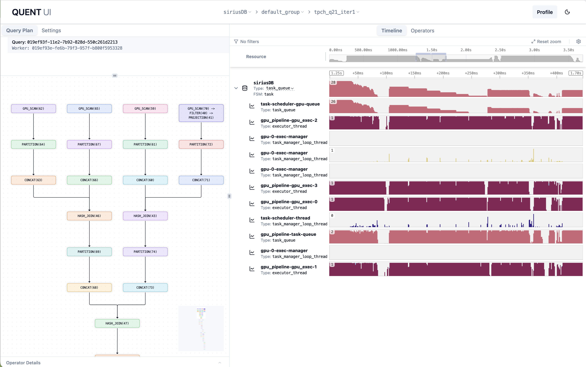
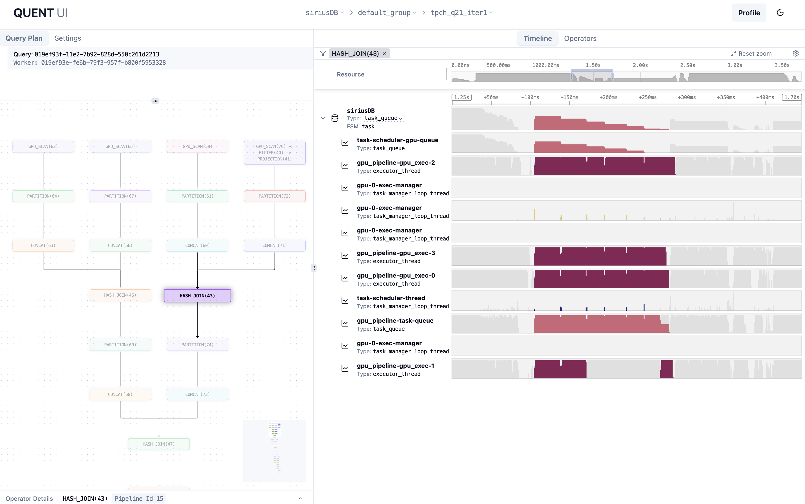
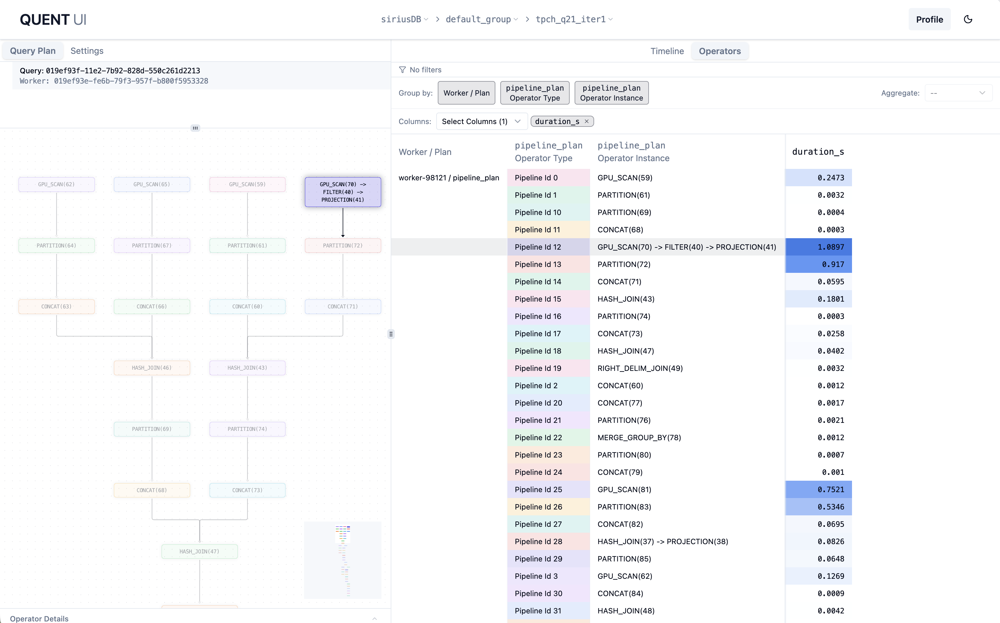

# Quent Telemetry & Tracing

> **Experimental.** Quent based instrumented telemetry is under active development and the emitted schema may change.

Sirius instruments query execution with [Quent](https://github.com/rapidsai/quent),
a modular instrumentation based telemetry toolkit to better understand runtime
behaviours of complex applications. When a query runs, Sirius emits structured
traces describing the engine, the plan (operators, ports, edges), executor
/task-manager threads, task queues, and per-query activity. These traces are written
as newline-delimited JSON (ndjson) files by default that Quent's analyzer server then ingests
and renders as an interactive timeline in your browser.

## 1. Enable the exporter

Telemetry is controlled entirely by the Sirius YAML config (see the
[Configuration reference](configuration.md#telemetry) for where config files are resolved). Enable
the Quent exporter and choose an output directory:

```yaml
sirius:
  telemetry:
    enable_quent: true
    output_directory: telemetry_data
    engine_name: siriusDB
```

| Key | Type | Default | Description |
|-----|------|---------|-------------|
| `enable_quent` | bool | `true` | Emit Quent telemetry using the configured exporter. When `false`, telemetry uses the no-op exporter and nothing is written. |
| `exporter` | string | `ndjson` | Quent filesystem exporter: `ndjson`, `msgpack`, or `postcard`. |
| `output_directory` | non-empty string | `telemetry_data` | Directory for Quent telemetry files. |
| `engine_name` | non-empty string | `siriusDB` | Engine name reported in engine-level telemetry. |

Load the config through the normal resolution path — usually by setting
`SIRIUS_CONFIG_FILE=/path/to/sirius.yaml` before loading the extension. Any Sirius query run with
`enable_quent: true` then writes ndjson files into `output_directory` by default. Set
`exporter: postcard` for compact benchmark or CI telemetry.

## 2. Label your queries (optional)

Per-query labels are configured separately from the YAML config and make individual queries easy to find while analyzing multiple queries. A label can be set with the `sirius_set_query_label` SQL function or inline with
the `query_label` named parameter on `gpu_execution(...)`:

```sql
-- Applies to the next Sirius query, including transparent plain-SQL execution.
CALL sirius_set_query_label('tpch_q1_iter1');
SELECT * FROM lineitem WHERE l_orderkey < 100;

-- Inline label for an explicit gpu_execution call.
CALL gpu_execution(
  'SELECT * FROM lineitem WHERE l_orderkey < 100',
  query_label = 'tpch_q1_iter1'
);
```

`sirius_set_query_label` is consumed once by the very next Sirius query. For an explicit
`gpu_execution(...)` call, an inline `query_label` parameter takes precedence over a pending label set
with `sirius_set_query_label`. Unlabeled queries are reported as `unnamed_query`.

## 3. Generate telemetry

Run any query with the exporter enabled and telemetry files appear under `output_directory`.

### TPC-H helper

For TPC-H Parquet runs, `run_tpch_parquet_and_generate_telemetry.sh` runs the queries, labels each
`(query, iteration)` pair with `sirius_set_query_label` before executing it, and writes the Quent
files to `sirius.telemetry.output_directory`:

```bash
pixi run -- ./test/tpch_performance/run_tpch_parquet_and_generate_telemetry.sh \
  --iterations 1 \
  --parquet-dir /data/tpch/sf100/p16/zstd-8/ \
  100
```

The trailing `100` is the TPC-H scale factor. If no query numbers are provided, all 22 queries are
run; append query numbers to limit the run, e.g. `100 1 6 9`.

The script uses `test/tpch_performance/tpch_telemetry_sirius.yaml` by default, which only enables
telemetry. Pass `--config <path>` when the workload also needs custom memory, executor,
scan-cache, or operator settings:

```bash
pixi run -- ./test/tpch_performance/run_tpch_parquet_and_generate_telemetry.sh \
  --config ~/.sirius/sirius.yaml \
  --iterations 1 \
  --parquet-dir /data/tpch/sf100/p16/zstd-8/ \
  100 1 6 9
```

See [TPC-H Performance Testing](../../test/tpch_performance/run.md) for the full benchmarking
workflow.

## 4. Visualize

Start the Quent analyzer server over the telemetry directory. The `quent` Pixi task runs the
telemetry server with the UI enabled and defaults to `./telemetry_data` as the telemetry data directory:

```bash
pixi run quent                          # serves Quent UI, reading data from /telemetry_data
pixi run quent /path/to/telemetry_data  # if you used a different output_directory
```

Then open Quent UI at `http://localhost:8080` and select the captured Sirius engine/query to explore its
timeline.

## Example Screenshots

**Default view** — the query plan on the left and the per-resource execution timeline
(executor threads, task-manager loops, task queues) on the right.

Resources are grouped into a collapsible tree by GPU device: each `gpu-N` group (declared once per
GPU at engine startup) contains per-thread-type buckets (`executor_thread`,
`task_manager_loop_thread`) plus that executor's task queue, and a `shared` group under the engine
holds threads with no single GPU (e.g. the task-scheduler thread). The tree shape is entirely
data-driven via each resource's `parent_group_id`; to inspect it offline run:

```bash
pixi run bash -c "cd rust && cargo run -p sirius-telemetry-analyzer --example print_resource_tree -- <output_dir>/<session_uuid>"
```



**Operator timeline** — selecting an operator or pipeline highlights it in both the plan and the
timeline, so you can see exactly when and where it ran across the resources.



**Operator stats** — the Operators tab tabulates per-operator/per-pipeline statistics (e.g.
duration), grouped and sortable, to, for example, quickly find the most expensive operators in the query.


