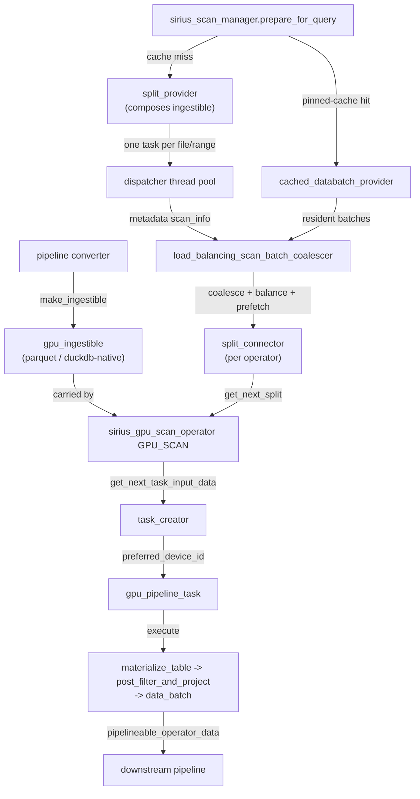

# Scan Subsystem

This document covers the scan subsystem end-to-end: how data enters Super Sirius from storage through the unified GPU scan operator and its per-format `gpu_ingestible` sources, the scan manager that produces and balances scan splits, pinned-table caching, GPU decode of DuckDB-native storage, and the Sirius IO layer underneath.

## Overview

The GPU scan path is a single unified source operator, `sirius_gpu_scan_operator` (physical type `GPU_SCAN`). It carries no format-specific code: it pulls pre-built splits off a `split_connector` and delegates per-split materialization to an installed **`gpu_ingestible`**. One `gpu_ingestible` implementation exists per source format:

| Format | Ingestible | Per-table bind data | Source |
|--------|-----------|---------------------|--------|
| Parquet (local or object-store) | `parquet_gpu_ingestible` | `parquet_ingestible_table_info` | `cudf::io::read_parquet` over row-group slices |
| DuckDB-native `.duckdb` tables | `duckdb_native_gpu_ingestible` | `duckdb_native_ingestible_table_info` | GPU decode of per-row-group storage segments |

The pipeline converter rewrites a DuckDB table scan into a `GPU_SCAN` source: it lowers the bind data into the appropriate `ingestible_table_info`, calls the free `make_ingestible(...)` factory to build the `gpu_ingestible`, constructs the operator carrying it, and inserts it at `operators[0]` of the pipeline. No separate metadata pipeline is created.

Before a query runs, `sirius_scan_manager::prepare_for_query` walks the plan's `GPU_SCAN` operators. For each it either (a) matches a pinned-table cache entry and serves the scan from cached batches, or (b) builds a `split_provider` over the operator's ingestible. A single per-query sequencer (`load_balancing_scan_batch_coalescer`) drives metadata production, coalesces the output into right-sized data batches, balances each batch onto a GPU, and pushes the resulting splits onto each operator's `split_connector`.

Data reaches the GPU through the Sirius IO subsystem (`io::sirius_ioctx` / `io::sirius_datasource`, with a pinned-memory prefetching cache) — see the IO sections later in this document. The scan path consumes that layer: each split carries prefetch hints, and the read for a split is routed through the per-GPU `sirius_ioctx` selected from its target device.

## Scan Operator

### `sirius_gpu_scan_operator` — `GPU_SCAN`
**File:** `src/include/op/scan/sirius_gpu_scan_operator.hpp`, `src/op/scan/sirius_gpu_scan_operator.cpp`

The single GPU scan source operator. It owns:

- a `std::shared_ptr<gpu_ingestible>` — the installed per-format source, built by the pipeline converter and parked on the operator;
- a `std::shared_ptr<split_connector>` — the blocking queue the scan manager pushes splits into.

**Source interface.** As a pipeline source the operator exposes `get_next_task_hint()` / `all_ports_empty()` (both keyed off `split_connector::is_closed()`) and `get_next_task_input_data()`, which blocks inside `split_connector::get_next_split()` until a split arrives or the connector is closed and drained. Each pulled split is a `scan_operator_input`; on dequeue the operator issues an immediate prefetch hint for the split's byte ranges.

**Execution.** `execute(input_data, stream)` runs one split:

1. `gpu_ingestible::materialize_table(split, stream)` produces a `filtered_table` — the materialized `cudf::table` (wrapped in an `owning_table_view`) plus a `filter_state` tag describing how much filter/projection the materialize step already applied.
2. If the tag is `ROW_FILTERED_AND_PROJECTED` the table is already in final output layout and is released directly; otherwise `gpu_ingestible::post_filter_and_project(...)` applies any pending row filter and projection.
3. The result is wrapped in a `data_batch` tagged with the split's target `memory_space` and returned as a `pipelineable_operator_data` for the downstream pipeline.

The operator handles two split shapes transparently, both delivered as `scan_operator_input`: a **fresh read** (the input carries a `scan_info`, materialized via the ingestible) and a **pinned-cache hit** (the input carries a resident `data_batch`, forwarded as-is — or filtered when filter info is present). The operator never sees the source format directly.

`no_history_peak_memory_estimate()` returns the input size for resident (cached) inputs. For fresh reads it reserves 8x the projected-column estimate plus decoded filter-only column buffers. The projected-column estimate remains the execution-history basis, and history-based reservations are clamped to the known decoded column-buffer footprint.

> The `DUCKDB_SCAN` and `PARQUET_SCAN` physical operator types and the `sirius_physical_table_scan` / `sirius_physical_duckdb_scan` / `sirius_physical_parquet_scan` wrappers still exist for the CPU / DuckDB-source path, but the GPU read path for parquet and DuckDB-native tables runs entirely through `GPU_SCAN`.

## gpu_ingestible

**Files:** `src/include/op/scan/gpu_ingestible.hpp`, `gpu_ingestible_types.hpp`, `src/op/scan/gpu_ingestible.cpp`; implementations `parquet_gpu_ingestible.cpp`, `duckdb_native_gpu_ingestible.cpp`.

`gpu_ingestible` is the abstract source of cuDF tables — one implementation per data format. It is **composed twice**: by the `split_provider` (metadata-side, to enumerate work) and by the `sirius_gpu_scan_operator` (execution-side, to materialize each split). It inherits `enable_shared_from_this` so the provider can borrow it non-owningly while the operator holds the single owning `shared_ptr`.

### Interface

| Method | Role |
|--------|------|
| `has_processed_all_metadata()` | Thread-safe snapshot: is all metadata enumerated? Typically an atomic cursor vs. a precomputed total. |
| `next_split_provider(io_ctx)` | Atomically claim the next metadata unit and return a callable that produces its `scan_info`(s). Null when nothing left to claim. |
| `create_batch_coalescer()` | Build the format's `batch_coalescer`, which bundles per-unit metadata into right-sized data-batch splits. |
| `materialize_table(split, stream)` | Produce the `filtered_table` for one split (dispatches to `materialize_metadata_to_table` for a fresh read, or wraps the resident batch for a cache hit). |
| `materialize_metadata_to_table(info, mem_space, stream)` | Issue the read/decode for one split into a `cudf::table`. `mem_space` carries both the allocator and the device id used to select the per-GPU `sirius_ioctx`. |
| `post_filter_and_project(table, mem_space, stream)` | Apply a pending post-decode filter and/or projection to output layout. |
| `table_info()` | The per-table bind data (`ingestible_table_info`). |
| `materialized_column_order()` | Storage indices in the exact order `materialize_table` emits columns (output columns first, then pure-filter columns). The pinned-cache path serves columns in this order so a cached batch is laid out identically to a fresh read. |

### Bind data vs. split descriptors

Two polymorphic carriers separate per-table from per-split state (`gpu_ingestible_types.hpp`):

- **`ingestible_table_info`** — built once by the pipeline converter from the DuckDB binding, parked on the operator. Exposes `column_names()` and `file_paths()` (used for pinned-cache matching). Implementations: `parquet_ingestible_table_info`, `duckdb_native_ingestible_table_info`.
- **`scan_info`** — one per emitted split. Carries the per-split read description and optional prefetch `fadvise_entries()`, projected-column estimate, and decoded column-buffer estimate. Implementations: `parquet_split_info` (the data-batch split), `parquet_file_scan_info` (the per-file metadata unit), `duckdb_native_scan_info`.

### `filtered_table` / `filter_state`

`materialize_table` returns a `filtered_table` = an `owning_table_view` plus a `filter_state` tag recording how much filter+projection the materialize step already absorbed:

| State | Meaning |
|-------|---------|
| `UNFILTERED` | No filter applied (e.g. a pinned table, or duckdb-native which always filters post-decode). |
| `ROWGROUP_FILTERED` | Row groups pruned by statistics only. |
| `ROW_FILTERED` | The reader applied the row-level filter (parquet reader-side pushdown). |
| `ROW_FILTERED_AND_PROJECTED` | Fully assembled to output layout (parquet hive-partition path, or a per-query-cached table). |

The operator skips `post_filter_and_project` only when the state is already `ROW_FILTERED_AND_PROJECTED`.

### Factories

There is no factory class. Each implementation provides a free `make_ingestible(std::unique_ptr<...table_info>)` overload (defined in its `.cpp`); the pipeline converter calls the right overload by the concrete `table_info` type it built.

### Parquet ingestible

`parquet_gpu_ingestible` (`parquet_gpu_ingestible.{hpp,cpp}`) builds the canonical `scan_plan` and shared `parquet_reader_options` (column projection only) once in its constructor, and pre-coalesces the DuckDB filter into a stored expression (partition-column filters dropped — DuckDB already prunes the file list by hive value). `next_split_provider` hands out **one file at a time**: each metadata task opens the file's `sirius_datasource`, reuses or parses+caches the footer, runs the FLBA-decimal pushdown-safety probe, translates the filter to a cuDF AST and prunes row groups by statistics, estimates each surviving row group's projected data columns and all decoded column buffers, and emits one `parquet_file_scan_info`. The coalescer caps batches on decoded column-buffer bytes, while preserving projected-column bytes separately for memory history. `materialize_metadata_to_table` reads the bundled row-group slices via `cudf::io::read_parquet` (re-translating the filter on the task-local stream for reader-side pushdown unless the per-file probe disabled it), and assembles hive-partition output inline. Reader-side filter pushdown is a per-split decision.

### DuckDB-native ingestible

`duckdb_native_gpu_ingestible` (`duckdb_native_gpu_ingestible.{hpp,cpp}`) prepares a serial walk plan in its constructor (`prepare_duckdb_native_walk`: partition statistics, projected-type viability gate, and filter-stat row-group pruning — a non-viable query throws to trigger CPU fallback before any per-segment IO). It slices the table's row groups into fixed-size parse ranges (`SIRIUS_METADATA_PARSE_CHUNK`, default 8). `next_split_provider` hands out one range per claim; each metadata task walks that range and emits a `duckdb_native_scan_info`. `materialize_metadata_to_table` decodes the range's storage segments into a `cudf::table` (always `UNFILTERED`); filter evaluation and projection to output arity happen in `post_filter_and_project`.

## owning_table_view

**File:** `src/include/op/scan/owning_table_view.hpp`

`owning_table_view` is the handle the scan path threads tables through. It exposes a `cudf::table_view` while owning the data behind it, regardless of whether that data is a fully-materialized `cudf::table` or a view into some other type-erased owner. It is in one of three states: an owned `cudf::table`, a type-erased owner + column selection, or empty.

Column manipulations — `reorder_columns`, `drop_columns`, `select_columns` — are pure index manipulations over a stored selection: they never allocate device memory. An owned table is first demoted into a view (a `unique_ptr` move, not a copy) and the selection permuted/subset in place. Only `materialize` and `release` (the view -> table transition) may allocate, and even then, when the underlying owner can surrender its columns (the `no_alloc_materializable` concept — e.g. a `cudf::table`), the surviving column buffers are *moved* out rather than copied.

This is what lets the dominant scan paths — `SELECT *`, identity layouts, reader-side-pushdown reads — flow the reader output through projection/reorder to the output batch with no extra GPU copy.

## scan_plan

**File:** `src/include/op/scan/scan_plan.hpp`, `src/op/scan/scan_plan.cpp`

`scan_plan` is the canonical description of what a parquet scan reads, how it assembles output, and how filters map between index spaces. The `parquet_gpu_ingestible` builds it once in its constructor and shares it (immutably) with every emitted split.

```cpp
struct scan_plan {
  std::vector<data_column>           data_columns;       // columns read from parquet, in batch order (D)
  std::vector<partition_column>      partition_columns;  // hive-injected columns (name, type, primary index)
  std::vector<output_entry>          output_layout;      // one entry per output column, in DuckDB order
  std::vector<std::optional<size_t>> batch_position_by_column_id;  // C -> D map
  std::unordered_set<size_t>         partition_primary_indices;    // for filter-skip
};
```

Three index spaces appear in the parquet path:

- **P (primary index)** — DuckDB schema position
- **C (column-ids position)** — index into the scan's `column_ids` list
- **D (batch position)** — column position in the cuDF reader output (post-hive-removal)

`output_layout` is walked once during materialization to produce the final table: `DATA(k)` entries `std::move` from the read batch at position k, `PARTITION(k)` entries synthesize a scalar-backed column from the hive partition value. Pure-filter data columns (read but not output) fall out of scope and free.

For `SELECT *` with no partitions and no pure-filter columns, the plan is a trivial identity and the reader output is forwarded unchanged — no permute, no copy. `SELECT count(*)` short-circuits the same way (`output_layout` empty), so the count aggregation sees a 0-column table without a synthesized 0-column reshape.

## Column Mapping

Parquet column-chunk order is not guaranteed to match DuckDB's logical column order. `parquet_gpu_ingestible` builds a name-based DuckDB->parquet mapping via `parquet_schema_mapping::leaf_indices_for_column(schema, column_name)`, which walks the parquet schema's `path_in_schema` (case-insensitive, mirroring DuckDB).

For nested types (`STRUCT`, `LIST`), one DuckDB column maps to multiple parquet leaf chunks; the mapping returns all leaves under the top-level column name. The cuDF parquet reader, given a top-level column name, materializes the nested `cudf::column` natively without post-read reassembly.

## Scan Manager

**Files:** `src/include/scan_manager/sirius_scan_manager.hpp`, `src/scan_manager/sirius_scan_manager.cpp`; `split_provider.{hpp,cpp}`, `split_connector.{hpp,cpp}`, `load_balancing_scan_batch_coalescer.{hpp,cpp}`, `balancing_strategy.hpp`, `round_robin_strategy.{hpp,cpp}`, `config.hpp`.

`sirius_scan_manager` prepares scan-side state before a query runs and drives metadata production for every `GPU_SCAN` source. It owns a configurable thread pool, a single `io::sirius_ioctx` (uring on the fast path, kvikio as the universal fallback — multi-GPU requires the uring path), an optional prefetching cache built on that ioctx, and the registry of pinned-table entries. It runs alongside the GPU pipeline executors and is independent of the data-repository machinery used between intermediate operators.

### Components

| Component | File | Role |
|-----------|------|------|
| `sirius_scan_manager` | `scan_manager/sirius_scan_manager.{hpp,cpp}` | Owns thread pool + ioctx + cache + pinned-table registry; `prepare_for_query` wires providers and starts the sequencer |
| `split_provider` | `scan_manager/split_provider.{hpp,cpp}` | Concrete driver that composes a `gpu_ingestible`; `run()` dispatches one metadata task per claimed unit onto the dispatcher |
| `load_balancing_scan_batch_coalescer` | `scan_manager/load_balancing_scan_batch_coalescer.{hpp,cpp}` | Per-query sequencer: drains each provider's metadata output through the format's `batch_coalescer`, balances each batch onto a GPU, fires prefetch hints, pushes splits onto the connector |
| `batch_coalescer` | `op/scan/batch_coalescer.hpp` (impls in the ingestibles) | Bundles per-unit `scan_info`s into right-sized data-batch splits |
| `balancing_strategy` / `round_robin_strategy` | `scan_manager/balancing_strategy.hpp`, `round_robin_strategy.{hpp,cpp}` | Picks the target GPU for each split and stamps `preferred_device_id` on it |
| `split_connector` | `scan_manager/split_connector.{hpp,cpp}` | Lock-protected blocking queue between the producer (sequencer) and the operator |
| `cache_entry_info` / `pinned_entry` | `scan_manager/sirius_scan_manager.hpp` | Pinned-table identity + column layout, and the cached batches (see [Pinned Tables](#pinned-tables)) |

### Lifecycle

1. **Plan stage.** During pipeline conversion the bind data is lowered into an `ingestible_table_info`, `make_ingestible(...)` builds the `gpu_ingestible`, and a `sirius_gpu_scan_operator` carrying it is inserted as the pipeline source. The operator constructs its own (empty) `split_connector`.
2. **Per-query preparation.** `prepare_for_query(query)` resets prior state, builds a `round_robin_strategy` over the topology's GPU ids and a fresh `load_balancing_scan_batch_coalescer`, then walks the query's `GPU_SCAN` operators in order. For each it `register_pipeline`s a sequencer slot (which builds the ingestible's `batch_coalescer` and captures the operator's connector). Then either:
   - **Cache hit** — `try_assign_cached_entries` finds a pinned entry whose identity and columns can serve the scan; it attaches a `databatch_provider` to the slot and skips disk reading entirely; or
   - **Cache miss** — a `split_provider` is built over the operator's ingestible and stored in `_providers_by_op`.
3. **Execution.** `start_metadata_processing` spawns the single sequencer worker on the dispatcher, then calls `split_provider::run` for each non-cached operator. `run` iterates `has_more_splits` / `next_split_provider` and hands each claimed metadata task to the dispatcher; each task enqueues its `scan_info` onto the operator's sequencer slot queue. The sequencer worker walks slots in registration order, coalescing each slot's metadata into data-batch splits, balancing each onto a GPU, firing `fadvise`/`opportunistic` prefetch, and pushing a `scan_operator_input` onto the operator's connector. Consumers (the scan operators) block in `split_connector::get_next_split` until splits arrive.
4. **Teardown.** The sequencer closes each connector when its slot is drained (forwarding any worker-captured exception, first-writer-wins). Once closed and drained, the operator's `all_ports_empty()` returns true and `get_next_task_hint()` returns `nullopt`. `reset()` requests the dispatcher stop and rebuilds it for the next query.

### split_provider

`split_provider` is concrete and composes a `gpu_ingestible` non-owningly (the operator owns the lifetime; the provider is always torn down first by `reset()`). Its `has_more_splits` / `next_split_provider` delegate to the ingestible. `run(scheduler, on_split)` enqueues one task per claimed metadata unit; the connector is closed (with any captured exception) when the last enqueued task drops its reference to the shared completion state.

### load_balancing_scan_batch_coalescer

This is the per-query sequencer. Each `GPU_SCAN` operator gets a `metadata_processing_state` slot holding a blocking queue (fed by the provider's metadata tasks), the ingestible's `batch_coalescer`, the shared `balancing_strategy`, and the operator's `split_connector`. A single worker walks the slots in registration order. For a live scan it dequeues per-unit `scan_info`s, pushes them through the coalescer, and for each coalesced batch: picks a GPU via the balancer (stamping `preferred_device_id`), fires `fadvise` and an `opportunistic` prefetch for the batch's byte ranges, and pushes a `scan_operator_input` onto the connector. For a cached pipeline it replays the attached `databatch_provider`, pushing one resident `scan_operator_input` per cached chunk. Serialising the opportunistic prefetch tier across pipelines in execution order gives the prefetching cache its longest lead time for the head-of-line pipeline.

### Device balancing

`balancing_strategy` decouples *which GPU a split runs on* from *how splits are produced*. `round_robin_strategy` hands out devices from the topology's GPU id set via a single shared atomic cursor, spreading splits evenly across GPUs and continuously across the whole scan stage. The chosen device is recorded on the split via `set_preferred_device_id`; the task creator reads it back when it builds the `gpu_pipeline_task` so the scheduler dispatches to that GPU. (Cached/resident inputs carry no balancer-assigned device; the task creator derives their device from the chunk's resident `memory_space` for NUMA/host-pin locality — see the memory-management doc.)

### split_connector

A lock-protected queue of pre-built splits. The producer (sequencer) enqueues via a friended `push_split` and calls `close(exception?)` when done. The consumer pulls via `get_next_split()`, which blocks until a split is available or the connector is closed and drained: returns `nullopt` when drained, the next split otherwise, or rethrows the producer's stored exception once the queue is empty.

### Configuration

`scan_manager_config` (`config.hpp`) tunes the thread pool, the IO backend toggle (`use_sirius_datasource`), uring/REST reactor counts, the prefetching cache, and object-store credentials.

## Pinned Tables

**Files:** `src/include/pin_table.hpp`, `src/pin_table.cpp`; pinned-entry storage + cache matching in `src/include/scan_manager/sirius_scan_manager.hpp` and `src/scan_manager/sirius_scan_manager.cpp`.

The `pin_table` table function pre-loads a table's columns into memory so subsequent scans of the same source bypass file I/O entirely. It supports both source formats and two memory tiers.

```sql
CALL pin_table('/path/to/lineitem.parquet',
               name = 'lineitem',
               tier = 'gpu',
               cols = ['l_orderkey', 'l_quantity', 'l_extendedprice', 'l_shipdate']);

-- A duckdb-native base table can be pinned too:
CALL pin_table('my_table', name = 'my_table', format = 'duckdb', tier = 'host');

SELECT SUM(l_extendedprice * l_quantity)
  FROM read_parquet('/path/to/lineitem.parquet')
  WHERE l_shipdate >= DATE '1994-01-01';

CALL unpin_table('lineitem');
```

`format` is `parquet` or `duckdb`, resolved at bind time from an explicit parameter or inferred from the path extension. `tier` is `gpu` (columns in GPU device memory) or `host` (columns in pinned host memory).

### Materializing a pin

Pinning drives the source's `gpu_ingestible` to completion (`materialize_all_batches` / `materialize_pin_to_host` in `pin_table.cpp`):

- **GPU tier** (`materialize_all_batches`): each emitted batch is materialized into a GPU-resident `cudf::table`, round-robining placement across the GPU memory spaces. Placement is deterministic so re-pinning the same source yields identical per-chunk placement (required by the merge path below).
- **HOST tier** (`materialize_pin_to_host`): each batch is materialized on its round-robin GPU, converted to a `host_data_representation` on that GPU's NUMA-local host space, then the GPU table is freed before the next batch. Peak GPU residency is therefore ~one batch, so a host pin never needs the whole table to fit in GPU memory.

### Storage and matching

Each pinned table is a `pinned_entry` keyed by name in the scan manager. It holds a `cache_entry_info` (the cache identity + column layout) plus the cached batches: `data_batches_by_column` (one chunk vector per column) for the GPU tier, or `host_chunks` (one `host_data_representation` per batch, sliced by column at scan time) for the HOST tier.

`cache_entry_info` captures format identity — the resolved parquet **file set**, or the duckdb **catalog.schema.table** — plus the cached columns (by storage index) and their names. `can_serve_with_columns(other)` returns a gather projection when this entry can serve a scan: same format, same identity, and a **column superset** of the scan's request. A parquet pin never serves a duckdb scan or vice-versa.

During `prepare_for_query`, `try_assign_cached_entries` matches each `GPU_SCAN` operator's `table_info` against the pinned entries. On a hit it builds a `cached_databatch_provider` over the matched entry, ordering columns by the ingestible's `materialized_column_order()` so a cached batch is laid out identically to a fresh disk read and `post_filter_and_project` resolves the same columns on both paths. The scan operator's `execute()` is unchanged; resident cached batches with an identity layout flow through untouched.

### Re-pin semantics

For the GPU tier, `insert_pinned_entry` merges into an existing entry when the row count matches (adding only columns not already cached; per-chunk memory-space placement must match) and replaces it otherwise. The HOST tier always replaces, since each host chunk already holds every column.

## Batch Coalescing

When many small files (or row-group ranges) each yield a tiny GPU batch, per-task scheduling and kernel-launch overhead dominates. Coalescing is a responsibility of each `gpu_ingestible`, exposed through the `batch_coalescer` interface (`op/scan/batch_coalescer.hpp`): as the metadata side emits per-unit `scan_info`s, the sequencer feeds each one to the coalescer via `push()` (which may buffer and return zero or more ready batches) and `flush()` (remaining buffered batches at end of input).

- **`parquet_batch_coalescer`** (in `parquet_gpu_ingestible.cpp`): accumulates each file's pruned row groups into `parquet_split_info` batches sized to `approximate_batch_size` decoded column-buffer bytes, including filter-only columns. A single large file fills multiple batches; several small files bundle into one batch — but only when they share identical hive-partition values and the same pushdown decision (a mismatch on either forces a flush). It also seals a batch before it would exceed `cudf::size_type` rows. The downstream `cudf::io::read_parquet` reads all bundled slices in one invocation.
- **`duckdb_native_batch_coalescer`** (in `duckdb_native_gpu_ingestible.cpp`): accumulates row-group ranges up to `approximate_batch_size` decoded bytes, and additionally seals a batch before any VARCHAR column's accumulated bytes would cross the cuDF int32 string-offset threshold.

The coalescer runs inside the per-query sequencer (`load_balancing_scan_batch_coalescer`), so coalescing, device balancing, and prefetch hinting happen at one place per emitted batch.

## DuckDB-Native Decode

**Files:** `src/include/op/scan/duckdb_native_decoder.hpp`, `src/op/scan/duckdb_native_decoder.cpp`, `src/include/cuda/scan/gpu_native_decode.cuh`, `src/include/cuda/scan/gpu_decode_strings.cuh`, `src/cuda/scan/*.cu`, `src/cuda/scan/strings/*.cu`

The GPU DuckDB-native scan reads a table stored in DuckDB's own `.db` block format and decodes each projected column's on-disk segments directly on the GPU into a `cudf::table`, without going through Parquet. `decode_duckdb_native_split()` takes the row-group metadata for a split, stages the segment bytes on device, and dispatches per-column decode.

### Segment runs and codec dispatch

A DuckDB column inside a row group is a sequence of *segments*, each compressed with one codec. The decoder groups a column's segments into **codec runs** — maximal spans of segments sharing one codec — and a per-codec kernel consumes a whole run in one launch (the run is the batching unit). A column with mixed codecs produces multiple runs. Codec metadata (bitpacking width, dictionary references, FSST symbol tables, ALP parameters) lives inside the segment bytes; each codec kernel parses its own headers on device, so the dispatcher itself does no parsing and no I/O.

Decode splits into two entry points sharing the same run/segment descriptors:

- **Fixed-width columns** — `gpu_decode_table()` (`gpu_native_decode.cuh`). Codecs: `UNCOMPRESSED`, `CONSTANT`, `RLE`, `BITPACKING`. Floating-point columns additionally decode DuckDB's `ALP`/`ALPRD` adaptive-lossless codecs. The dispatcher synchronizes the stream once before returning so columns come back with `null_count` populated.
- **Varchar columns** — `gpu_decode_strings_column()` (`gpu_decode_strings.cuh`). Codecs: `UNCOMPRESSED`, `DICTIONARY`, `FSST`, `DICT_FSST`. The per-segment max-string-length stat captured during the metadata walk sizes the cuDF chars buffer up front, so the string path runs async modulo at most one host sync (the chars-buffer read-back, which only fires when that upper bound is unknown or pathological).

Each string codec lives in its own translation unit under `src/cuda/scan/strings/` (`uncompressed.cu`, `dictionary.cu`, `fsst.cu`, `dict_fsst.cu`) over shared device primitives in `src/include/cuda/scan/detail/` and `src/include/cuda/scan/strings/`; the fixed-width codecs live in `src/cuda/scan/` (`gpu_decode_bitpacking.cu`, `gpu_decode_rle.cu`, `gpu_decode_alp.cu`, `gpu_native_decode.cu`).

### Validity and rowid

Validity (null) masks decode from `UNCOMPRESSED`, `EMPTY` (all-null), and `CONSTANT` (all-valid) codecs on device. `ROARING`-compressed validity is host-decoded to a plain bitmap before the GPU sees it (DuckDB's roaring scan state drives the reads), then staged like any other host-produced segment. `CONSTANT` data segments likewise materialize their single value on the host. Synthetic `rowid` columns carry no on-disk storage; the decoder fills them from each row group's absolute first-row index.

### Viability gate

The metadata walk (below) rejects any codec or type the decoder cannot handle and falls the query back to DuckDB CPU before staging. The decoder's own `throw`s on unsupported codecs/types are a defensive backstop, not the primary gate. Unsupported cases include 128-bit (`HUGEINT`/`DECIMAL128`) and nested (`STRUCT`/`LIST`) types, and a varchar column whose summed max-string-length upper bound would overflow cuDF's int32 string-offset limit.

## DuckDB-Native Metadata Walk

**Files:** `src/include/op/scan/duckdb_native_metadata.hpp`, `src/op/scan/duckdb_native_metadata.cpp`, `src/include/op/scan/duckdb_native_decoder.hpp`

Before decode, the scan walks DuckDB's storage metadata to learn, per row group, which segments each projected column occupies, what codec each uses, and how many decoded bytes the row group will cost. The walk is two-phase so the thread-unsafe parts run once and the expensive per-segment parsing runs concurrently.

### Phase 1 — `prepare_duckdb_native_walk()` (serial)

Runs once, single-threaded, because it touches `ClientContext`/`LocalStorage`, which are not thread-safe:

- Reads `PartitionStatistics` for every row group (the source of each row group's absolute first-row index and row count, used both for rowid synthesis and decoded-byte budgeting).
- Gates the projected types: an exhaustive type switch refuses 128-bit and nested types up front so an unsupported projection becomes a clean CPU fallback before any per-segment IO.
- Marks row groups that pushed-down filter statistics prove empty (see **Row Group Pruning**).

The result is a `duckdb_native_walk_plan` carrying per-row-group row starts/counts, the block size, the pruned-row-group bitmap, and the inputs the range walks need. A non-viable plan (unsupported type, invalid partition `row_start`, or all row groups pruned) refuses the whole native-scan path.

### Phase 2 — `walk_duckdb_native_row_group_range()` (concurrent)

The row-group range `[0, n_row_groups)` is sliced into fixed-size parse chunks (default 8 row groups, `SIRIUS_METADATA_PARSE_CHUNK`), and each chunk is walked independently on a scan-manager thread. For each surviving row group in its range, a range walk:

- Walks each projected column's **typed segment trees** directly — reading `block_id`, block offset, compression enum, per-segment row counts, the validity child's segments, and (for varchar) the per-segment max-string-length stat as typed fields. It does not build or re-parse the per-segment string blobs that DuckDB's generic `GetColumnSegmentInfo` would produce.
- Refuses on the first unsupported segment codec or an absent/over-threshold varchar stat, partially filling the range (which the caller then discards in favor of CPU fallback).
- Derives each segment's on-disk byte size from the sorted `(block_id, block_offset)` delta to the next segment — an upper bound, since codec headers self-bound the actual reads, so any overshoot only inflates staging/H2D bytes, never correctness.
- Sorts each column's segments by row start (so codec runs coalesce) and computes the row group's decoded-byte budget and per-column varchar char count.

Stats-pruned row groups are skipped before any segment metadata is requested. The per-row-group results (`duckdb_row_group_metadata`) feed the batch coalescer, which bundles row groups into decode-sized splits.

## Row Group Pruning

Both GPU scan formats drop row groups that a pushed-down filter proves cannot contain a matching row, before those row groups are read or decoded.

### Parquet path

When filter pushdown is enabled and the `gpu_expression_translator` successfully converts DuckDB `TableFilterSet` filters into a cuDF AST, two mechanisms activate inside `parquet_gpu_ingestible`:

1. **Row group statistics pruning:** during the per-file metadata task, `filter_row_groups_with_stats()` runs against each fetched footer; row groups whose Parquet column min/max statistics cannot match the filter are dropped before any read is scheduled. Pure hive-partition filters are dropped during plan construction since hive columns aren't in the parquet file.

2. **Reader-level filter pushdown:** the cuDF AST is set on `parquet_reader_options` via `set_filter()`, so cuDF applies the filter inside `read_parquet`. When the reader applies the row filter, `materialize_table` reports `ROW_FILTERED` (or `ROW_FILTERED_AND_PROJECTED` once hive partitions are assembled), so the scan operator skips a redundant post-decode filter.

Reader-side pushdown is a per-split decision: an FLBA-decimal safety probe can disable it for a file, in which case the cached DuckDB filter expression is evaluated through `expression_evaluator` on the decoded batch in `post_filter_and_project`.

**Filter translation path:** `TableFilterSet` -> `convert_table_filters_to_expression()` (skips `OPTIONAL_FILTER`, `IS_NOT_NULL`, and partition-column filters) -> `gpu_expression_translator` -> cuDF AST tree.

### DuckDB-native path

The DuckDB-native scan prunes row groups using DuckDB's own statistics machinery rather than Parquet footer stats. During the serial prepare phase of the metadata walk (`mark_row_groups_pruned_by_filter_stats`), for each row group and each pushed-down `TableFilter`, the scan calls DuckDB's `TableFilter::CheckStatistics` against that row group's per-column statistics (obtained from its `PartitionRowGroup` handle). A row group is pruned the moment any filter returns `FILTER_ALWAYS_FALSE`.

This runs entirely from `PartitionRowGroup` statistics — no segment metadata is needed — so a pruned row group is skipped **before its segments are walked, staged, copied to the GPU, or decoded**. If every row group is pruned, the native path refuses up front and the query falls back to DuckDB CPU before the async scan starts.

Only statically-known DuckDB `TableFilter`s participate in this DuckDB-native metadata walk. DuckDB `DYNAMIC_FILTER` entries are excluded because Sirius runtime dynamic filters use a separate `sirius_dynamic_filter_set` channel and the parquet reader/post-decode consumer paths described in [Dynamic Filters](dynamic-filters.md); they are not translated through this static `TableFilterSet` path. This metadata separation does not imply one universal execution order: the producing join's immediate probe scan starts after build-port publication, while a base scan reached transitively through an intervening join may materialize early splits before publication and samples the channel at its per-split checkpoints. See [Transitive scan targets and publication timing](dynamic-filters.md#transitive-scan-targets-and-publication-timing). The payoff from the static statistics walk is data-clustering-dependent — it costs almost nothing when statistics cannot help and is multiplicative when the table is ordered such that a filter eliminates most row groups.

## Sirius IO Subsystem

**Files:** `src/include/io/`, `src/io/`

`sirius::io` is a `cudf::io::datasource`-compatible I/O stack for high-throughput parquet reading. It is organized around three pieces: a per-backend *ioctx* that owns the reactor pool plus the caches, a generic `templated_ioctx<Reactor>` that implements the read API in terms of a backend reactor, and a pinned-memory *prefetching cache* that sits in front of every backend. Backends plug in by supplying a reactor + io_object pair; the cache and the datasource layer are backend-agnostic.

### Architecture

| Component | File | Role |
|-----------|------|------|
| `sirius_datasource` | `io/sirius_datasource.{hpp,cpp}` | `cudf::io::datasource` implementation. Thin per-scan delegate: every read forwards to the bound `sirius_ioctx`, passing the shared `sirius_io_object` by reference. Also carries the per-scan `prefetching_handle` used by `fadvise`. |
| `sirius_ioctx` | `io/io_context.{hpp,cpp}` | Abstract shared backend context. Owns the optional `prefetching_cache` and an always-present `metadata_store`, exposes the backend read API (`host_read_io`, `host_read_async_io`, `device_read_async_io`, `host_to_device_read_async_io`, `host_read_ranges_async_io`) and capability queries, and opens datasources via `open_datasource(path)`. |
| `templated_ioctx<Reactor>` | `io/templated_ioctx.hpp` | Generic ioctx implementation parameterized on a backend reactor. Owns a pool of reactors, splits each caller request across the pool, dispatches via the reactor's `prep_*`/`enqueue`, and derives its capabilities structurally from the reactor (see [Backend Seam](#backend-seam)). |
| `io_context_registry` | `io/datasource_factory.{hpp,cpp}` | Scheme→backend registry. Each backend registers a scheme checker (the reactor's static `supports()`) and a factory; `lookup(scheme)` resolves a URI scheme to a backend type, `make_ioctx(type)` builds one. |
| `prefetching_cache` | `io/cache/prefetching_cache.{hpp,cpp}` | Pinned-memory chunk cache with a lock-free per-chunk state machine, background preparation/prefetch/evictor threads, and tiered LRU scoring. Serves partial reads and populates itself on read. |
| `buffer_pool` | `io/cache/types.{hpp,cpp}` | Growable pool of fixed-size pinned chunks, backed by a `cucascade::memory::fixed_size_host_memory_resource` per NUMA arena. Chunk size is the resource's block size. |
| `metadata_store` | `io/cache/metadata_store.{hpp,cpp}` | Per-file metadata cache keyed by `io_object::raw_file_cache_id()`. Always present, independent of the prefetching cache; callers park parsed footers here so a later scan of the same path skips the parse. |
| `admission_control` | `exec/admission_control.{hpp,cpp}` | Blocking, budget-based backpressure. Hands out RAII slots against a fixed budget; an oversized request is granted the whole budget when no other slots are outstanding (deadlock escape). The prefetching cache rate-limits in-flight IO through one of these. |
| `semi_future` / `try_t` / `completion_controller` | `exec/semi_future.hpp`, `exec/try.hpp`, `exec/completion_controller.hpp` | Async primitives the IO layer is built on. `semi_future<T>`/`promise<T>` are the wait-or-callback handles every async read returns; `try_t<T>` is the value-or-error result type; `completion_controller` + `completion_token` provide one-shot completion subscriptions. |

### Read path

A scan opens a file with `sirius_ioctx::open_datasource(path)`, which asks the backend to create a `sirius_io_object` (open local fds, or HEAD an object store for its size) and wraps it in a `sirius_datasource` bound to the ioctx. Each cuDF read on the datasource forwards to the ioctx:

- When the ioctx has an armed cache (`uses_prefetching_cache()`), `host_read`/`device_read` consult the cache first; a hit copies from pinned host chunks (host reads via `memcpy`, device reads via `cudaMemcpyAsync` from pinned memory). A miss falls through to the backend `*_io` virtuals, which the `templated_ioctx` services through the reactor pool.
- A backend without batched host reads (e.g. kvikio) reports `preferred_prefetching_stage::none` and is never given a cache.

The ioctx is built parked: the reactor pool is constructed cheaply at `make_ioctx` time, and `start()` launches the worker threads and allocates per-reactor staging only once the read API is first exercised.

### Backend Seam

A backend is a *reactor* + *io_object* pair plugged into `templated_ioctx<Reactor>`. The contract is expressed as C++20 concepts and structural traits rather than hand-maintained capability flags.

- `io_reactor_c<R>` (the baseline contract) requires associated types (`io_object_type`, `request_type`, `request_type_ptr`, `reactor_config_type`), buffered host reads (`prep_host_rx_request` + synchronous `host_read`), dispatch (`enqueue`), lifecycle (`shutdown`/`interrupt`), `create_io_object`, and the static capability queries `supports(path)` and `preferred_prefetching_stage()`.
- `reactor_traits<R>` detects the *optional* dispatch paths structurally: a reactor supports device reads, bounce-staged host-to-device reads, or vectored host reads iff it defines the matching `prep_device_rx_request` / `prep_host_to_device_rx_request` / `prep_host_rxv_request` overload. `templated_ioctx` answers `supports_device_read()` / `supports_host_to_device_read()` / `supports_vector_host_read()` from these traits, so a reactor advertises a capability simply by implementing the corresponding prep method.

Dispatch is uniform across backends: `templated_ioctx` builds one request via the reactor's `prep_*`, retrieves its `semi_future`, then `splits` the per-chunk requests across the reactor pool (round-robin) and `enqueue`s each split. The shared request-lifecycle primitives in `io/io_request.hpp` (`request_manager`, `device_cpy_request`, `rx_request_t<Chunk>`) fan one logical read out into N per-chunk reads and fulfill a single future when the last chunk completes (with the first reported error, if any). Each backend instantiates `rx_request_t` for its own chunk type (`uring::chunked_rx_request`, `rest::rest_chunked_rx_request`).

Three backends ship:

| Backend | ioctx | Reactor | Scheme | Notes |
|---------|-------|---------|--------|-------|
| io_uring | `uring::uring_ioctx = templated_ioctx<uring_reactor>` | `uring/uring_reactor.hpp` | local files | One `io_uring` + worker thread per reactor. `O_DIRECT` device reads through pinned bounce slots; buffered host reads on the same ring. `preferred_prefetching_stage = none`. |
| REST / object store | `rest::rest_ioctx = templated_ioctx<rest_reactor>` | `rest/rest_reactor.hpp` | `s3://` | libcurl-multi over an epoll loop; see [S3 / Object-Store Backend](#s3--object-store-backend). `preferred_prefetching_stage = just_in_time`. |
| kvikio fallback | `kvikio_context` | (none) | any | Wraps cudf's default datasource (GDS-capable). Overrides the public read API directly so cudf's `std::future` flows through unchanged; the protected `_io` primitives are unreachable placeholders. No reactors, no cache, `preferred_prefetching_stage = none`. |

The scan manager builds one ioctx for the run: `uring_ioctx` when `use_sirius_datasource` is set, otherwise the `kvikio_context` fallback (the registry can also resolve an `s3://` URL to the REST backend via `lookup`). A new backend is a reactor + io_object that satisfy the concepts, a `templated_ioctx` specialization, and a registry entry.

### S3 / Object-Store Backend

**Files:** `src/include/io/rest/{rest_ioctx,rest_reactor,curl_handle,config,types}.hpp`, `src/io/rest/*.cpp`, `src/include/io/s3/{s3_request_authorizer,sirius_sigv4_authorizer,s3_object_ref,static_credentials}.hpp`, `src/include/io/object_store_config.hpp`

Reads of `s3://bucket/key` parquet files go through the REST backend, `rest_ioctx = templated_ioctx<rest_reactor>`. Each `rest_reactor` owns one worker thread driving a libcurl multi handle over an epoll event loop (`curl_multi_socket_action`), a pool of reusable easy handles, optional pinned bounce slots for device staging, and a timerfd + min-heap retry scheduler. `create_io_object` parses the URL, issues a one-time HEAD for the object size, and builds a `rest_io_object` (path / bucket / key / size). Because S3 has no native device-read path, device reads stage through a pinned host bounce slot followed by `cudaMemcpyAsync`.

**Request unit.** Each ranged GET is one `rest_chunked_rx_request` carrying the object ref, the file range and its destination buffer(s), and an attempt counter. The reactor's libcurl write callback scatters the response body across the chunk's destination iovecs, so a single ranged GET can fuse several file-adjacent segments. A 206's `Content-Range` is validated against the request, and a server that ignores the Range header (returns the whole object) is detected via the received-byte count.

**Authorization.** Auth is delegated to a pluggable `s3_request_authorizer` (the credential/signer seam), called inline once per request attempt (presigned URLs are short-lived, so they are minted per attempt, never at task-creation time). `authorize(object, method, ttl)` returns the URL to fetch plus headers to attach:

| Authorizer | Mechanism |
|------------|-----------|
| `sirius_sigv4_presigned_authorizer` | Hand-rolled SigV4 presigned URL (auth in the query string), empty headers. Default. |
| `sirius_sigv4_header_authorizer` | Plain URL plus signed `Authorization` / `x-amz-*` headers; supports STS session tokens via `X-Amz-Security-Token`. For gateways that prefer header auth. |

Both share `sirius_sigv4_authorizer_base` (SigV4 over `static_credentials`, no `aws-sdk-cpp`). Downstream projects can ship their own authorizer (IMDS/STS chain, SSO, broker-issued URLs) — the seam is a single `authorize()` call, so implementations without raw key material compose cleanly.

**Configuration.** `object_store_config` (file-settable) carries the endpoint, region, credentials, optional STS session token, signing mode (`presigned` / `header`), and TLS settings (CA bundle, verify). The REST factory (`make_rest_ioctx_factory`) builds the authorizer from it and returns a null ioctx when the store is not configured (empty endpoint / credentials / region). The reactor's own tunables live in `rest::config`: per-request timeout, max concurrent connections per reactor, target bytes per ranged GET (`chunk_size`), how a contiguous host read is split into parallel GETs (`max_read_split`), idle-connection keepalive (`upkeep_interval` / `conn_max_age`), and the retry policy (general 5xx/curl retries plus a small bounded retry for HTTP 403, since an expired presigned URL re-authorizes on retry).

### Cache Seam

The prefetching cache is owned by `sirius_ioctx` and is invisible to both the backend and the datasource. `sirius_datasource`'s reads forward to the ioctx; when an armed cache is present the ioctx consults it before falling through to the backend `*_io` virtuals. Backends never see the cache; the cache reaches the backend only through the protected vector-read primitive (`host_read_ranges_async_io`), for which it is friended.

A cache is attached only when the backend can benefit from it — `can_use_prefetching_cache()` is true iff the backend supports vectored host reads or bounce-staged host-to-device reads. The cache constructs itself *armed* or *unarmed* from that capability; the ioctx is unaware of the distinction and simply forwards through `cache()`.

The cache does two things beyond classic prefetch:

- **Partial reads.** A `device_read` over a range whose chunks are only partially cached copies the cached chunks straight to device and completes the rest from the backend in the same call, instead of treating a partial overlap as a miss.
- **Populate-on-read.** On a backend that supports bounce-staged host-to-device reads, an uncached chunk being read for the device is loaded into a cache buffer (file → cache chunk → device) and published to the cache, so the next read of the same chunk is a hit — caching as a side effect of reading, like an OS page cache. A heavily-partial boundary chunk whose over-read would exceed ~25% of the chunk is instead read through an internal bounce slot and left uncached (zero over-read).

Separately from the prefetching cache, the ioctx always exposes a `metadata_store` so parsed file metadata (e.g. a parquet footer) survives across scans of the same path regardless of whether prefetching is wired up.

**fadvise protocol.** `sirius_datasource::fadvise(ranges, dev_id)` is the single entry point for inserting prefetch work: a `speculative`/`immediate` call (honored only when it matches the ioctx's `preferred_prefetching_stage`) hands the ranges to the cache and stashes the returned `prefetching_handle`; a `disposable` call at consume time cancels any still-pending work via that handle.

### Cache Internals

- **Chunked, pinned buffer pool.** The cache caches fixed-size *chunks* of pinned host memory drawn from a `buffer_pool`, which allocates per-NUMA arenas from `fixed_size_host_memory_resource`s. The chunk size is the resource's block size (not a compile-time constant). Staging buffers for a prefetch are placed on the NUMA node closest to the target GPU, derived from the shared `topology_index`.
- **Packed atomic state machine.** Each `cached_chunk` carries an `entry_state` that packs a 4-bit state (`empty`/`queued`/`allocated`/`loading`/`cached`/`in_use`/`evicting`) and a reader pin count into one `atomic<uint32_t>`. Every transition is a single CAS, closing the TOCTOU gap between 'is this chunk readable?' and 'bump the pin count.' Readers that observe `loading` park on `wait_while_pending()` (`atomic::wait`) and are woken when the load settles.
- **Request fan-in.** A `prefetch_request_context` tracks the chunks for one logical request; the shared `request_manager` (`io/io_request.hpp`) decrements per-chunk pending counts and fulfills one `semi_future` when the last chunk completes, reporting the first error single-writer so partial failures don't race.
- **Background threads.** A preparation thread, a prefetch thread, and an evictor thread (each a `std::jthread` driven by a blocking queue) handle queued inserts, IO dispatch, and reclamation. IO completion callbacks run on a small dedicated dispatcher pool.
- **Admission control.** In-flight prefetch IO is bounded by an `exec::admission_control` budget sized in chunks (`cache::config::inflight_io_chunk_budget`). An oversized request is granted the full budget when nothing else is outstanding, so it makes progress instead of waiting forever.
- **Evictor as backpressure.** When the buffer pool can't satisfy a load, the worker posts an eviction request and blocks until the evictor returns enough chunks; pool exhaustion is never a silent failure. Eviction walks LRU candidates using a per-chunk `chunk_lifecycle` score (query-tick aging plus insert/consume counts), so never-consumed entries are not evicted first.
- **Multi-GPU safe.** Device reads carry the caller's device id; the reactor sets the device before the H2D copy, and pinned chunks are portable across CUDA contexts.

### Constants

| Name | Location | Role |
|------|----------|------|
| `IO_BLOCK_SIZE` (4096) | `io/types.hpp` | `O_DIRECT` alignment for local-disk reads. |
| chunk size | `buffer_pool::chunk_size()` (FSMR block size) | Cache / bounce chunk granularity; sourced from the pinned `fixed_size_host_memory_resource`'s block size rather than a compile-time constant. |
| `inflight_io_chunk_budget` (2048) | `io/cache/config.hpp` | In-flight prefetch IO budget, in chunks, enforced by `admission_control`. |
| `eviction_threshold_fraction` / `min_prefetching_budget_fraction` | `io/cache/config.hpp` | When the pool starts evicting and the floor reserved for prefetching. |
| `bounce_size` / `max_n_chunks` / `use_odirect` | `io/uring/config.hpp` | Per-reactor uring tunables: bounce-slot size, max contiguous segments fused into one `readv`, and the buffered-vs-`O_DIRECT` toggle. |
| `chunk_size` / `max_read_split` / `max_connections` / retry policy | `io/rest/config.hpp` | Per-reactor REST tunables (see [S3 / Object-Store Backend](#s3--object-store-backend)). |

## Complete Scan Flow



The converter builds a `gpu_ingestible` and parks it on the `GPU_SCAN` operator. At query prep the scan manager either serves the operator from a pinned cache (`cached_databatch_provider`) or builds a `split_provider` over the ingestible. The provider dispatches one metadata task per file (parquet) or row-group range (duckdb-native); the per-query sequencer coalesces, balances, and prefetches each batch, then pushes splits onto the operator's connector. The task creator turns each pulled split into a `gpu_pipeline_task` on the split's preferred GPU; `execute()` materializes, optionally post-filters/projects, and emits a `data_batch` to the downstream pipeline.

## Key Files

| File | Purpose |
|------|---------|
| `src/include/op/scan/sirius_gpu_scan_operator.hpp` / `src/op/scan/sirius_gpu_scan_operator.cpp` | Unified `GPU_SCAN` source operator |
| `src/include/op/scan/sirius_gpu_scan_operator_data.hpp` | `scan_operator_input` (fresh-read or resident-batch split) |
| `src/include/op/scan/gpu_ingestible.hpp` / `src/op/scan/gpu_ingestible.cpp` | `gpu_ingestible` abstraction + `materialize_table` dispatch |
| `src/include/op/scan/gpu_ingestible_types.hpp` | `ingestible_table_info`, `scan_info`, `filtered_table` / `filter_state` |
| `src/include/op/scan/parquet_gpu_ingestible.hpp` / `src/op/scan/parquet_gpu_ingestible.cpp` | Parquet ingestible + `parquet_batch_coalescer` + `make_ingestible` |
| `src/op/scan/duckdb_native_gpu_ingestible.cpp` / `src/include/op/scan/duckdb_native_gpu_ingestible.hpp` | DuckDB-native ingestible + `duckdb_native_batch_coalescer` |
| `src/include/op/scan/batch_coalescer.hpp` | Coalescer interface |
| `src/include/op/scan/owning_table_view.hpp` | View-or-table handle with no-alloc reorder/drop/select |
| `src/include/op/scan/scan_plan.hpp` / `src/op/scan/scan_plan.cpp` | Index-space mapping (P/C/D), output layout, partition injection |
| `src/include/op/scan/parquet_schema_mapping.hpp` | Name-based DuckDB->parquet column resolution |
| `src/include/op/scan/row_group_metadata.hpp` | `row_group_slice` + `hybrid_scan_reader` |
| `src/include/op/scan/duckdb_native_metadata.hpp` / `duckdb_native_decoder.hpp` | DuckDB-native row-group walk + GPU decode |
| `src/include/scan_manager/sirius_scan_manager.hpp` / `.cpp` | Scan manager, `cache_entry_info`, `pinned_entry` |
| `src/include/scan_manager/split_provider.hpp` / `.cpp` | Concrete provider composing a `gpu_ingestible` |
| `src/include/scan_manager/split_connector.hpp` / `.cpp` | Blocking queue between sequencer and operator |
| `src/include/scan_manager/load_balancing_scan_batch_coalescer.hpp` / `.cpp` | Per-query sequencer: coalesce + balance + prefetch + push |
| `src/include/scan_manager/balancing_strategy.hpp` | Device-placement policy interface |
| `src/include/scan_manager/round_robin_strategy.hpp` / `.cpp` | Round-robin GPU placement |
| `src/include/scan_manager/config.hpp` | `scan_manager_config` |
| `src/include/pin_table.hpp` / `src/pin_table.cpp` | `pin_table` / `unpin_table` + pin materialization |
| `src/include/op/scan/cached_ranges.hpp` / `src/op/scan/cached_ranges.cpp` | Sorted byte-range coalescing/lookup |
| `src/include/op/sirius_physical_gpu_values.hpp` / `src/op/sirius_physical_gpu_values.cpp` | `GPU_VALUES` source for `ColumnDataCollection`, empty-result, and dummy-scan inputs |
| `src/op/scan/scan_utils.cpp` | Row group pruning, filter expression conversion |
