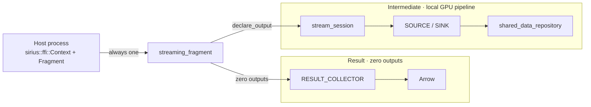

# Fragments

A fragment is one runnable piece of a query. It is a bound plan, the input and output streams it
declares, and the code that builds, runs, and drains it. [Streaming
Sessions](streaming-sessions.md) covers the primitives underneath
(`exec::batch_stream`, `STREAMING_SOURCE` / `STREAMING_SINK`, and the id-addressed
`exec::stream_session` router). This document covers the layer above: how a Substrait or DuckDB
plan becomes a fragment, how declared streams get a schema before the plan is bound, and how
`relay_from()` chains fragments, including across processes.

Names used here:

- Host process: `sirius::ffi::Context` plus `sirius::ffi::Fragment`. The embedding process
  (Rust compute node, C++ tests). This is not GPU host memory.
- `streaming_fragment`: the engine class that owns the query window and both terminals.

Two classes sit at two layers:

| | `exec::streaming_fragment` | `sirius::ffi::Fragment` |
|---|---|---|
| **Files** | `src/include/exec/streaming_fragment.hpp`, `src/exec/streaming_fragment.cpp` | `src/include/sirius_ffi.hpp`, `src/sirius_ffi.cpp` |
| **Caller** | C++ already inside a live `duckdb::ClientContext` and transaction, such as the transparent path or `Context::execute_substrait` | A caller that must not include DuckDB or cuDF headers, such as the Rust bindings |
| **Owns the connection?** | No. It borrows the caller's `ClientContext`. | Yes. `Context` brings up an embedded `duckdb::DuckDB` and `Connection`. |
| **Transaction / query window** | The caller supplies a DuckDB transaction when `plan_source` needs one. `streaming_fragment` opens and closes `StandaloneQueryScope`. | The host process manages DuckDB transactions. `streaming_fragment` still owns the query window. |
| **Shape** | Empty `outputs` is a `RESULT_COLLECTOR`. One or more outputs is a `STREAMING_SINK`. `spec.plan_source` is a `LogicalOperator` factory. | Declare, `build`, `relay_from`, `run`. Streams are addressed by id. |

`sirius::ffi::Fragment` is a PIMPL around one `exec::streaming_fragment`, covering both a
`STREAMING_SINK` terminal and a `RESULT_COLLECTOR` terminal. Together with `Context` it is the
host process: a connection, a transaction, and a bind catalog, without exposing DuckDB or cuDF
headers. The host process does not own the query window. `streaming_fragment::build()` opens it.
`run()`, a failed `build()`, or destruction closes it.



Zero outputs and `declare_output` both leave `streaming_fragment`. They no longer split in the
host process. `RESULT_COLLECTOR` is inside `streaming_fragment`, not a second plan owned by
`sirius::ffi::Fragment`.

## Quick path

```cpp
// exec::streaming_fragment. The caller already owns the DuckDB transaction if the plan
// source needs one. Do not open a second StandaloneQueryScope around build()/run().
fragment_spec spec;
spec.plan_source = my_plan_source;     // ClientContext& -> LogicalOperator
spec.outputs     = {0};                // one output stream; omit for a result fragment
streaming_fragment frag(client, std::move(spec));
frag.build();                          // opens the query window
frag.run();                            // blocks; closes the query window
drain(frag, 0);                        // pull() until drained
```

```cpp
// Host process: sirius::ffi::Context plus Fragment. Cross-language. Owns the connection.
// Not GPU host memory.
auto ctx = make_context();
auto sender = make_fragment(*ctx);
sender->declare_output(0);
sender->build(substrait_plan_bytes);   // commits its setup transaction, then builds
sender->run();                         // blocks; closes the query window

auto receiver = make_fragment(*ctx);
receiver->declare_input_column(0, "a", "BIGINT");
receiver->build(other_plan_bytes);     // this plan reads sirius_stream_source(0) / view sirius_stream_0
receiver->relay_from(*sender, /*source_stream_id=*/0, /*input_stream_id=*/0, /*sender_id=*/0);
receiver->run();
```

## `stream_bind_catalog` and `sirius_stream_source`

**Files:** `src/include/exec/stream_bind_catalog.hpp`, `src/exec/stream_bind_catalog.cpp`,
`src/include/exec/stream_plan_bindings.hpp`, `src/exec/stream_plan_bindings.cpp`

A fragment's input streams are not DuckDB tables. The binder has nothing to look up.
`sirius_stream_source(id)` is a table function that stands in. Bind resolves the declared stream's
names and types. The function body never runs. The physical plan generator replaces every
`sirius_stream_source` scan with a `STREAMING_SOURCE` before execution.

A plan does not call the function directly. It reads:

```sql
CREATE OR REPLACE VIEW main.sirius_stream_<id> AS SELECT * FROM sirius_stream_source(<id>)
```

A Substrait or SQL plan then sees an ordinary view name. `stream_view_name(id)` returns that
string.

DuckDB binds a table function long before physical planning. Both sides look up the declared
schema in `stream_bind_catalog`, a `duckdb::ClientContextState` registered per connection:

```cpp
class stream_bind_catalog : public duckdb::ClientContextState {
 public:
  static constexpr const char* kStateKey = "sirius_stream_catalog";

  void declare(stream_id_t id, stream_input_binding binding);  // overwrites same-id entry
  void clear();                                                 // drop every declaration
  void erase(stream_id_t id);                                   // drop one; no-op if absent

  const stream_input_binding& get(stream_id_t id) const;        // @throws if undeclared
  void set_built(stream_id_t id, op::sirius_physical_streaming_source* built);
};

duckdb::shared_ptr<stream_bind_catalog> catalog_for(duckdb::ClientContext& context);
```

The round trip:

```
declare_input_column(id, name, type) × N   ── caller-side, before build() ──►  stream_bind_catalog::declare(id, ...)
                                                                                          │
stream_source_bind()  (DuckDB bind, resolves the CREATE VIEW's schema)  ◄── catalog_for(context)->get(id)
                                                                                          │
create_streaming_source_plan()  (physical planning, builds STREAMING_SOURCE)  ◄── catalog_for(context)->get(id)
                                                                                          │
                                                                                catalog->set_built(id, source.get())
                                                                                          │
streaming_fragment::build() / Fragment::build()  ── reads catalog->get(id).built ──►  session add_source(id, *built)
```

`create_plan()` builds the physical operator and does not return it to the fragment layer.
`set_built()` is how that operator reaches the session that wires it.

### Contracts

- **Several fragments may share one connection.** One `sirius::ffi::Context` can hold several live
  `Fragment` objects so `relay_from()` can chain them. `clear()` drops every declaration on the
  connection. Only a caller that owns the whole catalog may call it. A fragment that shares a
  connection must call `erase()` on the ids it declared. `streaming_fragment` does this in its
  destructor and at the start of `build()`. `sirius::ffi::Fragment::Impl` does the same. Neither
  calls `clear()`.
- **A declared stream may be read by at most one plan leaf.** `set_built()` rejects a second bind
  for an id that already has one. Without that, a plan that reads the same stream twice would
  orphan the first leaf. Only the last bind's operator would be registered, so the earlier leaf
  would never see a push or a close and its pipeline would wait forever. Give each reader its own
  stream id.
- **The catalog must exist before bind.** The transparent SQL path installs it in
  `SiriusContextExtensionCallback::OnConnectionOpened`. The host process installs it in
  `sirius::ffi::Context::Impl::bring_up()`. Both remove it on close. Without it, `catalog_for()`
  throws on the first `sirius_stream_source` bind or `streaming_fragment::build()`.

## `exec::streaming_fragment`

Owns one fragment's life cycle. It declares inputs into the catalog, opens the query window,
plans, builds the sink or result collector, runs, and keeps output pullable after `run()` returns.

```cpp
struct fragment_spec {
  logical_plan_source plan_source;                    // ClientContext& -> LogicalOperator
  std::map<stream_id_t, stream_input_spec> inputs;     // schema + expected senders per input
  std::vector<stream_id_t> outputs;                    // positional: outputs[i] = partition i; empty = result
  std::optional<op::partition_spec> partitioning;       // illegal when outputs.size() < 2
  duckdb::shared_ptr<duckdb::PreparedStatementData> prepared;  // optional; result names/types
};
```

The constructor validates the spec. A plan source is required. More than one output requires a
`partitioning` mode. A gather sink with N outputs and no partitioning would leave N-1 streams
empty with no explanation. A `partitioning` mode on fewer than two outputs is rejected, including
a result fragment with empty `outputs`. Empty outputs with no partitioning is a
`RESULT_COLLECTOR`, not an error.

**`build()`** opens a `StandaloneQueryScope` on this connection's `sirius_state`. It `erase()`s
this fragment's catalog ids, then redeclares them so a rebuild after a caught failure is
idempotent. It runs `plan_source` for a bound `LogicalOperator`, lowers that to a physical plan,
and roots the plan in `sirius_physical_streaming_sink` or `sirius_physical_materialized_collector`.

- **Hash-key cast types.** When `partitioning.key_cast_types` is empty, `build()` fills one type
  per key column. Independently planned senders must hash the same logical value the same way.
  cuDF `murmur3` hashes raw bytes, so an `INT32` sender and an `INT64` sender for one column
  would split matching keys across partitions. `TINYINT`, `SMALLINT`, and `INTEGER` become
  `INT64`. `BIGINT`, `BOOLEAN`, and `VARCHAR` keep `EMPTY` (hash as-is). `DECIMAL` becomes
  `FLOAT64`. Any other type throws. A key column outside the sink's column range throws before
  any cast.
- Every declared input is checked against the catalog `built` pointer after planning. A stream
  declared but never read by the plan throws. Leaving it would hang, because nothing would close
  it.
- The engine owns the plan. The fragment owns the engine. The sink and its output repositories
  stay pullable after `run()` returns. Query-window cleanup does not destroy them.

**Member declaration order is the lifetime contract.** C++ destroys members in reverse declaration
order. Reordering these members is a use-after-free.

1. Repositories first, so they outlive anything still writing or reading them.
2. `_result_plan` next. A `RESULT_COLLECTOR` holds a reference into it.
3. Engine next. It owns the plan, which holds raw pointers into operators the session also
   points at.
4. `_session` after the engine, so the session is torn down before those operator pointers go
   away.
5. Query window last, so a drop after `build()` releases the slot before the engine it populated
   is destroyed.

**`run()`** reuses the window `build()` opened. A second `StandaloneQueryScope` would reset the
task creator and scan manager that `build()` already filled, and the fragment would run zero
tasks. On success it calls `finish()` and releases the window. On an engine exception it poisons
every declared output with `fail_output(id, ...)` (secondary failures per id are swallowed), then
closes the window and rethrows. Otherwise a peer in `wait()` on that stream would block forever.
That is the S2/S3 hazard [Streaming Sessions](streaming-sessions.md#execbatch_stream) documents
for `batch_stream`. `fail_output()` is first-failure-wins, so this stays safe when
`sirius::ffi::Fragment::run()` also poisons the same outputs. See [Other contracts](#other-contracts).

Callers, including tests, must not open their own `StandaloneQueryScope` around
`streaming_fragment::build()` / `run()`. A second window is the empty-output bug this ownership
exists to stop.

**`relay_from(source, source_stream, input_stream, sender)`** lives on `streaming_fragment`. It
checks that both fragments are built, the source has run, they share a `ClientContext`, the
source is not a result fragment, the input was declared, the sender is expected, and
`sink_types()` agree. Then it moves batches and closes once. `sirius::ffi::Fragment::relay_from`
forwards to this.

**`sink_types()`** is the plan root's output column types, set during `build()`. Relay uses it to
check column count and type ids against the target's declared input types before any batch
moves. `pull`, `push`, `close_input`, `drained`, and `fail_output` wrap the session. The session
itself is not public.

## Host process: `sirius::ffi::Context` plus `Fragment`

**Files:** `src/include/sirius_ffi.hpp`, `src/sirius_ffi.cpp`

The host process is the embedding process. `Context` plus `Fragment` are its public types. This
is not GPU host memory.

`Context` is an RAII handle to one embedded engine: a `duckdb::SiriusContext`, a
`duckdb::DuckDB` plus `Connection`, and a `stream_bind_catalog`. Every `Fragment` created with
`make_fragment(context)` shares that.

A `Fragment` with declared output streams is intermediate and roots in a `STREAMING_SINK`. A
`Fragment` with no declared outputs is a result fragment, roots in a `RESULT_COLLECTOR`, and
produces Arrow through `result_to_arrow()`. Both are one `exec::streaming_fragment`.
`declare_output()` decides which. `is_result()` is `outputs.empty()`. There is no constructor
flag.

### `build()`: two phases, two windows

```
declare_input_column / declare_input_sender / declare_output / declare_output_broadcast / declare_output_hash_key
                                          │
                                          ▼
                          ┌─── Phase 1: setup transaction ───┐
                          │  BeginTransaction()               │
                          │  resolve_inputs()   (type-name parsing needs a catalog lookup)
                          │  declare_streams()  (populate stream_bind_catalog)
                          │  create_stream_views()  (CREATE OR REPLACE VIEW per input, real DDL)
                          │  Commit()                          │
                          └────────────────────────────────────┘
                                          │
                                          ▼
                          ┌─── Phase 2: lower + fragment build ─┐
                          │  BeginTransaction()                   │
                          │  lower_substrait()                    │
                          │  construct exec::streaming_fragment   │
                          │  fragment->build()  (opens the window)│
                          │  Commit()                             │
                          └───────────────────────────────────────┘
```

Phase 1 exists because parsing a DuckDB type name and creating a view both need an active
transaction. That transaction must be committed before Phase 2. `StandaloneQueryScope` takes the
engine's single-flight lifecycle slot. The two steps are sequential, not nested.

Phase 2 opens a second short DuckDB transaction so Substrait lowering can bind `parquet_scan`
and views. That is the same `ActiveTransaction` requirement as `Context::execute_substrait`.
`streaming_fragment::build()` opens the query window while that transaction is still open.

A `Fragment::build()` failure lands in one of two states:

- Phase 1 failure (bad type name, or a stream id that fails at `CREATE VIEW`) leaves the
  transaction open. `transaction_open` is set when `BeginTransaction()` returns and is cleared
  only after `Commit()` succeeds.
- Phase 2 failure happens after the setup transaction is closed. The lowering transaction may
  still be open. `streaming_fragment` closes the query-window slot on a failed `build()`.

`end_lifecycle()` runs from both catch blocks and from `~Fragment::Impl()`. It is `noexcept`.
It only rolls back a still-open DuckDB transaction. Destroying `fragment`, or
`streaming_fragment::build()`'s own catch, releases the query-window slot:

```cpp
void end_lifecycle() noexcept
{
  if (transaction_open) {
    transaction_open = false;
    ctx.conn->Rollback();  // not Commit; see below
  }
}
```

**Rollback, not commit, on failure.** `transaction_open` is true here only because setup failed
during Phase 1. `build()` clears the flag as soon as its own `Commit()` succeeds, so this branch
is the failure path. If `create_stream_views()` already created some views when a later input
fails to bind, those `CREATE VIEW` statements are uncommitted catalog writes. Committing would
keep that half-declared fragment after `build()` failed. Rolling back discards it. DuckDB's
`TransactionContext::Commit()` and `::Rollback()` both clear the active-transaction slot before
their real work, so a later `BeginTransaction()` would succeed either way. The difference is
whether the half-declared catalog state survives. See commit `4431213a`.

### `relay_from()`

```cpp
std::size_t relay_from(Fragment& source, std::uint64_t source_stream_id,
                        std::uint64_t input_stream_id, std::uint32_t sender_id);
```

Drains every batch currently on `source`'s output stream `source_stream_id`, pushes each into
this fragment's input stream `input_stream_id`, then closes `sender_id` on it. Two checks run
before anything moves:

- **`source` must already have `run()`.** The drain loop pulls until it gets nothing. "Nothing
  right now" on an open stream is the same return as "stream ended". See
  [`exec::batch_stream` S1 to S5](streaming-sessions.md#execbatch_stream). Calling `relay_from()`
  before the source has run would close the input after zero batches and truncate the result.
- **`input_stream_id` must be a declared input on this fragment, and `source` must be
  intermediate.** A result fragment produces Arrow via `result_to_arrow()`, not a relayable
  stream.

`streaming_fragment` then checks column count and type ids between the target's declared types
and the source's `sink_types()` before any batch moves. A mismatch throws instead of feeding a
bad schema into cuDF.

### Other contracts

- **A partition mode needs at least two destinations.** `declare_output_broadcast()` and
  `declare_output_hash_key()` do not check `outputs`. `build()` rejects 0 or 1 outputs with a
  partition mode, for a result fragment as well as a one-output gather. Without that, every row
  would still go to the one destination while the call looked like routing.
- **`run()` poisons every declared output on failure, same as `streaming_fragment::run()`.**
  Both layers call `fail_output()` for every id in `outputs` before rethrowing. First failure
  wins, so this is not a second poison that hides the cause. A direct `streaming_fragment`
  caller, such as a unit test, gets the same protection as a `Fragment` caller.

## Tests

| File | Catch2 tags |
|---|---|
| `test/cpp/exec/test_stream_bind_catalog.cpp` | `[stream_bind_catalog]` |
| `test/cpp/exec/test_streaming_fragment.cpp` | `[integration][streaming_fragment]`, `[integration][streaming_fragment_control]` |
| `test/cpp/exec/test_sirius_ffi_fragment.cpp` | `[isolated_context][sirius_ffi]` |
| `test/cpp/exec/test_sirius_ffi_host.cpp` | `[isolated_context][sirius_ffi]` |

FFI tests are tagged `[isolated_context]` because `sirius::ffi::Context` brings up its own
`SiriusContext` and GPU memory pools. The Catch2 listener in `test/cpp/unittest.cpp` pauses the
shared test environments around that tag so they do not share GPU memory with it.

`test_sirius_ffi_host.cpp` drives host-process methods (`declare_*`, `build`, `relay_from`,
`run`, `result_to_arrow`). The file name means the embedding process, not GPU host memory. It
builds Substrait in the test because the FFI has no SQL passthrough. It covers a leaf result, a
`relay_from` chain, nested `build()`, and drop after `build()`. Spec errors stay in
`test_streaming_fragment.cpp`. Failed-build rollback stays in `test_sirius_ffi_fragment.cpp`.

## Not yet ported

`Fragment::run()` blocks. It goes through `streaming_fragment::run()` into
`sirius_engine::execute()`, which waits on the future from `start_query()`. Fragments therefore
run store-and-forward, one at a time. `relay_from(...)` must finish before `run()`, and only one
fragment may sit between its own `build()` and `run()`. Remote senders still need
`sirius::ffi::Fragment` `push_arrow`, `pull_arrow`, and `drained` from the Arrow shuffle stack,
not this change.
`relay_from()` only moves batches already sitting in a local, finished source fragment's output
repository. Non-blocking scheduling is tracked separately.
