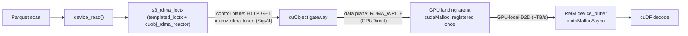
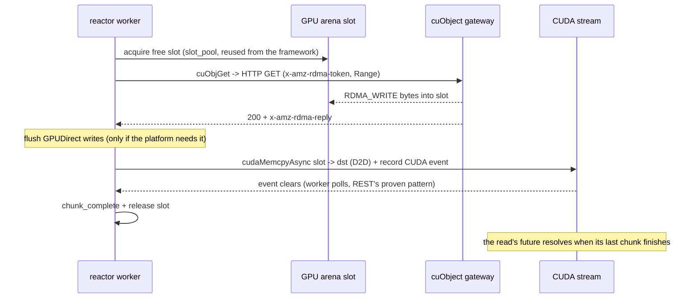
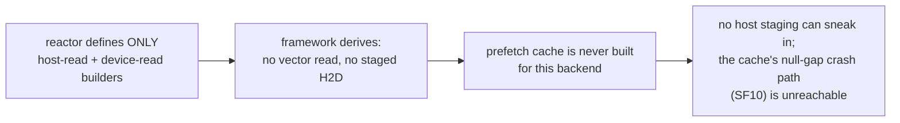

# S3 RDMA Transport for Sirius — Design for Team Review

| | |
|---|---|
| **Status** | Draft for team review — rebased onto the merged REST IO framework (#997) and the S3 cutover (#1042), both on `dev` |
| **Date** | 2026-07-04 |
| **Author** | Sirius Contributors |
| **Benchmark** | <https://github.com/sirius-db/s3RDMA-benchmarktool> — ~91 Gbps GPU-mode GET on CX-6 RoCE |

## TL;DR

Read large Parquet column data from S3 **straight into GPU memory over RDMA**,
removing today's pinned-host staging + PCIe H2D copy. A cuObject gateway
`RDMA_WRITE`s into a small pre-registered GPU **arena**; a GPU-local copy then
moves it to the final RMM buffer. `s3://` URIs, SigV4 auth, and the Parquet
scanner are unchanged — the new code is one reactor plus a thin ioctx under the
existing `templated_ioctx`, exactly how the REST backend is built. The benchmark
proves the cuObject RDMA data path at line rate; the Sirius-specific arena+D2D
visibility and completion discipline are gated by P3. **Please review the
decisions table (§3) and the open questions (§5).**

## Why

Sirius reads S3 Parquet today via the REST backend (`rest_ioctx`): libcurl range
GETs into pinned host bounce buffers, then `cudaMemcpyAsync` to the GPU — every
byte crosses host memory and PCIe **twice**. RDMA-direct removes both legs.

- **Goals:** large device reads RDMA-direct into GPU memory; keep `s3://` /
  SigV4 / `sirius_datasource` semantics; the REST backend stays the
  config-selectable default; no Parquet-scanner changes.
- **Non-goals (v1):** no new URI scheme; no plain-AWS-S3 (needs a cuObject
  gateway); no `AUTO` probe and no runtime HTTP fallback (RDMA failure = I/O
  error); no AWS-CRT dependency.

## 1. Architecture



The **control plane** (HTTP) carries only the RDMA descriptor token; the **data
plane** (RDMA) writes object bytes straight into the GPU arena. Versus the REST
backend (GET → pinned host bounce → PCIe H2D), this swaps host staging for a
small GPU arena and the H2D copy for a GPU-local D2D (<1% overhead). Host reads
(footers / HEAD) still go over HTTP, reusing `curl_handle` and the SigV4
`s3_request_authorizer`.

The arena is a **fixed per-chunk staging window**, not object-sized: the reactor
splits a read into slot-sized chunks that stream through the arena in waves, each
chunk D2D-copied to its offset in the full-size RMM destination buffer. A 128 MiB
(or multi-GB) read flows through the same small arena.

Both sizing knobs are **config** (`s3_rdma_max_inflight`,
`s3_rdma_arena_slot_size`). The default — **8 workers × 4 MiB slots = 32 MiB per
device** — is calibrated on the benchmark's CX-6 **100G** rig, which is the
*floor* for this transport (line rate at 8 × 4 MiB; 8 × 1 MiB leaves ~12% idle).
Faster NICs scale the same two knobs, not the design: keep the bytes in flight
(`workers × slot_size`) growing roughly linearly with line rate — e.g.
~16 × 16 MiB or 64 × 4 MiB ≈ 256 MiB/device for 800G-class NICs — and re-derive
the knee empirically on the target rig (a P4/P5 sweep). The arena stays trivial
next to GPU memory at any of these points.

## 2. How one read works



`cuObjGet` blocks until the RDMA completes, so the **worker pool is the
concurrency bound**. Completion uses the framework's `exec::semi_future` +
`request_manager`: each chunk reports `chunk_complete` or `report_error` exactly
once and then releases its manager reference — the future resolves when the last
chunk does. Nothing runs on a CUDA callback thread; the worker finishes the chunk
after its CUDA event clears, then recycles the slot. Because the D2D is ~3 µs
against a ~350 µs network GET, v1 may simply wait on the event inline instead of
parking copies for a poll loop — a simplification to measure in P2/P3.

## 3. Key decisions

| # | Decision | Why |
|---|---|---|
| D1 | Keep `s3://`; select the backend once, at `io_context_registry` construction: `s3_transport=RDMA` registers the rdma backend for the s3 slot instead of restful (`AUTO`→HTTP) | `s3_transport` already exists in config (parsed, currently unused); exactly one s3 backend per context keeps path routing unambiguous, and the scan side (`ioctx_for_path` / split providers) is untouched |
| D2 | `s3_rdma_ioctx : templated_ioctx<cuobj_rdma_reactor>` — the reactor provides `prep_host_rx` / `prep_device_rx` builders + `enqueue`; credentials and the registered arena live in its `reactor_context` | Same shape as `rest_ioctx`; chunking, pooling, completion, the `slot_pool`, and the registry factory are all reused |
| D3 | One hybrid ioctx: host reads → HTTP, device reads → RDMA; the REST backend is not instantiated in RDMA mode | Backends are mutually exclusive per context; callers see identical semantics |
| **D4** | **Landing arena + GPU-local D2D**, not direct RDMA into RMM buffers | Sirius RMM is `cuda_async_memory_resource` — not registrable for GPUDirect and stream-ordered, so the NIC can't target it. Arena = `cudaMalloc`, registered once; D2D is <1% overhead, zero host bounce |
| D5 | Completion via `semi_future` + `request_manager`; a chunk completes exactly once, on a worker thread, after its CUDA event clears — never from a CUDA callback | Matches the framework contract (the future resolves when the last chunk releases its manager reference); keeps user code off CUDA's internal threads |
| D6 | v1: explicit `RDMA` opt-in, fail loudly, no HTTP fallback; all device reads go RDMA | Fallbacks and premature thresholds mask misconfiguration exactly where RDMA is deliberately deployed |
| D7 | Optional build feature `SIRIUS_ENABLE_S3_RDMA` (conda `libcuobjclient` or `CUOBJ_SDK_ROOT`); never vendor NVIDIA SDKs | Default-off builds unchanged. Note: conda ships cuObject 1.2.x while the benchmark validated 1.0.0 — version reconciliation is a real task, not a drop-in add |
| D8 | Dev rig = benchmark server (unsigned, isolated net); production gateways must SigV4-validate before honoring RDMA headers | The client always signs; RDMA headers must never bypass auth |
| **D9** | **Prefetch cache off, structurally**: the reactor defines *only* the host-read and device-read builders and omits the two staged-read ones — the framework then derives "no cache for this backend" on its own | Capabilities are derived from which builders a reactor defines (there is no flag to set); the cache activates only if a backend has a staged-read path. kvikio — Sirius's official fallback backend — already ships this exact minimal profile |

Why D9 works, in one picture:



This is not just hygiene: the armed cache currently **over-reads 2–7× on sparse
column projections** (issue #1078, a foreground/background allocation race) —
this backend is structurally immune to that too, the same way kvikio is.

`max_inflight` = worker count = **global** in-flight ceiling (one blocking
`cuObjGet` per worker); "per-device" applies only to arena placement
(`max_inflight × slot_size` per active GPU, worst case). Direct-into-RMM is a
gated future spike (§5 Q4).

**One reactor per node — and what scales with what.** For contrast: the REST
backend runs **2 reactors per node** (`rest_n_reactors`), unrelated to GPU count —
its reactors are epoll event loops doing real CPU work (TLS, staging copies), so
a second one spreads CPU load. The RDMA reactor is *not* an event loop
(`cuObjGet` blocks): it is a container for the worker pool and the arenas, so
extra reactors add no throughput — they would only fragment the global in-flight
ceiling and multiply sessions. Hence three independent axes:

- **Throughput** scales with **workers** (= NIC line rate, see §1 sizing) — not
  with reactors, not with GPUs.
- **GPU count** scales only the **arena map**: an extra GPU lazily gets its own
  arena; a worker sets the request's device and takes a slot from *that* device's
  arena, so slot and destination are always same-device (never a cross-device
  copy). A per-GPU reactor would instead make concurrency `GPUs × max_inflight`
  (e.g. 4×8 = 32 concurrent `cuObjGet`), breaking the global ceiling and risking
  gateway/NIC overload.
- **NIC count** is the one thing that eventually justifies more reactors:
  per-GPU / per-NIC **reactor sharding** — tighter NIC↔GPU affinity at the cost
  of global rate-limit complexity — is the deferred evolution for explicit
  multi-NIC/NUMA topologies, not v1.

**New consumers stay compatible:** the transparent `read_parquet('s3://')` front
door (#1074, `sirius_httpfs`) resolves its backend per path through
`create_datasource(path)` and reads with single positional `host_read`s — under
`s3_transport=RDMA` it works unchanged, with no transport-specific checks.

**Known v1 scope limit (not Parquet):** the DuckDB-native `.db` decoder is the
one caller of the vector host-read entry point, which this backend omits — a
native `.db` ATTACHed over s3://+RDMA fails loudly. kvikio has the same gap
today; a small framework fix (fall back to per-segment single reads when the
vector path is absent) would close it for both and is proposed as a standalone
change.

## 4. Rollout

| Phase | Scope | HW |
|---|---|---|
| **P0a ✅ wire migration landed** | Standard wire protocol merged into `s3RDMA-benchmarktool` (drop 4 non-standard headers; server decodes the address from the token; `x-amz-rdma-reply`) | — |
| **P0b ⏳ gateway hardening open** | Re-add strict descriptor parsing (the migration removed the old validator — a regression); enforce the token's `buf_size` (on the wire but unread); explicit short-write `n == expected` check | — |
| **P1 — unblocked** (#1042 merged) | Add the rdma backend type + factory; the `io_context_registry` constructor picks rdma-vs-rest for the s3 slot by `s3_transport` (`AUTO`→HTTP); routing tests extend the existing cutover suite | — |
| P2 | `cuobj_rdma_reactor` against a **mock** client; hardware-free matrix incl. compile-time checks that the two staged-read capabilities stay off | — |
| P3 | Real cuObject path, single GPU; arena + D2D + flush + a visibility stress test; pin the registration-per-session question | CX-6 |
| P4 | Multi-GPU (per-device arenas, NIC↔GPU affinity), retries, metrics, tuning | CX-6 |
| P5 | Range coalescing; direct-into-RMM spike; small-read threshold go/no-go; vs-HTTP benchmark | CX-6 |

## 5. Open questions for team review

1. **Sizing defaults** — ship 8 workers × 4 MiB as the **100G-floor** default
   (line rate on the CX-6 rig) with the documented rule "scale in-flight bytes
   linearly with NIC line rate" (§1) — or should the default self-scale from a
   detected/configured link speed? 800G-class NICs need ~8× the in-flight bytes
   and proportionally more workers, which also stresses the blocking-GET
   thread-per-worker model (§6).
2. **OWNER-flush ownership** — who verifies whether `…_ORDERING_OWNER` still
   needs `cuFlushGPUDirectRDMAWrites` for same-device consumers? Neither the
   benchmark nor Sirius contains any flush handling today — this is from-scratch
   P3 work and the top correctness risk.
3. **Dev-rig hardware** — can we allocate the CX-6 pair for P3–P5?
   (Single-NIC suffices for P3.)
4. **cucascade registrable IO sub-MR** — appetite for a `cudaMalloc`-backed,
   registrable allocation path for IO buffers? It unlocks direct-into-RMM
   (drops the <1% D2D) but touches cucascade's memory architecture.
5. **Metrics** — counter set + naming vs the existing S3 counters. Note the #982
   perf instrumentation was re-added for the REST reactor in #1042; the RDMA
   counters should follow that shape rather than invent a parallel one.
6. **Registration × sessions** — each worker owns its own `cuObjClient` session;
   is a buffer registration per-session (8 registrations of the same arena) or
   shareable? SDK-version-dependent (conda 1.2.x vs the validated 1.0.0); shapes
   the client-wrapper API. Pin on the rig in P3.

## 6. Risks

- **CUDA visibility after external RDMA writes** — top correctness risk;
  confined to one flush-before-D2D point; stress test gates P3.
- Needs a controlled cuObject gateway (not plain AWS S3). NIC↔GPU PCIe affinity
  can silently halve BW. The gateway slot budget must cover `max_inflight` per
  client process (not × GPUs or × queries).
- Small-read control-plane RTT overhead (mitigation = optional whole-read
  threshold, P5); cuObject's blocking GET shapes the worker-pool model — and at
  800G-class line rates the pool grows ~8× (with the gateway DCI budget growing
  with it), sharpening the case for an async cuObject API if one appears.
- cuObject SDK version skew (conda 1.2.x vs benchmark-validated 1.0.0) — must be
  reconciled before P3.

---

## Appendix — Protocol & config

### Control-plane headers

Standard cuObject protocol (spec §1.3.2 / §1.3.3): two custom tags + `Range`.

| Header | Direction | Meaning |
|---|---|---|
| `x-amz-rdma-token` | client → gateway | base64 cuObject descriptor; **encodes the remote slot address** (and the slot size) |
| `x-amz-rdma-reply` | gateway → client | RDMA status tag (authoritative completion is `cuObjGet`'s `n == expected`, not a reply byte count) |

The benchmark's four extra headers (`x-cuobj-remote-addr`, `x-cuobj-size`,
`x-cuobj-chunk-size`, `x-amz-rdma-bytes-transferred`) are **dropped**: the
address rides in the token, capacity is the `cuObjGet` `size` arg, and the
reply tag supersedes the byte-count header. The server chunks transfers
server-side (its own config, default 2 MiB) — nothing is negotiated on the wire.
Production gateways SigV4-validate the control request before honoring the token.

### Config (under `object_store_config`)

`s3_transport { AUTO, HTTP, RDMA }` already exists and is parsed; this work adds
its consumer. The rest are new fields for the integration PR:

```text
s3_transport = HTTP | RDMA        # existing; AUTO -> HTTP in v1
s3_rdma_endpoint / s3_rdma_port   # control-plane endpoint if distinct
s3_rdma_max_inflight              # worker count = global in-flight ceiling
                                  #   default 8 — calibrated on the 100G floor; scale with NIC line rate
s3_rdma_arena_slot_size           # per-chunk arena slot
                                  #   default 4 MiB — same calibration; workers x slot_size tracks line rate
```

There is deliberately **no client chunk-size knob**: the transfer granularity is
the arena slot size, and the server chunks independently. Auth/TLS reuse the
existing fields (`s3_signing_mode`, `ca_bundle_path`, `tls_verify`).

Counters follow the REST-reactor instrumentation shape: `s3_rdma_bytes_total`,
`…_requests_total`, `…_arena_slot_wait_total`, `…_flush_total`,
`…_short_write_total`, `…_error_total`, `…_inflight_peak`.

### P0 status (in `s3RDMA-benchmarktool`)

**Wire migration landed** (merged to `main`, 2026-06-17): the 4 non-standard
headers dropped, the server decodes the slot address from the token (works on the
pinned cuObject 1.0.0 — no SDK bump), `x-amz-rdma-reply` status, callback-once
documented. **Open hardening (P0b):** the migration **removed** the previous
strict address validator — today's parse takes the first hex field with no
length/field validation (and wrongly rejects a legitimate address 0); the token's
`buf_size` field is transmitted but never read server-side (a free capacity check
not being performed); the client reports success on any 200/206 without an
`n == expected` short-write check; optional SigV4 in the dev server.

> Deeper implementation notes + verified file:line references live in the
> offline working spec, not this doc.
