# Sirius as a StarRocks compute node: data exchange & public-API design

> **Status: design proposal.** This document explains the *proposed* public APIs for running Sirius as a
> StarRocks shared-data **compute node (CN)** — how data moves in and out of the engine while overlapping
> with computation, and how that interacts with the cuCascade memory budget and the `nixl` cross-node
> transport. It tracks issue [#826](https://github.com/sirius-db/sirius/issues/826) and its sub-issues
> [#835](https://github.com/sirius-db/sirius/issues/835)–[#841](https://github.com/sirius-db/sirius/issues/841).
> Most of the streaming surface is **not implemented yet**; this is a shared mental model to drive that work.

## How to read this document

The diagrams use a consistent legend, because some pieces exist today, some are proposed, and some are
adapted from the earlier **Doris** experiment (`origin/doris`):

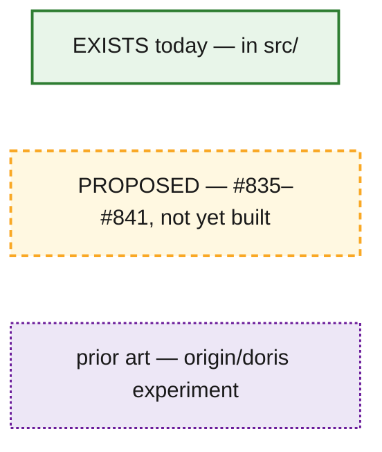

- **Solid green** = already in the Super Sirius engine (`src/`).
- **Dashed amber** = proposed in the StarRocks sub-issues.
- **Dotted purple** = prior art that exists only on the `origin/doris` branch and is being adapted.

---

## §0 Context — old vs new

The Doris experiment used a **materialize-then-shuffle** model: a Sirius fragment runs to completion, its
result is captured as a fully-materialized `ExchangeArtifact` (packed cuDF tables), Rust hash-partitions it
(`compute_dest_assignments`, CRC32), and ships it to peers over bRPC, with a `nixl` GPU-direct fast path.
Exchange cannot begin until the fragment finishes.

The StarRocks proposal replaces this with a **streaming** model: a stage accepts input batches over its
lifetime and emits output incrementally, so receiving, computing, and sending **overlap** instead of running
in sequence.

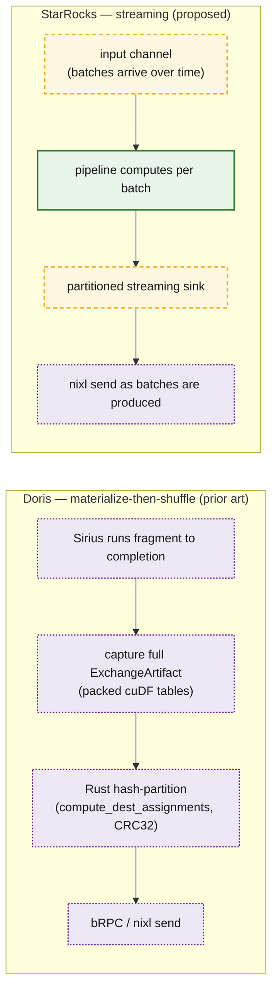

*Refs (prior art): `doris/crates/sirius-ffi/src/lib.rs:26-27,929,1006`
(`ExchangeCaptureMode::MaterializeAndCapture`, `begin_exchange_capture` / `take_exchange_artifact`),
`doris/crates/doris-rpc/src/hash_partitioner.rs:157-191` (`compute_dest_assignments`).*

---

## §1 Deployment topology

The StarRocks FE plans a query into fragments and dispatches them to compute nodes over thrift
(`exec_plan_fragment`). Each CN wraps a Sirius engine. CNs exchange intermediate data **directly GPU-to-GPU
via `nixl`**, and the FE pulls final results with `fetch_data`.

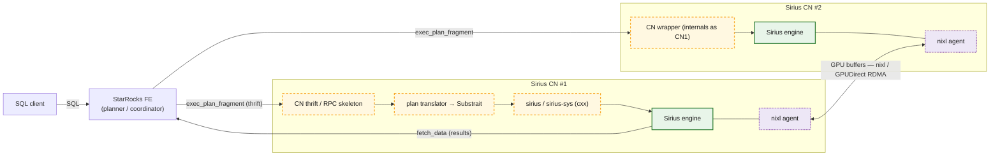

*Refs: CN RPC skeleton (PR #856); plan translator (PR #852, #841); cxx bindings (#835, PR #908); nixl
adapted from `doris/crates/doris-rpc/src/nixl_exchange.rs`.*

---

## §2 From plan fragment to streaming stages

A StarRocks `TExecPlanFragmentParams` (a flat pre-order node list) is translated to a Substrait `Plan`
(#841), which is lowered to a DuckDB plan and then to a Sirius streaming plan. The boundaries of a fragment
become a **streaming source** at the bottom and a **streaming sink** at the top. A **leaf** fragment sources
from a scan; an **intermediate** fragment sources from an exchange stream fed by an upstream fragment's sink
on another CN.

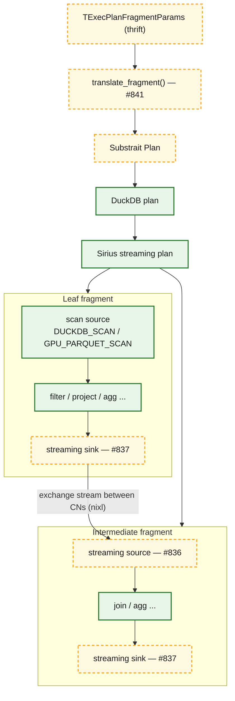

*Refs: `#841` (Substrait→DuckDB→Sirius lowering); scan operators bind a `split_connector` today; the
streaming source/sink are net-new (#836/#837).*

### Worked example — distributed GROUP BY

Sirius already splits a single-node group-by into `HASH_GROUP_BY` (partial aggregation per batch) →
`PARTITION` (hash-partition the partials by group key) → `MERGE_AGGREGATE` (finalize per partition). A
cross-CN shuffle aggregation is the *same* shape with the **`PARTITION` step replaced by the partitioned
exchange sink** — the redistribution that `PARTITION` does locally is exactly what the shuffle does across
CNs:

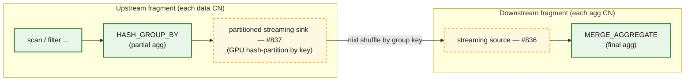

There is **no** separate local `PARTITION` before the sink (the shuffle is the partition) and **no**
StarRocks-specific merge operator (both ends are Sirius, so the shipped partial-aggregate state is Sirius's
own format and `MERGE_AGGREGATE` consumes it directly; `nixl` routes opaque bytes by hash). Sirius does not
choose the aggregation phasing — StarRocks' FE planner emits the partial/final fragment structure and we map
each fragment's operators; this is what a two-phase hash-shuffle aggregation lowers to. The lowering must keep
the upstream partial-agg state representation consistent with what the downstream `MERGE_AGGREGATE` expects
(see §7).

---

## §3 The public streaming API — stream session

The **stream session** (#839) is the public entry point. It builds a streaming plan and starts it on the
**existing** `task_scheduler` *without blocking* the caller. The wrapper feeds inputs with
`push(stream_id, batch)` and signals end-of-stream with `close_input(stream_id)`; it drains outputs with
`pull()` / `wait()`. Inputs and outputs are **bounded channels** of *handles* (repository batch-ids) to
repository-registered `cucascade::data_batch`es. The **owner of record** is the cuCascade
`shared_data_repository` registered with the memory manager; because a channel carries handles rather than
owning `shared_ptr`s or bare buffers, batches queued under backpressure stay accounted and spillable **via the
repository** (see §6, option A). Because a `data_batch` is a `shared_ptr`, its GPU memory is freed only when
the last *owning* holder drops it (and it is idle). The owning holders across a batch's life are the
repository, the in-flight task's `read_only`/`mutable` accessor, the downgrade executor (transiently, while
spilling), and the `nixl` send path (until the `transfer_complete` handshake). The channel is deliberately
**not** an owner — keeping it a handle means a queued batch's `use_count()` reflects only real owners, which
is what lets the sink's zero-copy steal (§7) ever observe `use_count()==1`. The session routes a pushed batch
to the correct streaming source **by stream id**. For the **root** fragment the output channels *are* the
query result: the wrapper drains them with `pull()`/`wait()` and returns rows to the FE via `fetch_data`, with
no `nixl` peer — it is the same streaming-sink operator as an exchange sink, just with partitioning degenerate
to a single destination and a different drain (intermediate fragments' sinks instead feed a peer CN over
`nixl`, §4–§5).

The **wrapper⇄engine boundary is the channel itself** (exposed over the cxx FFI): for a source the wrapper is
the producer and the engine operator the consumer; for a sink it is reversed. The streaming source and sink
are **ordinary Sirius operators** (`sirius_physical_operator` subclasses), not a separate subsystem: the sink
is the **final operator of its pipeline** and runs inside a normal `gpu_pipeline_task` on the existing
`gpu_pipeline_executor`, just like `RESULT_COLLECTOR` or `MERGE_GROUP_BY` terminate a pipeline today — compute
results are pushed into a `shared_data_repository` (a port) and the sink pulls from it and pushes to the output
channel via `publish_output()`/`sink()`. There is **no dedicated thread pool** for them; they share the
scheduler/worker pool with all compute, while `nixl`'s own threads live in the **wrapper**. So each channel is
a hand-off between wrapper threads and engine worker threads. The bounded channel is also the source's and
sink's **only hand-off queue**. The partitioned sink may keep bounded per-destination coalescing state
internally (see §4), but that state is part of the sink's accounted operator state, not a second unbounded
queue.

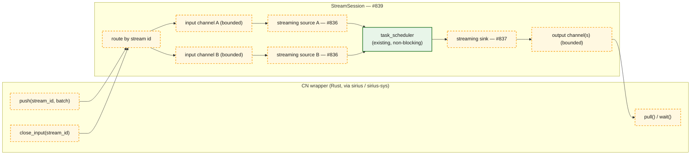

> Today, operators source data **only** from scans (bound to a `split_connector`) or a pre-materialized
> `COLUMN_DATA_SCAN`, and a query's result is fully materialized into a `ColumnDataCollection`
> (`sirius_physical_materialized_collector` in `src/op/sirius_physical_result_collector.cpp`). The stream
> session replaces **both** ends with channel-backed streaming, reusing the operator interface that already
> exists (`execute` / `sink` / `is_source` / `is_sink` / `get_next_task_hint` / `get_next_task_input_data`
> in `src/include/op/sirius_physical_operator.hpp`).

---

## §4 The data path: in → compute → out

A batch received by `nixl` is first wrapped as a repository-registered `data_batch`; the input bounded
channel carries a handle to that registered batch. The streaming source consumes those channel
entries, publishes work into the pipeline, and drives task creation as batches arrive; the GPU executor
reserves memory **before** dispatching and runs on a per-device stream pool; the streaming sink emits results
incrementally; the partitioned sink (#837) owns both partitioning and per-destination coalescing. It splits
partitions across **per-destination** output channels so one slow receiver cannot head-of-line-block the
others, and it coalesces a destination's small slices up to a size or time threshold before flushing one
combined batch to that destination's channel — otherwise we ship a flood of tiny RDMA transfers. That
coalescing state is bounded and repository-visible, so accumulated slices remain accounted and spillable
while they wait to be concatenated/flushed. `nixl` sends each flushed output batch.

**Partition and coalesce are GPU operations *inside* Sirius, not the wrapper.** The hash partition is the same
GPU operation Sirius's existing `PARTITION` operator runs today (the SNMG partition path is also growing
coalescing) — the partitioned sink reuses that machinery, differing only in the hash function (the
StarRocks-compatible one below) and in routing partitions to per-destination output channels instead of local
repositories. So all GPU compute stays under Sirius's scheduler and the shared cuCascade budget; the Rust
**wrapper does no GPU compute** — it only moves already-partitioned, already-coalesced byte buffers over
`nixl`. (The §0 Doris "Rust hash-partition" is the *old* model; the streaming model moves it into the engine.)
This is why there is no second GPU scheduler to contend with.

**Partition hash compatibility (correctness-critical).** The FE plans shuffle and bucket joins assuming a
specific partition function, so the sink must reproduce StarRocks' hash **bit-exactly, per partition type** —
get it wrong and co-located rows land on the wrong CN, silently corrupting shuffle joins/aggregations.
StarRocks' `exchange_sink_operator` uses **three** regimes (`be/src/exec/pipeline/exchange/exchange_sink_operator.cpp`):
- `HASH_PARTITIONED` → the `exchange_hash_function_version` session variable: **fnv_hash** (v0, default) or
  **xxh3_hash** (v1).
- `BUCKET_SHUFFLE_HASH_PARTITIONED` with no bucket properties → **CRC32** (seeded 0), to match the table's
  on-disk bucket distribution.
- `BUCKET_SHUFFLE_HASH_PARTITIONED` with bucket properties → a bucket-id mapping
  (`_calc_hash_values_and_bucket_ids`).

So the sink must dispatch on partition type *and* version exactly as StarRocks does (see
`test/sql/test_exchange_hash_function`). Note CRC32 here is **not** merely the Doris prior art of §0 — it is a
live StarRocks bucket-shuffle path. (Tracked in §7.)

*Could an all-Sirius topology use a different (e.g. GPU-friendlier) hash?* For **`HASH_PARTITIONED`** shuffles
(shuffle joins/aggregations), yes — correctness needs only that every Sirius sender agree, since no external
party re-hashes the same rows; any consistent hash co-locates equal keys. But **`BUCKET_SHUFFLE`** is anchored
to the table's on-disk bucket layout (computed by StarRocks' CRC32 at *ingest* time, outside query control),
so it must use CRC32 even with all-Sirius CNs. Diverging is therefore safe only when both hold: all-Sirius CNs
*and* no native hash-bucketed tables (so no bucket-shuffle); matching StarRocks' hash stays the default since
it also keeps mixed Sirius/native-BE exchanges correct.

**Order is not preserved.** Incremental emission and per-destination coalescing both reorder rows. That is
fine for order-insensitive consumers (hash-join build, aggregation) but **not** for StarRocks' *merging*
exchange behind `ORDER BY` / top-N, where the receiver merges sorted runs. v1 targets order-insensitive
exchanges only; a merging sink (coalescing disabled, plus a receiver-side merge) is future work (§7).

The data unit is a `shared_ptr<cucascade::data_batch>` (owned by the repository) wrapping a `cudf::table`
(GPU device buffers) or, for a host-staged receive on a deployment that selects host staging, a host
representation that will be materialized to GPU before compute, guarded by a 3-state reader/writer lock
(`idle` / `read_only` / `mutable_locked`). Hand-off across a channel is **zero-copy with respect to the
channel itself**: only the handle moves, the underlying representation does not move until an explicit tier
conversion, copy-out, or coalescing concat requires it.

```mermaid
flowchart LR
  subgraph remote["Upstream CN(s)"]
    nixlIn["nixl recv"]:::priorart
  end
  subgraph sirius["Sirius engine (this CN)"]
    direction LR
    repo["exchange input repository<br/>registered data_batch"]:::exists
    inCh["input bounded channel<br/>(handles)"]:::proposed
    src["streaming source — #836<br/>drives task creation"]:::proposed
    pipeRepo["pipeline repositories<br/>shared_ptr&lt;data_batch&gt;"]:::exists
    sched["task_scheduler + GPU executor<br/>reserve-before-dispatch · stream pool"]:::exists
    sink["partitioned streaming sink — #837<br/>partition + bounded coalesce"]:::proposed
    repo -->|"handle"| inCh --> src --> pipeRepo --> sched --> sink
  end
  nixlIn -->|"wrap + register"| repo
  sink -->|"per-destination"| outCh["output bounded channels"]:::proposed
  outCh --> nixlOut["nixl send"]:::priorart
  classDef exists fill:#e8f5e9,stroke:#2e7d32,stroke-width:2px,color:#1a1a1a;
  classDef proposed fill:#fff8e1,stroke:#f9a825,stroke-width:2px,stroke-dasharray:5 4,color:#1a1a1a;
  classDef priorart fill:#ede7f6,stroke:#6a1b9a,stroke-width:1.5px,stroke-dasharray:2 2,color:#1a1a1a;
```

*Refs: operator hints `get_next_task_hint` / `get_next_task_input_data` in `sirius_physical_operator.hpp`;
reserve-before-dispatch (`make_reservation`) + stream pool in `gpu_pipeline_executor.cpp`; data unit +
`batch_state` lock states in `cucascade/include/cucascade/data/data_batch.hpp`; port barriers
`MemoryBarrierType { PIPELINE, PARTIAL, FULL }` in `sirius_physical_operator.hpp`.*

### Overlap

Because the source is multi-shot and the sink is incremental, the three stages overlap on the timeline:
while batch *N* computes, batch *N+1* is still arriving over `nixl` and batch *N−1* is being sent. The
per-device `exclusive_stream_pool` lets async copies overlap compute, and reserve-before-dispatch keeps the
in-flight working set within budget.

These two terms are about behavior over the stream's lifetime, not about how many CNs feed the stage.
*Multi-shot source*: the source operator is driven **repeatedly** — it publishes a task each time a batch
arrives on its input channel, until `close_input`, unlike today's one-shot scan that materializes its whole
input once (#836). *Incremental sink*: the sink pushes **each** output batch as it is produced, per `sink()`
call, instead of materializing the full result into a `ColumnDataCollection` first (#837). Fan-in from one
or many upstream CNs is orthogonal — it is handled by stream-id routing into the source's input channel(s).

What stream-id routing does **not** settle is **completion**. A source is done only once *every* upstream
sender has finished, so end-of-stream must be propagated **across** `nixl`/bRPC as a terminal marker — not
just locally via `close_input` — and the source must learn the **sender count** from the plan so it
finalizes only after it has seen that many EOS markers. Cross-CN EOS propagation and sender-count wiring are
tracked in §7.

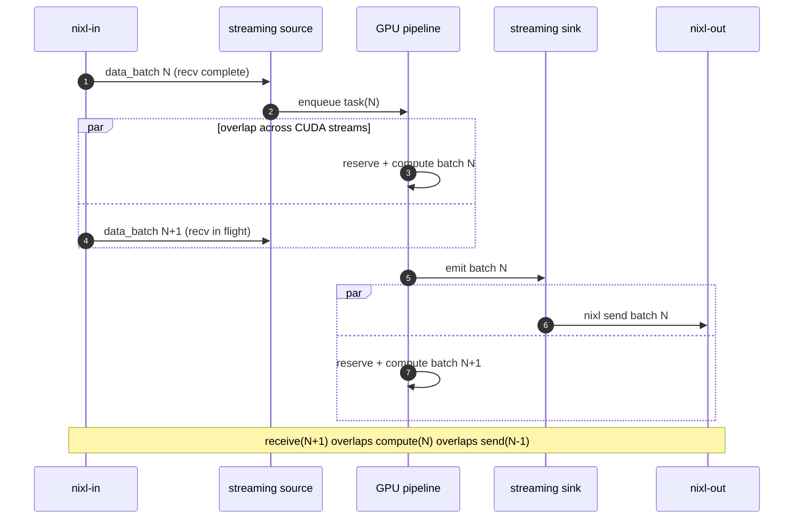

### Backpressure

The bounded channels are not just buffers — they are the flow-control mechanism, and pressure propagates
**backwards**, against the direction of data flow. The pivot is that **enqueuing to a channel is a
task-creation condition**, evaluated *before* a task is scheduled, not discovered when it runs. Sirius's task
creator only builds a task for an operator when its `get_next_task_hint()` reports `READY`
(`task_creator::get_operator_for_next_task`); the streaming sink overrides that hint so a **full output
channel reports not-ready** even with input waiting — the same shape as `CONCAT` gating on a byte threshold.
So when a downstream CN is slow and the sender's output channel fills, the task creator simply **stops
creating sink tasks** (it does not schedule one that would then block on a full channel). The repository
between compute and sink fills, and upstream backs up via the existing port barriers. The input channel drains
more slowly and fills; `push(stream_id, batch)` then blocks (or signals not-ready), so the wrapper stops
draining `nixl` receives, which throttles the upstream sender. The result is end-to-end, cross-node flow
control with a bounded in-flight working set.

Because task creation is **edge-triggered** by `schedule(op)` (there is no continuous polling), the other half
of the contract is **re-arming**: when the wrapper `pull()`s a batch and frees a channel slot, it re-schedules
the sink so the hint is re-evaluated and task creation resumes — symmetric to how a completed task
re-schedules its downstream consumers today. (A narrow race remains — the creation loop can emit more sink
tasks than free channel slots — so a sink that finds the channel full at push time must keep its result in the
repository, where it stays *idle* and spillable, and yield its worker rather than block it; that is a fallback,
not the primary mechanism.)

```mermaid
flowchart LR
  rxSlow["slow downstream CN (receiver)"]:::priorart
  outFull["output channel fills"]:::proposed
  sinkHint["sink get_next_task_hint()<br/>reports not-ready"]:::proposed
  schedThrottle["task creator stops<br/>creating sink tasks"]:::exists
  inFull["input channel fills"]:::proposed
  pushBlocks["push(stream_id) blocks / signals not-ready"]:::proposed
  nixlThrottle["wrapper stops draining nixl recv<br/>→ upstream sender backs off"]:::priorart
  rxSlow --> outFull --> sinkHint --> schedThrottle --> inFull --> pushBlocks --> nixlThrottle
  classDef exists fill:#e8f5e9,stroke:#2e7d32,stroke-width:2px,color:#1a1a1a;
  classDef proposed fill:#fff8e1,stroke:#f9a825,stroke-width:2px,stroke-dasharray:5 4,color:#1a1a1a;
  classDef priorart fill:#ede7f6,stroke:#6a1b9a,stroke-width:1.5px,stroke-dasharray:2 2,color:#1a1a1a;
```

Two things shape this. First, the **partitioned sink** (#837) gives each destination its **own** output
channel, so a single slow receiver backs up only its partition rather than head-of-line-blocking every
destination — though a persistently slow partition still eventually pressures shared input (see the §7 open
question). Second, two throttles **already exist** in the engine and compose with channel flow control: GPU
memory **reservations block** when the budget is exhausted, and the GPU executor dispatches through a
**bounded worker pool**, so compute is naturally rate-limited even before a channel fills
(reserve-before-dispatch via `make_reservation` in `gpu_pipeline_executor.cpp`).

---

## §5 Cross-node transport with nixl

`nixl` (NVIDIA Inference Xfer Library) moves registered buffers between CNs. There are three tiers: **GPU
staging** over GPUDirect RDMA (preferred); **host staging**, a *deployment/tier choice* selected when a
topology cannot or should not use GPU-backed receive staging (a configured choice, not a failure path); and
the **bRPC/CPU fallback** (the true last-resort path, below). At startup each CN creates one agent and
computes its **local metadata**
(`get_local_md`, covering its registered staging memory). The first transfer to a new peer exchanges that
agent metadata over the side-channel, and both sides **cache it per peer** (invalidated on restart) — so
later transfers skip the handshake. For each transfer the sender then exchanges **buffer** metadata over the
side-channel; the receiver leases a **pre-registered staging buffer** (GPU by default, or host when the deployment selects
host staging; bump-allocated, RAII lease) and returns destination addresses; the sender
issues the transfer and polls for completion; a `transfer_complete` handshake lets the receiver wrap the
staged bytes as a repository-registered `data_batch` and enqueue a handle on the destination stream's input
channel. A **same-CN** exchange (sink and source on this node) skips the network entirely: the batch handle
is handed off in-process between the sink's and source's channels (StarRocks' local-exchange equivalent),
with no serialization. If `nixl` is genuinely unavailable for a cross-CN transfer, it falls back to a
bRPC/CPU path.

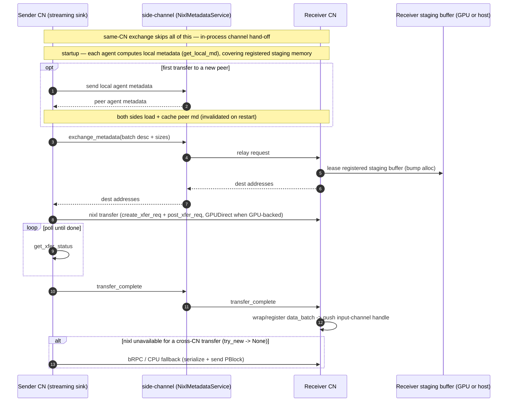

*Refs (prior art, `origin/doris`): per-CN agent + local metadata `doris/crates/doris-rpc/src/nixl_exchange.rs:8-19,303`;
peer-md cache `nixl_exchange.rs:207-208`; buffer-metadata RPC `NixlMetadataService::exchange_metadata`
`doris/crates/doris-rpc/src/nixl_service.rs:60-65`; RDMA transfer (`create_xfer_req` + `post_xfer_req` +
`get_xfer_status`) `nixl_exchange.rs:629-649`; staging buffer `gpu_staging_buffer.rs`; bRPC fallback
`nixl_exchange.rs:226-227`.*

---

## §6 Resource management — three options

The CN wrapper holds GPU memory for `nixl` staging and receive buffers; the Sirius context holds GPU memory
for compute and can spill via its downgrade executor. The two share one physical GPU, so issue #840 lists
three ways to relate their budgets. The key question for each: **can in/out exchange batches participate as
spill candidates in the same downgrade flow as compute batches?**

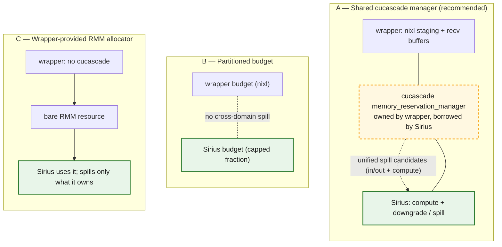

| Dimension | A: Shared cucascade mgr | B: Partitioned budget | C: Wrapper RMM allocator |
|---|---|---|---|
| Unified spill candidates (in/out batches spillable with compute) | **Yes, if** queued batches are registered repository entries — then one downgrade flow covers them (nixl staging buffers still need explicit accounting) | No — each side spills only its own (wrapper has no spill) | No — only Sirius-owned data spills; wrapper buffers invisible |
| Accounting simplicity | One budget, but borrow/lifetime + reentrancy to reason about | Simplest: two fixed budgets, no coordination | Simple for wrapper; Sirius loses cucascade reservation semantics |
| Does wrapper need cucascade? | Yes (owns the manager) | Yes, or its own scheme for its half | **No** — wrapper stays cucascade-free |
| Risk of double-count / OOM at the boundary | Low — single budget sees nixl staging + compute together | Higher — a spike on one side can't borrow from the other → premature OOM/spill | Higher — Sirius can't see wrapper buffers; nixl staging unaccounted |
| Concurrent-query / stream-sync interaction | Needs care: shared manager across queries + cross-domain stream syncs during spill | Cleanest isolation between wrapper and Sirius | Sirius keeps its model; wrapper sync is its own problem |

**Recommendation: option A (shared cucascade manager).** It is the only option that *can* make in/out
exchange batches downgrade spill candidates alongside compute, by reusing the existing downgrade executor.
Option A forces the wrapper to depend on cuCascade, which is acceptable for the StarRocks CN now; cuCascade-free
entry points (option C-style, for embedders that don't want it) can be added later for other use-cases without
changing the engine side. That reuse only covers data the executor can see: its sweep walks **registered
`shared_data_repository`** batches and spills any that are idle (it filters on `idle` state, not batch origin
— see the idle check in `convertible_data_batch_provider`; candidate sweep in
`src/downgrade/downgrade_executor.cpp`). So option A takes **two** changes, not one:

1. **Borrow the manager** — the Sirius context uses the wrapper's `cucascade::memory_reservation_manager`
   instead of constructing its own (`sirius_context::sirius_context` in `src/sirius_context.cpp`).
2. **Make exchange memory visible to it** — queued in/out batches must be held as `data_batch`es in a
   repository registered with that manager (not in opaque bounded channels), and `nixl`'s
   registered/staging GPU buffers — which are RAII leases, not repository batches, so the sweep never sees
   them — must be reserved against the same budget explicitly. Without this, a shared manager still leaves
   queued exchange data uncounted and unspillable.

This yields **two** levels of nixl-buffer accounting. The pre-registered staging arena is reserved **once**
against the cuCascade budget at startup; per-transfer sends/receives then **lease** sub-regions of that arena
with a bump allocator and make **no** further reservation (that memory is already accounted). Only the
**fallback** path needs a fresh per-transfer reservation — when the arena is full and `nixl` resorts to
`cuMemAlloc` + register for that transfer. The arena can live on **GPU or host** memory (`nixl` supports
both), so its tier is a deployment choice — host staging can be preferable on some topologies (e.g. GB/VR-class
nodes).

For an **all-to-all** exchange the scarce resource is the fixed receive-staging arena (its **leases**), not
just total GPU bytes, and a logical plan DAG does not prevent a physical lease cycle (see §7). Option A
therefore needs four further constraints:

1. **Lease-aware spill.** Generic spilling picks idle batches by memory *tier*, not by pool origin, so it
   frees GPU bytes without necessarily releasing a staging lease. Releasing a lease requires the received
   batch's GPU representation to **own** it, so that **copying the batch out of staging** (into ordinary,
   spillable memory) returns the lease to the allocator. This makes the fast-path-vs-copy-out choice
   explicit: a received batch can stay **staging-backed** (zero-copy, holds its lease until consumed or
   copied out) or be **copied out on arrival** (frees the lease immediately) — and spill must be able to
   force the copy-out.
2. **Reserved receive-staging floor.** Hold back a **non-borrowable** slice of staging (a credit budget)
   that compute can never consume, so there is always at least one receive lease available for progress.
3. **Reserved copy-out credit.** Hold back a separate **non-borrowable** ordinary-memory credit for copying a
   staging-backed batch out of receive staging. Without this, lease reclamation can still deadlock: the
   receiver may have a staging lease to reclaim, but no destination capacity to copy the batch into. The first
   implementation should prefer host/disk-backed credit, sized for one max receive batch or one chunked
   copy-out unit, so forward progress does not steal GPU memory from compute.
4. **Reserved send-copy credit.** Symmetric to the copy-out credit, on the send side. When an output batch is
   still repository-registered for spill (`use_count()>1`), feeding it to `nixl` requires a deep copy (see §7,
   "Sink → nixl ownership") and that copy needs ordinary memory. Without a reserved, non-borrowable send-copy
   credit the sink can deadlock symmetrically: it must send to free memory, but the send needs memory it
   cannot get. Size it like the copy-out credit (one max send batch, or one chunked unit).

Eviction *ordering* (MRU vs LRU) is a secondary concern — the first-order contract is that spill can reclaim
the **specific** lease progress needs, not which idle batch is chosen first.

### Spill lifecycle of an exchange batch under option A

This works **only because** the incoming batch is parked as a `data_batch` in a *registered* repository —
the `data_batch tier=GPU in input repository` node below is the precondition. A batch left in an opaque
bounded channel, or a raw `nixl` staging lease, is invisible to the sweep and would not spill (see
requirement 2 above).

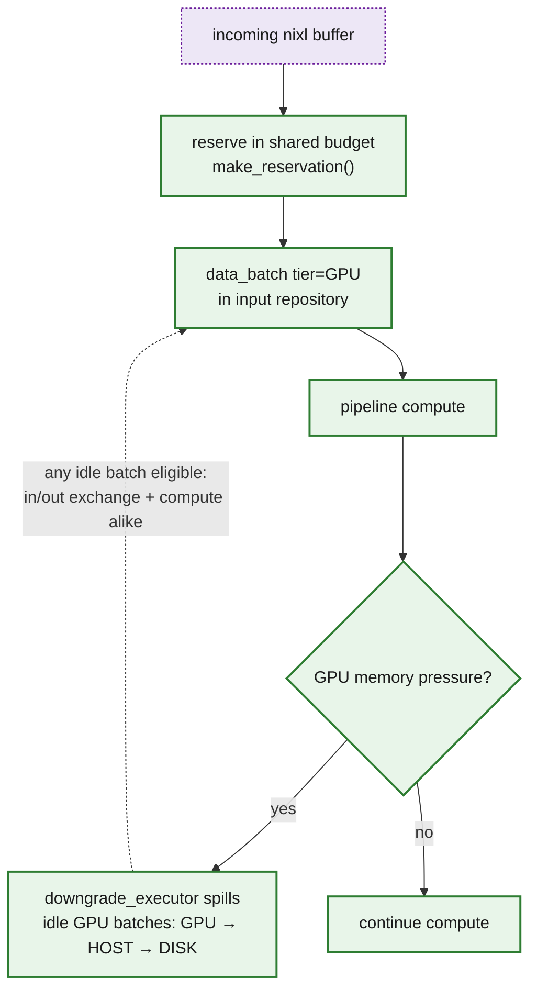

*Refs: single `memory_manager_` per context (`src/include/sirius_context.hpp`), a subclass of
`cucascade::memory::memory_reservation_manager` (`src/include/memory/sirius_memory_reservation_manager.hpp`);
reservation + downgrade trigger in `gpu_pipeline_executor.cpp`; cuDF routed through the reservation-aware
adaptor in `src/memory/sirius_memory_reservation_manager.cpp`.*

---

## §7 Open questions

- **#840 — sharing model.** Which model ships first (recommendation: A). How borrow/lifetime and
  reentrancy of a shared manager across **concurrent queries** is handled, and where cross-domain
  **stream-sync** points fall during a spill.
- **#838 — backpressure policy.** §4 describes how pressure propagates; still open: the channel bound/size,
  whether a full input channel **blocks** `push` or **spills** the queued batch, and how a persistently slow
  destination's partition is kept from starving shared input.
- **Accounting nixl buffers.** §6 covers the main case (staging arena reserved once; per-transfer leases are
  sub-allocations that skip cuCascade). Still open: accounting the **fallback** allocations
  (`cuMemAlloc` + register when the arena is full) and sizing the arena so the fallback stays rare.
- **Copy-out credit sizing.** §6 chooses a separate non-borrowable copy-out credit. Still open: whether the
  credit is sized by max receive batch, by a smaller chunked copy-out unit, or by a topology-specific profile,
  and whether HOST should always be preferred before DISK for this reserve.
- **Sink → nixl ownership.** How the sink obtains an owning `cudf::table` to feed the transfer. cuCascade
  `data_batch::release_or_copy_table()` (proposed in cuCascade PR #148; not available in the current tree)
  would do this safely at
  runtime: a zero-copy **steal** when the sink is the sole owner (`use_count()==1`), or a deep **copy** when
  the batch is still shared (broadcast to several peers, or still parked in the repository for spill). Open
  tension: keeping a batch repository-registered for spill means `use_count()>1` at send time → copy; a
  zero-copy steal requires dropping the repository ref first, giving up spill-eligibility during the
  in-flight send. The deep-copy case is what the §6 **send-copy credit** (constraint 4) reserves memory for.
  Plus the `transfer_complete` handshake that finally releases the batch.
- **Batch ownership graph.** *Settled* (§3): the channel is **not** an owner — it carries a repository
  batch-id handle, so the owning holders are the repository, the in-flight accessor, the downgrade executor
  (transiently), and the `nixl` send path. This keeps "idle ⇒ spillable" and free-on-last-drop unambiguous,
  and is what lets the sink's zero-copy steal (above) ever observe `use_count()==1`. Remaining work is to
  enforce the handle-not-`shared_ptr` discipline in the channel type itself.
- **Cross-CN completion (EOS).** §4 flags the gap: how end-of-stream is carried **across** `nixl`/bRPC (a
  terminal marker, not just a local `close_input`), and how a source learns the **sender count** from the
  plan so it finalizes only after every upstream CN has signaled done. Fan-in routing alone does not settle
  completion.
- **Order-preserving (merging) exchange.** v1 emits and coalesces out of order (§4). Open: how to support
  StarRocks' merging exchange (`ORDER BY` / top-N) — disable coalescing and add a receiver-side k-way merge,
  or keep merging exchanges on the CPU/bRPC path for now.
- **Partial-aggregate state across the exchange.** The §2 distributed-GROUP-BY shape ships `HASH_GROUP_BY`
  partial-aggregate state upstream and feeds it to `MERGE_AGGREGATE` downstream. Open (#837/#841): pin down
  that wire representation so the partial state produced upstream is exactly what the downstream merge
  consumes — the same concern applies to any partial/final split the FE plans (distinct, multi-phase agg).
- **Partition-hash parity.** §4 lists StarRocks' three regimes (fnv/xxh3 by `exchange_hash_function_version`,
  CRC32 for bucket-shuffle without bucket props, bucket-id mapping with them). Open: reproducing each
  bit-exactly on the GPU in cuDF and dispatching on partition type/version, validated against
  `test/sql/test_exchange_hash_function`.
- **Deadlock / liveness.** Two hazards. *(a) Thread/queue stalls* — every worker slot parked on a full
  output channel with none left to drain inputs, or a blocked sink pinning memory that spilling needs;
  primarily avoided by the §4 admission-control rule (no sink task is *created* while its output channel is
  full, so a worker never parks on it), with the race fallback being a sink that keeps its result *idle* in
  the repository (still spillable) and yields its worker rather than blocking it. *(b) Staging-lease cycle* —
  a logical plan DAG does **not**
  rule this out: CN A's receive-staging fills with batches from B so A stops granting leases, while B holds
  pinned output waiting to send to A (and symmetrically) → mutual wait. Per-destination channels isolate slow
  receivers at the *queue* level, but a shared budget re-couples them at the *staging* level. The fix is the
  §6 lease-aware spill + reserved receive-staging floor, plus a stall/credit **watchdog** that flags "no
  forward progress" rather than hanging silently.
- **Transport retry / fallback.** On a failed `nixl` transfer, retry once over `nixl`, then fall back to the
  bRPC/CPU path, and only fail the query if that also fails (cf. the Doris `TransferHealth` fallback after N
  consecutive failures). The retry/fallback runs on the wrapper's `nixl` send path (which has its own
  threads); the batch stays alive across attempts via the output-channel / send-in-flight reference.
