# Sirius as a StarRocks compute node: data exchange & public-API design

> **Status: design proposal.** This document explains the *proposed* public APIs for running Sirius as a
> StarRocks shared-data **compute node (CN)** — how data moves in and out of the engine while overlapping
> with computation, and how that interacts with the cuCascade memory budget and the `nixl` cross-node
> transport. It tracks issue [#826](https://github.com/sirius-db/sirius/issues/826) and its sub-issues
> [#835](https://github.com/sirius-db/sirius/issues/835)–[#841](https://github.com/sirius-db/sirius/issues/841).
> Most of the streaming surface is **not implemented yet**; this is a shared mental model to drive that work.

## How to read this document

The diagrams use a consistent legend, because some pieces exist today, some are proposed, and some are
adapted from the earlier **Doris** experiment (`origin/doris`):

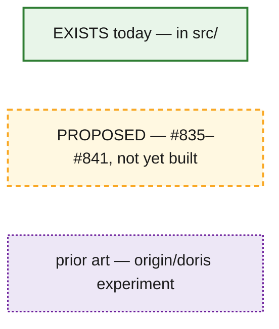

- **Solid green** = already in the Super Sirius engine (`src/`).
- **Dashed amber** = proposed in the StarRocks sub-issues.
- **Dotted purple** = prior art that exists only on the `origin/doris` branch and is being adapted.

---

## §0 Context — old vs new

The Doris experiment used a **materialize-then-shuffle** model: a Sirius fragment runs to completion, its
result is captured as a fully-materialized `ExchangeArtifact` (packed cuDF tables), Rust hash-partitions it
(`compute_dest_assignments`, CRC32), and ships it to peers over bRPC, with a `nixl` GPU-direct fast path.
Exchange cannot begin until the fragment finishes.

The StarRocks proposal replaces this with a **streaming** model: a stage accepts input batches over its
lifetime and emits output incrementally, so receiving, computing, and sending **overlap** instead of running
in sequence.

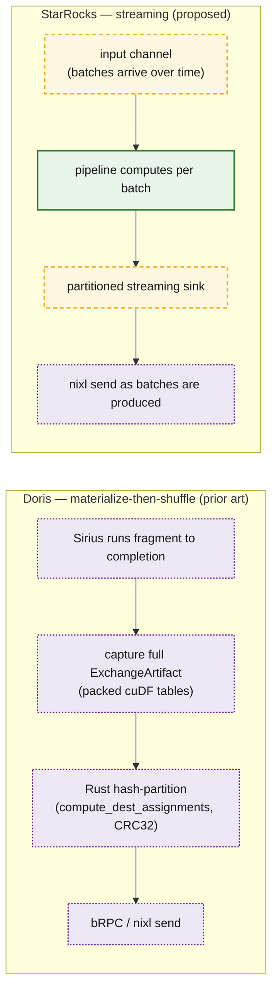

*Refs (prior art): `doris/crates/sirius-ffi/src/lib.rs:26-27,929,1006`
(`ExchangeCaptureMode::MaterializeAndCapture`, `begin_exchange_capture` / `take_exchange_artifact`),
`doris/crates/doris-rpc/src/hash_partitioner.rs:157-191` (`compute_dest_assignments`).*

---

## §1 Deployment topology

The StarRocks FE plans a query into fragments and dispatches them to compute nodes over thrift
(`exec_plan_fragment`). Each CN wraps a Sirius engine. CNs exchange intermediate data **directly GPU-to-GPU
via `nixl`**, and the FE pulls final results with `fetch_data`.

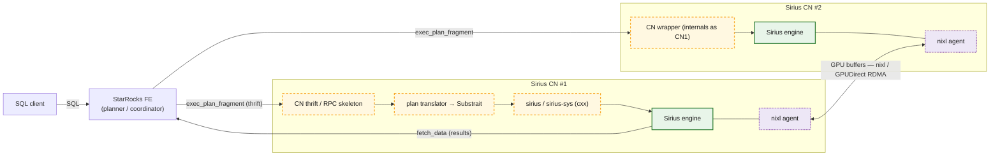

*Refs: CN RPC skeleton (PR #856); plan translator (PR #852, #841); cxx bindings (#835, PR #908); nixl
adapted from `doris/crates/doris-rpc/src/nixl_exchange.rs`.*

---

## §2 From plan fragment to streaming stages

A StarRocks `TExecPlanFragmentParams` (a flat pre-order node list) is translated to a Substrait `Plan`
(#841), which is lowered to a DuckDB plan and then to a Sirius streaming plan. The boundaries of a fragment
become a **streaming source** at the bottom and a **streaming sink** at the top. A **leaf** fragment sources
from a scan; an **intermediate** fragment sources from an exchange stream fed by an upstream fragment's sink
on another CN.

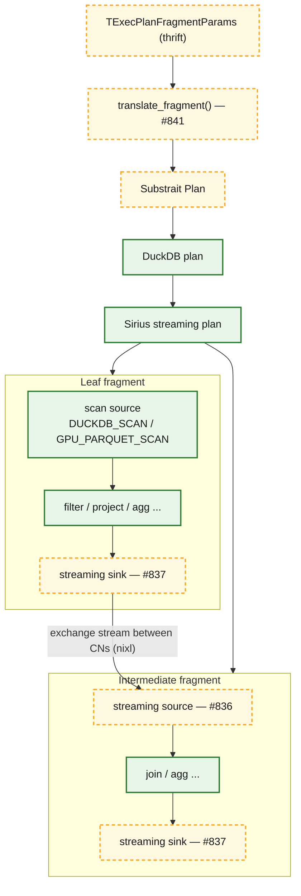

*Refs: `#841` (Substrait→DuckDB→Sirius lowering); scan operators bind a `split_connector` today; the
streaming source/sink are net-new (#836/#837).*

---

## §3 The public streaming API — stream session

The **stream session** (#839) is the public entry point. It builds a streaming plan and starts it on the
**existing** `task_scheduler` *without blocking* the caller. The wrapper feeds inputs with
`push(stream_id, batch)` and signals end-of-stream with `close_input(stream_id)`; it drains outputs with
`pull()` / `wait()`. Inputs and outputs are **bounded channels** of `shared_ptr<cucascade::data_batch>`. The
**owner of record** is the cuCascade `shared_data_repository` registered with the memory manager; a channel
carries *references* to those repository-registered batches (not bare buffers), so batches queued under
backpressure stay accounted and spillable (see §6, option A). Because a `data_batch` is a `shared_ptr`, its
GPU memory is freed only when the last holder drops it (and it is idle) — co-holders across a batch's life
are the repository, the channel, the in-flight task's `read_only`/`mutable` accessor, the downgrade executor
(transiently, while spilling), and the `nixl` send path (until the `transfer_complete` handshake). The
session routes a pushed batch to the correct streaming source **by stream id**.

The **wrapper⇄engine boundary is the channel itself** (exposed over the cxx FFI): for a source the wrapper is
the producer and the engine operator the consumer; for a sink it is reversed. The streaming source and sink
are ordinary Sirius **operators** that run as tasks on the existing scheduler/worker pool — there is **no
dedicated thread pool** for them — while `nixl`'s own threads live in the **wrapper**. So each channel is a
hand-off between wrapper threads and engine worker threads. The bounded channel is also the source's and
sink's **only** queue — the operators hold no separate internal buffer.

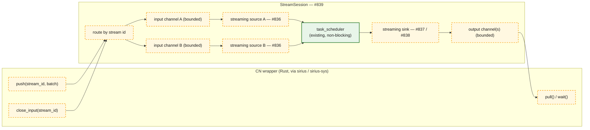

> Today, operators source data **only** from scans (bound to a `split_connector`) or a pre-materialized
> `COLUMN_DATA_SCAN`, and a query's result is fully materialized into a `ColumnDataCollection`
> (`src/op/sirius_physical_result_collector.cpp:91-213`). The stream session replaces **both** ends with
> channel-backed streaming, reusing the operator interface that already exists
> (`execute` / `sink` / `is_source` / `is_sink` / `get_next_task_hint` / `get_next_task_input_data` —
> `src/include/op/sirius_physical_operator.hpp:350,371,361,373,476,492`).

---

## §4 The data path: in → compute → out

A batch received by `nixl` lands on an input bounded channel; the streaming source publishes it into the
pipeline and drives task creation as batches arrive; the GPU executor reserves memory **before** dispatching
and runs on a per-device stream pool; the streaming sink emits results incrementally; the partitioned sink
(#838) splits partitions across **per-destination** output channels so one slow receiver cannot
head-of-line-block the others; `nixl` sends each output batch. Because partitioning fragments each batch into
many small per-destination slices, the sink **coalesces** a destination's slices (a GPU concat) up to a size
or time threshold before flushing one combined batch to its channel — otherwise we ship a flood of tiny RDMA
transfers.

The unit that flows everywhere is a `shared_ptr<cucascade::data_batch>` wrapping a `cudf::table` (GPU device
buffers), guarded by a 3-state reader/writer lock (`idle` / `read_only` / `mutable_locked`). Hand-off across
a channel is **zero-copy**: the `shared_ptr` moves, the device memory does not.

```mermaid
flowchart LR
  subgraph remote["Upstream CN(s)"]
    nixlIn["nixl recv"]:::priorart
  end
  nixlIn -->|"data_batch (zero-copy shared_ptr)"| inCh["input bounded channel"]:::proposed
  subgraph sirius["Sirius engine (this CN)"]
    direction LR
    src["streaming source — #836<br/>drives task creation"]:::proposed
    repo["shared_data_repository<br/>shared_ptr&lt;data_batch&gt;"]:::exists
    sched["task_scheduler + GPU executor<br/>reserve-before-dispatch · stream pool"]:::exists
    sink["streaming sink — #837"]:::proposed
    part["partition — #838"]:::proposed
    coal["coalesce per destination<br/>(concat to threshold)"]:::proposed
    inCh --> src --> repo --> sched --> sink --> part --> coal
  end
  coal -->|"per-destination"| outCh["output bounded channels"]:::proposed
  outCh --> nixlOut["nixl send"]:::priorart
  classDef exists fill:#e8f5e9,stroke:#2e7d32,stroke-width:2px,color:#1a1a1a;
  classDef proposed fill:#fff8e1,stroke:#f9a825,stroke-width:2px,stroke-dasharray:5 4,color:#1a1a1a;
  classDef priorart fill:#ede7f6,stroke:#6a1b9a,stroke-width:1.5px,stroke-dasharray:2 2,color:#1a1a1a;
```

*Refs: operator hints `src/include/op/sirius_physical_operator.hpp:476,492`; reserve-before-dispatch +
stream pool `src/pipeline/gpu_pipeline_executor.cpp:122,228`; data unit + lock states
`cucascade/include/cucascade/data/data_batch.hpp:49,69-267`; port barriers PIPELINE/PARTIAL/FULL
`sirius_physical_operator.hpp:51`.*

### Overlap

Because the source is multi-shot and the sink is incremental, the three stages overlap on the timeline:
while batch *N* computes, batch *N+1* is still arriving over `nixl` and batch *N−1* is being sent. The
per-device `exclusive_stream_pool` lets async copies overlap compute, and reserve-before-dispatch keeps the
in-flight working set within budget.

These two terms are about behavior over the stream's lifetime, not about how many CNs feed the stage.
*Multi-shot source*: the source operator is driven **repeatedly** — it publishes a task each time a batch
arrives on its input channel, until `close_input`, unlike today's one-shot scan that materializes its whole
input once (#836). *Incremental sink*: the sink pushes **each** output batch as it is produced, per `sink()`
call, instead of materializing the full result into a `ColumnDataCollection` first (#837). Fan-in from one
or many upstream CNs is orthogonal — it is handled by stream-id routing into the source's input channel(s).

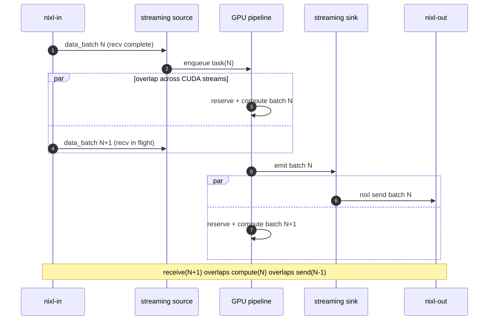

### Backpressure

The bounded channels are not just buffers — they are the flow-control mechanism, and pressure propagates
**backwards**, against the direction of data flow. When a downstream CN is slow, the sender's output channel
fills; the streaming sink — the **final operator** of its pipeline, which pulls compute results from a
`shared_data_repository` and pushes them to that channel — can no longer enqueue; because **enqueue is a
scheduling condition**, the scheduler creates no further sink tasks, the repository between compute and sink
fills, and upstream backs up via the existing port barriers. The input channel
drains more slowly and fills; `push(stream_id, batch)` then blocks (or signals not-ready), so the wrapper
stops draining `nixl` receives, which throttles the upstream sender. The result is end-to-end, cross-node
flow control with a bounded in-flight working set.

```mermaid
flowchart LR
  rxSlow["slow downstream CN (receiver)"]:::priorart
  outFull["output channel fills"]:::proposed
  sinkStall["streaming sink can't enqueue"]:::proposed
  schedThrottle["scheduler stops creating tasks<br/>for this pipeline"]:::exists
  inFull["input channel fills"]:::proposed
  pushBlocks["push(stream_id) blocks / signals not-ready"]:::proposed
  nixlThrottle["wrapper stops draining nixl recv<br/>→ upstream sender backs off"]:::priorart
  rxSlow --> outFull --> sinkStall --> schedThrottle --> inFull --> pushBlocks --> nixlThrottle
  classDef exists fill:#e8f5e9,stroke:#2e7d32,stroke-width:2px,color:#1a1a1a;
  classDef proposed fill:#fff8e1,stroke:#f9a825,stroke-width:2px,stroke-dasharray:5 4,color:#1a1a1a;
  classDef priorart fill:#ede7f6,stroke:#6a1b9a,stroke-width:1.5px,stroke-dasharray:2 2,color:#1a1a1a;
```

Two things shape this. First, the **partitioned sink** (#838) gives each destination its **own** output
channel, so a single slow receiver backs up only its partition rather than head-of-line-blocking every
destination — though a persistently slow partition still eventually pressures shared input (see the §7 open
question). Second, two throttles **already exist** in the engine and compose with channel flow control: GPU
memory **reservations block** when the budget is exhausted, and the GPU executor dispatches through a
**bounded worker pool**, so compute is naturally rate-limited even before a channel fills
(`src/pipeline/gpu_pipeline_executor.cpp:122`, reserve-before-dispatch).

---

## §5 Cross-node transport with nixl

`nixl` (NVIDIA Inference Xfer Library) moves GPU buffers directly between CNs. At startup each CN creates one
agent and computes its **local metadata** (`get_local_md`, covering its registered staging memory). The first
transfer to a new peer exchanges that agent metadata over the side-channel, and both sides **cache it per
peer** (invalidated on restart) — so later transfers skip the handshake. For each transfer the sender then
exchanges **buffer** metadata over the side-channel; the receiver leases a **pre-registered staging buffer**
(GPU or host; bump-allocated, RAII lease) and returns destination addresses; the sender issues a GPUDirect RDMA
transfer and polls for completion; a `transfer_complete` handshake lets the receiver wrap the buffer as a
`data_batch` and push it onto the destination stream's input channel. If `nixl` is unavailable (or for a
self-transfer), it falls back to a bRPC/CPU path.

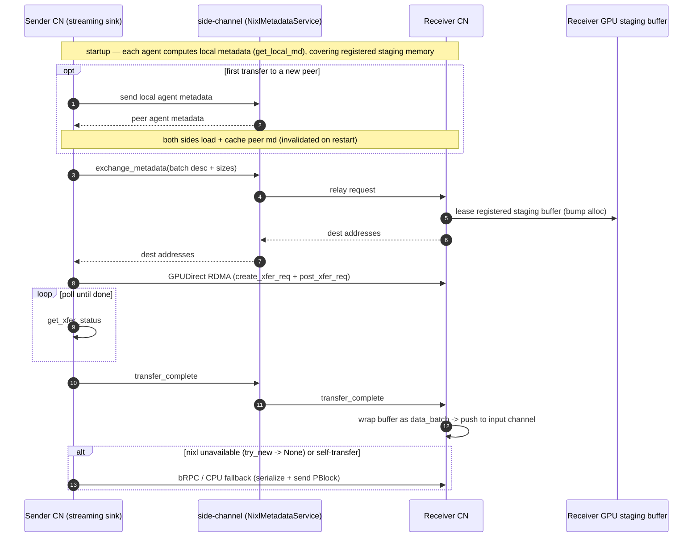

*Refs (prior art, `origin/doris`): per-CN agent + local metadata `doris/crates/doris-rpc/src/nixl_exchange.rs:8-19,303`;
peer-md cache `nixl_exchange.rs:207-208`; buffer-metadata RPC `NixlMetadataService::exchange_metadata`
`doris/crates/doris-rpc/src/nixl_service.rs:60-65`; RDMA transfer (`create_xfer_req` + `post_xfer_req` +
`get_xfer_status`) `nixl_exchange.rs:629-649`; staging buffer `gpu_staging_buffer.rs`; bRPC fallback
`nixl_exchange.rs:226-227`.*

---

## §6 Resource management — three options

The CN wrapper holds GPU memory for `nixl` staging and receive buffers; the Sirius context holds GPU memory
for compute and can spill via its downgrade executor. The two share one physical GPU, so issue #840 lists
three ways to relate their budgets. The key question for each: **can in/out exchange batches participate as
spill candidates in the same downgrade flow as compute batches?**

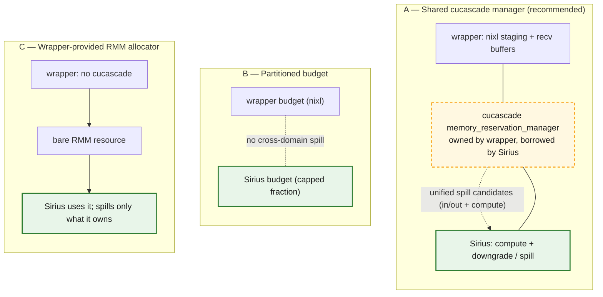

| Dimension | A: Shared cucascade mgr | B: Partitioned budget | C: Wrapper RMM allocator |
|---|---|---|---|
| Unified spill candidates (in/out batches spillable with compute) | **Yes, if** queued batches are registered repository entries — then one downgrade flow covers them (nixl staging buffers still need explicit accounting) | No — each side spills only its own (wrapper has no spill) | No — only Sirius-owned data spills; wrapper buffers invisible |
| Accounting simplicity | One budget, but borrow/lifetime + reentrancy to reason about | Simplest: two fixed budgets, no coordination | Simple for wrapper; Sirius loses cucascade reservation semantics |
| Does wrapper need cucascade? | Yes (owns the manager) | Yes, or its own scheme for its half | **No** — wrapper stays cucascade-free |
| Risk of double-count / OOM at the boundary | Low — single budget sees nixl staging + compute together | Higher — a spike on one side can't borrow from the other → premature OOM/spill | Higher — Sirius can't see wrapper buffers; nixl staging unaccounted |
| Concurrent-query / stream-sync interaction | Needs care: shared manager across queries + cross-domain stream syncs during spill | Cleanest isolation between wrapper and Sirius | Sirius keeps its model; wrapper sync is its own problem |

**Recommendation: option A (shared cucascade manager).** It is the only option that *can* make in/out
exchange batches downgrade spill candidates alongside compute, by reusing the existing downgrade executor.
But that reuse only covers data the executor can see: its sweep walks **registered `shared_data_repository`**
batches and spills any that are idle (it filters on `idle` state, not batch origin —
`src/include/data/convertible_data_batch.hpp:303`; candidate sweep
`src/downgrade/downgrade_executor.cpp:206-252`). So option A takes **two** changes, not one:

1. **Borrow the manager** — the Sirius context uses the wrapper's `cucascade::memory_reservation_manager`
   instead of constructing its own (`src/sirius_context.cpp:336`).
2. **Make exchange memory visible to it** — queued in/out batches must be held as `data_batch`es in a
   repository registered with that manager (not in opaque bounded channels), and `nixl`'s
   registered/staging GPU buffers — which are RAII leases, not repository batches, so the sweep never sees
   them — must be reserved against the same budget explicitly. Without this, a shared manager still leaves
   queued exchange data uncounted and unspillable.

This yields **two** levels of nixl-buffer accounting. The pre-registered staging arena is reserved **once**
against the cuCascade budget at startup; per-transfer sends/receives then **lease** sub-regions of that arena
with a bump allocator and make **no** further reservation (that memory is already accounted). Only the
**fallback** path needs a fresh per-transfer reservation — when the arena is full and `nixl` resorts to
`cuMemAlloc` + register for that transfer. The arena can live on **GPU or host** memory (`nixl` supports
both), so its tier is a deployment choice — host staging can be preferable on some topologies (e.g. GB/VR-class
nodes).

### Spill lifecycle of an exchange batch under option A

This works **only because** the incoming batch is parked as a `data_batch` in a *registered* repository —
the `data_batch tier=GPU in input repository` node below is the precondition. A batch left in an opaque
bounded channel, or a raw `nixl` staging lease, is invisible to the sweep and would not spill (see
requirement 2 above).

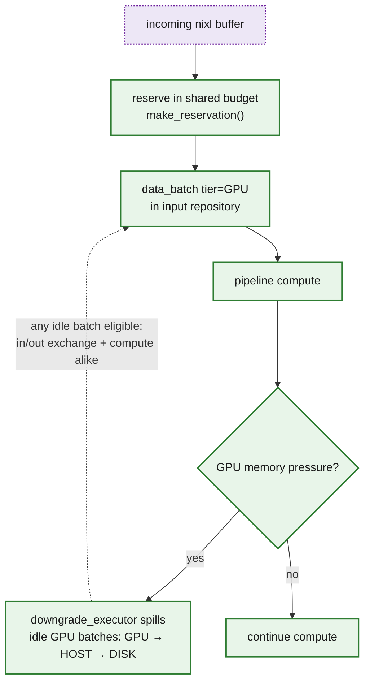

*Refs: single manager per context `src/include/sirius_context.hpp:340`, subclass of
`cucascade::memory::memory_reservation_manager` `src/include/memory/sirius_memory_reservation_manager.hpp:29`;
reservation + downgrade trigger `src/pipeline/gpu_pipeline_executor.cpp:122,132-162`; cuDF routed through the
reservation-aware adaptor `src/memory/sirius_memory_reservation_manager.cpp:42-45`.*

---

## §7 Open questions

- **#840 — sharing model.** Which model ships first (recommendation: A). How borrow/lifetime and
  reentrancy of a shared manager across **concurrent queries** is handled, and where cross-domain
  **stream-sync** points fall during a spill.
- **#838 — backpressure policy.** §4 describes how pressure propagates; still open: the channel bound/size,
  whether a full input channel **blocks** `push` or **spills** the queued batch, and how a persistently slow
  destination's partition is kept from starving shared input.
- **Accounting nixl buffers.** §6 covers the main case (staging arena reserved once; per-transfer leases are
  sub-allocations that skip cuCascade). Still open: accounting the **fallback** allocations
  (`cuMemAlloc` + register when the arena is full) and sizing the arena so the fallback stays rare.
- **Sink → nixl ownership.** How the sink obtains an owning `cudf::table` to feed the transfer. cuCascade
  `data_batch::release_or_copy_table()` (cuCascade PR #148) does this safely at
  runtime: a zero-copy **steal** when the sink is the sole owner (`use_count()==1`), or a deep **copy** when
  the batch is still shared (broadcast to several peers, or still parked in the repository for spill). Open
  tension: keeping a batch repository-registered for spill means `use_count()>1` at send time → copy; a
  zero-copy steal requires dropping the repository ref first, giving up spill-eligibility during the
  in-flight send. Plus the `transfer_complete` handshake that finally releases the batch.
- **Batch ownership graph.** Pin down whether a channel is a second, independent owner or only a handle into
  the repository (the intended model), and enumerate every holder — repository, channel, in-flight accessor,
  downgrade executor, `nixl` send — so that "idle ⇒ spillable" and free-on-last-drop are unambiguous.
- **Deadlock / liveness.** Backpressure on bounded channels plus a shared GPU budget can stall progress —
  e.g. every worker slot parked on a full output channel with none left to drain inputs, or a blocked sink
  pinning memory that spilling needs. Mitigations: the plan is a DAG (no channel cycles), a blocked sink
  should **yield its task** rather than block a worker thread, and a queued batch should sit *idle* in its
  repository (still spillable) while it waits. Even so, we likely want a stall/credit **watchdog** that flags
  "all channels full, no forward progress" so a sink (or a monitor) can surface it rather than hang silently.
- **Transport retry / fallback.** On a failed `nixl` transfer, retry once over `nixl`, then fall back to the
  bRPC/CPU path, and only fail the query if that also fails (cf. the Doris `TransferHealth` fallback after N
  consecutive failures). The retry/fallback runs on the wrapper's `nixl` send path (which has its own
  threads); the batch stays alive across attempts via the output-channel / send-in-flight reference.
