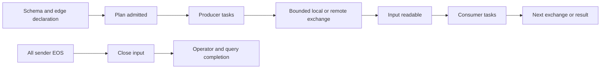

**12 · Nonblocking query-scoped fragment execution**

[All paths](README.md) · [Source review](../../../../starrocks-plan-improvement.md)

Status: proposed architectural plan. Baseline: `281b13bc`. Objective: overlap producer computation, transfer, and pipelineable consumer computation across remaining fragment boundaries. Prerequisites: [01 · Retry-safe leases and transport recovery](01-lease-lifecycle.md), [03 · Spillable exchange repositories and reload](03-exchange-spill-and-reload.md), [04 · Early ingress and bounded receive credits](04-early-ingress-and-credits.md), [06 · Fair transfer pipeline and asynchronous control](06-fair-transfer-pipeline.md), and [07 · Independent packing and CUDA completion](07-independent-gpu-packing.md). Preserve/evaluate local fusion from [11 · Measure and expand local fragment fusion](11-local-fragment-fusion.md) separately.

**Current barrier**

CN orchestration waits for complete sender sets, pushes all input, and calls a blocking run. The engine serializes `Run` and export. C++ lifecycle windows begin during fragment build and are protected by a context mutex. Existing streaming primitives do not make simultaneous calls on the current FFI fragment objects safe.

**Code map**

| Source | Work |
|---|---|
| [compute_node_service.rs](https://github.com/aocsa/sirius/blob/281b13bcb12321bac2927a8f4f996b710a463ec1/experimental/starrocks/src/compute_node_service.rs) and [local_exchange.rs](https://github.com/aocsa/sirius/blob/281b13bcb12321bac2927a8f4f996b710a463ec1/experimental/starrocks/src/local_exchange.rs) | Register fragment/edge declarations and distinguish admission, input-ready, EOS, and completion. |
| [engine.rs](https://github.com/aocsa/sirius/blob/281b13bcb12321bac2927a8f4f996b710a463ec1/experimental/starrocks/src/engine.rs) and [fragment_executor.rs](https://github.com/aocsa/sirius/blob/281b13bcb12321bac2927a8f4f996b710a463ec1/experimental/starrocks/src/fragment_executor.rs) | Replace whole-run command assumptions with query/session and progress events. |
| [sirius_ffi.cpp](https://github.com/aocsa/sirius/blob/281b13bcb12321bac2927a8f4f996b710a463ec1/src/sirius_ffi.cpp) and [sirius_ffi.hpp](https://github.com/aocsa/sirius/blob/281b13bcb12321bac2927a8f4f996b710a463ec1/src/include/sirius_ffi.hpp) | Separate plan/session lifetime from blocking execution wrappers. |
| [sirius_context.cpp](https://github.com/aocsa/sirius/blob/281b13bcb12321bac2927a8f4f996b710a463ec1/src/sirius_context.cpp#L1555) | Isolate lifecycle state; do not remove the mutex without replacing its invariants. |
| [streaming_fragment.cpp](https://github.com/aocsa/sirius/blob/281b13bcb12321bac2927a8f4f996b710a463ec1/src/exec/streaming_fragment.cpp), [stream_session.cpp](https://github.com/aocsa/sirius/blob/281b13bcb12321bac2927a8f4f996b710a463ec1/src/exec/stream_session.cpp), [batch_stream.cpp](https://github.com/aocsa/sirius/blob/281b13bcb12321bac2927a8f4f996b710a463ec1/src/exec/batch_stream.cpp) | Incremental source/sink readiness and bounded backpressure. |
| [data_repository_manager_registry.hpp](https://github.com/aocsa/sirius/blob/281b13bcb12321bac2927a8f4f996b710a463ec1/src/include/data/data_repository_manager_registry.hpp) | Query/fragment resource lifetimes and cancellation. |
| [node_translator.rs](https://github.com/aocsa/sirius/blob/281b13bcb12321bac2927a8f4f996b710a463ec1/experimental/starrocks/crates/starrocks-plan-translator/src/node_translator.rs) | Pre-arrival schema/cardinality/state declarations. |

**Architecture decision**

Prefer a query-owned execution session that coordinates fragment plans and owns their streams, resources, and cancellation. Keep connection-dependent planning on its legitimate owner. Define whether the session uses a composed engine graph or isolated fragment execution state before changing scheduling. Separate connections alone may still share context lifecycle state; verify that assumption.

Predeclare schemas, canonical names, sender sets, partial-aggregate wire types, and cardinality estimates before payload arrival. Stream/operator identifiers must be scoped by query and fragment, since FE node IDs and internal operator IDs can repeat across queries. Do not require all FE dispatch phases before starting: later phases may depend on earlier work. Admit a fully declared subgraph and add later fragments through a defined registration protocol.

The conceptual flow is:

Readability schedules pipelineable consumers. EOS closes a sender's stream; it is not the prerequisite for all consumer work. Hash-join build, global ordering, and blocking aggregates retain semantic completion conditions. Separate “temporarily empty” from EOS and failure throughout polling/pull APIs.

**Implementation slices**

1. **Execution-state inventory:** identify every reset/shared object in build, query start/end, task creation, scans, repository registration, telemetry, transactions, and result collection. Write the replacement lifetime contract and a two-fragment ownership test before enabling concurrency.
2. **Declaration/progress protocol:** add proposed begin-query/register-fragment/open-edge/submit-input/poll/cancel operations with explicit outcomes. Pre-arrival translation derives schemas from FE descriptors and state rules, not from the first data batch.
3. **Local incremental proof:** run two pipelineable fragments under one query session with a small bounded channel; prove first consumption before producer completion. Preserve the old synchronous API as a wrapper.
4. **Remote incremental proof:** connect early ingress and output providers, maintain ordered sender EOS and query-wide cancellation, and schedule work on readiness callbacks without busy polling.
5. **Blocking operators and fairness:** cover join build/probe dependencies, aggregate finalization, result EOS, multiple queries, spill/reload, and resource admission. Implement cooperative cancellation at scheduling boundaries; do not assume an arbitrary running CUDA kernel can be preempted safely.

**Cardinality policy**

Use available FE estimates before arrival, record their provenance, and retain measured counts as runtime statistics. Maintain meaningful unknown values instead of silently substituting one. Validate join build-side selection on selective versus large inputs. Only introduce adaptive replanning where the engine supports a safe boundary; changing an active hash build is not an incidental scheduler feature.

**Tests and acceptance**

Start with deterministic fake scheduling, then C++ streaming/FFI tests and two-CN SQL. Cover temporary empty input, delayed final EOS, empty senders, cancellation while readers/writers are blocked, query B retirement while A runs, tiny memory, and an unrelated query competing for the same resources.

Acceptance: first consumer progress precedes upstream EOS for pipelineable shapes; blocking operators remain correct; memory is bounded; cancellation releases resources after readers finish; progress callbacks do not schedule duplicate work. A producer must not wait for a consumer that the admission policy prevents from running.

**Benchmark and rollout**

Compare complete critical-path timelines on chain, join, and skewed fan-in workloads at equal memory limits. Report overlap, queue idle time, peak retention, spills, and query latency. Increased overlap may lose to GPU memory-bandwidth contention; retain admission limits.

Roll out to a narrow declared shape behind a query-level capability, then expand after each test gate. Fallback is selected before execution. Mid-query fallback requires explicit state transfer or full restart and cannot silently replay partially emitted results.
