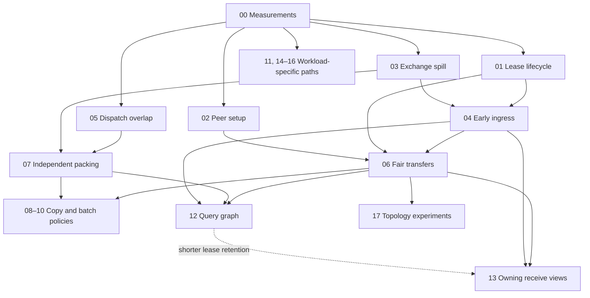

**StarRocks performance implementation paths**

Created 2026-09-05 for `demo/q1q6-integration-plus-fixes` at `281b13bcb12321bac2927a8f4f996b710a463ec1`. These 18 documents expand the [source review](https://github.com/aocsa/sirius/blob/0515ff75ad364a7c7b754b5addd154c6f2adae0b/starrocks-plan-improvement.md) into independently reviewable implementation paths. Every document is a proposal, not a report that the feature was implemented or benchmarked.

This plan set was recovered from `0515ff75ad364a7c7b754b5addd154c6f2adae0b` for implementation on the newer `all22/integration` branch. Current implementation scope, validation and measured results are recorded separately in [STATUS.md](../../../../STATUS.md) and [RESULTS.md](../../../../RESULTS.md). Historical source locations and proposed interfaces below are not a claim that every acceptance criterion has been completed.

**How to use these plans**

Start with path 00 so baseline outcomes are trustworthy. Choose subsequent work from the measured bottleneck and the dependency table. Each document provides source touchpoints, proposed ownership/interfaces, implementation slices, tests, benchmarks, acceptance criteria, and rollout or fallback rules. Proposed API/type names and configuration switches are not existing interfaces unless explicitly identified as current.

Dependencies below are prerequisites for the planned production integration, not a requirement to postpone all design or isolated experiments. Transitive prerequisites also apply. The size labels indicate relative engineering scope, not calendar estimates: S is a contained tool change, M crosses a few components, L changes ownership/operator/runtime contracts, and XL changes query execution architecture.

| Path | Symptom it addresses | Direct prerequisites | Scope |
|---|---|---|---|
| [00 · Trustworthy measurements and benchmark coverage](00-measurement-and-benchmarks.md) | Invalid or incomplete evidence | None | S–M |
| [01 · Retry-safe leases and transport recovery](01-lease-lifecycle.md) | Lost staging capacity / failed-query recovery | [00](00-measurement-and-benchmarks.md) | M |
| [02 · Nonblocking peer establishment](02-peer-establishment.md) | Cold/late-peer reciprocal waits | [00](00-measurement-and-benchmarks.md) | M |
| [03 · Spillable exchange repositories and reload](03-exchange-spill-and-reload.md) | Parked output memory pressure | [00](00-measurement-and-benchmarks.md) | L |
| [04 · Early ingress and bounded receive credits](04-early-ingress-and-credits.md) | Receive staging retained until EOS | [01](01-lease-lifecycle.md), [03](03-exchange-spill-and-reload.md) | L |
| [05 · Overlap local dispatch with remote drains](05-dispatch-drain-overlap.md) | Ready local work waits for remote drains | [00](00-measurement-and-benchmarks.md) | M |
| [06 · Fair transfer pipeline and asynchronous control](06-fair-transfer-pipeline.md) | One slow peer serializes transfer work | [01](01-lease-lifecycle.md), [02](02-peer-establishment.md), [04](04-early-ingress-and-credits.md) | L |
| [07 · Independent packing and CUDA completion](07-independent-gpu-packing.md) | Export waits behind whole engine runs | [03](03-exchange-spill-and-reload.md), [05](05-dispatch-drain-overlap.md) | L |
| [08 · Pack broadcast output once](08-broadcast-pack-reuse.md) | Broadcast clones and repeated pack work | [01](01-lease-lifecycle.md), [03](03-exchange-spill-and-reload.md), [06](06-fair-transfer-pipeline.md), [07](07-independent-gpu-packing.md) | M–L |
| [09 · Export partition views without slice copies](09-partition-view-export.md) | Hash destination slice materialization | [03](03-exchange-spill-and-reload.md), [07](07-independent-gpu-packing.md) | L |
| [10 · Small-batch batching and oversized-batch policy](10-small-batch-policy.md) | Tiny-frame overhead / oversized allocations | [01](01-lease-lifecycle.md), [04](04-early-ingress-and-credits.md), [06](06-fair-transfer-pipeline.md) | M–L |
| [11 · Measure and expand local fragment fusion](11-local-fragment-fusion.md) | Avoidable local materialization | [00](00-measurement-and-benchmarks.md) | M–L |
| [12 · Nonblocking query-scoped fragment execution](12-nonblocking-fragment-graph.md) | Producer/consumer fragment barriers | [01](01-lease-lifecycle.md), [03](03-exchange-spill-and-reload.md), [04](04-early-ingress-and-credits.md), [06](06-fair-transfer-pipeline.md), [07](07-independent-gpu-packing.md) | XL |
| [13 · Consume owning packed receive views](13-owning-packed-ingress.md) | Receive D2D copy bandwidth | [01](01-lease-lifecycle.md), [03](03-exchange-spill-and-reload.md), [04](04-early-ingress-and-credits.md), [06](06-fair-transfer-pipeline.md) | L |
| [14 · Range-aware pinning and scan balance](14-range-aware-pinning.md) | Byte-range pin misses / row-group skew | [00](00-measurement-and-benchmarks.md) | L |
| [15 · Concurrent schema reads and metadata caching](15-schema-metadata.md) | Many-file schema planning latency | [00](00-measurement-and-benchmarks.md) | M |
| [16 · Ordered exchange merge and top-K](16-ordered-exchange.md) | Full receiver sort despite sorted runs | [00](00-measurement-and-benchmarks.md) | L |
| [17 · Topology-aware transfer experiments](17-topology-aware-transport.md) | Residual topology/fabric costs | [00](00-measurement-and-benchmarks.md), [01](01-lease-lifecycle.md), [02](02-peer-establishment.md), [06](06-fair-transfer-pipeline.md) | L |

Paths 01 and 02 primarily improve reliability, recoverable capacity, and tail latency. Path 00 improves measurement validity. Their value is different from a steady-state bandwidth gain, but skipping them can invalidate or destabilize later performance work.

**Recommended sequence**

1. **Establish evidence:** correct the result/run gate and add workload coverage in path 00. Record individual failures and cold setup, rather than discarding them inside warm averages.
2. **Run low-coupling experiments:** compare the existing fusion modes in path 11 and measure schema latency in path 15. Only expand them if the relevant cost is material.
3. **Make memory/progress reliable:** implement lease ownership and peer setup (01/02), then exchange spill/reload (03) and early ingress/credits (04). These protect capacity as concurrency rises.
4. **Remove wrapper serialization:** dispatch/drain overlap (05), fair transport/control progression (06), and independent pack work (07). Path 05 can be prototyped earlier without increasing the transfer window, but it can expose export queue starvation.
5. **Reduce measured copy/control costs:** broadcast pack reuse (08), partition views (09), and small-batch policy (10). Keep each separately measurable because shared ownership and coalescing can increase retention.
6. **Change the execution architecture:** introduce the nonblocking query graph (12) and then broaden owning receive views (13). Path 13 can be prototyped earlier only with the bounded copy-out escape path; an EOS-gated receiver may erase its benefit.
7. **Pursue workload-specific options:** range-aware pins (14), schema metadata (15), and materialized ordered merge (16) can proceed independently when justified. Incremental ordered merge uses the query graph. Topology alternatives (17) come after existing wrapper costs are controlled.

**Core dependency graph**

The table is authoritative, including optional integration dependencies explained in each plan. This diagram shows the central transport/memory progression; scan, fusion, and materialized ordered-merge experiments branch from measurement.



**Shared ownership and compatibility rules**

Use one lease/epoch contract across paths 01/04/06/08/10/13/17. Do not implement several incompatible release protocols. Use one exchange repository lifetime from path 03 and one buffer-only GPU completion contract from path 07. Each later path should extend those abstractions rather than create a parallel allocator or untracked resource pool.

Keep four events distinct: producer data ready, transfer source no longer read, publication accepted by the receiver, and receive memory no longer read. A host reference count or timeout does not substitute for GPU completion. Memory budgets include actual allocation/slack and retained parents, not only logical table bytes. Any reserve inside a pool is carved out of its capacity and is not counted twice.

Negotiate changed wire semantics before admitting a query. Preserve old-peer behavior only when semantics really match; otherwise reject the unsupported optimized mode explicitly. Rollback changes new-query/new-session admission and drains existing owners. It must not reinterpret active allocations, abandon live transfer handles, or replay partially emitted query results.

**Common benchmark and acceptance contract**

Use the four layers from path 00: payload-validating raw link, production pack/control/ingest, concurrent edges with a slow participant, and representative SQL. Confirm FE/CN plans actually exercised the target shape. Include Q1/Q6 as controls and supported join/shuffle/broadcast/ordered shapes as workload-specific tests.

Record commit and binary identity, FE plan, data version, split assignment, CN/GPU/NIC placement, compute/arena/host budgets, pin hits, fusion mode, transport configuration, and peer readiness. Compare equal budgets and topology. Report startup separately from warm query latency, as well as copied bytes, throughput, retained memory, spills, failures, and post-query cleanup.

Select performance targets after the baseline establishes variance and bottleneck contribution. Do not invent a speedup percentage. A change passes its performance gate when the target mechanism and useful query outcome improve beyond measured noise, with correct results and bounded resources. Document any accepted tradeoff explicitly. A path should be deferred when its cost is negligible or its extra retention/contention offsets the gain.

The per-document acceptance scenarios are mandatory evidence for that path, not a promise that testing has already occurred. Failure injection and constrained-memory cases must retain their own expected-outcome class so they cannot be counted as successful performance samples.

**Implementation preparation and validation environment**

Before changing operators, memory, expressions, or I/O, follow the repository's `/module-context` workflow and read the relevant Super Sirius documentation. Confirm pinned cuDF/RMM/cuCascade/NIXL APIs and device-completion guarantees; the plans intentionally leave version-sensitive choices as decisions to resolve.

Useful existing entry points, executed from the repository root on a supported Linux host:

```bash
# Pure Rust CN/translator coverage; no embedded engine feature.
pixi run --manifest-path experimental/starrocks/pixi.toml -e cn --locked \
  cargo test --workspace --no-default-features --locked

# Engine-linked CN task, including its declared build dependencies.
pixi run --manifest-path experimental/starrocks/pixi.toml cn-test

# Discover C++ test tags, then select the relevant existing/new cases.
pixi run build/release/extension/sirius/test/cpp/sirius_unittest --list-tags
```

Use the test files named in each path and choose focused cases before broadening to required suites. GPU tests and query benchmarks run one process at a time on a box; builds also run one at a time. Do not blindly execute every ignored integration test as a single GPU workload.

Verify remote mirroring before building: the earlier `rdev info` in this task excluded `experimental`. A default `rdev build` can therefore fail to validate these CN sources even if the core engine builds. Resolve host/mirror with `rdev info`, ensure the intended StarRocks source and required submodule revisions are actually present remotely, and preserve generated bridge exclusions. Keep the local checkout authoritative. This plan does not change rdev configuration or start remote jobs.

**Mapping back to the review**

| Review finding | Detailed paths |
|---|---|
| Lease recovery and replay | 01 |
| Cold-peer setup | 02 |
| EOS staging retention and incomplete spill contract | 03, 04, 12, 13 |
| Dispatch, engine export, and per-destination serialization | 05, 06, 07 |
| Partition/broadcast copies and batch sizing | 08, 09, 10 |
| Existing fusion and long-term fragment scheduling | 11, 12 |
| Scan pin misses, metadata latency, ordered exchange | 14, 15, 16 |
| Benchmark validity and representative measurement | 00, with per-path experiments |
| Topology-specific alternatives from the earlier draft | 17, explicitly exploratory |

**Deliverables and historical planning status**

The implementation deliverable for each path is its listed code slices plus passing evidence, updated interface/configuration documentation, and a measured rollout decision. At the time this plan set was authored, these files contained planning only. That review reproduced four comparator false positives, but Rust/GPU tests were not run successfully on the author's macOS machine. No performance result was claimed by creating the plan set.

The original planning task changed only documentation. Its status does not describe the subsequent Linux implementation and benchmark work linked above.
