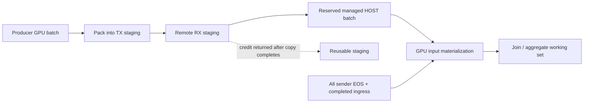

# SF1000 Q8/Q5: memory pressure, staging, and sustained throughput

Analysis of the results supplied on 2026-09-06. Local source audited at `2e0cbf51e712452e1912d5e4a453388dca96db50`, branch `perf/multi-cn-ingress-packing-transfer`. This is an analysis and proposal; no new GPU benchmarks or engine changes were performed for this document.

**The immediate bottleneck reported is GPU memory capacity. A leading hypothesis to test is retained exchange data and operator/packing temporaries competing inside a pool reduced to accommodate a fixed transport arena.** The supplied evidence does not identify Q8's exact failing allocation. Calling it specifically a join-build OOM, a leak, or a saturated network would go beyond that evidence.

**Keep bounded registered staging, but stop sizing it to fit the largest engine batch.** Size transport frames independently, manage exchange data through the existing spillable memory system, and admit computation and export against a shared memory budget. A larger arena solves a frame-size limit while potentially worsening engine OOM.

| Priority | Top idea | Expected mechanism, not a promised speedup |
|---|---|---|
| **1** | **Bound export frames and restore 84 GiB pool / 8 GiB staging.** | Transfer the approximately 2.25 GB batches without permanently taking another 8 GiB from the engine. Also bound producer batches or reload ranges where whole-parent reload is the limiting allocation. |
| **2** | **Coordinate compute, export/reload and ingress admission per GPU.** | Prevent overlapping working sets from consuming the capacity needed to drain existing data. Use GPU ingress only when a reservation proves it fits; retain HOST evacuation under pressure. |
| **3** | **Reduce materialization at Q8/Q5 exchange boundaries.** | Apply selective filters before moving the fact table, avoid large unnecessary broadcasts and carry narrower rows. Remove destination slice copies where ownership permits; reduce operator partition size if one operation still cannot fit. |

Safe session retirement remains a release requirement for sustained throughput, especially when smaller frames increase protocol records. It is not the most direct explanation of a fresh Q8 allocation failure.

**What the new measurements establish.**

The [supplied screenshot](evidence/sf1000-2026-09-06-results.png) and user notes describe SF1000 on **two separate GPUs, one CN per GPU**. The remote `arms/R-*/` logs, binary hashes and `arms/R-status20260906.md` were not found in the available local checkouts. This table transcribes the supplied evidence; it is not an independently rerun benchmark.

| Arm | Engine pool / staging per GPU | Pass + oracle match | Reported failures | Common-16 warm sum |
|---|---|---:|---|---:|
| `R-I2-2cn` | 84 / 8 GiB | 16/22 | Q5, Q8, Q9, Q17, Q18, Q21: GPU OOM | 117.0 s |
| `R-P04-2cn` | 84 / 8 GiB | 20/22 | Q8, Q9: GPU OOM | 117.9 s |
| `R-MCN16-2cn` | 76 / 16 GiB; optimized exchange, window 2 | 21/22 | Q8; notes report Q5 failed instead yesterday | 121.9 s |
| `R-SA-1gpu` | Approximately 86 GiB; no StarRocks arena reported | 22/22 | None | 101.1 s |

The reported HOST pool is 160 GiB per process. Check total node demand, actual pinned allocation and spill-disk configuration. Standalone's all-22 warm sum is **178.0 s**; do not compare it with another arm's common-16 sum as if both cover the same workload.

The supplied branch/worktree mapping is integration `all22/integration` in `sirius-wt/demo`, Path04 `perf/exchange-04-07-06` in `sirius-wt/perf`, and MCN `perf/multi-cn-ingress-packing-transfer` in `sirius-wt/mcn`. Path04's separately implemented behavior is described by the user; this audit did not inspect that remote binary. Matching a branch name is not sufficient to establish identical source or configuration.

Same-day arithmetic gives Path04 **+0.8% elapsed time** over integration, and MCN **+4.2%** over integration, **+3.4%** over Path04, and **+20.6%** over standalone on the common set. These are latency comparisons, not measured concurrent-query throughput. Completion coverage improved; increased successful queries per second under load has not been demonstrated. Two warm samples cannot establish that the sub-percent Path04 difference is significant.

MCN changes both implementation and memory layout. Its slowdown cannot be assigned entirely to copies, and its extra passing query cannot be assigned to staging alone. Standalone and one-CN passes implicate distributed planning/materialization and budgets, but do not rule out an engine bug: plans and operator states differ.

Q8 also fails in Path04 with an 84 GiB pool. The reduction to 76 GiB can aggravate capacity pressure, but cannot alone explain all reported Q8 failures. Restoring 84/8 is an experiment, not a sufficient root-cause claim or a promised fix.

Earlier local SF500 results used two CNs sharing **one GB10**. Their Q4/Q13 receiver contention is a profiling lead, not evidence that these separate-GPU CNs should be serialized. The earlier Q9/Q21 async-dispatch failures also do not identify this OOM. Freeze and record the effective `SIRIUS_CN_ASYNC_SENDER_DISPATCH` setting in every new arm rather than changing it silently in one comparison.

The reported day-wide slowdown affects standalone and scan-heavy queries too. Compare same-day arms and investigate CPU/NUMA placement, storage, memory bandwidth and interconnect separately. A warm page cache and normal GPU clocks do not exclude those causes or prove that the instance moved to another physical host.

**How staging can take capacity away from computation.**

The ordinary local arena is a separate `cudaMalloc` allocation **outside RMM accounting**; an optional fabric allocation path also exists. The engine cannot borrow idle arena bytes for ordinary operator allocations. [Arena allocation][arena].

```text
Integration / Path04: 84 GiB managed pool +  8 GiB arena = 92 GiB
MCN16:               76 GiB managed pool + 16 GiB arena = 92 GiB
Same configured total; 8 GiB less usable engine-pool capacity.
```

That is a **9.5% reduction in the configured engine pool**. Restoring 76 → 84 GiB increases it by 10.5%, but does not guarantee Q8 fits. On the reported 95.6 GiB device, 92 GiB leaves approximately 3.6 GiB nominally outside these budgets. Measure actual context/library allocations and device usage; the two configuration values do not constitute complete peak accounting.

The optimized frame limits are independently enforced by C++ packing, Rust TX admission and RX admission:

| Arena `A` | Total TX allowance | Total RX allowance | RX per-peer live limit | Maximum sender payload |
|---|---:|---:|---:|---:|
| 8 GiB | 4 GiB | 4 GiB | 2 GiB | **2 GiB − 8 MiB = 1.9921875 GiB** |
| 16 GiB | 8 GiB | 8 GiB | 4 GiB | **4 GiB − 8 MiB = 3.9921875 GiB** |

The sender requires `packed_bytes + 8 MiB <= A/4`. RX independently limits each frame and a peer's combined live payload to approximately `A/4`, with alignment. TX/RX halves are logical accounting limits over one shared arena, not physically separate free lists. [Packing cap][pack], [TX accounting][tx], [RX accounting][rx].

A roughly 2.25 GB frame exceeds the 8 GiB arena cap whether GB means decimal or binary units. **Window 1 does not change that cap.** With a 16 GiB arena, two such frames exceed the 4 GiB per-peer RX limit: window 2 can overlap stages, but does not guarantee two simultaneous receive grants for those frames.

The packer's 8 MiB chunk is a gather span, not an independently transportable frame. The entire packed table receives one lease. Export also reloads the **whole source batch before checking packed size**, and packing workspace uses the GPU memory-space allocator. Splitting only transmitted bytes does not bound source reload or packing workspace. [Reload/packing sequence][reload].

**Staging credits protect transport progress, not the entire query working set.**

Current optimized ingress physically reserves HOST capacity before granting a receive lease, copies packed GPU data into that allocation, waits for completion, and publishes a managed HOST batch. It releases staging before end-of-stream, permitting total input much larger than the arena. GPU consumers subsequently materialize HOST data onto the GPU. This is useful progress protection with a copy cost. [HOST reservation][host-reserve], [owned HOST ingress][host-ingress].



Credits do not bound parked local output, HOST-backed inputs, active GPU inputs, hash tables, partition/reorder buffers and packing temporaries together. Idle exchange batches are already registered for spilling; **enabling spilling is not the missing feature**. Active readers and operator state cannot necessarily be evicted at an arbitrary allocation point. [Repository registration][repositories], [existing reservations/downgrade](../../../../docs/super-sirius/memory-management.md).

Receivers still require all expected senders and pending ingress to finish before dispatch. Independent packing does not remove this fragment barrier. A stalled producer can retain output and delay the consumer that would release it. [Receiver readiness][eos].

Account for unique physical allocations:

```text
Device occupancy = managed GPU allocations + arena + outside-pool allocations
Managed working set = exchange data + active operator state
                    + materialization/reload + partition/pack temporaries + other state
```

Do not count a shared parent once per view, treat unused reservation commitments as physical allocations, or add staging again under packing. Current HOST evacuation reservations already own allocated buffers: count those buffers once. Track unused GPU commitments separately. A large HOST pool does not make an indivisible GPU operation fit in 76 GiB.

The Q5/Q8 failure switch is consistent with marginal or order-sensitive peaks, but is not proof of nondeterminism or leakage. Changed splits, plans, effective settings, data, residual allocations, fragmentation and overlap remain competing explanations. Capture the first failed allocation and its owners.

**Priority 1: bounded frames, followed by bounded parent reloads.**

Extend [path 10](10-small-batch-policy.md) with an export cursor over a batch's row ranges. Each frame must be a self-contained packed table with independent metadata, exact rows, sequence and ownership. Estimate a range, verify actual packed size and subdivide when needed. Preserve NULL masks, strings, nested offsets and multiplicities. Arbitrary byte fragments are not independently unpackable tables.

Negotiate receiver capacity before packing. Derive the limit from sender allocation, peer frame allowance, alignment/slack and HOST evacuation capacity. A 256 or 512 MiB target is a **screening experiment**, not a universal default. Reserve bounded predicted/actual bytes so concurrency does not depend on oversized quarter-arena slots. Preserve finite windows and independent TX/RX progress allowances.

Implement in two steps: valid bounded frames, then bounded producer batches or range-aware reload where whole-parent conversion remains too large. A small view does not help if it pins or reloads a huge parent. Current exports are created after producer completion, so changing producer batch size must not introduce a queue that waits for a drain which cannot yet run.

Acceptance requires the reported approximately 2.25 GB original batches to transfer through an 8 GiB arena without capacity exceptions, with identical values and multiplicities. Measure packing workspace and parent residency, not just lease bytes. Test size boundaries, variable-width/NULL data, zero rows, nonzero offsets, asymmetric peers, concurrent TX/RX, cancellation, duplicate publication and EOS after the final subframe. Keep the export cursor stable on capacity retry. An individually oversized row needs a defined error or a separately designed representation.

Compare split-enabled **76/16** against unsplit 76/16, then split-enabled **84/8** against split-enabled 76/16. This separates splitting overhead from returning 8 GiB to the engine. If Q8 still fails at an isolated operator allocation, investigate priorities 2/3 rather than increasing staging again.

**Priority 2: coordinate memory admission; make GPU ingress conditional.**

The engine already estimates task memory, reserves input materialization and requests downgrade on shortfall. Independent export reload uses a nonblocking reservation with transport-side retry. Add explicit reclamation/readiness that progresses even when no unrelated task will free memory. Extend the existing manager rather than introducing an untracked allocator or reserve. [Task admission][admission], [export retry][export-retry].

Admit work against resident bytes, outstanding commitments and the next dependency's working demand. Prioritize work that retires retained bytes; bound speculative reload/prefetch. Leave enough progress capacity for a next bounded export/materialization operation, including measured workspace. This capacity is carved out of the existing budget, not added above physical VRAM. Use pressure hysteresis to avoid immediately reloading the data just evacuated.

Do not impose one global compute lock across the two GPUs. Start with per-GPU limits on expensive pipeline tasks and export jobs. Whole fragment runs are already serialized per CN in this local implementation; another whole-fragment semaphore alone is unlikely to help. Pipeline tasks, packing and transport can still overlap within each CN. Measure shared HOST-memory, PCIe/root-complex, CPU and storage contention before restricting cross-CN concurrency.

| GPU-ingress condition | Action |
|---|---|
| Conservative GPU reservation fits after admitted compute and drain requirements | Copy staging into managed, spillable GPU storage; return credit only after completion and ownership publication. |
| GPU space is unavailable or would threaten progress | Use reserved HOST evacuation and return staging after the HOST copy completes. |

This can eliminate a HOST round trip, but **forcing every received batch onto GPU could worsen Q8 OOM**. Preserve physical HOST fallback before granting the lease; release unused fallback allocation only after managed ownership is established. Account for both allocations while they coexist. NVIDIA recommends minimizing unnecessary host/device transfers, but that guidance supplies no speedup estimate for this workload. [CUDA transfer guidance](https://docs.nvidia.com/cuda/cuda-c-best-practices-guide/index.html#data-transfer-between-host-and-device).

Keep control, evacuation, cancellation and admitted dependency progress runnable. A bounded queue must not block a producer whose completion is required before export or its consumer starts. Broader consumer-before-EOS execution belongs to [path 12](12-nonblocking-fragment-graph.md); preserve join-build completion and other blocking-operator semantics.

Acceptance: export/reload progresses under pressure without unrelated work finishing; failed reservations cause useful reclaim or a concrete infeasibility report; actual held bytes remain bounded. Test window 1 versus 2 at identical budgets. GPU ingress must reduce D2H/H2D bytes without increasing OOM frequency or displacing more valuable compute. Report throughput tradeoffs explicitly.

**Priority 3: avoid creating the large Q8/Q5 exchange working set.**

The remote failed plans are unavailable, so these are candidates to verify. Local SF500 Q8 provides a strong example: one receiver sees approximately **334 thousand filtered PART keys versus 1.5 billion LINEITEM rows**, after LINEITEM has already crossed an exchange. A later fragment sees approximately 10 million filtered fact rows and a full 75-million-row CUSTOMER broadcast. The local engine log also reports that dynamic filters were not wired for the PART build. This justifies inspecting corresponding remote edges, not extrapolating exact SF1000 bytes. [Local Q8 plan](../../../../results/multi-cn-throughput-ab/optimized/q08/q08/r00/q08/explain.tsv), [input log](../../../../results/multi-cn-throughput-ab/optimized/q08/cluster-001/cn0.log), [engine log](../../../../results/multi-cn-throughput-ab/optimized/q08/cluster-001/cn0-engine-log/sirius_2026-09-05.log).

For **Q8**, test selective PART-key transfer into local LINEITEM filtering before its first large shuffle. Apply REGION → customer-NATION → CUSTOMER filtering to date-restricted ORDERS before joining or broadcasting that branch. Keep customer-nation and supplier-nation roles distinct: the region predicate restricts customers, while the supplier-nation predicate determines the numerator. Preserve the actual run's constants, denominator, date endpoints, decimal semantics and multiplicities. The [stock-kit SQL](../../benchmarks/tpch/queries/q08.sql) uses AMERICA/BRAZIL; the cited local SF500 run uses MIDDLE EAST/EGYPT and a different part type. The remote SQL must be captured rather than assuming either parameter set.

For **Q5**, apply region/customer and order-year reductions before the large fact exchange where valid, preserving the supplier/customer nation equality. [Q5 SQL](../../benchmarks/tpch/queries/q05.sql). Verify runtime-filter publication, consumption and actual rows removed; an EXPLAIN filter label is insufficient. Bloom-based filtering must have no false negatives, retain the exact join, and use a filter complete for the relevant build before dropping rows.

Carry required columns only. Use compact keys or a semantically equivalent flag instead of repeated strings when valid, retaining numeric behavior. Compare actual broadcast build bytes against a memory budget and partitioned alternatives. Real FILES row counts, selectivity and distinct-value estimates should inform FE distribution choices; local runtime build-side selection cannot undo a broadcast already chosen by the FE.

The local partition implementation also creates a reordered parent then deep-copies destination slices. Prototype [path 09](09-partition-view-export.md) with spill-aware parent-backed ranges for eligible outputs. Charge the parent once, bound slow-child retention, release claims after packing completion and materialize a bounded slice when retaining its parent costs more. A view is not automatically cheaper if a delayed peer pins a multi-GiB parent. [Partition implementation][partition].

Acceptance: fewer actual fact/exchange bytes or eliminated slice-copy bytes, lower transient peaks, oracle equality and improved useful latency at equal budgets. If one isolated operator still exceeds capacity after concurrent exchange pressure is removed, inspect and improve existing partition sizing/spill, including skew handling. Streaming a probe does not make an oversized build fit. Adaptive external joins and shared budgeting of concurrent operators are useful precedents, not a drop-in GPU implementation. [Saving Private Hash Join, VLDB 2025](https://duckdb.org/library/saving-private-hash-join-vldb/).

**Which staging strategy to adopt.**

| Approach | Decision |
|---|---|
| Keep enlarging fixed staging to fit engine batches | Reject as the default: it takes compute capacity and does not bound operator state. |
| Bounded registered staging + bounded frames + managed GPU/HOST storage | Recommended near-term architecture. Size in-flight bytes from measured transfer rate and credit-return latency, then validate fairness/overlap. |
| Always evacuate to HOST | Keep as the pressure-safe reference; measure copy and shared HOST-bandwidth costs. |
| Opportunistic GPU ingress | Test under priority 2 after accounting is complete; do not enable unconditionally. |
| Consumer views directly into staging | Defer broad use. EOS-gated consumers can hold leases until the arena refills and prevent progress. Require completion-tracked readers and bounded migration/copy-out escape. [Path 13](13-owning-packed-ingress.md). |
| Direct receive into separately registered managed buffers | Longer-term prototype: validate registration/fast path, stable addresses, spill exclusion during possible WRITE, ownership and failure quiescence. Ordinary RMM allocations are not assumed equivalent to the registered arena. |
| Larger transfer window / more workers | Only when profiling shows benefit; frame count is not a byte budget. |

A sizing starting point is `in_flight_payload ≈ useful_transfer_bytes_per_second × grant_to_credit_return_seconds`, including evacuation latency. Add measured overlap/fragmentation allowance and enforce physical capacity. This is a measurement model, not a fixed-size recommendation. Reload and operator working sets need separate bounds.

**Additional ideas and the recovery requirement.**

Smaller frames make safe replay/session retirement more urgent. The current receive ledger retains completed records and rejects admission at **262,144 identities**. Splitting increases identities per query, so a capacity fix could shorten session lifetime unless retirement is addressed. The older “approximately 100 Q9 queries” estimate used SF500 counts on the GB10 and does not apply to these SF1000 arms. [Ledger limit][ledger].

Use acknowledged sequence/epoch retirement, not TTL deletion that can accept delayed messages as new. Include result-fetch lifetime, parent ownership, HOST reservations and quarantined WRITEs. A timeout is not proof that DMA stopped. Test peer restart, cancellation and a subsequent successful query in the same session. [Paths 01](01-lease-lifecycle.md) and [02](02-peer-establishment.md) remain required for safe sustained operation.

After capacity is stable, compare **two independent one-CN or standalone workers, one per GPU**, executing separate queries, against the distributed two-CN cluster. The supplied standalone arm completes SF1000 on one GPU, making inter-query parallelism a plausible throughput alternative. Measure correct completions per second under the same total hardware/workload. It has different per-query latency and result-protocol properties, and shared HOST/storage contention prevents simply doubling the standalone rate on paper.

**Experiments that identify the cause before a broad rewrite.**

Capture Q8 and Q5 on fresh clusters and after a fixed successful workload prefix. Freeze dataset hashes/schema/row counts, SQL, FE/CN/engine hashes, persisted and session FE settings, watchdog/client deadlines, GPU UUID/PCI mapping, NUMA affinity, HOST/disk limits, worker counts, fusion/dispatch flags and instrumentation. Validate actual execution on both CNs under the final successful query UUID; an FE retry on one CN is not a two-CN success.

| Evidence at the first failure | What it distinguishes |
|---|---|
| Error class, operator/fragment/batch, requested allocation and requested/granted reservation | Intrinsic operator state versus reload/pack pressure; pool OOM versus `EXPORT_CAPACITY_EXCEEDED`. |
| GPU allocated/reserved, device free/used, arena live/free/largest free block | Managed capacity versus outside-pool exhaustion or contiguous-allocation fragmentation. |
| Idle/reclaimable versus reader-held batches; parent retention; bytes actually downgraded | Nonreclaimable state versus reclamation/progress defects. |
| Per-edge actual rows, bytes, maximum frame and build bytes on each CN | Bad placement, broadcasts, skew or missing filtering. |
| D2H/H2D/D2D bytes, pack/reload spans, credit waits and peer stalls | Copy/progress cost versus compute. Overlapping spans are not additive latency. |
| Post-query owners, HOST reservations, replay count and CUDA completion | Fresh-query capacity versus cumulative retention or unsafe cleanup. |

Instrument absent counters rather than treating missing logs as zero. Capture FE `EXPLAIN COSTS`, `SIRIUS_CN_DUMP_FRAGMENTS`, CN fragment/fusion lines, engine pool allocation/peak/reschedule lines and telemetry tied to query/fragment/CN identities. Use the existing distribution analyzer where applicable. Short Nsight Systems traces can distinguish kernels, transfers and stalls; keep profiling runs separate from timing arms. Record the first failure before later retries obscure it.

Classify failures separately: **engine operator OOM**, **export reload capacity unavailable**, **frame capacity exceeded**, **HOST evacuation capacity unavailable**, **arena allocation/fragmentation**, **deployment/watchdog timeout**, **peer/protocol failure**, and **incorrect output**. An unavailable reservation that later succeeds is backpressure, not necessarily a terminal OOM. The screenshot alone cannot assign these classes to the underlying allocation sites.

Screen Q8, Q5, Q9 and fitting controls such as Q1/Q6 before full arms. The following tags are proposed experiments, not existing results or implemented options:

| Proposed arm | Settings | Comparison |
|---|---|---|
| `MCN-off8-2cn` | MCN tree, mode off, 84/8 | Current-day default path on the same tree. |
| `MCN-off16-2cn` | Same tree, mode off, 76/16 | Memory-layout change without optimized mode. |
| `MCN-on8-w2-2cn` | Same tree, mode on, 84/8, window 2; unsplit | Complete the mode × layout diagnostic. Frame-cap rejection is possible; capture it without treating a doomed full suite as useful timing work. |
| `MCN-on16-w2-2cn` | Same tree, mode on, 76/16, window 2 | Reproduce reported MCN configuration. |
| `MCN-on16-w1-2cn` | Same settings, window 1 | Overlap pressure without changing frame cap. |
| `Split-on16-w2-2cn` | Split-enabled code, 76/16, fixed bounded frame target | Splitting overhead at existing layout. |
| `Split-on8-w2-2cn` | Same code/target, 84/8 | Return 8 GiB to the managed pool. |
| `Admit-on8-2cn` | Preceding arm plus admission change only | Coordination/reclamation effect. |
| `GPUIngress-on8-2cn` | Admission reference plus conditional GPU ingress | Copy savings versus added GPU residency. |
| `PlanReduce-on8-2cn` | Stable exchange/admission reference, one plan change at a time | Actual reduction in rows/copies/working set. |

Add `I2-1cn` to separate integration's single-CN behavior from standalone planning, using a documented physically valid memory layout. The earlier reported `P04s2-1cn` used a 92 GiB pool but its staging setting was not supplied. Do not assume it also had an 8 GiB arena on a 95.6 GiB GPU, or use it as an equal-budget control.

Every full arm uses all 22 queries, one cold and two warm attempts, and oracle comparison at the established 1e-6 tolerance. Check duplicate-aware row equality and explicitly validate ordering where SQL requires it. Preserve `arms/<tag>/runs/runs.csv`, `compare.txt`, `config.txt`, plans, logs and final-UUID placement validation. Record every failure; do not exclude failed queries from coverage.

Use fresh clusters and restart after failures for performance comparisons; balance arm order. Keep raw samples because two warm attempts cannot establish p95 latency or rare-failure rates. Dedicated recovery tests must verify cleanup and the next query **before** restarting, otherwise restart masks the defect.

After a candidate passes, repeat Q5/Q8 to test boundary stability, then run a long-lived mixed workload at controlled concurrency. Report correct completions per second, failure/retry rate, queue wait, latency distribution, spills/copy bytes and recovery time. A slower isolated query can improve useful throughput by avoiding OOM/restarts, but that requires measurement. Never fill missing all-22 timings with zero or compare incomplete-suite sums.

**Evidence that would change the decision.**

| Hypothesis | Evidence that weakens it or changes the next step |
|---|---|
| Engine capacity lost to staging is decisive | Split-enabled 84/8 fails at the same intrinsic operation with similar nonreclaimable demand: investigate operator/plan working set. |
| Overlap causes the peak | Window 1 and bounded admission do not reduce held bytes or failure frequency: do not serialize additional work without another reason. |
| Failures accumulate from earlier queries | Fresh isolated attempts reproduce the first failure while cleanup returns to a stable floor. |
| Copies explain the common-set slowdown | Correlated copy/packing cost is small, or fewer copies do not improve latency beyond variance: investigate compute, scan and host contention. |
| Early filtering helps | Actual rows/bytes before the expensive exchange do not fall. A different-looking FE plan is insufficient. |
| More staging is necessary for throughput | Credit waits/link gaps are small, or bounded smaller frames retain useful bandwidth while freeing engine capacity. |

The first release target is a **repeatable 22/22 configuration with bounded memory and safe recovery**, followed by better measured throughput. Bounded frames and restored engine capacity are the immediate experiment; coordinated ownership and less unnecessary materialization are the durable changes. Neither a 16 GiB arena nor unconditional zero-copy receives substitutes for those controls.

**Source provenance.** The screenshot is preserved unchanged beside this report (SHA-256 `e56051c07f81b4be21ce6315092776ad523c7457332c230ec5dd9e0bec9823b9`). Source links below pin the locally audited revision; the remote branches/binaries must be matched before treating implementation details as proven descriptions of those runs. Historical SF500 files are linked only as leads. External CUDA guidance and the cited DuckDB paper support design principles, not quantitative predictions for this GPU stack.

[arena]: https://github.com/aocsa/sirius/blob/2e0cbf51e712452e1912d5e4a453388dca96db50/src/exec/exchange_staging_arena.cpp#L60
[pack]: https://github.com/aocsa/sirius/blob/2e0cbf51e712452e1912d5e4a453388dca96db50/src/sirius_ffi.cpp#L1176
[tx]: https://github.com/aocsa/sirius/blob/2e0cbf51e712452e1912d5e4a453388dca96db50/experimental/starrocks/src/nixl_transport/pipeline.rs#L602
[rx]: https://github.com/aocsa/sirius/blob/2e0cbf51e712452e1912d5e4a453388dca96db50/experimental/starrocks/src/exchange_protocol.rs#L162
[reload]: https://github.com/aocsa/sirius/blob/2e0cbf51e712452e1912d5e4a453388dca96db50/src/sirius_ffi.cpp#L1120
[host-reserve]: https://github.com/aocsa/sirius/blob/2e0cbf51e712452e1912d5e4a453388dca96db50/src/sirius_ffi.cpp#L545
[host-ingress]: https://github.com/aocsa/sirius/blob/2e0cbf51e712452e1912d5e4a453388dca96db50/src/sirius_ffi.cpp#L634
[repositories]: https://github.com/aocsa/sirius/blob/2e0cbf51e712452e1912d5e4a453388dca96db50/src/exec/streaming_fragment.cpp#L112
[eos]: https://github.com/aocsa/sirius/blob/2e0cbf51e712452e1912d5e4a453388dca96db50/experimental/starrocks/src/local_exchange.rs#L573
[admission]: https://github.com/aocsa/sirius/blob/2e0cbf51e712452e1912d5e4a453388dca96db50/src/pipeline/gpu_pipeline_executor.cpp#L181
[export-retry]: https://github.com/aocsa/sirius/blob/2e0cbf51e712452e1912d5e4a453388dca96db50/experimental/starrocks/src/nixl_transport/pipeline.rs#L626
[partition]: https://github.com/aocsa/sirius/blob/2e0cbf51e712452e1912d5e4a453388dca96db50/src/op/partition/gpu_partition_impl.cpp#L73
[ledger]: https://github.com/aocsa/sirius/blob/2e0cbf51e712452e1912d5e4a453388dca96db50/experimental/starrocks/src/exchange_protocol.rs#L273
