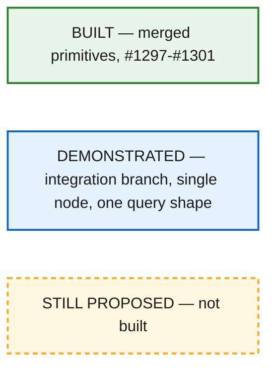
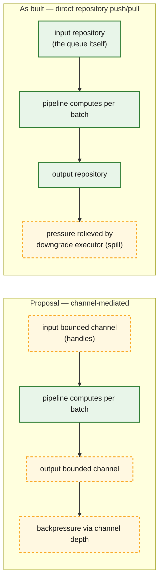
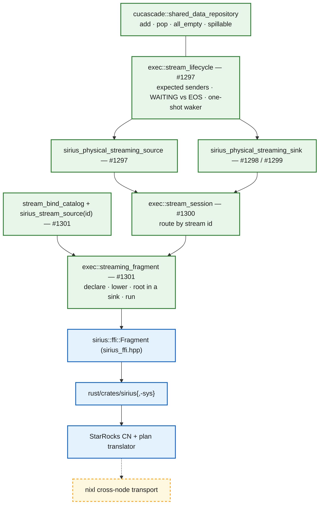
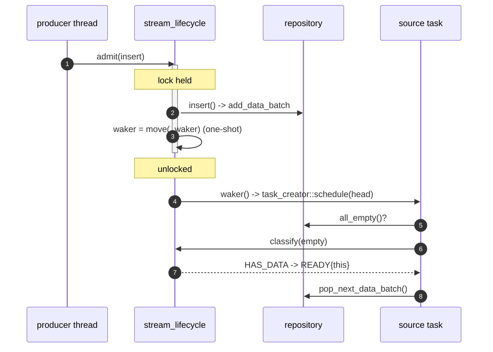
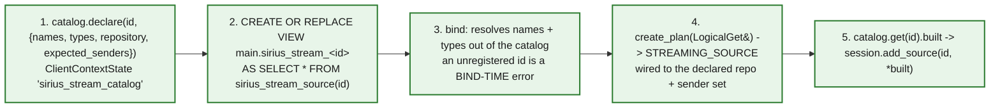
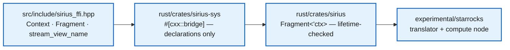

# Sirius as a StarRocks compute node: the streaming exchange, as built

> **Status: primitives implemented, single-node integration demonstrated.** This document describes the
> streaming exchange design **as it actually landed**, and where it diverges from the proposal in
> [`old-exchange-design.md`](old-exchange-design.md). It is the successor to that document: where the two
> disagree, this one is the code.
>
> Primitives: PRs [#1297](https://github.com/sirius-db/sirius/pull/1297)–[#1301](https://github.com/sirius-db/sirius/pull/1301),
> closing issues [#836](https://github.com/sirius-db/sirius/issues/836)–[#839](https://github.com/sirius-db/sirius/issues/839).
> Integration (FFI, translator, compute node) is on `demo-streaming-integration` and not yet proposed for merge.
>
> Self-contained: you do not need to have read the proposal to read this.

## How to read this document

Three states, because the gap between "written" and "proven" is the point of §9:



- **Solid green** = merged into the engine, covered by tests in the C++ suite.
- **Solid blue** = works on the integration branch, on a GPU, for the shapes listed in §9. Not productionized.
- **Dashed amber** = design only.

---

## §0 What changed from the proposal, and why

The proposal's core claim — a stage accepts input over its lifetime and emits incrementally, so receive /
compute / send overlap — is unchanged and is what got built. Five things below it changed.

| Proposal | As built | Why |
|---|---|---|
| Inputs and outputs are **bounded channels** of repository handles | **No channel.** A `cucascade::shared_data_repository` *is* the queue; producers push into it, consumers pull from it | [#1276](https://github.com/sirius-db/sirius/issues/1276). Channel depth is not a useful pressure signal — the downgrade executor is what relieves memory pressure. `exchange_channel.hpp` (280 lines) and its 528-line test are **deleted**, not ported |
| Backpressure = a full channel makes the sink's `get_next_task_hint()` report not-ready | **Out of scope.** Nothing treats queue occupancy as pressure | Follows from the above. Backpressure design is #1276's own follow-up |
| The **stream session** builds a streaming plan and starts it on the task scheduler *without blocking* | `stream_session` is a **router only**. `streaming_fragment` builds and runs, and `run()` **blocks** | Splitting them kept each reviewable. Non-blocking needs per-query lifecycle isolation in `SiriusContext` — real work, still open (§10) |
| Lowering produces streaming source/sink operators directly | A plan must be able to **name** a stream: `sirius_stream_source(id)` + a per-connection bind catalog + a `sirius_stream_<id>` view | Substrait's `ReadRel` names a `NamedTable`, and DuckDB resolves a named table through the catalog. A table-function call is not nameable, so a view is required. The proposal did not address this at all (§5) |
| The channel owns nothing; the repository is the owner of record and queued batches stay spillable | The repository holds `shared_ptr<data_batch>` directly — **but a fragment's repositories are not registered with `data_repository_manager_`, so the downgrade sweep cannot see them** | The lifetime requirement (a sender's output must survive its own `QueryEnd`) and the spillability requirement (be registered) are in direct conflict as built. **This is unresolved — see §8** |

Everything else in the proposal that is *not* contradicted here — `nixl` transport, cross-CN EOS markers,
partition-hash parity, merging exchanges, the memory-sharing options — is untouched and still accurate as a
statement of future work.



---

## §1 The layers, as built

Removing the channel left a hole. A repository can answer *"are you empty?"*; it cannot answer *"…and is
that the end?"* — and that difference is the whole problem. `exec::stream_lifecycle` is the piece written to
fill it.



| Layer | Owns | PR |
|---|---|---|
| `shared_data_repository` | batch storage (pre-existing) | — |
| `stream_lifecycle` | who is still producing · WAITING vs EOS · the waker | #1297 |
| streaming source | the bottom boundary of a fragment | #1297 |
| streaming sink | the top boundary; N destinations with `partition_spec` | #1298 / #1299 |
| `stream_session` | addressing operators by stream id | #1300 |
| `streaming_fragment` | building the plan and owning what outlives the query | #1301 |
| bind catalog + table function | letting a *plan* name a stream | #1301 |

---

## §2 `stream_lifecycle` — what the channel used to be

It holds **no repository and no batches**. Emptiness is supplied by the caller, either as a bool snapshot
(`classify`, `drained`) or as a predicate the lifecycle evaluates itself (`wait`, `arm_waker`).

```cpp
enum class availability { HAS_DATA, WAITING, END_OF_STREAM };

explicit stream_lifecycle(std::set<sender_id_t> expected);  // {0} gather · {0,1} 2-way fan-in

bool admit(const std::function<void()>& insert);   // runs YOUR repository insert under THIS lock
void mark_sender_done(sender_id_t sender);         // idempotent; throws on an unexpected id

availability classify(bool repo_empty) const;      // data always wins over terminal
bool         drained(bool repo_empty) const;       // all senders closed AND empty
void         wait(const std::function<bool()>& repo_empty);   // external threads only

bool arm_waker(std::function<void()> waker, const std::function<bool()>& arm_if);
void set_on_end_of_stream(std::function<void()> hook);        // late registration fires immediately
```

Three responsibilities, each of which the repository cannot discharge:

1. **Sender-aware end-of-stream.** A fan-in stream ends only once *every* expected sender has closed, so
   closes dedup by **identity**, not by count — `_closed` is a `std::set`, and two closes from sender 0 must
   never stand in for senders `{0, 1}`. An empty expected set is terminal from construction, which is the
   legitimate degenerate case of a stream nobody will ever produce into.
2. **WAITING vs END_OF_STREAM.** The scheduler needs "nothing right now, come back" to be distinguishable
   from "never again". Getting it wrong in either direction is a hang or a truncated result.
3. **A one-shot waker.** A pipeline head that answers WAITING is dropped by the task creator, and the only
   built-in re-nomination is task completion — which a starved stream-fed source never sees.

### The locking contract

`admit()` runs the *caller's* repository insert inside the lifecycle lock. That is the load-bearing choice:

- a close cannot interleave with an insert, so **no batch lands after end-of-stream**;
- the batch is registered in the repository **before** any waker can observe it;
- the waker is moved out and fired **after** unlocking, so the callback may re-enter the endpoint.

`arm_waker` evaluates its "am I really starved?" predicate **under the same lock as the arming**, which
closes the lost-wake race: either the predicate sees the batch a concurrent push just admitted, or that push
has not happened yet and will fire the waker being installed.

> **Correction to the header comment.** `stream_lifecycle.hpp` currently states that the lifecycle lock and
> the repository lock "are never held together and cannot invert." That is not what the code does:
> `wait()` and `arm_waker()` both invoke a caller-supplied predicate **while holding** `_mutex`, and in every
> production call site that predicate takes the repository lock
> (`sirius_physical_streaming_source.cpp:96`, `sirius_physical_streaming_sink.cpp:186`).
> The property that actually holds — and that the code does obey everywhere — is a **consistent lock
> ordering: lifecycle → repository, never the reverse.** The comment should say that instead, because a
> maintainer who trusts the stronger claim could add a repository→lifecycle path and deadlock.



*Refs: `src/include/exec/stream_lifecycle.hpp`, `src/exec/stream_lifecycle.cpp` (122 lines).*

---

## §3 The two operators

Both are ordinary `sirius_physical_operator` subclasses running inside normal `gpu_pipeline_task`s on the
existing executor — as the proposal intended. There is no dedicated thread pool.

### Streaming source (#1297)

```cpp
bool push(batch)      { return _lifecycle.admit([&]{ _input_repository->add_data_batch(batch); }); }
bool all_ports_empty(){ return _lifecycle.drained(_input_repository->all_empty()); }

std::optional<task_creation_hint> get_next_task_hint() {
  switch (_lifecycle.classify(_input_repository->all_empty())) {
    case END_OF_STREAM: return std::nullopt;          // never nominate again
    case HAS_DATA:      return {READY, this};
    case WAITING:       break;
  }
  if (_waker && !_lifecycle.arm_waker(_waker, [this]{ return …->all_empty(); }))
    return {READY, this};                             // a push raced us — we are ready
  return {WAITING_FOR_INPUT_DATA, nullptr};
}
```

`set_pipeline()` wires the two engine-facing hooks, both fired on a **producer** thread and both
weak-capturing the pipeline: end-of-stream → `update_pipeline_status(false)` (so a stream that ends with no
task in flight still finishes the pipeline *and* re-arms downstream consumers), and the waker →
`task_creator::schedule(head)`.

**One line makes it reachable at all.** `src/planner/query.cpp` registers `STREAMING_SOURCE` as a schedulable
query kickoff alongside `GPU_SCAN` and `GPU_VALUES`. A receiver fragment contains no scan, so without it
`get_scan_operators()` comes back empty and `start_query()` throws `"query has no schedulable scan sources"`
before a single task runs.

### Streaming sink (#1298), and its partitioned form (#1299)

Batches are pushed into the output repository **in whatever memory tier they currently occupy** — no Arrow,
no forced GPU upgrade, no copy. Three requirements are non-obvious and each was a real defect before it was
fixed:

- **`execute()` must be overridden** as a pass-through. The executor runs every operator in the chain,
  terminal sink included, and feeds the chain's result back into `sink()`. The base implementation returns an
  empty list, so without the override the sink discards the pipeline's data *and receives that emptiness
  back* — the query reports SUCCESS with an empty output.
- **`build_pipelines()` must append the sink to `current`** before descending into its child (the same shape
  `RESULT_COLLECTOR` uses), so the terminal operator lands in `operators[0]` and end-of-stream can fire. The
  base sink path skips the append, leaving the source with nothing driving it.
- **`is_query_terminal()` must cover `STREAMING_SINK`**, or a sink-rooted plan runs to completion and then
  blocks on its future forever.

`on_finalize_operator()` calls `mark_sender_done(PIPELINE_SENDER = 0)`: the pipeline is the stream's single
expected sender, so its completion *is* end-of-stream.

The partitioned form takes N repositories and a `partition_spec { key_columns, key_cast_types }`, runs the
**same `hash_partition` kernel the `PARTITION` operator already uses**, and routes slice *i* to repository
*i*. Empty slices are skipped rather than published as zero-row batches. All output streams share one
lifecycle — the pipeline feeds all of them, so they go terminal together — but `drained(i)` and `wait(i)` AND
that shared flag with *that stream's own* emptiness, so a destination with a backlog is still distinguishable
from a finished one.

> Both operators report `stats.bytes` from `no_history_peak_memory_estimate` rather than the default 2×
> heuristic. A single-destination push allocates nothing; a partitioned one rewrites the input into slices,
> roughly one input's worth. Neither warrants 2×.

*Refs: `src/{include/,}op/sirius_physical_streaming_{source,sink}.{hpp,cpp}`; `src/planner/query.cpp`;
`src/pipeline/{sirius_pipeline,gpu_pipeline_executor,sirius_pipeline_converter}.cpp`.*

---

## §4 Addressing and construction

The proposal folded these into one "stream session". They are two objects, because they do unrelated jobs.

### `stream_session` (#1300) — a router

```cpp
void add_source(stream_id_t id, streaming_source& source);        // build time only
void add_sink(std::vector<stream_id_t> ids, streaming_sink& sink); // ids[i] <-> partition i

push(id, batch) · close_input(id, sender)     // INPUT ids
pull(id) · wait(id) · drained(id)             // OUTPUT ids — a separate namespace
```

Three properties worth knowing before you use it:

- **Ids are direction-separated.** Input id 7 and output id 7 are unrelated. Nothing inside the engine pairs
  a sender's output id with a receiver's input id — that routing table belongs to the wrapper, built from the
  front end's plan.
- **It does not own the operators it routes to.** A plan tree owns its children as `duckdb::unique_ptr`, so
  an operator inside a plan can never be handed out as an owning pointer; the original owning signature was
  *unrepresentable*, not merely inefficient. Whatever owns the plan must outlive the session.
- **An unknown id throws.** Not a silent drop — in a subsystem whose signature failure is "succeeded,
  returned nothing", a mis-addressed `push` that vanishes is the worst available behaviour.

### `streaming_fragment` (#1301) — the builder

```cpp
struct fragment_spec {
  logical_plan_source                     plan_source;   // Substrait bytes, or SQL in a test
  std::map<stream_id_t, stream_input_spec> inputs;       // one per exchange input
  std::vector<stream_id_t>                outputs;       // outputs[i] <-> partition i
  std::optional<op::partition_spec>       partitioning;  // absent = gather
};
```

`build()` declares every input on the bind catalog, lowers the plan, wraps it in a `STREAMING_SINK`
(`sink->children.push_back(subtree)` — a normal unary operator, unlike `RESULT_COLLECTOR`), hands the tree to
the engine via `initialize()`, and registers both ends with its session. A declared input the plan never
reads is an error, not a warning: ignoring it would leave that stream's senders with nowhere to push and the
fragment waiting on something nothing drains.

### Two lifetime rules that are easy to get wrong

**Rule 1 — the repositories must outlive the query.** They are created in the constructor as plain
`shared_ptr`s and **never registered with `data_repository_manager_`**, so `QueryEnd()`'s
`clear_all_repositories()` cannot destroy them. *A sender's output therefore survives its own fragment and is
still there when the receiver runs.* This is the single fact that makes a sequential relay possible — and it
is also the source of the spillability problem in §8.

Member declaration order is the contract, since members destroy in reverse: repositories → interface →
engine (which owns the plan) → session (which only borrows).

**Rule 2 — the query lifecycle belongs to the caller.** `build()` and `run()` must be bracketed together in
**one** `QueryBeginStandalone` / `QueryEnd` pair.

- A lifecycle opened *between* them resets the task creator and scan manager that `build()` populated; the
  fragment then runs zero tasks and returns an empty output **with no error**.
- Failing to *close* it is worse. `QueryBeginStandalone` takes a plain non-recursive `std::mutex` that
  `QueryEnd` releases and every later statement re-takes on the same thread — with no log line and ~0 % CPU,
  because the `QueryBegin` log call sits *after* the lock. The same deadlock fires from a `catch (...)`
  rollback, so **a failing assertion presents as a hung test**. C++ tests use an RAII guard;
  `ffi::Fragment` closes the lifecycle from its destructor for exactly this reason.

---

## §5 How a plan expresses a stream read

Not addressed in the proposal, and it turned out to be required. A stream has no file to probe, so its schema
must be **declared**; but a DuckDB table-function bind runs long before physical planning and has no route
back to the fragment being built — only a `ClientContext`.



Why a view: Substrait's `ReadRel` can name a `NamedTable`, and DuckDB's Substrait reader resolves a named
table through the catalog — but a table-*function* call is not nameable. The view makes it one. The front end
therefore emits `NamedTable(["sirius_stream_7"])` exactly where it would otherwise have emitted a
`local_files` parquet read.

`sirius::ffi::stream_view_name(id)` is the **single definition** of that convention, read by both languages,
so the name the front end emits and the view the engine creates cannot drift apart.

Two constraints that bite if reordered or forgotten:

- **Ordering inside `build`:** BeginTransaction → parse type names and create the views → `QueryBeginStandalone`
  → plan. Parsing a type name needs a transaction; creating a view is an ordinary statement and an ordinary
  statement takes the query-lifecycle mutex (so both must precede `QueryBeginStandalone`); and DuckDB binds a
  view's body **at CREATE time**, which resolves the schema out of the bind catalog — so the stream must be
  declared before its view is created.
- **Registration must be idempotent** (`OnCreateConflict::IGNORE_ON_CONFLICT`). The extension callback
  registers Sirius functions on *every* DuckDB instance in the process, so an explicit registration would
  otherwise throw `ENTRY_ALREADY_EXISTS`.

The function's *execution* callback throws unconditionally. There is deliberately no CPU fallback: a stream's
batches only exist on the GPU side of the fragment.

---

## §6 The public API surface

The primitives are engine-internal C++; the compute node is a Rust process. Between them sits a small public
header that pulls in **no DuckDB, cudf or rmm types** (both classes are PIMPL), which is why the bindings
crate compiles without a Sirius build tree in scope.



```cpp
class Fragment {                                   // strictly ordered: declare -> build -> relay -> run -> drain
  void   declare_input_column(uint64 stream_id, const string& name, const string& type);
  void   declare_input_sender(uint64 stream_id, uint32 sender_id);   // none declared => single sender 0
  void   declare_output(uint64 stream_id);         // NO output stream => this is a RESULT fragment
  void   build(const string& substrait_plan);
  size_t relay_from(Fragment& source, uint64 src_stream, uint64 in_stream, uint32 sender_id);
  void   run();
  void   result_to_arrow(uintptr_t out_stream_addr);
  size_t output_batch_count(uint64 stream_id) const;   // diagnostics: did the boundary carry anything?
};
```

`declare_output` is the whole path selector: a fragment with an output stream is **intermediate** (rooted in a
streaming sink, its results parked as native batches that outlive its own query); a fragment with none is a
**result** fragment and produces Arrow.

`relay_from` is the fragment boundary, and it is four lines:

```cpp
while (auto batch = source.session().pull(source_stream_id))
  if (!session().push(input_stream_id, *batch)) throw …;
session().close_input(input_stream_id, sender_id);
```

Two things the Rust layer adds that C++ cannot express:

- `Fragment<'ctx>` borrows the context, so **the compiler enforces "a fragment must not outlive the engine
  it runs on"** — the C++ header can only document it. The compute node relies on this: its parked-fragment
  map is declared *after* the context so it drops first.
- `into_arrow()` drains the C stream into **owned** `RecordBatch`es whose buffers carry their own Arrow
  release callbacks, independent of the context — which is what makes them safe to send off the engine thread.

Every fallible C++ method is bound as `Result`, so a C++ exception becomes `Err(cxx::Exception)` rather than
an abort. Only the two Arrow-address methods are `unsafe`.

*Refs: `src/include/sirius_ffi.hpp`, `src/sirius_ffi.cpp`, `rust/crates/sirius-sys/src/lib.rs`,
`rust/crates/sirius/src/lib.rs`.*

---

## §7 A fragment boundary, concretely

TPC-H Q6 with `SET new_planner_agg_stage = 1`, one compute node. The FE emits a scan/filter/project **sender**
and an aggregate **receiver** joined by a gather exchange whose `node_id` is **2** — and that number becomes
the engine-side stream id, the view name and the log line, with no allocation table in between.

```mermaid
sequenceDiagram
  autonumber
  participant CN as Rust compute node
  participant F1 as Fragment 1 (sender)
  participant F2 as Fragment 2 (receiver)
  Note over CN: FE dispatches the RECEIVER first — it has an EXCHANGE_NODE, so it is deferred, not run
  CN->>F1: declare_output(0) · build()
  Note over F1: plan rooted in STREAMING_SINK; repository created OUTSIDE the manager
  CN->>F1: run()
  Note over F1: execute() -> sink() -> admit() -> output repo 0<br/>on_finalize_operator() -> mark_sender_done(0) -> EOS
  F1-->>CN: returns ZERO rows — its output parked instead
  Note over CN,F1: QueryEnd() -> clear_all_repositories() runs and MISSES repo 0.<br/>The whole Fragment is parked in a HashMap keyed by SenderSlot.
  CN->>F2: declare_input_column(2,"col_17","DOUBLE") · declare_input_sender(2,0) · build()
  Note over F2: CREATE VIEW sirius_stream_2 -> leaf = STREAMING_SOURCE(2), expected {0}
  F2->>F1: relay_from(F1, out 0 -> in 2, sender 0)
  F1-->>F2: pull() x N -> push() x N — native handles, no Arrow, no file
  Note over F2: close_input(2, 0) -> stream 2 terminal
  CN->>F2: run()
  Note over F2: READY -> one task per batch -> sum -> EOS -> nullopt
  F2-->>CN: Arrow: revenue
```

The translator lowers the `EXCHANGE_NODE` to `ReadType::NamedTable(["sirius_stream_2"])` — **not**
`LocalFiles` — and records the schema on the plan as `StreamInputSchema`, because the engine has no file to
infer it from. The compute node logs one line per crossing:

```
relayed native batches across a fragment boundary stream_id=2 sender_id=0 batches=1
```

Read the number, not just the line: `batches=0` would mean the boundary carried nothing and the answer came
from somewhere else. `batches=1` here because batch granularity is **per split** and a whole-file parquet
scan is one split; a multi-batch stream is covered by test `FRAG-5` and changes nothing about the relay,
which is a `while` loop.

**What crosses the thread boundary.** `SiriusContext` is `!Send`/`!Sync`, so it lives on one dedicated thread
and Rust talks to it over channels carrying **owned data only**: Substrait bytes in, slot keys and Arrow
batches out. The `sirius::Fragment`s never leave that thread — which is why a sender fragment is *parked
whole* rather than having its batches extracted. The rows never leave the device between fragments.

---

## §8 Memory and backpressure, as built

The proposal's §6 recommended **option A** (a shared cuCascade manager) with two prerequisites: borrow the
manager, and make exchange memory visible to it by holding queued batches in a **registered** repository.
Neither has been done, because nothing yet allocates outside the engine — there is no wrapper-side `nixl`
staging arena to share a budget with. That part of the proposal is intact as future work.

What *did* land is the first half: queued batches are `data_batch`es in a repository rather than opaque
channel entries. But there is a gap, and it should be fixed before anyone relies on the current wording.

> ### Unresolved: parked streaming batches are not spill candidates
>
> The commit messages and operator headers state that batches parked in a streaming repository stay
> "spillable by the downgrade executor until a task claims one." **As built, they are not.**
>
> The downgrade executor's candidate sweep enumerates `_data_repo_mgr.get_repositories()`
> (`src/downgrade/downgrade_executor.cpp:209`) — that is, only repositories **registered with
> `data_repository_manager_`**. Its only other tier is the task-scheduler queue. But `streaming_fragment`
> deliberately creates its input and output repositories **outside** the manager (`streaming_fragment.cpp:62`)
> precisely so that `QueryEnd()`'s `clear_all_repositories()` cannot destroy them.
>
> So the two requirements are in direct conflict as currently built:
>
> | Requirement | Needs |
> |---|---|
> | A sender's output survives its own `QueryEnd` (§4 rule 1) | **not** registered with the manager |
> | Parked batches are downgrade candidates | **registered** with the manager |
>
> Consequences today are bounded — a demo boundary carries one batch, and the engine is sequential — but they
> grow with everything on the roadmap: a fan-in receiver holding N senders' output, a partitioned sink holding
> N destinations' backlog, and any concurrent-query shape. A sender's parked output pins GPU memory that
> nothing can reclaim.
>
> Two directions worth discussing before either is built:
>
> 1. **Registration with query-scoped exemption** — register the repositories so the sweep sees them, and give
>    `clear_all_repositories()` a way to skip entries whose owner outlives the query (an explicit lifetime tag
>    rather than absence from the map).
> 2. **A second enumeration root** — leave ownership as-is and give the downgrade executor a registry of
>    live streaming repositories to sweep as an additional tier.
>
> The first keeps one mechanism; the second keeps the current lifetime story untouched. Either way, the
> commit-message and header claims should be corrected to match whatever ships.

**Backpressure is out of scope by decision, not by omission.** With no channel there is no depth to gate on,
and the sink deliberately arms no waker — its consumer is an external thread blocking in `wait()`, not an
engine task that needs re-nominating. Two throttles that already exist still apply: GPU memory reservations
block when the budget is exhausted, and the executor dispatches through a bounded worker pool. Designing real
flow control is #1276's follow-up, and the honest statement today is that a fast producer with a slow
consumer will grow the repository without bound.

---

## §9 What is demonstrated, and what is not

| Claim | Evidence |
|---|---|
| A plan can express a stream read | `sirius_stream_source(0)` binds names + types with no file, no catalog entry, no rows |
| A plan can be rooted in a `STREAMING_SINK` | `SINKROOT-1..4`, incl. the sink reaching `operators[0]` so EOS fires |
| A fragment's output survives its own `QueryEnd` | `FRAG-1` |
| Two fragments chain by stream id, values intact | `FRAG-2` — receiver emits exactly `{1,2,3,4,5}`, not a matching count |
| A real parquet scan crosses the hop | `FRAG-4` — 12 019 rows over all five row groups, every row relayed |
| A multi-batch stream drains completely | `FRAG-5` — 2 batches → 2 tasks → `{1,2,3,4,5,6}` |
| The waker re-nominates a starved source | `REARM-1..3` — WAITING hint, push, assert the task creator scheduled the head; one-shot, then re-arms |
| A fan-in stream does not end on a duplicate close | `SRC-24` |
| A concurrent producer works | `SRC-20` (producer thread + consumer loop), `SRC-21` (concurrent pulls deliver each batch once) |
| It works through the compute node on a real GPU | `engine_executes_local_files_and_sequential_exchange` — sender parks (asserting **no** rows), receiver relays, all rows arrive |
| An exchange lowers to a stream read, not a file | `bound_exchange_feeds_aggregate_from_a_stream` — `NamedTable`, no `local_files` |
| TPC-H Q6 on the cluster over native batches | `61567694.95019999` (DuckDB on CPU: `61567694.9502`), with the temp-parquet relay deleted and nothing written to disk |
| No regression | full suite: 2173 cases, 2172 passed, 1 skipped, 0 failures |

**Not working, or not yet built:**

- **No live producer at fragment level.** Every fragment test, and the compute node itself, pre-fills and
  closes a stream *before* the receiver runs. The waker is covered at operator level (`REARM-1..3`, with a
  recording task creator) but has never fired under a **running engine** with a concurrent producer. Highest-value
  remaining engine test.
- **Sequential only.** The engine serializes queries and `build`/`run` hold one query lifecycle, so a sender
  completes before its receiver starts. Per-query lifecycle isolation in `SiriusContext` is the blocker.
- **One destination per sender.** A second is *refused with an error*, not silently under-delivered. Fan-out
  needs #1299 wired end to end.
- **Fan-in untested at fragment level.** Covered in unit tests; `FRAG-5` uses two senders but one sender id.
- **No shuffle**, blocked on two-phase aggregation in the translator — and separately on the compute node
  never reading `TDataStreamSink.output_partition`, and on the sender broadcasting a clone to every destination.
- **No partition-hash parity.** The sink uses any consistent hash, which is sufficient for an all-Sirius
  `HASH_PARTITIONED` shuffle but **not** for bucket-shuffle or mixed Sirius/native-BE exchanges. The
  proposal's three-regime analysis (fnv/xxh3 by `exchange_hash_function_version`, CRC32 for bucket-shuffle,
  bucket-id mapping) is untouched work.
- **No `nixl`, no cross-node anything.** Single process, in-memory handoff.
- **No duckdb-native table scan from a directly-driven fragment** — it plans and runs but produces no batches;
  the transparent path does ingestion setup a direct fragment does not.

---

## §10 Open questions

### Settled or moot since the proposal

| Proposal question | Status |
|---|---|
| **Batch ownership graph** — enforce handle-not-`shared_ptr` in the channel type | **Moot.** There is no channel. The repository holds `shared_ptr<data_batch>` directly |
| **#838 backpressure policy** — channel bound, block-vs-spill on a full input channel | **Moot as posed.** No channel, no bound. The underlying question (what happens when a consumer is slower than a producer) is reopened in §8 |
| **Cross-CN completion (EOS)** — sender counts | **Half-settled.** The engine has sender-set semantics (`expected_senders`, identity-based dedup, `close_input(id, sender)`). Carrying a terminal marker *across* a network is still entirely the wrapper's, and unbuilt |

### Still open, unchanged

- **#840 sharing model** — which memory-sharing option ships; borrow/lifetime and reentrancy of a shared
  manager across concurrent queries; where cross-domain stream syncs fall during a spill.
- **`nixl` buffer accounting** — staging-arena reservation, fallback allocations, arena sizing.
- **Lease-aware spill, receive-staging floor, copy-out and send-copy credits** — all four constraints from the
  proposal's §6 remain, and none is built.
- **Sink → `nixl` ownership** — the zero-copy steal vs deep copy tension (`use_count()==1`), which requires
  `data_batch::release_or_copy_table()` (cuCascade PR #148, not in the current tree).
- **Order-preserving (merging) exchange** — `ORDER BY` / top-N still needs coalescing disabled plus a
  receiver-side k-way merge.
- **Partial-aggregate state across the exchange** — pinning the wire representation so upstream
  `HASH_GROUP_BY` state is exactly what downstream `MERGE_AGGREGATE` consumes.
- **Partition-hash parity** — reproducing StarRocks' three regimes bit-exactly on the GPU.
- **Deadlock / liveness** — the staging-lease cycle hazard returns as soon as `nixl` does.

### New, arising from what was built

- **Spillability of parked streaming batches** (§8) — the lifetime-vs-registration conflict. Needs a decision
  before fan-in, partitioned output, or concurrency lands.
- **Non-blocking start.** `streaming_fragment::run()` blocks, where #839 asks otherwise. Needs per-query
  lifecycle isolation in `SiriusContext`. Blocking is correct for today's sequential compute node, so nothing
  is waiting on it — but the issue's checklist item stays open.
- **Lock-ordering documentation** (§2) — the header claims a stronger invariant than the code provides.
- **Who owns the stream-id routing table.** Direction-separated ids mean nothing in the engine pairs a
  sender's output with a receiver's input. Today the compute node derives both from the exchange `node_id`,
  which works because sender and receiver are in one process. A cross-node design needs this written down.
- **Bind-catalog scope.** The catalog is per-connection and a fragment clears it on destruction, which assumes
  **one fragment at a time per connection**. Concurrency breaks that assumption before it breaks anything else.

---

## Reference

| Concern | Where | PR |
|---|---|---|
| End-of-stream, WAITING-vs-EOS, the waker | `src/{include/,}exec/stream_lifecycle.{hpp,cpp}` | #1297 |
| Streaming source | `src/{include/,}op/sirius_physical_streaming_source.{hpp,cpp}` | #1297 |
| Scheduling a stream as a query kickoff | `src/planner/query.cpp` | #1297 |
| Streaming sink + partitioning | `src/{include/,}op/sirius_physical_streaming_sink.{hpp,cpp}` | #1298 / #1299 |
| "A sink root ends the query" | `src/pipeline/{sirius_pipeline,gpu_pipeline_executor,sirius_pipeline_converter}.cpp` | #1298 |
| The id-addressed router | `src/{include/,}exec/stream_session.{hpp,cpp}` | #1300 |
| Declaring a stream's schema for bind time | `src/{include/,}exec/stream_bind_catalog.{hpp,cpp}`, `stream_plan_bindings.cpp` | #1301 |
| Building + running a fragment | `src/{include/,}exec/streaming_fragment.{hpp,cpp}` | #1301 |
| Design doc (engine-internal) | `docs/super-sirius/streaming-sessions.md`, `docs/super-sirius/operators.md` | #1300 / #1297 |
| Public FFI + Rust crates | `src/include/sirius_ffi.hpp`, `rust/crates/sirius{,-sys}/` | integration branch |
| Exchange → stream-read lowering | `experimental/starrocks/crates/starrocks-plan-translator/src/node_translator.rs` | integration branch |
| Compute node | `experimental/starrocks/src/{compute_node_service,engine,fragment_executor,local_exchange}.rs` | integration branch |

```bash
pixi run make

./build/release/extension/sirius/test/cpp/sirius_unittest "[stream_lifecycle]"
./build/release/extension/sirius/test/cpp/sirius_unittest "[stream_session]"
./build/release/extension/sirius/test/cpp/sirius_unittest "[streaming_source]" "[streaming_sink]"
./build/release/extension/sirius/test/cpp/sirius_unittest "[streaming_fragment]"

# always bound the full suite, and check nvidia-smi before believing it finished:
# pgrep -f "sirius_unittest$" MISSES a run carrying a Catch2 filter argument.
timeout --signal=KILL 3000 ./build/release/extension/sirius/test/cpp/sirius_unittest
```

The primitives are **strict no-ops for existing queries** — nothing on `dev` puts a `STREAMING_SOURCE` or
`STREAMING_SINK` into a plan, so every branch they widen is unreachable on today's paths.
