# Task FSM

Canonical schema: [`model.yaml`](model.yaml). Runtime emission is implemented
by [`sirius_pipeline_itask.cpp`](../../../src/pipeline/sirius_pipeline_itask.cpp).
Stored-event transition semantics and analyzer declarations are defined in
[`store/src/boilerplate/task.rs`](store/src/boilerplate/task.rs) and
[`analyzer/src/boilerplate/task.rs`](analyzer/src/boilerplate/task.rs), respectively.

```mermaid
flowchart LR
    start((entry))
    created["Created"]
    queued["Queued<br/>uses: TaskQueue"]
    routing["Routing<br/>uses: TaskManagerLoopThread"]
    reserving["Reserving<br/>uses: TaskManagerLoopThread"]
    downgrading["Downgrading<br/>uses: TaskManagerLoopThread"]
    preparing["Preparing<br/>uses: ExecutorThread, MemoryTier"]
    computing["Computing<br/>uses: ExecutorThread, MemoryTier"]
    finalizing["Finalizing<br/>(final)"]

    start --> created
    created -->|enters first scheduling queue| queued
    queued -->|scheduler selects a device| routing
    routing -->|enters the selected executor queue| queued
    queued -->|executor begins reservation| reserving
    routing -->|schema-supported direct reservation path| reserving
    reserving -->|reservation succeeded| preparing
    reserving -->|reservation shortfall| downgrading
    downgrading -->|reservation retry completed| preparing
    preparing -->|input preparation completed| computing
    computing -->|next operator| computing
    computing -->|completion or execution failure| finalizing

    created -.->|cleanup before scheduling| finalizing
    queued -.->|drain, cancellation, or failure| finalizing
    routing -.->|enqueue, cancellation, or routing failure| finalizing
    reserving -.->|reservation failure| finalizing
    downgrading -.->|downgrade cancellation or failure| finalizing
    preparing -.->|preparation failure| finalizing
```

Solid transitions are schema-allowed scheduling and execution paths. Dashed
transitions are cleanup, cancellation, or failure paths. Current GPU tasks take
`routing` → `queued` → `reserving`; the direct `routing` → `reserving` path is
retained by the schema but has no current emitter. `finalizing` is a final schema
state, so the runtime emits no separate `exit` transition. Its `success` attribute
distinguishes successful completion from failure or cleanup.

| State | Recorded attributes | Resource usage |
| --- | --- | --- |
| `created` | `instance_name`, `pipeline_uuid` | None |
| `queued` | None | Optional `TaskQueue` occupancy in `entries` |
| `routing` | `preferred_device_id` | Optional `TaskManagerLoopThread` |
| `reserving` | `requested_bytes`, `input_basis`, `peak_estimate`, `bytes_to_materialize` | Optional `TaskManagerLoopThread` |
| `downgrading` | `shortfall_bytes`, `partial_bytes` | Optional `TaskManagerLoopThread` |
| `preparing` | `origin_tier`, `target_tier`, `input_bytes` | Optional `ExecutorThread` and `MemoryTier` reservation in bytes |
| `computing` | `current_operator_id`, `input_bytes`, `peak_allocated_bytes` | Optional `ExecutorThread` and `MemoryTier` reservation in bytes |
| `finalizing` | `success` | None; final state |

`computing` may self-transition once per physical operator in a pipeline. A
task destructor that observes an unfinished FSM finalizes it with
`success = false`. An out-of-memory reschedule also finalizes the old task with
`success = false`; the retry is represented by a new Task FSM rather than a
transition back to an earlier state.
