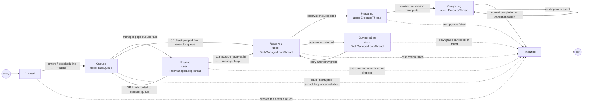

# Task FSM

Source: [src/task.rs](src/task.rs)

Solid transitions are the regular scheduling/execution path. Dashed transitions
are cleanup, cancellation, or failure paths that terminate the FSM through
`finalizing`.
